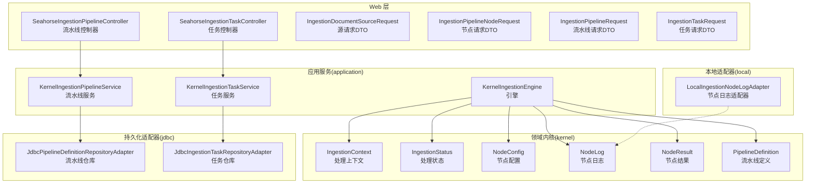
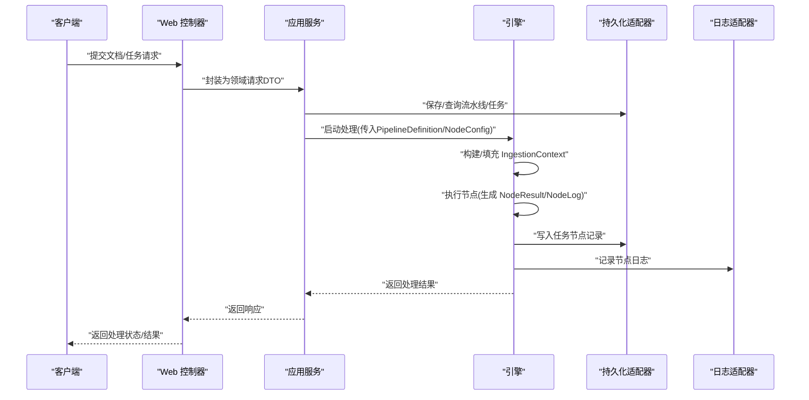
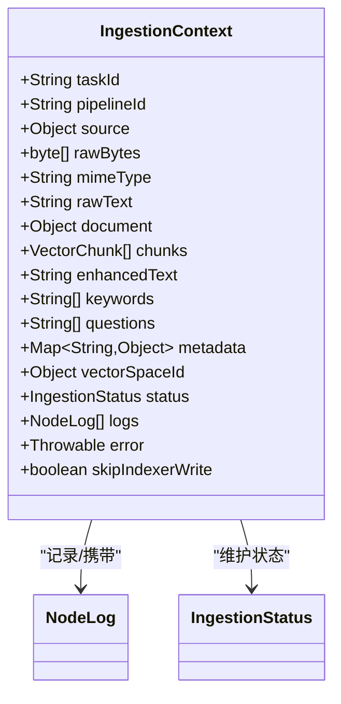
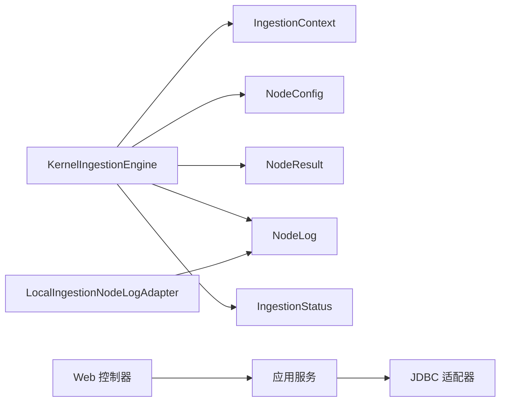
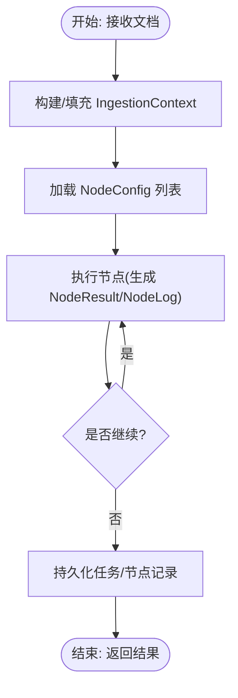

# 文档处理领域模型

<cite>
**本文引用的文件**
- [IngestionContext.java](file://seahorse-agent-kernel/src/main/java/com/miracle/ai/seahorse/agent/kernel/domain/ingestion/IngestionContext.java)
- [IngestionStatus.java](file://seahorse-agent-kernel/src/main/java/com/miracle/ai/seahorse/agent/kernel/domain/ingestion/IngestionStatus.java)
- [NodeConfig.java](file://seahorse-agent-kernel/src/main/java/com/miracle/ai/seahorse/agent/kernel/domain/ingestion/NodeConfig.java)
- [NodeLog.java](file://seahorse-agent-kernel/src/main/java/com/miracle/ai/seahorse/agent/kernel/domain/ingestion/NodeLog.java)
- [NodeResult.java](file://seahorse-agent-kernel/src/main/java/com/miracle/ai/seahorse/agent/kernel/domain/ingestion/NodeResult.java)
- [PipelineDefinition.java](file://seahorse-agent-kernel/src/main/java/com/miracle/ai/seahorse/agent/kernel/domain/ingestion/PipelineDefinition.java)
- [IngestionPipelineRecord.java](file://seahorse-agent-kernel/src/main/java/com/miracle/ai/seahorse/agent/ports/outbound/ingestion/IngestionPipelineRecord.java)
- [IngestionTaskRecord.java](file://seahorse-agent-kernel/src/main/java/com/miracle/ai/seahorse/agent/ports/outbound/ingestion/IngestionTaskRecord.java)
- [IngestionTaskNodeRecord.java](file://seahorse-agent-kernel/src/main/java/com/miracle/ai/seahorse/agent/ports/outbound/ingestion/IngestionTaskNodeRecord.java)
- [IngestionTaskNodeValues.java](file://seahorse-agent-kernel/src/main/java/com/miracle/ai/seahorse/agent/ports/outbound/ingestion/IngestionTaskNodeValues.java)
- [KernelIngestionEngine.java](file://seahorse-agent-kernel/src/main/java/com/miracle/ai/seahorse/agent/kernel/application/ingestion/KernelIngestionEngine.java)
- [KernelIngestionPipelineService.java](file://seahorse-agent-kernel/src/main/java/com/miracle/ai/seahorse/agent/kernel/application/ingestion/KernelIngestionPipelineService.java)
- [KernelIngestionTaskService.java](file://seahorse-agent-kernel/src/main/java/com/miracle/ai/seahorse/agent/kernel/application/ingestion/KernelIngestionTaskService.java)
- [JdbcPipelineDefinitionRepositoryAdapter.java](file://seahorse-agent-adapter-repository-jdbc/src/main/java/com/miracle/ai/seahorse/agent/adapters/repository/jdbc/JdbcPipelineDefinitionRepositoryAdapter.java)
- [JdbcIngestionTaskRepositoryAdapter.java](file://seahorse-agent-adapter-repository-jdbc/src/main/java/com/miracle/ai/seahorse/agent/adapters/repository/jdbc/JdbcIngestionTaskRepositoryAdapter.java)
- [LocalIngestionNodeLogAdapter.java](file://seahorse-agent-adapter-web/src/main/java/com/miracle/ai/seahorse/agent/adapters/local/LocalIngestionNodeLogAdapter.java)
- [SeahorseIngestionPipelineController.java](file://seahorse-agent-adapter-web/src/main/java/com/miracle/ai/seahorse/agent/adapters/web/SeahorseIngestionPipelineController.java)
- [SeahorseIngestionTaskController.java](file://seahorse-agent-adapter-web/src/main/java/com/miracle/ai/seahorse/agent/adapters/web/SeahorseIngestionTaskController.java)
- [IngestionDocumentSourceRequest.java](file://seahorse-agent-adapter-web/src/main/java/com/miracle/ai/seahorse/agent/adapters/web/IngestionDocumentSourceRequest.java)
- [IngestionPipelineNodeRequest.java](file://seahorse-agent-adapter-web/src/main/java/com/miracle/ai/seahorse/agent/adapters/web/IngestionPipelineNodeRequest.java)
- [IngestionPipelineRequest.java](file://seahorse-agent-adapter-web/src/main/java/com/miracle/ai/seahorse/agent/adapters/web/IngestionPipelineRequest.java)
- [IngestionTaskRequest.java](file://seahorse-agent-adapter-web/src/main/java/com/miracle/ai/seahorse/agent/adapters/web/IngestionTaskRequest.java)
</cite>

## 目录
1. [引言](#引言)
2. [项目结构](#项目结构)
3. [核心组件](#核心组件)
4. [架构总览](#架构总览)
5. [详细组件分析](#详细组件分析)
6. [依赖分析](#依赖分析)
7. [性能考虑](#性能考虑)
8. [故障排查指南](#故障排查指南)
9. [结论](#结论)
10. [附录](#附录)

## 引言
本文件面向“文档处理领域模型”的技术文档，聚焦于文档从上传到向量化入库的完整流水线。围绕以下核心领域模型展开：IngestionContext（处理上下文）、IngestionStatus（处理状态枚举）、NodeConfig（节点配置）、NodeLog（节点日志）、NodeResult（节点结果）、PipelineDefinition（流水线定义）。文档将阐明各模型在处理流程中的职责、属性语义与业务逻辑，并通过图示展示它们在端到端处理链路中的协作关系与数据流转。

## 项目结构
该系统采用分层与端口适配器架构，核心领域模型位于 kernel 模块，应用服务封装业务编排，Web 层提供请求 DTO，JDBC 适配器负责持久化，本地适配器负责日志与回调等。

图表来源
- [IngestionContext.java:30-51](file://seahorse-agent-kernel/src/main/java/com/miracle/ai/seahorse/agent/kernel/domain/ingestion/IngestionContext.java#L30-L51)
- [IngestionStatus.java:1-200](file://seahorse-agent-kernel/src/main/java/com/miracle/ai/seahorse/agent/kernel/domain/ingestion/IngestionStatus.java#L1-L200)
- [NodeConfig.java:26-40](file://seahorse-agent-kernel/src/main/java/com/miracle/ai/seahorse/agent/kernel/domain/ingestion/NodeConfig.java#L26-L40)
- [NodeLog.java:27-43](file://seahorse-agent-kernel/src/main/java/com/miracle/ai/seahorse/agent/kernel/domain/ingestion/NodeLog.java#L27-L43)
- [NodeResult.java:25-63](file://seahorse-agent-kernel/src/main/java/com/miracle/ai/seahorse/agent/kernel/domain/ingestion/NodeResult.java#L25-L63)
- [PipelineDefinition.java:1-200](file://seahorse-agent-kernel/src/main/java/com/miracle/ai/seahorse/agent/kernel/domain/ingestion/PipelineDefinition.java#L1-L200)
- [KernelIngestionEngine.java:1-200](file://seahorse-agent-kernel/src/main/java/com/miracle/ai/seahorse/agent/kernel/application/ingestion/KernelIngestionEngine.java#L1-L200)
- [KernelIngestionPipelineService.java:1-200](file://seahorse-agent-kernel/src/main/java/com/miracle/ai/seahorse/agent/kernel/application/ingestion/KernelIngestionPipelineService.java#L1-L200)
- [KernelIngestionTaskService.java:1-200](file://seahorse-agent-kernel/src/main/java/com/miracle/ai/seahorse/agent/kernel/application/ingestion/KernelIngestionTaskService.java#L1-L200)
- [JdbcPipelineDefinitionRepositoryAdapter.java:1-300](file://seahorse-agent-adapter-repository-jdbc/src/main/java/com/miracle/ai/seahorse/agent/adapters/repository/jdbc/JdbcPipelineDefinitionRepositoryAdapter.java#L1-L300)
- [JdbcIngestionTaskRepositoryAdapter.java:1-300](file://seahorse-agent-adapter-repository-jdbc/src/main/java/com/miracle/ai/seahorse/agent/adapters/repository/jdbc/JdbcIngestionTaskRepositoryAdapter.java#L1-L300)
- [LocalIngestionNodeLogAdapter.java:1-100](file://seahorse-agent-adapter-web/src/main/java/com/miracle/ai/seahorse/agent/adapters/local/LocalIngestionNodeLogAdapter.java#L1-L100)
- [SeahorseIngestionPipelineController.java:1-200](file://seahorse-agent-adapter-web/src/main/java/com/miracle/ai/seahorse/agent/adapters/web/SeahorseIngestionPipelineController.java#L1-L200)
- [SeahorseIngestionTaskController.java:1-200](file://seahorse-agent-adapter-web/src/main/java/com/miracle/ai/seahorse/agent/adapters/web/SeahorseIngestionTaskController.java#L1-L200)

章节来源
- [KernelIngestionEngine.java:1-200](file://seahorse-agent-kernel/src/main/java/com/miracle/ai/seahorse/agent/kernel/application/ingestion/KernelIngestionEngine.java#L1-L200)
- [KernelIngestionPipelineService.java:1-200](file://seahorse-agent-kernel/src/main/java/com/miracle/ai/seahorse/agent/kernel/application/ingestion/KernelIngestionPipelineService.java#L1-L200)
- [KernelIngestionTaskService.java:1-200](file://seahorse-agent-kernel/src/main/java/com/miracle/ai/seahorse/agent/kernel/application/ingestion/KernelIngestionTaskService.java#L1-L200)

## 核心组件
本节对六大核心领域模型进行深入解析，涵盖职责、关键属性与典型用法。

- IngestionContext（处理上下文）
  - 职责：承载一次文档处理全流程的共享状态，贯穿所有节点执行阶段。
  - 关键属性：任务标识、流水线标识、原始源对象、原始字节、MIME 类型、原始文本、文档对象、切片列表、增强文本、关键词、问题、元数据、向量空间标识、当前状态、节点日志、异常、是否跳过写入索引等。
  - 业务意义：作为节点间的数据载体，统一管理输入输出与中间态，支持错误传播与可观测性。

- IngestionStatus（处理状态）
  - 职责：表示文档处理阶段或任务的整体状态，用于控制流程走向与可视化展示。
  - 关键属性：通常包含待处理、处理中、已完成、失败、已取消等枚举值。
  - 业务意义：驱动分支决策（如条件节点）与 UI 展示。

- NodeConfig（节点配置）
  - 职责：描述流水线节点的类型、设置、条件与下一节点。
  - 关键属性：节点标识、节点类型、设置 JSON、条件 JSON、下一节点标识。
  - 业务意义：定义节点行为与拓扑关系，支持动态配置与运行时决策。

- NodeLog（节点日志）
  - 职责：记录单个节点的执行日志，便于审计与排障。
  - 关键属性：节点标识、节点类型、消息、耗时、成功标志、错误信息、输出对象。
  - 业务意义：提供可追溯的执行轨迹与性能指标。

- NodeResult（节点结果）
  - 职责：封装节点执行结果，决定是否继续后续节点。
  - 关键属性：成功标志、是否继续、消息、异常。
  - 业务意义：统一节点返回语义，支持短路、跳过与终止。

- PipelineDefinition（流水线定义）
  - 职责：描述完整的处理链路拓扑与节点配置集合。
  - 关键属性：流水线标识、名称、描述、创建者、创建/更新时间、节点列表。
  - 业务意义：作为蓝图驱动引擎按序执行节点。

章节来源
- [IngestionContext.java:27-51](file://seahorse-agent-kernel/src/main/java/com/miracle/ai/seahorse/agent/kernel/domain/ingestion/IngestionContext.java#L27-L51)
- [IngestionStatus.java:1-200](file://seahorse-agent-kernel/src/main/java/com/miracle/ai/seahorse/agent/kernel/domain/ingestion/IngestionStatus.java#L1-L200)
- [NodeConfig.java:26-40](file://seahorse-agent-kernel/src/main/java/com/miracle/ai/seahorse/agent/kernel/domain/ingestion/NodeConfig.java#L26-L40)
- [NodeLog.java:27-43](file://seahorse-agent-kernel/src/main/java/com/miracle/ai/seahorse/agent/kernel/domain/ingestion/NodeLog.java#L27-L43)
- [NodeResult.java:25-63](file://seahorse-agent-kernel/src/main/java/com/miracle/ai/seahorse/agent/kernel/domain/ingestion/NodeResult.java#L25-L63)
- [PipelineDefinition.java:1-200](file://seahorse-agent-kernel/src/main/java/com/miracle/ai/seahorse/agent/kernel/domain/ingestion/PipelineDefinition.java#L1-L200)

## 架构总览
下图展示了从 Web 请求到引擎执行再到持久化的整体链路，以及各领域模型在其中的角色与交互。

图表来源
- [SeahorseIngestionPipelineController.java:1-200](file://seahorse-agent-adapter-web/src/main/java/com/miracle/ai/seahorse/agent/adapters/web/SeahorseIngestionPipelineController.java#L1-L200)
- [SeahorseIngestionTaskController.java:1-200](file://seahorse-agent-adapter-web/src/main/java/com/miracle/ai/seahorse/agent/adapters/web/SeahorseIngestionTaskController.java#L1-L200)
- [KernelIngestionEngine.java:1-200](file://seahorse-agent-kernel/src/main/java/com/miracle/ai/seahorse/agent/kernel/application/ingestion/KernelIngestionEngine.java#L1-L200)
- [JdbcPipelineDefinitionRepositoryAdapter.java:1-300](file://seahorse-agent-adapter-repository-jdbc/src/main/java/com/miracle/ai/seahorse/agent/adapters/repository/jdbc/JdbcPipelineDefinitionRepositoryAdapter.java#L1-L300)
- [JdbcIngestionTaskRepositoryAdapter.java:1-300](file://seahorse-agent-adapter-repository-jdbc/src/main/java/com/miracle/ai/seahorse/agent/adapters/repository/jdbc/JdbcIngestionTaskRepositoryAdapter.java#L1-L300)
- [LocalIngestionNodeLogAdapter.java:1-100](file://seahorse-agent-adapter-web/src/main/java/com/miracle/ai/seahorse/agent/adapters/local/LocalIngestionNodeLogAdapter.java#L1-L100)

## 详细组件分析

### 处理上下文 IngestionContext
- 角色定位：跨节点共享的状态容器，承载输入、中间态与输出。
- 数据流要点：
  - 输入：源对象、原始字节、MIME 类型、原始文本。
  - 中间态：文档对象、切片列表、增强文本、关键词、问题、元数据。
  - 输出：向量空间标识、最终状态、节点日志、异常。
- 与其它模型的关系：
  - 由引擎根据 PipelineDefinition 与 NodeConfig 构建并填充。
  - 与 NodeLog/NodeResult 协作完成可观测性与流程控制。
  - 与 IngestionStatus 配合实现状态机推进。

图表来源
- [IngestionContext.java:30-51](file://seahorse-agent-kernel/src/main/java/com/miracle/ai/seahorse/agent/kernel/domain/ingestion/IngestionContext.java#L30-L51)
- [NodeLog.java:27-43](file://seahorse-agent-kernel/src/main/java/com/miracle/ai/seahorse/agent/kernel/domain/ingestion/NodeLog.java#L27-L43)
- [IngestionStatus.java:1-200](file://seahorse-agent-kernel/src/main/java/com/miracle/ai/seahorse/agent/kernel/domain/ingestion/IngestionStatus.java#L1-L200)

章节来源
- [IngestionContext.java:27-51](file://seahorse-agent-kernel/src/main/java/com/miracle/ai/seahorse/agent/kernel/domain/ingestion/IngestionContext.java#L27-L51)

### 处理状态 IngestionStatus
- 角色定位：流程状态枚举，用于控制节点执行顺序与 UI 展示。
- 建议字段：待处理、处理中、已完成、失败、已取消、跳过等。
- 与上下文关系：IngestionContext.status 与 NodeResult.success/shouldContinue 共同决定下一步。

章节来源
- [IngestionStatus.java:1-200](file://seahorse-agent-kernel/src/main/java/com/miracle/ai/seahorse/agent/kernel/domain/ingestion/IngestionStatus.java#L1-L200)

### 节点配置 NodeConfig
- 角色定位：定义节点类型、参数、条件与下一节点。
- 关键点：settings/condition 使用 JSON 结构，便于动态扩展；nextNodeId 支持有向无环图式拓扑。
- 与流水线关系：PipelineDefinition 由多个 NodeConfig 组成，形成执行序列或分支。

章节来源
- [NodeConfig.java:26-40](file://seahorse-agent-kernel/src/main/java/com/miracle/ai/seahorse/agent/kernel/domain/ingestion/NodeConfig.java#L26-L40)

### 节点日志 NodeLog
- 角色定位：记录节点执行详情，支持审计与排障。
- 关键点：包含耗时、成功标志、错误信息与输出对象，便于性能与质量分析。

章节来源
- [NodeLog.java:27-43](file://seahorse-agent-kernel/src/main/java/com/miracle/ai/seahorse/agent/kernel/domain/ingestion/NodeLog.java#L27-L43)

### 节点结果 NodeResult
- 角色定位：统一节点返回语义，决定流程是否继续。
- 关键点：ok/skip/fail/terminate 提供明确的控制信号；结合 IngestionStatus 实现状态机。

章节来源
- [NodeResult.java:25-63](file://seahorse-agent-kernel/src/main/java/com/miracle/ai/seahorse/agent/kernel/domain/ingestion/NodeResult.java#L25-L63)

### 流水线定义 PipelineDefinition
- 角色定位：描述完整的处理链路拓扑与节点配置集合。
- 关键点：与 IngestionPipelineRecord 对应，后者是持久化层的记录对象。
- 与应用服务关系：KernelIngestionPipelineService 负责创建/更新/查询流水线定义。

章节来源
- [PipelineDefinition.java:1-200](file://seahorse-agent-kernel/src/main/java/com/miracle/ai/seahorse/agent/kernel/domain/ingestion/PipelineDefinition.java#L1-L200)
- [IngestionPipelineRecord.java:24-92](file://seahorse-agent-kernel/src/main/java/com/miracle/ai/seahorse/agent/ports/outbound/ingestion/IngestionPipelineRecord.java#L24-L92)

### 应用服务与控制器
- KernelIngestionEngine：核心执行引擎，协调上下文、节点配置、结果与日志。
- KernelIngestionPipelineService：管理流水线定义的生命周期。
- KernelIngestionTaskService：管理任务与节点执行记录。
- Web 控制器：接收前端请求，转换为领域请求 DTO，调用应用服务。

章节来源
- [KernelIngestionEngine.java:1-200](file://seahorse-agent-kernel/src/main/java/com/miracle/ai/seahorse/agent/kernel/application/ingestion/KernelIngestionEngine.java#L1-L200)
- [KernelIngestionPipelineService.java:1-200](file://seahorse-agent-kernel/src/main/java/com/miracle/ai/seahorse/agent/kernel/application/ingestion/KernelIngestionPipelineService.java#L1-L200)
- [KernelIngestionTaskService.java:1-200](file://seahorse-agent-kernel/src/main/java/com/miracle/ai/seahorse/agent/kernel/application/ingestion/KernelIngestionTaskService.java#L1-L200)
- [SeahorseIngestionPipelineController.java:1-200](file://seahorse-agent-adapter-web/src/main/java/com/miracle/ai/seahorse/agent/adapters/web/SeahorseIngestionPipelineController.java#L1-L200)
- [SeahorseIngestionTaskController.java:1-200](file://seahorse-agent-adapter-web/src/main/java/com/miracle/ai/seahorse/agent/adapters/web/SeahorseIngestionTaskController.java#L1-L200)

### 请求 DTO 与持久化适配器
- Web 请求 DTO：IngestionDocumentSourceRequest、IngestionPipelineNodeRequest、IngestionPipelineRequest、IngestionTaskRequest。
- JDBC 适配器：JdbcPipelineDefinitionRepositoryAdapter、JdbcIngestionTaskRepositoryAdapter，负责流水线与任务记录的持久化。
- 本地适配器：LocalIngestionNodeLogAdapter，负责节点日志的本地落盘或上报。

章节来源
- [IngestionDocumentSourceRequest.java:1-100](file://seahorse-agent-adapter-web/src/main/java/com/miracle/ai/seahorse/agent/adapters/web/IngestionDocumentSourceRequest.java#L1-L100)
- [IngestionPipelineNodeRequest.java:1-100](file://seahorse-agent-adapter-web/src/main/java/com/miracle/ai/seahorse/agent/adapters/web/IngestionPipelineNodeRequest.java#L1-L100)
- [IngestionPipelineRequest.java:1-100](file://seahorse-agent-adapter-web/src/main/java/com/miracle/ai/seahorse/agent/adapters/web/IngestionPipelineRequest.java#L1-L100)
- [IngestionTaskRequest.java:1-100](file://seahorse-agent-adapter-web/src/main/java/com/miracle/ai/seahorse/agent/adapters/web/IngestionTaskRequest.java#L1-L100)
- [JdbcPipelineDefinitionRepositoryAdapter.java:1-300](file://seahorse-agent-adapter-repository-jdbc/src/main/java/com/miracle/ai/seahorse/agent/adapters/repository/jdbc/JdbcPipelineDefinitionRepositoryAdapter.java#L1-L300)
- [JdbcIngestionTaskRepositoryAdapter.java:1-300](file://seahorse-agent-adapter-repository-jdbc/src/main/java/com/miracle/ai/seahorse/agent/adapters/repository/jdbc/JdbcIngestionTaskRepositoryAdapter.java#L1-L300)
- [LocalIngestionNodeLogAdapter.java:1-100](file://seahorse-agent-adapter-web/src/main/java/com/miracle/ai/seahorse/agent/adapters/local/LocalIngestionNodeLogAdapter.java#L1-L100)

## 依赖分析
- 内聚性：领域模型内聚于文档处理场景，职责清晰，耦合度低。
- 耦合关系：
  - 引擎依赖上下文、配置、结果与日志模型。
  - 应用服务依赖持久化适配器以存取流水线与任务记录。
  - Web 层仅依赖应用服务与请求 DTO，不直接操作领域模型。
- 外部依赖：JDBC 适配器依赖数据库表结构；本地适配器依赖外部存储或服务。

图表来源
- [KernelIngestionEngine.java:1-200](file://seahorse-agent-kernel/src/main/java/com/miracle/ai/seahorse/agent/kernel/application/ingestion/KernelIngestionEngine.java#L1-L200)
- [JdbcPipelineDefinitionRepositoryAdapter.java:1-300](file://seahorse-agent-adapter-repository-jdbc/src/main/java/com/miracle/ai/seahorse/agent/adapters/repository/jdbc/JdbcPipelineDefinitionRepositoryAdapter.java#L1-L300)
- [JdbcIngestionTaskRepositoryAdapter.java:1-300](file://seahorse-agent-adapter-repository-jdbc/src/main/java/com/miracle/ai/seahorse/agent/adapters/repository/jdbc/JdbcIngestionTaskRepositoryAdapter.java#L1-L300)
- [LocalIngestionNodeLogAdapter.java:1-100](file://seahorse-agent-adapter-web/src/main/java/com/miracle/ai/seahorse/agent/adapters/local/LocalIngestionNodeLogAdapter.java#L1-L100)

## 性能考虑
- 上下文复用：避免重复解析与转换，尽量在上游节点生成并传递中间态。
- 日志粒度：合理控制 NodeLog 的输出规模，避免大对象频繁序列化。
- 批量写入：任务节点记录建议批量持久化，减少事务开销。
- 并发控制：在多节点并行场景下，确保上下文访问的线程安全与一致性。

## 故障排查指南
- 常见问题定位：
  - 节点失败：检查 NodeResult.error 与 NodeLog.error，结合 IngestionContext.error 定位根因。
  - 状态异常：核对 IngestionStatus 与 NodeResult.shouldContinue 是否一致。
  - 配置错误：校验 NodeConfig.settings/condition 的 JSON 结构与节点类型匹配。
- 排查步骤：
  1) 查看任务记录 IngestionTaskRecord 的状态与耗时。
  2) 回溯节点记录 IngestionTaskNodeRecord 的消息与错误。
  3) 检查持久化适配器的 SQL 与表结构是否正确。
  4) 核对 Web 控制器请求 DTO 字段映射。

章节来源
- [IngestionTaskRecord.java:1-200](file://seahorse-agent-kernel/src/main/java/com/miracle/ai/seahorse/agent/ports/outbound/ingestion/IngestionTaskRecord.java#L1-L200)
- [IngestionTaskNodeRecord.java:1-200](file://seahorse-agent-kernel/src/main/java/com/miracle/ai/seahorse/agent/ports/outbound/ingestion/IngestionTaskNodeRecord.java#L1-L200)
- [JdbcIngestionTaskRepositoryAdapter.java:1-300](file://seahorse-agent-adapter-repository-jdbc/src/main/java/com/miracle/ai/seahorse/agent/adapters/repository/jdbc/JdbcIngestionTaskRepositoryAdapter.java#L1-L300)

## 结论
本文档系统梳理了文档处理领域模型的设计与协作关系，明确了 IngestionContext、IngestionStatus、NodeConfig、NodeLog、NodeResult、PipelineDefinition 在端到端处理链路中的职责与数据流转。通过清晰的模型边界与稳定的端口契约，系统实现了高内聚、低耦合的文档处理流水线，既满足功能需求，又具备良好的可维护性与扩展性。

## 附录
- 概念性流程图（概念性，非代码映射）

