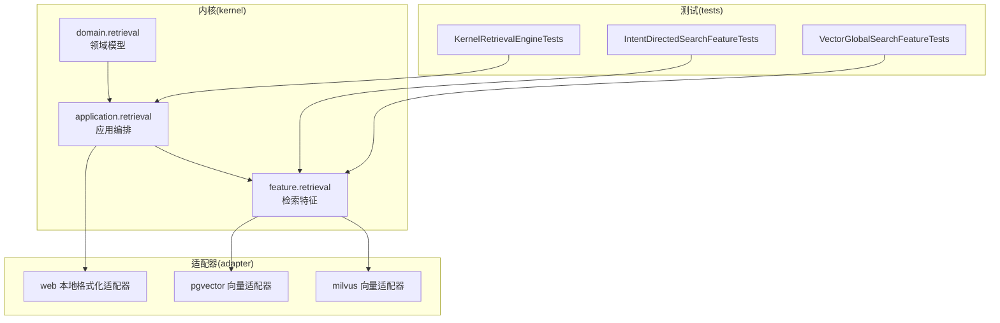
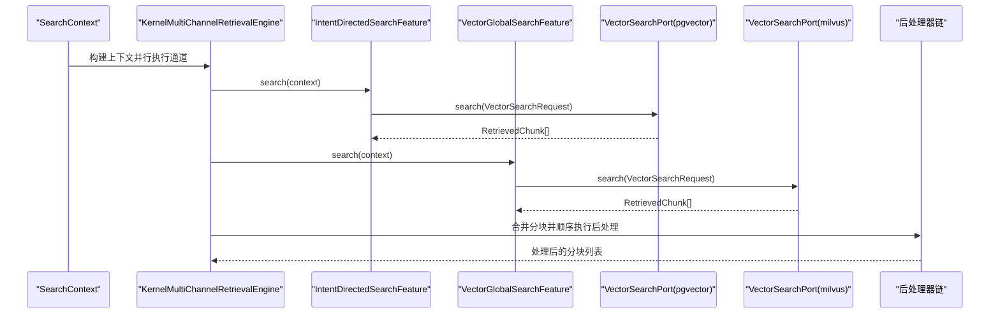
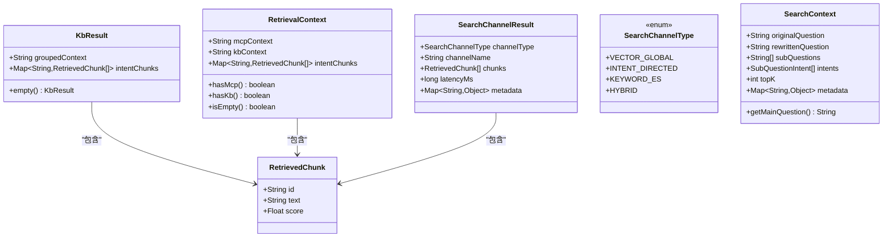
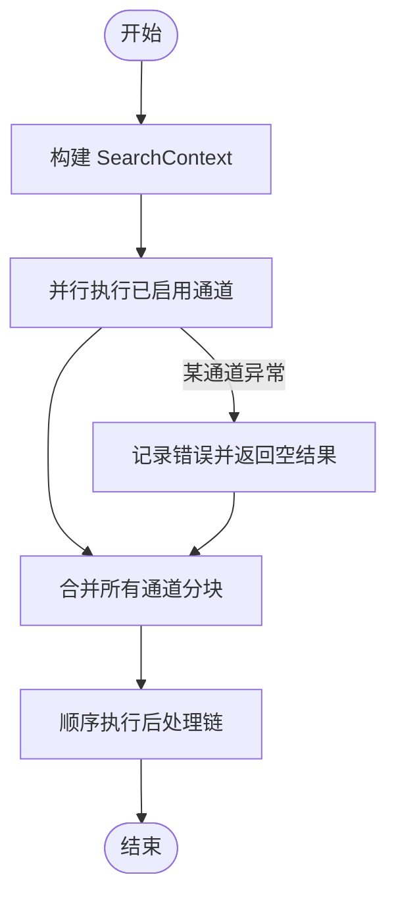
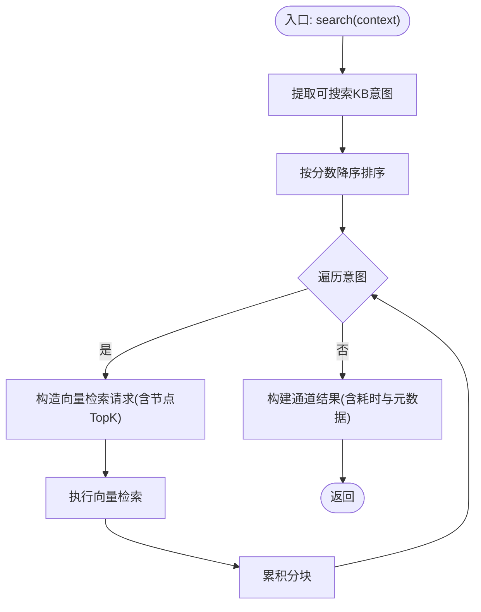
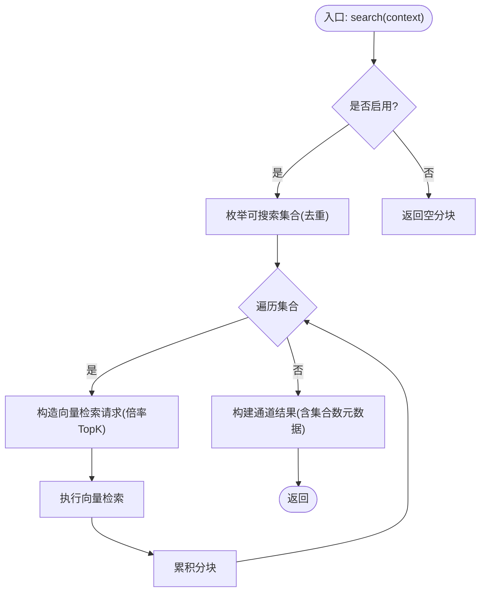
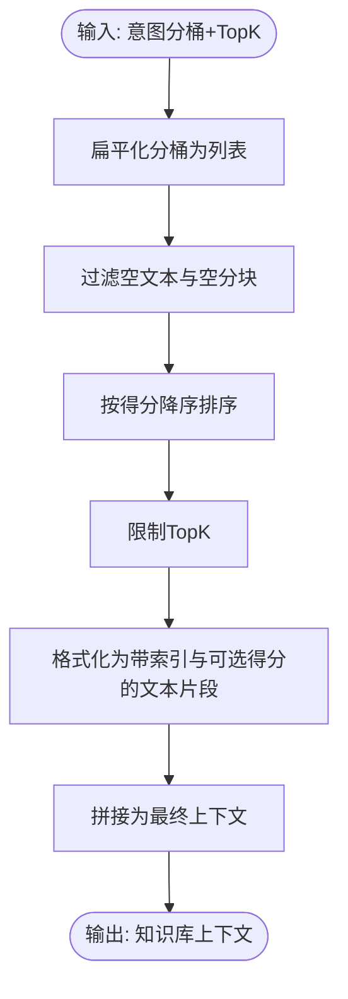
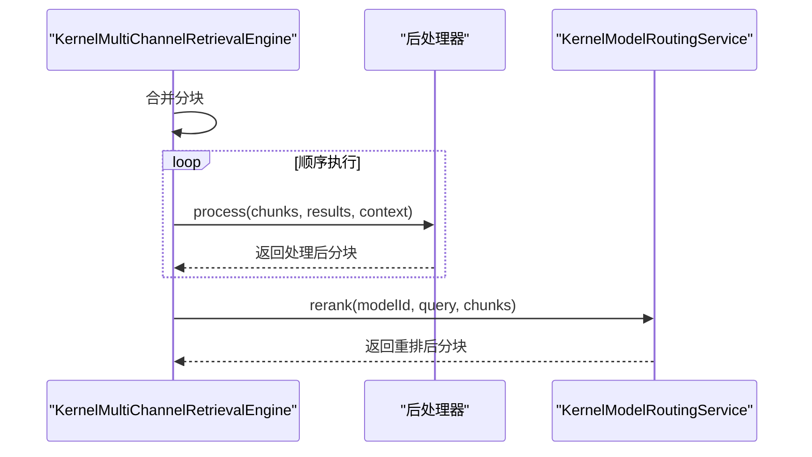
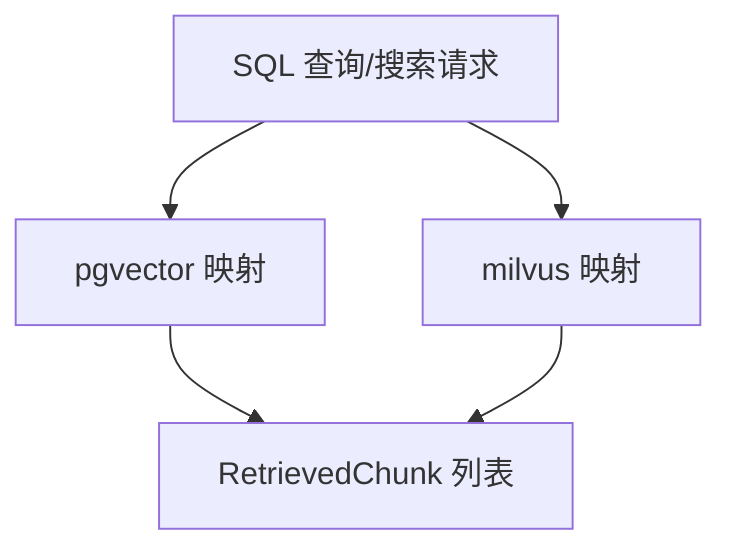
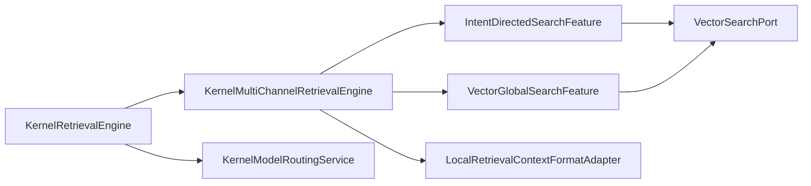

# 检索领域模型

<cite>
**本文档引用的文件**
- [KbResult.java](file://seahorse-agent-kernel/src/main/java/com/miracle/ai/seahorse/agent/kernel/domain/retrieval/KbResult.java)
- [KernelRagDefaults.java](file://seahorse-agent-kernel/src/main/java/com/miracle/ai/seahorse/agent/kernel/domain/retrieval/KernelRagDefaults.java)
- [RetrievalContext.java](file://seahorse-agent-kernel/src/main/java/com/miracle/ai/seahorse/agent/kernel/domain/retrieval/RetrievalContext.java)
- [RetrievedChunk.java](file://seahorse-agent-kernel/src/main/java/com/miracle/ai/seahorse/agent/kernel/domain/retrieval/RetrievedChunk.java)
- [SearchChannelResult.java](file://seahorse-agent-kernel/src/main/java/com/miracle/ai/seahorse/agent/kernel/domain/retrieval/SearchChannelResult.java)
- [SearchChannelType.java](file://seahorse-agent-kernel/src/main/java/com/miracle/ai/seahorse/agent/kernel/domain/retrieval/SearchChannelType.java)
- [SearchContext.java](file://seahorse-agent-kernel/src/main/java/com/miracle/ai/seahorse/agent/kernel/domain/retrieval/SearchContext.java)
- [KernelRetrievalEngine.java](file://seahorse-agent-kernel/src/main/java/com/miracle/ai/seahorse/agent/kernel/application/retrieval/KernelRetrievalEngine.java)
- [KernelMultiChannelRetrievalEngine.java](file://seahorse-agent-kernel/src/main/java/com/miracle/ai/seahorse/agent/kernel/application/retrieval/KernelMultiChannelRetrievalEngine.java)
- [IntentDirectedSearchFeature.java](file://seahorse-agent-kernel/src/main/java/com/miracle/ai/seahorse/agent/kernel/feature/retrieval/IntentDirectedSearchFeature.java)
- [VectorGlobalSearchFeature.java](file://seahorse-agent-kernel/src/main/java/com/miracle/ai/seahorse/agent/kernel/feature/retrieval/VectorGlobalSearchFeature.java)
- [LocalRetrievalContextFormatAdapter.java](file://seahorse-agent-adapter-web/src/main/java/com/miracle/ai/seahorse/agent/adapters/local/LocalRetrievalContextFormatAdapter.java)
- [KernelModelRoutingService.java](file://seahorse-agent-kernel/src/main/java/com/miracle/ai/seahorse/agent/kernel/application/model/KernelModelRoutingService.java)
- [PgVectorAdapter.java](file://seahorse-agent-adapter-vector-pgvector/src/main/java/com/miracle/ai/seahorse/agent/adapters/vector/pgvector/PgVectorAdapter.java)
- [MilvusVectorAdapter.java](file://seahorse-agent-adapter-vector-milvus/src/main/java/com/miracle/ai/seahorse/agent/adapters/vector/milvus/MilvusVectorAdapter.java)
- [KernelRetrievalEngineTests.java](file://seahorse-agent-tests/src/test/java/com/miracle/ai/seahorse/agent/kernel/feature/retrieval/KernelRetrievalEngineTests.java)
- [IntentDirectedSearchFeatureTests.java](file://seahorse-agent-tests/src/test/java/com/miracle/ai/seahorse/agent/kernel/feature/retrieval/IntentDirectedSearchFeatureTests.java)
- [VectorGlobalSearchFeatureTests.java](file://seahorse-agent-tests/src/test/java/com/miracle/ai/seahorse/agent/kernel/feature/retrieval/VectorGlobalSearchFeatureTests.java)
</cite>

## 目录
1. [简介](#简介)
2. [项目结构](#项目结构)
3. [核心组件](#核心组件)
4. [架构总览](#架构总览)
5. [详细组件分析](#详细组件分析)
6. [依赖关系分析](#依赖关系分析)
7. [性能考量](#性能考量)
8. [故障排查指南](#故障排查指南)
9. [结论](#结论)

## 简介
本文件系统性梳理检索领域的领域模型与实现，覆盖知识库结果(KbResult)、RAG默认配置(KernelRagDefaults)、检索上下文(RetrievalContext)、检索到的分块(RetrievedChunk)、搜索通道结果(SearchChannelResult)、搜索通道类型(SearchChannelType)、搜索上下文(SearchContext)等核心模型。重点阐述向量检索、意图导向搜索、多通道检索的模型抽象与数据结构，以及检索结果的格式化、排序与后处理机制。

## 项目结构
检索相关代码主要分布在内核(kernel)与适配器(adapter)两部分：
- 领域模型与应用层：位于 seahorse-agent-kernel 模块的 domain 与 application 包中
- 特征实现与适配器：位于 seahorse-agent-kernel 的 feature 包与各适配器模块
- 测试用例：位于 seahorse-agent-tests 模块，验证检索行为与边界条件

**图表来源**
- [KernelRetrievalEngine.java:1-166](file://seahorse-agent-kernel/src/main/java/com/miracle/ai/seahorse/agent/kernel/application/retrieval/KernelRetrievalEngine.java#L1-L166)
- [IntentDirectedSearchFeature.java:1-210](file://seahorse-agent-kernel/src/main/java/com/miracle/ai/seahorse/agent/kernel/feature/retrieval/IntentDirectedSearchFeature.java#L1-L210)
- [VectorGlobalSearchFeature.java:1-159](file://seahorse-agent-kernel/src/main/java/com/miracle/ai/seahorse/agent/kernel/feature/retrieval/VectorGlobalSearchFeature.java#L1-L159)
- [LocalRetrievalContextFormatAdapter.java:1-104](file://seahorse-agent-adapter-web/src/main/java/com/miracle/ai/seahorse/agent/adapters/local/LocalRetrievalContextFormatAdapter.java#L1-L104)
- [PgVectorAdapter.java:163-186](file://seahorse-agent-adapter-vector-pgvector/src/main/java/com/miracle/ai/seahorse/agent/adapters/vector/pgvector/PgVectorAdapter.java#L163-L186)
- [MilvusVectorAdapter.java:183-190](file://seahorse-agent-adapter-vector-milvus/src/main/java/com/miracle/ai/seahorse/agent/adapters/vector/milvus/MilvusVectorAdapter.java#L183-L190)

**章节来源**
- [KernelRetrievalEngine.java:1-166](file://seahorse-agent-kernel/src/main/java/com/miracle/ai/seahorse/agent/kernel/application/retrieval/KernelRetrievalEngine.java#L1-L166)
- [KernelMultiChannelRetrievalEngine.java:1-166](file://seahorse-agent-kernel/src/main/java/com/miracle/ai/seahorse/agent/kernel/application/retrieval/KernelMultiChannelRetrievalEngine.java#L1-L166)

## 核心组件
本节对检索领域中的关键模型进行逐项解析，明确其职责、字段含义与典型用法。

- KbResult：KB 检索聚合结果，封装分组后的上下文与按意图分桶的分块映射。
- KernelRagDefaults：RAG 默认配置常量，如默认 Top-K、多通道键名、系统提示路径等。
- RetrievalContext：检索上下文，包含知识库上下文、MCP 上下文与按意图分桶的分块映射，并提供判空与来源判定方法。
- RetrievedChunk：检索到的分块，包含唯一 ID、文本内容与检索/重排得分。
- SearchChannelResult：单通道检索结果，包含通道类型、名称、返回分块、耗时与扩展元数据。
- SearchChannelType：检索通道类型枚举，涵盖向量全局、意图定向、关键词 ES、混合等。
- SearchContext：检索共享上下文，承载原始问题、改写问题、子问题、意图列表、Top-K 与元数据。

**章节来源**
- [KbResult.java:26-31](file://seahorse-agent-kernel/src/main/java/com/miracle/ai/seahorse/agent/kernel/domain/retrieval/KbResult.java#L26-L31)
- [KernelRagDefaults.java:25-32](file://seahorse-agent-kernel/src/main/java/com/miracle/ai/seahorse/agent/kernel/domain/retrieval/KernelRagDefaults.java#L25-L32)
- [RetrievalContext.java:29-50](file://seahorse-agent-kernel/src/main/java/com/miracle/ai/seahorse/agent/kernel/domain/retrieval/RetrievalContext.java#L29-L50)
- [RetrievedChunk.java:30-50](file://seahorse-agent-kernel/src/main/java/com/miracle/ai/seahorse/agent/kernel/domain/retrieval/RetrievedChunk.java#L30-L50)
- [SearchChannelResult.java:30-60](file://seahorse-agent-kernel/src/main/java/com/miracle/ai/seahorse/agent/kernel/domain/retrieval/SearchChannelResult.java#L30-L60)
- [SearchChannelType.java:23-44](file://seahorse-agent-kernel/src/main/java/com/miracle/ai/seahorse/agent/kernel/domain/retrieval/SearchChannelType.java#L23-L44)
- [SearchContext.java:33-54](file://seahorse-agent-kernel/src/main/java/com/miracle/ai/seahorse/agent/kernel/domain/retrieval/SearchContext.java#L33-L54)

## 架构总览
检索系统采用“特征驱动 + 多通道编排”的架构：
- 应用层编排器负责构建搜索上下文、并行执行已启用的检索通道、合并结果并顺序执行后处理链。
- 特征层实现具体检索策略（意图定向、向量全局等），并通过统一的向量检索端口访问底层存储。
- 适配器层提供向量化检索与上下文格式化能力，支持 pgvector、milvus 等后端。
- 结果在进入对话前经过格式化与重排（可选）以提升质量与可控性。

**图表来源**
- [KernelMultiChannelRetrievalEngine.java:68-128](file://seahorse-agent-kernel/src/main/java/com/miracle/ai/seahorse/agent/kernel/application/retrieval/KernelMultiChannelRetrievalEngine.java#L68-L128)
- [IntentDirectedSearchFeature.java:94-140](file://seahorse-agent-kernel/src/main/java/com/miracle/ai/seahorse/agent/kernel/feature/retrieval/IntentDirectedSearchFeature.java#L94-L140)
- [VectorGlobalSearchFeature.java:91-124](file://seahorse-agent-kernel/src/main/java/com/miracle/ai/seahorse/agent/kernel/feature/retrieval/VectorGlobalSearchFeature.java#L91-L124)

## 详细组件分析

### 领域模型类图

**图表来源**
- [KbResult.java:26-31](file://seahorse-agent-kernel/src/main/java/com/miracle/ai/seahorse/agent/kernel/domain/retrieval/KbResult.java#L26-L31)
- [RetrievalContext.java:29-50](file://seahorse-agent-kernel/src/main/java/com/miracle/ai/seahorse/agent/kernel/domain/retrieval/RetrievalContext.java#L29-L50)
- [RetrievedChunk.java:30-50](file://seahorse-agent-kernel/src/main/java/com/miracle/ai/seahorse/agent/kernel/domain/retrieval/RetrievedChunk.java#L30-L50)
- [SearchChannelResult.java:30-60](file://seahorse-agent-kernel/src/main/java/com/miracle/ai/seahorse/agent/kernel/domain/retrieval/SearchChannelResult.java#L30-L60)
- [SearchChannelType.java:23-44](file://seahorse-agent-kernel/src/main/java/com/miracle/ai/seahorse/agent/kernel/domain/retrieval/SearchChannelType.java#L23-L44)
- [SearchContext.java:33-54](file://seahorse-agent-kernel/src/main/java/com/miracle/ai/seahorse/agent/kernel/domain/retrieval/SearchContext.java#L33-L54)

**章节来源**
- [KbResult.java:26-31](file://seahorse-agent-kernel/src/main/java/com/miracle/ai/seahorse/agent/kernel/domain/retrieval/KbResult.java#L26-L31)
- [RetrievalContext.java:29-50](file://seahorse-agent-kernel/src/main/java/com/miracle/ai/seahorse/agent/kernel/domain/retrieval/RetrievalContext.java#L29-L50)
- [RetrievedChunk.java:30-50](file://seahorse-agent-kernel/src/main/java/com/miracle/ai/seahorse/agent/kernel/domain/retrieval/RetrievedChunk.java#L30-L50)
- [SearchChannelResult.java:30-60](file://seahorse-agent-kernel/src/main/java/com/miracle/ai/seahorse/agent/kernel/domain/retrieval/SearchChannelResult.java#L30-L60)
- [SearchChannelType.java:23-44](file://seahorse-agent-kernel/src/main/java/com/miracle/ai/seahorse/agent/kernel/domain/retrieval/SearchChannelType.java#L23-L44)
- [SearchContext.java:33-54](file://seahorse-agent-kernel/src/main/java/com/miracle/ai/seahorse/agent/kernel/domain/retrieval/SearchContext.java#L33-L54)

### 多通道检索编排器
KernelMultiChannelRetrievalEngine 负责：
- 构建 SearchContext
- 并行执行已启用的检索通道
- 通道失败时降级为空结果
- 合并所有通道返回的分块
- 顺序执行后处理链，单个后处理器失败不影响后续执行

**图表来源**
- [KernelMultiChannelRetrievalEngine.java:68-128](file://seahorse-agent-kernel/src/main/java/com/miracle/ai/seahorse/agent/kernel/application/retrieval/KernelMultiChannelRetrievalEngine.java#L68-L128)

**章节来源**
- [KernelMultiChannelRetrievalEngine.java:68-128](file://seahorse-agent-kernel/src/main/java/com/miracle/ai/seahorse/agent/kernel/application/retrieval/KernelMultiChannelRetrievalEngine.java#L68-L128)

### 意图定向检索特征
IntentDirectedSearchFeature 实现基于意图的定向检索：
- 过滤可搜索的 KB 意图，按分数降序
- 为每个意图构造向量检索请求，支持节点级 Top-K 与倍率扩召回
- 单个意图失败不影响整体结果

**图表来源**
- [IntentDirectedSearchFeature.java:94-140](file://seahorse-agent-kernel/src/main/java/com/miracle/ai/seahorse/agent/kernel/feature/retrieval/IntentDirectedSearchFeature.java#L94-L140)

**章节来源**
- [IntentDirectedSearchFeature.java:94-140](file://seahorse-agent-kernel/src/main/java/com/miracle/ai/seahorse/agent/kernel/feature/retrieval/IntentDirectedSearchFeature.java#L94-L140)
- [IntentDirectedSearchFeatureTests.java:51-72](file://seahorse-agent-tests/src/test/java/com/miracle/ai/seahorse/agent/kernel/feature/retrieval/IntentDirectedSearchFeatureTests.java#L51-L72)

### 向量全局检索特征
VectorGlobalSearchFeature 实现全局向量检索：
- 基于知识库查询端口枚举可搜索的知识库集合，去重后逐一检索
- 当意图置信度较低或单一高置信意图需要补充时启用
- 统一 Top-K 倍率扩大召回

**图表来源**
- [VectorGlobalSearchFeature.java:91-124](file://seahorse-agent-kernel/src/main/java/com/miracle/ai/seahorse/agent/kernel/feature/retrieval/VectorGlobalSearchFeature.java#L91-L124)

**章节来源**
- [VectorGlobalSearchFeature.java:91-124](file://seahorse-agent-kernel/src/main/java/com/miracle/ai/seahorse/agent/kernel/feature/retrieval/VectorGlobalSearchFeature.java#L91-L124)
- [VectorGlobalSearchFeatureTests.java:50-72](file://seahorse-agent-tests/src/test/java/com/miracle/ai/seahorse/agent/kernel/feature/retrieval/VectorGlobalSearchFeatureTests.java#L50-L72)

### 检索结果格式化与排序
本地格式化适配器负责将检索分块转换为知识库上下文字符串：
- 扁平化按意图分桶的分块
- 过滤空文本与空分块
- 按得分降序排序并限制数量
- 输出简洁稳定的格式，避免提示词体积膨胀

**图表来源**
- [LocalRetrievalContextFormatAdapter.java:41-59](file://seahorse-agent-adapter-web/src/main/java/com/miracle/ai/seahorse/agent/adapters/local/LocalRetrievalContextFormatAdapter.java#L41-L59)

**章节来源**
- [LocalRetrievalContextFormatAdapter.java:41-59](file://seahorse-agent-adapter-web/src/main/java/com/miracle/ai/seahorse/agent/adapters/local/LocalRetrievalContextFormatAdapter.java#L41-L59)

### 重排与后处理机制
- 重排服务：KernelModelRoutingService 提供 rerank 接口，选择健康模型并记录健康状态
- 后处理链：KernelMultiChannelRetrievalEngine 在合并分块后顺序执行后处理器，单个失败不影响后续

**图表来源**
- [KernelMultiChannelRetrievalEngine.java:116-140](file://seahorse-agent-kernel/src/main/java/com/miracle/ai/seahorse/agent/kernel/application/retrieval/KernelMultiChannelRetrievalEngine.java#L116-L140)
- [KernelModelRoutingService.java:134-144](file://seahorse-agent-kernel/src/main/java/com/miracle/ai/seahorse/agent/kernel/application/model/KernelModelRoutingService.java#L134-L144)

**章节来源**
- [KernelModelRoutingService.java:134-144](file://seahorse-agent-kernel/src/main/java/com/miracle/ai/seahorse/agent/kernel/application/model/KernelModelRoutingService.java#L134-L144)

### 向量检索适配器
- pgvector 适配器：从 SQL 查询结果映射 RetrievedChunk
- milvus 适配器：从搜索结果映射 RetrievedChunk

**图表来源**
- [PgVectorAdapter.java:163-186](file://seahorse-agent-adapter-vector-pgvector/src/main/java/com/miracle/ai/seahorse/agent/adapters/vector/pgvector/PgVectorAdapter.java#L163-L186)
- [MilvusVectorAdapter.java:183-190](file://seahorse-agent-adapter-vector-milvus/src/main/java/com/miracle/ai/seahorse/agent/adapters/vector/milvus/MilvusVectorAdapter.java#L183-L190)

**章节来源**
- [PgVectorAdapter.java:163-186](file://seahorse-agent-adapter-vector-pgvector/src/main/java/com/miracle/ai/seahorse/agent/adapters/vector/pgvector/PgVectorAdapter.java#L163-L186)
- [MilvusVectorAdapter.java:183-190](file://seahorse-agent-adapter-vector-milvus/src/main/java/com/miracle/ai/seahorse/agent/adapters/vector/milvus/MilvusVectorAdapter.java#L183-L190)

## 依赖关系分析
- KernelRetrievalEngine 依赖 KernelMultiChannelRetrievalEngine 与格式化端口，负责子问题维度的检索与上下文聚合
- KernelMultiChannelRetrievalEngine 通过扩展注册表发现并调度检索特征，特征通过 VectorSearchPort 访问向量存储
- 本地格式化适配器实现 RetrievalContextFormatPort，用于生成知识库上下文字符串
- KernelModelRoutingService 作为重排服务，被上层调用以提升检索质量

**图表来源**
- [KernelRetrievalEngine.java:90-107](file://seahorse-agent-kernel/src/main/java/com/miracle/ai/seahorse/agent/kernel/application/retrieval/KernelRetrievalEngine.java#L90-L107)
- [KernelMultiChannelRetrievalEngine.java:77-97](file://seahorse-agent-kernel/src/main/java/com/miracle/ai/seahorse/agent/kernel/application/retrieval/KernelMultiChannelRetrievalEngine.java#L77-L97)
- [IntentDirectedSearchFeature.java:115-140](file://seahorse-agent-kernel/src/main/java/com/miracle/ai/seahorse/agent/kernel/feature/retrieval/IntentDirectedSearchFeature.java#L115-L140)
- [VectorGlobalSearchFeature.java:116-124](file://seahorse-agent-kernel/src/main/java/com/miracle/ai/seahorse/agent/kernel/feature/retrieval/VectorGlobalSearchFeature.java#L116-L124)
- [LocalRetrievalContextFormatAdapter.java:41-59](file://seahorse-agent-adapter-web/src/main/java/com/miracle/ai/seahorse/agent/adapters/local/LocalRetrievalContextFormatAdapter.java#L41-L59)
- [KernelModelRoutingService.java:134-144](file://seahorse-agent-kernel/src/main/java/com/miracle/ai/seahorse/agent/kernel/application/model/KernelModelRoutingService.java#L134-L144)

**章节来源**
- [KernelRetrievalEngine.java:90-107](file://seahorse-agent-kernel/src/main/java/com/miracle/ai/seahorse/agent/kernel/application/retrieval/KernelRetrievalEngine.java#L90-L107)
- [KernelMultiChannelRetrievalEngine.java:77-97](file://seahorse-agent-kernel/src/main/java/com/miracle/ai/seahorse/agent/kernel/application/retrieval/KernelMultiChannelRetrievalEngine.java#L77-L97)

## 性能考量
- 并行执行：KernelMultiChannelRetrievalEngine 使用线程池并行执行多个检索通道，缩短总延迟
- 倍率扩召回：意图定向与全局向量检索均支持 Top-K 倍率，提高召回但需控制最终 Top-K 以平衡成本
- 后处理链：顺序执行，单处理器失败不影响后续，保证鲁棒性
- 重排服务：按需调用，避免不必要的重排开销

## 故障排查指南
- 通道失败降级：当某个检索通道抛出异常时，编排器会记录错误并返回空结果，确保其他通道正常工作
- 后处理器失败：单个后处理器异常会被捕获并跳过，不影响后续处理器执行
- 意图定向失败：单个意图检索异常会被吞并，不影响其他意图的检索
- 重排异常：重排服务异常会记录健康状态并向上抛出，便于定位模型侧问题

**章节来源**
- [KernelMultiChannelRetrievalEngine.java:100-106](file://seahorse-agent-kernel/src/main/java/com/miracle/ai/seahorse/agent/kernel/application/retrieval/KernelMultiChannelRetrievalEngine.java#L100-L106)
- [KernelMultiChannelRetrievalEngine.java:134-140](file://seahorse-agent-kernel/src/main/java/com/miracle/ai/seahorse/agent/kernel/application/retrieval/KernelMultiChannelRetrievalEngine.java#L134-L140)
- [IntentDirectedSearchFeature.java:136-140](file://seahorse-agent-kernel/src/main/java/com/miracle/ai/seahorse/agent/kernel/feature/retrieval/IntentDirectedSearchFeature.java#L136-L140)
- [KernelModelRoutingService.java:140-144](file://seahorse-agent-kernel/src/main/java/com/miracle/ai/seahorse/agent/kernel/application/model/KernelModelRoutingService.java#L140-L144)

## 结论
本文档系统梳理了检索领域的核心模型与实现，明确了多通道编排、意图定向与全局向量检索的抽象与数据结构，并总结了格式化、排序与后处理的关键机制。通过并行执行、失败降级与顺序后处理链，系统在保证稳定性的同时兼顾性能与可扩展性。