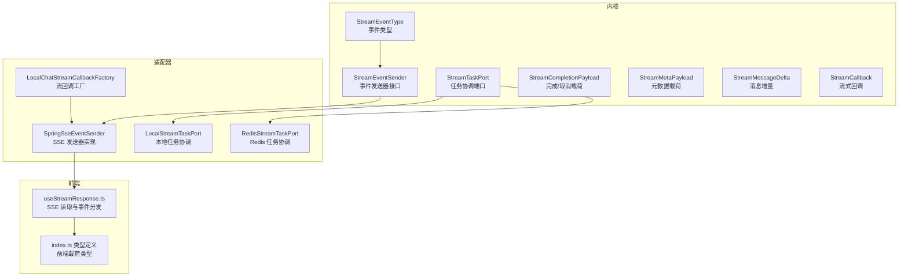
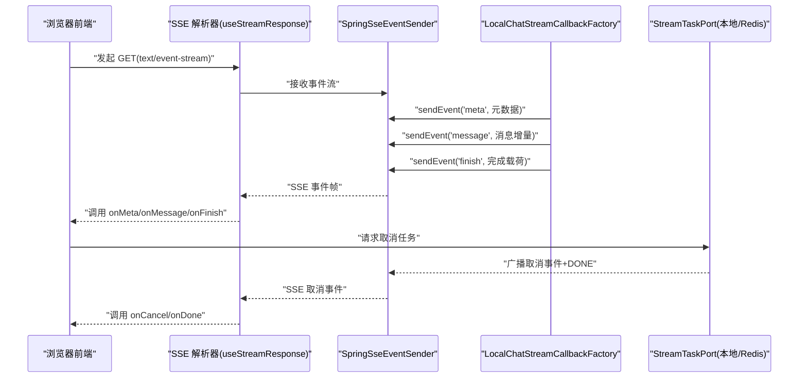
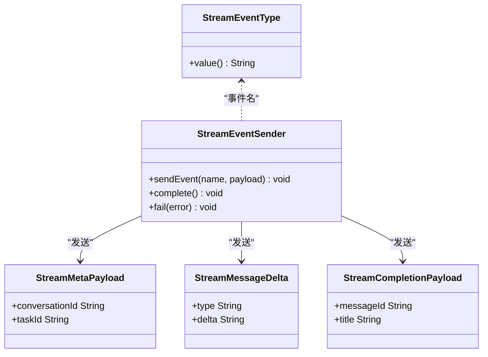
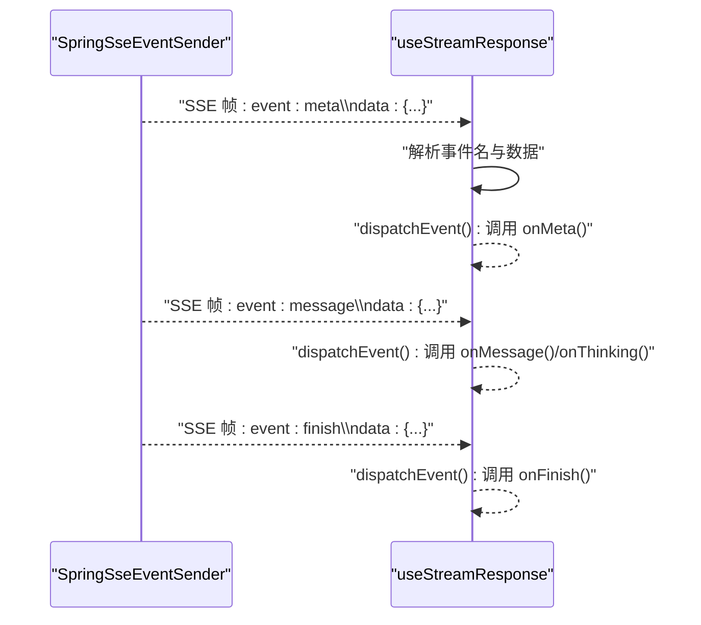
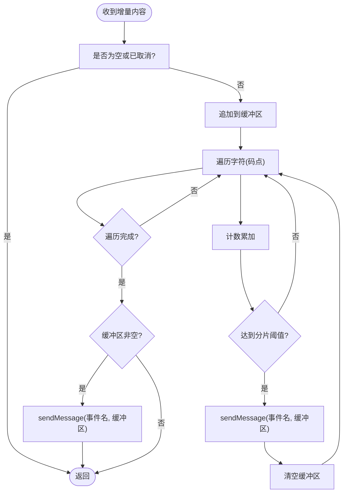
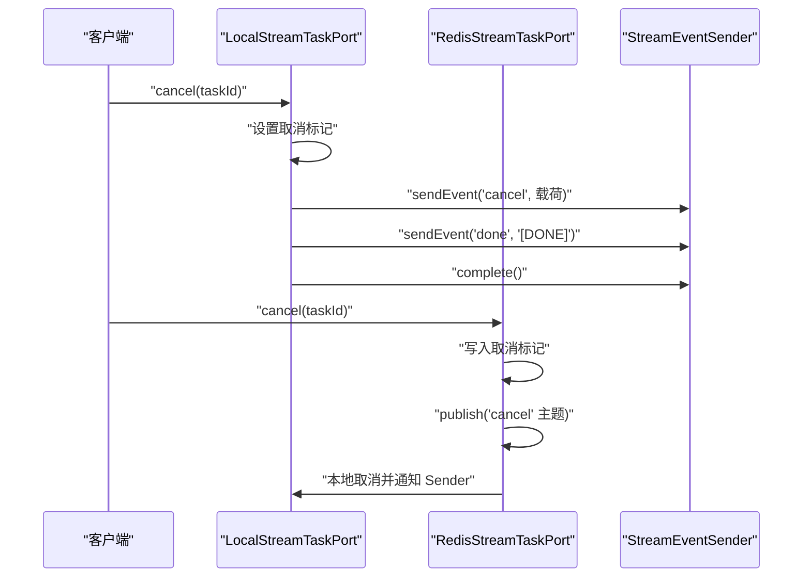
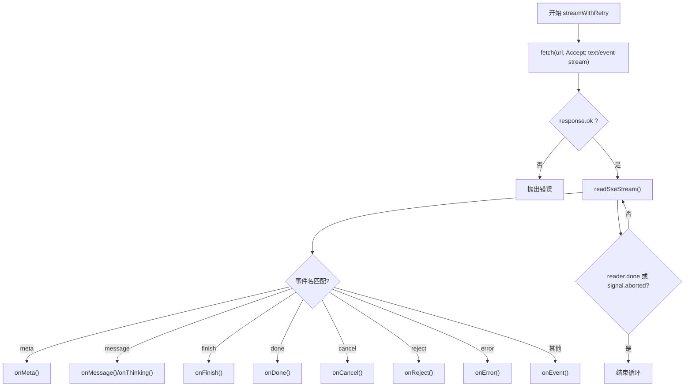
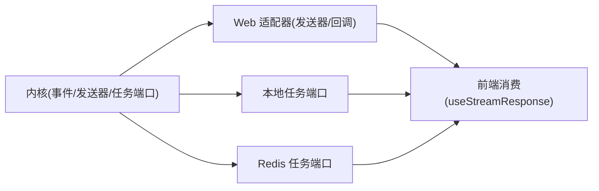

# 流式处理领域模型

<cite>
**本文引用的文件**
- [StreamEventType.java](file://seahorse-agent-kernel/src/main/java/com/miracle/ai/seahorse/agent/kernel/domain/stream/StreamEventType.java)
- [StreamEventSender.java](file://seahorse-agent-kernel/src/main/java/com/miracle/ai/seahorse/agent/kernel/domain/stream/StreamEventSender.java)
- [StreamCompletionPayload.java](file://seahorse-agent-kernel/src/main/java/com/miracle/ai/seahorse/agent/kernel/domain/stream/StreamCompletionPayload.java)
- [StreamMetaPayload.java](file://seahorse-agent-kernel/src/main/java/com/miracle/ai/seahorse/agent/kernel/domain/stream/StreamMetaPayload.java)
- [StreamMessageDelta.java](file://seahorse-agent-kernel/src/main/java/com/miracle/ai/seahorse/agent/kernel/domain/stream/StreamMessageDelta.java)
- [StreamCallback.java](file://seahorse-agent-kernel/src/main/java/com/miracle/ai/seahorse/agent/kernel/domain/chat/StreamCallback.java)
- [StreamTaskPort.java](file://seahorse-agent-kernel/src/main/java/com/miracle/ai/seahorse/agent/ports/outbound/stream/StreamTaskPort.java)
- [SpringSseEventSender.java](file://seahorse-agent-adapter-web/src/main/java/com/miracle/ai/seahorse/agent/adapters/local/SpringSseEventSender.java)
- [LocalChatStreamCallbackFactory.java](file://seahorse-agent-adapter-web/src/main/java/com/miracle/ai/seahorse/agent/adapters/local/LocalChatStreamCallbackFactory.java)
- [LocalStreamTaskPort.java](file://seahorse-agent-adapter-web/src/main/java/com/miracle/ai/seahorse/agent/adapters/local/LocalStreamTaskPort.java)
- [RedisStreamTaskPort.java](file://seahorse-agent-adapter-cache-redis/src/main/java/com/miracle/ai/seahorse/agent/adapters/cache/redis/RedisStreamTaskPort.java)
- [useStreamResponse.ts](file://frontend/src/hooks/useStreamResponse.ts)
- [index.ts 类型定义](file://frontend/src/types/index.ts)
</cite>

## 目录
1. [引言](#引言)
2. [项目结构](#项目结构)
3. [核心组件](#核心组件)
4. [架构总览](#架构总览)
5. [详细组件分析](#详细组件分析)
6. [依赖分析](#依赖分析)
7. [性能考虑](#性能考虑)
8. [故障排查指南](#故障排查指南)
9. [结论](#结论)
10. [附录](#附录)

## 引言
本文件面向流式处理领域模型的技术文档，聚焦于实时响应的事件驱动架构与数据结构设计。内容涵盖服务端推送事件（Server-Sent Events，SSE）的事件模型、数据载荷格式、事件序列控制以及错误处理机制，并结合后端 Java 与前端 TypeScript 的实现，系统阐述从内核到适配层再到前端消费端的完整链路。

## 项目结构
围绕流式处理的关键模块分布如下：
- 领域模型与端口：位于内核模块，定义事件类型、发送器接口、任务协调端口与数据载荷。
- 适配器实现：Web 层使用 Spring MVC 的 SSE 实现事件发送器；本地与 Redis 提供流任务协调器实现。
- 前端消费：基于 Fetch 与 ReadableStream 解析 SSE，按事件名分发到回调处理器。

图表来源
- [StreamEventType.java:23-63](file://seahorse-agent-kernel/src/main/java/com/miracle/ai/seahorse/agent/kernel/domain/stream/StreamEventType.java#L23-L63)
- [StreamEventSender.java:23-30](file://seahorse-agent-kernel/src/main/java/com/miracle/ai/seahorse/agent/kernel/domain/stream/StreamEventSender.java#L23-L30)
- [StreamTaskPort.java:31-70](file://seahorse-agent-kernel/src/main/java/com/miracle/ai/seahorse/agent/ports/outbound/stream/StreamTaskPort.java#L31-L70)
- [SpringSseEventSender.java:31-76](file://seahorse-agent-adapter-web/src/main/java/com/miracle/ai/seahorse/agent/adapters/local/SpringSseEventSender.java#L31-L76)
- [LocalChatStreamCallbackFactory.java:82-173](file://seahorse-agent-adapter-web/src/main/java/com/miracle/ai/seahorse/agent/adapters/local/LocalChatStreamCallbackFactory.java#L82-L173)
- [LocalStreamTaskPort.java:35-143](file://seahorse-agent-adapter-web/src/main/java/com/miracle/ai/seahorse/agent/adapters/local/LocalStreamTaskPort.java#L35-L143)
- [RedisStreamTaskPort.java:89-178](file://seahorse-agent-adapter-cache-redis/src/main/java/com/miracle/ai/seahorse/agent/adapters/cache/redis/RedisStreamTaskPort.java#L89-L178)
- [useStreamResponse.ts:33-175](file://frontend/src/hooks/useStreamResponse.ts#L33-L175)
- [index.ts 类型定义:36-49](file://frontend/src/types/index.ts#L36-L49)

章节来源
- [StreamEventType.java:23-63](file://seahorse-agent-kernel/src/main/java/com/miracle/ai/seahorse/agent/kernel/domain/stream/StreamEventType.java#L23-L63)
- [StreamEventSender.java:23-30](file://seahorse-agent-kernel/src/main/java/com/miracle/ai/seahorse/agent/kernel/domain/stream/StreamEventSender.java#L23-L30)
- [StreamTaskPort.java:31-70](file://seahorse-agent-kernel/src/main/java/com/miracle/ai/seahorse/agent/ports/outbound/stream/StreamTaskPort.java#L31-L70)
- [SpringSseEventSender.java:31-76](file://seahorse-agent-adapter-web/src/main/java/com/miracle/ai/seahorse/agent/adapters/local/SpringSseEventSender.java#L31-L76)
- [LocalChatStreamCallbackFactory.java:82-173](file://seahorse-agent-adapter-web/src/main/java/com/miracle/ai/seahorse/agent/adapters/local/LocalChatStreamCallbackFactory.java#L82-L173)
- [LocalStreamTaskPort.java:35-143](file://seahorse-agent-adapter-web/src/main/java/com/miracle/ai/seahorse/agent/adapters/local/LocalStreamTaskPort.java#L35-L143)
- [RedisStreamTaskPort.java:89-178](file://seahorse-agent-adapter-cache-redis/src/main/java/com/miracle/ai/seahorse/agent/adapters/cache/redis/RedisStreamTaskPort.java#L89-L178)
- [useStreamResponse.ts:33-175](file://frontend/src/hooks/useStreamResponse.ts#L33-L175)
- [index.ts 类型定义:36-49](file://frontend/src/types/index.ts#L36-L49)

## 核心组件
- 事件类型：定义 meta、message、finish、done、cancel、reject 等事件名，用于区分不同阶段的数据载荷。
- 事件发送器：抽象接口，负责发送命名事件与数据，以及完成/失败状态上报。
- 数据载荷：
  - 元数据载荷：包含会话标识与任务标识。
  - 消息增量：包含类型（如 think/response）与增量文本。
  - 完成/取消：包含消息标识与标题等收尾信息。
- 任务协调端口：统一注册、绑定取消句柄、查询取消状态与执行取消操作，支持本地与分布式实现。
- 前端解析器：基于 ReadableStream 逐行解析 event/data，按事件名分发到回调。

章节来源
- [StreamEventType.java:23-63](file://seahorse-agent-kernel/src/main/java/com/miracle/ai/seahorse/agent/kernel/domain/stream/StreamEventType.java#L23-L63)
- [StreamEventSender.java:23-30](file://seahorse-agent-kernel/src/main/java/com/miracle/ai/seahorse/agent/kernel/domain/stream/StreamEventSender.java#L23-L30)
- [StreamCompletionPayload.java:23-24](file://seahorse-agent-kernel/src/main/java/com/miracle/ai/seahorse/agent/kernel/domain/stream/StreamCompletionPayload.java#L23-L24)
- [StreamMetaPayload.java:23-24](file://seahorse-agent-kernel/src/main/java/com/miracle/ai/seahorse/agent/kernel/domain/stream/StreamMetaPayload.java#L23-L24)
- [StreamMessageDelta.java:23-24](file://seahorse-agent-kernel/src/main/java/com/miracle/ai/seahorse/agent/kernel/domain/stream/StreamMessageDelta.java#L23-L24)
- [StreamTaskPort.java:31-70](file://seahorse-agent-kernel/src/main/java/com/miracle/ai/seahorse/agent/ports/outbound/stream/StreamTaskPort.java#L31-L70)
- [useStreamResponse.ts:33-175](file://frontend/src/hooks/useStreamResponse.ts#L33-L175)

## 架构总览
整体采用事件驱动的流式响应架构：内核通过回调接口产出增量内容，适配器将增量封装为命名事件并通过 SSE 推送给前端；前端以流式方式读取并分发到对应处理器；任务协调端口负责取消语义与跨节点一致性。

图表来源
- [useStreamResponse.ts:33-175](file://frontend/src/hooks/useStreamResponse.ts#L33-L175)
- [SpringSseEventSender.java:31-76](file://seahorse-agent-adapter-web/src/main/java/com/miracle/ai/seahorse/agent/adapters/local/SpringSseEventSender.java#L31-L76)
- [LocalChatStreamCallbackFactory.java:82-173](file://seahorse-agent-adapter-web/src/main/java/com/miracle/ai/seahorse/agent/adapters/local/LocalChatStreamCallbackFactory.java#L82-L173)
- [LocalStreamTaskPort.java:35-143](file://seahorse-agent-adapter-web/src/main/java/com/miracle/ai/seahorse/agent/adapters/local/LocalStreamTaskPort.java#L35-L143)
- [RedisStreamTaskPort.java:89-178](file://seahorse-agent-adapter-cache-redis/src/main/java/com/miracle/ai/seahorse/agent/adapters/cache/redis/RedisStreamTaskPort.java#L89-L178)

## 详细组件分析

### 事件类型与载荷模型
- 事件类型：用于标识事件语义，前端据此路由到不同回调。
- 元数据载荷：会话与任务标识，便于前端维护上下文。
- 消息增量：携带增量文本与类型（如思考/回答），前端可分别渲染。
- 完成/取消：结束标志与可选标题/消息标识，便于前端收尾与回填。

图表来源
- [StreamEventType.java:23-63](file://seahorse-agent-kernel/src/main/java/com/miracle/ai/seahorse/agent/kernel/domain/stream/StreamEventType.java#L23-L63)
- [StreamMetaPayload.java:23-24](file://seahorse-agent-kernel/src/main/java/com/miracle/ai/seahorse/agent/kernel/domain/stream/StreamMetaPayload.java#L23-L24)
- [StreamMessageDelta.java:23-24](file://seahorse-agent-kernel/src/main/java/com/miracle/ai/seahorse/agent/kernel/domain/stream/StreamMessageDelta.java#L23-L24)
- [StreamCompletionPayload.java:23-24](file://seahorse-agent-kernel/src/main/java/com/miracle/ai/seahorse/agent/kernel/domain/stream/StreamCompletionPayload.java#L23-L24)
- [StreamEventSender.java:23-30](file://seahorse-agent-kernel/src/main/java/com/miracle/ai/seahorse/agent/kernel/domain/stream/StreamEventSender.java#L23-L30)

章节来源
- [StreamEventType.java:23-63](file://seahorse-agent-kernel/src/main/java/com/miracle/ai/seahorse/agent/kernel/domain/stream/StreamEventType.java#L23-L63)
- [StreamMetaPayload.java:23-24](file://seahorse-agent-kernel/src/main/java/com/miracle/ai/seahorse/agent/kernel/domain/stream/StreamMetaPayload.java#L23-L24)
- [StreamMessageDelta.java:23-24](file://seahorse-agent-kernel/src/main/java/com/miracle/ai/seahorse/agent/kernel/domain/stream/StreamMessageDelta.java#L23-L24)
- [StreamCompletionPayload.java:23-24](file://seahorse-agent-kernel/src/main/java/com/miracle/ai/seahorse/agent/kernel/domain/stream/StreamCompletionPayload.java#L23-L24)
- [StreamEventSender.java:23-30](file://seahorse-agent-kernel/src/main/java/com/miracle/ai/seahorse/agent/kernel/domain/stream/StreamEventSender.java#L23-L30)

### 事件发送器与前端解析
- 后端发送器：封装 Spring MVC 的 SseEmitter，支持命名事件与数据体发送，同时处理完成与异常。
- 前端解析器：基于 ReadableStream 逐行解析 event 与 data，遇到空行触发一次事件分发；根据事件名调用对应回调。

图表来源
- [SpringSseEventSender.java:31-76](file://seahorse-agent-adapter-web/src/main/java/com/miracle/ai/seahorse/agent/adapters/local/SpringSseEventSender.java#L31-L76)
- [useStreamResponse.ts:33-122](file://frontend/src/hooks/useStreamResponse.ts#L33-L122)

章节来源
- [SpringSseEventSender.java:31-76](file://seahorse-agent-adapter-web/src/main/java/com/miracle/ai/seahorse/agent/adapters/local/SpringSseEventSender.java#L31-L76)
- [useStreamResponse.ts:33-122](file://frontend/src/hooks/useStreamResponse.ts#L33-L122)

### 流回调与增量分片
- 回调工厂：在生成增量时进行分片（默认按字符数阈值切分），避免单次事件过大；对“思考”与“回答”两类增量分别发送。
- 分片策略：按 Unicode 码点遍历，保证多字节字符不被截断。

图表来源
- [LocalChatStreamCallbackFactory.java:147-173](file://seahorse-agent-adapter-web/src/main/java/com/miracle/ai/seahorse/agent/adapters/local/LocalChatStreamCallbackFactory.java#L147-L173)

章节来源
- [LocalChatStreamCallbackFactory.java:82-173](file://seahorse-agent-adapter-web/src/main/java/com/miracle/ai/seahorse/agent/adapters/local/LocalChatStreamCallbackFactory.java#L82-L173)

### 任务取消与跨节点一致性
- 本地实现：内存中维护任务状态，取消时立即通知发送器并完成连接。
- Redis 实现：在本地取消的同时，写入取消标记并发布主题，其他节点监听后同步取消本地任务。

图表来源
- [LocalStreamTaskPort.java:79-130](file://seahorse-agent-adapter-web/src/main/java/com/miracle/ai/seahorse/agent/adapters/local/LocalStreamTaskPort.java#L79-L130)
- [RedisStreamTaskPort.java:102-146](file://seahorse-agent-adapter-cache-redis/src/main/java/com/miracle/ai/seahorse/agent/adapters/cache/redis/RedisStreamTaskPort.java#L102-L146)

章节来源
- [LocalStreamTaskPort.java:79-130](file://seahorse-agent-adapter-web/src/main/java/com/miracle/ai/seahorse/agent/adapters/local/LocalStreamTaskPort.java#L79-L130)
- [RedisStreamTaskPort.java:102-146](file://seahorse-agent-adapter-cache-redis/src/main/java/com/miracle/ai/seahorse/agent/adapters/cache/redis/RedisStreamTaskPort.java#L102-L146)

### 前端事件序列与错误处理
- 事件序列：meta → 多个 message（可能包含 think）→ finish → done；取消时先 cancel 再 done。
- 错误处理：SSE 连接异常、解析异常、网络错误均通过 onError 回调上抛；前端具备指数退避重试能力。

图表来源
- [useStreamResponse.ts:124-175](file://frontend/src/hooks/useStreamResponse.ts#L124-L175)

章节来源
- [useStreamResponse.ts:124-175](file://frontend/src/hooks/useStreamResponse.ts#L124-L175)

## 依赖分析
- 内核仅依赖事件类型、发送器接口与任务协调端口，保持与具体实现解耦。
- Web 适配器实现发送器与回调工厂，负责将内核回调映射为 SSE 事件。
- 本地与 Redis 适配器实现任务协调端口，前者仅本地状态，后者引入分布式一致性。
- 前端仅依赖事件名约定与载荷结构，通过回调扩展业务逻辑。

图表来源
- [StreamTaskPort.java:31-70](file://seahorse-agent-kernel/src/main/java/com/miracle/ai/seahorse/agent/ports/outbound/stream/StreamTaskPort.java#L31-L70)
- [SpringSseEventSender.java:31-76](file://seahorse-agent-adapter-web/src/main/java/com/miracle/ai/seahorse/agent/adapters/local/SpringSseEventSender.java#L31-L76)
- [LocalChatStreamCallbackFactory.java:82-173](file://seahorse-agent-adapter-web/src/main/java/com/miracle/ai/seahorse/agent/adapters/local/LocalChatStreamCallbackFactory.java#L82-L173)
- [LocalStreamTaskPort.java:35-143](file://seahorse-agent-adapter-web/src/main/java/com/miracle/ai/seahorse/agent/adapters/local/LocalStreamTaskPort.java#L35-L143)
- [RedisStreamTaskPort.java:89-178](file://seahorse-agent-adapter-cache-redis/src/main/java/com/miracle/ai/seahorse/agent/adapters/cache/redis/RedisStreamTaskPort.java#L89-L178)
- [useStreamResponse.ts:33-175](file://frontend/src/hooks/useStreamResponse.ts#L33-L175)

章节来源
- [StreamTaskPort.java:31-70](file://seahorse-agent-kernel/src/main/java/com/miracle/ai/seahorse/agent/ports/outbound/stream/StreamTaskPort.java#L31-L70)
- [SpringSseEventSender.java:31-76](file://seahorse-agent-adapter-web/src/main/java/com/miracle/ai/seahorse/agent/adapters/local/SpringSseEventSender.java#L31-L76)
- [LocalChatStreamCallbackFactory.java:82-173](file://seahorse-agent-adapter-web/src/main/java/com/miracle/ai/seahorse/agent/adapters/local/LocalChatStreamCallbackFactory.java#L82-L173)
- [LocalStreamTaskPort.java:35-143](file://seahorse-agent-adapter-web/src/main/java/com/miracle/ai/seahorse/agent/adapters/local/LocalStreamTaskPort.java#L35-L143)
- [RedisStreamTaskPort.java:89-178](file://seahorse-agent-adapter-cache-redis/src/main/java/com/miracle/ai/seahorse/agent/adapters/cache/redis/RedisStreamTaskPort.java#L89-L178)
- [useStreamResponse.ts:33-175](file://frontend/src/hooks/useStreamResponse.ts#L33-L175)

## 性能考虑
- 分片策略：按 Unicode 码点遍历，避免字符截断；合理设置分片大小以平衡延迟与事件数量。
- 事件序列：尽量减少无关事件，仅在必要时发送 meta 与 finish，降低前端解析负担。
- 取消路径：本地取消应尽快通知发送器并完成连接，避免资源泄漏。
- 前端重试：指数退避可缓解瞬时抖动，但需限制最大重试次数与延迟上限。

## 故障排查指南
- 前端无法接收事件
  - 检查 Accept 是否为 text/event-stream。
  - 确认服务端是否正确发送 event 与 data 行。
  - 查看前端 onError 回调中的错误信息。
- 事件顺序异常
  - 确保服务端严格遵循 meta → message* → finish → done 的顺序。
  - 取消时应先 cancel 再 done。
- 取消无效
  - 核验任务 ID 是否为空或非法。
  - 检查本地/Redis 任务端口是否正确写入取消标记并广播。
- 字符截断
  - 确认增量分片使用码点遍历而非字节索引。

章节来源
- [useStreamResponse.ts:124-175](file://frontend/src/hooks/useStreamResponse.ts#L124-L175)
- [LocalStreamTaskPort.java:79-130](file://seahorse-agent-adapter-web/src/main/java/com/miracle/ai/seahorse/agent/adapters/local/LocalStreamTaskPort.java#L79-L130)
- [RedisStreamTaskPort.java:102-146](file://seahorse-agent-adapter-cache-redis/src/main/java/com/miracle/ai/seahorse/agent/adapters/cache/redis/RedisStreamTaskPort.java#L102-L146)
- [LocalChatStreamCallbackFactory.java:147-173](file://seahorse-agent-adapter-web/src/main/java/com/miracle/ai/seahorse/agent/adapters/local/LocalChatStreamCallbackFactory.java#L147-L173)

## 结论
该流式处理领域模型以事件类型与数据载荷为核心，通过发送器接口与任务协调端口实现内核与适配层的解耦。SSE 作为传输协议，配合前端流式解析与事件分发，形成完整的实时响应闭环。本地与 Redis 两种任务协调实现满足单机与分布式场景下的取消一致性需求。

## 附录
- 事件名与载荷映射（前端侧）
  - meta → 元数据载荷
  - message → 消息增量（type=think 时走思考回调）
  - finish → 完成载荷
  - done → 结束信号
  - cancel → 取消载荷
  - reject → 拒绝增量
  - error → 错误信息

章节来源
- [useStreamResponse.ts:53-86](file://frontend/src/hooks/useStreamResponse.ts#L53-L86)
- [index.ts 类型定义:36-49](file://frontend/src/types/index.ts#L36-L49)