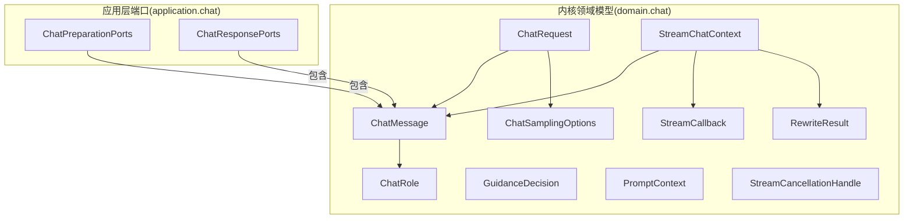
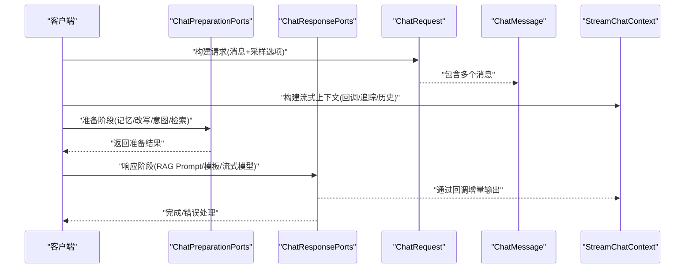
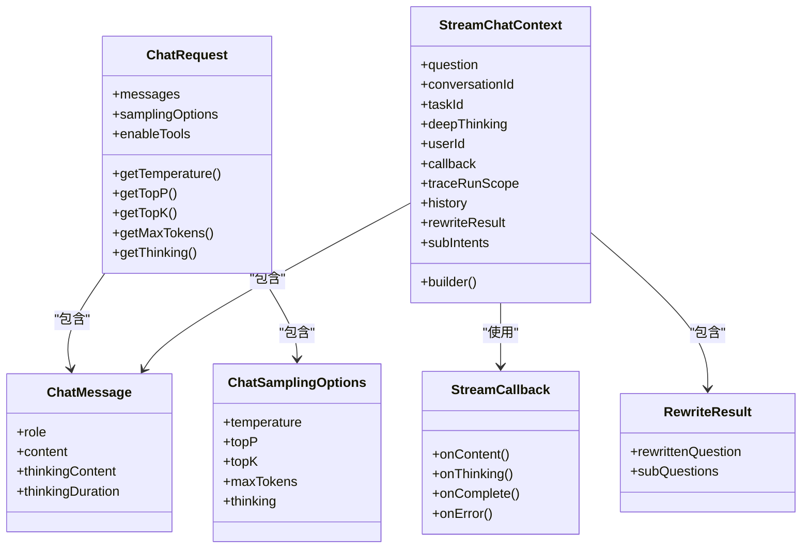

# 聊天领域模型

<cite>
**本文引用的文件**
- [ChatMessage.java](file://seahorse-agent-kernel/src/main/java/com/miracle/ai/seahorse/agent/kernel/domain/chat/ChatMessage.java)
- [ChatRequest.java](file://seahorse-agent-kernel/src/main/java/com/miracle/ai/seahorse/agent/kernel/domain/chat/ChatRequest.java)
- [ChatRole.java](file://seahorse-agent-kernel/src/main/java/com/miracle/ai/seahorse/agent/kernel/domain/chat/ChatRole.java)
- [ChatSamplingOptions.java](file://seahorse-agent-kernel/src/main/java/com/miracle/ai/seahorse/agent/kernel/domain/chat/ChatSamplingOptions.java)
- [GuidanceDecision.java](file://seahorse-agent-kernel/src/main/java/com/miracle/ai/seahorse/agent/kernel/domain/chat/GuidanceDecision.java)
- [PromptContext.java](file://seahorse-agent-kernel/src/main/java/com/miracle/ai/seahorse/agent/kernel/domain/chat/PromptContext.java)
- [RewriteResult.java](file://seahorse-agent-kernel/src/main/java/com/miracle/ai/seahorse/agent/kernel/domain/chat/RewriteResult.java)
- [StreamCallback.java](file://seahorse-agent-kernel/src/main/java/com/miracle/ai/seahorse/agent/kernel/domain/chat/StreamCallback.java)
- [StreamCancellationHandle.java](file://seahorse-agent-kernel/src/main/java/com/miracle/ai/seahorse/agent/kernel/domain/chat/StreamCancellationHandle.java)
- [StreamChatContext.java](file://seahorse-agent-kernel/src/main/java/com/miracle/ai/seahorse/agent/kernel/domain/chat/StreamChatContext.java)
- [ChatPreparationPorts.java](file://seahorse-agent-kernel/src/main/java/com/miracle/ai/seahorse/agent/kernel/application/chat/ChatPreparationPorts.java)
- [ChatResponsePorts.java](file://seahorse-agent-kernel/src/main/java/com/miracle/ai/seahorse/agent/kernel/application/chat/ChatResponsePorts.java)
</cite>

## 目录
1. [简介](#简介)
2. [项目结构](#项目结构)
3. [核心组件](#核心组件)
4. [架构总览](#架构总览)
5. [详细组件分析](#详细组件分析)
6. [依赖分析](#依赖分析)
7. [性能考虑](#性能考虑)
8. [故障排查指南](#故障排查指南)
9. [结论](#结论)
10. [附录：使用示例路径](#附录使用示例路径)

## 简介
本文件系统性梳理聊天领域的核心领域模型与应用级端口集合，覆盖消息模型、请求模型、角色枚举、采样选项、引导决策、提示上下文、重写结果、流式回调与取消句柄、以及流式聊天上下文等关键类型。文档从属性定义、业务含义、使用场景与相互关系出发，辅以可视化图示与示例路径，帮助读者快速理解并正确使用这些模型。

## 项目结构
聊天领域模型位于内核模块的 domain.chat 包中，同时在 application.chat 中提供问答流程的前置与响应阶段端口集合，用于装配与编排具体能力（如检索、改写、意图解析、流式模型调用等）。

图表来源
- [ChatMessage.java:30-66](file://seahorse-agent-kernel/src/main/java/com/miracle/ai/seahorse/agent/kernel/domain/chat/ChatMessage.java#L30-L66)
- [ChatRequest.java:32-65](file://seahorse-agent-kernel/src/main/java/com/miracle/ai/seahorse/agent/kernel/domain/chat/ChatRequest.java#L32-L65)
- [ChatRole.java:23-28](file://seahorse-agent-kernel/src/main/java/com/miracle/ai/seahorse/agent/kernel/domain/chat/ChatRole.java#L23-L28)
- [ChatSamplingOptions.java:28-39](file://seahorse-agent-kernel/src/main/java/com/miracle/ai/seahorse/agent/kernel/domain/chat/ChatSamplingOptions.java#L28-L39)
- [GuidanceDecision.java:26-53](file://seahorse-agent-kernel/src/main/java/com/miracle/ai/seahorse/agent/kernel/domain/chat/GuidanceDecision.java#L26-L53)
- [PromptContext.java:33-54](file://seahorse-agent-kernel/src/main/java/com/miracle/ai/seahorse/agent/kernel/domain/chat/PromptContext.java#L33-L54)
- [RewriteResult.java:25-26](file://seahorse-agent-kernel/src/main/java/com/miracle/ai/seahorse/agent/kernel/domain/chat/RewriteResult.java#L25-L26)
- [StreamCallback.java:23-33](file://seahorse-agent-kernel/src/main/java/com/miracle/ai/seahorse/agent/kernel/domain/chat/StreamCallback.java#L23-L33)
- [StreamCancellationHandle.java:23-26](file://seahorse-agent-kernel/src/main/java/com/miracle/ai/seahorse/agent/kernel/domain/chat/StreamCancellationHandle.java#L23-L26)
- [StreamChatContext.java:30-98](file://seahorse-agent-kernel/src/main/java/com/miracle/ai/seahorse/agent/kernel/domain/chat/StreamChatContext.java#L30-L98)
- [ChatPreparationPorts.java:31-43](file://seahorse-agent-kernel/src/main/java/com/miracle/ai/seahorse/agent/kernel/application/chat/ChatPreparationPorts.java#L31-L43)
- [ChatResponsePorts.java:30-41](file://seahorse-agent-kernel/src/main/java/com/miracle/ai/seahorse/agent/kernel/application/chat/ChatResponsePorts.java#L30-L41)

章节来源
- [ChatMessage.java:24-66](file://seahorse-agent-kernel/src/main/java/com/miracle/ai/seahorse/agent/kernel/domain/chat/ChatMessage.java#L24-L66)
- [ChatRequest.java:27-65](file://seahorse-agent-kernel/src/main/java/com/miracle/ai/seahorse/agent/kernel/domain/chat/ChatRequest.java#L27-L65)
- [ChatRole.java:20-28](file://seahorse-agent-kernel/src/main/java/com/miracle/ai/seahorse/agent/kernel/domain/chat/ChatRole.java#L20-L28)
- [ChatSamplingOptions.java:23-39](file://seahorse-agent-kernel/src/main/java/com/miracle/ai/seahorse/agent/kernel/domain/chat/ChatSamplingOptions.java#L23-L39)
- [GuidanceDecision.java:22-53](file://seahorse-agent-kernel/src/main/java/com/miracle/ai/seahorse/agent/kernel/domain/chat/GuidanceDecision.java#L22-L53)
- [PromptContext.java:28-54](file://seahorse-agent-kernel/src/main/java/com/miracle/ai/seahorse/agent/kernel/domain/chat/PromptContext.java#L28-L54)
- [RewriteResult.java:22-26](file://seahorse-agent-kernel/src/main/java/com/miracle/ai/seahorse/agent/kernel/domain/chat/RewriteResult.java#L22-L26)
- [StreamCallback.java:20-33](file://seahorse-agent-kernel/src/main/java/com/miracle/ai/seahorse/agent/kernel/domain/chat/StreamCallback.java#L20-L33)
- [StreamCancellationHandle.java:20-26](file://seahorse-agent-kernel/src/main/java/com/miracle/ai/seahorse/agent/kernel/domain/chat/StreamCancellationHandle.java#L20-L26)
- [StreamChatContext.java:26-98](file://seahorse-agent-kernel/src/main/java/com/miracle/ai/seahorse/agent/kernel/domain/chat/StreamChatContext.java#L26-L98)
- [ChatPreparationPorts.java:28-43](file://seahorse-agent-kernel/src/main/java/com/miracle/ai/seahorse/agent/kernel/application/chat/ChatPreparationPorts.java#L28-L43)
- [ChatResponsePorts.java:27-41](file://seahorse-agent-kernel/src/main/java/com/miracle/ai/seahorse/agent/kernel/application/chat/ChatResponsePorts.java#L27-L41)

## 核心组件
- ChatMessage：对话消息载体，承载角色、内容、思考内容与思考耗时等字段，并提供便捷构造方法。
- ChatRequest：对话请求载体，聚合消息列表、采样选项与工具启用标记，提供温度、topP、topK、最大token数、是否深度思考等便捷访问器。
- ChatRole：消息角色枚举，包含系统、用户、助手三类。
- ChatSamplingOptions：采样与推理控制参数，包含温度、topP、topK、最大token数、是否深度思考等。
- GuidanceDecision：意图澄清引导决策，支持“无操作”和“提示”两种动作。
- PromptContext：RAG Prompt 组装上下文，包含问题、MCP上下文、知识库上下文、意图评分与检索块映射等。
- RewriteResult：查询改写与拆分结果，包含改写后的主问题与子问题列表。
- StreamCallback：流式输出回调接口，定义内容增量回调、思考内容回调、完成与错误回调。
- StreamCancellationHandle：流式任务取消句柄接口，提供取消能力。
- StreamChatContext：流式问答上下文，封装问题、会话ID、任务ID、深度思考开关、用户ID、回调、追踪作用域、历史消息、重写结果与子意图等，并提供构建器。

章节来源
- [ChatMessage.java:30-66](file://seahorse-agent-kernel/src/main/java/com/miracle/ai/seahorse/agent/kernel/domain/chat/ChatMessage.java#L30-L66)
- [ChatRequest.java:32-65](file://seahorse-agent-kernel/src/main/java/com/miracle/ai/seahorse/agent/kernel/domain/chat/ChatRequest.java#L32-L65)
- [ChatRole.java:23-28](file://seahorse-agent-kernel/src/main/java/com/miracle/ai/seahorse/agent/kernel/domain/chat/ChatRole.java#L23-L28)
- [ChatSamplingOptions.java:28-39](file://seahorse-agent-kernel/src/main/java/com/miracle/ai/seahorse/agent/kernel/domain/chat/ChatSamplingOptions.java#L28-L39)
- [GuidanceDecision.java:26-53](file://seahorse-agent-kernel/src/main/java/com/miracle/ai/seahorse/agent/kernel/domain/chat/GuidanceDecision.java#L26-L53)
- [PromptContext.java:33-54](file://seahorse-agent-kernel/src/main/java/com/miracle/ai/seahorse/agent/kernel/domain/chat/PromptContext.java#L33-L54)
- [RewriteResult.java:25-26](file://seahorse-agent-kernel/src/main/java/com/miracle/ai/seahorse/agent/kernel/domain/chat/RewriteResult.java#L25-L26)
- [StreamCallback.java:23-33](file://seahorse-agent-kernel/src/main/java/com/miracle/ai/seahorse/agent/kernel/domain/chat/StreamCallback.java#L23-L33)
- [StreamCancellationHandle.java:23-26](file://seahorse-agent-kernel/src/main/java/com/miracle/ai/seahorse/agent/kernel/domain/chat/StreamCancellationHandle.java#L23-L26)
- [StreamChatContext.java:30-98](file://seahorse-agent-kernel/src/main/java/com/miracle/ai/seahorse/agent/kernel/domain/chat/StreamChatContext.java#L30-L98)

## 架构总览
下图展示了问答流程中各模型与端口的交互关系，体现“准备阶段”与“响应阶段”的职责划分与协作方式。

图表来源
- [ChatRequest.java:32-65](file://seahorse-agent-kernel/src/main/java/com/miracle/ai/seahorse/agent/kernel/domain/chat/ChatRequest.java#L32-L65)
- [ChatMessage.java:30-66](file://seahorse-agent-kernel/src/main/java/com/miracle/ai/seahorse/agent/kernel/domain/chat/ChatMessage.java#L30-L66)
- [StreamChatContext.java:30-98](file://seahorse-agent-kernel/src/main/java/com/miracle/ai/seahorse/agent/kernel/domain/chat/StreamChatContext.java#L30-L98)
- [ChatPreparationPorts.java:31-43](file://seahorse-agent-kernel/src/main/java/com/miracle/ai/seahorse/agent/kernel/application/chat/ChatPreparationPorts.java#L31-L43)
- [ChatResponsePorts.java:30-41](file://seahorse-agent-kernel/src/main/java/com/miracle/ai/seahorse/agent/kernel/application/chat/ChatResponsePorts.java#L30-L41)

## 详细组件分析

### ChatMessage 消息模型
- 属性定义
  - 角色：ChatRole（系统/用户/助手）
  - 内容：字符串
  - 思考内容：字符串（可选）
  - 思考耗时：整数（毫秒，可选）
- 业务含义
  - 表达一次对话中的单条消息，支持助手角色携带“思考过程”以便后续展示或审计。
- 使用场景
  - 构建 ChatRequest 的消息列表
  - 在流式上下文中作为历史消息参与对话
- 关键方法
  - 静态工厂：system()/user()/assistant() 及带思考内容与耗时的重载
- 复杂度与性能
  - 字段均为值类型，对象创建与传递成本低；建议复用不可变消息副本以避免并发修改。

章节来源
- [ChatMessage.java:30-66](file://seahorse-agent-kernel/src/main/java/com/miracle/ai/seahorse/agent/kernel/domain/chat/ChatMessage.java#L30-L66)
- [ChatRole.java:23-28](file://seahorse-agent-kernel/src/main/java/com/miracle/ai/seahorse/agent/kernel/domain/chat/ChatRole.java#L23-L28)

### ChatRequest 请求模型
- 属性定义
  - 消息列表：ChatMessage 列表
  - 采样选项：ChatSamplingOptions
  - 工具启用：布尔值（可空）
- 业务含义
  - 封装一次对话请求的所有输入要素，便于下游模型或适配器统一消费。
- 使用场景
  - 作为流式模型调用的输入载体
  - 与采样选项协同控制生成行为
- 访问器
  - 温度、topP、topK、最大token数、是否深度思考
- 复杂度与性能
  - 列表默认为空，避免空指针；访问器对空选项进行防御式判空。

章节来源
- [ChatRequest.java:32-65](file://seahorse-agent-kernel/src/main/java/com/miracle/ai/seahorse/agent/kernel/domain/chat/ChatRequest.java#L32-L65)
- [ChatSamplingOptions.java:28-39](file://seahorse-agent-kernel/src/main/java/com/miracle/ai/seahorse/agent/kernel/domain/chat/ChatSamplingOptions.java#L28-L39)

### ChatRole 角色枚举
- 定义
  - SYSTEM：系统提示词或系统消息
  - USER：用户输入
  - ASSISTANT：模型输出
- 业务含义
  - 标识消息发送方身份，驱动模型遵循不同角色的语用约束。
- 使用场景
  - ChatMessage 的角色字段
  - Prompt 组装与排序策略

章节来源
- [ChatRole.java:23-28](file://seahorse-agent-kernel/src/main/java/com/miracle/ai/seahorse/agent/kernel/domain/chat/ChatRole.java#L23-L28)

### ChatSamplingOptions 采样选项
- 属性定义
  - 温度、topP、topK、最大token数、是否深度思考
- 业务含义
  - 控制生成随机性与长度上限，以及是否开启“思考模式”。
- 使用场景
  - 与 ChatRequest 协同决定模型行为
  - 作为 ChatRequest 的便捷访问入口

章节来源
- [ChatSamplingOptions.java:28-39](file://seahorse-agent-kernel/src/main/java/com/miracle/ai/seahorse/agent/kernel/domain/chat/ChatSamplingOptions.java#L28-L39)
- [ChatRequest.java:47-65](file://seahorse-agent-kernel/src/main/java/com/miracle/ai/seahorse/agent/kernel/domain/chat/ChatRequest.java#L47-L65)

### GuidanceDecision 引导决策
- 结构
  - 动作枚举：NONE、PROMPT
  - 提示内容：字符串（当动作为 PROMPT 时有效）
- 业务含义
  - 在意图澄清阶段给出下一步行动建议（例如补充提示词）。
- 使用场景
  - 与意图引导端口配合，动态调整提示词以提升意图识别质量

章节来源
- [GuidanceDecision.java:26-53](file://seahorse-agent-kernel/src/main/java/com/miracle/ai/seahorse/agent/kernel/domain/chat/GuidanceDecision.java#L26-L53)

### PromptContext 提示上下文
- 属性定义
  - 问题：原始问题
  - MCP 上下文：来自工具/插件的上下文
  - 知识库上下文：来自知识库检索的上下文
  - MCP 意图评分：MCP 相关意图的打分
  - 知识库意图评分：KB 相关意图的打分
  - 意图-检索块映射：按意图分组的检索片段
- 业务含义
  - 作为 RAG Prompt 组装的输入，集中承载多源上下文信息。
- 辅助方法
  - hasMcp()/hasKb()：判断对应上下文是否存在
- 使用场景
  - RAG Prompt 组装与模板渲染

章节来源
- [PromptContext.java:33-54](file://seahorse-agent-kernel/src/main/java/com/miracle/ai/seahorse/agent/kernel/domain/chat/PromptContext.java#L33-L54)

### RewriteResult 重写结果
- 结构
  - rewrittenQuestion：改写后的主问题
  - subQuestions：拆分出的子问题列表
- 业务含义
  - 描述查询改写与拆分的结果，便于后续子问题并行/串行处理。
- 使用场景
  - 子意图生成与并行检索
  - 流式上下文中的问题溯源

章节来源
- [RewriteResult.java:25-26](file://seahorse-agent-kernel/src/main/java/com/miracle/ai/seahorse/agent/kernel/domain/chat/RewriteResult.java#L25-L26)

### StreamCallback 流回调
- 接口定义
  - onContent(content)：增量内容回调
  - onThinking(content)：思考内容回调（默认空实现）
  - onComplete()：完成回调
  - onError(error)：错误回调
- 业务含义
  - 抽象流式输出的生命周期事件，便于 UI 或日志系统订阅。
- 使用场景
  - 与流式模型集成，实时渲染回答与思考过程

章节来源
- [StreamCallback.java:23-33](file://seahorse-agent-kernel/src/main/java/com/miracle/ai/seahorse/agent/kernel/domain/chat/StreamCallback.java#L23-L33)

### StreamCancellationHandle 流取消句柄
- 接口定义
  - cancel()：取消当前流式任务
- 业务含义
  - 提供外部中断流式生成的能力，避免资源浪费。
- 使用场景
  - 用户主动取消、超时控制、异常恢复

章节来源
- [StreamCancellationHandle.java:23-26](file://seahorse-agent-kernel/src/main/java/com/miracle/ai/seahorse/agent/kernel/domain/chat/StreamCancellationHandle.java#L23-L26)

### StreamChatContext 流聊天上下文
- 属性定义
  - question：问题文本
  - conversationId：会话ID
  - taskId：任务ID
  - deepThinking：是否深度思考
  - userId：用户ID
  - callback：流回调
  - traceRunScope：追踪作用域
  - history：历史消息
  - rewriteResult：重写结果
  - subIntents：子意图列表
- 构建器
  - 提供链式设置方法，便于组装复杂上下文
- 业务含义
  - 承载一次流式问答的完整上下文，贯穿准备与响应阶段。
- 使用场景
  - 流式模型调用前的上下文准备
  - 回调中对上下文的读取与状态更新

章节来源
- [StreamChatContext.java:30-98](file://seahorse-agent-kernel/src/main/java/com/miracle/ai/seahorse/agent/kernel/domain/chat/StreamChatContext.java#L30-L98)

### ChatPreparationPorts 问答准备阶段端口集合
- 组成
  - 对话记忆端口、查询改写端口、意图解析端口、意图引导端口、检索上下文端口
- 业务含义
  - 装配问答前置阶段所需能力，确保准备流程可插拔、可替换。
- 校验
  - 构造时对各端口进行非空校验

章节来源
- [ChatPreparationPorts.java:31-43](file://seahorse-agent-kernel/src/main/java/com/miracle/ai/seahorse/agent/kernel/application/chat/ChatPreparationPorts.java#L31-L43)

### ChatResponsePorts 问答响应阶段端口集合
- 组成
  - RAG Prompt 端口、Prompt 模板端口、流式模型端口、流式任务端口
- 业务含义
  - 装配问答响应阶段所需能力，支撑最终回答生成与流式输出。
- 校验
  - 构造时对各端口进行非空校验

章节来源
- [ChatResponsePorts.java:30-41](file://seahorse-agent-kernel/src/main/java/com/miracle/ai/seahorse/agent/kernel/application/chat/ChatResponsePorts.java#L30-L41)

## 依赖分析
- 内聚性
  - domain.chat 下的模型围绕“消息、请求、采样、上下文、流式”形成高内聚的聊天领域模型族。
- 耦合性
  - ChatRequest 依赖 ChatMessage 与 ChatSamplingOptions
  - StreamChatContext 依赖 ChatMessage、StreamCallback、RewriteResult 等
  - 应用层端口集合通过记录类聚合下游能力端口，降低上层耦合
- 外部依赖
  - 未发现循环依赖；各模型间为单向引用，符合领域驱动设计的“单向依赖”原则

图表来源
- [ChatMessage.java:30-66](file://seahorse-agent-kernel/src/main/java/com/miracle/ai/seahorse/agent/kernel/domain/chat/ChatMessage.java#L30-L66)
- [ChatRequest.java:32-65](file://seahorse-agent-kernel/src/main/java/com/miracle/ai/seahorse/agent/kernel/domain/chat/ChatRequest.java#L32-L65)
- [ChatSamplingOptions.java:28-39](file://seahorse-agent-kernel/src/main/java/com/miracle/ai/seahorse/agent/kernel/domain/chat/ChatSamplingOptions.java#L28-L39)
- [StreamChatContext.java:30-98](file://seahorse-agent-kernel/src/main/java/com/miracle/ai/seahorse/agent/kernel/domain/chat/StreamChatContext.java#L30-L98)
- [StreamCallback.java:23-33](file://seahorse-agent-kernel/src/main/java/com/miracle/ai/seahorse/agent/kernel/domain/chat/StreamCallback.java#L23-L33)
- [RewriteResult.java:25-26](file://seahorse-agent-kernel/src/main/java/com/miracle/ai/seahorse/agent/kernel/domain/chat/RewriteResult.java#L25-L26)

## 性能考虑
- 消息与上下文对象均为轻量值对象，建议在高频流式场景中复用不可变副本，减少 GC 压力。
- 采样参数直接影响生成长度与随机性，应结合业务目标合理配置，避免过长的 token 输出导致延迟与成本上升。
- 流式回调应避免阻塞主线程，必要时在独立线程池中处理 UI 更新或日志写入。
- 取消句柄应在异常分支与超时场景及时调用，防止资源泄露。

## 故障排查指南
- 空指针与非法状态
  - ChatRequest 的采样选项可能为空，访问器已做防御式判空；若出现异常，检查上游是否正确传入。
  - StreamChatContext 的回调与历史消息需在构建后显式设置，否则回调无法触发或历史缺失。
- 回调未触发
  - 确认已设置 StreamCallback 并在响应阶段正确注册到流式模型端口。
- 取消无效
  - 确认持有有效的 StreamCancellationHandle 实例并在需要时调用 cancel()。
- 上下文不完整
  - 若 PromptContext 缺少 MCP/KB 上下文，hasMcp()/hasKb() 将返回 false，需检查检索与组装逻辑。

章节来源
- [ChatRequest.java:47-65](file://seahorse-agent-kernel/src/main/java/com/miracle/ai/seahorse/agent/kernel/domain/chat/ChatRequest.java#L47-L65)
- [StreamChatContext.java:30-98](file://seahorse-agent-kernel/src/main/java/com/miracle/ai/seahorse/agent/kernel/domain/chat/StreamChatContext.java#L30-L98)
- [StreamCallback.java:23-33](file://seahorse-agent-kernel/src/main/java/com/miracle/ai/seahorse/agent/kernel/domain/chat/StreamCallback.java#L23-L33)
- [StreamCancellationHandle.java:23-26](file://seahorse-agent-kernel/src/main/java/com/miracle/ai/seahorse/agent/kernel/domain/chat/StreamCancellationHandle.java#L23-L26)
- [PromptContext.java:47-53](file://seahorse-agent-kernel/src/main/java/com/miracle/ai/seahorse/agent/kernel/domain/chat/PromptContext.java#L47-L53)

## 结论
本文档系统化梳理了聊天领域的核心模型与应用端口，明确了各模型的属性、业务含义、使用场景与相互关系。通过清晰的依赖与职责划分，这些模型为构建稳定、可扩展的聊天与问答系统提供了坚实的基础。

## 附录：使用示例路径
以下为常见使用场景的示例路径（请在对应文件中查看具体实现细节）：
- 创建一条助手消息（含思考内容与耗时）
  - [ChatMessage.java:57-66](file://seahorse-agent-kernel/src/main/java/com/miracle/ai/seahorse/agent/kernel/domain/chat/ChatMessage.java#L57-L66)
- 构建一次对话请求（包含采样选项与工具启用）
  - [ChatRequest.java:40-45](file://seahorse-agent-kernel/src/main/java/com/miracle/ai/seahorse/agent/kernel/domain/chat/ChatRequest.java#L40-L45)
- 设置采样参数（温度、topP、topK、最大token、是否深度思考）
  - [ChatSamplingOptions.java:28-39](file://seahorse-agent-kernel/src/main/java/com/miracle/ai/seahorse/agent/kernel/domain/chat/ChatSamplingOptions.java#L28-L39)
- 发起流式问答（设置回调、追踪、历史、重写结果）
  - [StreamChatContext.java:52-98](file://seahorse-agent-kernel/src/main/java/com/miracle/ai/seahorse/agent/kernel/domain/chat/StreamChatContext.java#L52-L98)
  - [StreamCallback.java:23-33](file://seahorse-agent-kernel/src/main/java/com/miracle/ai/seahorse/agent/kernel/domain/chat/StreamCallback.java#L23-L33)
- 取消流式任务
  - [StreamCancellationHandle.java:23-26](file://seahorse-agent-kernel/src/main/java/com/miracle/ai/seahorse/agent/kernel/domain/chat/StreamCancellationHandle.java#L23-L26)
- 组装 RAG Prompt 上下文
  - [PromptContext.java:33-54](file://seahorse-agent-kernel/src/main/java/com/miracle/ai/seahorse/agent/kernel/domain/chat/PromptContext.java#L33-L54)
- 查询改写与拆分
  - [RewriteResult.java:25-26](file://seahorse-agent-kernel/src/main/java/com/miracle/ai/seahorse/agent/kernel/domain/chat/RewriteResult.java#L25-L26)
- 准备阶段能力装配
  - [ChatPreparationPorts.java:31-43](file://seahorse-agent-kernel/src/main/java/com/miracle/ai/seahorse/agent/kernel/application/chat/ChatPreparationPorts.java#L31-L43)
- 响应阶段能力装配
  - [ChatResponsePorts.java:30-41](file://seahorse-agent-kernel/src/main/java/com/miracle/ai/seahorse/agent/kernel/application/chat/ChatResponsePorts.java#L30-L41)