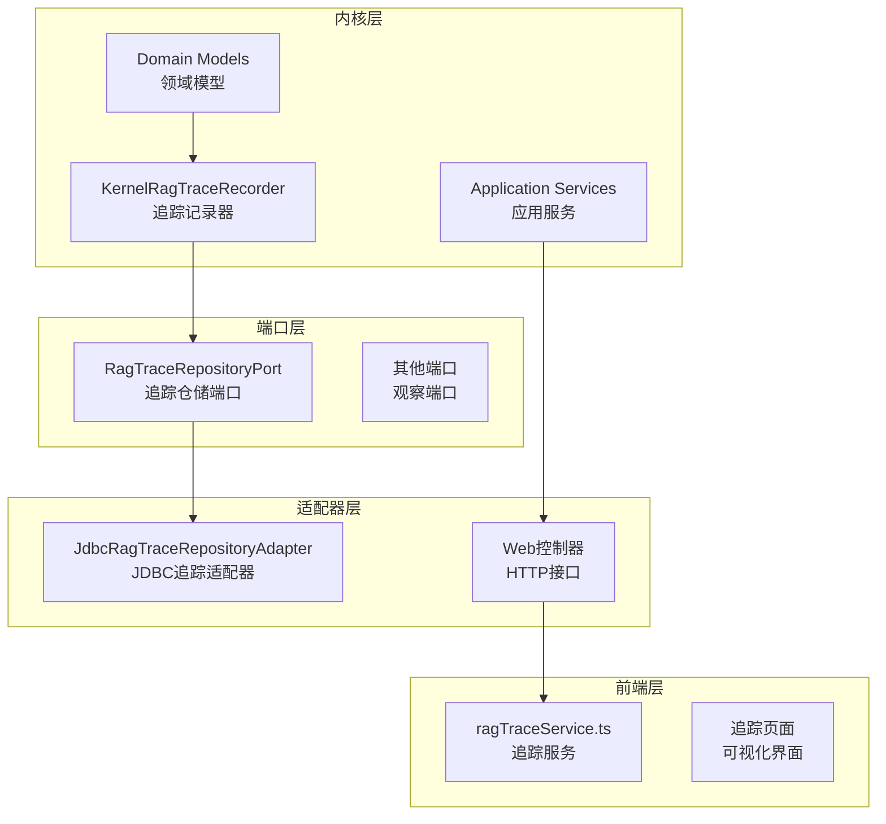
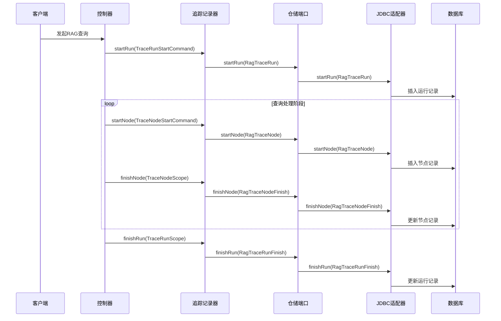
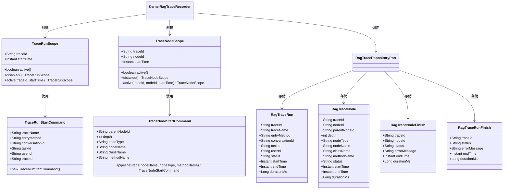
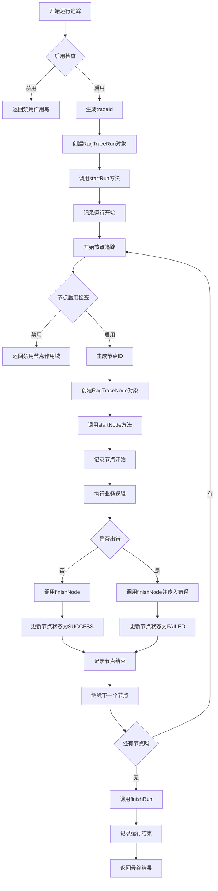
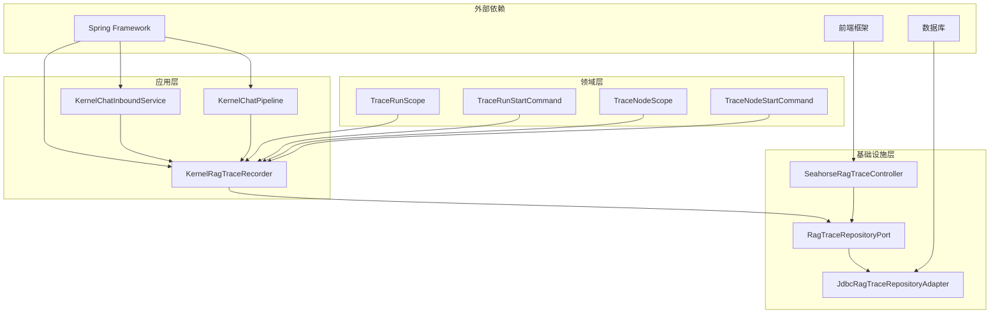

# 追踪领域模型

<cite>
**本文档引用的文件**
- [TraceNodeScope.java](file://seahorse-agent-kernel/src/main/java/com/miracle/ai/seahorse/agent/kernel/domain/trace/TraceNodeScope.java)
- [TraceNodeStartCommand.java](file://seahorse-agent-kernel/src/main/java/com/miracle/ai/seahorse/agent/kernel/domain/trace/TraceNodeStartCommand.java)
- [TraceRunScope.java](file://seahorse-agent-kernel/src/main/java/com/miracle/ai/seahorse/agent/kernel/domain/trace/TraceRunScope.java)
- [TraceRunStartCommand.java](file://seahorse-agent-kernel/src/main/java/com/miracle/ai/seahorse/agent/kernel/domain/trace/TraceRunStartCommand.java)
- [KernelRagTraceRecorder.java](file://seahorse-agent-kernel/src/main/java/com/miracle/ai/seahorse/agent/kernel/application/trace/KernelRagTraceRecorder.java)
- [RagTraceRepositoryPort.java](file://seahorse-agent-kernel/src/main/java/com/miracle/ai/seahorse/agent/ports/outbound/trace/RagTraceRepositoryPort.java)
- [RagTraceNode.java](file://seahorse-agent-kernel/src/main/java/com/miracle/ai/seahorse/agent/ports/outbound/trace/RagTraceNode.java)
- [RagTraceNodeFinish.java](file://seahorse-agent-kernel/src/main/java/com/miracle/ai/seahorse/agent/ports/outbound/trace/RagTraceNodeFinish.java)
- [RagTraceRun.java](file://seahorse-agent-kernel/src/main/java/com/miracle/ai/seahorse/agent/ports/outbound/trace/RagTraceRun.java)
- [RagTraceRunFinish.java](file://seahorse-agent-kernel/src/main/java/com/miracle/ai/seahorse/agent/ports/outbound/trace/RagTraceRunFinish.java)
- [RagTraceDetail.java](file://seahorse-agent-kernel/src/main/java/com/miracle/ai/seahorse/agent/ports/outbound/trace/RagTraceDetail.java)
- [RagTracePage.java](file://seahorse-agent-kernel/src/main/java/com/miracle/ai/seahorse/agent/ports/outbound/trace/RagTracePage.java)
- [RagTracePageRequest.java](file://seahorse-agent-kernel/src/main/java/com/miracle/ai/seahorse/agent/ports/outbound/trace/RagTracePageRequest.java)
- [KernelChatInboundService.java](file://seahorse-agent-kernel/src/main/java/com/miracle/ai/seahorse/agent/kernel/application/chat/KernelChatInboundService.java)
- [KernelChatPipeline.java](file://seahorse-agent-kernel/src/main/java/com/miracle/ai/seahorse/agent/kernel/application/chat/KernelChatPipeline.java)
- [SeahorseRagTraceController.java](file://seahorse-agent-adapter-web/src/main/java/com/miracle/ai/seahorse/agent/adapters/web/SeahorseRagTraceController.java)
- [ragTraceService.ts](file://frontend/src/services/ragTraceService.ts)
- [JdbcRagTraceRepositoryAdapter.java](file://seahorse-agent-adapter-repository-jdbc/src/main/java/com/miracle/ai/seahorse/agent/adapters/repository/jdbc/JdbcRagTraceRepositoryAdapter.java)
- [KernelRagTraceRecorderTests.java](file://seahorse-agent-tests/src/test/java/com/miracle/ai/seahorse/agent/kernel/application/trace/KernelRagTraceRecorderTests.java)
- [JdbcRagTraceRepositoryAdapterTests.java](file://seahorse-agent-adapter-repository-jdbc/src/test/java/com/miracle/ai/seahorse/agent/adapters/repository/jdbc/JdbcRagTraceRepositoryAdapterTests.java)
</cite>

## 目录
1. [引言](#引言)
2. [项目结构](#项目结构)
3. [核心组件](#核心组件)
4. [架构概览](#架构概览)
5. [详细组件分析](#详细组件分析)
6. [依赖关系分析](#依赖关系分析)
7. [性能考虑](#性能考虑)
8. [故障排除指南](#故障排除指南)
9. [结论](#结论)

## 引言

本文件深入解析海马智能代理系统的追踪领域模型设计。该系统实现了完整的RAG查询追踪机制，涵盖节点级别的追踪和运行级别的追踪。追踪模型通过四个核心领域对象实现：TraceNodeScope（节点追踪范围）、TraceNodeStartCommand（节点开始命令）、TraceRunScope（运行追踪范围）和TraceRunStartCommand（运行开始命令）。这些模型协同工作，为调试和性能分析提供全面的数据支持。

## 项目结构

追踪系统采用分层架构设计，主要分布在以下模块中：

**图表来源**
- [KernelRagTraceRecorder.java:1-125](file://seahorse-agent-kernel/src/main/java/com/miracle/ai/seahorse/agent/kernel/application/trace/KernelRagTraceRecorder.java#L1-L125)
- [RagTraceRepositoryPort.java:1-43](file://seahorse-agent-kernel/src/main/java/com/miracle/ai/seahorse/agent/ports/outbound/trace/RagTraceRepositoryPort.java#L1-L43)

**章节来源**
- [KernelRagTraceRecorder.java:1-125](file://seahorse-agent-kernel/src/main/java/com/miracle/ai/seahorse/agent/kernel/application/trace/KernelRagTraceRecorder.java#L1-L125)
- [RagTraceRepositoryPort.java:1-43](file://seahorse-agent-kernel/src/main/java/com/miracle/ai/seahorse/agent/ports/outbound/trace/RagTraceRepositoryPort.java#L1-L43)

## 核心组件

追踪系统的核心由四个关键领域模型构成，每个模型都有明确的职责和生命周期：

### 追踪运行模型

TraceRunScope和TraceRunStartCommand共同管理RAG查询的完整生命周期：

- **TraceRunScope**: 表示一次RAG查询的运行状态，包含traceId、启动时间、活动状态等信息
- **TraceRunStartCommand**: 描述运行启动时的配置参数，如trace名称、入口方法、会话ID等

### 追踪节点模型

TraceNodeScope和TraceNodeStartCommand负责管理查询过程中的各个阶段：

- **TraceNodeScope**: 表示单个处理节点的执行状态，包含节点ID、父节点ID、执行深度等
- **TraceNodeStartCommand**: 描述节点启动的详细信息，如节点类型、节点名称、类名、方法名等

**章节来源**
- [TraceRunScope.java](file://seahorse-agent-kernel/src/main/java/com/miracle/ai/seahorse/agent/kernel/domain/trace/TraceRunScope.java)
- [TraceRunStartCommand.java](file://seahorse-agent-kernel/src/main/java/com/miracle/ai/seahorse/agent/kernel/domain/trace/TraceRunStartCommand.java)
- [TraceNodeScope.java](file://seahorse-agent-kernel/src/main/java/com/miracle/ai/seahorse/agent/kernel/domain/trace/TraceNodeScope.java)
- [TraceNodeStartCommand.java](file://seahorse-agent-kernel/src/main/java/com/miracle/ai/seahorse/agent/kernel/domain/trace/TraceNodeStartCommand.java)

## 架构概览

追踪系统采用事件驱动的架构模式，通过观察者模式实现解耦：

**图表来源**
- [KernelRagTraceRecorder.java:65-142](file://seahorse-agent-kernel/src/main/java/com/miracle/ai/seahorse/agent/kernel/application/trace/KernelRagTraceRecorder.java#L65-L142)
- [RagTraceRepositoryPort.java:36-42](file://seahorse-agent-kernel/src/main/java/com/miracle/ai/seahorse/agent/ports/outbound/trace/RagTraceRepositoryPort.java#L36-L42)

## 详细组件分析

### 领域模型类图

**图表来源**
- [TraceRunScope.java](file://seahorse-agent-kernel/src/main/java/com/miracle/ai/seahorse/agent/kernel/domain/trace/TraceRunScope.java)
- [TraceRunStartCommand.java](file://seahorse-agent-kernel/src/main/java/com/miracle/ai/seahorse/agent/kernel/domain/trace/TraceRunStartCommand.java)
- [TraceNodeScope.java](file://seahorse-agent-kernel/src/main/java/com/miracle/ai/seahorse/agent/kernel/domain/trace/TraceNodeScope.java)
- [TraceNodeStartCommand.java](file://seahorse-agent-kernel/src/main/java/com/miracle/ai/seahorse/agent/kernel/domain/trace/TraceNodeStartCommand.java)
- [RagTraceRun.java](file://seahorse-agent-kernel/src/main/java/com/miracle/ai/seahorse/agent/ports/outbound/trace/RagTraceRun.java)
- [RagTraceNode.java](file://seahorse-agent-kernel/src/main/java/com/miracle/ai/seahorse/agent/ports/outbound/trace/RagTraceNode.java)
- [RagTraceNodeFinish.java](file://seahorse-agent-kernel/src/main/java/com/miracle/ai/seahorse/agent/ports/outbound/trace/RagTraceNodeFinish.java)
- [RagTraceRunFinish.java](file://seahorse-agent-kernel/src/main/java/com/miracle/ai/seahorse/agent/ports/outbound/trace/RagTraceRunFinish.java)

### 追踪记录器工作流程

**图表来源**
- [KernelRagTraceRecorder.java:65-142](file://seahorse-agent-kernel/src/main/java/com/miracle/ai/seahorse/agent/kernel/application/trace/KernelRagTraceRecorder.java#L65-L142)

### 追踪数据模型

追踪系统使用标准化的数据模型来确保数据的一致性和完整性：

#### 运行级追踪数据结构

| 字段名 | 类型 | 描述 | 约束 |
|--------|------|------|------|
| traceId | String | 追踪标识符 | 主键 |
| traceName | String | 追踪名称 | 必填 |
| entryMethod | String | 入口方法 | 必填 |
| conversationId | String | 会话ID | 可选 |
| taskId | String | 任务ID | 可选 |
| userId | String | 用户ID | 可选 |
| status | String | 运行状态 | 必填 |
| startTime | Instant | 开始时间 | 必填 |
| endTime | Instant | 结束时间 | 可选 |
| durationMs | Long | 持续时间(毫秒) | 可选 |

#### 节点级追踪数据结构

| 字段名 | 类型 | 描述 | 约束 |
|--------|------|------|------|
| traceId | String | 所属追踪ID | 外键 |
| nodeId | String | 节点标识符 | 主键 |
| parentNodeId | String | 父节点ID | 可选 |
| depth | Integer | 执行深度 | 必填 |
| nodeType | String | 节点类型 | 必填 |
| nodeName | String | 节点名称 | 必填 |
| className | String | 类名 | 必填 |
| methodName | String | 方法名 | 必填 |
| status | String | 节点状态 | 必填 |
| startTime | Instant | 开始时间 | 必填 |
| endTime | Instant | 结束时间 | 可选 |
| durationMs | Long | 持续时间(毫秒) | 可选 |

**章节来源**
- [RagTraceRun.java](file://seahorse-agent-kernel/src/main/java/com/miracle/ai/seahorse/agent/ports/outbound/trace/RagTraceRun.java)
- [RagTraceNode.java](file://seahorse-agent-kernel/src/main/java/com/miracle/ai/seahorse/agent/ports/outbound/trace/RagTraceNode.java)
- [RagTraceNodeFinish.java](file://seahorse-agent-kernel/src/main/java/com/miracle/ai/seahorse/agent/ports/outbound/trace/RagTraceNodeFinish.java)
- [RagTraceRunFinish.java](file://seahorse-agent-kernel/src/main/java/com/miracle/ai/seahorse/agent/ports/outbound/trace/RagTraceRunFinish.java)

## 依赖关系分析

追踪系统遵循Clean Architecture原则，具有清晰的依赖层次：

**图表来源**
- [KernelRagTraceRecorder.java:1-125](file://seahorse-agent-kernel/src/main/java/com/miracle/ai/seahorse/agent/kernel/application/trace/KernelRagTraceRecorder.java#L1-L125)
- [KernelChatInboundService.java:59-81](file://seahorse-agent-kernel/src/main/java/com/miracle/ai/seahorse/agent/kernel/application/chat/KernelChatInboundService.java#L59-L81)
- [KernelChatPipeline.java:268-269](file://seahorse-agent-kernel/src/main/java/com/miracle/ai/seahorse/agent/kernel/application/chat/KernelChatPipeline.java#L268-L269)

### 关键依赖关系

1. **应用层到领域层**: KernelRagTraceRecorder依赖于四个核心领域模型
2. **应用层到基础设施层**: 通过RagTraceRepositoryPort接口实现数据持久化
3. **领域层到应用层**: 领域模型不依赖具体实现，保持纯业务逻辑
4. **基础设施层到外部系统**: JDBC适配器连接数据库，Web控制器提供HTTP接口

**章节来源**
- [KernelRagTraceRecorder.java:1-125](file://seahorse-agent-kernel/src/main/java/com/miracle/ai/seahorse/agent/kernel/application/trace/KernelRagTraceRecorder.java#L1-L125)
- [RagTraceRepositoryPort.java:1-43](file://seahorse-agent-kernel/src/main/java/com/miracle/ai/seahorse/agent/ports/outbound/trace/RagTraceRepositoryPort.java#L1-L43)

## 性能考虑

追踪系统在设计时充分考虑了性能影响，采用了多种优化策略：

### 异步记录机制

追踪记录采用异步方式，避免阻塞主业务流程：

- 追踪数据写入使用独立线程池
- 批量写入减少数据库交互次数
- 缓存热点数据提高查询性能

### 内存管理

- 使用轻量级数据结构存储追踪信息
- 及时清理已完成的追踪数据
- 支持追踪数据的生命周期管理

### 数据库优化

- 追踪表设计支持高效查询
- 合理的索引策略优化查询性能
- 分页查询支持大数据量场景

## 故障排除指南

### 常见问题及解决方案

#### 追踪数据丢失

**症状**: 追踪记录不完整或丢失

**可能原因**:
1. 追踪功能被禁用
2. 数据库连接异常
3. 程序异常中断

**解决步骤**:
1. 检查追踪配置是否启用
2. 验证数据库连接状态
3. 查看应用日志中的追踪异常信息

#### 追踪性能问题

**症状**: 应用响应变慢，追踪操作影响主线程

**解决步骤**:
1. 检查异步记录配置
2. 优化数据库连接池设置
3. 调整追踪采样率

#### 数据查询异常

**症状**: 无法查询到预期的追踪数据

**解决步骤**:
1. 验证traceId格式正确性
2. 检查查询参数过滤条件
3. 确认数据已成功写入数据库

**章节来源**
- [KernelRagTraceRecorder.java:94-110](file://seahorse-agent-kernel/src/main/java/com/miracle/ai/seahorse/agent/kernel/application/trace/KernelRagTraceRecorder.java#L94-L110)
- [JdbcRagTraceRepositoryAdapterTests.java:64-74](file://seahorse-agent-adapter-repository-jdbc/src/test/java/com/miracle/ai/seahorse/agent/adapters/repository/jdbc/JdbcRagTraceRepositoryAdapterTests.java#L64-L74)

## 结论

海马智能代理系统的追踪领域模型设计体现了现代软件架构的最佳实践。通过清晰的分层设计、标准化的数据模型和完善的生命周期管理，系统能够为RAG查询提供全面的追踪能力。

### 主要优势

1. **模块化设计**: 四个核心领域模型职责明确，易于维护和扩展
2. **解耦架构**: 通过端口抽象实现基础设施无关的设计
3. **性能优化**: 异步记录和批量处理确保最小性能影响
4. **调试友好**: 详细的追踪数据支持高效的故障诊断

### 应用价值

- **开发调试**: 提供完整的查询执行路径和性能数据
- **性能分析**: 支持瓶颈识别和系统优化
- **运维监控**: 实时监控系统运行状态和健康状况
- **质量保证**: 为测试和验证提供可靠的数据支撑

该追踪系统为海马智能代理平台提供了坚实的技术基础，支持复杂AI应用的可观测性和可维护性需求。