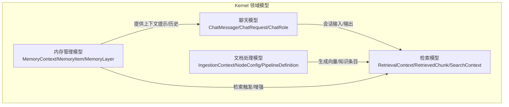
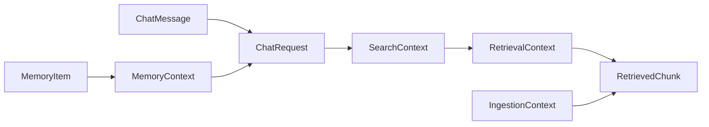
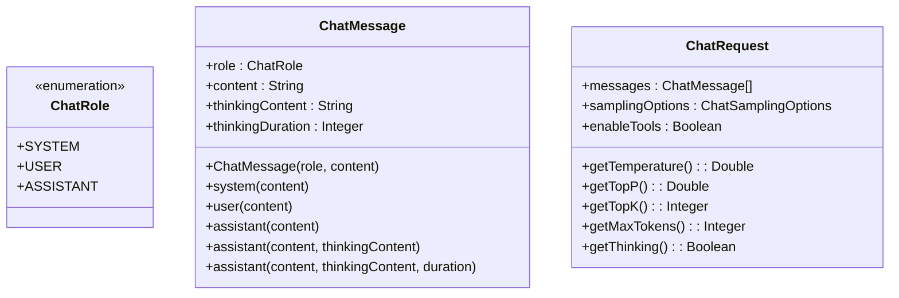
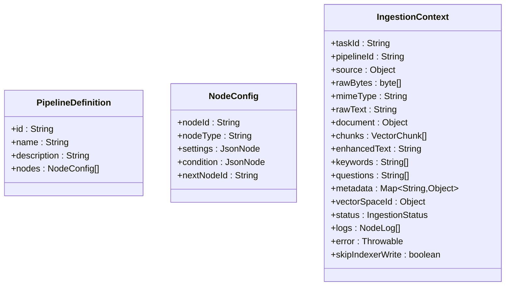
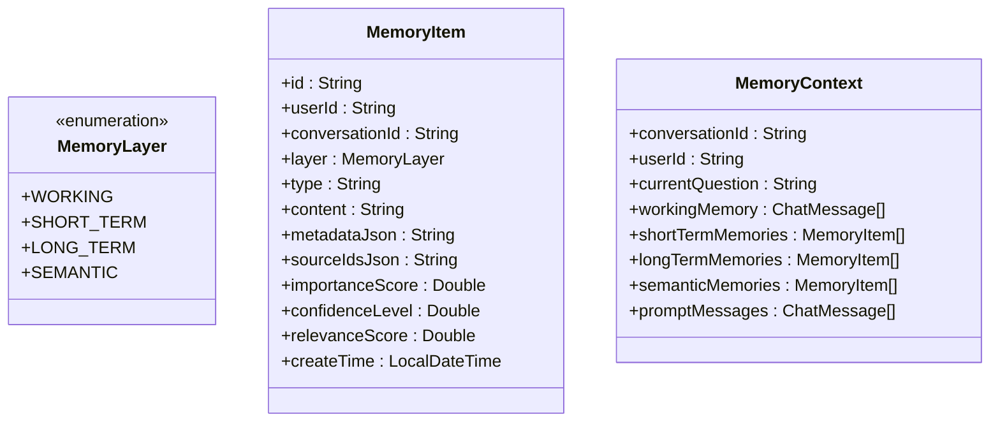
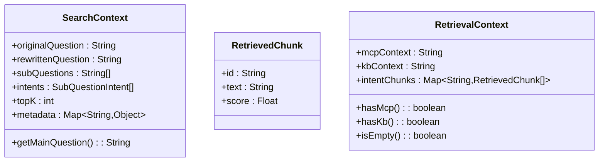
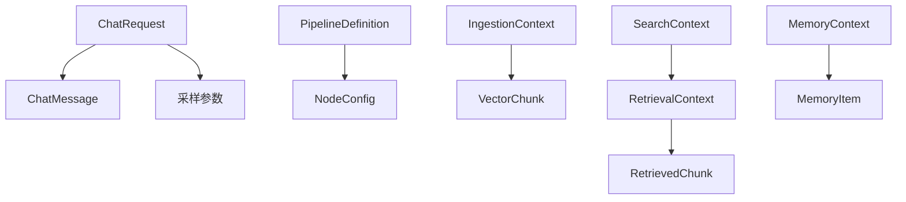

# 领域模型

<cite>
**本文引用的文件**
- [ChatMessage.java](file://seahorse-agent-kernel/src/main/java/com/miracle/ai/seahorse/agent/kernel/domain/chat/ChatMessage.java)
- [ChatRequest.java](file://seahorse-agent-kernel/src/main/java/com/miracle/ai/seahorse/agent/kernel/domain/chat/ChatRequest.java)
- [ChatRole.java](file://seahorse-agent-kernel/src/main/java/com/miracle/ai/seahorse/agent/kernel/domain/chat/ChatRole.java)
- [IngestionContext.java](file://seahorse-agent-kernel/src/main/java/com/miracle/ai/seahorse/agent/kernel/domain/ingestion/IngestionContext.java)
- [NodeConfig.java](file://seahorse-agent-kernel/src/main/java/com/miracle/ai/seahorse/agent/kernel/domain/ingestion/NodeConfig.java)
- [PipelineDefinition.java](file://seahorse-agent-kernel/src/main/java/com/miracle/ai/seahorse/agent/kernel/domain/ingestion/PipelineDefinition.java)
- [MemoryContext.java](file://seahorse-agent-kernel/src/main/java/com/miracle/ai/seahorse/agent/kernel/domain/memory/MemoryContext.java)
- [MemoryItem.java](file://seahorse-agent-kernel/src/main/java/com/miracle/ai/seahorse/agent/kernel/domain/memory/MemoryItem.java)
- [MemoryLayer.java](file://seahorse-agent-kernel/src/main/java/com/miracle/ai/seahorse/agent/kernel/domain/memory/MemoryLayer.java)
- [RetrievalContext.java](file://seahorse-agent-kernel/src/main/java/com/miracle/ai/seahorse/agent/kernel/domain/retrieval/RetrievalContext.java)
- [RetrievedChunk.java](file://seahorse-agent-kernel/src/main/java/com/miracle/ai/seahorse/agent/kernel/domain/retrieval/RetrievedChunk.java)
- [SearchContext.java](file://seahorse-agent-kernel/src/main/java/com/miracle/ai/seahorse/agent/kernel/domain/retrieval/SearchContext.java)
</cite>

## 目录
1. [引言](#引言)
2. [项目结构](#项目结构)
3. [核心组件](#核心组件)
4. [架构总览](#架构总览)
5. [详细组件分析](#详细组件分析)
6. [依赖分析](#依赖分析)
7. [性能考虑](#性能考虑)
8. [故障排查指南](#故障排查指南)
9. [结论](#结论)

## 引言
本文件面向 Kernel 的领域模型，系统梳理并阐释以下关键模型：聊天相关（ChatMessage、ChatRequest、ChatRole）、文档处理（IngestionContext、NodeConfig、PipelineDefinition）、内存管理（MemoryContext、MemoryItem、MemoryLayer）、检索（RetrievalContext、RetrievedChunk、SearchContext）。我们将从设计理念、属性定义、业务含义与使用场景出发，并阐明模型间的关系与约束，帮助读者快速理解并正确使用这些领域对象。

## 项目结构
Kernel 领域模型按功能域划分在独立包中，便于维护与演进：
- chat：对话消息与请求建模
- ingestion：入库流水线与上下文
- memory：多层记忆上下文与条目
- retrieval：检索上下文与命中分片
- 其他：stream、trace、vector 等（本文件聚焦上述核心）

## 核心组件
本节对各领域模型进行逐项说明，包含属性语义、典型用法与约束。

- 聊天模型
  - ChatRole：角色枚举，限定消息来源（系统、用户、助手）。
  - ChatMessage：单轮对话消息，支持普通内容与“思考”内容及耗时；提供便捷构造器以快速构建系统/用户/助手消息。
  - ChatRequest：一次推理请求的聚合载体，包含消息列表、采样参数与工具开关；通过采样选项暴露温度、topP、topK、最大token、是否启用思考等能力。

- 文档处理模型
  - PipelineDefinition：流水线定义，包含节点集合，描述处理流程拓扑。
  - NodeConfig：节点配置，包含节点ID、类型、设置、条件与下一跳节点，支撑可编排的处理链路。
  - IngestionContext：流水线执行上下文，承载源数据、原始字节、MIME、解析后文本、向量化分片、关键词、问题、元数据、向量空间标识、状态、日志、错误以及写入策略等。

- 内存管理模型
  - MemoryLayer：记忆分层枚举（工作、短期、长期、语义），用于区分不同记忆来源与用途。
  - MemoryItem：记忆条目，包含唯一标识、用户/会话、层、类型、内容、元数据、来源ID集合、重要性/置信度/相关性评分与创建时间等。
  - MemoryContext：加载后的多层记忆上下文，聚合当前问题、工作记忆、短期/长期/语义记忆以及提示消息，作为下游推理的上下文输入。

- 检索模型
  - SearchContext：检索共享上下文，包含原始问题、改写问题、子问题、意图、topK 与元数据；提供主问题选择逻辑。
  - RetrievedChunk：检索命中的最小单元，包含唯一ID、文本与得分。
  - RetrievalContext：KB 与 MCP 检索上下文的统一承载，支持两类来源标记与意图分组的命中集合，提供来源存在性判断与空值判定。

章节来源
- [ChatMessage.java:1-68](file://seahorse-agent-kernel/src/main/java/com/miracle/ai/seahorse/agent/kernel/domain/chat/ChatMessage.java#L1-L68)
- [ChatRequest.java:1-67](file://seahorse-agent-kernel/src/main/java/com/miracle/ai/seahorse/agent/kernel/domain/chat/ChatRequest.java#L1-L67)
- [ChatRole.java:1-29](file://seahorse-agent-kernel/src/main/java/com/miracle/ai/seahorse/agent/kernel/domain/chat/ChatRole.java#L1-L29)
- [IngestionContext.java:1-52](file://seahorse-agent-kernel/src/main/java/com/miracle/ai/seahorse/agent/kernel/domain/ingestion/IngestionContext.java#L1-L52)
- [NodeConfig.java:1-41](file://seahorse-agent-kernel/src/main/java/com/miracle/ai/seahorse/agent/kernel/domain/ingestion/NodeConfig.java#L1-L41)
- [PipelineDefinition.java:1-41](file://seahorse-agent-kernel/src/main/java/com/miracle/ai/seahorse/agent/kernel/domain/ingestion/PipelineDefinition.java#L1-L41)
- [MemoryContext.java:1-42](file://seahorse-agent-kernel/src/main/java/com/miracle/ai/seahorse/agent/kernel/domain/memory/MemoryContext.java#L1-L42)
- [MemoryItem.java:1-45](file://seahorse-agent-kernel/src/main/java/com/miracle/ai/seahorse/agent/kernel/domain/memory/MemoryItem.java#L1-L45)
- [MemoryLayer.java:1-29](file://seahorse-agent-kernel/src/main/java/com/miracle/ai/seahorse/agent/kernel/domain/memory/MemoryLayer.java#L1-L29)
- [RetrievalContext.java:1-51](file://seahorse-agent-kernel/src/main/java/com/miracle/ai/seahorse/agent/kernel/domain/retrieval/RetrievalContext.java#L1-L51)
- [RetrievedChunk.java:1-51](file://seahorse-agent-kernel/src/main/java/com/miracle/ai/seahorse/agent/kernel/domain/retrieval/RetrievedChunk.java#L1-L51)
- [SearchContext.java:1-54](file://seahorse-agent-kernel/src/main/java/com/miracle/ai/seahorse/agent/kernel/domain/retrieval/SearchContext.java#L1-L54)

## 架构总览
下图展示核心领域模型在典型推理流程中的交互关系：上游聊天输入经由检索与记忆增强，最终驱动下游生成响应。

图表来源
- [ChatMessage.java:1-68](file://seahorse-agent-kernel/src/main/java/com/miracle/ai/seahorse/agent/kernel/domain/chat/ChatMessage.java#L1-L68)
- [ChatRequest.java:1-67](file://seahorse-agent-kernel/src/main/java/com/miracle/ai/seahorse/agent/kernel/domain/chat/ChatRequest.java#L1-L67)
- [SearchContext.java:1-54](file://seahorse-agent-kernel/src/main/java/com/miracle/ai/seahorse/agent/kernel/domain/retrieval/SearchContext.java#L1-L54)
- [RetrievalContext.java:1-51](file://seahorse-agent-kernel/src/main/java/com/miracle/ai/seahorse/agent/kernel/domain/retrieval/RetrievalContext.java#L1-L51)
- [RetrievedChunk.java:1-51](file://seahorse-agent-kernel/src/main/java/com/miracle/ai/seahorse/agent/kernel/domain/retrieval/RetrievedChunk.java#L1-L51)
- [MemoryItem.java:1-45](file://seahorse-agent-kernel/src/main/java/com/miracle/ai/seahorse/agent/kernel/domain/memory/MemoryItem.java#L1-L45)
- [MemoryContext.java:1-42](file://seahorse-agent-kernel/src/main/java/com/miracle/ai/seahorse/agent/kernel/domain/memory/MemoryContext.java#L1-L42)
- [IngestionContext.java:1-52](file://seahorse-agent-kernel/src/main/java/com/miracle/ai/seahorse/agent/kernel/domain/ingestion/IngestionContext.java#L1-L52)

## 详细组件分析

### 聊天模型
- 设计理念
  - 将“角色+内容”的消息抽象为统一实体，支持“思考”内容与耗时统计，便于前端渲染与可观测性。
  - 请求层将消息、采样参数与工具开关聚合，屏蔽底层模型差异，便于上层统一调用。
- 属性与约束
  - ChatRole：仅允许系统、用户、助手三类角色。
  - ChatMessage：content 必填；assistant 角色可选携带 thinkingContent 与 thinkingDuration。
  - ChatRequest：messages 默认非空；采样参数通过 getter 暴露，避免直接访问内部对象。
- 使用场景
  - 对话编排：将历史消息与当前问题封装为 ChatRequest，传入推理管线。
  - 响应生成：根据 ChatRequest 的采样参数控制生成行为。

图表来源
- [ChatRole.java:1-29](file://seahorse-agent-kernel/src/main/java/com/miracle/ai/seahorse/agent/kernel/domain/chat/ChatRole.java#L1-L29)
- [ChatMessage.java:1-68](file://seahorse-agent-kernel/src/main/java/com/miracle/ai/seahorse/agent/kernel/domain/chat/ChatMessage.java#L1-L68)
- [ChatRequest.java:1-67](file://seahorse-agent-kernel/src/main/java/com/miracle/ai/seahorse/agent/kernel/domain/chat/ChatRequest.java#L1-L67)

章节来源
- [ChatMessage.java:1-68](file://seahorse-agent-kernel/src/main/java/com/miracle/ai/seahorse/agent/kernel/domain/chat/ChatMessage.java#L1-L68)
- [ChatRequest.java:1-67](file://seahorse-agent-kernel/src/main/java/com/miracle/ai/seahorse/agent/kernel/domain/chat/ChatRequest.java#L1-L67)
- [ChatRole.java:1-29](file://seahorse-agent-kernel/src/main/java/com/miracle/ai/seahorse/agent/kernel/domain/chat/ChatRole.java#L1-L29)

### 文档处理模型
- 设计理念
  - 以 PipelineDefinition 描述处理拓扑，以 NodeConfig 描述节点行为，IngestionContext 承载跨阶段状态，实现“定义—配置—执行”的清晰分离。
- 属性与约束
  - PipelineDefinition：nodes 非空且有序，描述节点执行顺序。
  - NodeConfig：nodeId 唯一标识节点；settings 与 condition 支持动态行为；nextNodeId 决定分支走向。
  - IngestionContext：rawBytes/rawText/mimeType/document/chunks/enhancedText/keywords/questions/metadata/vectorSpaceId/status/logs/error/skipIndexerWrite 等字段覆盖入库全流程关键状态。
- 使用场景
  - 定义：通过 PipelineDefinition 与 NodeConfig 组织处理步骤。
  - 执行：在 IngestionContext 中传递中间结果，逐步填充向量分片与元数据。

图表来源
- [PipelineDefinition.java:1-41](file://seahorse-agent-kernel/src/main/java/com/miracle/ai/seahorse/agent/kernel/domain/ingestion/PipelineDefinition.java#L1-L41)
- [NodeConfig.java:1-41](file://seahorse-agent-kernel/src/main/java/com/miracle/ai/seahorse/agent/kernel/domain/ingestion/NodeConfig.java#L1-L41)
- [IngestionContext.java:1-52](file://seahorse-agent-kernel/src/main/java/com/miracle/ai/seahorse/agent/kernel/domain/ingestion/IngestionContext.java#L1-L52)

章节来源
- [IngestionContext.java:1-52](file://seahorse-agent-kernel/src/main/java/com/miracle/ai/seahorse/agent/kernel/domain/ingestion/IngestionContext.java#L1-L52)
- [NodeConfig.java:1-41](file://seahorse-agent-kernel/src/main/java/com/miracle/ai/seahorse/agent/kernel/domain/ingestion/NodeConfig.java#L1-L41)
- [PipelineDefinition.java:1-41](file://seahorse-agent-kernel/src/main/java/com/miracle/ai/seahorse/agent/kernel/domain/ingestion/PipelineDefinition.java#L1-L41)

### 内存管理模型
- 设计理念
  - 多层记忆分层存储与检索，MemoryContext 作为统一入口聚合各层记忆与提示消息，降低上层耦合。
- 属性与约束
  - MemoryLayer：WORKING/SHORT_TERM/LONG_TERM/SEMANTIC 四层，分别对应工作缓冲、短期对话、长期事实、语义概念。
  - MemoryItem：包含评分与时间戳，便于排序与筛选；支持多来源ID关联。
  - MemoryContext：聚合 conversationId、userId、currentQuestion、workingMemory、shortTermMemories、longTermMemories、semanticMemories、promptMessages。
- 使用场景
  - 推理前准备：从持久化仓库加载各层记忆，组装 MemoryContext。
  - 推理中增强：将 MemoryContext 注入提示词或作为上下文输入。

图表来源
- [MemoryLayer.java:1-29](file://seahorse-agent-kernel/src/main/java/com/miracle/ai/seahorse/agent/kernel/domain/memory/MemoryLayer.java#L1-L29)
- [MemoryItem.java:1-45](file://seahorse-agent-kernel/src/main/java/com/miracle/ai/seahorse/agent/kernel/domain/memory/MemoryItem.java#L1-L45)
- [MemoryContext.java:1-42](file://seahorse-agent-kernel/src/main/java/com/miracle/ai/seahorse/agent/kernel/domain/memory/MemoryContext.java#L1-L42)

章节来源
- [MemoryContext.java:1-42](file://seahorse-agent-kernel/src/main/java/com/miracle/ai/seahorse/agent/kernel/domain/memory/MemoryContext.java#L1-L42)
- [MemoryItem.java:1-45](file://seahorse-agent-kernel/src/main/java/com/miracle/ai/seahorse/agent/kernel/domain/memory/MemoryItem.java#L1-L45)
- [MemoryLayer.java:1-29](file://seahorse-agent-kernel/src/main/java/com/miracle/ai/seahorse/agent/kernel/domain/memory/MemoryLayer.java#L1-L29)

### 检索模型
- 设计理念
  - 以 SearchContext 抽象检索阶段的共享状态，RetrievalContext 统一封装 KB 与 MCP 来源，RetrievedChunk 表达最小命中单元，形成“意图—检索—命中”的闭环。
- 属性与约束
  - SearchContext：originalQuestion/rewrittenQuestion/subQuestions/intents/topK/metadata；提供主问题选择逻辑。
  - RetrievedChunk：id/text/score，满足排序与去重需求。
  - RetrievalContext：mcpContext/kbContext 二选一或并存；intentChunks 以意图为键组织命中集合；提供来源存在性与空值判断方法。
- 使用场景
  - 检索前：基于 SearchContext 生成查询向量或关键词。
  - 检索中：将结果映射为 RetrievedChunk 并归集到 RetrievalContext。
  - 检索后：结合 MemoryContext 与检索结果生成最终提示。

图表来源
- [SearchContext.java:1-54](file://seahorse-agent-kernel/src/main/java/com/miracle/ai/seahorse/agent/kernel/domain/retrieval/SearchContext.java#L1-L54)
- [RetrievedChunk.java:1-51](file://seahorse-agent-kernel/src/main/java/com/miracle/ai/seahorse/agent/kernel/domain/retrieval/RetrievedChunk.java#L1-L51)
- [RetrievalContext.java:1-51](file://seahorse-agent-kernel/src/main/java/com/miracle/ai/seahorse/agent/kernel/domain/retrieval/RetrievalContext.java#L1-L51)

章节来源
- [RetrievalContext.java:1-51](file://seahorse-agent-kernel/src/main/java/com/miracle/ai/seahorse/agent/kernel/domain/retrieval/RetrievalContext.java#L1-L51)
- [RetrievedChunk.java:1-51](file://seahorse-agent-kernel/src/main/java/com/miracle/ai/seahorse/agent/kernel/domain/retrieval/RetrievedChunk.java#L1-L51)
- [SearchContext.java:1-54](file://seahorse-agent-kernel/src/main/java/com/miracle/ai/seahorse/agent/kernel/domain/retrieval/SearchContext.java#L1-L54)

### 流式处理模型（概览）
- StreamCompletionPayload：流式补全的载荷模型，承载增量输出片段与元信息，用于 SSE/Server-Sent Events 场景。
- StreamEventSender：事件发送器接口，负责将流式事件推送到客户端，确保端到端的实时性与可靠性。

（本节为概念性说明，不直接分析具体文件）

### 追踪模型（概览）
- TraceNodeScope：节点级追踪作用域，记录节点执行的开始、结束、耗时与状态。
- TraceRunScope：运行级追踪作用域，聚合多个节点的执行轨迹，形成完整的调用链。

（本节为概念性说明，不直接分析具体文件）

### 向量模型（概览）
- VectorChunk：向量存储的最小单元，通常与 RetrievedChunk 关联，承载向量维度与元数据。

（本节为概念性说明，不直接分析具体文件）

### 意图模型（概览）
- IntentNode：意图树节点，表达问题的意图结构。
- IntentGroup：意图分组，用于将相关意图聚合，辅助检索与路由。

（本节为概念性说明，不直接分析具体文件）

## 依赖分析
- 模型内聚与耦合
  - 聊天模型彼此内聚，ChatRequest 聚合 ChatMessage，二者强相关但职责清晰。
  - 文档处理模型通过 PipelineDefinition 与 NodeConfig 解耦“定义”与“执行”，IngestionContext 作为跨阶段载体弱耦合各节点。
  - 内存模型以 MemoryContext 为聚合点，隔离各层记忆来源，降低检索与生成阶段的复杂度。
  - 检索模型以 SearchContext 为输入，RetrievalContext 为输出，RetrievedChunk 为最小单元，形成清晰的数据流。
- 外部依赖与集成点
  - IngestionContext 依赖向量模型（如 VectorChunk）以承载分片；检索阶段依赖向量存储适配器。
  - ChatRequest 依赖采样参数与工具开关，体现与模型适配层的解耦。

图表来源
- [ChatRequest.java:1-67](file://seahorse-agent-kernel/src/main/java/com/miracle/ai/seahorse/agent/kernel/domain/chat/ChatRequest.java#L1-L67)
- [ChatMessage.java:1-68](file://seahorse-agent-kernel/src/main/java/com/miracle/ai/seahorse/agent/kernel/domain/chat/ChatMessage.java#L1-L68)
- [PipelineDefinition.java:1-41](file://seahorse-agent-kernel/src/main/java/com/miracle/ai/seahorse/agent/kernel/domain/ingestion/PipelineDefinition.java#L1-L41)
- [NodeConfig.java:1-41](file://seahorse-agent-kernel/src/main/java/com/miracle/ai/seahorse/agent/kernel/domain/ingestion/NodeConfig.java#L1-L41)
- [IngestionContext.java:1-52](file://seahorse-agent-kernel/src/main/java/com/miracle/ai/seahorse/agent/kernel/domain/ingestion/IngestionContext.java#L1-L52)
- [SearchContext.java:1-54](file://seahorse-agent-kernel/src/main/java/com/miracle/ai/seahorse/agent/kernel/domain/retrieval/SearchContext.java#L1-L54)
- [RetrievalContext.java:1-51](file://seahorse-agent-kernel/src/main/java/com/miracle/ai/seahorse/agent/kernel/domain/retrieval/RetrievalContext.java#L1-L51)
- [RetrievedChunk.java:1-51](file://seahorse-agent-kernel/src/main/java/com/miracle/ai/seahorse/agent/kernel/domain/retrieval/RetrievedChunk.java#L1-L51)
- [MemoryContext.java:1-42](file://seahorse-agent-kernel/src/main/java/com/miracle/ai/seahorse/agent/kernel/domain/memory/MemoryContext.java#L1-L42)
- [MemoryItem.java:1-45](file://seahorse-agent-kernel/src/main/java/com/miracle/ai/seahorse/agent/kernel/domain/memory/MemoryItem.java#L1-L45)

## 性能考虑
- 检索效率
  - 通过 SearchContext.topK 控制召回规模，结合 RetrievedChunk.score 实现快速排序与截断。
  - RetrievalContext 提供来源判别方法，可在混合检索时优先选择高置信来源。
- 内存管理
  - MemoryContext 聚合多层记忆，建议按需加载与缓存，避免一次性拉取全部历史。
  - MemoryItem 的评分字段可用于降维与筛选，减少后续处理开销。
- 文档处理
  - IngestionContext 中的 skipIndexerWrite 可在调试或回放场景跳过写入，提升吞吐。
  - PipelineDefinition 与 NodeConfig 的条件表达可实现早期短路，减少无效计算。

## 故障排查指南
- 聊天请求为空
  - 检查 ChatRequest.messages 是否为空；若为空，需先注入系统/用户/助手消息。
- 检索无结果
  - 校验 SearchContext 的 originalQuestion/rewrittenQuestion 是否合理；确认 RetrievalContext.hasMcp()/hasKb() 返回值。
- 记忆缺失
  - 确认 MemoryContext 的各层列表是否正确装配；检查 MemoryItem 的 layer 与 sourceIds 是否匹配预期。
- 入库异常
  - 查看 IngestionContext.error 与 logs，定位失败节点；必要时开启 skipIndexerWrite 进行隔离验证。

章节来源
- [ChatRequest.java:1-67](file://seahorse-agent-kernel/src/main/java/com/miracle/ai/seahorse/agent/kernel/domain/chat/ChatRequest.java#L1-L67)
- [RetrievalContext.java:1-51](file://seahorse-agent-kernel/src/main/java/com/miracle/ai/seahorse/agent/kernel/domain/retrieval/RetrievalContext.java#L1-L51)
- [MemoryContext.java:1-42](file://seahorse-agent-kernel/src/main/java/com/miracle/ai/seahorse/agent/kernel/domain/memory/MemoryContext.java#L1-L42)
- [IngestionContext.java:1-52](file://seahorse-agent-kernel/src/main/java/com/miracle/ai/seahorse/agent/kernel/domain/ingestion/IngestionContext.java#L1-L52)

## 结论
本文系统梳理了 Kernel 的核心领域模型，明确了各模型的职责边界、属性语义与使用场景，并通过关系图与流程图展示了它们在典型推理流程中的协作方式。遵循本文的模型设计与约束，有助于在保持低耦合的同时提升系统的可维护性与扩展性。