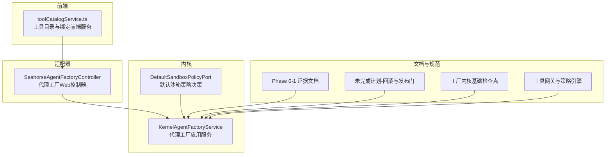
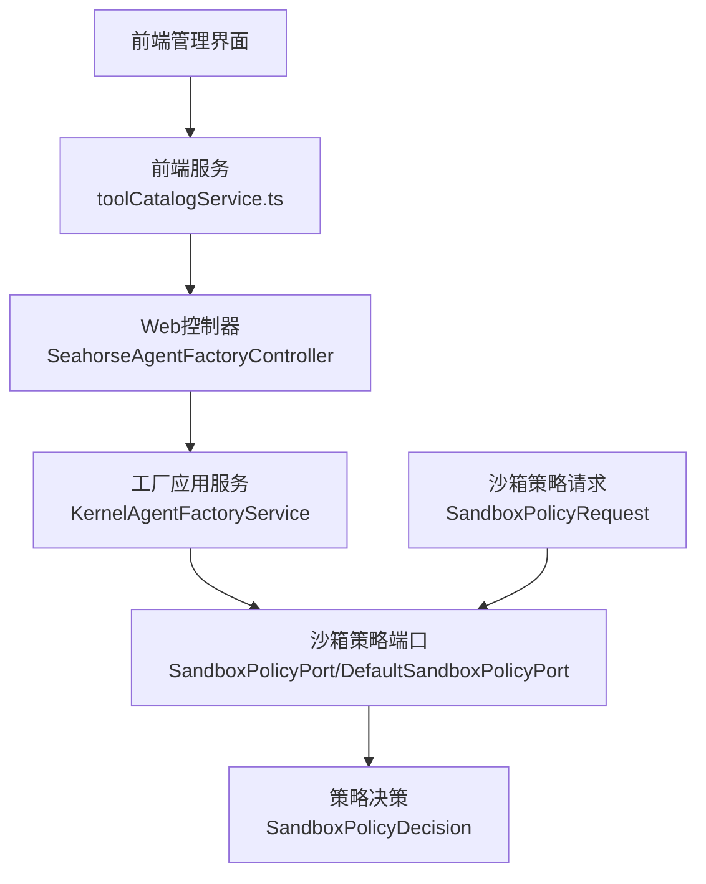
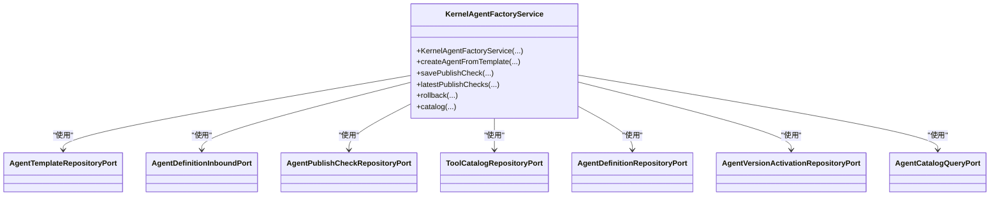
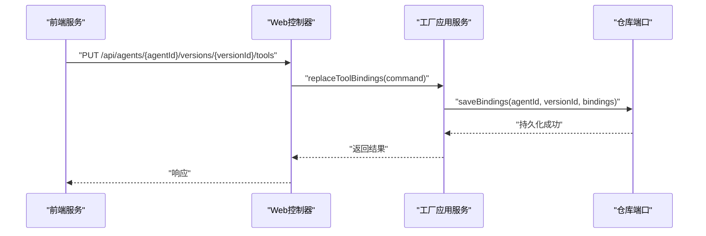
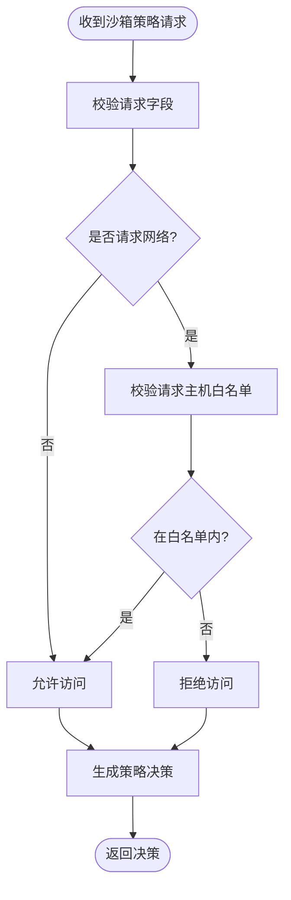
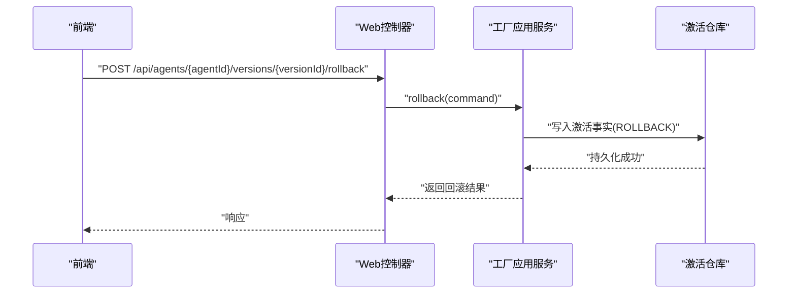
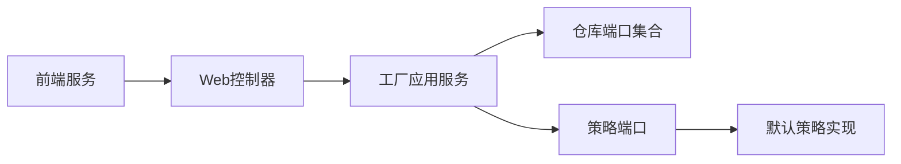

# 代理应用服务

<cite>
**本文引用的文件**
- [SandboxPolicyRequest.java](file://seahorse-agent-kernel/src/main/java/com/miracle/ai/seahorse/agent/ports/outbound/agent/SandboxPolicyRequest.java)
- [SandboxPolicyPort.java](file://seahorse-agent-kernel/src/main/java/com/miracle/ai/seahorse/agent/ports/outbound/agent/SandboxPolicyPort.java)
- [DefaultSandboxPolicyPort.java](file://seahorse-agent-kernel/src/main/java/com/miracle/ai/seahorse/agent/kernel/application/agent/sandbox/DefaultSandboxPolicyPort.java)
- [SandboxPolicyDecision.java](file://seahorse-agent-kernel/src/main/java/com/miracle/ai/seahorse/agent/kernel/domain/agent/sandbox/SandboxPolicyDecision.java)
- [KernelAgentFactoryService.java](file://seahorse-agent-kernel/src/main/java/com/miracle/ai/seahorse/agent/kernel/application/agent/factory/KernelAgentFactoryService.java)
- [SeahorseAgentFactoryController.java](file://seahorse-agent-adapter-web/src/main/java/com/miracle/ai/seahorse/agent/adapters/web/SeahorseAgentFactoryController.java)
- [KernelAgentToolBindingManagementServiceTests.java](file://seahorse-agent-kernel/src/test/java/com/miracle/ai/seahorse/agent/kernel/application/agent/tool/KernelAgentToolBindingManagementServiceTests.java)
- [toolCatalogService.ts](file://frontend/src/services/toolCatalogService.ts)
- [2026-05-23-ai-infra-phase-0-1 90-evidence.md](file://docs/aegis/work/2026-05-23-ai-infra-phase-0-1/90-evidence.md)
- [09-unfinished-phase-design-development-plans.md](file://docs/company-agent/ai-infra-phases/09-unfinished-phase-design-development-plans.md)
- [2026-05-26-ai-infra-agent-factory-kernel-foundation 20-checkpoint.md](file://docs/aegis/work/2026-05-26-ai-infra-agent-factory-kernel-foundation/20-checkpoint.md)
- [02-tool-gateway-policy-engine.md](file://docs/company-agent/ai-infra-phases/02-tool-gateway-policy-engine.md)
</cite>

## 目录
1. [简介](#简介)
2. [项目结构](#项目结构)
3. [核心组件](#核心组件)
4. [架构总览](#架构总览)
5. [详细组件分析](#详细组件分析)
6. [依赖关系分析](#依赖关系分析)
7. [性能考量](#性能考量)
8. [故障排查指南](#故障排查指南)
9. [结论](#结论)
10. [附录](#附录)

## 简介
本文件面向“代理应用服务”的实现与使用，系统性阐述代理系统的应用层服务，覆盖代理定义管理、代理运行时管理、代理工具管理、代理评估、代理工厂、代理路由、代理沙箱等核心子域。文档重点说明各子域的服务职责、实现细节与协作方式，包括代理生命周期管理（创建、更新、发布、回滚）、工具绑定与权限控制、成本管理与审计追踪等，并给出代理服务类的业务流程图与关键交互序列图，帮助读者在理解整体架构的同时掌握落地实现。

## 项目结构
本项目采用多模块分层组织：内核(kernel)提供领域模型与应用服务；适配器(adapter)对接外部系统；Web适配器提供HTTP接口；前端提供管理与查询界面；文档与测试支撑设计与验证。代理应用服务主要分布在内核与Web适配器中，围绕代理工厂、工具管理、沙箱策略等能力展开。

图表来源
- [KernelAgentFactoryService.java:112-138](file://seahorse-agent-kernel/src/main/java/com/miracle/ai/seahorse/agent/kernel/application/agent/factory/KernelAgentFactoryService.java#L112-L138)
- [DefaultSandboxPolicyPort.java:1-29](file://seahorse-agent-kernel/src/main/java/com/miracle/ai/seahorse/agent/kernel/application/agent/sandbox/DefaultSandboxPolicyPort.java#L1-L29)
- [SeahorseAgentFactoryController.java:120-144](file://seahorse-agent-adapter-web/src/main/java/com/miracle/ai/seahorse/agent/adapters/web/SeahorseAgentFactoryController.java#L120-L144)
- [toolCatalogService.ts:1-57](file://frontend/src/services/toolCatalogService.ts#L1-L57)
- [2026-05-23-ai-infra-phase-0-1 90-evidence.md:695-703](file://docs/aegis/work/2026-05-23-ai-infra-phase-0-1/90-evidence.md#L695-L703)
- [09-unfinished-phase-design-development-plans.md:3280-3290](file://docs/company-agent/ai-infra-phases/09-unfinished-phase-design-development-plans.md#L3280-L3290)
- [2026-05-26-ai-infra-agent-factory-kernel-foundation 20-checkpoint.md:1-22](file://docs/aegis/work/2026-05-26-ai-infra-agent-factory-kernel-foundation/20-checkpoint.md#L1-L22)
- [02-tool-gateway-policy-engine.md:238-249](file://docs/company-agent/ai-infra-phases/02-tool-gateway-policy-engine.md#L238-L249)

章节来源
- [KernelAgentFactoryService.java:112-138](file://seahorse-agent-kernel/src/main/java/com/miracle/ai/seahorse/agent/kernel/application/agent/factory/KernelAgentFactoryService.java#L112-L138)
- [SeahorseAgentFactoryController.java:120-144](file://seahorse-agent-adapter-web/src/main/java/com/miracle/ai/seahorse/agent/adapters/web/SeahorseAgentFactoryController.java#L120-L144)
- [toolCatalogService.ts:1-57](file://frontend/src/services/toolCatalogService.ts#L1-L57)
- [2026-05-23-ai-infra-phase-0-1 90-evidence.md:695-703](file://docs/aegis/work/2026-05-23-ai-infra-phase-0-1/90-evidence.md#L695-L703)
- [09-unfinished-phase-design-development-plans.md:3280-3290](file://docs/company-agent/ai-infra-phases/09-unfinished-phase-design-development-plans.md#L3280-L3290)
- [2026-05-26-ai-infra-agent-factory-kernel-foundation 20-checkpoint.md:1-22](file://docs/aegis/work/2026-05-26-ai-infra-agent-factory-kernel-foundation/20-checkpoint.md#L1-L22)
- [02-tool-gateway-policy-engine.md:238-249](file://docs/company-agent/ai-infra-phases/02-tool-gateway-policy-engine.md#L238-L249)

## 核心组件
- 代理工厂应用服务：负责代理模板创建、版本发布、回滚、目录查询等工厂级能力，组合内核定义端口与仓库端口，保证发布门与可见性规则。
- 代理工具管理：提供工具目录与代理绑定的管理API，支持按版本替换绑定快照、参数策略、调用限额与审计。
- 代理沙箱策略：基于运行时请求决定网络访问、主机白名单等策略，保障运行安全边界。
- 代理Web控制器：暴露REST接口，将前端请求转换为内核命令，执行工厂与工具管理操作。
- 前端服务：封装工具目录、绑定与调用审计等API，支撑管理界面与查询。

章节来源
- [KernelAgentFactoryService.java:112-138](file://seahorse-agent-kernel/src/main/java/com/miracle/ai/seahorse/agent/kernel/application/agent/factory/KernelAgentFactoryService.java#L112-L138)
- [SeahorseAgentFactoryController.java:120-144](file://seahorse-agent-adapter-web/src/main/java/com/miracle/ai/seahorse/agent/adapters/web/SeahorseAgentFactoryController.java#L120-L144)
- [SandboxPolicyRequest.java:25-32](file://seahorse-agent-kernel/src/main/java/com/miracle/ai/seahorse/agent/ports/outbound/agent/SandboxPolicyRequest.java#L25-L32)
- [SandboxPolicyPort.java:22-25](file://seahorse-agent-kernel/src/main/java/com/miracle/ai/seahorse/agent/ports/outbound/agent/SandboxPolicyPort.java#L22-L25)
- [DefaultSandboxPolicyPort.java:1-29](file://seahorse-agent-kernel/src/main/java/com/miracle/ai/seahorse/agent/kernel/application/agent/sandbox/DefaultSandboxPolicyPort.java#L1-L29)
- [toolCatalogService.ts:1-57](file://frontend/src/services/toolCatalogService.ts#L1-L57)

## 架构总览
代理应用服务以“内核应用服务 + 适配器 + 文档规范”协同工作。内核提供稳定的领域能力（工厂、工具、沙箱），适配器负责与外部系统集成（Web控制器、JDBC仓库、消息队列等），前端通过服务封装调用后端能力。

图表来源
- [SeahorseAgentFactoryController.java:120-144](file://seahorse-agent-adapter-web/src/main/java/com/miracle/ai/seahorse/agent/adapters/web/SeahorseAgentFactoryController.java#L120-L144)
- [KernelAgentFactoryService.java:112-138](file://seahorse-agent-kernel/src/main/java/com/miracle/ai/seahorse/agent/kernel/application/agent/factory/KernelAgentFactoryService.java#L112-L138)
- [SandboxPolicyPort.java:22-25](file://seahorse-agent-kernel/src/main/java/com/miracle/ai/seahorse/agent/ports/outbound/agent/SandboxPolicyPort.java#L22-L25)
- [DefaultSandboxPolicyPort.java:1-29](file://seahorse-agent-kernel/src/main/java/com/miracle/ai/seahorse/agent/kernel/application/agent/sandbox/DefaultSandboxPolicyPort.java#L1-L29)
- [SandboxPolicyRequest.java:25-32](file://seahorse-agent-kernel/src/main/java/com/miracle/ai/seahorse/agent/ports/outbound/agent/SandboxPolicyRequest.java#L25-L32)
- [SandboxPolicyDecision.java:22-30](file://seahorse-agent-kernel/src/main/java/com/miracle/ai/seahorse/agent/kernel/domain/agent/sandbox/SandboxPolicyDecision.java#L22-L30)

## 详细组件分析

### 代理工厂应用服务
职责与实现要点
- 代理模板与版本管理：组合模板仓库、定义端口、发布检查仓库、工具目录仓库、定义仓库、激活仓库与目录查询端口，提供从模板创建、保存发布检查、目录查询等能力。
- 发布门与回滚：遵循“已发布版本不可变、回滚需明确操作者与原因、仅允许指向已发布且未损坏版本”等规则；回滚写入激活事实表并记录审计事件。
- 目录查询：按租户、关键字、分页查询可调用代理，遵循可见性与启用状态过滤。

图表来源
- [KernelAgentFactoryService.java:112-138](file://seahorse-agent-kernel/src/main/java/com/miracle/ai/seahorse/agent/kernel/application/agent/factory/KernelAgentFactoryService.java#L112-L138)

章节来源
- [KernelAgentFactoryService.java:112-138](file://seahorse-agent-kernel/src/main/java/com/miracle/ai/seahorse/agent/kernel/application/agent/factory/KernelAgentFactoryService.java#L112-L138)
- [09-unfinished-phase-design-development-plans.md:3280-3290](file://docs/company-agent/ai-infra-phases/09-unfinished-phase-design-development-plans.md#L3280-L3290)
- [2026-05-26-ai-infra-agent-factory-kernel-foundation 20-checkpoint.md:1-22](file://docs/aegis/work/2026-05-26-ai-infra-agent-factory-kernel-foundation/20-checkpoint.md#L1-L22)

### 代理工具管理
职责与实现要点
- 工具目录：提供分页查询、详情、启用/禁用等管理能力，支持按提供方、资源类型、风险等级筛选。
- 代理工具绑定：按版本替换绑定快照，支持参数策略、审批策略、调用限额等；内核服务强制管理员角色、去重校验、生成绑定ID并持久化。
- 审计与查询：记录工具调用请求、决策与完成事件，提供只读审计查询API。

图表来源
- [SeahorseAgentFactoryController.java:120-144](file://seahorse-agent-adapter-web/src/main/java/com/miracle/ai/seahorse/agent/adapters/web/SeahorseAgentFactoryController.java#L120-L144)
- [KernelAgentToolBindingManagementServiceTests.java:127-167](file://seahorse-agent-kernel/src/test/java/com/miracle/ai/seahorse/agent/kernel/application/agent/tool/KernelAgentToolBindingManagementServiceTests.java#L127-L167)
- [2026-05-23-ai-infra-phase-0-1 90-evidence.md:695-703](file://docs/aegis/work/2026-05-23-ai-infra-phase-0-1/90-evidence.md#L695-L703)

章节来源
- [toolCatalogService.ts:1-57](file://frontend/src/services/toolCatalogService.ts#L1-L57)
- [KernelAgentToolBindingManagementServiceTests.java:127-167](file://seahorse-agent-kernel/src/test/java/com/miracle/ai/seahorse/agent/kernel/application/agent/tool/KernelAgentToolBindingManagementServiceTests.java#L127-L167)
- [2026-05-23-ai-infra-phase-0-1 90-evidence.md:695-703](file://docs/aegis/work/2026-05-23-ai-infra-phase-0-1/90-evidence.md#L695-L703)

### 代理沙箱策略
职责与实现要点
- 策略请求：包含租户ID、运行ID、运行时类型、是否请求网络、请求主机列表等上下文。
- 策略端口：定义决策接口，返回策略决策对象，包含决策ID、效果、原因码与原因描述。
- 默认实现：根据请求内容进行内置策略判断，确保网络与主机访问边界可控。

图表来源
- [SandboxPolicyRequest.java:25-32](file://seahorse-agent-kernel/src/main/java/com/miracle/ai/seahorse/agent/ports/outbound/agent/SandboxPolicyRequest.java#L25-L32)
- [SandboxPolicyPort.java:22-25](file://seahorse-agent-kernel/src/main/java/com/miracle/ai/seahorse/agent/ports/outbound/agent/SandboxPolicyPort.java#L22-L25)
- [DefaultSandboxPolicyPort.java:1-29](file://seahorse-agent-kernel/src/main/java/com/miracle/ai/seahorse/agent/kernel/application/agent/sandbox/DefaultSandboxPolicyPort.java#L1-L29)
- [SandboxPolicyDecision.java:22-30](file://seahorse-agent-kernel/src/main/java/com/miracle/ai/seahorse/agent/kernel/domain/agent/sandbox/SandboxPolicyDecision.java#L22-L30)

章节来源
- [SandboxPolicyRequest.java:25-32](file://seahorse-agent-kernel/src/main/java/com/miracle/ai/seahorse/agent/ports/outbound/agent/SandboxPolicyRequest.java#L25-L32)
- [SandboxPolicyPort.java:22-25](file://seahorse-agent-kernel/src/main/java/com/miracle/ai/seahorse/agent/ports/outbound/agent/SandboxPolicyPort.java#L22-L25)
- [DefaultSandboxPolicyPort.java:1-29](file://seahorse-agent-kernel/src/main/java/com/miracle/ai/seahorse/agent/kernel/application/agent/sandbox/DefaultSandboxPolicyPort.java#L1-L29)
- [SandboxPolicyDecision.java:22-30](file://seahorse-agent-kernel/src/main/java/com/miracle/ai/seahorse/agent/kernel/domain/agent/sandbox/SandboxPolicyDecision.java#L22-L30)

### 代理Web控制器
职责与实现要点
- 提供代理工厂相关API：从模板创建、保存发布检查、查询最新发布检查、回滚到旧版本、代理目录查询等。
- 参数安全：对回滚请求进行安全包装，确保租户ID、版本ID、操作者与原因码必填。
- 功能开关：部分管理能力需要高级特性开关开启。

章节来源
- [SeahorseAgentFactoryController.java:120-144](file://seahorse-agent-adapter-web/src/main/java/com/miracle/ai/seahorse/agent/adapters/web/SeahorseAgentFactoryController.java#L120-L144)

### 代理生命周期管理（创建、更新、发布、回滚）
- 创建：从模板创建草稿版本，禁止直接发布；模板禁用后不影响已有草稿。
- 更新：通过工具绑定替换快照、参数策略与审批策略更新。
- 发布：执行发布检查与生产门评估，满足条件后激活版本。
- 回滚：仅允许指向同租户、同代理、已发布的不可变版本，记录操作者与原因码。

图表来源
- [SeahorseAgentFactoryController.java:120-144](file://seahorse-agent-adapter-web/src/main/java/com/miracle/ai/seahorse/agent/adapters/web/SeahorseAgentFactoryController.java#L120-L144)
- [09-unfinished-phase-design-development-plans.md:3744-3752](file://docs/company-agent/ai-infra-phases/09-unfinished-phase-design-development-plans.md#L3744-L3752)

章节来源
- [09-unfinished-phase-design-development-plans.md:3280-3290](file://docs/company-agent/ai-infra-phases/09-unfinished-phase-design-development-plans.md#L3280-L3290)
- [09-unfinished-phase-design-development-plans.md:3744-3752](file://docs/company-agent/ai-infra-phases/09-unfinished-phase-design-development-plans.md#L3744-L3752)

### 权限控制与审计追踪
- 权限控制：工具调用前经策略端口决策，高风险或需要审批的调用需等待审批；CatalogBacked策略结合绑定限额与参数白名单。
- 审计追踪：记录请求、决策与完成事件，支持只读查询API，便于合规与问题定位。

章节来源
- [2026-05-23-ai-infra-phase-0-1 90-evidence.md:695-703](file://docs/aegis/work/2026-05-23-ai-infra-phase-0-1/90-evidence.md#L695-L703)
- [02-tool-gateway-policy-engine.md:238-249](file://docs/company-agent/ai-infra-phases/02-tool-gateway-policy-engine.md#L238-L249)

## 依赖关系分析
- 组件耦合：工厂应用服务通过多个仓库端口与查询端口解耦具体存储实现；Web控制器仅依赖应用服务与响应封装。
- 外部依赖：前端通过服务封装调用Web控制器；策略端口与默认实现解耦策略算法与运行时环境。
- 规范约束：文档明确了发布门、回滚规则、目录查询与审计接入等契约，确保跨模块一致性。

图表来源
- [SeahorseAgentFactoryController.java:120-144](file://seahorse-agent-adapter-web/src/main/java/com/miracle/ai/seahorse/agent/adapters/web/SeahorseAgentFactoryController.java#L120-L144)
- [KernelAgentFactoryService.java:112-138](file://seahorse-agent-kernel/src/main/java/com/miracle/ai/seahorse/agent/kernel/application/agent/factory/KernelAgentFactoryService.java#L112-L138)
- [DefaultSandboxPolicyPort.java:1-29](file://seahorse-agent-kernel/src/main/java/com/miracle/ai/seahorse/agent/kernel/application/agent/sandbox/DefaultSandboxPolicyPort.java#L1-L29)

章节来源
- [SeahorseAgentFactoryController.java:120-144](file://seahorse-agent-adapter-web/src/main/java/com/miracle/ai/seahorse/agent/adapters/web/SeahorseAgentFactoryController.java#L120-L144)
- [KernelAgentFactoryService.java:112-138](file://seahorse-agent-kernel/src/main/java/com/miracle/ai/seahorse/agent/kernel/application/agent/factory/KernelAgentFactoryService.java#L112-L138)

## 性能考量
- 策略决策：沙箱策略应尽量轻量，避免复杂网络查询；可引入缓存与白名单预热。
- 工具调用：通过策略端口与调用限额控制工具频率，减少不必要的后端压力。
- 目录查询：对代理目录查询增加索引与分页限制，避免全表扫描。
- 审计日志：批量写入与异步处理可降低对主流程的影响。

## 故障排查指南
- 回滚失败：确认目标版本已发布且未损坏；检查操作者与原因码是否填写；查看激活事实表是否重复激活。
- 工具调用被拒：检查工具绑定中的风险级别与审批策略；核对参数策略与调用限额；查看策略决策原因码。
- 目录查询异常：确认租户过滤与启用状态过滤逻辑；检查排序与分页参数。

章节来源
- [09-unfinished-phase-design-development-plans.md:3744-3752](file://docs/company-agent/ai-infra-phases/09-unfinished-phase-design-development-plans.md#L3744-L3752)
- [2026-05-23-ai-infra-phase-0-1 90-evidence.md:695-703](file://docs/aegis/work/2026-05-23-ai-infra-phase-0-1/90-evidence.md#L695-L703)

## 结论
代理应用服务通过清晰的内核-适配器分层与严格的文档规范，实现了代理定义、工具管理、沙箱策略与工厂能力的统一治理。其核心在于：以应用服务为中心编排领域能力，以端口契约解耦外部系统，以策略与审计保障安全与合规，并以Web控制器与前端服务提供可操作的管理界面。遵循发布门与回滚规则，配合工具绑定与参数策略，可有效平衡功能开放与风险控制。

## 附录
- 关键API与规则参考见“未完成计划-回滚与发布门”文档。
- 工具网关与策略引擎的退出条件与回滚策略可作为实施指导。

章节来源
- [09-unfinished-phase-design-development-plans.md:3280-3290](file://docs/company-agent/ai-infra-phases/09-unfinished-phase-design-development-plans.md#L3280-L3290)
- [02-tool-gateway-policy-engine.md:238-249](file://docs/company-agent/ai-infra-phases/02-tool-gateway-policy-engine.md#L238-L249)