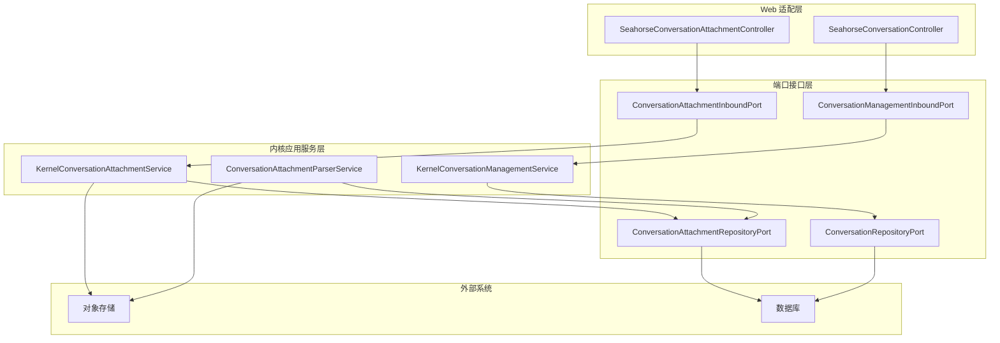
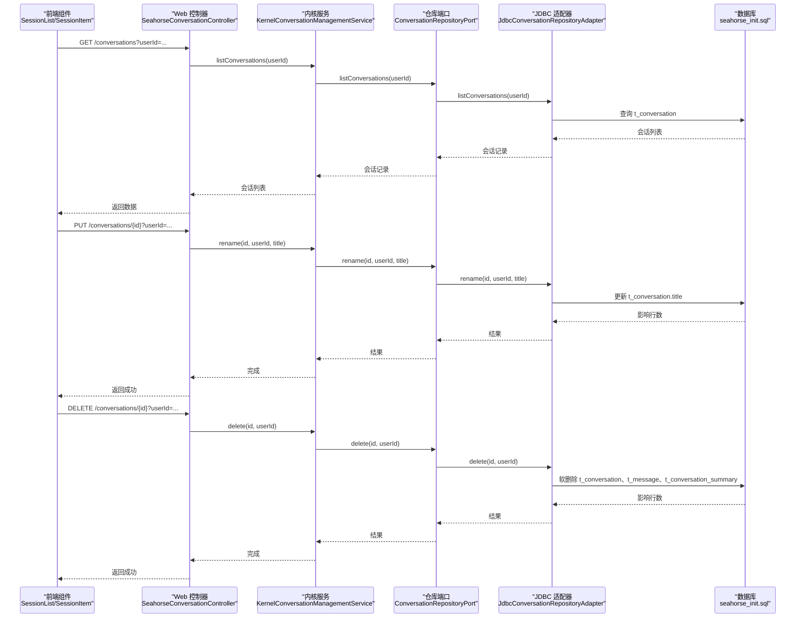
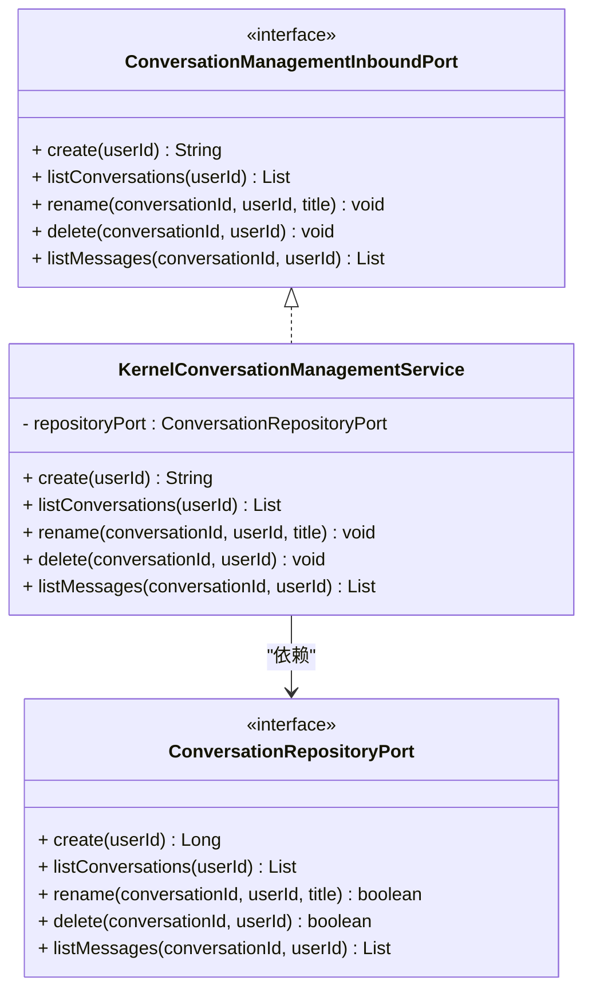
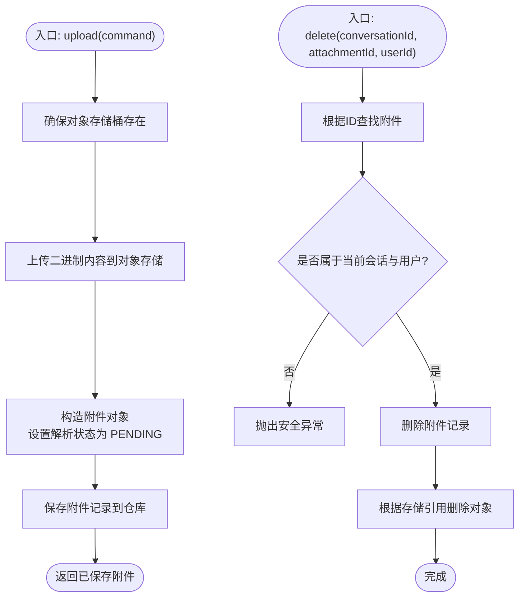
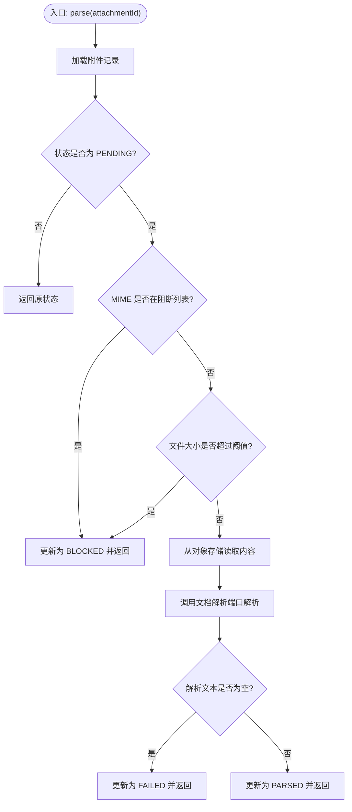
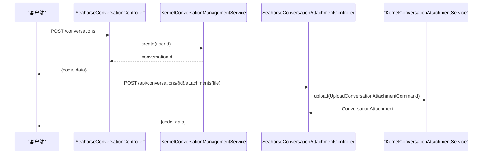
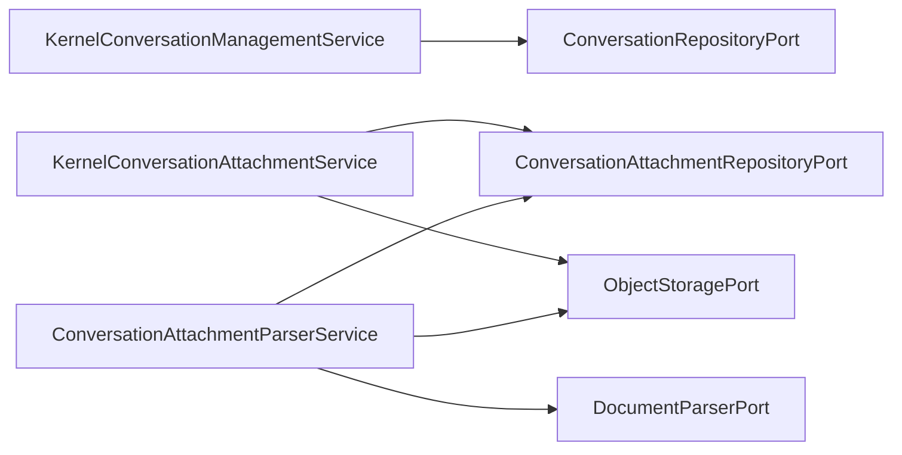

# 会话应用服务

<cite>
**本文引用的文件**
- [KernelConversationManagementService.java](file://seahorse-agent-kernel/src/main/java/com/miracle/ai/seahorse/agent/kernel/application/conversation/KernelConversationManagementService.java)
- [KernelConversationAttachmentService.java](file://seahorse-agent-kernel/src/main/java/com/miracle/ai/seahorse/agent/kernel/application/conversation/KernelConversationAttachmentService.java)
- [ConversationAttachmentParserService.java](file://seahorse-agent-kernel/src/main/java/com/miracle/ai/seahorse/agent/kernel/application/conversation/ConversationAttachmentParserService.java)
- [ConversationAttachment.java](file://seahorse-agent-kernel/src/main/java/com/miracle/ai/seahorse/agent/kernel/domain/conversation/ConversationAttachment.java)
- [ConversationManagementInboundPort.java](file://seahorse-agent-kernel/src/main/java/com/miracle/ai/seahorse/agent/ports/inbound/conversation/ConversationManagementInboundPort.java)
- [ConversationAttachmentInboundPort.java](file://seahorse-agent-kernel/src/main/java/com/miracle/ai/seahorse/agent/ports/inbound/conversation/ConversationAttachmentInboundPort.java)
- [ConversationRepositoryPort.java](file://seahorse-agent-kernel/src/main/java/com/miracle/ai/seahorse/agent/ports/outbound/conversation/ConversationRepositoryPort.java)
- [ConversationAttachmentRepositoryPort.java](file://seahorse-agent-kernel/src/main/java/com/miracle/ai/seahorse/agent/ports/outbound/conversation/ConversationAttachmentRepositoryPort.java)
- [SeahorseConversationController.java](file://seahorse-agent-adapter-web/src/main/java/com/miracle/ai/seahorse/agent/adapters/web/SeahorseConversationController.java)
- [SeahorseConversationAttachmentController.java](file://seahorse-agent-adapter-web/src/main/java/com/miracle/ai/seahorse/agent/adapters/web/SeahorseConversationAttachmentController.java)
- [会话管理应用服务.md](file://docs/zh/content/后端系统/核心内核/应用服务层/会话管理应用服务.md)
</cite>

## 目录
1. [简介](#简介)
2. [项目结构](#项目结构)
3. [核心组件](#核心组件)
4. [架构概览](#架构概览)
5. [详细组件分析](#详细组件分析)
6. [依赖分析](#依赖分析)
7. [性能考虑](#性能考虑)
8. [故障排查指南](#故障排查指南)
9. [结论](#结论)
10. [附录](#附录)

## 简介
本文件聚焦“会话应用服务”的实现与使用，系统性阐述会话管理应用服务在内核层的职责边界与交互方式，覆盖会话创建、会话维护、会话附件上传与解析等关键能力。文档重点说明：
- 会话生命周期管理：创建、重命名、删除、消息列表查询
- 会话附件处理：上传、列表查询、删除、异步解析与状态管理
- 与聊天应用服务、记忆系统协作：通过端口接口解耦，确保会话数据完整性与一致性
- 典型业务流程：会话恢复、上下文装配、附件解析与检索

## 项目结构
会话应用服务位于内核模块，通过入站端口暴露能力，并依赖出站端口对接存储与对象存储。Web 适配器将 HTTP 请求转发至内核服务，形成清晰的分层架构。

**图表来源**
- [SeahorseConversationController.java:40-101](file://seahorse-agent-adapter-web/src/main/java/com/miracle/ai/seahorse/agent/adapters/web/SeahorseConversationController.java#L40-L101)
- [SeahorseConversationAttachmentController.java:39-99](file://seahorse-agent-adapter-web/src/main/java/com/miracle/ai/seahorse/agent/adapters/web/SeahorseConversationAttachmentController.java#L39-L99)
- [KernelConversationManagementService.java:31-95](file://seahorse-agent-kernel/src/main/java/com/miracle/ai/seahorse/agent/kernel/application/conversation/KernelConversationManagementService.java#L31-L95)
- [KernelConversationAttachmentService.java:36-129](file://seahorse-agent-kernel/src/main/java/com/miracle/ai/seahorse/agent/kernel/application/conversation/KernelConversationAttachmentService.java#L36-L129)
- [ConversationAttachmentParserService.java:42-126](file://seahorse-agent-kernel/src/main/java/com/miracle/ai/seahorse/agent/kernel/application/conversation/ConversationAttachmentParserService.java#L42-L126)

**章节来源**
- [SeahorseConversationController.java:40-101](file://seahorse-agent-adapter-web/src/main/java/com/miracle/ai/seahorse/agent/adapters/web/SeahorseConversationController.java#L40-L101)
- [SeahorseConversationAttachmentController.java:39-99](file://seahorse-agent-adapter-web/src/main/java/com/miracle/ai/seahorse/agent/adapters/web/SeahorseConversationAttachmentController.java#L39-L99)
- [KernelConversationManagementService.java:31-95](file://seahorse-agent-kernel/src/main/java/com/miracle/ai/seahorse/agent/kernel/application/conversation/KernelConversationManagementService.java#L31-L95)
- [KernelConversationAttachmentService.java:36-129](file://seahorse-agent-kernel/src/main/java/com/miracle/ai/seahorse/agent/kernel/application/conversation/KernelConversationAttachmentService.java#L36-L129)
- [ConversationAttachmentParserService.java:42-126](file://seahorse-agent-kernel/src/main/java/com/miracle/ai/seahorse/agent/kernel/application/conversation/ConversationAttachmentParserService.java#L42-L126)

## 核心组件
- 会话管理应用服务：提供会话创建、查询、重命名、删除与消息列表查询能力，统一输入校验与错误处理。
- 会话附件应用服务：负责附件上传、存储、列表查询与删除，生成资源引用 JSON 以供后续上下文装配。
- 附件解析服务：异步解析附件内容，更新解析状态，支持失败与阻断处理。
- Web 控制器：将 HTTP 请求映射为内核服务调用，统一响应格式与用户标识解析。

**章节来源**
- [KernelConversationManagementService.java:31-95](file://seahorse-agent-kernel/src/main/java/com/miracle/ai/seahorse/agent/kernel/application/conversation/KernelConversationManagementService.java#L31-L95)
- [KernelConversationAttachmentService.java:36-129](file://seahorse-agent-kernel/src/main/java/com/miracle/ai/seahorse/agent/kernel/application/conversation/KernelConversationAttachmentService.java#L36-L129)
- [ConversationAttachmentParserService.java:42-126](file://seahorse-agent-kernel/src/main/java/com/miracle/ai/seahorse/agent/kernel/application/conversation/ConversationAttachmentParserService.java#L42-L126)
- [SeahorseConversationController.java:40-101](file://seahorse-agent-adapter-web/src/main/java/com/miracle/ai/seahorse/agent/adapters/web/SeahorseConversationController.java#L40-L101)
- [SeahorseConversationAttachmentController.java:39-99](file://seahorse-agent-adapter-web/src/main/java/com/miracle/ai/seahorse/agent/adapters/web/SeahorseConversationAttachmentController.java#L39-L99)

## 架构概览
下图展示从 Web 控制器到内核服务再到数据访问层的调用链路，以及与数据库表结构的对应关系。

**图表来源**
- [会话管理应用服务.md:104-142](file://docs/zh/content/后端系统/核心内核/应用服务层/会话管理应用服务.md#L104-L142)

**章节来源**
- [会话管理应用服务.md:101-142](file://docs/zh/content/后端系统/核心内核/应用服务层/会话管理应用服务.md#L101-L142)

## 详细组件分析

### 会话管理应用服务
- 职责边界：会话生命周期管理，包含创建、查询、重命名、删除与消息列表查询。
- 输入校验：严格校验用户标识与标题长度，避免无效数据进入存储层。
- 错误处理：会话不存在时抛出明确异常，保证上层调用可感知失败原因。
- 与 Web 控制器协作：通过统一的入站端口接口，Web 控制器仅负责参数解析与响应封装。

**图表来源**
- [ConversationManagementInboundPort.java:28-39](file://seahorse-agent-kernel/src/main/java/com/miracle/ai/seahorse/agent/ports/inbound/conversation/ConversationManagementInboundPort.java#L28-L39)
- [KernelConversationManagementService.java:31-95](file://seahorse-agent-kernel/src/main/java/com/miracle/ai/seahorse/agent/kernel/application/conversation/KernelConversationManagementService.java#L31-L95)
- [ConversationRepositoryPort.java:25-36](file://seahorse-agent-kernel/src/main/java/com/miracle/ai/seahorse/agent/ports/outbound/conversation/ConversationRepositoryPort.java#L25-L36)

**章节来源**
- [KernelConversationManagementService.java:31-95](file://seahorse-agent-kernel/src/main/java/com/miracle/ai/seahorse/agent/kernel/application/conversation/KernelConversationManagementService.java#L31-L95)
- [ConversationManagementInboundPort.java:28-39](file://seahorse-agent-kernel/src/main/java/com/miracle/ai/seahorse/agent/ports/inbound/conversation/ConversationManagementInboundPort.java#L28-L39)
- [ConversationRepositoryPort.java:25-36](file://seahorse-agent-kernel/src/main/java/com/miracle/ai/seahorse/agent/ports/outbound/conversation/ConversationRepositoryPort.java#L25-L36)

### 会话附件应用服务
- 附件上传：确保对象存储桶存在，上传二进制内容，生成附件记录并持久化。
- 资源引用：构建资源引用 JSON，包含附件 ID、会话 ID、用户 ID 与存储引用，便于后续上下文装配。
- 删除逻辑：校验归属关系，删除记录并同步清理对象存储中的文件。
- MIME 类型与文件名：默认类型与名称回退策略，保障兼容性。

**图表来源**
- [KernelConversationAttachmentService.java:53-98](file://seahorse-agent-kernel/src/main/java/com/miracle/ai/seahorse/agent/kernel/application/conversation/KernelConversationAttachmentService.java#L53-L98)

**章节来源**
- [KernelConversationAttachmentService.java:36-129](file://seahorse-agent-kernel/src/main/java/com/miracle/ai/seahorse/agent/kernel/application/conversation/KernelConversationAttachmentService.java#L36-L129)
- [ConversationAttachment.java:23-68](file://seahorse-agent-kernel/src/main/java/com/miracle/ai/seahorse/agent/kernel/domain/conversation/ConversationAttachment.java#L23-L68)

### 附件解析服务
- 状态机：PENDING → PARSING → PARSED/FAILED/BLOCKED，确保幂等与可追踪。
- 安全与容量限制：阻断特定 MIME 类型与超大文件，避免系统风险。
- 内容解析：从对象存储读取内容，委托文档解析端口生成文本，更新解析状态与资源引用。
- 失败处理：IO 异常与运行时异常均记录日志并标记为 FAILED。

**图表来源**
- [ConversationAttachmentParserService.java:69-109](file://seahorse-agent-kernel/src/main/java/com/miracle/ai/seahorse/agent/kernel/application/conversation/ConversationAttachmentParserService.java#L69-L109)

**章节来源**
- [ConversationAttachmentParserService.java:42-126](file://seahorse-agent-kernel/src/main/java/com/miracle/ai/seahorse/agent/kernel/application/conversation/ConversationAttachmentParserService.java#L42-L126)

### Web 控制器集成
- 会话控制器：提供创建、查询、重命名、删除与消息列表查询的 REST 接口，统一响应格式与用户标识解析。
- 附件控制器：支持多部分上传、列表查询与删除，封装命令对象并转交内核服务处理。

**图表来源**
- [SeahorseConversationController.java:53-96](file://seahorse-agent-adapter-web/src/main/java/com/miracle/ai/seahorse/agent/adapters/web/SeahorseConversationController.java#L53-L96)
- [SeahorseConversationAttachmentController.java:51-97](file://seahorse-agent-adapter-web/src/main/java/com/miracle/ai/seahorse/agent/adapters/web/SeahorseConversationAttachmentController.java#L51-L97)

**章节来源**
- [SeahorseConversationController.java:40-101](file://seahorse-agent-adapter-web/src/main/java/com/miracle/ai/seahorse/agent/adapters/web/SeahorseConversationController.java#L40-L101)
- [SeahorseConversationAttachmentController.java:39-99](file://seahorse-agent-adapter-web/src/main/java/com/miracle/ai/seahorse/agent/adapters/web/SeahorseConversationAttachmentController.java#L39-L99)

## 依赖分析
- 组件耦合：内核应用服务通过端口接口与外部系统解耦，便于替换存储实现与对象存储适配器。
- 直接依赖：
  - 会话管理服务依赖会话仓库端口
  - 附件服务依赖附件仓库端口与对象存储端口
  - 附件解析服务依赖附件仓库端口、对象存储端口与文档解析端口
- 潜在循环依赖：当前实现采用单向依赖，未见循环依赖迹象。

**图表来源**
- [KernelConversationManagementService.java:35-39](file://seahorse-agent-kernel/src/main/java/com/miracle/ai/seahorse/agent/kernel/application/conversation/KernelConversationManagementService.java#L35-L39)
- [KernelConversationAttachmentService.java:44-51](file://seahorse-agent-kernel/src/main/java/com/miracle/ai/seahorse/agent/kernel/application/conversation/KernelConversationAttachmentService.java#L44-L51)
- [ConversationAttachmentParserService.java:54-64](file://seahorse-agent-kernel/src/main/java/com/miracle/ai/seahorse/agent/kernel/application/conversation/ConversationAttachmentParserService.java#L54-L64)

**章节来源**
- [KernelConversationManagementService.java:35-39](file://seahorse-agent-kernel/src/main/java/com/miracle/ai/seahorse/agent/kernel/application/conversation/KernelConversationManagementService.java#L35-L39)
- [KernelConversationAttachmentService.java:44-51](file://seahorse-agent-kernel/src/main/java/com/miracle/ai/seahorse/agent/kernel/application/conversation/KernelConversationAttachmentService.java#L44-L51)
- [ConversationAttachmentParserService.java:54-64](file://seahorse-agent-kernel/src/main/java/com/miracle/ai/seahorse/agent/kernel/application/conversation/ConversationAttachmentParserService.java#L54-L64)

## 性能考虑
- 查询优化：会话列表与消息列表查询应配合数据库索引与分页策略，避免全表扫描。
- 存储与解析：附件解析限制文件大小与 MIME 类型，减少 IO 与解析开销；建议异步解析并缓存解析结果。
- 对象存储：批量上传与并发下载需结合存储端口的并发能力与网络带宽进行评估。
- 日志与可观测性：解析失败与阻断场景应记录关键指标，便于定位性能瓶颈。

## 故障排查指南
- 会话不存在：当重命名或删除操作返回失败时，检查会话 ID 与用户标识是否匹配。
- 附件归属问题：删除附件前需确认附件属于当前会话与用户，否则抛出安全异常。
- 解析失败：查看附件 MIME 类型与大小是否触发阻断规则；检查对象存储连接与文档解析端口可用性。
- 响应异常：Web 控制器统一返回 code 与 data 字段，若 code 非 0，需结合服务端日志定位问题。

**章节来源**
- [KernelConversationManagementService.java:59-71](file://seahorse-agent-kernel/src/main/java/com/miracle/ai/seahorse/agent/kernel/application/conversation/KernelConversationManagementService.java#L59-L71)
- [KernelConversationAttachmentService.java:88-98](file://seahorse-agent-kernel/src/main/java/com/miracle/ai/seahorse/agent/kernel/application/conversation/KernelConversationAttachmentService.java#L88-L98)
- [ConversationAttachmentParserService.java:104-108](file://seahorse-agent-kernel/src/main/java/com/miracle/ai/seahorse/agent/kernel/application/conversation/ConversationAttachmentParserService.java#L104-L108)
- [SeahorseConversationController.java:53-96](file://seahorse-agent-adapter-web/src/main/java/com/miracle/ai/seahorse/agent/adapters/web/SeahorseConversationController.java#L53-L96)
- [SeahorseConversationAttachmentController.java:51-97](file://seahorse-agent-adapter-web/src/main/java/com/miracle/ai/seahorse/agent/adapters/web/SeahorseConversationAttachmentController.java#L51-L97)

## 结论
会话应用服务通过清晰的端口分离与严格的输入校验，实现了会话生命周期管理与附件处理的稳定能力。结合 Web 控制器与对象存储、数据库适配器，形成可扩展、可维护的会话数据管理体系。建议在生产环境中完善索引策略、异步解析与监控告警，持续提升系统稳定性与性能表现。

## 附录
- 会话与消息持久化：会话管理服务依赖会话仓库端口进行 CRUD 操作，确保会话与消息数据的一致性与可恢复性。
- 记忆系统协作：附件解析后的资源引用可用于上下文装配，与记忆引擎协同，增强多轮对话的上下文理解与检索能力。
- 业务流程示例：
  - 会话恢复：通过会话 ID 与用户标识查询消息列表，重建对话上下文。
  - 附件解析：上传后异步解析，解析完成后在上下文装配中使用解析文本。
  - 会话恢复与清理：删除会话时同步清理相关附件与消息，避免数据残留。