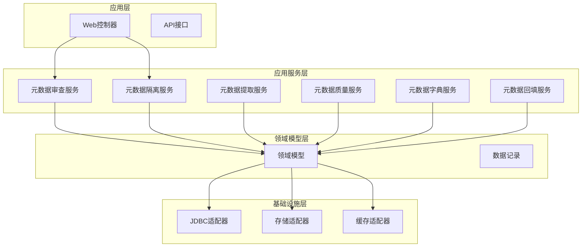
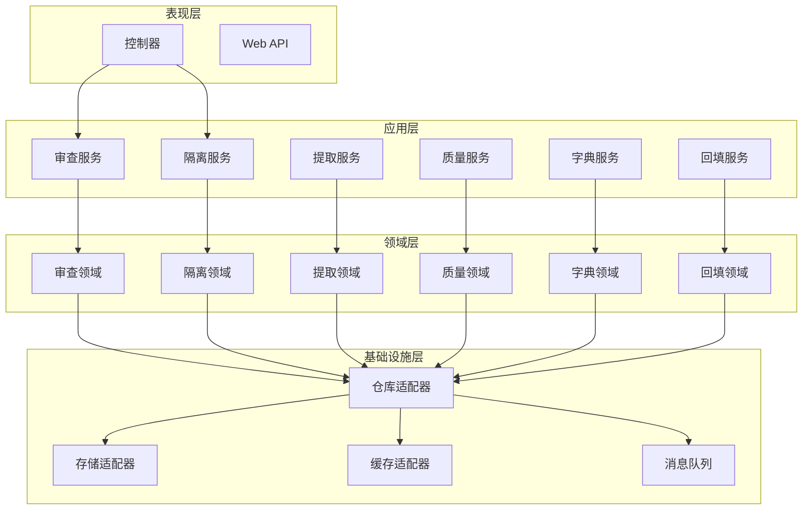
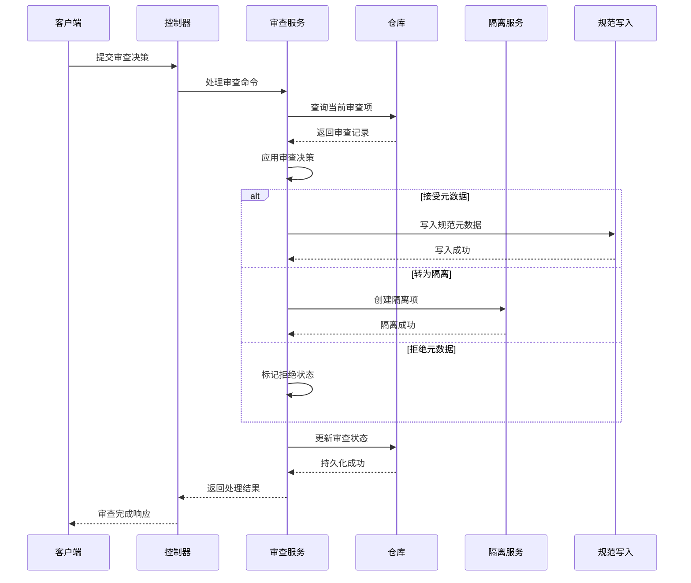
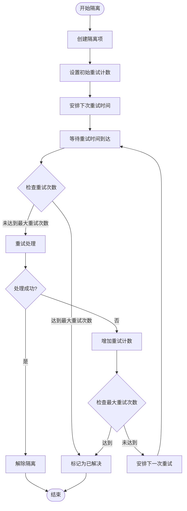
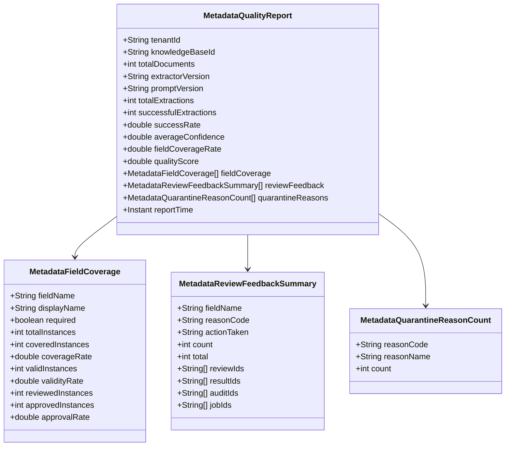
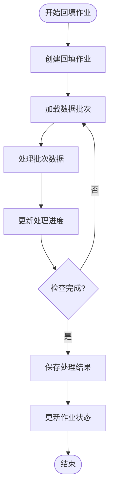
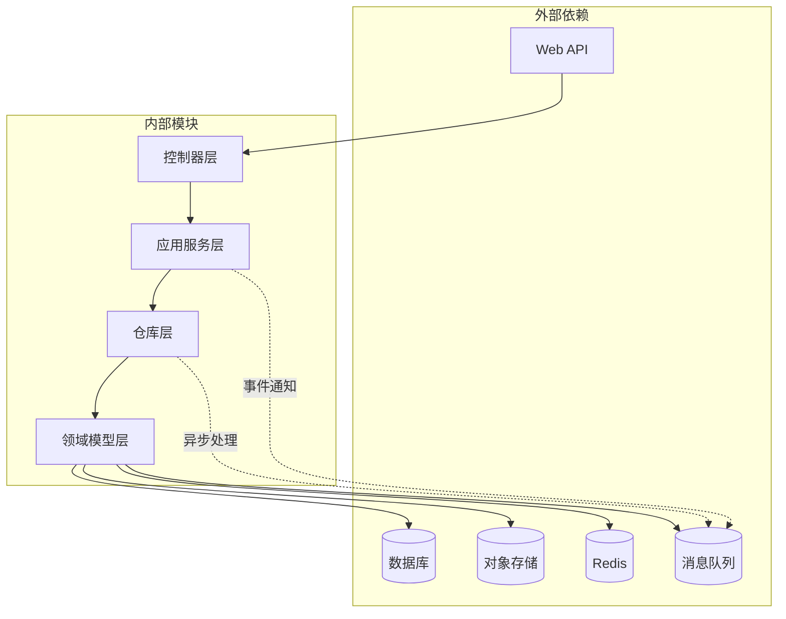

# 元数据应用服务

<cite>
**本文档引用的文件**
- [JdbcMetadataGovernanceRepositoryAdapter.java](file://seahorse-agent-adapter-repository-jdbc/src/main/java/com/miracle/ai/seahorse/agent/adapters/repository/jdbc/JdbcMetadataGovernanceRepositoryAdapter.java)
- [KernelMetadataReviewService.java](file://seahorse-agent-kernel/src/main/java/com/miracle/ai/seahorse/agent/kernel/application/metadata/KernelMetadataReviewService.java)
- [KernelMetadataQuarantineService.java](file://seahorse-agent-kernel/src/main/java/com/miracle/ai/seahorse/agent/kernel/application/metadata/KernelMetadataQuarantineService.java)
- [KernelMetadataExtractionResultService.java](file://seahorse-agent-kernel/src/main/java/com/miracle/ai/seahorse/agent/kernel/application/metadata/KernelMetadataExtractionResultService.java)
- [KernelMetadataQualityService.java](file://seahorse-agent-kernel/src/main/java/com/miracle/ai/seahorse/agent/kernel/application/metadata/KernelMetadataQualityService.java)
- [KernelMetadataDictionaryService.java](file://seahorse-agent-kernel/src/main/java/com/miracle/ai/seahorse/agent/kernel/application/metadata/KernelMetadataDictionaryService.java)
- [KernelMetadataBackfillService.java](file://seahorse-agent-kernel/src/main/java/com/miracle/ai/seahorse/agent/kernel/application/metadata/KernelMetadataBackfillService.java)
- [SeahorseMetadataReviewController.java](file://seahorse-agent-adapter-web/src/main/java/com/miracle/ai/seahorse/agent/adapters/web/SeahorseMetadataReviewController.java)
- [JdbcMetadataBackfillSupport.java](file://seahorse-agent-adapter-repository-jdbc/src/main/java/com/miracle/ai/seahorse/agent/adapters/repository/jdbc/JdbcMetadataBackfillSupport.java)
- [JdbcMetadataReviewQuarantineAdapterTests.java](file://seahorse-agent-adapter-repository-jdbc/src/test/java/com/miracle/ai/seahorse/agent/adapters/repository/jdbc/JdbcMetadataReviewQuarantineAdapterTests.java)
- [KernelMetadataReviewServiceTests.java](file://seahorse-agent-tests/src/test/java/com/miracle/ai/seahorse/agent/kernel/application/metadata/KernelMetadataReviewServiceTests.java)
- [KernelMetadataQuarantineServiceTests.java](file://seahorse-agent-tests/src/test/java/com/miracle/ai/seahorse/agent/kernel/application/metadata/KernelMetadataQuarantineServiceTests.java)
- [SeahorseWebApiContractTests.java](file://seahorse-agent-tests/src/test/java/com/miracle/ai/seahorse/agent/adapters/web/SeahorseWebApiContractTests.java)
</cite>

## 目录
1. [简介](#简介)
2. [项目结构](#项目结构)
3. [核心组件](#核心组件)
4. [架构概览](#架构概览)
5. [详细组件分析](#详细组件分析)
6. [依赖关系分析](#依赖关系分析)
7. [性能考虑](#性能考虑)
8. [故障排除指南](#故障排除指南)
9. [结论](#结论)

## 简介

元数据应用服务是SeaHorse智能代理系统中的核心组件，负责管理整个元数据生命周期。该服务实现了完整的元数据治理功能，包括元数据字典管理、元数据提取、元数据质量评估、元数据审查、元数据隔离以及元数据回填等关键功能。

系统通过分层架构设计，将业务逻辑与基础设施解耦，提供了高度可扩展的元数据管理解决方案。服务支持多租户环境，具备强大的并发处理能力和完善的错误处理机制。

## 项目结构

元数据应用服务采用模块化设计，主要分布在以下模块中：

**图表来源**
- [JdbcMetadataGovernanceRepositoryAdapter.java:93-98](file://seahorse-agent-adapter-repository-jdbc/src/main/java/com/miracle/ai/seahorse/agent/adapters/repository/jdbc/JdbcMetadataGovernanceRepositoryAdapter.java#L93-L98)
- [KernelMetadataReviewService.java:201-228](file://seahorse-agent-kernel/src/main/java/com/miracle/ai/seahorse/agent/kernel/application/metadata/KernelMetadataReviewService.java#L201-L228)

**章节来源**
- [JdbcMetadataGovernanceRepositoryAdapter.java:71-98](file://seahorse-agent-adapter-repository-jdbc/src/main/java/com/miracle/ai/seahorse/agent/adapters/repository/jdbc/JdbcMetadataGovernanceRepositoryAdapter.java#L71-L98)

## 核心组件

元数据应用服务包含以下核心组件：

### 1. 元数据审查服务
负责处理元数据审查流程，包括审查决策、状态管理和审查历史记录。

### 2. 元数据隔离服务  
管理被隔离的元数据项，支持隔离解除、重试机制和自动调度。

### 3. 元数据提取服务
处理元数据提取结果，包括标准化、验证和质量评估。

### 4. 元数据质量服务
监控和评估元数据质量，生成质量报告和覆盖率统计。

### 5. 元数据字典服务
维护元数据字典，确保元数据值的标准化和一致性。

### 6. 元数据回填服务
处理历史数据的元数据回填任务，支持批量处理和进度跟踪。

**章节来源**
- [KernelMetadataReviewService.java:201-228](file://seahorse-agent-kernel/src/main/java/com/miracle/ai/seahorse/agent/kernel/application/metadata/KernelMetadataReviewService.java#L201-L228)
- [KernelMetadataQuarantineService.java:51-78](file://seahorse-agent-kernel/src/main/java/com/miracle/ai/seahorse/agent/kernel/application/metadata/KernelMetadataQuarantineService.java#L51-L78)

## 架构概览

元数据应用服务采用六层架构设计，确保了良好的分离关注点和可维护性：

**图表来源**
- [KernelMetadataReviewService.java:201-228](file://seahorse-agent-kernel/src/main/java/com/miracle/ai/seahorse/agent/kernel/application/metadata/KernelMetadataReviewService.java#L201-L228)
- [KernelMetadataQuarantineService.java:51-78](file://seahorse-agent-kernel/src/main/java/com/miracle/ai/seahorse/agent/kernel/application/metadata/KernelMetadataQuarantineService.java#L51-L78)

## 详细组件分析

### 元数据审查服务

元数据审查服务是元数据治理的核心组件，负责处理所有审查相关的业务逻辑。

#### 审查决策流程

**图表来源**
- [KernelMetadataReviewService.java:201-228](file://seahorse-agent-kernel/src/main/java/com/miracle/ai/seahorse/agent/kernel/application/metadata/KernelMetadataReviewService.java#L201-L228)
- [SeahorseMetadataReviewController.java:118-135](file://seahorse-agent-adapter-web/src/main/java/com/miracle/ai/seahorse/agent/adapters/web/SeahorseMetadataReviewController.java#L118-L135)

#### 审查状态管理

服务支持多种审查状态，包括待处理、已接受、已修正、已隔离、已拒绝等状态转换。

**章节来源**
- [KernelMetadataReviewService.java:201-228](file://seahorse-agent-kernel/src/main/java/com/miracle/ai/seahorse/agent/kernel/application/metadata/KernelMetadataReviewService.java#L201-L228)
- [KernelMetadataReviewServiceTests.java:115-158](file://seahorse-agent-tests/src/test/java/com/miracle/ai/seahorse/agent/kernel/application/metadata/KernelMetadataReviewServiceTests.java#L115-L158)

### 元数据隔离服务

元数据隔离服务专门处理被标记为需要隔离的元数据项，提供完整的隔离生命周期管理。

#### 隔离重试机制

**图表来源**
- [KernelMetadataQuarantineService.java:51-78](file://seahorse-agent-kernel/src/main/java/com/miracle/ai/seahorse/agent/kernel/application/metadata/KernelMetadataQuarantineService.java#L51-L78)

#### 隔离原因分类

服务支持多种隔离原因，包括模式缺失、解析失败、置信度低等，每种原因都有相应的处理策略。

**章节来源**
- [KernelMetadataQuarantineService.java:51-78](file://seahorse-agent-kernel/src/main/java/com/miracle/ai/seahorse/agent/kernel/application/metadata/KernelMetadataQuarantineService.java#L51-L78)
- [KernelMetadataQuarantineServiceTests.java:51-78](file://seahorse-agent-tests/src/test/java/com/miracle/ai/seahorse/agent/kernel/application/metadata/KernelMetadataQuarantineServiceTests.java#L51-L78)

### 元数据提取服务

元数据提取服务负责处理从文档中提取的元数据，包括标准化、验证和质量评估。

#### 提取结果管理

服务管理元数据提取的完整生命周期，从提取到最终确认的每个阶段都有详细的记录和追踪。

**章节来源**
- [KernelMetadataExtractionResultService.java](file://seahorse-agent-kernel/src/main/java/com/miracle/ai/seahorse/agent/kernel/application/metadata/KernelMetadataExtractionResultService.java)

### 元数据质量服务

元数据质量服务提供全面的质量监控和评估功能，确保元数据的准确性和一致性。

#### 质量评估指标

**图表来源**
- [SeahorseWebApiContractTests.java:1908-1940](file://seahorse-agent-tests/src/test/java/com/miracle/ai/seahorse/agent/adapters/web/SeahorseWebApiContractTests.java#L1908-L1940)

**章节来源**
- [KernelMetadataQualityService.java](file://seahorse-agent-kernel/src/main/java/com/miracle/ai/seahorse/agent/kernel/application/metadata/KernelMetadataQualityService.java)

### 元数据字典服务

元数据字典服务维护标准的元数据值映射，确保不同来源的数据具有一致的表示形式。

#### 字典管理功能

服务提供元数据字典的创建、更新、查询和版本管理功能，支持多租户环境下的独立字典管理。

**章节来源**
- [KernelMetadataDictionaryService.java](file://seahorse-agent-kernel/src/main/java/com/miracle/ai/seahorse/agent/kernel/application/metadata/KernelMetadataDictionaryService.java)

### 元数据回填服务

元数据回填服务处理历史数据的元数据补全任务，支持大规模数据的批量处理。

#### 回填作业管理

**图表来源**
- [JdbcMetadataBackfillSupport.java:100-128](file://seahorse-agent-adapter-repository-jdbc/src/main/java/com/miracle/ai/seahorse/agent/adapters/repository/jdbc/JdbcMetadataBackfillSupport.java#L100-L128)

**章节来源**
- [KernelMetadataBackfillService.java](file://seahorse-agent-kernel/src/main/java/com/miracle/ai/seahorse/agent/kernel/application/metadata/KernelMetadataBackfillService.java)
- [JdbcMetadataBackfillSupport.java:100-128](file://seahorse-agent-adapter-repository-jdbc/src/main/java/com/miracle/ai/seahorse/agent/adapters/repository/jdbc/JdbcMetadataBackfillSupport.java#L100-L128)

## 依赖关系分析

元数据应用服务的依赖关系体现了清晰的分层架构和依赖倒置原则：

**图表来源**
- [JdbcMetadataGovernanceRepositoryAdapter.java:93-98](file://seahorse-agent-adapter-repository-jdbc/src/main/java/com/miracle/ai/seahorse/agent/adapters/repository/jdbc/JdbcMetadataGovernanceRepositoryAdapter.java#L93-L98)

### 关键依赖关系

1. **控制器到服务层**：Web控制器直接依赖应用服务接口
2. **服务到仓库层**：应用服务依赖仓库接口进行数据访问
3. **仓库到基础设施**：仓库实现依赖具体的技术栈（JDBC、Redis等）
4. **领域模型到数据层**：领域模型封装业务逻辑，不直接依赖基础设施

**章节来源**
- [JdbcMetadataGovernanceRepositoryAdapter.java:93-98](file://seahorse-agent-adapter-repository-jdbc/src/main/java/com/miracle/ai/seahorse/agent/adapters/repository/jdbc/JdbcMetadataGovernanceRepositoryAdapter.java#L93-L98)

## 性能考虑

元数据应用服务在设计时充分考虑了性能优化：

### 并发处理
- 使用无锁数据结构减少竞争条件
- 实现批量操作支持高吞吐量处理
- 采用异步处理机制提高响应速度

### 缓存策略
- 多级缓存架构（本地缓存+分布式缓存）
- 智能缓存失效策略
- 缓存预热和热点数据保护

### 数据库优化
- 连接池配置和连接复用
- 批量SQL操作减少网络往返
- 索引优化和查询计划缓存

## 故障排除指南

### 常见问题及解决方案

#### 审查服务问题
- **问题**：审查状态更新失败
- **原因**：并发冲突或数据库连接异常
- **解决方案**：启用重试机制和事务补偿

#### 隔离服务问题  
- **问题**：隔离重试失败循环
- **原因**：重试间隔配置不当或处理逻辑异常
- **解决方案**：检查重试配置和日志分析

#### 提取服务问题
- **问题**：元数据提取性能下降
- **原因**：内存不足或I/O瓶颈
- **解决方案**：调整批处理大小和资源分配

**章节来源**
- [KernelMetadataReviewServiceTests.java:115-158](file://seahorse-agent-tests/src/test/java/com/miracle/ai/seahorse/agent/kernel/application/metadata/KernelMetadataReviewServiceTests.java#L115-L158)
- [KernelMetadataQuarantineServiceTests.java:51-78](file://seahorse-agent-tests/src/test/java/com/miracle/ai/seahorse/agent/kernel/application/metadata/KernelMetadataQuarantineServiceTests.java#L51-L78)

### 监控和诊断

服务提供了完善的监控指标和诊断工具：

- **性能指标**：处理延迟、吞吐量、错误率
- **健康检查**：数据库连接、缓存可用性、外部依赖状态
- **审计日志**：所有关键操作的完整记录

**章节来源**
- [SeahorseWebApiContractTests.java:1256-1364](file://seahorse-agent-tests/src/test/java/com/miracle/ai/seahorse/agent/adapters/web/SeahorseWebApiContractTests.java#L1256-L1364)

## 结论

元数据应用服务通过其精心设计的架构和完善的功能实现，为SeaHorse智能代理系统提供了强大的元数据治理能力。服务不仅满足了当前的业务需求，还为未来的扩展和演进奠定了坚实的基础。

该服务的主要优势包括：

1. **完整的生命周期管理**：从提取到审查再到隔离的全流程覆盖
2. **高可用性设计**：支持重试、补偿和故障转移机制
3. **可扩展性**：模块化设计支持功能扩展和技术升级
4. **可观测性**：完善的监控和诊断能力
5. **多租户支持**：灵活的租户隔离和资源配置

通过持续的优化和改进，元数据应用服务将继续为SeaHorse智能代理系统提供可靠、高效的元数据管理服务。