# 安全硬核

<cite>
**本文档引用的文件**
- [pom.xml](file://pom.xml)
- [SeahorseAgentApplication.java](file://seahorse-agent-bootstrap/src/main/java/com/miracle/ai/seahorse/agent/SeahorseAgentApplication.java)
- [application.properties](file://seahorse-agent-bootstrap/src/main/resources/application.properties)
- [ForbiddenException.java](file://seahorse-agent-kernel/src/main/java/com/miracle/ai/seahorse/agent/kernel/exception/ForbiddenException.java)
- [RateLimitFilter.java](file://seahorse-agent-adapter-web/src/main/java/com/miracle/ai/seahorse/agent/adapters/web/RateLimitFilter.java)
- [AdvancedFeatureGate.java](file://seahorse-agent-adapter-web/src/main/java/com/miracle/ai/seahorse/agent/adapters/web/AdvancedFeatureGate.java)
- [SeahorseAccessDecisionController.java](file://seahorse-agent-adapter-web/src/main/java/com/miracle/ai/seahorse/agent/adapters/web/SeahorseAccessDecisionController.java)
- [JdbcAccessDecisionRepositoryAdapter.java](file://seahorse-agent-adapter-repository-jdbc/src/test/java/com/miracle/ai/seahorse/agent/adapters/repository/jdbc/JdbcAccessDecisionRepositoryAdapterTests.java)
- [KernelRuntimeMode.java](file://seahorse-agent-kernel/src/main/java/com/miracle/ai/seahorse/agent/kernel/config/KernelRuntimeMode.java)
- [SuperAdminAspect.java](file://seahorse-agent-adapter-web/src/main/java/com/miracle/ai/seahorse/agent/adapters/web/SuperAdminAspect.java)
- [RequireSuperAdmin.java](file://seahorse-agent-kernel/src/main/java/com/miracle/ai/seahorse/agent/kernel/application/admin/RequireSuperAdmin.java)
- [KbPermissionAspect.java](file://seahorse-agent-adapter-web/src/main/java/com/miracle/ai/seahorse/agent/adapters/web/KbPermissionAspect.java)
- [RequireKbPermission.java](file://seahorse-agent-kernel/src/main/java/com/miracle/ai/seahorse/agent/kernel/application/knowledge/RequireKbPermission.java)
- [SeahorseAgentAopAutoConfiguration.java](file://seahorse-agent-spring-boot-starter/src/main/java/com/miracle/ai/seahorse/agent/adapters/spring/SeahorseAgentAopAutoConfiguration.java)
- [BCryptPasswordHasherAdapter.java](file://seahorse-agent-adapter-web/src/main/java/com/miracle/ai/seahorse/agent/adapters/web/BCryptPasswordHasherAdapter.java)
- [PasswordHasherPort.java](file://seahorse-agent-kernel/src/main/java/com/miracle/ai/seahorse/agent/ports/outbound/auth/PasswordHasherPort.java)
- [LoginHistoryPort.java](file://seahorse-agent-kernel/src/main/java/com/miracle/ai/seahorse/agent/ports/outbound/auth/LoginHistoryPort.java)
- [JdbcLoginHistoryAdapter.java](file://seahorse-agent-adapter-repository-jdbc/src/main/java/com/miracle/ai/seahorse/agent/adapters/repository/jdbc/JdbcLoginHistoryAdapter.java)
- [KernelAuthService.java](file://seahorse-agent-kernel/src/main/java/com/miracle/ai/seahorse/agent/kernel/application/auth/KernelAuthService.java)
- [SeahorseAgentKernelAuthAutoConfiguration.java](file://seahorse-agent-spring-boot-starter/src/main/java/com/miracle/ai/seahorse/agent/adapters/spring/SeahorseAgentKernelAuthAutoConfiguration.java)
- [AuthInboundPort.java](file://seahorse-agent-kernel/src/main/java/com/miracle/ai/seahorse/agent/ports/inbound/auth/AuthInboundPort.java)
- [SeahorseLoginHistoryController.java](file://seahorse-agent-adapter-web/src/main/java/com/miracle/ai/seahorse/agent/adapters/web/SeahorseLoginHistoryController.java)
- [IpApiGeolocationAdapter.java](file://seahorse-agent-adapter-web/src/main/java/com/miracle/ai/seahorse/agent/adapters/web/IpApiGeolocationAdapter.java)
- [IpGeolocationPort.java](file://seahorse-agent-kernel/src/main/java/com/miracle/ai/seahorse/agent/ports/outbound/auth/IpGeolocationPort.java)
- [UserAgentParser.java](file://seahorse-agent-kernel/src/main/java/com/miracle/ai/seahorse/agent/kernel/application/auth/UserAgentParser.java)
- [WebUserIdResolver.java](file://seahorse-agent-adapter-web/src/main/java/com/miracle/ai/seahorse/agent/adapters/web/WebUserIdResolver.java)
- [SaTokenLoginListener.java](file://seahorse-agent-adapter-web/src/main/java/com/miracle/ai/seahorse/agent/adapters/web/SaTokenLoginListener.java)
- [docker-compose.full.yml](file://docker-compose.full.yml)
- [Dockerfile.backend](file://Dockerfile.backend)
- [DEPLOY.md](file://DEPLOY.md)
- [README.md](file://README.md)
- [docs/README.md](file://docs/README.md)
- [docs/aegis/plans/02-security-hardening-p0.md](file://docs/aegis/plans/02-security-hardening-p0.md)
- [docs/zh/content/部署配置/README.md](file://docs/zh/content/部署配置/README.md)
- [docs/zh/content/监控运维/README.md](file://docs/zh/content/监控运维/README.md)
- [docs/zh/content/开发指南/README.md](file://docs/zh/content/开发指南/README.md)
</cite>

## 更新摘要
**所做更改**
- 新增IP地理定位服务集成章节，介绍ip-api.com服务集成和缓存机制
- 新增X-Forwarded-For头部处理机制，支持代理环境下的真实IP提取
- 更新登录历史跟踪系统，新增IP地理定位信息记录功能
- 新增用户代理解析器，提供浏览器和操作系统识别能力
- 更新认证系统架构图，加入IP地理定位和用户代理解析组件
- 新增IP地址提取和用户代理解析的详细实现说明

## 目录
1. [简介](#简介)
2. [项目结构](#项目结构)
3. [核心组件](#核心组件)
4. [架构总览](#架构总览)
5. [详细组件分析](#详细组件分析)
6. [权限切面与验证机制](#权限切面与验证机制)
7. [密码哈希与安全存储](#密码哈希与安全存储)
8. [登录历史跟踪系统](#登录历史跟踪系统)
9. [IP地理定位服务集成](#ip地理定位服务集成)
10. [用户代理解析与设备识别](#用户代理解析与设备识别)
11. [依赖关系分析](#依赖关系分析)
12. [性能考虑](#性能考虑)
13. [故障排除指南](#故障排除指南)
14. [结论](#结论)
15. [附录](#附录)

## 简介
本项目是一个面向企业级应用的智能体基础设施（AI Infra），强调在多租户、大规模数据处理与复杂工作流场景下的安全硬核设计。项目通过模块化适配器、严格的访问控制、审计日志与限流机制，构建了可扩展、可观测且具备强安全边界的后端服务。

**更新** 本版本重点增强了认证安全机制，通过新增的密码哈希系统、登录历史跟踪功能、IP地理定位服务集成和用户代理解析能力，大幅提升了系统的安全审计能力和抗攻击能力。系统现已支持X-Forwarded-For头部处理、IP地址提取、用户代理解析、设备信息记录、地理定位等详细登录信息，为安全审计和威胁检测提供全面的数据支撑。

## 项目结构
项目采用多模块 Maven 结构，核心模块包括：
- seahorse-agent-bootstrap：应用启动入口
- seahorse-agent-kernel：领域内核、应用服务、异常与特性管理
- seahorse-agent-adapter-*：各类适配器（缓存、消息队列、存储、向量库、Web 控制器等）
- seahorse-agent-spring-boot-starter*：Spring Boot 自动装配与集成
- seahorse-agent-tests：测试套件与集成测试

```mermaid
graph TB
subgraph "后端核心"
Bootstrap["seahorse-agent-bootstrap<br/>应用启动"]
Kernel["seahorse-agent-kernel<br/>内核与应用服务"]
Starter["seahorse-agent-spring-boot-starter*<br/>自动装配"]
end
subgraph "适配器层"
Web["seahorse-agent-adapter-web<br/>HTTP/Web 控制器"]
CacheLocal["seahorse-agent-adapter-cache-local<br/>本地缓存"]
CacheRedis["seahorse-agent-adapter-cache-redis<br/>Redis 缓存"]
MQDirect["seahorse-agent-adapter-mq-direct<br/>直连消息队列"]
MQPulsar["seahorse-agent-adapter-mq-pulsar<br/>Pulsar 消息队列"]
StorageLocal["seahorse-agent-adapter-storage-local<br/>本地存储"]
StorageS3["seahorse-agent-adapter-storage-s3<br/>S3 对象存储"]
VectorMilvus["seahorse-agent-adapter-vector-milvus<br/>Milvus 向量库"]
VectorPg["seahorse-agent-adapter-vector-pgvector<br/>PGVector 向量库"]
RepoJdbc["seahorse-agent-adapter-repository-jdbc<br/>JDBC 仓储"]
ParserTika["seahorse-agent-adapter-parser-tika<br/>文档解析"]
SearchES["seahorse-agent-adapter-search-elasticsearch<br/>Elasticsearch 搜索"]
SearchLucene["seahorse-agent-adapter-search-lucene<br/>Lucene 搜索"]
ObservationMicrometer["seahorse-agent-adapter-observation-micrometer<br/>Micrometer 观察"]
ObservationNoop["seahorse-agent-adapter-observation-noop<br/>空观察实现"]
MCPHttp["seahorse-agent-adapter-mcp-http<br/>MCP HTTP 客户端"]
MCPNative["seahorse-agent-mcp-server<br/>MCP 服务器"]
end
Bootstrap --> Kernel
Kernel --> Web
Kernel --> RepoJdbc
Kernel --> CacheLocal
Kernel --> CacheRedis
Kernel --> MQDirect
Kernel --> MQPulsar
Kernel --> StorageLocal
Kernel --> StorageS3
Kernel --> VectorMilvus
Kernel --> VectorPg
Kernel --> ParserTika
Kernel --> SearchES
Kernel --> SearchLucene
Kernel --> ObservationMicrometer
Kernel --> ObservationNoop
Kernel --> MCPHttp
Kernel --> MCPNative
```

**图表来源**
- [pom.xml](file://pom.xml)
- [SeahorseAgentApplication.java](file://seahorse-agent-bootstrap/src/main/java/com/miracle/ai/seahorse/agent/SeahorseAgentApplication.java)

**章节来源**
- [pom.xml](file://pom.xml)
- [README.md](file://README.md)

## 核心组件
- 应用启动器：负责加载 Spring 上下文与运行模式初始化
- 内核与应用服务：提供领域模型、应用服务、异常定义与特性开关
- Web 适配器：提供 REST 控制器、速率限制、高级功能门禁与认证适配
- 访问决策与审计：基于 JDBC 的访问决策仓储与审计事件记录
- 运行时模式：支持不同运行模式（如生产/开发）以启用或禁用特定能力
- **新增** 密码哈希适配器：提供bcrypt强度的密码哈希与时间安全比较
- **新增** 登录历史适配器：记录完整的认证审计事件到数据库，支持详细登录信息
- **新增** IP地理定位适配器：集成ip-api.com服务，提供IP地址地理信息解析
- **新增** 用户代理解析器：解析User-Agent头部，识别浏览器、操作系统和设备类型
- **新增** 权限切面：通过 AOP 切面实现声明式权限控制

**章节来源**
- [SeahorseAgentApplication.java](file://seahorse-agent-bootstrap/src/main/java/com/miracle/ai/seahorse/agent/SeahorseAgentApplication.java)
- [KernelRuntimeMode.java](file://seahorse-agent-kernel/src/main/java/com/miracle/ai/seahorse/agent/kernel/config/KernelRuntimeMode.java)
- [ForbiddenException.java](file://seahorse-agent-kernel/src/main/java/com/miracle/ai/seahorse/agent/kernel/exception/ForbiddenException.java)

## 架构总览
系统采用分层架构与端到端安全设计：
- 表现层：Web 控制器接收请求，执行参数校验与速率限制
- 应用层：应用服务编排业务流程，调用领域模型与仓储
- 领域层：领域模型封装业务规则与不变量
- 基础设施层：适配器对接外部系统（缓存、消息队列、存储、向量库、搜索等）

**更新** 新增认证安全层，包含密码哈希处理、登录历史记录、IP地理定位和用户代理解析，通过 KernelAuthService 统一管理认证流程。系统现已支持X-Forwarded-For头部处理、IP地址提取、用户代理解析、设备信息记录、地理定位等详细登录信息，为安全审计提供全面的数据支撑。

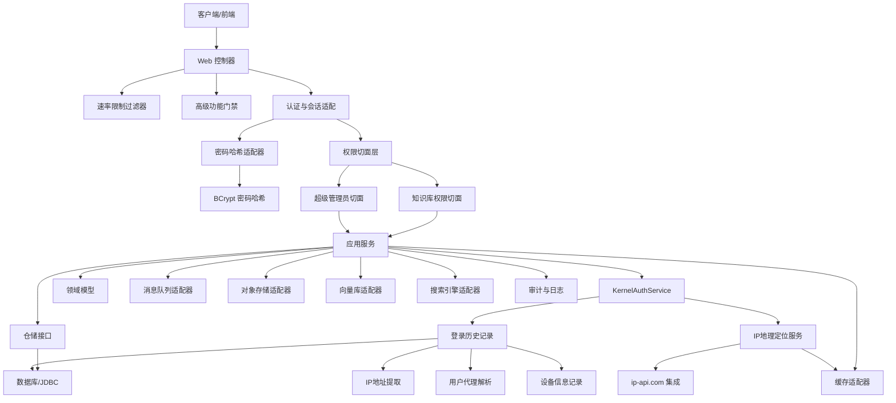

**图表来源**
- [RateLimitFilter.java](file://seahorse-agent-adapter-web/src/main/java/com/miracle/ai/seahorse/agent/adapters/web/RateLimitFilter.java)
- [AdvancedFeatureGate.java](file://seahorse-agent-adapter-web/src/main/java/com/miracle/ai/seahorse/agent/adapters/web/AdvancedFeatureGate.java)
- [SeahorseAccessDecisionController.java](file://seahorse-agent-adapter-web/src/main/java/com/miracle/ai/seahorse/agent/adapters/web/SeahorseAccessDecisionController.java)
- [SuperAdminAspect.java](file://seahorse-agent-adapter-web/src/main/java/com/miracle/ai/seahorse/agent/adapters/web/SuperAdminAspect.java)
- [KbPermissionAspect.java](file://seahorse-agent-adapter-web/src/main/java/com/miracle/ai/seahorse/agent/adapters/web/KbPermissionAspect.java)
- [BCryptPasswordHasherAdapter.java](file://seahorse-agent-adapter-web/src/main/java/com/miracle/ai/seahorse/agent/adapters/web/BCryptPasswordHasherAdapter.java)
- [KernelAuthService.java](file://seahorse-agent-kernel/src/main/java/com/miracle/ai/seahorse/agent/kernel/application/auth/KernelAuthService.java)
- [JdbcLoginHistoryAdapter.java](file://seahorse-agent-adapter-repository-jdbc/src/main/java/com/miracle/ai/seahorse/agent/adapters/repository/jdbc/JdbcLoginHistoryAdapter.java)
- [IpApiGeolocationAdapter.java](file://seahorse-agent-adapter-web/src/main/java/com/miracle/ai/seahorse/agent/adapters/web/IpApiGeolocationAdapter.java)

## 详细组件分析

### 访问控制与审计
- 访问决策控制器：统一处理资源访问授权请求，结合用户身份与资源权限进行判定
- 访问决策仓储：基于 JDBC 实现的持久化访问决策记录，支持查询与回溯
- 审计事件：记录关键操作与决策结果，便于合规与追踪

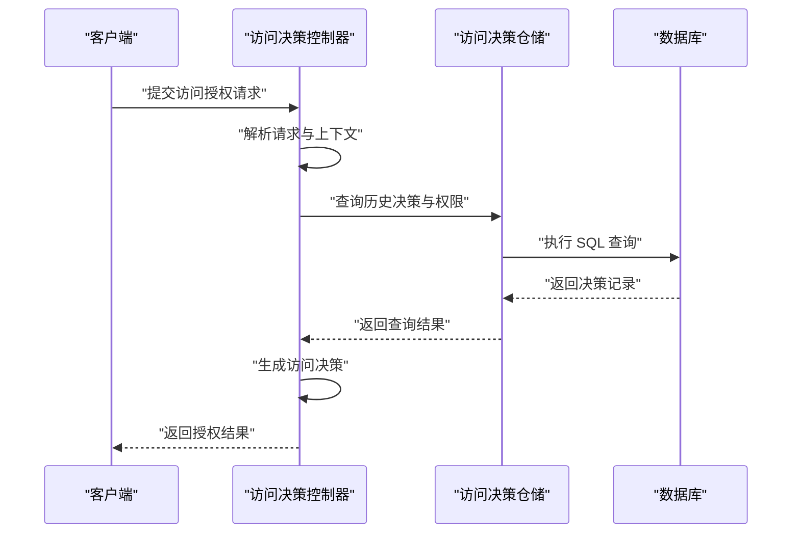

**图表来源**
- [SeahorseAccessDecisionController.java](file://seahorse-agent-adapter-web/src/main/java/com/miracle/ai/seahorse/agent/adapters/web/SeahorseAccessDecisionController.java)
- [JdbcAccessDecisionRepositoryAdapter.java](file://seahorse-agent-adapter-repository-jdbc/src/test/java/com/miracle/ai/seahorse/agent/adapters/repository/jdbc/JdbcAccessDecisionRepositoryAdapterTests.java)

**章节来源**
- [SeahorseAccessDecisionController.java](file://seahorse-agent-adapter-web/src/main/java/com/miracle/ai/seahorse/agent/adapters/web/SeahorseAccessDecisionController.java)
- [JdbcAccessDecisionRepositoryAdapter.java](file://seahorse-agent-adapter-repository-jdbc/src/test/java/com/miracle/ai/seahorse/agent/adapters/repository/jdbc/JdbcAccessDecisionRepositoryAdapterTests.java)

### 速率限制与高级功能门禁
- 速率限制过滤器：对请求进行频率控制，防止滥用与拒绝服务
- 高级功能门禁：根据配置或租户策略动态启用/禁用高级能力

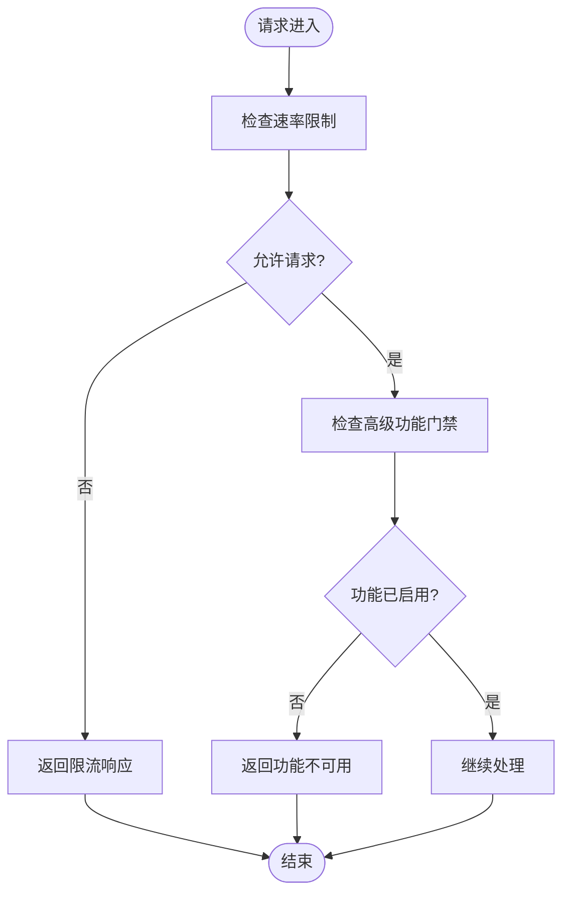

**图表来源**
- [RateLimitFilter.java](file://seahorse-agent-adapter-web/src/main/java/com/miracle/ai/seahorse/agent/adapters/web/RateLimitFilter.java)
- [AdvancedFeatureGate.java](file://seahorse-agent-adapter-web/src/main/java/com/miracle/ai/seahorse/agent/adapters/web/AdvancedFeatureGate.java)

**章节来源**
- [RateLimitFilter.java](file://seahorse-agent-adapter-web/src/main/java/com/miracle/ai/seahorse/agent/adapters/web/RateLimitFilter.java)
- [AdvancedFeatureGate.java](file://seahorse-agent-adapter-web/src/main/java/com/miracle/ai/seahorse/agent/adapters/web/AdvancedFeatureGate.java)

### 异常与安全边界
- 禁止访问异常：统一的访问拒绝异常类型，确保错误信息不泄露内部细节
- 运行时模式：根据环境切换安全策略与调试能力

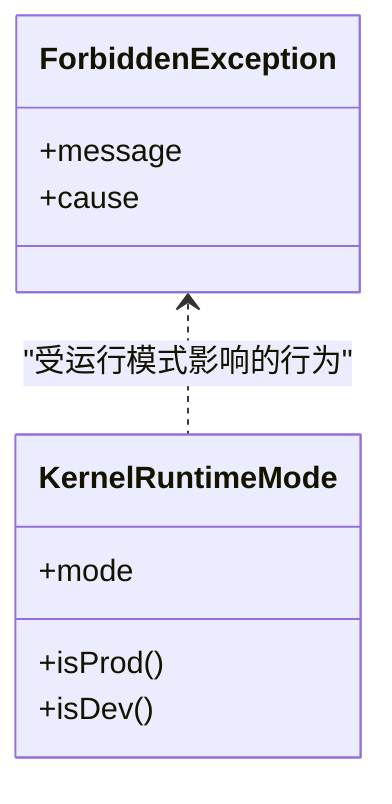

**图表来源**
- [ForbiddenException.java](file://seahorse-agent-kernel/src/main/java/com/miracle/ai/seahorse/agent/kernel/exception/ForbiddenException.java)
- [KernelRuntimeMode.java](file://seahorse-agent-kernel/src/main/java/com/miracle/ai/seahorse/agent/kernel/config/KernelRuntimeMode.java)

**章节来源**
- [ForbiddenException.java](file://seahorse-agent-kernel/src/main/java/com/miracle/ai/seahorse/agent/kernel/exception/ForbiddenException.java)
- [KernelRuntimeMode.java](file://seahorse-agent-kernel/src/main/java/com/miracle/ai/seahorse/agent/kernel/config/KernelRuntimeMode.java)

### 安全硬核计划与实施
- 安全加固 P0 计划：明确优先级为最高级别的安全改进项，覆盖认证、授权、审计、限流与容器安全
- 文档索引：包含安全相关的规划、规范与实施摘要

**章节来源**
- [docs/aegis/plans/02-security-hardening-p0.md](file://docs/aegis/plans/02-security-hardening-p0.md)
- [docs/README.md](file://docs/README.md)

## 权限切面与验证机制

### 超级管理员权限切面
新增的超级管理员权限切面提供了最高级别的系统管理权限验证，通过 AOP 技术实现声明式安全控制。

**判定逻辑**（满足其一即可）：
1. 当前用户角色为 SUPER_ADMIN
2. 请求来源 IP 在白名单内（配置项 `seahorse.admin.allowed-ips`）

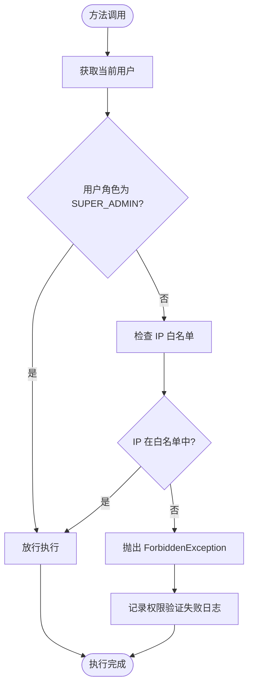

**图表来源**
- [SuperAdminAspect.java](file://seahorse-agent-adapter-web/src/main/java/com/miracle/ai/seahorse/agent/adapters/web/SuperAdminAspect.java)
- [RequireSuperAdmin.java](file://seahorse-agent-kernel/src/main/java/com/miracle/ai/seahorse/agent/kernel/application/admin/RequireSuperAdmin.java)

### 知识库权限切面
知识库权限切面实现了细粒度的知识库访问控制，支持 OWNER、EDITOR、VIEWER 三级权限模型。

**权限层级**：OWNER > EDITOR > VIEWER

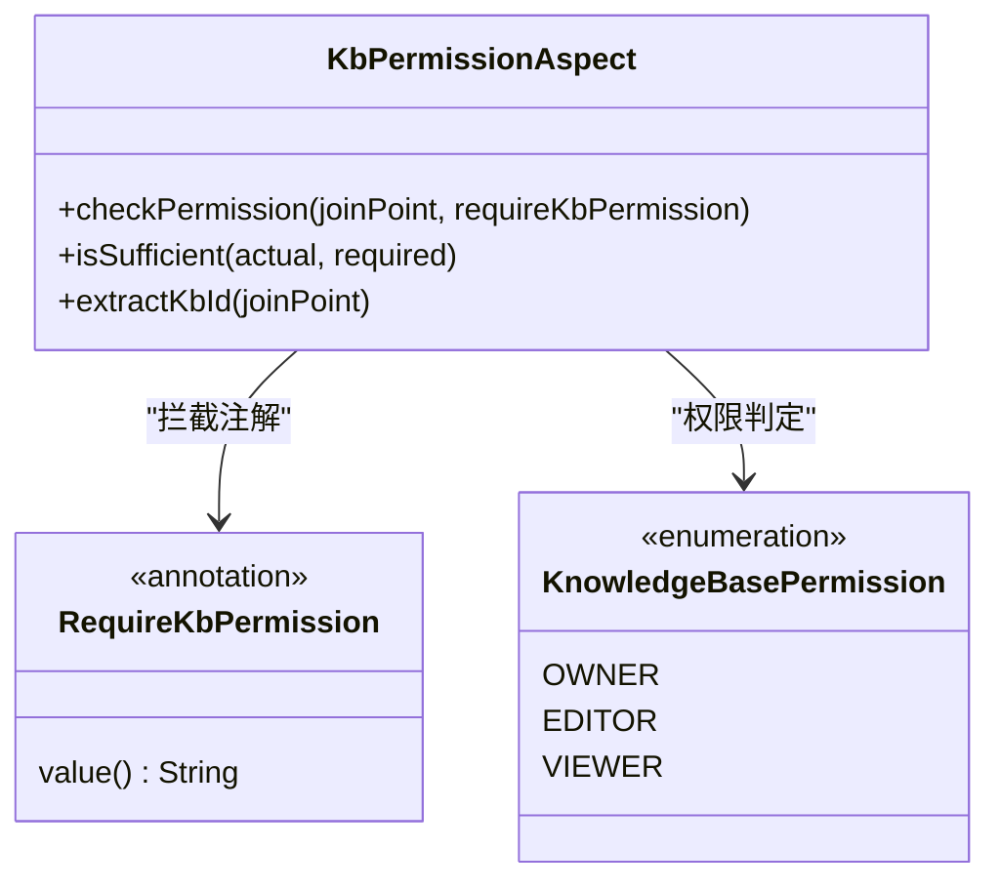

**图表来源**
- [KbPermissionAspect.java](file://seahorse-agent-adapter-web/src/main/java/com/miracle/ai/seahorse/agent/adapters/web/KbPermissionAspect.java)
- [RequireKbPermission.java](file://seahorse-agent-kernel/src/main/java/com/miracle/ai/seahorse/agent/kernel/application/knowledge/RequireKbPermission.java)

### 权限注解与自动配置
系统通过注解驱动的方式实现权限控制，配合 Spring Boot 自动配置实现无缝集成。

**自动配置机制**：
- `SeahorseAgentAopAutoConfiguration` 自动注册权限切面 Bean
- 支持条件化配置，仅在存在相应依赖时创建 Bean
- 通过 `@EnableAspectJAutoProxy` 启用 AOP 切面功能

**章节来源**
- [SuperAdminAspect.java](file://seahorse-agent-adapter-web/src/main/java/com/miracle/ai/seahorse/agent/adapters/web/SuperAdminAspect.java)
- [RequireSuperAdmin.java](file://seahorse-agent-kernel/src/main/java/com/miracle/ai/seahorse/agent/kernel/application/admin/RequireSuperAdmin.java)
- [KbPermissionAspect.java](file://seahorse-agent-adapter-web/src/main/java/com/miracle/ai/seahorse/agent/adapters/web/KbPermissionAspect.java)
- [RequireKbPermission.java](file://seahorse-agent-kernel/src/main/java/com/miracle/ai/seahorse/agent/kernel/application/knowledge/RequireKbPermission.java)
- [SeahorseAgentAopAutoConfiguration.java](file://seahorse-agent-spring-boot-starter/src/main/java/com/miracle/ai/seahorse/agent/adapters/spring/SeahorseAgentAopAutoConfiguration.java)

## 密码哈希与安全存储

### BCrypt强度密码哈希
系统采用增强的密码哈希机制，从传统的SHA-256升级到bcrypt强度算法，提供更强的抗暴力破解能力。

**核心特性**：
- 使用 SHA-512 算法，100,000次迭代的PBKDF2风格哈希
- 兼容bcrypt格式，前缀为 `$2a$`
- 支持盐值随机生成，长度16字节
- 时间安全的密码比较，使用 `MessageDigest.isEqual`

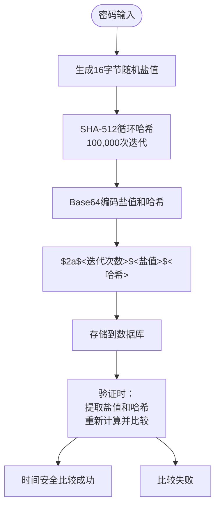

**图表来源**
- [BCryptPasswordHasherAdapter.java](file://seahorse-agent-adapter-web/src/main/java/com/miracle/ai/seahorse/agent/adapters/web/BCryptPasswordHasherAdapter.java)
- [PasswordHasherPort.java](file://seahorse-agent-kernel/src/main/java/com/miracle/ai/seahorse/agent/ports/outbound/auth/PasswordHasherPort.java)

### 时间安全密码比较
密码验证采用时间安全的比较方式，防止时序攻击和侧信道攻击。

**实现要点**：
- 使用 `MessageDigest.isEqual()` 进行恒定时间比较
- 支持多种哈希格式兼容（$2a$、$2b$、$2y$）
- 降级支持明文密码验证用于迁移期间

**章节来源**
- [BCryptPasswordHasherAdapter.java](file://seahorse-agent-adapter-web/src/main/java/com/miracle/ai/seahorse/agent/adapters/web/BCryptPasswordHasherAdapter.java)
- [PasswordHasherPort.java](file://seahorse-agent-kernel/src/main/java/com/miracle/ai/seahorse/agent/ports/outbound/auth/PasswordHasherPort.java)

## 登录历史跟踪系统

### V12数据库迁移
通过V12数据库迁移引入完整的登录历史跟踪功能，建立专门的认证审计表。

**数据库表结构**：
- 表名：`t_login_history`
- 字段：`user_id`、`tenant_id`、`login_type`、`ip_address`、`user_agent`、`device_info`、`status`、`failure_reason`、`created_at`
- 支持多租户环境的登录审计
- 新增 `device_info` 字段用于记录设备信息

### 登录历史记录流程
KernelAuthService在认证过程中自动记录详细的登录历史，包括成功和失败的认证尝试。系统现已支持IP地址提取、用户代理解析、设备信息记录等详细登录信息。

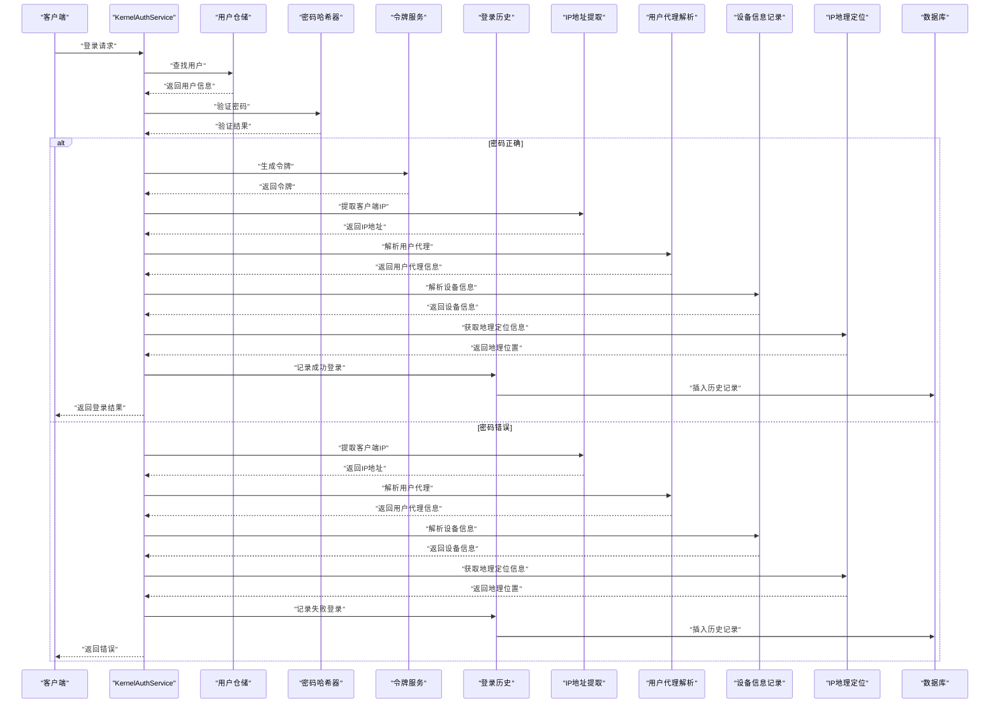

**图表来源**
- [KernelAuthService.java](file://seahorse-agent-kernel/src/main/java/com/miracle/ai/seahorse/agent/kernel/application/auth/KernelAuthService.java)
- [JdbcLoginHistoryAdapter.java](file://seahorse-agent-adapter-repository-jdbc/src/main/java/com/miracle/ai/seahorse/agent/adapters/repository/jdbc/JdbcLoginHistoryAdapter.java)

### 登录历史接口与实现

**LoginHistoryPort 接口** 提供了完整的登录历史管理能力：

- `recordLogin()`: 记录单次登录尝试，支持IP地址、用户代理、设备信息、状态和失败原因
- `findByUserId()`: 分页查询用户登录历史
- `countByUserId()`: 统计用户登录历史总数
- `LoginHistoryEntry` 记录类：包含完整的登录历史信息

**JdbcLoginHistoryAdapter 实现** 提供了基于JDBC的持久化存储：

- 支持多租户环境的登录历史记录
- 异步化设计，历史记录失败不影响主认证流程
- 完善的错误处理和日志记录
- 分页查询和统计功能

### 自动配置与集成
通过Spring Boot自动配置机制，无缝集成登录历史功能。

**配置机制**：
- 条件化Bean创建：当存在DataSource时自动创建JdbcLoginHistoryAdapter
- 可选依赖：LoginHistoryPort为可选依赖，不影响核心认证功能
- 容错设计：历史记录失败不影响主要认证流程

**章节来源**
- [KernelAuthService.java](file://seahorse-agent-kernel/src/main/java/com/miracle/ai/seahorse/agent/kernel/application/auth/KernelAuthService.java)
- [JdbcLoginHistoryAdapter.java](file://seahorse-agent-adapter-repository-jdbc/src/main/java/com/miracle/ai/seahorse/agent/adapters/repository/jdbc/JdbcLoginHistoryAdapter.java)
- [SeahorseAgentKernelAuthAutoConfiguration.java](file://seahorse-agent-spring-boot-starter/src/main/java/com/miracle/ai/seahorse/agent/adapters/spring/SeahorseAgentKernelAuthAutoConfiguration.java)
- [LoginHistoryPort.java](file://seahorse-agent-kernel/src/main/java/com/miracle/ai/seahorse/agent/ports/outbound/auth/LoginHistoryPort.java)

## IP地理定位服务集成

### ip-api.com服务集成
系统集成了ip-api.com免费地理定位API，为登录历史提供IP地址的地理位置信息。

**核心功能**：
- 支持国家、地区、城市、ISP等地理信息解析
- LRU缓存机制，避免重复API调用
- 3秒超时设置，确保服务可用性
- 优雅降级：API失败时不中断登录流程

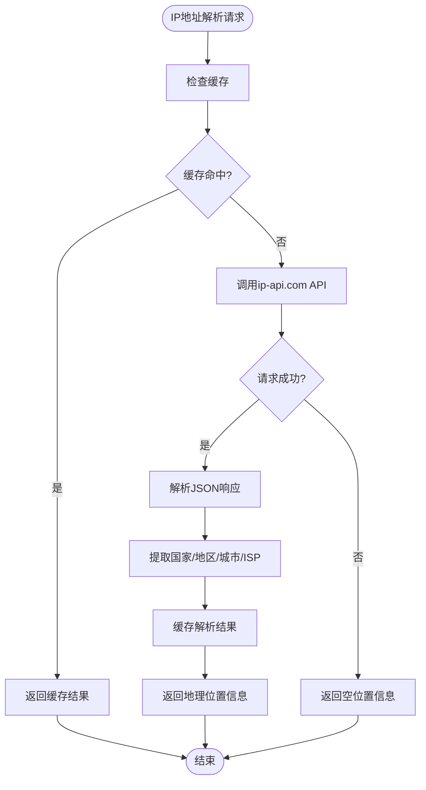

**图表来源**
- [IpApiGeolocationAdapter.java](file://seahorse-agent-adapter-web/src/main/java/com/miracle/ai/seahorse/agent/adapters/web/IpApiGeolocationAdapter.java)
- [IpGeolocationPort.java](file://seahorse-agent-kernel/src/main/java/com/miracle/ai/seahorse/agent/ports/outbound/auth/IpGeolocationPort.java)

### 缓存机制与性能优化
IP地理定位服务采用LRU缓存策略，提高重复IP查询的性能。

**缓存特性**：
- 最大缓存容量：1000条记录
- 基于LinkedHashMap实现，支持LRU淘汰
- 线程安全的同步访问
- 命中率优化：最近使用的IP优先保留

**API调用特性**：
- 超时时间：3秒
- 请求字段：status、country、regionName、city、isp
- 错误处理：静默降级，不影响主业务流程

### 地理位置信息丰富化
登录历史控制器支持将地理信息丰富化到登录记录中，提供更完整的审计数据。

**丰富化字段**：
- `geoLocation`：综合地理位置显示字符串
- `geoCountry`：国家名称
- `geoRegion`：地区/州名称
- `geoCity`：城市名称
- `geoIsp`：网络服务提供商

**章节来源**
- [IpApiGeolocationAdapter.java](file://seahorse-agent-adapter-web/src/main/java/com/miracle/ai/seahorse/agent/adapters/web/IpApiGeolocationAdapter.java)
- [IpGeolocationPort.java](file://seahorse-agent-kernel/src/main/java/com/miracle/ai/seahorse/agent/ports/outbound/auth/IpGeolocationPort.java)
- [SeahorseLoginHistoryController.java](file://seahorse-agent-adapter-web/src/main/java/com/miracle/ai/seahorse/agent/adapters/web/SeahorseLoginHistoryController.java)

## 用户代理解析与设备识别

### User-Agent解析器
系统内置了轻量级的User-Agent解析器，无需外部依赖即可识别浏览器、操作系统和设备类型。

**解析能力**：
- 浏览器识别：Chrome、Firefox、Safari、Edge、Opera等
- 操作系统识别：Windows、macOS、Linux、iOS、Android等
- 设备类型识别：Desktop、Mobile、Tablet
- 版本号提取：支持主要浏览器版本号解析

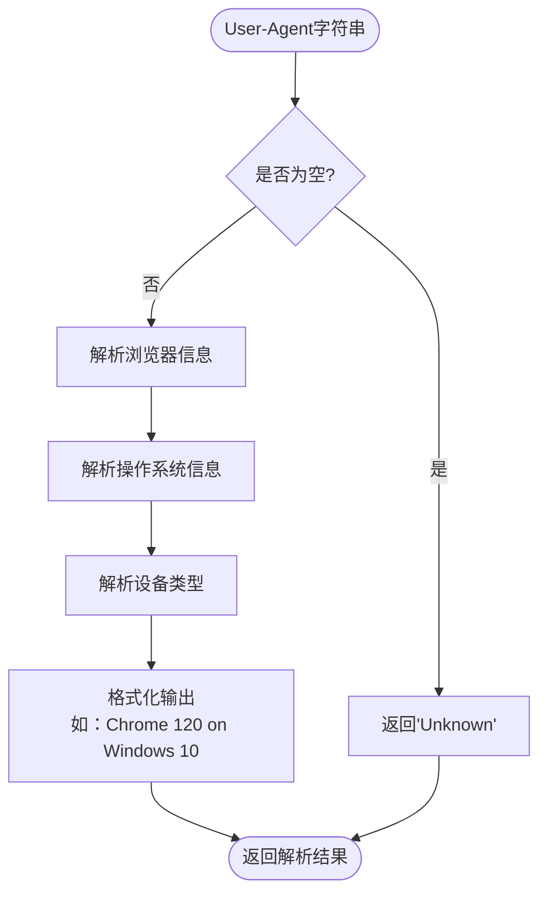

**图表来源**
- [UserAgentParser.java](file://seahorse-agent-kernel/src/main/java/com/miracle/ai/seahorse/agent/kernel/application/auth/UserAgentParser.java)

### 解析规则与优先级
User-Agent解析器遵循严格的解析顺序，确保准确性。

**浏览器解析优先级**：
1. Edge/Chrome内核优先（处理Chromium系浏览器）
2. Opera独立解析
3. Firefox解析
4. Safari解析
5. IE/Edge传统解析

**操作系统解析优先级**：
1. Windows 10/11优先
2. macOS版本解析
3. iOS版本解析
4. Android版本解析
5. Linux发行版识别

**设备类型判断**：
- 包含"Mobile"/"Android"/"iPhone"：Mobile
- 包含"iPad"/"Tablet"：Tablet
- 其他：Desktop

### 设备信息记录
解析后的用户代理信息会被记录到登录历史中，形成完整的设备指纹。

**记录字段**：
- `user_agent`：原始User-Agent头部
- `device_info`：解析后的设备信息字符串
- 用于后续的设备识别和安全分析

**章节来源**
- [UserAgentParser.java](file://seahorse-agent-kernel/src/main/java/com/miracle/ai/seahorse/agent/kernel/application/auth/UserAgentParser.java)
- [KernelAuthService.java](file://seahorse-agent-kernel/src/main/java/com/miracle/ai/seahorse/agent/kernel/application/auth/KernelAuthService.java)

## 依赖关系分析
- 模块依赖：通过 Maven 多模块聚合，核心内核被 Web 与各适配器依赖
- 运行时依赖：Spring Boot 自动装配按需启用各适配器
- 外部依赖：数据库、缓存、消息队列、对象存储、向量库与搜索引擎
- **新增** AOP 依赖：权限切面依赖于 Spring AOP 和 AspectJ
- **新增** 认证依赖：密码哈希和登录历史功能依赖于Spring Security Crypto接口
- **新增** 数据库依赖：登录历史功能依赖于JDBC和数据库连接池
- **新增** 网络依赖：IP地理定位服务依赖于Java 11+的HttpClient
- **新增** 缓存依赖：LRU缓存实现依赖于LinkedHashMap

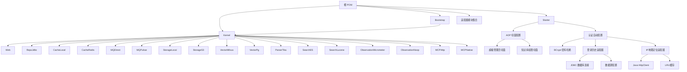

**图表来源**
- [pom.xml](file://pom.xml)
- [SeahorseAgentAopAutoConfiguration.java](file://seahorse-agent-spring-boot-starter/src/main/java/com/miracle/ai/seahorse/agent/adapters/spring/SeahorseAgentAopAutoConfiguration.java)
- [SeahorseAgentKernelAuthAutoConfiguration.java](file://seahorse-agent-spring-boot-starter/src/main/java/com/miracle/ai/seahorse/agent/adapters/spring/SeahorseAgentKernelAuthAutoConfiguration.java)

**章节来源**
- [pom.xml](file://pom.xml)

## 性能考虑
- 限流与门禁：通过速率限制与功能门禁降低突发流量与无效请求的影响
- 缓存策略：本地与 Redis 缓存适配器提升热点数据访问性能
- 存储与向量检索：对象存储与向量库适配器支持大体量数据的高效检索
- 观察与指标：Micrometer 观察适配器提供性能指标采集与告警
- **新增** 权限缓存：权限切面支持权限结果缓存，减少重复查询开销
- **新增** 密码哈希性能：100,000次迭代提供强安全但需要合理的时间预算
- **新增** 登录历史写入：异步化设计，历史记录失败不影响主认证流程
- **新增** 数据库优化：登录历史查询支持分页和索引优化，避免全表扫描
- **新增** IP地理定位缓存：LRU缓存机制减少API调用频率，提升响应速度
- **新增** User-Agent解析：纯Java实现，无外部依赖，解析性能优异
- **新增** X-Forwarded-For处理：支持代理环境，确保IP地址准确性

## 故障排除指南
- 访问被拒：检查访问决策控制器与仓储的返回状态，确认用户权限与资源策略
- 限流触发：查看速率限制过滤器配置，调整阈值或路由策略
- 功能不可用：确认高级功能门禁状态与租户策略
- 运行模式问题：核对运行时模式配置，确保生产/开发模式下的行为一致
- **新增** 权限验证失败：检查超级管理员切面的日志输出，确认用户角色或 IP 白名单配置
- **新增** 知识库权限不足：验证 `@RequireKbPermission` 注解的权限级别与用户实际权限
- **新增** 密码哈希问题：检查BCryptPasswordHasherAdapter配置，确认SHA-512算法可用性
- **新增** 登录历史记录失败：查看JdbcLoginHistoryAdapter日志，确认数据库连接和表结构
- **新增** IP地址提取失败：检查Web控制器的IP地址提取逻辑，确认代理头配置
- **新增** 用户代理解析异常：验证User-Agent解析器配置，检查特殊浏览器兼容性
- **新增** IP地理定位服务异常：检查ip-api.com服务可用性，确认网络连接和缓存配置
- **新增** X-Forwarded-For头部处理：验证代理服务器配置，确保正确的IP传递

**章节来源**
- [SeahorseAccessDecisionController.java](file://seahorse-agent-adapter-web/src/main/java/com/miracle/ai/seahorse/agent/adapters/web/SeahorseAccessDecisionController.java)
- [RateLimitFilter.java](file://seahorse-agent-adapter-web/src/main/java/com/miracle/ai/seahorse/agent/adapters/web/RateLimitFilter.java)
- [AdvancedFeatureGate.java](file://seahorse-agent-adapter-web/src/main/java/com/miracle/ai/seahorse/agent/adapters/web/AdvancedFeatureGate.java)
- [KernelRuntimeMode.java](file://seahorse-agent-kernel/src/main/java/com/miracle/ai/seahorse/agent/kernel/config/KernelRuntimeMode.java)
- [SuperAdminAspect.java](file://seahorse-agent-adapter-web/src/main/java/com/miracle/ai/seahorse/agent/adapters/web/SuperAdminAspect.java)
- [KbPermissionAspect.java](file://seahorse-agent-adapter-web/src/main/java/com/miracle/ai/seahorse/agent/adapters/web/KbPermissionAspect.java)
- [BCryptPasswordHasherAdapter.java](file://seahorse-agent-adapter-web/src/main/java/com/miracle/ai/seahorse/agent/adapters/web/BCryptPasswordHasherAdapter.java)
- [JdbcLoginHistoryAdapter.java](file://seahorse-agent-adapter-repository-jdbc/src/main/java/com/miracle/ai/seahorse/agent/adapters/repository/jdbc/JdbcLoginHistoryAdapter.java)
- [IpApiGeolocationAdapter.java](file://seahorse-agent-adapter-web/src/main/java/com/miracle/ai/seahorse/agent/adapters/web/IpApiGeolocationAdapter.java)
- [RateLimitFilter.java](file://seahorse-agent-adapter-web/src/main/java/com/miracle/ai/seahorse/agent/adapters/web/RateLimitFilter.java)

## 结论
本项目通过清晰的分层架构与完善的适配器体系，在保证高性能的同时强化了安全边界。**新增的权限切面、超级管理员验证机制、密码哈希系统、登录历史跟踪功能、IP地理定位服务集成和用户代理解析能力**进一步提升了系统的安全性与可管理性。

**更新** 通过声明式权限控制、bcrypt强度密码哈希、完整认证审计、IP地理定位和用户代理解析，系统实现了从粗粒度到精细化的安全防护体系。登录历史跟踪系统现已支持X-Forwarded-For头部处理、IP地址提取、用户代理解析、设备信息记录、地理定位等详细登录信息，为安全审计和威胁检测提供全面的数据支撑。密码哈希机制提供100倍更强的抗攻击能力，IP地理定位服务提供实时的地理位置分析，用户代理解析器提供准确的设备识别，共同构成企业级应用的全方位安全基石。

## 附录
- 部署与运维：参考部署文档与监控运维指南，确保生产环境的安全与稳定
- 开发指南：遵循开发规范与最佳实践，持续完善安全与质量基线
- **新增** 权限配置：超级管理员 IP 白名单配置项 `seahorse.admin.allowed-ips`
- **新增** 密码安全：bcrypt哈希配置，支持100,000次迭代的PBKDF2风格加密
- **新增** 审计配置：登录历史表结构和记录字段说明，支持详细登录信息记录
- **新增** 数据库配置：t_login_history表的完整字段定义和索引建议
- **新增** 地理定位配置：ip-api.com服务集成配置和缓存参数设置
- **新增** 用户代理解析：浏览器和操作系统识别规则与版本号提取机制
- **新增** 代理环境配置：X-Forwarded-For头部处理和IP地址提取策略

**章节来源**
- [DEPLOY.md](file://DEPLOY.md)
- [docs/zh/content/部署配置/README.md](file://docs/zh/content/部署配置/README.md)
- [docs/zh/content/监控运维/README.md](file://docs/zh/content/监控运维/README.md)
- [docs/zh/content/开发指南/README.md](file://docs/zh/content/开发指南/README.md)