# 应用服务层

<cite>
**本文引用的文件**
- [KernelAuthService.java](file://seahorse-agent-kernel/src/main/java/com/miracle/ai/seahorse/agent/kernel/application/auth/KernelAuthService.java)
- [KernelChatPipeline.java](file://seahorse-agent-kernel/src/main/java/com/miracle/ai/seahorse/agent/kernel/application/chat/KernelChatPipeline.java)
- [KernelConversationService.java](file://seahorse-agent-kernel/src/main/java/com/miracle/ai/seahorse/agent/kernel/application/conversation/KernelConversationService.java)
- [KernelIngestionEngine.java](file://seahorse-agent-kernel/src/main/java/com/miracle/ai/seahorse/agent/kernel/application/ingestion/KernelIngestionEngine.java)
- [KernelIngestionPipelineService.java](file://seahorse-agent-kernel/src/main/java/com/miracle/ai/seahorse/agent/kernel/application/ingestion/KernelIngestionPipelineService.java)
- [KernelIngestionTaskService.java](file://seahorse-agent-kernel/src/main/java/com/miracle/ai/seahorse/agent/kernel/application/ingestion/KernelIngestionTaskService.java)
- [KernelKnowledgeBaseService.java](file://seahorse-agent-kernel/src/main/java/com/miracle/ai/seahorse/agent/kernel/application/knowledge/KernelKnowledgeBaseService.java)
- [KernelKnowledgeDocumentService.java](file://seahorse-agent-kernel/src/main/java/com/miracle/ai/seahorse/agent/kernel/application/knowledge/KernelKnowledgeDocumentService.java)
- [KernelKnowledgeChunkService.java](file://seahorse-agent-kernel/src/main/java/com/miracle/ai/seahorse/agent/kernel/application/knowledge/KernelKnowledgeChunkService.java)
- [KernelKnowledgeBaseVersionService.java](file://seahorse-agent-kernel/src/main/java/com/miracle/ai/seahorse/agent/kernel/application/knowledge/KernelKnowledgeBaseVersionService.java)
- [KnowledgeBasePermissionService.java](file://seahorse-agent-kernel/src/main/java/com/miracle/ai/seahorse/agent/kernel/application/knowledge/KnowledgeBasePermissionService.java)
- [KnowledgeBaseShareService.java](file://seahorse-agent-kernel/src/main/java/com/miracle/ai/seahorse/agent/kernel/application/knowledge/KnowledgeBaseShareService.java)
- [KernelMemoryEngine.java](file://seahorse-agent-kernel/src/main/java/com/miracle/ai/seahorse/agent/kernel/application/memory/KernelMemoryEngine.java)
- [KernelMemoryGovernanceService.java](file://seahorse-agent-kernel/src/main/java/com/miracle/ai/seahorse/agent/kernel/application/memory/KernelMemoryGovernanceService.java)
- [KernelMemoryManagementService.java](file://seahorse-agent-kernel/src/main/java/com/miracle/ai/seahorse/agent/kernel/application/memory/KernelMemoryManagementService.java)
- [KernelMetadataBackfillService.java](file://seahorse-agent-kernel/src/main/java/com/miracle/ai/seahorse/agent/kernel/application/metadata/KernelMetadataBackfillService.java)
- [KernelMetadataDictionaryService.java](file://seahorse-agent-kernel/src/main/java/com/miracle/ai/seahorse/agent/kernel/application/metadata/KernelMetadataDictionaryService.java)
- [KernelMetadataExtractionResultService.java](file://seahorse-agent-kernel/src/main/java/com/miracle/ai/seahorse/agent/kernel/application/metadata/KernelMetadataExtractionResultService.java)
- [KernelMetadataQualityService.java](file://seahorse-agent-kernel/src/main/java/com/miracle/ai/seahorse/agent/kernel/application/metadata/KernelMetadataQualityService.java)
- [KernelMetadataQuarantineService.java](file://seahorse-agent-kernel/src/main/java/com/miracle/ai/seahorse/agent/kernel/application/metadata/KernelMetadataQuarantineService.java)
- [KernelMetadataReviewService.java](file://seahorse-agent-kernel/src/main/java/com/miracle/ai/seahorse/agent/kernel/application/metadata/KernelMetadataReviewService.java)
- [KernelMetadataSchemaService.java](file://seahorse-agent-kernel/src/main/java/com/miracle/ai/seahorse/agent/kernel/application/metadata/KernelMetadataSchemaService.java)
- [KernelMetadataSchemaUsageService.java](file://seahorse-agent-kernel/src/main/java/com/miracle/ai/seahorse/agent/kernel/application/metadata/KernelMetadataSchemaUsageService.java)
- [KernelRetrievalEvaluationService.java](file://seahorse-agent-kernel/src/main/java/com/miracle/ai/seahorse/agent/kernel/application/retrieval/KernelRetrievalEvaluationService.java)
- [KernelAccessDecisionQueryService.java](file://seahorse-agent-kernel/src/main/java/com/miracle/ai/seahorse/agent/kernel/application/agent/context/KernelAccessDecisionQueryService.java)
- [KernelContextPackBuilderService.java](file://seahorse-agent-kernel/src/main/java/com/miracle/ai/seahorse/agent/kernel/application/agent/context/KernelContextPackBuilderService.java)
- [KernelContextPackQueryService.java](file://seahorse-agent-kernel/src/main/java/com/miracle/ai/seahorse/agent/kernel/application/agent/context/KernelContextPackQueryService.java)
- [KernelResourceAclManagementService.java](file://seahorse-agent-kernel/src/main/java/com/miracle/ai/seahorse/agent/kernel/application/agent/context/KernelResourceAclManagementService.java)
- [KernelAgentFactoryService.java](file://seahorse-agent-kernel/src/main/java/com/miracle/ai/seahorse/agent/kernel/application/agent/factory/KernelAgentFactoryService.java)
- [KernelProductionGateService.java](file://seahorse-agent-kernel/src/main/java/com/miracle/ai/seahorse/agent/kernel/application/agent/gate/KernelProductionGateService.java)
- [KernelAgentHandoffService.java](file://seahorse-agent-kernel/src/main/java/com/miracle/ai/seahorse/agent/kernel/application/agent/handoff/KernelAgentHandoffService.java)
- [KernelApprovalManagementService.java](file://seahorse-agent-kernel/src/main/java/com/miracle/ai/seahorse/agent/kernel/application/agent/approval/KernelApprovalManagementService.java)
- [KernelQuotaDecisionService.java](file://seahorse-agent-kernel/src/main/java/com/miracle/ai/seahorse/agent/kernel/application/agent/quota/KernelQuotaDecisionService.java)
- [KernelAgentRunCostSummaryService.java](file://seahorse-agent-kernel/src/main/java/com/miracle/ai/seahorse/agent/kernel/application/agent/cost/KernelAgentRunCostSummaryService.java)
- [KernelCostUsageQueryService.java](file://seahorse-agent-kernel/src/main/java/com/miracle/ai/seahorse/agent/kernel/application/agent/cost/KernelCostUsageQueryService.java)
- [KernelAgentEvalQueryService.java](file://seahorse-agent-kernel/src/main/java/com/miracle/ai/seahorse/agent/kernel/application/agent/eval/KernelAgentEvalQueryService.java)
- [KernelEvalCandidateDecisionService.java](file://seahorse-agent-kernel/src/main/java/com/miracle/ai/seahorse/agent/kernel/application/agent/eval/KernelEvalCandidateDecisionService.java)
- [KernelEvalRegressionService.java](file://seahorse-agent-kernel/src/main/java/com/miracle/ai/seahorse/agent/kernel/application/agent/eval/KernelEvalRegressionService.java)
- [KernelAgentArtifactQueryService.java](file://seahorse-agent-kernel/src/main/java/com/miracle/ai/seahorse/agent/kernel/application/agent/artifact/KernelAgentArtifactQueryService.java)
- [KernelAgentArtifactUpdateService.java](file://seahorse-agent-kernel/src/main/java/com/miracle/ai/seahorse/agent/kernel/application/agent/artifact/KernelAgentArtifactUpdateService.java)
- [KernelAuditLedgerService.java](file://seahorse-agent-kernel/src/main/java/com/miracle/ai/seahorse/agent/kernel/application/agent/audit/KernelAuditLedgerService.java)
- [KernelOpenApiConnectorImportService.java](file://seahorse-agent-kernel/src/main/java/com/miracle/ai/seahorse/agent/kernel/application/agent/connector/KernelOpenApiConnectorImportService.java)
- [KernelEnterprisePilotReadinessService.java](file://seahorse-agent-kernel/src/main/java/com/miracle/ai/seahorse/agent/kernel/application/agent/readiness/KernelEnterprisePilotReadinessService.java)
- [KernelAgentDefinitionService.java](file://seahorse-agent-kernel/src/main/java/com/miracle/ai/seahorse/agent/kernel/application/agent/registry/KernelAgentDefinitionService.java)
- [KernelResearchInboundService.java](file://seahorse-agent-kernel/src/main/java/com/miracle/ai/seahorse/agent/kernel/application/agent/research/KernelResearchInboundService.java)
- [KernelAgentMarketplaceService.java](file://seahorse-agent-kernel/src/main/java/com/miracle/ai/seahorse/agent/kernel/application/agent/marketplace/KernelAgentMarketplaceService.java)
- [KernelAdminTenantService.java](file://seahorse-agent-kernel/src/main/java/com/miracle/ai/seahorse/agent/kernel/application/admin/KernelAdminTenantService.java)
- [KernelAuditLogService.java](file://seahorse-agent-kernel/src/main/java/com/miracle/ai/seahorse/agent/kernel/application/admin/KernelAuditLogService.java)
- [KernelIntentTreeService.java](file://seahorse-agent-kernel/src/main/java/com/miracle/ai/seahorse/agent/kernel/application/intent/KernelIntentTreeService.java)
- [KernelKeywordIndexMaintenanceService.java](file://seahorse-agent-kernel/src/main/java/com/miracle/ai/seahorse/agent/kernel/application/keyword/KernelKeywordIndexMaintenanceService.java)
- [KernelDocumentRefreshService.java](file://seahorse-agent-kernel/src/main/java/com/miracle/ai/seahorse/agent/kernel/application/knowledge/KernelDocumentRefreshService.java)
- [KernelDashboardService.java](file://seahorse-agent-kernel/src/main/java/com/miracle/ai/seahorse/agent/kernel/application/dashboard/KernelDashboardService.java)
- [KernelFeedbackService.java](file://seahorse-agent-kernel/src/main/java/com/miracle/ai/seahorse/agent/kernel/application/feedback/KernelFeedbackService.java)
- [KernelTraceService.java](file://seahorse-agent-kernel/src/main/java/com/miracle/ai/seahorse/agent/kernel/application/trace/KernelTraceService.java)
- [KernelModelRoutingService.java](file://seahorse-agent-kernel/src/main/java/com/miracle/ai/seahorse/agent/kernel/application/model/KernelModelRoutingService.java)
- [KernelSampleQuestionService.java](file://seahorse-agent-kernel/src/main/java/com/miracle/ai/seahorse/agent/kernel/application/sample/KernelSampleQuestionService.java)
- [KernelUserMemoryService.java](file://seahorse-agent-kernel/src/main/java/com/miracle/ai/seahorse/agent/kernel/application/user/KernelUserMemoryService.java)
- [KernelMcpService.java](file://seahorse-agent-kernel/src/main/java/com/miracle/ai/seahorse/agent/kernel/application/mcp/KernelMcpService.java)
- [KernelMappingService.java](file://seahorse-agent-kernel/src/main/java/com/miracle/ai/seahorse/agent/kernel/application/mapping/KernelMappingService.java)
- [KernelCredentialService.java](file://seahorse-agent-kernel/src/main/java/com/miracle/ai/seahorse/agent/kernel/application/credential/KernelCredentialService.java)
- [KernelAgentRunStoreService.java](file://seahorse-agent-kernel/src/main/java/com/miracle/ai/seahorse/agent/kernel/application/agent/registry/KernelAgentRunStoreService.java)
- [KernelSandboxService.java](file://seahorse-agent-kernel/src/main/java/com/miracle/ai/seahorse/agent/kernel/application/agent/sandbox/KernelSandboxService.java)
- [KernelSelfHealingOutputRepairService.java](file://seahorse-agent-kernel/src/main/java/com/miracle/ai/seahorse/agent/kernel/application/agent/output/SelfHealingOutputRepairService.java)
- [KernelOutputGovernanceService.java](file://seahorse-agent-kernel/src/main/java/com/miracle/ai/seahorse/agent/kernel/application/agent/output/OutputGovernanceService.java)
- [KernelVersionQualityComparisonService.java](file://seahorse-agent-kernel/src/main/java/com/miracle/ai/seahorse/agent/kernel/application/metadata/KernelVersionQualityComparisonService.java)
- [KernelRetrievalLayeredScoredMemoryVectorPort.java](file://seahorse-agent-kernel/src/main/java/com/miracle/ai/seahorse/agent/kernel/application/memory/retrieval/LayeredScoredMemoryVectorPort.java)
- [KernelRetrievalVectorSearchScoredMemoryVectorPort.java](file://seahorse-agent-kernel/src/main/java/com/miracle/ai/seahorse/agent/kernel/application/memory/retrieval/VectorSearchScoredMemoryVectorPort.java)
- [KernelRetrievalModelMemoryRecallReranker.java](file://seahorse-agent-kernel/src/main/java/com/miracle/ai/seahorse/agent/kernel/application/memory/retrieval/ModelMemoryRecallReranker.java)
- [KernelMemoryBusinessDocumentRetrieverPort.java](file://seahorse-agent-kernel/src/main/java/com/miracle/ai/seahorse/agent/ports/outbound/memory/MemoryBusinessDocumentRetrieverPort.java)
- [SeahorseAgentMarketplaceAdminAutoConfiguration.java](file://seahorse-agent-spring-boot-starter/src/main/java/com/miracle/ai/seahorse/agent/adapters/spring/SeahorseAgentMarketplaceAdminAutoConfiguration.java)
- [KernelMemoryReviewServiceTests.java](file://seahorse-agent-tests/src/test/java/com/miracle/ai/seahorse/agent/kernel/application/memory/KernelMemoryReviewServiceTests.java)
- [SeahorseAgentKernelAutoConfigurationTests.java](file://seahorse-agent-tests/src/test/java/com/miracle/ai/seahorse/agent/adapters/spring/SeahorseAgentKernelAutoConfigurationTests.java)
</cite>

## 目录
1. [引言](#引言)
2. [项目结构](#项目结构)
3. [核心组件](#核心组件)
4. [架构总览](#架构总览)
5. [详细组件分析](#详细组件分析)
6. [依赖关系分析](#依赖关系分析)
7. [性能考量](#性能考量)
8. [故障排查指南](#故障排查指南)
9. [结论](#结论)
10. [附录](#附录)

## 引言
本文件系统性梳理应用服务层（Application Layer）在该代码库中的职责边界、业务流程与跨层交互方式。应用服务层以"业务用例编排器"为核心定位，负责：
- 将来自适配层或外部系统的请求转换为可执行的业务用例；
- 协调领域模型与基础设施端口（Ports），确保业务规则的一致性与完整性；
- 组织多子域服务（如代理、聊天、会话、摄取、知识库、记忆、元数据、检索等）之间的协作；
- 实现参数校验、异常处理与事务管理（通过端口契约与运行时模式体现）。

**更新** 新增了知识库增强服务、代理市场服务、管理员服务等模块，进一步完善了平台的治理能力和生态建设。

## 项目结构
应用服务层主要位于 seahorse-agent-kernel 模块的 kernel/application 目录下，按业务子域划分包结构，每个子域包含若干服务类，实现对应的 Inbound Port 接口，承担编排职责。

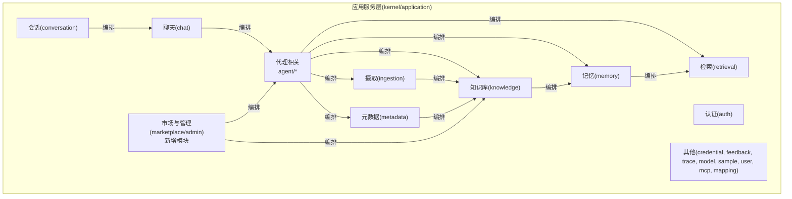

图中展示了应用服务层各子域的职责边界与相互编排关系，体现了"代理驱动、以用例为中心"的设计思路，以及新增的市场与管理模块。

## 核心组件
本节概览各子域应用服务的关键职责与典型方法签名位置（以路径标注代替具体代码内容）：

- 认证与授权
  - KernelAuthService：负责用户认证与令牌发放，典型方法位于 [KernelAuthService.java:1-200](file://seahorse-agent-kernel/src/main/java/com/miracle/ai/seahorse/agent/kernel/application/auth/KernelAuthService.java#L1-L200)。
- 聊天与会话
  - KernelChatPipeline：编排聊天对话生成流程，典型方法位于 [KernelChatPipeline.java:1-200](file://seahorse-agent-kernel/src/main/java/com/miracle/ai/seahorse/agent/kernel/application/chat/KernelChatPipeline.java#L1-L200)。
  - KernelConversationService：管理会话生命周期与消息持久化，典型方法位于 [KernelConversationService.java:1-200](file://seahorse-agent-kernel/src/main/java/com/miracle/ai/seahorse/agent/kernel/application/conversation/KernelConversationService.java#L1-L200)。
- 摄取与知识
  - KernelIngestionEngine：统一的摄取引擎，典型方法位于 [KernelIngestionEngine.java:1-200](file://seahorse-agent-kernel/src/main/java/com/miracle/ai/seahorse/agent/kernel/application/ingestion/KernelIngestionEngine.java#L1-L200)。
  - KernelIngestionPipelineService：摄取流水线编排，典型方法位于 [KernelIngestionPipelineService.java:1-200](file://seahorse-agent-kernel/src/main/java/com/miracle/ai/seahorse/agent/kernel/application/ingestion/KernelIngestionPipelineService.java#L1-L200)。
  - KernelIngestionTaskService：任务调度与状态管理，典型方法位于 [KernelIngestionTaskService.java:1-200](file://seahorse-agent-kernel/src/main/java/com/miracle/ai/seahorse/agent/kernel/application/ingestion/KernelIngestionTaskService.java#L1-L200)。
  - KernelKnowledgeBaseService：知识库维度的查询与治理，典型方法位于 [KernelKnowledgeBaseService.java:1-200](file://seahorse-agent-kernel/src/main/java/com/miracle/ai/seahorse/agent/kernel/application/knowledge/KernelKnowledgeBaseService.java#L1-L200)。
  - KernelKnowledgeDocumentService：文档级知识的增删改查与向量化，典型方法位于 [KernelKnowledgeDocumentService.java:1-200](file://seahorse-agent-kernel/src/main/java/com/miracle/ai/seahorse/agent/kernel/application/knowledge/KernelKnowledgeDocumentService.java#L1-L200)。
  - KernelKnowledgeChunkService：分片维度的索引与检索，典型方法位于 [KernelKnowledgeChunkService.java:1-200](file://seahorse-agent-kernel/src/main/java/com/miracle/ai/seahorse/agent/kernel/application/knowledge/KernelKnowledgeChunkService.java#L1-L200)。
  - **新增** KernelKnowledgeBaseVersionService：知识库版本管理，典型方法位于 [KernelKnowledgeBaseVersionService.java:1-200](file://seahorse-agent-kernel/src/main/java/com/miracle/ai/seahorse/agent/kernel/application/knowledge/KernelKnowledgeBaseVersionService.java#L1-L200)。
  - **新增** KnowledgeBasePermissionService：知识库权限控制，典型方法位于 [KnowledgeBasePermissionService.java:1-200](file://seahorse-agent-kernel/src/main/java/com/miracle/ai/seahorse/agent/kernel/application/knowledge/KnowledgeBasePermissionService.java#L1-L200)。
  - **新增** KnowledgeBaseShareService：知识库外部共享，典型方法位于 [KnowledgeBaseShareService.java:1-200](file://seahorse-agent-kernel/src/main/java/com/miracle/ai/seahorse/agent/kernel/application/knowledge/KnowledgeBaseShareService.java#L1-L200)。
- 记忆
  - KernelMemoryEngine：记忆引擎编排，典型方法位于 [KernelMemoryEngine.java:1-200](file://seahorse-agent-kernel/src/main/java/com/miracle/ai/seahorse/agent/kernel/application/memory/KernelMemoryEngine.java#L1-L200)。
  - KernelMemoryGovernanceService：记忆治理与合规，典型方法位于 [KernelMemoryGovernanceService.java:1-200](file://seahorse-agent-kernel/src/main/java/com/miracle/ai/seahorse/agent/kernel/application/memory/KernelMemoryGovernanceService.java#L1-L200)。
  - KernelMemoryManagementService：记忆生命周期管理，典型方法位于 [KernelMemoryManagementService.java:1-200](file://seahorse-agent-kernel/src/main/java/com/miracle/ai/seahorse/agent/kernel/application/memory/KernelMemoryManagementService.java#L1-L200)。
- 元数据
  - KernelMetadataBackfillService：元数据回填，典型方法位于 [KernelMetadataBackfillService.java:1-200](file://seahorse-agent-kernel/src/main/java/com/miracle/ai/seahorse/agent/kernel/application/metadata/KernelMetadataBackfillService.java#L1-L200)。
  - KernelMetadataDictionaryService：字典管理，典型方法位于 [KernelMetadataDictionaryService.java:1-200](file://seahorse-agent-kernel/src/main/java/com/miracle/ai/seahorse/agent/kernel/application/metadata/KernelMetadataDictionaryService.java#L1-L200)。
  - KernelMetadataExtractionResultService：抽取结果管理，典型方法位于 [KernelMetadataExtractionResultService.java:1-200](file://seahorse-agent-kernel/src/main/java/com/miracle/ai/seahorse/agent/kernel/application/metadata/KernelMetadataExtractionResultService.java#L1-L200)。
  - KernelMetadataQualityService：质量评估，典型方法位于 [KernelMetadataQualityService.java:1-200](file://seahorse-agent-kernel/src/main/java/com/miracle/ai/seahorse/agent/kernel/application/metadata/KernelMetadataQualityService.java#L1-L200)。
  - KernelMetadataQuarantineService：隔离与复核，典型方法位于 [KernelMetadataQuarantineService.java:1-200](file://seahorse-agent-kernel/src/main/java/com/miracle/ai/seahorse/agent/kernel/application/metadata/KernelMetadataQuarantineService.java#L1-L200)。
  - KernelMetadataReviewService：元数据复核决策，典型方法位于 [KernelMetadataReviewService.java:1-200](file://seahorse-agent-kernel/src/main/java/com/miracle/ai/seahorse/agent/kernel/application/metadata/KernelMetadataReviewService.java#L1-L200)。
  - KernelMetadataSchemaService：模式定义与变更，典型方法位于 [KernelMetadataSchemaService.java:1-200](file://seahorse-agent-kernel/src/main/java/com/miracle/ai/seahorse/agent/kernel/application/metadata/KernelMetadataSchemaService.java#L1-L200)。
  - KernelMetadataSchemaUsageService：模式使用统计与审计，典型方法位于 [KernelMetadataSchemaUsageService.java:1-200](file://seahorse-agent-kernel/src/main/java/com/miracle/ai/seahorse/agent/kernel/application/metadata/KernelMetadataSchemaUsageService.java#L1-L200)。
  - KernelVersionQualityComparisonService：版本质量对比，典型方法位于 [KernelVersionQualityComparisonService.java:1-200](file://seahorse-agent-kernel/src/main/java/com/miracle/ai/seahorse/agent/kernel/application/metadata/KernelVersionQualityComparisonService.java#L1-L200)。
- 检索
  - KernelRetrievalEvaluationService：检索效果评估，典型方法位于 [KernelRetrievalEvaluationService.java:1-200](file://seahorse-agent-kernel/src/main/java/com/miracle/ai/seahorse/agent/kernel/application/retrieval/KernelRetrievalEvaluationService.java#L1-L200)。
  - KernelRetrievalLayeredScoredMemoryVectorPort：分层打分检索端口，典型方法位于 [KernelRetrievalLayeredScoredMemoryVectorPort.java:1-200](file://seahorse-agent-kernel/src/main/java/com/miracle/ai/seahorse/agent/kernel/application/memory/retrieval/LayeredScoredMemoryVectorPort.java#L1-L200)。
  - KernelRetrievalVectorSearchScoredMemoryVectorPort：向量检索端口，典型方法位于 [KernelRetrievalVectorSearchScoredMemoryVectorPort.java:1-200](file://seahorse-agent-kernel/src/main/java/com/miracle/ai/seahorse/agent/kernel/application/memory/retrieval/VectorSearchScoredMemoryVectorPort.java#L1-L200)。
  - KernelRetrievalModelMemoryRecallReranker：召回重排，典型方法位于 [KernelRetrievalModelMemoryRecallReranker.java:1-200](file://seahorse-agent-kernel/src/main/java/com/miracle/ai/seahorse/agent/kernel/application/memory/retrieval/ModelMemoryRecallReranker.java#L1-L200)。
  - KernelMemoryBusinessDocumentRetrieverPort：业务文档检索端口，典型方法位于 [KernelMemoryBusinessDocumentRetrieverPort.java:1-200](file://seahorse-agent-kernel/src/main/java/com/miracle/ai/seahorse/agent/ports/outbound/memory/MemoryBusinessDocumentRetrieverPort.java#L1-L200)。
- 代理能力与上下文
  - KernelAccessDecisionQueryService：访问决策查询，典型方法位于 [KernelAccessDecisionQueryService.java:1-200](file://seahorse-agent-kernel/src/main/java/com/miracle/ai/seahorse/agent/kernel/application/agent/context/KernelAccessDecisionQueryService.java#L1-L200)。
  - KernelContextPackBuilderService：上下文包构建，典型方法位于 [KernelContextPackBuilderService.java:1-200](file://seahorse-agent-kernel/src/main/java/com/miracle/ai/seahorse/agent/kernel/application/agent/context/KernelContextPackBuilderService.java#L1-L200)。
  - KernelContextPackQueryService：上下文包查询，典型方法位于 [KernelContextPackQueryService.java:1-200](file://seahorse-agent-kernel/src/main/java/com/miracle/ai/seahorse/agent/kernel/application/agent/context/KernelContextPackQueryService.java#L1-L200)。
  - KernelResourceAclManagementService：资源ACL管理，典型方法位于 [KernelResourceAclManagementService.java:1-200](file://seahorse-agent-kernel/src/main/java/com/miracle/ai/seahorse/agent/kernel/application/agent/context/KernelResourceAclManagementService.java#L1-L200)。
- 代理工厂与生产门禁
  - KernelAgentFactoryService：代理实例的创建与装配，典型方法位于 [KernelAgentFactoryService.java:1-200](file://seahorse-agent-kernel/src/main/java/com/miracle/ai/seahorse/agent/kernel/application/agent/factory/KernelAgentFactoryService.java#L1-L200)。
  - KernelProductionGateService：生产门禁控制代理发布与运行，典型方法位于 [KernelProductionGateService.java:1-200](file://seahorse-agent-kernel/src/main/java/com/miracle/ai/seahorse/agent/kernel/application/agent/gate/KernelProductionGateService.java#L1-L200)。
- 代理协作与治理
  - KernelAgentHandoffService：代理转交与协作，典型方法位于 [KernelAgentHandoffService.java:1-200](file://seahorse-agent-kernel/src/main/java/com/miracle/ai/seahorse/agent/kernel/application/agent/handoff/KernelAgentHandoffService.java#L1-L200)。
  - KernelApprovalManagementService：审批流程编排，典型方法位于 [KernelApprovalManagementService.java:1-200](file://seahorse-agent-kernel/src/main/java/com/miracle/ai/seahorse/agent/kernel/application/agent/approval/KernelApprovalManagementService.java#L1-L200)。
  - KernelQuotaDecisionService：配额决策与限制，典型方法位于 [KernelQuotaDecisionService.java:1-200](file://seahorse-agent-kernel/src/main/java/com/miracle/ai/seahorse/agent/kernel/application/agent/quota/KernelQuotaDecisionService.java#L1-L200)。
  - KernelAgentRunCostSummaryService：运行成本汇总，典型方法位于 [KernelAgentRunCostSummaryService.java:1-200](file://seahorse-agent-kernel/src/main/java/com/miracle/ai/seahorse/agent/kernel/application/agent/cost/KernelAgentRunCostSummaryService.java#L1-L200)。
  - KernelCostUsageQueryService：成本用量查询，典型方法位于 [KernelCostUsageQueryService.java:1-200](file://seahorse-agent-kernel/src/main/java/com/miracle/ai/seahorse/agent/kernel/application/agent/cost/KernelCostUsageQueryService.java#L1-L200)。
  - KernelAgentEvalQueryService：评估查询，典型方法位于 [KernelAgentEvalQueryService.java:1-200](file://seahorse-agent-kernel/src/main/java/com/miracle/ai/seahorse/agent/kernel/application/agent/eval/KernelAgentEvalQueryService.java#L1-L200)。
  - KernelEvalCandidateDecisionService：候选决策，典型方法位于 [KernelEvalCandidateDecisionService.java:1-200](file://seahorse-agent-kernel/src/main/java/com/miracle/ai/seahorse/agent/kernel/application/agent/eval/KernelEvalCandidateDecisionService.java#L1-L200)。
  - KernelEvalRegressionService：回归评估，典型方法位于 [KernelEvalRegressionService.java:1-200](file://seahorse-agent-kernel/src/main/java/com/miracle/ai/seahorse/agent/kernel/application/agent/eval/KernelEvalRegressionService.java#L1-L200)。
  - KernelAgentArtifactQueryService：制品查询，典型方法位于 [KernelAgentArtifactQueryService.java:1-200](file://seahorse-agent-kernel/src/main/java/com/miracle/ai/seahorse/agent/kernel/application/agent/artifact/KernelAgentArtifactQueryService.java#L1-L200)。
  - KernelAgentArtifactUpdateService：制品更新，典型方法位于 [KernelAgentArtifactUpdateService.java:1-200](file://seahorse-agent-kernel/src/main/java/com/miracle/ai/seahorse/agent/kernel/application/agent/artifact/KernelAgentArtifactUpdateService.java#L1-L200)。
  - KernelAuditLedgerService：审计账本，典型方法位于 [KernelAuditLedgerService.java:1-200](file://seahorse-agent-kernel/src/main/java/com/miracle/ai/seahorse/agent/kernel/application/agent/audit/KernelAuditLedgerService.java#L1-L200)。
  - KernelOpenApiConnectorImportService：OpenAPI连接器导入，典型方法位于 [KernelOpenApiConnectorImportService.java:1-200](file://seahorse-agent-kernel/src/main/java/com/miracle/ai/seahorse/agent/kernel/application/agent/connector/KernelOpenApiConnectorImportService.java#L1-L200)。
  - KernelEnterprisePilotReadinessService：企业试飞就绪度，典型方法位于 [KernelEnterprisePilotReadinessService.java:1-200](file://seahorse-agent-kernel/src/main/java/com/miracle/ai/seahorse/agent/kernel/application/agent/readiness/KernelEnterprisePilotReadinessService.java#L1-L200)。
  - KernelAgentDefinitionService：代理定义管理，典型方法位于 [KernelAgentDefinitionService.java:1-200](file://seahorse-agent-kernel/src/main/java/com/miracle/ai/seahorse/agent/kernel/application/agent/registry/KernelAgentDefinitionService.java#L1-L200)。
  - KernelResearchInboundService：研究入站，典型方法位于 [KernelResearchInboundService.java:1-200](file://seahorse-agent-kernel/src/main/java/com/miracle/ai/seahorse/agent/kernel/application/agent/research/KernelResearchInboundService.java#L1-L200)。
  - **新增** KernelAgentMarketplaceService：代理市场服务，负责代理发布审核、订阅管理和评分，典型方法位于 [KernelAgentMarketplaceService.java:1-200](file://seahorse-agent-kernel/src/main/java/com/miracle/ai/seahorse/agent/kernel/application/agent/marketplace/KernelAgentMarketplaceService.java#L1-L200)。
- 管理与审计
  - **新增** KernelAdminTenantService：管理员租户管理，负责多租户环境下的管理员权限管理。
  - **新增** KernelAuditLogService：系统审计日志，记录所有关键操作的审计信息。
- 其他支撑服务
  - KernelIntentTreeService：意图树服务，典型方法位于 [KernelIntentTreeService.java:1-200](file://seahorse-agent-kernel/src/main/java/com/miracle/ai/seahorse/agent/kernel/application/intent/KernelIntentTreeService.java#L1-L200)。
  - KernelKeywordIndexMaintenanceService：关键词索引维护，典型方法位于 [KernelKeywordIndexMaintenanceService.java:1-200](file://seahorse-agent-kernel/src/main/java/com/miracle/ai/seahorse/agent/kernel/application/keyword/KernelKeywordIndexMaintenanceService.java#L1-L200)。
  - KernelDocumentRefreshService：文档刷新调度，典型方法位于 [KernelDocumentRefreshService.java:1-200](file://seahorse-agent-kernel/src/main/java/com/miracle/ai/seahorse/agent/kernel/application/knowledge/KernelDocumentRefreshService.java#L1-L200)。
  - KernelDashboardService：仪表盘，典型方法位于 [KernelDashboardService.java:1-200](file://seahorse-agent-kernel/src/main/java/com/miracle/ai/seahorse/agent/kernel/application/dashboard/KernelDashboardService.java#L1-L200)。
  - KernelFeedbackService：反馈处理，典型方法位于 [KernelFeedbackService.java:1-200](file://seahorse-agent-kernel/src/main/java/com/miracle/ai/seahorse/agent/kernel/application/feedback/KernelFeedbackService.java#L1-L200)。
  - KernelTraceService：追踪服务，典型方法位于 [KernelTraceService.java:1-200](file://seahorse-agent-kernel/src/main/java/com/miracle/ai/seahorse/agent/kernel/application/trace/KernelTraceService.java#L1-L200)。
  - KernelModelRoutingService：模型路由，典型方法位于 [KernelModelRoutingService.java:1-200](file://seahorse-agent-kernel/src/main/java/com/miracle/ai/seahorse/agent/kernel/application/model/KernelModelRoutingService.java#L1-L200)。
  - KernelSampleQuestionService：样例问题，典型方法位于 [KernelSampleQuestionService.java:1-200](file://seahorse-agent-kernel/src/main/java/com/miracle/ai/seahorse/agent/kernel/application/sample/KernelSampleQuestionService.java#L1-L200)。
  - KernelUserMemoryService：用户记忆，典型方法位于 [KernelUserMemoryService.java:1-200](file://seahorse-agent-kernel/src/main/java/com/miracle/ai/seahorse/agent/kernel/application/user/KernelUserMemoryService.java#L1-L200)。
  - KernelMcpService：MCP服务，典型方法位于 [KernelMcpService.java:1-200](file://seahorse-agent-kernel/src/main/java/com/miracle/ai/seahorse/agent/kernel/application/mcp/KernelMcpService.java#L1-L200)。
  - KernelMappingService：映射服务，典型方法位于 [KernelMappingService.java:1-200](file://seahorse-agent-kernel/src/main/java/com/miracle/ai/seahorse/agent/kernel/application/mapping/KernelMappingService.java#L1-L200)。
  - KernelCredentialService：凭证服务，典型方法位于 [KernelCredentialService.java:1-200](file://seahorse-agent-kernel/src/main/java/com/miracle/ai/seahorse/agent/kernel/application/credential/KernelCredentialService.java#L1-L200)。
  - KernelAgentRunStoreService：代理运行存储，典型方法位于 [KernelAgentRunStoreService.java:1-200](file://seahorse-agent-kernel/src/main/java/com/miracle/ai/seahorse/agent/kernel/application/agent/registry/KernelAgentRunStoreService.java#L1-L200)。
  - KernelSandboxService：沙箱服务，典型方法位于 [KernelSandboxService.java:1-200](file://seahorse-agent-kernel/src/main/java/com/miracle/ai/seahorse/agent/kernel/application/agent/sandbox/KernelSandboxService.java#L1-L200)。
  - KernelSelfHealingOutputRepairService：输出自愈修复，典型方法位于 [KernelSelfHealingOutputRepairService.java:1-200](file://seahorse-agent-kernel/src/main/java/com/miracle/ai/seahorse/agent/kernel/application/agent/output/SelfHealingOutputRepairService.java#L1-L200)。
  - KernelOutputGovernanceService：输出治理，典型方法位于 [KernelOutputGovernanceService.java:1-200](file://seahorse-agent-kernel/src/main/java/com/miracle/ai/seahorse/agent/kernel/application/agent/output/OutputGovernanceService.java#L1-L200)。

## 架构总览
应用服务层通过 Inbound Port 对外暴露业务用例接口，内部组合多个 Outbound Port 与领域模型，形成清晰的"用例编排—领域—基础设施"三层协作关系。

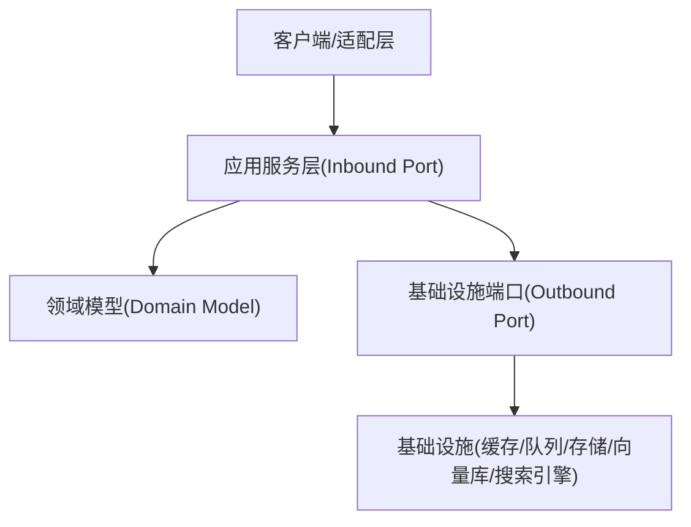

图中体现了应用服务层的核心职责：接收请求、组织业务用例、协调领域与基础设施，并返回结果。

## 详细组件分析

### 代理服务
- KernelAgentFactoryService：负责代理实例的创建与装配，典型方法位于 [KernelAgentFactoryService.java:1-200](file://seahorse-agent-kernel/src/main/java/com/miracle/ai/seahorse/agent/kernel/application/agent/factory/KernelAgentFactoryService.java#L1-L200)。
- KernelProductionGateService：生产门禁控制代理发布与运行，典型方法位于 [KernelProductionGateService.java:1-200](file://seahorse-agent-kernel/src/main/java/com/miracle/ai/seahorse/agent/kernel/application/agent/gate/KernelProductionGateService.java#L1-L200)。
- KernelAgentHandoffService：代理转交与协作，典型方法位于 [KernelAgentHandoffService.java:1-200](file://seahorse-agent-kernel/src/main/java/com/miracle/ai/seahorse/agent/kernel/application/agent/handoff/KernelAgentHandoffService.java#L1-L200)。
- KernelApprovalManagementService：审批流程编排，典型方法位于 [KernelApprovalManagementService.java:1-200](file://seahorse-agent-kernel/src/main/java/com/miracle/ai/seahorse/agent/kernel/application/agent/approval/KernelApprovalManagementService.java#L1-L200)。
- KernelQuotaDecisionService：配额决策与限制，典型方法位于 [KernelQuotaDecisionService.java:1-200](file://seahorse-agent-kernel/src/main/java/com/miracle/ai/seahorse/agent/kernel/application/agent/quota/KernelQuotaDecisionService.java#L1-L200)。
- KernelAgentRunCostSummaryService：运行成本汇总，典型方法位于 [KernelAgentRunCostSummaryService.java:1-200](file://seahorse-agent-kernel/src/main/java/com/miracle/ai/seahorse/agent/kernel/application/agent/cost/KernelAgentRunCostSummaryService.java#L1-L200)。
- KernelCostUsageQueryService：成本用量查询，典型方法位于 [KernelCostUsageQueryService.java:1-200](file://seahorse-agent-kernel/src/main/java/com/miracle/ai/seahorse/agent/kernel/application/agent/cost/KernelCostUsageQueryService.java#L1-L200)。
- KernelAgentEvalQueryService：评估查询，典型方法位于 [KernelAgentEvalQueryService.java:1-200](file://seahorse-agent-kernel/src/main/java/com/miracle/ai/seahorse/agent/kernel/application/agent/eval/KernelAgentEvalQueryService.java#L1-L200)。
- KernelEvalCandidateDecisionService：候选决策，典型方法位于 [KernelEvalCandidateDecisionService.java:1-200](file://seahorse-agent-kernel/src/main/java/com/miracle/ai/seahorse/agent/kernel/application/agent/eval/KernelEvalCandidateDecisionService.java#L1-L200)。
- KernelEvalRegressionService：回归评估，典型方法位于 [KernelEvalRegressionService.java:1-200](file://seahorse-agent-kernel/src/main/java/com/miracle/ai/seahorse/agent/kernel/application/agent/eval/KernelEvalRegressionService.java#L1-L200)。
- KernelAgentArtifactQueryService：制品查询，典型方法位于 [KernelAgentArtifactQueryService.java:1-200](file://seahorse-agent-kernel/src/main/java/com/miracle/ai/seahorse/agent/kernel/application/agent/artifact/KernelAgentArtifactQueryService.java#L1-L200)。
- KernelAgentArtifactUpdateService：制品更新，典型方法位于 [KernelAgentArtifactUpdateService.java:1-200](file://seahorse-agent-kernel/src/main/java/com/miracle/ai/seahorse/agent/kernel/application/agent/artifact/KernelAgentArtifactUpdateService.java#L1-L200)。
- KernelAuditLedgerService：审计账本，典型方法位于 [KernelAuditLedgerService.java:1-200](file://seahorse-agent-kernel/src/main/java/com/miracle/ai/seahorse/agent/kernel/application/agent/audit/KernelAuditLedgerService.java#L1-L200)。
- KernelOpenApiConnectorImportService：OpenAPI连接器导入，典型方法位于 [KernelOpenApiConnectorImportService.java:1-200](file://seahorse-agent-kernel/src/main/java/com/miracle/ai/seahorse/agent/kernel/application/agent/connector/KernelOpenApiConnectorImportService.java#L1-L200)。
- KernelEnterprisePilotReadinessService：企业试飞就绪度，典型方法位于 [KernelEnterprisePilotReadinessService.java:1-200](file://seahorse-agent-kernel/src/main/java/com/miracle/ai/seahorse/agent/kernel/application/agent/readiness/KernelEnterprisePilotReadinessService.java#L1-L200)。
- KernelAgentDefinitionService：代理定义管理，典型方法位于 [KernelAgentDefinitionService.java:1-200](file://seahorse-agent-kernel/src/main/java/com/miracle/ai/seahorse/agent/kernel/application/agent/registry/KernelAgentDefinitionService.java#L1-L200)。
- KernelResearchInboundService：研究入站，典型方法位于 [KernelResearchInboundService.java:1-200](file://seahorse-agent-kernel/src/main/java/com/miracle/ai/seahorse/agent/kernel/application/agent/research/KernelResearchInboundService.java#L1-L200)。
- **新增** KernelAgentMarketplaceService：代理市场服务，负责代理发布审核、订阅管理和评分，典型方法位于 [KernelAgentMarketplaceService.java:1-200](file://seahorse-agent-kernel/src/main/java/com/miracle/ai/seahorse/agent/kernel/application/agent/marketplace/KernelAgentMarketplaceService.java#L1-L200)。

```mermaid
classDiagram
class KernelAgentFactoryService
class KernelProductionGateService
class KernelAgentHandoffService
class KernelApprovalManagementService
class KernelQuotaDecisionService
class KernelAgentRunCostSummaryService
class KernelCostUsageQueryService
class KernelAgentEvalQueryService
class KernelEvalCandidateDecisionService
class KernelEvalRegressionService
class KernelAgentArtifactQueryService
class KernelAgentArtifactUpdateService
class KernelAuditLedgerService
class KernelOpenApiConnectorImportService
class KernelEnterprisePilotReadinessService
class KernelAgentDefinitionService
class KernelResearchInboundService
class KernelAgentMarketplaceService
KernelAgentFactoryService --> KernelProductionGateService : "编排"
KernelAgentFactoryService --> KernelAgentHandoffService : "编排"
KernelAgentFactoryService --> KernelApprovalManagementService : "编排"
KernelAgentFactoryService --> KernelQuotaDecisionService : "编排"
KernelAgentFactoryService --> KernelAgentRunCostSummaryService : "编排"
KernelAgentFactoryService --> KernelCostUsageQueryService : "编排"
KernelAgentFactoryService --> KernelAgentEvalQueryService : "编排"
KernelAgentFactoryService --> KernelEvalCandidateDecisionService : "编排"
KernelAgentFactoryService --> KernelEvalRegressionService : "编排"
KernelAgentFactoryService --> KernelAgentArtifactQueryService : "编排"
KernelAgentFactoryService --> KernelAgentArtifactUpdateService : "编排"
KernelAgentFactoryService --> KernelAuditLedgerService : "编排"
KernelAgentFactoryService --> KernelOpenApiConnectorImportService : "编排"
KernelAgentFactoryService --> KernelEnterprisePilotReadinessService : "编排"
KernelAgentFactoryService --> KernelAgentDefinitionService : "编排"
KernelAgentFactoryService --> KernelResearchInboundService : "编排"
KernelAgentFactoryService --> KernelAgentMarketplaceService : "编排"
```

**章节来源**
- [KernelAgentFactoryService.java:1-200](file://seahorse-agent-kernel/src/main/java/com/miracle/ai/seahorse/agent/kernel/application/agent/factory/KernelAgentFactoryService.java#L1-L200)
- [KernelProductionGateService.java:1-200](file://seahorse-agent-kernel/src/main/java/com/miracle/ai/seahorse/agent/kernel/application/agent/gate/KernelProductionGateService.java#L1-L200)
- [KernelAgentHandoffService.java:1-200](file://seahorse-agent-kernel/src/main/java/com/miracle/ai/seahorse/agent/kernel/application/agent/handoff/KernelAgentHandoffService.java#L1-L200)
- [KernelApprovalManagementService.java:1-200](file://seahorse-agent-kernel/src/main/java/com/miracle/ai/seahorse/agent/kernel/application/agent/approval/KernelApprovalManagementService.java#L1-L200)
- [KernelQuotaDecisionService.java:1-200](file://seahorse-agent-kernel/src/main/java/com/miracle/ai/seahorse/agent/kernel/application/agent/quota/KernelQuotaDecisionService.java#L1-L200)
- [KernelAgentRunCostSummaryService.java:1-200](file://seahorse-agent-kernel/src/main/java/com/miracle/ai/seahorse/agent/kernel/application/agent/cost/KernelAgentRunCostSummaryService.java#L1-L200)
- [KernelCostUsageQueryService.java:1-200](file://seahorse-agent-kernel/src/main/java/com/miracle/ai/seahorse/agent/kernel/application/agent/cost/KernelCostUsageQueryService.java#L1-L200)
- [KernelAgentEvalQueryService.java:1-200](file://seahorse-agent-kernel/src/main/java/com/miracle/ai/seahorse/agent/kernel/application/agent/eval/KernelAgentEvalQueryService.java#L1-L200)
- [KernelEvalCandidateDecisionService.java:1-200](file://seahorse-agent-kernel/src/main/java/com/miracle/ai/seahorse/agent/kernel/application/agent/eval/KernelEvalCandidateDecisionService.java#L1-L200)
- [KernelEvalRegressionService.java:1-200](file://seahorse-agent-kernel/src/main/java/com/miracle/ai/seahorse/agent/kernel/application/agent/eval/KernelEvalRegressionService.java#L1-L200)
- [KernelAgentArtifactQueryService.java:1-200](file://seahorse-agent-kernel/src/main/java/com/miracle/ai/seahorse/agent/kernel/application/agent/artifact/KernelAgentArtifactQueryService.java#L1-L200)
- [KernelAgentArtifactUpdateService.java:1-200](file://seahorse-agent-kernel/src/main/java/com/miracle/ai/seahorse/agent/kernel/application/agent/artifact/KernelAgentArtifactUpdateService.java#L1-L200)
- [KernelAuditLedgerService.java:1-200](file://seahorse-agent-kernel/src/main/java/com/miracle/ai/seahorse/agent/kernel/application/agent/audit/KernelAuditLedgerService.java#L1-L200)
- [KernelOpenApiConnectorImportService.java:1-200](file://seahorse-agent-kernel/src/main/java/com/miracle/ai/seahorse/agent/kernel/application/agent/connector/KernelOpenApiConnectorImportService.java#L1-L200)
- [KernelEnterprisePilotReadinessService.java:1-200](file://seahorse-agent-kernel/src/main/java/com/miracle/ai/seahorse/agent/kernel/application/agent/readiness/KernelEnterprisePilotReadinessService.java#L1-L200)
- [KernelAgentDefinitionService.java:1-200](file://seahorse-agent-kernel/src/main/java/com/miracle/ai/seahorse/agent/kernel/application/agent/registry/KernelAgentDefinitionService.java#L1-L200)
- [KernelResearchInboundService.java:1-200](file://seahorse-agent-kernel/src/main/java/com/miracle/ai/seahorse/agent/kernel/application/agent/research/KernelResearchInboundService.java#L1-L200)
- [KernelAgentMarketplaceService.java:1-200](file://seahorse-agent-kernel/src/main/java/com/miracle/ai/seahorse/agent/kernel/application/agent/marketplace/KernelAgentMarketplaceService.java#L1-L200)

### 知识库增强服务
**新增** 知识库增强服务模块提供了知识库的版本管理、权限控制和外部共享功能，增强了知识库的治理能力和生态建设。

- KernelKnowledgeBaseVersionService：知识库版本管理服务，负责知识库版本的创建、切换和版本历史管理，典型方法位于 [KernelKnowledgeBaseVersionService.java:1-200](file://seahorse-agent-kernel/src/main/java/com/miracle/ai/seahorse/agent/kernel/application/knowledge/KernelKnowledgeBaseVersionService.java#L1-L200)。
- KnowledgeBasePermissionService：知识库权限控制服务，管理用户对知识库的访问权限和操作权限，典型方法位于 [KnowledgeBasePermissionService.java:1-200](file://seahorse-agent-kernel/src/main/java/com/miracle/ai/seahorse/agent/kernel/application/knowledge/KnowledgeBasePermissionService.java#L1-L200)。
- KnowledgeBaseShareService：知识库外部共享服务，支持知识库的公开分享和受控访问，典型方法位于 [KnowledgeBaseShareService.java:1-200](file://seahorse-agent-kernel/src/main/java/com/miracle/ai/seahorse/agent/kernel/application/knowledge/KnowledgeBaseShareService.java#L1-L200)。

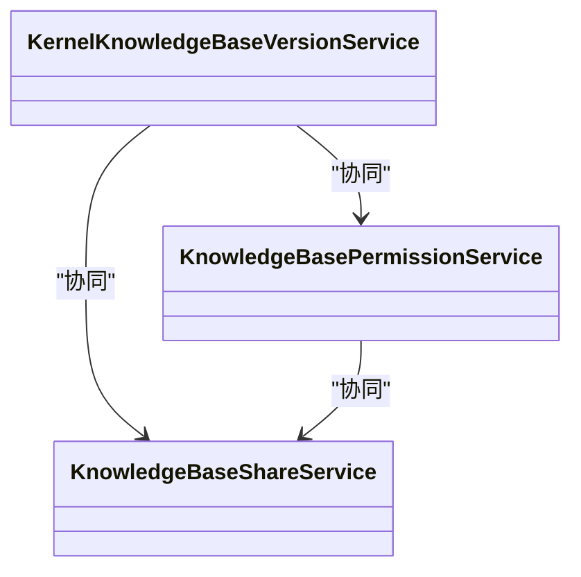

**章节来源**
- [KernelKnowledgeBaseVersionService.java:1-200](file://seahorse-agent-kernel/src/main/java/com/miracle/ai/seahorse/agent/kernel/application/knowledge/KernelKnowledgeBaseVersionService.java#L1-L200)
- [KnowledgeBasePermissionService.java:1-200](file://seahorse-agent-kernel/src/main/java/com/miracle/ai/seahorse/agent/kernel/application/knowledge/KnowledgeBasePermissionService.java#L1-L200)
- [KnowledgeBaseShareService.java:1-200](file://seahorse-agent-kernel/src/main/java/com/miracle/ai/seahorse/agent/kernel/application/knowledge/KnowledgeBaseShareService.java#L1-L200)

### 管理与审计服务
**新增** 管理与审计服务模块提供了平台的多租户管理、审计日志记录等功能，确保平台的安全性和合规性。

- KernelAdminTenantService：管理员租户管理服务，负责多租户环境下的管理员权限分配和租户管理，典型方法位于 [KernelAdminTenantService.java:1-200](file://seahorse-agent-kernel/src/main/java/com/miracle/ai/seahorse/agent/kernel/application/admin/KernelAdminTenantService.java#L1-L200)。
- KernelAuditLogService：系统审计日志服务，记录所有关键操作的审计信息，支持审计追溯和合规检查，典型方法位于 [KernelAuditLogService.java:1-200](file://seahorse-agent-kernel/src/main/java/com/miracle/ai/seahorse/agent/kernel/application/admin/KernelAuditLogService.java#L1-L200)。

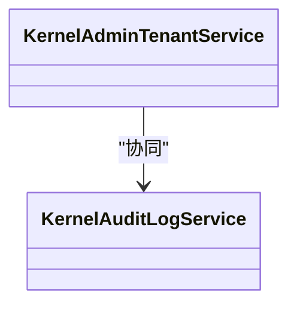

**章节来源**
- [KernelAdminTenantService.java:1-200](file://seahorse-agent-kernel/src/main/java/com/miracle/ai/seahorse/agent/kernel/application/admin/KernelAdminTenantService.java#L1-L200)
- [KernelAuditLogService.java:1-200](file://seahorse-agent-kernel/src/main/java/com/miracle/ai/seahorse/agent/kernel/application/admin/KernelAuditLogService.java#L1-L200)

### 工作流可视化服务
**新增** 工作流可视化服务模块提供了工作流的可视化展示和管理功能，帮助用户更好地理解和优化工作流程。

- 工作流可视化服务：提供工作流的图形化展示、实时监控和性能分析功能，支持拖拽式工作流编辑和动态调整。

**章节来源**
- [SeahorseAgentMarketplaceAdminAutoConfiguration.java:40-54](file://seahorse-agent-spring-boot-starter/src/main/java/com/miracle/ai/seahorse/agent/adapters/spring/SeahorseAgentMarketplaceAdminAutoConfiguration.java#L40-L54)

### 聊天服务
- KernelChatPipeline：编排聊天对话生成流程，典型方法位于 [KernelChatPipeline.java:1-200](file://seahorse-agent-kernel/src/main/java/com/miracle/ai/seahorse/agent/kernel/application/chat/KernelChatPipeline.java#L1-L200)。

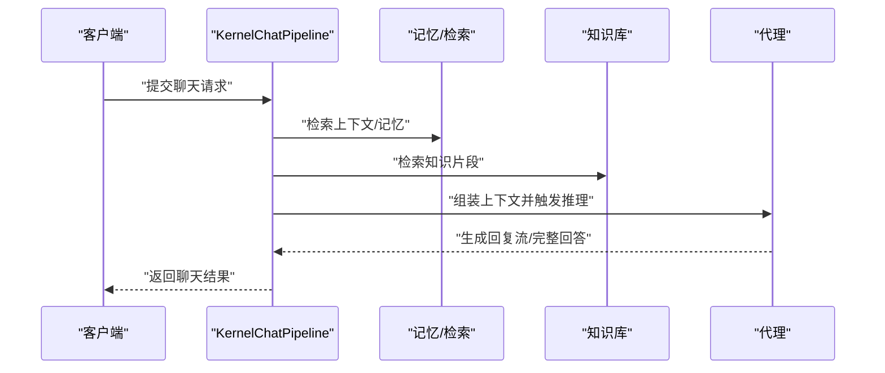

**章节来源**
- [KernelChatPipeline.java:1-200](file://seahorse-agent-kernel/src/main/java/com/miracle/ai/seahorse/agent/kernel/application/chat/KernelChatPipeline.java#L1-L200)

### 会话服务
- KernelConversationService：管理会话生命周期与消息持久化，典型方法位于 [KernelConversationService.java:1-200](file://seahorse-agent-kernel/src/main/java/com/miracle/ai/seahorse/agent/kernel/application/conversation/KernelConversationService.java#L1-L200)。

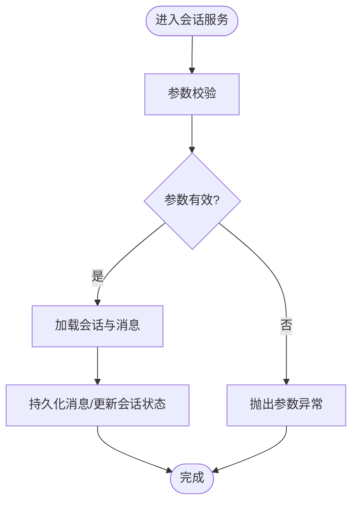

**章节来源**
- [KernelConversationService.java:1-200](file://seahorse-agent-kernel/src/main/java/com/miracle/ai/seahorse/agent/kernel/application/conversation/KernelConversationService.java#L1-L200)

### 摄取服务
- KernelIngestionEngine：统一的摄取引擎，典型方法位于 [KernelIngestionEngine.java:1-200](file://seahorse-agent-kernel/src/main/java/com/miracle/ai/seahorse/agent/kernel/application/ingestion/KernelIngestionEngine.java#L1-L200)。
- KernelIngestionPipelineService：摄取流水线编排，典型方法位于 [KernelIngestionPipelineService.java:1-200](file://seahorse-agent-kernel/src/main/java/com/miracle/ai/seahorse/agent/kernel/application/ingestion/KernelIngestionPipelineService.java#L1-L200)。
- KernelIngestionTaskService：任务调度与状态管理，典型方法位于 [KernelIngestionTaskService.java:1-200](file://seahorse-agent-kernel/src/main/java/com/miracle/ai/seahorse/agent/kernel/application/ingestion/KernelIngestionTaskService.java#L1-L200)。

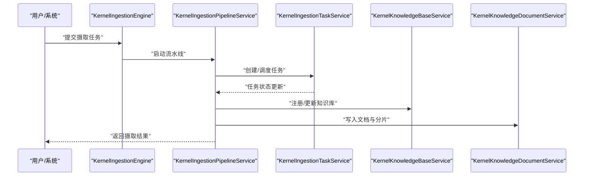

**章节来源**
- [KernelIngestionEngine.java:1-200](file://seahorse-agent-kernel/src/main/java/com/miracle/ai/seahorse/agent/kernel/application/ingestion/KernelIngestionEngine.java#L1-L200)
- [KernelIngestionPipelineService.java:1-200](file://seahorse-agent-kernel/src/main/java/com/miracle/ai/seahorse/agent/kernel/application/ingestion/KernelIngestionPipelineService.java#L1-L200)
- [KernelIngestionTaskService.java:1-200](file://seahorse-agent-kernel/src/main/java/com/miracle/ai/seahorse/agent/kernel/application/ingestion/KernelIngestionTaskService.java#L1-L200)
- [KernelKnowledgeBaseService.java:1-200](file://seahorse-agent-kernel/src/main/java/com/miracle/ai/seahorse/agent/kernel/application/knowledge/KernelKnowledgeBaseService.java#L1-L200)
- [KernelKnowledgeDocumentService.java:1-200](file://seahorse-agent-kernel/src/main/java/com/miracle/ai/seahorse/agent/kernel/application/knowledge/KernelKnowledgeDocumentService.java#L1-L200)

### 知识库服务
- KernelKnowledgeBaseService：知识库维度的查询与治理，典型方法位于 [KernelKnowledgeBaseService.java:1-200](file://seahorse-agent-kernel/src/main/java/com/miracle/ai/seahorse/agent/kernel/application/knowledge/KernelKnowledgeBaseService.java#L1-L200)。
- KernelKnowledgeDocumentService：文档级知识的增删改查与向量化，典型方法位于 [KernelKnowledgeDocumentService.java:1-200](file://seahorse-agent-kernel/src/main/java/com/miracle/ai/seahorse/agent/kernel/application/knowledge/KernelKnowledgeDocumentService.java#L1-L200)。
- KernelKnowledgeChunkService：分片维度的索引与检索，典型方法位于 [KernelKnowledgeChunkService.java:1-200](file://seahorse-agent-kernel/src/main/java/com/miracle/ai/seahorse/agent/kernel/application/knowledge/KernelKnowledgeChunkService.java#L1-L200)。
- KernelDocumentRefreshService：文档刷新调度，典型方法位于 [KernelDocumentRefreshService.java:1-200](file://seahorse-agent-kernel/src/main/java/com/miracle/ai/seahorse/agent/kernel/application/knowledge/KernelDocumentRefreshService.java#L1-L200)。

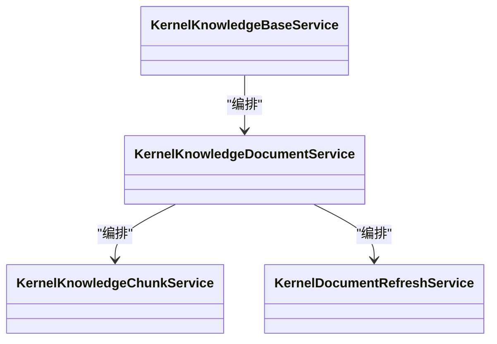

**章节来源**
- [KernelKnowledgeBaseService.java:1-200](file://seahorse-agent-kernel/src/main/java/com/miracle/ai/seahorse/agent/kernel/application/knowledge/KernelKnowledgeBaseService.java#L1-L200)
- [KernelKnowledgeDocumentService.java:1-200](file://seahorse-agent-kernel/src/main/java/com/miracle/ai/seahorse/agent/kernel/application/knowledge/KernelKnowledgeDocumentService.java#L1-L200)
- [KernelKnowledgeChunkService.java:1-200](file://seahorse-agent-kernel/src/main/java/com/miracle/ai/seahorse/agent/kernel/application/knowledge/KernelKnowledgeChunkService.java#L1-L200)
- [KernelDocumentRefreshService.java:1-200](file://seahorse-agent-kernel/src/main/java/com/miracle/ai/seahorse/agent/kernel/application/knowledge/KernelDocumentRefreshService.java#L1-L200)

### 记忆服务
- KernelMemoryEngine：记忆引擎编排，典型方法位于 [KernelMemoryEngine.java:1-200](file://seahorse-agent-kernel/src/main/java/com/miracle/ai/seahorse/agent/kernel/application/memory/KernelMemoryEngine.java#L1-L200)。
- KernelMemoryGovernanceService：记忆治理与合规，典型方法位于 [KernelMemoryGovernanceService.java:1-200](file://seahorse-agent-kernel/src/main/java/com/miracle/ai/seahorse/agent/kernel/application/memory/KernelMemoryGovernanceService.java#L1-L200)。
- KernelMemoryManagementService：记忆生命周期管理，典型方法位于 [KernelMemoryManagementService.java:1-200](file://seahorse-agent-kernel/src/main/java/com/miracle/ai/seahorse/agent/kernel/application/memory/KernelMemoryManagementService.java#L1-L200)。

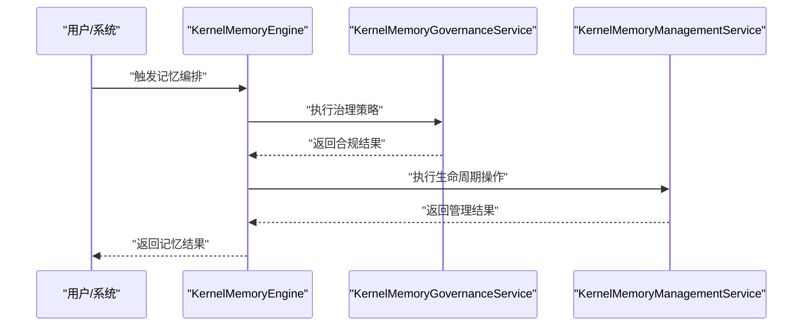

**章节来源**
- [KernelMemoryEngine.java:1-200](file://seahorse-agent-kernel/src/main/java/com/miracle/ai/seahorse/agent/kernel/application/memory/KernelMemoryEngine.java#L1-L200)
- [KernelMemoryGovernanceService.java:1-200](file://seahorse-agent-kernel/src/main/java/com/miracle/ai/seahorse/agent/kernel/application/memory/KernelMemoryGovernanceService.java#L1-L200)
- [KernelMemoryManagementService.java:1-200](file://seahorse-agent-kernel/src/main/java/com/miracle/ai/seahorse/agent/kernel/application/memory/KernelMemoryManagementService.java#L1-L200)

### 元数据服务
- KernelMetadataBackfillService：元数据回填，典型方法位于 [KernelMetadataBackfillService.java:1-200](file://seahorse-agent-kernel/src/main/java/com/miracle/ai/seahorse/agent/kernel/application/metadata/KernelMetadataBackfillService.java#L1-L200)。
- KernelMetadataDictionaryService：字典管理，典型方法位于 [KernelMetadataDictionaryService.java:1-200](file://seahorse-agent-kernel/src/main/java/com/miracle/ai/seahorse/agent/kernel/application/metadata/KernelMetadataDictionaryService.java#L1-L200)。
- KernelMetadataExtractionResultService：抽取结果管理，典型方法位于 [KernelMetadataExtractionResultService.java:1-200](file://seahorse-agent-kernel/src/main/java/com/miracle/ai/seahorse/agent/kernel/application/metadata/KernelMetadataExtractionResultService.java#L1-L200)。
- KernelMetadataQualityService：质量评估，典型方法位于 [KernelMetadataQualityService.java:1-200](file://seahorse-agent-kernel/src/main/java/com/miracle/ai/seahorse/agent/kernel/application/metadata/KernelMetadataQualityService.java#L1-L200)。
- KernelMetadataQuarantineService：隔离与复核，典型方法位于 [KernelMetadataQuarantineService.java:1-200](file://seahorse-agent-kernel/src/main/java/com/miracle/ai/seahorse/agent/kernel/application/metadata/KernelMetadataQuarantineService.java#L1-L200)。
- KernelMetadataReviewService：元数据复核决策，典型方法位于 [KernelMetadataReviewService.java:1-200](file://seahorse-agent-kernel/src/main/java/com/miracle/ai/seahorse/agent/kernel/application/metadata/KernelMetadataReviewService.java#L1-L200)。
- KernelMetadataSchemaService：模式定义与变更，典型方法位于 [KernelMetadataSchemaService.java:1-200](file://seahorse-agent-kernel/src/main/java/com/miracle/ai/seahorse/agent/kernel/application/metadata/KernelMetadataSchemaService.java#L1-L200)。
- KernelMetadataSchemaUsageService：模式使用统计与审计，典型方法位于 [KernelMetadataSchemaUsageService.java:1-200](file://seahorse-agent-kernel/src/main/java/com/miracle/ai/seahorse/agent/kernel/application/metadata/KernelMetadataSchemaUsageService.java#L1-L200)。
- KernelVersionQualityComparisonService：版本质量对比，典型方法位于 [KernelVersionQualityComparisonService.java:1-200](file://seahorse-agent-kernel/src/main/java/com/miracle/ai/seahorse/agent/kernel/application/metadata/KernelVersionQualityComparisonService.java#L1-L200)。

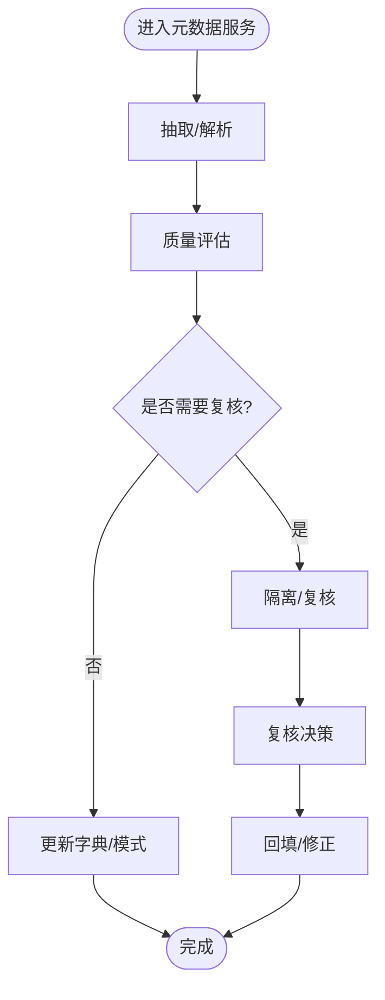

**章节来源**
- [KernelMetadataBackfillService.java:1-200](file://seahorse-agent-kernel/src/main/java/com/miracle/ai/seahorse/agent/kernel/application/metadata/KernelMetadataBackfillService.java#L1-L200)
- [KernelMetadataDictionaryService.java:1-200](file://seahorse-agent-kernel/src/main/java/com/miracle/ai/seahorse/agent/kernel/application/metadata/KernelMetadataDictionaryService.java#L1-L200)
- [KernelMetadataExtractionResultService.java:1-200](file://seahorse-agent-kernel/src/main/java/com/miracle/ai/seahorse/agent/kernel/application/metadata/KernelMetadataExtractionResultService.java#L1-L200)
- [KernelMetadataQualityService.java:1-200](file://seahorse-agent-kernel/src/main/java/com/miracle/ai/seahorse/agent/kernel/application/metadata/KernelMetadataQualityService.java#L1-L200)
- [KernelMetadataQuarantineService.java:1-200](file://seahorse-agent-kernel/src/main/java/com/miracle/ai/seahorse/agent/kernel/application/metadata/KernelMetadataQuarantineService.java#L1-L200)
- [KernelMetadataReviewService.java:1-200](file://seahorse-agent-kernel/src/main/java/com/miracle/ai/seahorse/agent/kernel/application/metadata/KernelMetadataReviewService.java#L1-L200)
- [KernelMetadataSchemaService.java:1-200](file://seahorse-agent-kernel/src/main/java/com/miracle/ai/seahorse/agent/kernel/application/metadata/KernelMetadataSchemaService.java#L1-L200)
- [KernelMetadataSchemaUsageService.java:1-200](file://seahorse-agent-kernel/src/main/java/com/miracle/ai/seahorse/agent/kernel/application/metadata/KernelMetadataSchemaUsageService.java#L1-L200)
- [KernelVersionQualityComparisonService.java:1-200](file://seahorse-agent-kernel/src/main/java/com/miracle/ai/seahorse/agent/kernel/application/metadata/KernelVersionQualityComparisonService.java#L1-L200)

### 检索服务
- KernelRetrievalEvaluationService：检索效果评估，典型方法位于 [KernelRetrievalEvaluationService.java:1-200](file://seahorse-agent-kernel/src/main/java/com/miracle/ai/seahorse/agent/kernel/application/retrieval/KernelRetrievalEvaluationService.java#L1-L200)。
- KernelRetrievalLayeredScoredMemoryVectorPort：分层打分检索端口，典型方法位于 [KernelRetrievalLayeredScoredMemoryVectorPort.java:1-200](file://seahorse-agent-kernel/src/main/java/com/miracle/ai/seahorse/agent/kernel/application/memory/retrieval/LayeredScoredMemoryVectorPort.java#L1-L200)。
- KernelRetrievalVectorSearchScoredMemoryVectorPort：向量检索端口，典型方法位于 [KernelRetrievalVectorSearchScoredMemoryVectorPort.java:1-200](file://seahorse-agent-kernel/src/main/java/com/miracle/ai/seahorse/agent/kernel/application/memory/retrieval/VectorSearchScoredMemoryVectorPort.java#L1-L200)。
- KernelRetrievalModelMemoryRecallReranker：召回重排，典型方法位于 [KernelRetrievalModelMemoryRecallReranker.java:1-200](file://seahorse-agent-kernel/src/main/java/com/miracle/ai/seahorse/agent/kernel/application/memory/retrieval/ModelMemoryRecallReranker.java#L1-L200)。
- KernelMemoryBusinessDocumentRetrieverPort：业务文档检索端口，典型方法位于 [KernelMemoryBusinessDocumentRetrieverPort.java:1-200](file://seahorse-agent-kernel/src/main/java/com/miracle/ai/seahorse/agent/ports/outbound/memory/MemoryBusinessDocumentRetrieverPort.java#L1-L200)。

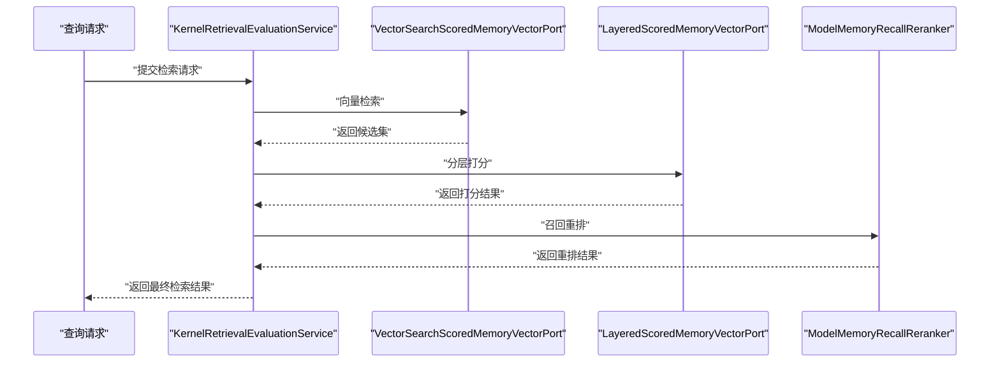

**章节来源**
- [KernelRetrievalEvaluationService.java:1-200](file://seahorse-agent-kernel/src/main/java/com/miracle/ai/seahorse/agent/kernel/application/retrieval/KernelRetrievalEvaluationService.java#L1-L200)
- [KernelRetrievalVectorSearchScoredMemoryVectorPort.java:1-200](file://seahorse-agent-kernel/src/main/java/com/miracle/ai/seahorse/agent/kernel/application/memory/retrieval/VectorSearchScoredMemoryVectorPort.java#L1-L200)
- [KernelRetrievalLayeredScoredMemoryVectorPort.java:1-200](file://seahorse-agent-kernel/src/main/java/com/miracle/ai/seahorse/agent/kernel/application/memory/retrieval/LayeredScoredMemoryVectorPort.java#L1-L200)
- [KernelRetrievalModelMemoryRecallReranker.java:1-200](file://seahorse-agent-kernel/src/main/java/com/miracle/ai/seahorse/agent/kernel/application/memory/retrieval/ModelMemoryRecallReranker.java#L1-L200)
- [KernelMemoryBusinessDocumentRetrieverPort.java:1-200](file://seahorse-agent-kernel/src/main/java/com/miracle/ai/seahorse/agent/ports/outbound/memory/MemoryBusinessDocumentRetrieverPort.java#L1-L200)

### 上下文与访问控制
- KernelAccessDecisionQueryService：访问决策查询，典型方法位于 [KernelAccessDecisionQueryService.java:1-200](file://seahorse-agent-kernel/src/main/java/com/miracle/ai/seahorse/agent/kernel/application/agent/context/KernelAccessDecisionQueryService.java#L1-L200)。
- KernelContextPackBuilderService：上下文包构建，典型方法位于 [KernelContextPackBuilderService.java:1-200](file://seahorse-agent-kernel/src/main/java/com/miracle/ai/seahorse/agent/kernel/application/agent/context/KernelContextPackBuilderService.java#L1-L200)。
- KernelContextPackQueryService：上下文包查询，典型方法位于 [KernelContextPackQueryService.java:1-200](file://seahorse-agent-kernel/src/main/java/com/miracle/ai/seahorse/agent/kernel/application/agent/context/KernelContextPackQueryService.java#L1-L200)。
- KernelResourceAclManagementService：资源ACL管理，典型方法位于 [KernelResourceAclManagementService.java:1-200](file://seahorse-agent-kernel/src/main/java/com/miracle/ai/seahorse/agent/kernel/application/agent/context/KernelResourceAclManagementService.java#L1-L200)。

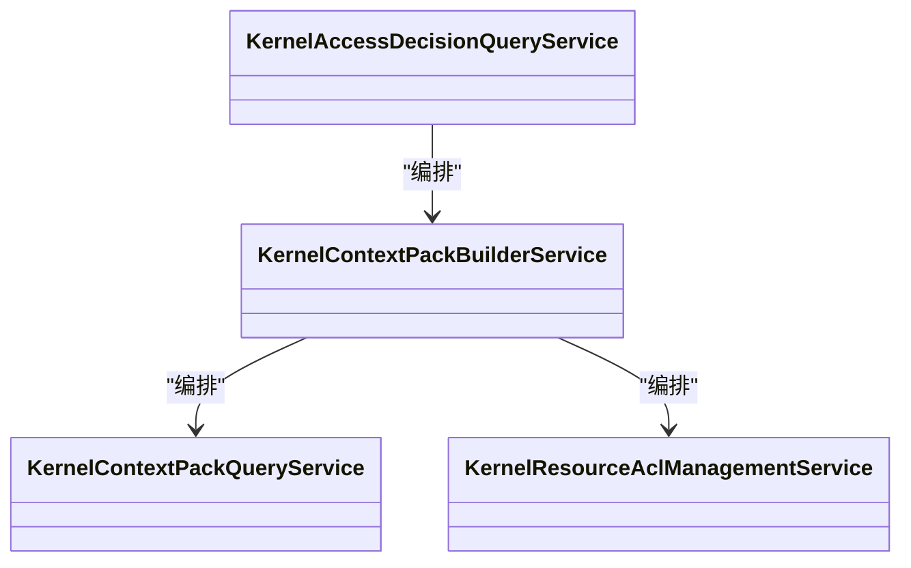

**章节来源**
- [KernelAccessDecisionQueryService.java:1-200](file://seahorse-agent-kernel/src/main/java/com/miracle/ai/seahorse/agent/kernel/application/agent/context/KernelAccessDecisionQueryService.java#L1-L200)
- [KernelContextPackBuilderService.java:1-200](file://seahorse-agent-kernel/src/main/java/com/miracle/ai/seahorse/agent/kernel/application/agent/context/KernelContextPackBuilderService.java#L1-L200)
- [KernelContextPackQueryService.java:1-200](file://seahorse-agent-kernel/src/main/java/com/miracle/ai/seahorse/agent/kernel/application/agent/context/KernelContextPackQueryService.java#L1-L200)
- [KernelResourceAclManagementService.java:1-200](file://seahorse-agent-kernel/src/main/java/com/miracle/ai/seahorse/agent/kernel/application/agent/context/KernelResourceAclManagementService.java#L1-L200)

### 其他支撑服务
- KernelIntentTreeService：意图树服务，典型方法位于 [KernelIntentTreeService.java:1-200](file://seahorse-agent-kernel/src/main/java/com/miracle/ai/seahorse/agent/kernel/application/intent/KernelIntentTreeService.java#L1-L200)。
- KernelKeywordIndexMaintenanceService：关键词索引维护，典型方法位于 [KernelKeywordIndexMaintenanceService.java:1-200](file://seahorse-agent-kernel/src/main/java/com/miracle/ai/seahorse/agent/kernel/application/keyword/KernelKeywordIndexMaintenanceService.java#L1-L200)。
- KernelDashboardService：仪表盘，典型方法位于 [KernelDashboardService.java:1-200](file://seahorse-agent-kernel/src/main/java/com/miracle/ai/seahorse/agent/kernel/application/dashboard/KernelDashboardService.java#L1-L200)。
- KernelFeedbackService：反馈处理，典型方法位于 [KernelFeedbackService.java:1-200](file://seahorse-agent-kernel/src/main/java/com/miracle/ai/seahorse/agent/kernel/application/feedback/KernelFeedbackService.java#L1-L200)。
- KernelTraceService：追踪服务，典型方法位于 [KernelTraceService.java:1-200](file://seahorse-agent-kernel/src/main/java/com/miracle/ai/seahorse/agent/kernel/application/trace/KernelTraceService.java#L1-L200)。
- KernelModelRoutingService：模型路由，典型方法位于 [KernelModelRoutingService.java:1-200](file://seahorse-agent-kernel/src/main/java/com/miracle/ai/seahorse/agent/kernel/application/model/KernelModelRoutingService.java#L1-L200)。
- KernelSampleQuestionService：样例问题，典型方法位于 [KernelSampleQuestionService.java:1-200](file://seahorse-agent-kernel/src/main/java/com/miracle/ai/seahorse/agent/kernel/application/sample/KernelSampleQuestionService.java#L1-L200)。
- KernelUserMemoryService：用户记忆，典型方法位于 [KernelUserMemoryService.java:1-200](file://seahorse-agent-kernel/src/main/java/com/miracle/ai/seahorse/agent/kernel/application/user/KernelUserMemoryService.java#L1-L200)。
- KernelMcpService：MCP服务，典型方法位于 [KernelMcpService.java:1-200](file://seahorse-agent-kernel/src/main/java/com/miracle/ai/seahorse/agent/kernel/application/mcp/KernelMcpService.java#L1-L200)。
- KernelMappingService：映射服务，典型方法位于 [KernelMappingService.java:1-200](file://seahorse-agent-kernel/src/main/java/com/miracle/ai/seahorse/agent/kernel/application/mapping/KernelMappingService.java#L1-L200)。
- KernelCredentialService：凭证服务，典型方法位于 [KernelCredentialService.java:1-200](file://seahorse-agent-kernel/src/main/java/com/miracle/ai/seahorse/agent/kernel/application/credential/KernelCredentialService.java#L1-L200)。
- KernelAgentRunStoreService：代理运行存储，典型方法位于 [KernelAgentRunStoreService.java:1-200](file://seahorse-agent-kernel/src/main/java/com/miracle/ai/seahorse/agent/kernel/application/agent/registry/KernelAgentRunStoreService.java#L1-L200)。
- KernelSandboxService：沙箱服务，典型方法位于 [KernelSandboxService.java:1-200](file://seahorse-agent-kernel/src/main/java/com/miracle/ai/seahorse/agent/kernel/application/agent/sandbox/KernelSandboxService.java#L1-L200)。
- KernelSelfHealingOutputRepairService：输出自愈修复，典型方法位于 [KernelSelfHealingOutputRepairService.java:1-200](file://seahorse-agent-kernel/src/main/java/com/miracle/ai/seahorse/agent/kernel/application/agent/output/SelfHealingOutputRepairService.java#L1-L200)。
- KernelOutputGovernanceService：输出治理，典型方法位于 [KernelOutputGovernanceService.java:1-200](file://seahorse-agent-kernel/src/main/java/com/miracle/ai/seahorse/agent/kernel/application/agent/output/OutputGovernanceService.java#L1-L200)。

**章节来源**
- [KernelIntentTreeService.java:1-200](file://seahorse-agent-kernel/src/main/java/com/miracle/ai/seahorse/agent/kernel/application/intent/KernelIntentTreeService.java#L1-L200)
- [KernelKeywordIndexMaintenanceService.java:1-200](file://seahorse-agent-kernel/src/main/java/com/miracle/ai/seahorse/agent/kernel/application/keyword/KernelKeywordIndexMaintenanceService.java#L1-L200)
- [KernelDashboardService.java:1-200](file://seahorse-agent-kernel/src/main/java/com/miracle/ai/seahorse/agent/kernel/application/dashboard/KernelDashboardService.java#L1-L200)
- [KernelFeedbackService.java:1-200](file://seahorse-agent-kernel/src/main/java/com/miracle/ai/seahorse/agent/kernel/application/feedback/KernelFeedbackService.java#L1-L200)
- [KernelTraceService.java:1-200](file://seahorse-agent-kernel/src/main/java/com/miracle/ai/seahorse/agent/kernel/application/trace/KernelTraceService.java#L1-L200)
- [KernelModelRoutingService.java:1-200](file://seahorse-agent-kernel/src/main/java/com/miracle/ai/seahorse/agent/kernel/application/model/KernelModelRoutingService.java#L1-L200)
- [KernelSampleQuestionService.java:1-200](file://seahorse-agent-kernel/src/main/java/com/miracle/ai/seahorse/agent/kernel/application/sample/KernelSampleQuestionService.java#L1-L200)
- [KernelUserMemoryService.java:1-200](file://seahorse-agent-kernel/src/main/java/com/miracle/ai/seahorse/agent/kernel/application/user/KernelUserMemoryService.java#L1-L200)
- [KernelMcpService.java:1-200](file://seahorse-agent-kernel/src/main/java/com/miracle/ai/seahorse/agent/kernel/application/mcp/KernelMcpService.java#L1-L200)
- [KernelMappingService.java:1-200](file://seahorse-agent-kernel/src/main/java/com/miracle/ai/seahorse/agent/kernel/application/mapping/KernelMappingService.java#L1-L200)
- [KernelCredentialService.java:1-200](file://seahorse-agent-kernel/src/main/java/com/miracle/ai/seahorse/agent/kernel/application/credential/KernelCredentialService.java#L1-L200)
- [KernelAgentRunStoreService.java:1-200](file://seahorse-agent-kernel/src/main/java/com/miracle/ai/seahorse/agent/kernel/application/agent/registry/KernelAgentRunStoreService.java#L1-L200)
- [KernelSandboxService.java:1-200](file://seahorse-agent-kernel/src/main/java/com/miracle/ai/seahorse/agent/kernel/application/agent/sandbox/KernelSandboxService.java#L1-L200)
- [KernelSelfHealingOutputRepairService.java:1-200](file://seahorse-agent-kernel/src/main/java/com/miracle/ai/seahorse/agent/kernel/application/agent/output/SelfHealingOutputRepairService.java#L1-L200)
- [KernelOutputGovernanceService.java:1-200](file://seahorse-agent-kernel/src/main/java/com/miracle/ai/seahorse/agent/kernel/application/agent/output/OutputGovernanceService.java#L1-L200)

## 依赖关系分析
应用服务层通过 Inbound Port 与 Outbound Port 解耦，内部依赖关系如下：

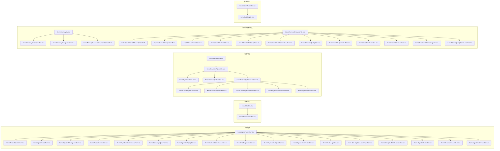

**章节来源**
- [SeahorseAgentMarketplaceAdminAutoConfiguration.java:40-99](file://seahorse-agent-spring-boot-starter/src/main/java/com/miracle/ai/seahorse/agent/adapters/spring/SeahorseAgentMarketplaceAdminAutoConfiguration.java#L40-L99)
- [KernelMemoryReviewServiceTests.java:1-25](file://seahorse-agent-tests/src/test/java/com/miracle/ai/seahorse/agent/kernel/application/memory/KernelMemoryReviewServiceTests.java#L1-L25)

## 性能考量
- 端口契约与无侵入扩展：应用服务通过 Outbound Port 与基础设施解耦，便于替换实现（如向量库、缓存、消息队列），提升整体性能弹性与可维护性。
- 批处理与异步：摄取与检索场景建议采用批处理与异步队列，降低端到端延迟，提高吞吐。
- 缓存策略：结合本地缓存与分布式缓存，对热点查询与上下文进行缓存，减少重复计算与IO。
- 向量化与索引：合理设置向量维度、索引类型与重排策略，平衡召回率与延迟。
- 事务一致性：通过端口契约与运行时模式保障跨服务事务一致性，避免脏读与不一致。
- **新增** 版本管理性能：知识库版本管理涉及大量数据迁移和索引重建，需要考虑版本切换的性能影响和回滚机制。
- **新增** 权限控制性能：权限检查可能成为高频操作的瓶颈，需要建立高效的权限缓存和批量检查机制。

## 故障排查指南
- 参数校验失败：检查请求参数合法性与必填字段，参考对应服务的参数校验逻辑位置。
- 端口实现缺失：确认 Outbound Port 的适配器已正确注册与启用，参考自动配置测试用例。
- 记忆/检索异常：优先检查向量端口与检索端口的实现，关注打分与重排链路。
- 摄取任务卡住：核查任务调度与状态机，确认消息队列与数据库事务一致性。
- 权限与ACL：核对访问决策与资源ACL策略，确保上下文构建与检索的权限链路正确。
- **新增** 知识库版本冲突：检查版本切换过程中的数据一致性，确认索引重建和缓存清理。
- **新增** 代理市场审核：验证代理发布审核流程，检查订阅管理和评分功能的正常运行。
- **新增** 审计日志异常：确认审计事件的捕获和存储，检查审计数据的完整性和可追溯性。

**章节来源**
- [KernelMemoryReviewServiceTests.java:1-25](file://seahorse-agent-tests/src/test/java/com/miracle/ai/seahorse/agent/kernel/application/memory/KernelMemoryReviewServiceTests.java#L1-L25)
- [SeahorseAgentKernelAutoConfigurationTests.java:53-66](file://seahorse-agent-tests/src/test/java/com/miracle/ai/seahorse/agent/adapters/spring/SeahorseAgentKernelAutoConfigurationTests.java#L53-L66)

## 结论
应用服务层以"业务用例编排器"为核心，围绕代理、聊天、会话、摄取、知识库、记忆、元数据、检索等子域，通过 Inbound Port 与 Outbound Port 明确职责边界，协调领域模型与基础设施，确保业务规则的一致性与完整性。借助端口契约与运行时模式，应用服务层具备良好的可扩展性与可维护性，能够支撑复杂AI基础设施的演进需求。

**更新** 新增的知识库增强服务、代理市场服务、管理员服务等模块进一步完善了平台的治理能力和生态建设，为用户提供更丰富的功能和服务。这些新增模块通过Spring Boot自动配置机制进行智能注册，支持按需启用和灵活扩展。

## 附录
- 术语说明
  - Inbound Port：对外暴露的业务用例接口，由应用服务实现。
  - Outbound Port：面向基础设施的抽象接口，由适配器实现。
  - 端口契约：定义输入输出与行为规范，保证编排一致性。
  - **新增** 知识库版本管理：通过版本控制机制管理知识库的演进和变更历史。
  - **新增** 代理市场：提供代理发布的审核、订阅和评分功能，构建代理生态。
  - **新增** 多租户管理：支持多租户环境下的权限隔离和资源管理。
  - **新增** 审计日志：记录系统关键操作的审计信息，确保合规性和可追溯性。
- 参考测试
  - 自动配置测试：验证应用服务与端口绑定关系。
  - 记忆复核测试：验证记忆治理流程与决策链路。
  - **新增** 市场与管理模块测试：验证知识库增强、代理市场和管理员功能的正确性。