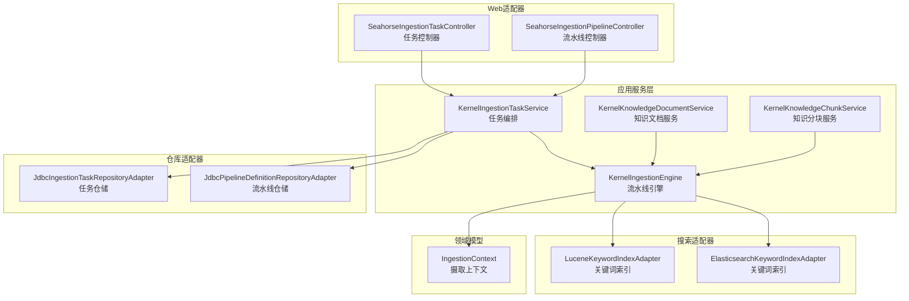
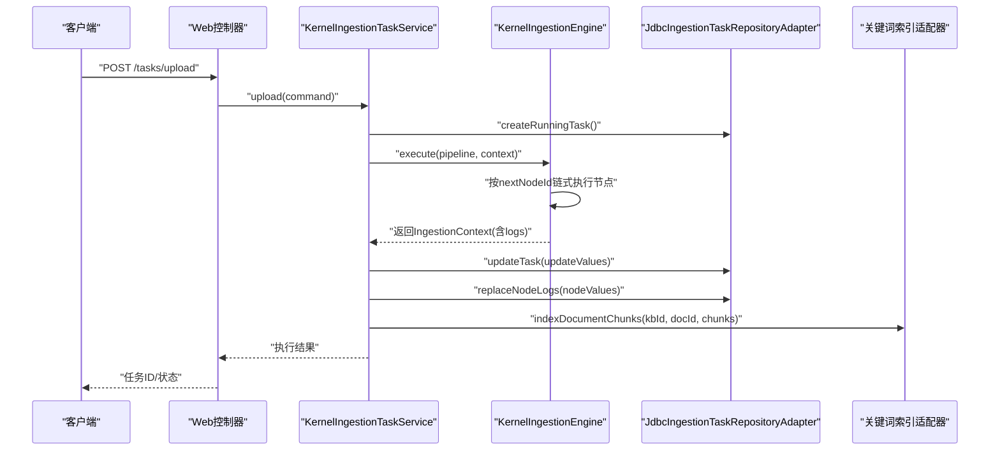
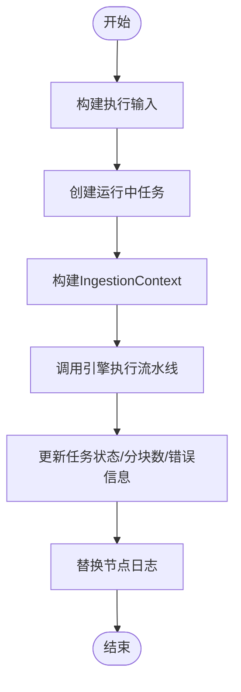
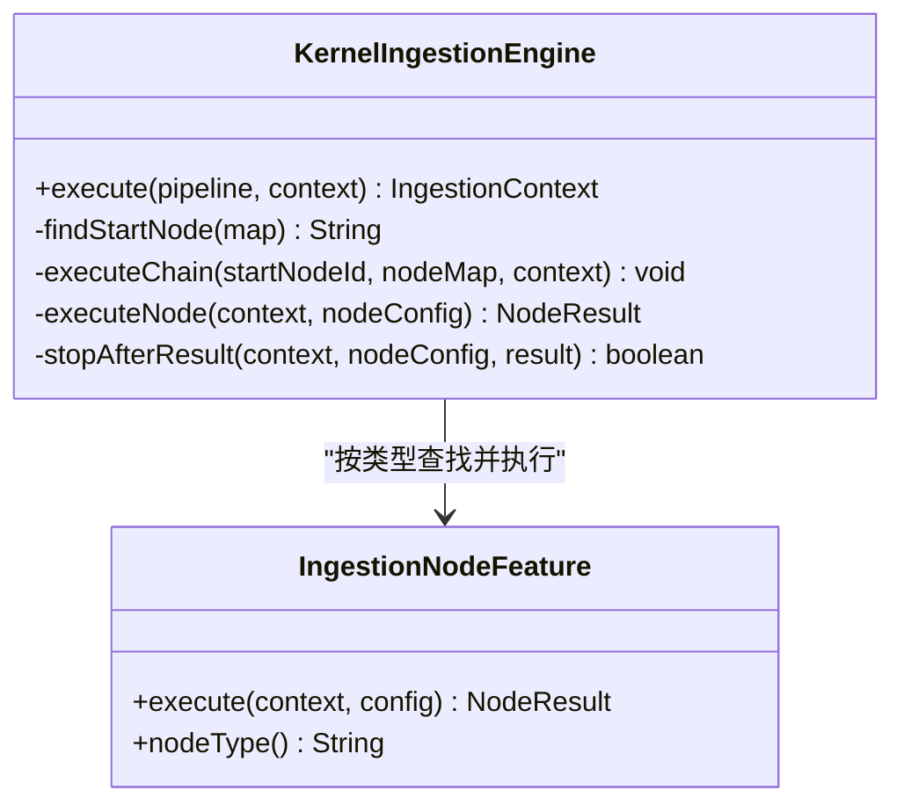
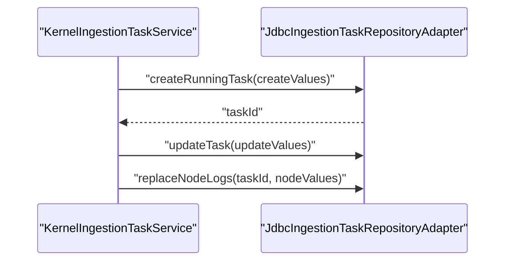
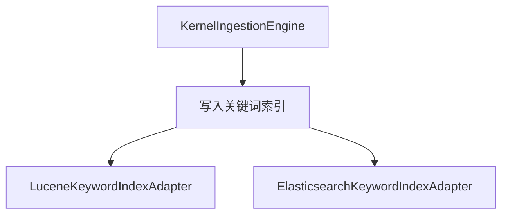
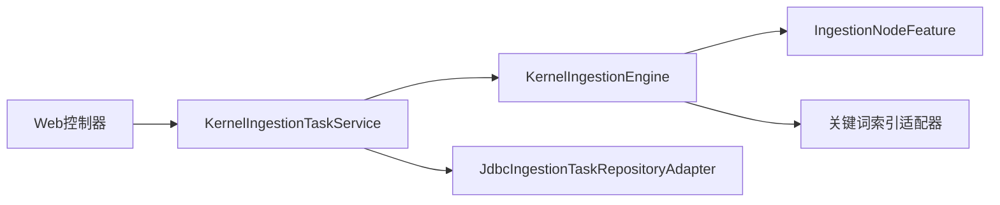
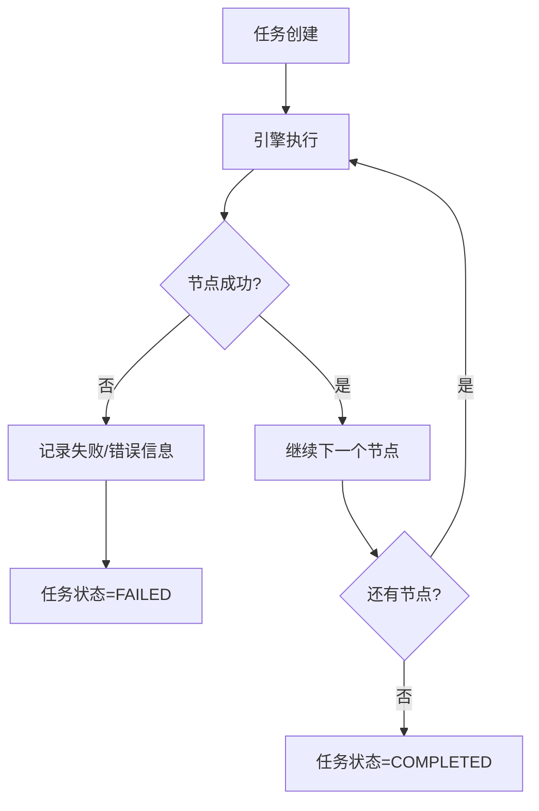

# 摄取应用服务

<cite>
**本文档引用的文件**
- [KernelIngestionTaskService.java](file://seahorse-agent-kernel/src/main/java/com/miracle/ai/seahorse/agent/kernel/application/ingestion/KernelIngestionTaskService.java)
- [KernelIngestionEngine.java](file://seahorse-agent-kernel/src/main/java/com/miracle/ai/seahorse/agent/kernel/application/ingestion/KernelIngestionEngine.java)
- [IngestionContext.java](file://seahorse-agent-kernel/src/main/java/com/miracle/ai/seahorse/agent/kernel/domain/ingestion/IngestionContext.java)
- [KernelIngestionTaskService.java](file://seahorse-agent-kernel/src/main/java/com/miracle/ai/seahorse/agent/kernel/application/ingestion/KernelIngestionTaskService.java)
- [KernelKnowledgeDocumentService.java](file://seahorse-agent-kernel/src/main/java/com/miracle/ai/seahorse/agent/kernel/application/knowledge/KernelKnowledgeDocumentService.java)
- [KernelKnowledgeChunkService.java](file://seahorse-agent-kernel/src/main/java/com/miracle/ai/seahorse/agent/kernel/application/knowledge/KernelKnowledgeChunkService.java)
- [JdbcIngestionTaskRepositoryAdapter.java](file://seahorse-agent-adapter-repository-jdbc/src/main/java/com/miracle/ai/seahorse/agent/adapters/repository/jdbc/JdbcIngestionTaskRepositoryAdapter.java)
- [JdbcPipelineDefinitionRepositoryAdapter.java](file://seahorse-agent-adapter-repository-jdbc/src/main/java/com/miracle/ai/seahorse/agent/adapters/repository/jdbc/JdbcPipelineDefinitionRepositoryAdapter.java)
- [SeahorseIngestionTaskController.java](file://seahorse-agent-adapter-web/src/main/java/com/miracle/ai/seahorse/agent/adapters/web/SeahorseIngestionTaskController.java)
- [SeahorseIngestionPipelineController.java](file://seahorse-agent-adapter-web/src/main/java/com/miracle/ai/seahorse/agent/adapters/web/SeahorseIngestionPipelineController.java)
- [IngestionDocumentSourceRequest.java](file://seahorse-agent-adapter-web/src/main/java/com/miracle/ai/seahorse/agent/adapters/web/IngestionDocumentSourceRequest.java)
- [IngestionTaskRequest.java](file://seahorse-agent-adapter-web/src/main/java/com/miracle/ai/seahorse/agent/adapters/web/IngestionTaskRequest.java)
- [IngestionPipelineRequest.java](file://seahorse-agent-adapter-web/src/main/java/com/miracle/ai/seahorse/agent/adapters/web/IngestionPipelineRequest.java)
- [IngestionPipelineNodeRequest.java](file://seahorse-agent-adapter-web/src/main/java/com/miracle/ai/seahorse/agent/adapters/web/IngestionPipelineNodeRequest.java)
- [LocalIngestionNodeLogAdapter.java](file://seahorse-agent-adapter-web/src/main/java/com/miracle/ai/seahorse/agent/adapters/local/LocalIngestionNodeLogAdapter.java)
- [KernelMetadataBackfillService.java](file://seahorse-agent-kernel/src/main/java/com/miracle/ai/seahorse/agent/kernel/application/metadata/KernelMetadataBackfillService.java)
- [LuceneKeywordIndexAdapter.java](file://seahorse-agent-adapter-search-lucene/src/main/java/com/miracle/ai/seahorse/agent/adapters/search/lucene/LuceneKeywordIndexAdapter.java)
- [ElasticsearchKeywordIndexAdapter.java](file://seahorse-agent-adapter-search-elasticsearch/src/main/java/com/miracle/ai/seahorse/agent/adapters/search/elasticsearch/ElasticsearchKeywordIndexAdapter.java)
- [pdf-ingestion-example.md](file://docs/examples/pdf-ingestion-example.md)
- [pdf-pipeline-request.json](file://docs/examples/pdf-pipeline-request.json)
- [文档处理应用服务.md](file://docs/zh/content/后端系统/核心内核/应用服务层/文档处理应用服务.md)
- [追踪与摄取相关表.md](file://docs/zh/content/数据库设计/表结构设计/追踪与摄取相关表.md)
</cite>

## 目录
1. [简介](#简介)
2. [项目结构](#项目结构)
3. [核心组件](#核心组件)
4. [架构总览](#架构总览)
5. [详细组件分析](#详细组件分析)
6. [依赖关系分析](#依赖关系分析)
7. [性能考虑](#性能考虑)
8. [故障排查指南](#故障排查指南)
9. [结论](#结论)
10. [附录](#附录)

## 简介
本文件系统性阐述摄取应用服务的设计与实现，聚焦文档摄取系统的应用服务层，覆盖摄取引擎、摄取管道、摄取任务等核心能力。文档详细说明了从文档上传、解析、分块、向量化、索引的完整流程，以及与存储系统、解析器、向量库的协作方式。同时提供管道定义、任务调度、进度跟踪、错误处理等业务流程的实现要点与可视化图示，帮助读者快速理解并落地生产环境。

## 项目结构
摄取应用服务位于内核模块的应用层，围绕任务服务、引擎与节点特征协作展开，并通过适配器连接存储、搜索与Web接口。关键目录与文件如下：
- 应用服务层：KernelIngestionTaskService（任务编排）、KernelIngestionEngine（流水线执行）
- 领域模型：IngestionContext（上下文）
- Web适配器：SeahorseIngestionTaskController、SeahorseIngestionPipelineController
- JDBC仓库适配器：JdbcIngestionTaskRepositoryAdapter、JdbcPipelineDefinitionRepositoryAdapter
- 搜索适配器：LuceneKeywordIndexAdapter、ElasticsearchKeywordIndexAdapter
- 示例与文档：pdf-ingestion-example.md、pdf-pipeline-request.json、文档处理应用服务.md、追踪与摄取相关表.md

**图表来源**
- [KernelIngestionTaskService.java:53-77](file://seahorse-agent-kernel/src/main/java/com/miracle/ai/seahorse/agent/kernel/application/ingestion/KernelIngestionTaskService.java#L53-L77)
- [KernelIngestionEngine.java:46-70](file://seahorse-agent-kernel/src/main/java/com/miracle/ai/seahorse/agent/kernel/application/ingestion/KernelIngestionEngine.java#L46-L70)
- [IngestionContext.java:35-62](file://seahorse-agent-kernel/src/main/java/com/miracle/ai/seahorse/agent/kernel/domain/ingestion/IngestionContext.java#L35-L62)
- [SeahorseIngestionTaskController.java](file://seahorse-agent-adapter-web/src/main/java/com/miracle/ai/seahorse/agent/adapters/web/SeahorseIngestionTaskController.java)
- [SeahorseIngestionPipelineController.java](file://seahorse-agent-adapter-web/src/main/java/com/miracle/ai/seahorse/agent/adapters/web/SeahorseIngestionPipelineController.java)
- [JdbcIngestionTaskRepositoryAdapter.java:55-80](file://seahorse-agent-adapter-repository-jdbc/src/main/java/com/miracle/ai/seahorse/agent/adapters/repository/jdbc/JdbcIngestionTaskRepositoryAdapter.java#L55-L80)
- [JdbcPipelineDefinitionRepositoryAdapter.java](file://seahorse-agent-adapter-repository-jdbc/src/main/java/com/miracle/ai/seahorse/agent/adapters/repository/jdbc/JdbcPipelineDefinitionRepositoryAdapter.java)
- [LuceneKeywordIndexAdapter.java:58-84](file://seahorse-agent-adapter-search-lucene/src/main/java/com/miracle/ai/seahorse/agent/adapters/search/lucene/LuceneKeywordIndexAdapter.java#L58-L84)
- [ElasticsearchKeywordIndexAdapter.java:83-112](file://seahorse-agent-adapter-search-elasticsearch/src/main/java/com/miracle/ai/seahorse/agent/adapters/search/elasticsearch/ElasticsearchKeywordIndexAdapter.java#L83-L112)

**章节来源**
- [KernelIngestionTaskService.java:53-77](file://seahorse-agent-kernel/src/main/java/com/miracle/ai/seahorse/agent/kernel/application/ingestion/KernelIngestionTaskService.java#L53-L77)
- [KernelIngestionEngine.java:46-70](file://seahorse-agent-kernel/src/main/java/com/miracle/ai/seahorse/agent/kernel/application/ingestion/KernelIngestionEngine.java#L46-L70)
- [IngestionContext.java:35-62](file://seahorse-agent-kernel/src/main/java/com/miracle/ai/seahorse/agent/kernel/domain/ingestion/IngestionContext.java#L35-L62)

## 核心组件
- KernelIngestionTaskService：负责任务创建、执行、状态更新与节点日志持久化，协调引擎与仓储。
- KernelIngestionEngine：负责流水线的起始节点识别、链式执行、条件判断、异常处理与日志记录。
- IngestionContext：承载任务执行过程中的原始字节、解析文本、分块、元数据、向量等状态。
- Web控制器：SeahorseIngestionTaskController、SeahorseIngestionPipelineController，提供REST接口。
- 仓储适配器：JdbcIngestionTaskRepositoryAdapter、JdbcPipelineDefinitionRepositoryAdapter，提供任务与流水线的CRUD。
- 搜索适配器：LuceneKeywordIndexAdapter、ElasticsearchKeywordIndexAdapter，提供关键词索引写入。
- 知识文档/分块服务：KernelKnowledgeDocumentService、KernelKnowledgeChunkService，提供文档级与分块级索引能力。

**章节来源**
- [KernelIngestionTaskService.java:53-77](file://seahorse-agent-kernel/src/main/java/com/miracle/ai/seahorse/agent/kernel/application/ingestion/KernelIngestionTaskService.java#L53-L77)
- [KernelIngestionEngine.java:79-90](file://seahorse-agent-kernel/src/main/java/com/miracle/ai/seahorse/agent/kernel/application/ingestion/KernelIngestionEngine.java#L79-L90)
- [IngestionContext.java:35-62](file://seahorse-agent-kernel/src/main/java/com/miracle/ai/seahorse/agent/kernel/domain/ingestion/IngestionContext.java#L35-L62)

## 架构总览
摄取应用服务采用“任务服务 + 引擎 + 节点特征”的分层设计。Web控制器接收请求，任务服务构建上下文并调用引擎执行流水线，引擎按节点类型查找对应特征执行，期间通过条件端口与日志端口进行可观测性记录，最终由仓储适配器持久化任务与节点日志，同时向关键词索引与向量库写入数据。

**图表来源**
- [KernelIngestionTaskService.java:128-138](file://seahorse-agent-kernel/src/main/java/com/miracle/ai/seahorse/agent/kernel/application/ingestion/KernelIngestionTaskService.java#L128-L138)
- [KernelIngestionEngine.java:79-90](file://seahorse-agent-kernel/src/main/java/com/miracle/ai/seahorse/agent/kernel/application/ingestion/KernelIngestionEngine.java#L79-L90)
- [JdbcIngestionTaskRepositoryAdapter.java:55-80](file://seahorse-agent-adapter-repository-jdbc/src/main/java/com/miracle/ai/seahorse/agent/adapters/repository/jdbc/JdbcIngestionTaskRepositoryAdapter.java#L55-L80)
- [LuceneKeywordIndexAdapter.java:78-84](file://seahorse-agent-adapter-search-lucene/src/main/java/com/miracle/ai/seahorse/agent/adapters/search/lucene/LuceneKeywordIndexAdapter.java#L78-L84)

**章节来源**
- [KernelIngestionTaskService.java:128-138](file://seahorse-agent-kernel/src/main/java/com/miracle/ai/seahorse/agent/kernel/application/ingestion/KernelIngestionTaskService.java#L128-L138)
- [KernelIngestionEngine.java:79-90](file://seahorse-agent-kernel/src/main/java/com/miracle/ai/seahorse/agent/kernel/application/ingestion/KernelIngestionEngine.java#L79-L90)

## 详细组件分析

### 组件A：KernelIngestionTaskService（任务服务）
职责与流程：
- 接收任务创建/上传命令，构建执行输入（包含来源、内容、元数据、向量空间ID）。
- 创建运行中任务记录，构建IngestionContext，调用引擎执行流水线。
- 将执行结果转换为任务更新值，持久化任务状态、分块数量、错误信息与节点日志。
- 支持按任务ID查询、列出节点、分页查询任务。

关键实现要点：
- 任务创建与更新：通过JdbcIngestionTaskRepositoryAdapter持久化任务与节点日志。
- 上下文构建：将来源元数据、文件名、MIME类型、向量空间ID注入上下文。
- 状态映射：根据上下文状态与节点日志生成任务状态与节点状态。
- 节点顺序映射：基于nextNodeId计算节点执行顺序，用于前端展示。

**图表来源**
- [KernelIngestionTaskService.java:128-138](file://seahorse-agent-kernel/src/main/java/com/miracle/ai/seahorse/agent/kernel/application/ingestion/KernelIngestionTaskService.java#L128-L138)
- [KernelIngestionTaskService.java:183-191](file://seahorse-agent-kernel/src/main/java/com/miracle/ai/seahorse/agent/kernel/application/ingestion/KernelIngestionTaskService.java#L183-L191)
- [KernelIngestionTaskService.java:202-228](file://seahorse-agent-kernel/src/main/java/com/miracle/ai/seahorse/agent/kernel/application/ingestion/KernelIngestionTaskService.java#L202-L228)

**章节来源**
- [KernelIngestionTaskService.java:79-126](file://seahorse-agent-kernel/src/main/java/com/miracle/ai/seahorse/agent/kernel/application/ingestion/KernelIngestionTaskService.java#L79-L126)
- [KernelIngestionTaskService.java:128-138](file://seahorse-agent-kernel/src/main/java/com/miracle/ai/seahorse/agent/kernel/application/ingestion/KernelIngestionTaskService.java#L128-L138)
- [KernelIngestionTaskService.java:183-228](file://seahorse-agent-kernel/src/main/java/com/miracle/ai/seahorse/agent/kernel/application/ingestion/KernelIngestionTaskService.java#L183-L228)

### 组件B：KernelIngestionEngine（摄取引擎）
职责与流程：
- 校验流水线节点配置，识别起始节点（无入边的节点），按nextNodeId链式执行。
- 对每个节点调用IngestionNodeFeature.execute，支持条件端口控制是否执行。
- 记录节点日志（含耗时、消息、输出、错误），遇到失败立即中断。
- 若未显式失败则标记为完成。

关键实现要点：
- 节点查找：通过扩展注册表按节点类型查找激活的节点特征。
- 条件执行：通过IngestionConditionPort决定节点是否执行。
- 日志记录：通过IngestionNodeLogPort记录节点执行结果与耗时。

**图表来源**
- [KernelIngestionEngine.java:79-90](file://seahorse-agent-kernel/src/main/java/com/miracle/ai/seahorse/agent/kernel/application/ingestion/KernelIngestionEngine.java#L79-L90)
- [KernelIngestionEngine.java:146-164](file://seahorse-agent-kernel/src/main/java/com/miracle/ai/seahorse/agent/kernel/application/ingestion/KernelIngestionEngine.java#L146-L164)
- [KernelIngestionEngine.java:166-172](file://seahorse-agent-kernel/src/main/java/com/miracle/ai/seahorse/agent/kernel/application/ingestion/KernelIngestionEngine.java#L166-L172)

**章节来源**
- [KernelIngestionEngine.java:79-90](file://seahorse-agent-kernel/src/main/java/com/miracle/ai/seahorse/agent/kernel/application/ingestion/KernelIngestionEngine.java#L79-L90)
- [KernelIngestionEngine.java:126-144](file://seahorse-agent-kernel/src/main/java/com/miracle/ai/seahorse/agent/kernel/application/ingestion/KernelIngestionEngine.java#L126-L144)
- [KernelIngestionEngine.java:146-164](file://seahorse-agent-kernel/src/main/java/com/miracle/ai/seahorse/agent/kernel/application/ingestion/KernelIngestionEngine.java#L146-L164)

### 组件C：IngestionContext（摄取上下文）
作用：
- 作为流水线执行过程中的共享状态载体，包含原始字节、解析文本、分块、增强文本、关键词、问题、元数据、验证结果、向量空间ID、状态、日志、错误等。

关键字段说明：
- taskId/pipelineId：任务与流水线标识
- source/rawBytes/mimeType：来源与原始字节及MIME类型
- rawText/document：解析后的文本与文档对象
- chunks：分块列表（含内容、索引、嵌入向量）
- enhancedText/keywords/questions：增强文本与关键词/问题
- metadata/metadataSchema/metadataValidationResult：元数据、模式与验证结果
- vectorSpaceId/status/logs/error/skipIndexerWrite：向量空间ID、状态、日志、错误与跳过写入标志

**章节来源**
- [IngestionContext.java:35-62](file://seahorse-agent-kernel/src/main/java/com/miracle/ai/seahorse/agent/kernel/domain/ingestion/IngestionContext.java#L35-L62)

### 组件D：Web控制器与请求模型
- SeahorseIngestionTaskController：提供任务创建/上传、查询任务、查询节点详情、分页查询等接口。
- SeahorseIngestionPipelineController：提供流水线创建、查询、分页查询等接口。
- 请求模型：IngestionTaskRequest、IngestionDocumentSourceRequest、IngestionPipelineRequest、IngestionPipelineNodeRequest。

这些控制器将HTTP请求转换为内部命令，交由任务服务处理。

**章节来源**
- [SeahorseIngestionTaskController.java](file://seahorse-agent-adapter-web/src/main/java/com/miracle/ai/seahorse/agent/adapters/web/SeahorseIngestionTaskController.java)
- [SeahorseIngestionPipelineController.java](file://seahorse-agent-adapter-web/src/main/java/com/miracle/ai/seahorse/agent/adapters/web/SeahorseIngestionPipelineController.java)
- [IngestionTaskRequest.java](file://seahorse-agent-adapter-web/src/main/java/com/miracle/ai/seahorse/agent/adapters/web/IngestionTaskRequest.java)
- [IngestionDocumentSourceRequest.java](file://seahorse-agent-adapter-web/src/main/java/com/miracle/ai/seahorse/agent/adapters/web/IngestionDocumentSourceRequest.java)
- [IngestionPipelineRequest.java](file://seahorse-agent-adapter-web/src/main/java/com/miracle/ai/seahorse/agent/adapters/web/IngestionPipelineRequest.java)
- [IngestionPipelineNodeRequest.java](file://seahorse-agent-adapter-web/src/main/java/com/miracle/ai/seahorse/agent/adapters/web/IngestionPipelineNodeRequest.java)

### 组件E：任务与流水线仓储
- JdbcIngestionTaskRepositoryAdapter：提供任务创建、更新、分页查询、节点日志替换等能力，支持JSONB字段存储日志与元数据。
- JdbcPipelineDefinitionRepositoryAdapter：提供流水线定义的CRUD能力。

**图表来源**
- [JdbcIngestionTaskRepositoryAdapter.java:55-80](file://seahorse-agent-adapter-repository-jdbc/src/main/java/com/miracle/ai/seahorse/agent/adapters/repository/jdbc/JdbcIngestionTaskRepositoryAdapter.java#L55-L80)

**章节来源**
- [JdbcIngestionTaskRepositoryAdapter.java:55-80](file://seahorse-agent-adapter-repository-jdbc/src/main/java/com/miracle/ai/seahorse/agent/adapters/repository/jdbc/JdbcIngestionTaskRepositoryAdapter.java#L55-L80)
- [JdbcPipelineDefinitionRepositoryAdapter.java](file://seahorse-agent-adapter-repository-jdbc/src/main/java/com/miracle/ai/seahorse/agent/adapters/repository/jdbc/JdbcPipelineDefinitionRepositoryAdapter.java)

### 组件F：关键词索引适配器
- LuceneKeywordIndexAdapter：基于本地文件系统的关键词索引写入，支持文档级重建与批量写入。
- ElasticsearchKeywordIndexAdapter：基于Elasticsearch的关键词索引写入，支持批量索引与删除。

**图表来源**
- [LuceneKeywordIndexAdapter.java:78-84](file://seahorse-agent-adapter-search-lucene/src/main/java/com/miracle/ai/seahorse/agent/adapters/search/lucene/LuceneKeywordIndexAdapter.java#L78-L84)
- [ElasticsearchKeywordIndexAdapter.java:83-112](file://seahorse-agent-adapter-search-elasticsearch/src/main/java/com/miracle/ai/seahorse/agent/adapters/search/elasticsearch/ElasticsearchKeywordIndexAdapter.java#L83-L112)

**章节来源**
- [LuceneKeywordIndexAdapter.java:58-84](file://seahorse-agent-adapter-search-lucene/src/main/java/com/miracle/ai/seahorse/agent/adapters/search/lucene/LuceneKeywordIndexAdapter.java#L58-L84)
- [ElasticsearchKeywordIndexAdapter.java:83-112](file://seahorse-agent-adapter-search-elasticsearch/src/main/java/com/miracle/ai/seahorse/agent/adapters/search/elasticsearch/ElasticsearchKeywordIndexAdapter.java#L83-L112)

### 组件G：知识文档与分块服务
- KernelKnowledgeDocumentService：封装文档级摄取流程，支持从对象存储读取文件、执行流水线、删除索引与文件、查询分块日志等。
- KernelKnowledgeChunkService：提供分块级向量化与索引写入能力，支持启用/禁用、嵌入向量化与批量写入。

**章节来源**
- [KernelKnowledgeDocumentService.java:218-234](file://seahorse-agent-kernel/src/main/java/com/miracle/ai/seahorse/agent/kernel/application/knowledge/KernelKnowledgeDocumentService.java#L218-L234)
- [KernelKnowledgeChunkService.java:189-226](file://seahorse-agent-kernel/src/main/java/com/miracle/ai/seahorse/agent/kernel/application/knowledge/KernelKnowledgeChunkService.java#L189-L226)

## 依赖关系分析
- 控制器依赖任务服务；任务服务依赖引擎与仓储；引擎依赖节点特征与条件/日志端口；仓储依赖数据库；搜索适配器依赖外部搜索引擎。
- 任务服务与引擎之间通过IngestionContext传递状态，保证跨节点的数据一致性。
- 任务服务与仓储之间通过任务记录与节点日志进行持久化，支持任务生命周期管理与回溯。

**图表来源**
- [KernelIngestionTaskService.java:66-77](file://seahorse-agent-kernel/src/main/java/com/miracle/ai/seahorse/agent/kernel/application/ingestion/KernelIngestionTaskService.java#L66-L77)
- [KernelIngestionEngine.java:50-70](file://seahorse-agent-kernel/src/main/java/com/miracle/ai/seahorse/agent/kernel/application/ingestion/KernelIngestionEngine.java#L50-L70)
- [JdbcIngestionTaskRepositoryAdapter.java:55-80](file://seahorse-agent-adapter-repository-jdbc/src/main/java/com/miracle/ai/seahorse/agent/adapters/repository/jdbc/JdbcIngestionTaskRepositoryAdapter.java#L55-L80)

**章节来源**
- [KernelIngestionTaskService.java:66-77](file://seahorse-agent-kernel/src/main/java/com/miracle/ai/seahorse/agent/kernel/application/ingestion/KernelIngestionTaskService.java#L66-L77)
- [KernelIngestionEngine.java:50-70](file://seahorse-agent-kernel/src/main/java/com/miracle/ai/seahorse/agent/kernel/application/ingestion/KernelIngestionEngine.java#L50-L70)

## 性能考虑
- 流水线链式执行：通过nextNodeId串联节点，避免复杂分支，降低调度开销。
- 条件端口：在节点执行前进行条件判断，减少无效执行，提升吞吐。
- 日志与可观测性：节点执行耗时与结果记录，便于定位瓶颈与失败原因。
- 关键词索引批处理：关键词索引适配器支持批量写入，减少I/O次数。
- 向量索引与关键词索引并行：系统在同一流程中同时写入向量与关键词索引，确保检索质量与速度平衡。

[本节为通用指导，无需特定文件引用]

## 故障排查指南
常见问题与处理：
- 循环依赖：流水线存在环时，引擎抛出异常并中断执行。检查节点连线，确保无环。
- 引用不存在的节点：nextNodeId指向不存在的节点ID时，抛出“找不到下一个节点”异常。修正节点ID。
- 无起始节点：所有节点均被其他节点引用时，无法识别起始节点。至少一个节点应无入边。
- 节点执行失败：任一节点返回失败或抛出异常，引擎将失败状态写入上下文并中断后续节点。
- 任务状态不一致：通过任务查询与节点日志回溯，确认具体失败节点与错误信息。

**图表来源**
- [KernelIngestionEngine.java:174-186](file://seahorse-agent-kernel/src/main/java/com/miracle/ai/seahorse/agent/kernel/application/ingestion/KernelIngestionEngine.java#L174-L186)
- [KernelIngestionTaskService.java:140-148](file://seahorse-agent-kernel/src/main/java/com/miracle/ai/seahorse/agent/kernel/application/ingestion/KernelIngestionTaskService.java#L140-L148)

**章节来源**
- [KernelIngestionEngine.java:105-113](file://seahorse-agent-kernel/src/main/java/com/miracle/ai/seahorse/agent/kernel/application/ingestion/KernelIngestionEngine.java#L105-L113)
- [KernelIngestionEngine.java:126-144](file://seahorse-agent-kernel/src/main/java/com/miracle/ai/seahorse/agent/kernel/application/ingestion/KernelIngestionEngine.java#L126-L144)
- [KernelIngestionEngine.java:174-186](file://seahorse-agent-kernel/src/main/java/com/miracle/ai/seahorse/agent/kernel/application/ingestion/KernelIngestionEngine.java#L174-L186)
- [KernelIngestionTaskService.java:140-148](file://seahorse-agent-kernel/src/main/java/com/miracle/ai/seahorse/agent/kernel/application/ingestion/KernelIngestionTaskService.java#L140-L148)

## 结论
摄取应用服务通过任务服务、引擎与节点特征的清晰分层，实现了从文档上传到索引完成的完整闭环。借助条件端口与日志端口，系统具备良好的可观测性与可扩展性；通过JDBC与搜索适配器，实现了任务状态持久化与多样的索引写入能力。结合示例与文档，可在生产环境中快速搭建高吞吐、高可用的文档摄取流水线。

[本节为总结性内容，无需特定文件引用]

## 附录

### 实施示例：PDF文档摄取
- 流程概览：上传PDF → fetcher → parser → enhancer → chunker → indexer
- 步骤说明：创建流水线 → 上传PDF文档 → 查询任务状态 → 查看节点详情
- 自动化脚本：提供完整的curl命令与等待完成逻辑，便于集成与测试

**章节来源**
- [pdf-ingestion-example.md:1-288](file://docs/examples/pdf-ingestion-example.md#L1-L288)
- [pdf-pipeline-request.json:1-60](file://docs/examples/pdf-pipeline-request.json#L1-L60)

### 任务与节点日志持久化
- 任务表：t_ingestion_task，支持按pipeline_id、status分页查询与索引
- 节点表：t_ingestion_task_node，支持按task_id、status查询
- JSONB字段：logs_json、metadata_json、output_json，便于异步处理与重试

**章节来源**
- [追踪与摄取相关表.md:245-272](file://docs/zh/content/数据库设计/表结构设计/追踪与摄取相关表.md#L245-L272)

### 与知识文档/分块服务的协作
- 文档级服务：支持从对象存储读取文件、执行流水线、删除索引与文件、查询分块日志
- 分块级服务：支持启用/禁用、嵌入向量化与批量写入

**章节来源**
- [KernelKnowledgeDocumentService.java:218-234](file://seahorse-agent-kernel/src/main/java/com/miracle/ai/seahorse/agent/kernel/application/knowledge/KernelKnowledgeDocumentService.java#L218-L234)
- [KernelKnowledgeChunkService.java:189-226](file://seahorse-agent-kernel/src/main/java/com/miracle/ai/seahorse/agent/kernel/application/knowledge/KernelKnowledgeChunkService.java#L189-L226)