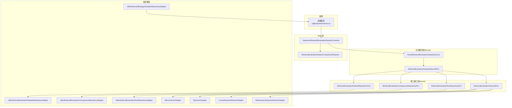
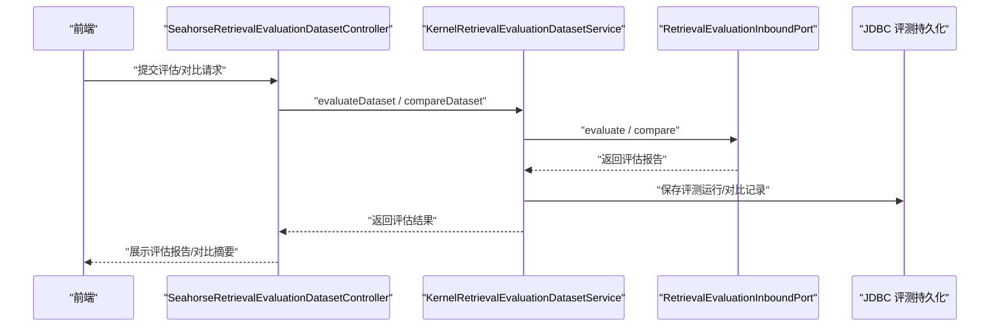
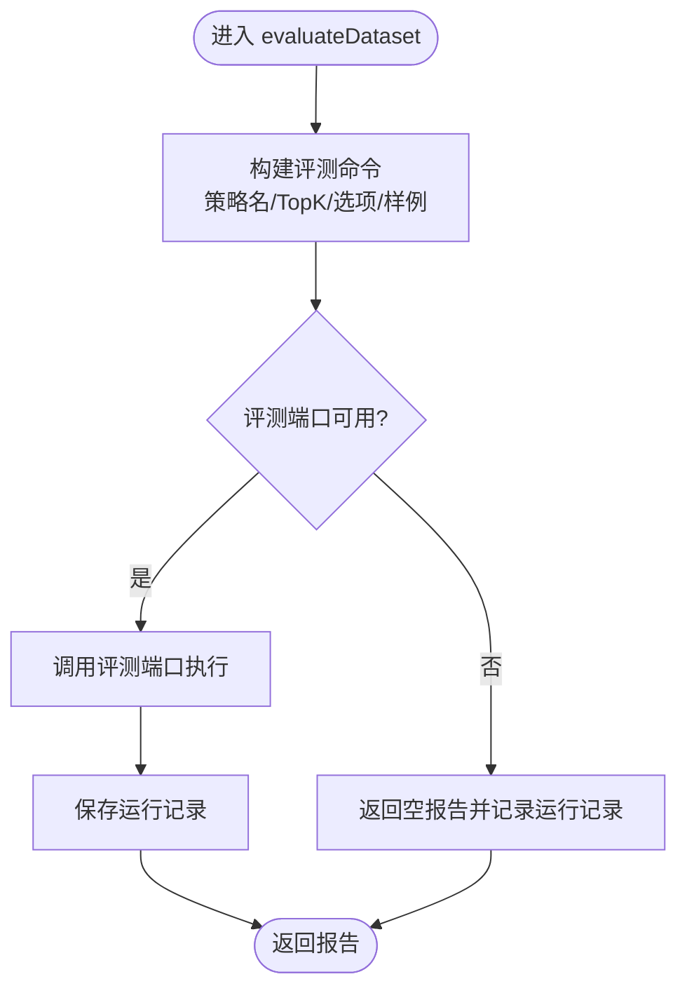
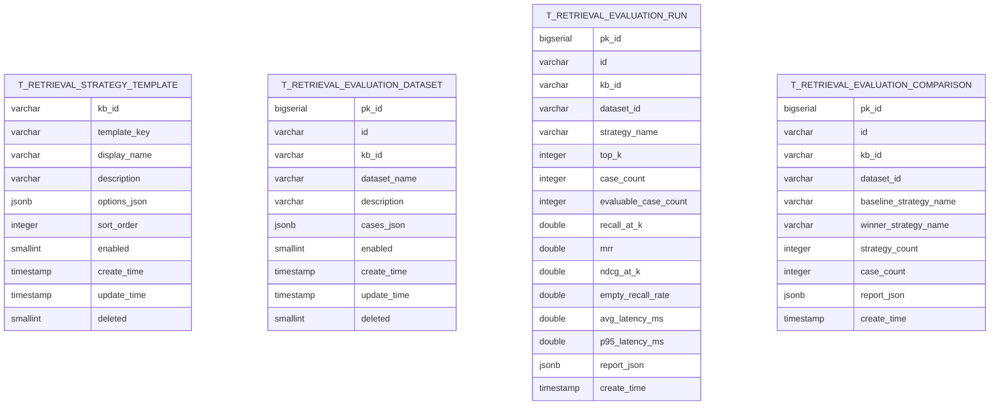
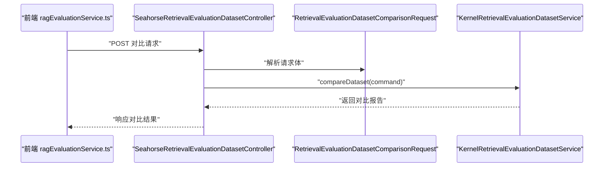
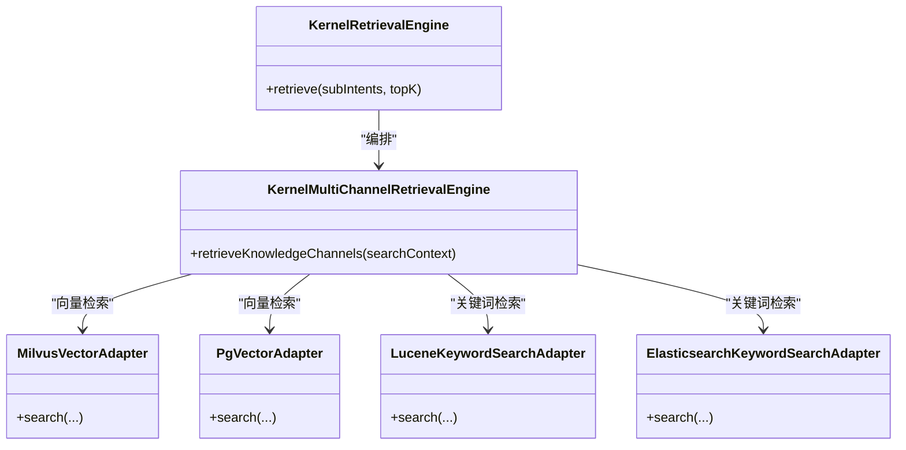
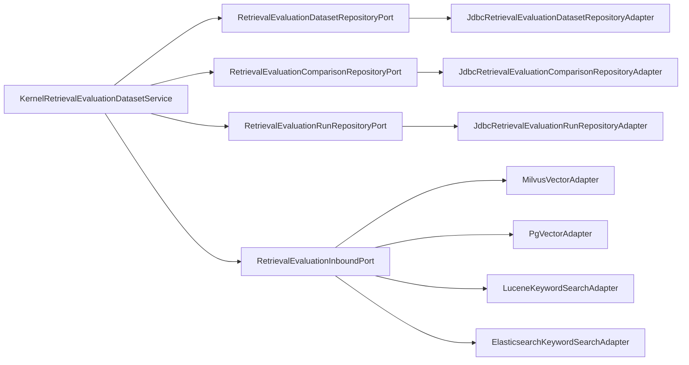

# 检索应用服务

<cite>
**本文引用的文件**
- [KernelRetrievalEvaluationDatasetService.java](file://seahorse-agent-kernel/src/main/java/com/miracle/ai/seahorse/agent/kernel/application/retrieval/KernelRetrievalEvaluationDatasetService.java)
- [RetrievalEvaluationDatasetInboundPort.java](file://seahorse-agent-kernel/src/main/java/com/miracle/ai/seahorse/agent/ports/inbound/retrieval/RetrievalEvaluationDatasetInboundPort.java)
- [SeahorseAgentKernelRetrievalAutoConfiguration.java](file://seahorse-agent-spring-boot-starter/src/main/java/com/miracle/ai/seahorse/agent/adapters/spring/SeahorseAgentKernelRetrievalAutoConfiguration.java)
- [SeahorseRetrievalEvaluationDatasetController.java](file://seahorse-agent-adapter-web/src/main/java/com/miracle/ai/seahorse/agent/adapters/web/SeahorseRetrievalEvaluationDatasetController.java)
- [RetrievalEvaluationDatasetComparisonRequest.java](file://seahorse-agent-adapter-web/src/main/java/com/miracle/ai/seahorse/agent/adapters/web/RetrievalEvaluationDatasetComparisonRequest.java)
- [ragEvaluationService.ts](file://frontend/src/services/ragEvaluationService.ts)
- [KernelRetrievalEvaluationDatasetServiceTests.java](file://seahorse-agent-tests/src/test/java/com/miracle/ai/seahorse/agent/kernel/application/retrieval/KernelRetrievalEvaluationDatasetServiceTests.java)
- [seahorse_init.sql](file://resources/database/seahorse_init.sql)
- [JdbcRetrievalStrategyTemplateRepositoryAdapter.java](file://seahorse-agent-adapter-repository-jdbc/src/main/java/com/miracle/ai/seahorse/agent/adapters/repository/jdbc/JdbcRetrievalStrategyTemplateRepositoryAdapter.java)
- [JdbcRetrievalEvaluationDatasetRepositoryAdapter.java](file://seahorse-agent-adapter-repository-jdbc/src/main/java/com/miracle/ai/seahorse/agent/adapters/repository/jdbc/JdbcRetrievalEvaluationDatasetRepositoryAdapter.java)
- [JdbcRetrievalEvaluationRunRepositoryAdapter.java](file://seahorse-agent-adapter-repository-jdbc/src/main/java/com/miracle/ai/seahorse/agent/adapters/repository/jdbc/JdbcRetrievalEvaluationRunRepositoryAdapter.java)
- [JdbcRetrievalEvaluationComparisonRepositoryAdapter.java](file://seahorse-agent-adapter-repository-jdbc/src/main/java/com/miracle/ai/seahorse/agent/adapters/repository/jdbc/JdbcRetrievalEvaluationComparisonRepositoryAdapter.java)
- [MilvusVectorAdapter.java](file://seahorse-agent-adapter-vector-milvus/src/main/java/com/miracle/ai/seahorse/agent/adapters/vector/milvus/MilvusVectorAdapter.java)
- [PgVectorAdapter.java](file://seahorse-agent-adapter-vector-pgvector/src/main/java/com/miracle/ai/seahorse/agent/adapters/vector/pgvector/PgVectorAdapter.java)
- [LuceneKeywordSearchAdapter.java](file://seahorse-agent-adapter-search-lucene/src/main/java/com/miracle/ai/seahorse/agent/adapters/search/lucene/LuceneKeywordSearchAdapter.java)
- [ElasticsearchKeywordSearchAdapter.java](file://seahorse-agent-adapter-search-elasticsearch/src/main/java/com/miracle/ai/seahorse/agent/adapters/search/elasticsearch/ElasticsearchKeywordSearchAdapter.java)
- [KernelRetrievalEngine.java](file://seahorse-agent-kernel/src/main/java/com/miracle/ai/seahorse/agent/kernel/application/retrieval/KernelRetrievalEngine.java)
- [KernelMultiChannelRetrievalEngine.java](file://seahorse-agent-kernel/src/main/java/com/miracle/ai/seahorse/agent/kernel/application/retrieval/KernelMultiChannelRetrievalEngine.java)
- [RetrievalEvaluationDatasetRepositoryPort.java](file://seahorse-agent-kernel/src/main/java/com/miracle/ai/seahorse/agent/ports/outbound/retrieval/RetrievalEvaluationDatasetRepositoryPort.java)
- [RetrievalEvaluationComparisonRepositoryPort.java](file://seahorse-agent-kernel/src/main/java/com/miracle/ai/seahorse/agent/ports/outbound/retrieval/RetrievalEvaluationComparisonRepositoryPort.java)
- [RetrievalEvaluationRunRepositoryPort.java](file://seahorse-agent-kernel/src/main/java/com/miracle/ai/seahorse/agent/ports/outbound/retrieval/RetrievalEvaluationRunRepositoryPort.java)
- [RetrievalEvaluationInboundPort.java](file://seahorse-agent-kernel/src/main/java/com/miracle/ai/seahorse/agent/ports/outbound/retrieval/RetrievalEvaluationInboundPort.java)
</cite>

## 目录
1. [简介](#简介)
2. [项目结构](#项目结构)
3. [核心组件](#核心组件)
4. [架构总览](#架构总览)
5. [详细组件分析](#详细组件分析)
6. [依赖分析](#依赖分析)
7. [性能考虑](#性能考虑)
8. [故障排查指南](#故障排查指南)
9. [结论](#结论)
10. [附录](#附录)

## 简介
本文件系统性阐述检索应用服务的设计与实现，聚焦以下能力：
- 检索评估：支持单策略评测与多策略对比评测，提供召回率、平均倒数排名、归一化折损增益等指标。
- 检索策略模板：支持为知识库维度定义可复用的检索策略模板，包含 TopK、重排、元数据过滤等选项。
- 检索数据集：支持数据集的创建、管理与持久化，包含样例查询与期望命中目标。
- 检索比较：支持以基准策略为参照，对候选策略进行对比，自动判定胜者并记录对比摘要。
- 与向量库、关键词索引、存储系统的协作：通过适配器模式对接 Milvus、PgVector、Lucene、Elasticsearch 等后端，实现稳定高效的检索。

## 项目结构
检索应用服务位于后端 kernel 层，通过适配器层对接外部系统，前端通过 HTTP 控制器暴露检索评估与策略模板管理能力。核心模块包括：
- 应用服务层：KernelRetrievalEvaluationDatasetService 负责数据集管理、评测执行与结果记录。
- 端口接口层：定义数据集、对比、运行记录与评测执行的端口契约。
- 适配器层：数据库 JDBC 适配器负责持久化；向量与关键词适配器负责检索执行。
- Web 层：控制器与前端服务对接，提供策略模板与评估的前端交互。

图表来源
- [KernelRetrievalEvaluationDatasetService.java:47-236](file://seahorse-agent-kernel/src/main/java/com/miracle/ai/seahorse/agent/kernel/application/retrieval/KernelRetrievalEvaluationDatasetService.java#L47-L236)
- [SeahorseRetrievalEvaluationDatasetController.java](file://seahorse-agent-adapter-web/src/main/java/com/miracle/ai/seahorse/agent/adapters/web/SeahorseRetrievalEvaluationDatasetController.java)
- [RetrievalEvaluationDatasetComparisonRequest.java:30-42](file://seahorse-agent-adapter-web/src/main/java/com/miracle/ai/seahorse/agent/adapters/web/RetrievalEvaluationDatasetComparisonRequest.java#L30-L42)
- [JdbcRetrievalEvaluationDatasetRepositoryAdapter.java](file://seahorse-agent-adapter-repository-jdbc/src/main/java/com/miracle/ai/seahorse/agent/adapters/repository/jdbc/JdbcRetrievalEvaluationDatasetRepositoryAdapter.java)
- [JdbcRetrievalEvaluationComparisonRepositoryAdapter.java](file://seahorse-agent-adapter-repository-jdbc/src/main/java/com/miracle/ai/seahorse/agent/adapters/repository/jdbc/JdbcRetrievalEvaluationComparisonRepositoryAdapter.java)
- [JdbcRetrievalEvaluationRunRepositoryAdapter.java](file://seahorse-agent-adapter-repository-jdbc/src/main/java/com/miracle/ai/seahorse/agent/adapters/repository/jdbc/JdbcRetrievalEvaluationRunRepositoryAdapter.java)
- [JdbcRetrievalStrategyTemplateRepositoryAdapter.java](file://seahorse-agent-adapter-repository-jdbc/src/main/java/com/miracle/ai/seahorse/agent/adapters/repository/jdbc/JdbcRetrievalStrategyTemplateRepositoryAdapter.java)
- [MilvusVectorAdapter.java](file://seahorse-agent-adapter-vector-milvus/src/main/java/com/miracle/ai/seahorse/agent/adapters/vector/milvus/MilvusVectorAdapter.java)
- [PgVectorAdapter.java](file://seahorse-agent-adapter-vector-pgvector/src/main/java/com/miracle/ai/seahorse/agent/adapters/vector/pgvector/PgVectorAdapter.java)
- [LuceneKeywordSearchAdapter.java](file://seahorse-agent-adapter-search-lucene/src/main/java/com/miracle/ai/seahorse/agent/adapters/search/lucene/LuceneKeywordSearchAdapter.java)
- [ElasticsearchKeywordSearchAdapter.java](file://seahorse-agent-adapter-search-elasticsearch/src/main/java/com/miracle/ai/seahorse/agent/adapters/search/elasticsearch/ElasticsearchKeywordSearchAdapter.java)

章节来源
- [KernelRetrievalEvaluationDatasetService.java:47-236](file://seahorse-agent-kernel/src/main/java/com/miracle/ai/seahorse/agent/kernel/application/retrieval/KernelRetrievalEvaluationDatasetService.java#L47-L236)
- [RetrievalEvaluationDatasetInboundPort.java:25-47](file://seahorse-agent-kernel/src/main/java/com/miracle/ai/seahorse/agent/ports/inbound/retrieval/RetrievalEvaluationDatasetInboundPort.java#L25-L47)

## 核心组件
- KernelRetrievalEvaluationDatasetService：应用服务核心，负责数据集 CRUD、评测执行、对比评测、运行记录与对比记录的持久化。
- RetrievalEvaluationDatasetInboundPort：应用服务对外暴露的入口接口，定义数据集管理与评测能力。
- 端口接口：RetrievalEvaluationDatasetRepositoryPort、RetrievalEvaluationComparisonRepositoryPort、RetrievalEvaluationRunRepositoryPort、RetrievalEvaluationInboundPort。
- JDBC 适配器：负责将评测数据持久化至数据库，支持策略模板、评测数据集、评测运行与对比记录。
- 检索执行适配器：Milvus、PgVector、Lucene、Elasticsearch，用于实际检索执行。
- Web 控制器与前端服务：提供策略模板与评估的前端交互。

章节来源
- [KernelRetrievalEvaluationDatasetService.java:47-236](file://seahorse-agent-kernel/src/main/java/com/miracle/ai/seahorse/agent/kernel/application/retrieval/KernelRetrievalEvaluationDatasetService.java#L47-L236)
- [RetrievalEvaluationDatasetInboundPort.java:25-47](file://seahorse-agent-kernel/src/main/java/com/miracle/ai/seahorse/agent/ports/inbound/retrieval/RetrievalEvaluationDatasetInboundPort.java#L25-L47)
- [RetrievalEvaluationDatasetRepositoryPort.java:25-65](file://seahorse-agent-kernel/src/main/java/com/miracle/ai/seahorse/agent/ports/outbound/retrieval/RetrievalEvaluationDatasetRepositoryPort.java#L25-L65)

## 架构总览
检索应用服务从 Web 控制器进入，经应用服务层编排，调用评测端口执行评估或对比，随后将评测结果持久化至数据库。前端通过服务接口与控制器交互，完成策略模板与评估任务的管理。

图表来源
- [SeahorseRetrievalEvaluationDatasetController.java](file://seahorse-agent-adapter-web/src/main/java/com/miracle/ai/seahorse/agent/adapters/web/SeahorseRetrievalEvaluationDatasetController.java)
- [KernelRetrievalEvaluationDatasetService.java:108-155](file://seahorse-agent-kernel/src/main/java/com/miracle/ai/seahorse/agent/kernel/application/retrieval/KernelRetrievalEvaluationDatasetService.java#L108-L155)
- [JdbcRetrievalEvaluationRunRepositoryAdapter.java](file://seahorse-agent-adapter-repository-jdbc/src/main/java/com/miracle/ai/seahorse/agent/adapters/repository/jdbc/JdbcRetrievalEvaluationRunRepositoryAdapter.java)
- [JdbcRetrievalEvaluationComparisonRepositoryAdapter.java](file://seahorse-agent-adapter-repository-jdbc/src/main/java/com/miracle/ai/seahorse/agent/adapters/repository/jdbc/JdbcRetrievalEvaluationComparisonRepositoryAdapter.java)

## 详细组件分析

### 应用服务：KernelRetrievalEvaluationDatasetService
- 职责
  - 数据集管理：列出、查询、新增/更新、删除评测数据集。
  - 单策略评测：根据数据集样例执行评测，计算召回率、MRR、nDCG 等指标并记录运行记录。
  - 多策略对比：以基准策略为参照，对比多个候选策略，记录对比摘要并回写胜者。
  - 运行与对比记录：将评测结果持久化，异常时不阻断主流程。
- 关键流程
  - evaluateDataset：构建评测命令，调用评测端口执行，保存运行记录。
  - compareDataset：构建对比命令，调用评测端口执行，保存对比记录并回写每个策略的运行记录。
  - 列表与详情：提供运行与对比的列表查询与详情查询。
- 错误处理
  - 评测端口缺失时返回空报告并记录运行记录，保证主链路可用。
  - 数据集不存在时抛出参数异常，避免无效操作。

图表来源
- [KernelRetrievalEvaluationDatasetService.java:108-130](file://seahorse-agent-kernel/src/main/java/com/miracle/ai/seahorse/agent/kernel/application/retrieval/KernelRetrievalEvaluationDatasetService.java#L108-L130)

章节来源
- [KernelRetrievalEvaluationDatasetService.java:47-236](file://seahorse-agent-kernel/src/main/java/com/miracle/ai/seahorse/agent/kernel/application/retrieval/KernelRetrievalEvaluationDatasetService.java#L47-L236)
- [KernelRetrievalEvaluationDatasetServiceTests.java:52-110](file://seahorse-agent-tests/src/test/java/com/miracle/ai/seahorse/agent/kernel/application/retrieval/KernelRetrievalEvaluationDatasetServiceTests.java#L52-L110)

### 端口接口与持久化适配器
- 端口接口
  - RetrievalEvaluationDatasetRepositoryPort：数据集 CRUD。
  - RetrievalEvaluationComparisonRepositoryPort：对比记录 CRUD。
  - RetrievalEvaluationRunRepositoryPort：运行记录 CRUD。
  - RetrievalEvaluationInboundPort：评测执行端口。
- JDBC 适配器
  - JdbcRetrievalStrategyTemplateRepositoryAdapter：策略模板持久化。
  - JdbcRetrievalEvaluationDatasetRepositoryAdapter：评测数据集持久化。
  - JdbcRetrievalEvaluationRunRepositoryAdapter：评测运行记录持久化。
  - JdbcRetrievalEvaluationComparisonRepositoryAdapter：评测对比记录持久化。
- 数据库表结构
  - t_retrieval_strategy_template：策略模板表，支持按知识库维度隔离与启用状态。
  - t_retrieval_evaluation_dataset：评测数据集表，包含样例 JSON。
  - t_retrieval_evaluation_run：评测运行记录表，包含指标与报告 JSON。
  - t_retrieval_evaluation_comparison：评测对比记录表，包含胜者策略等。

图表来源
- [seahorse_init.sql:1906-1974](file://resources/database/seahorse_init.sql#L1906-L1974)

章节来源
- [RetrievalEvaluationDatasetRepositoryPort.java:25-65](file://seahorse-agent-kernel/src/main/java/com/miracle/ai/seahorse/agent/ports/outbound/retrieval/RetrievalEvaluationDatasetRepositoryPort.java#L25-L65)
- [JdbcRetrievalStrategyTemplateRepositoryAdapter.java](file://seahorse-agent-adapter-repository-jdbc/src/main/java/com/miracle/ai/seahorse/agent/adapters/repository/jdbc/JdbcRetrievalStrategyTemplateRepositoryAdapter.java)
- [JdbcRetrievalEvaluationDatasetRepositoryAdapter.java](file://seahorse-agent-adapter-repository-jdbc/src/main/java/com/miracle/ai/seahorse/agent/adapters/repository/jdbc/JdbcRetrievalEvaluationDatasetRepositoryAdapter.java)
- [JdbcRetrievalEvaluationRunRepositoryAdapter.java](file://seahorse-agent-adapter-repository-jdbc/src/main/java/com/miracle/ai/seahorse/agent/adapters/repository/jdbc/JdbcRetrievalEvaluationRunRepositoryAdapter.java)
- [JdbcRetrievalEvaluationComparisonRepositoryAdapter.java](file://seahorse-agent-adapter-repository-jdbc/src/main/java/com/miracle/ai/seahorse/agent/adapters/repository/jdbc/JdbcRetrievalEvaluationComparisonRepositoryAdapter.java)
- [seahorse_init.sql:1906-1974](file://resources/database/seahorse_init.sql#L1906-L1974)

### Web 控制器与前端交互
- 控制器
  - SeahorseRetrievalEvaluationDatasetController：接收前端请求，封装命令对象，调用应用服务。
  - RetrievalEvaluationDatasetComparisonRequest：对比请求体，包含基准策略名、TopK 与候选策略列表。
- 前端服务
  - ragEvaluationService.ts：定义策略模板、评测策略、数据集与对比请求的数据结构，便于前后端契约一致。

图表来源
- [SeahorseRetrievalEvaluationDatasetController.java](file://seahorse-agent-adapter-web/src/main/java/com/miracle/ai/seahorse/agent/adapters/web/SeahorseRetrievalEvaluationDatasetController.java)
- [RetrievalEvaluationDatasetComparisonRequest.java:30-42](file://seahorse-agent-adapter-web/src/main/java/com/miracle/ai/seahorse/agent/adapters/web/RetrievalEvaluationDatasetComparisonRequest.java#L30-L42)
- [ragEvaluationService.ts:66-94](file://frontend/src/services/ragEvaluationService.ts#L66-L94)

章节来源
- [SeahorseRetrievalEvaluationDatasetController.java](file://seahorse-agent-adapter-web/src/main/java/com/miracle/ai/seahorse/agent/adapters/web/SeahorseRetrievalEvaluationDatasetController.java)
- [RetrievalEvaluationDatasetComparisonRequest.java:30-42](file://seahorse-agent-adapter-web/src/main/java/com/miracle/ai/seahorse/agent/adapters/web/RetrievalEvaluationDatasetComparisonRequest.java#L30-L42)
- [ragEvaluationService.ts:6-94](file://frontend/src/services/ragEvaluationService.ts#L6-L94)

### 检索策略模板与执行
- 策略模板
  - 支持为知识库设置模板键、显示名、描述、选项 JSON、排序与启用状态。
  - 可通过 JDBC 适配器持久化，前端通过服务接口读取与编辑。
- 检索执行
  - 向量通道：MilvusVectorAdapter、PgVectorAdapter。
  - 关键词通道：LuceneKeywordSearchAdapter、ElasticsearchKeywordSearchAdapter。
  - 多通道编排：KernelMultiChannelRetrievalEngine 并行执行，再由 KernelRetrievalEngine 统一后处理。

图表来源
- [KernelRetrievalEngine.java](file://seahorse-agent-kernel/src/main/java/com/miracle/ai/seahorse/agent/kernel/application/retrieval/KernelRetrievalEngine.java)
- [KernelMultiChannelRetrievalEngine.java](file://seahorse-agent-kernel/src/main/java/com/miracle/ai/seahorse/agent/kernel/application/retrieval/KernelMultiChannelRetrievalEngine.java)
- [MilvusVectorAdapter.java](file://seahorse-agent-adapter-vector-milvus/src/main/java/com/miracle/ai/seahorse/agent/adapters/vector/milvus/MilvusVectorAdapter.java)
- [PgVectorAdapter.java](file://seahorse-agent-adapter-vector-pgvector/src/main/java/com/miracle/ai/seahorse/agent/adapters/vector/pgvector/PgVectorAdapter.java)
- [LuceneKeywordSearchAdapter.java](file://seahorse-agent-adapter-search-lucene/src/main/java/com/miracle/ai/seahorse/agent/adapters/search/lucene/LuceneKeywordSearchAdapter.java)
- [ElasticsearchKeywordSearchAdapter.java](file://seahorse-agent-adapter-search-elasticsearch/src/main/java/com/miracle/ai/seahorse/agent/adapters/search/elasticsearch/ElasticsearchKeywordSearchAdapter.java)

## 依赖分析
- 应用服务依赖端口接口，通过 Spring 自动装配注入 JDBC 适配器与评测执行端口。
- 端口接口与实现解耦，便于替换不同后端（向量库、关键词索引、存储）。
- 前端通过服务接口与控制器交互，保持契约稳定。

图表来源
- [KernelRetrievalEvaluationDatasetService.java:47-77](file://seahorse-agent-kernel/src/main/java/com/miracle/ai/seahorse/agent/kernel/application/retrieval/KernelRetrievalEvaluationDatasetService.java#L47-L77)
- [SeahorseAgentKernelRetrievalAutoConfiguration.java:199-212](file://seahorse-agent-spring-boot-starter/src/main/java/com/miracle/ai/seahorse/agent/adapters/spring/SeahorseAgentKernelRetrievalAutoConfiguration.java#L199-L212)

章节来源
- [SeahorseAgentKernelRetrievalAutoConfiguration.java:199-212](file://seahorse-agent-spring-boot-starter/src/main/java/com/miracle/ai/seahorse/agent/adapters/spring/SeahorseAgentKernelRetrievalAutoConfiguration.java#L199-L212)

## 性能考虑
- 并行执行：多通道检索引擎并行执行不同通道的检索，提升吞吐。
- 降级与容错：当评测端口不可用或持久化失败时，应用服务返回空报告并记录运行记录，保证主链路不中断。
- 索引与查询优化：向量库与关键词索引的适配器需配合合适的索引参数与查询策略，减少延迟与提高命中质量。
- 限流与监控：结合缓存与分布式锁适配器，控制并发与资源占用；通过观察端口记录关键指标。

## 故障排查指南
- 数据集不存在：检查知识库 ID 与数据集 ID 是否正确，确认数据集是否被删除或禁用。
- 评测端口缺失：确认 Spring 容器中是否注册了评测执行端口 Bean。
- 持久化异常：运行记录或对比记录保存失败不会阻断评测返回，但应关注数据库连接与表结构一致性。
- 前端交互：确认前端服务接口与控制器请求体一致，特别是对比请求中的基准策略名与候选策略列表。

章节来源
- [KernelRetrievalEvaluationDatasetService.java:121-129](file://seahorse-agent-kernel/src/main/java/com/miracle/ai/seahorse/agent/kernel/application/retrieval/KernelRetrievalEvaluationDatasetService.java#L121-L129)
- [KernelRetrievalEvaluationDatasetServiceTests.java:52-110](file://seahorse-agent-tests/src/test/java/com/miracle/ai/seahorse/agent/kernel/application/retrieval/KernelRetrievalEvaluationDatasetServiceTests.java#L52-L110)

## 结论
检索应用服务通过清晰的应用服务层、端口接口与适配器架构，实现了检索评估、策略模板管理与对比分析的完整闭环。其与向量库、关键词索引及存储系统的协作，确保了检索质量与效果的持续优化。通过 JDBC 适配器与数据库表结构，评测历史得以沉淀，为策略迭代与性能回归提供可靠依据。

## 附录
- 使用示例（流程）
  - 策略定义：通过 JDBC 适配器创建策略模板，设置模板键、TopK、重排与元数据过滤等选项。
  - 数据集管理：创建评测数据集，填充样例查询与期望命中目标。
  - 评估执行：调用应用服务的 evaluateDataset，执行单策略评测并记录运行记录。
  - 结果分析：对比多个候选策略，确定胜者并记录对比摘要，便于策略优化与回归验证。
- 与检索内核协作
  - 检索内核通过多通道编排与后处理链，将向量与关键词检索结果融合，形成最终上下文，支撑对话与决策。