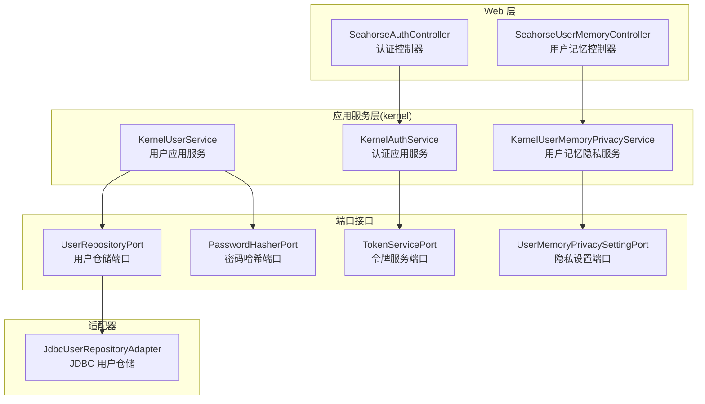
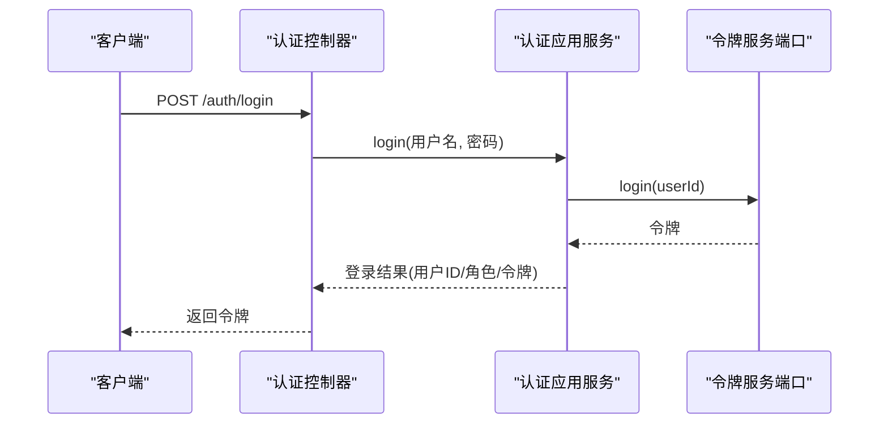
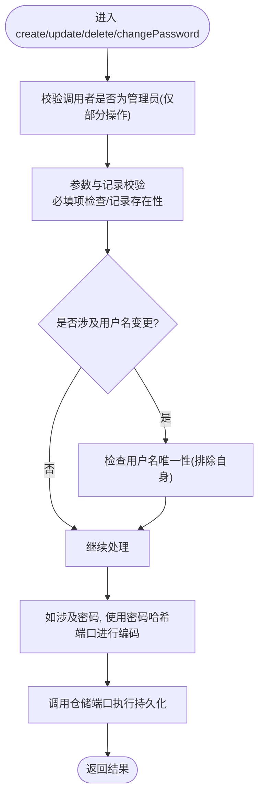
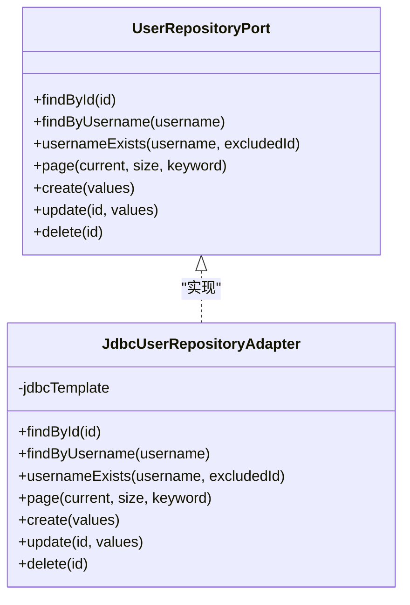
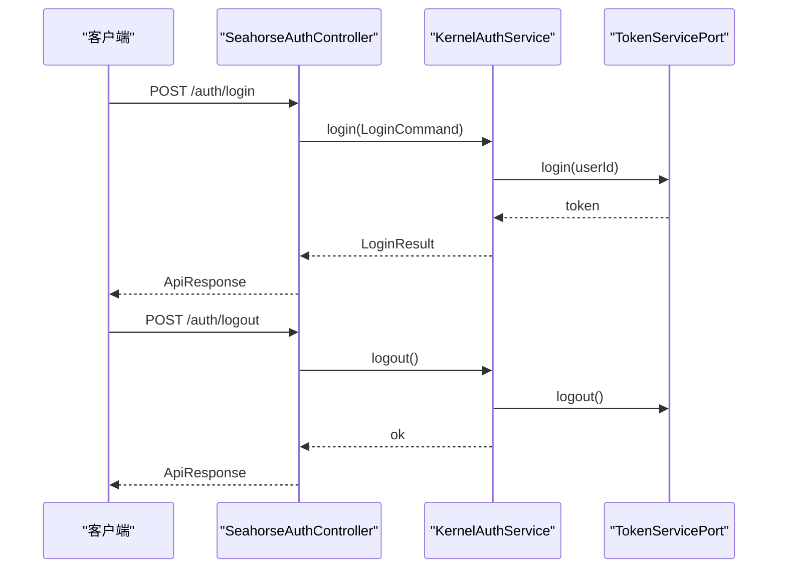
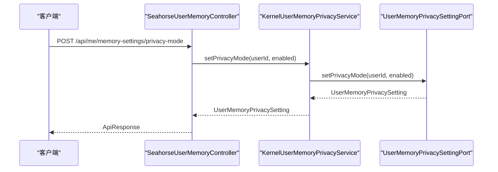
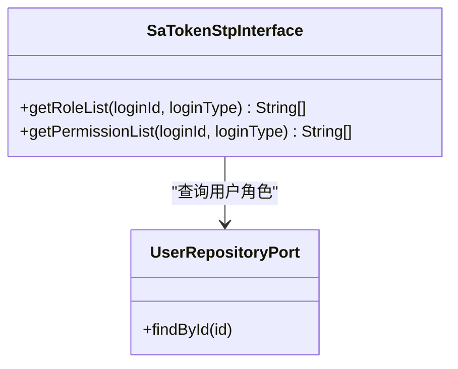
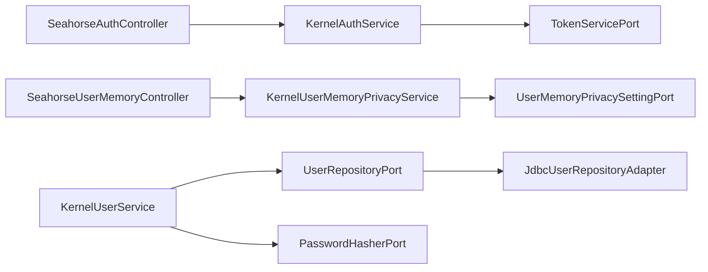

# 用户应用服务

<cite>
**本文档引用的文件**
- [KernelUserService.java](file://seahorse-agent-kernel/src/main/java/com/miracle/ai/seahorse/agent/kernel/application/user/KernelUserService.java)
- [JdbcUserRepositoryAdapter.java](file://seahorse-agent-adapter-repository-jdbc/src/main/java/com/miracle/ai/seahorse/agent/adapters/repository/jdbc/JdbcUserRepositoryAdapter.java)
- [UserRepositoryPort.java](file://seahorse-agent-kernel/src/main/java/com/miracle/ai/seahorse/agent/ports/outbound/auth/UserRepositoryPort.java)
- [PasswordHasherPort.java](file://seahorse-agent-kernel/src/main/java/com/miracle/ai/seahorse/agent/ports/outbound/auth/PasswordHasherPort.java)
- [TokenServicePort.java](file://seahorse-agent-kernel/src/main/java/com/miracle/ai/seahorse/agent/ports/outbound/auth/TokenServicePort.java)
- [KernelAuthService.java](file://seahorse-agent-kernel/src/main/java/com/miracle/ai/seahorse/agent/kernel/application/auth/KernelAuthService.java)
- [SeahorseAuthController.java](file://seahorse-agent-adapter-web/src/main/java/com/miracle/ai/seahorse/agent/adapters/web/SeahorseAuthController.java)
- [SeahorseUserMemoryController.java](file://seahorse-agent-adapter-web/src/main/java/com/miracle/ai/seahorse/agent/adapters/web/SeahorseUserMemoryController.java)
- [KernelUserMemoryPrivacyService.java](file://seahorse-agent-kernel/src/main/java/com/miracle/ai/seahorse/agent/kernel/application/memory/KernelUserMemoryPrivacyService.java)
- [UserMemoryPrivacySettingPort.java](file://seahorse-agent-kernel/src/main/java/com/miracle/ai/seahorse/agent/ports/outbound/memory/UserMemoryPrivacySettingPort.java)
- [SeahorseSaTokenStpInterface.java](file://seahorse-agent-adapter-web/src/main/java/com/miracle/ai/seahorse/agent/adapters/web/SeahorseSaTokenStpInterface.java)
</cite>

## 目录
1. [简介](#简介)
2. [项目结构](#项目结构)
3. [核心组件](#核心组件)
4. [架构总览](#架构总览)
5. [详细组件分析](#详细组件分析)
6. [依赖关系分析](#依赖关系分析)
7. [性能考虑](#性能考虑)
8. [故障排除指南](#故障排除指南)
9. [结论](#结论)

## 简介
本文件聚焦于用户应用服务的实现与使用，涵盖用户管理（创建、更新、删除、分页查询）、用户认证与权限控制、以及用户隐私设置（长期记忆隐私模式）等关键能力。文档从架构视角解释用户应用服务如何与认证系统、权限系统协作，确保用户数据的安全性与隐私保护，并提供可操作的业务流程说明与可视化图示。

## 项目结构
用户应用服务位于内核层（kernel），通过端口接口与适配器解耦，Web 层通过控制器暴露 REST API，数据库访问由 JDBC 适配器完成。隐私设置通过独立的隐私端口与服务实现。

图表来源
- [KernelUserService.java:35-51](file://seahorse-agent-kernel/src/main/java/com/miracle/ai/seahorse/agent/kernel/application/user/KernelUserService.java#L35-L51)
- [KernelAuthService.java](file://seahorse-agent-kernel/src/main/java/com/miracle/ai/seahorse/agent/kernel/application/auth/KernelAuthService.java)
- [KernelUserMemoryPrivacyService.java:26-32](file://seahorse-agent-kernel/src/main/java/com/miracle/ai/seahorse/agent/kernel/application/memory/KernelUserMemoryPrivacyService.java#L26-L32)
- [UserRepositoryPort.java:22-37](file://seahorse-agent-kernel/src/main/java/com/miracle/ai/seahorse/agent/ports/outbound/auth/UserRepositoryPort.java#L22-L37)
- [PasswordHasherPort.java:20-39](file://seahorse-agent-kernel/src/main/java/com/miracle/ai/seahorse/agent/ports/outbound/auth/PasswordHasherPort.java#L20-L39)
- [TokenServicePort.java:20-25](file://seahorse-agent-kernel/src/main/java/com/miracle/ai/seahorse/agent/ports/outbound/auth/TokenServicePort.java#L20-L25)
- [JdbcUserRepositoryAdapter.java:37-45](file://seahorse-agent-adapter-repository-jdbc/src/main/java/com/miracle/ai/seahorse/agent/adapters/repository/jdbc/JdbcUserRepositoryAdapter.java#L37-L45)

章节来源
- [KernelUserService.java:35-51](file://seahorse-agent-kernel/src/main/java/com/miracle/ai/seahorse/agent/kernel/application/user/KernelUserService.java#L35-L51)
- [SeahorseAuthController.java:29-55](file://seahorse-agent-adapter-web/src/main/java/com/miracle/ai/seahorse/agent/adapters/web/SeahorseAuthController.java#L29-L55)
- [SeahorseUserMemoryController.java:42-63](file://seahorse-agent-adapter-web/src/main/java/com/miracle/ai/seahorse/agent/adapters/web/SeahorseUserMemoryController.java#L42-L63)

## 核心组件
- 用户应用服务：负责用户生命周期管理、密码处理、角色校验与安全约束。
- 认证应用服务：负责登录/登出、令牌发放与销毁。
- 用户记忆隐私服务：负责用户隐私模式查询与更新。
- 用户仓储端口与适配器：抽象与实现分离，支持用户数据持久化。
- 密码哈希端口：统一密码编码与匹配策略。
- 令牌服务端口：统一认证票据管理。
- 权限集成：基于 Sa-Token 的角色/权限解析。

章节来源
- [KernelUserService.java:35-184](file://seahorse-agent-kernel/src/main/java/com/miracle/ai/seahorse/agent/kernel/application/user/KernelUserService.java#L35-L184)
- [KernelAuthService.java](file://seahorse-agent-kernel/src/main/java/com/miracle/ai/seahorse/agent/kernel/application/auth/KernelAuthService.java)
- [KernelUserMemoryPrivacyService.java:26-43](file://seahorse-agent-kernel/src/main/java/com/miracle/ai/seahorse/agent/kernel/application/memory/KernelUserMemoryPrivacyService.java#L26-L43)
- [UserRepositoryPort.java:22-37](file://seahorse-agent-kernel/src/main/java/com/miracle/ai/seahorse/agent/ports/outbound/auth/UserRepositoryPort.java#L22-L37)
- [JdbcUserRepositoryAdapter.java:37-203](file://seahorse-agent-adapter-repository-jdbc/src/main/java/com/miracle/ai/seahorse/agent/adapters/repository/jdbc/JdbcUserRepositoryAdapter.java#L37-L203)
- [PasswordHasherPort.java:20-39](file://seahorse-agent-kernel/src/main/java/com/miracle/ai/seahorse/agent/ports/outbound/auth/PasswordHasherPort.java#L20-L39)
- [TokenServicePort.java:20-25](file://seahorse-agent-kernel/src/main/java/com/miracle/ai/seahorse/agent/ports/outbound/auth/TokenServicePort.java#L20-L25)
- [SeahorseSaTokenStpInterface.java:32-50](file://seahorse-agent-adapter-web/src/main/java/com/miracle/ai/seahorse/agent/adapters/web/SeahorseSaTokenStpInterface.java#L32-L50)

## 架构总览
用户应用服务采用“端口-适配器”架构，Web 控制器仅依赖应用服务接口，应用服务通过端口调用底层基础设施（数据库、加密、令牌）。认证与权限通过独立的服务与端口实现，确保关注点分离与可替换性。

图表来源
- [SeahorseAuthController.java:43-48](file://seahorse-agent-adapter-web/src/main/java/com/miracle/ai/seahorse/agent/adapters/web/SeahorseAuthController.java#L43-L48)
- [TokenServicePort.java:22-24](file://seahorse-agent-kernel/src/main/java/com/miracle/ai/seahorse/agent/ports/outbound/auth/TokenServicePort.java#L22-L24)

## 详细组件分析

### 用户应用服务（KernelUserService）
职责与特性
- 当前用户查询：要求具备有效会话。
- 分页查询：仅管理员可访问，支持关键词过滤。
- 用户创建：仅管理员可创建；校验用户名可用性、默认管理员名不可用、密码安全编码、默认角色为普通用户。
- 用户更新：仅管理员可更新；支持用户名变更（需唯一性校验）、密码更新（安全编码）、角色规范化、头像清理。
- 用户删除：仅管理员可删除；默认管理员禁止删除。
- 修改密码：当前用户可修改，需验证原密码与新密码非空。
- 角色规范化：admin/user，非法值抛错；未提供时默认 user。
- 安全约束：空值/空白校验、默认管理员保护、用户名唯一性。

图表来源
- [KernelUserService.java:65-120](file://seahorse-agent-kernel/src/main/java/com/miracle/ai/seahorse/agent/kernel/application/user/KernelUserService.java#L65-L120)
- [UserRepositoryPort.java:22-37](file://seahorse-agent-kernel/src/main/java/com/miracle/ai/seahorse/agent/ports/outbound/auth/UserRepositoryPort.java#L22-L37)
- [PasswordHasherPort.java:20-39](file://seahorse-agent-kernel/src/main/java/com/miracle/ai/seahorse/agent/ports/outbound/auth/PasswordHasherPort.java#L20-L39)

章节来源
- [KernelUserService.java:53-184](file://seahorse-agent-kernel/src/main/java/com/miracle/ai/seahorse/agent/kernel/application/user/KernelUserService.java#L53-L184)
- [UserRepositoryPort.java:22-37](file://seahorse-agent-kernel/src/main/java/com/miracle/ai/seahorse/agent/ports/outbound/auth/UserRepositoryPort.java#L22-L37)
- [PasswordHasherPort.java:20-39](file://seahorse-agent-kernel/src/main/java/com/miracle/ai/seahorse/agent/ports/outbound/auth/PasswordHasherPort.java#L20-L39)

### 用户仓储（JdbcUserRepositoryAdapter）
职责与特性
- 提供用户查询、分页、创建、更新、软删除能力。
- 查询与分页均带 deleted=0 过滤，避免返回已删除记录。
- 更新采用动态 SET 组装，仅对非空字段更新，时间戳自动刷新。
- 创建时生成全局 ID，统一写入创建/更新时间。
- 关键字分页支持用户名/角色模糊匹配。

图表来源
- [UserRepositoryPort.java:22-37](file://seahorse-agent-kernel/src/main/java/com/miracle/ai/seahorse/agent/ports/outbound/auth/UserRepositoryPort.java#L22-L37)
- [JdbcUserRepositoryAdapter.java:37-203](file://seahorse-agent-adapter-repository-jdbc/src/main/java/com/miracle/ai/seahorse/agent/adapters/repository/jdbc/JdbcUserRepositoryAdapter.java#L37-L203)

章节来源
- [JdbcUserRepositoryAdapter.java:47-156](file://seahorse-agent-adapter-repository-jdbc/src/main/java/com/miracle/ai/seahorse/agent/adapters/repository/jdbc/JdbcUserRepositoryAdapter.java#L47-L156)

### 认证应用服务与控制器
职责与特性
- 认证控制器：提供 /auth/login 与 /auth/logout 接口，封装登录/登出请求与响应。
- 认证应用服务：负责登录校验、令牌签发与注销。
- 令牌服务端口：抽象登录/登出行为，便于替换实现。

图表来源
- [SeahorseAuthController.java:43-54](file://seahorse-agent-adapter-web/src/main/java/com/miracle/ai/seahorse/agent/adapters/web/SeahorseAuthController.java#L43-L54)
- [TokenServicePort.java:22-24](file://seahorse-agent-kernel/src/main/java/com/miracle/ai/seahorse/agent/ports/outbound/auth/TokenServicePort.java#L22-L24)
- [KernelAuthService.java](file://seahorse-agent-kernel/src/main/java/com/miracle/ai/seahorse/agent/kernel/application/auth/KernelAuthService.java)

章节来源
- [SeahorseAuthController.java:29-55](file://seahorse-agent-adapter-web/src/main/java/com/miracle/ai/seahorse/agent/adapters/web/SeahorseAuthController.java#L29-L55)
- [TokenServicePort.java:20-25](file://seahorse-agent-kernel/src/main/java/com/miracle/ai/seahorse/agent/ports/outbound/auth/TokenServicePort.java#L20-L25)

### 用户记忆隐私服务与控制器
职责与特性
- 隐私服务：提供当前隐私设置查询与更新能力，内部委托隐私设置端口。
- Web 控制器：提供 /api/me/memories 列表、删除单条记忆、更新隐私模式接口；严格校验记忆归属与服务可用性。
- 隐私设置端口：默认实现返回固定隐私模式，便于在无外部实现时快速运行。

图表来源
- [SeahorseUserMemoryController.java:97-105](file://seahorse-agent-adapter-web/src/main/java/com/miracle/ai/seahorse/agent/adapters/web/SeahorseUserMemoryController.java#L97-L105)
- [KernelUserMemoryPrivacyService.java:34-42](file://seahorse-agent-kernel/src/main/java/com/miracle/ai/seahorse/agent/kernel/application/memory/KernelUserMemoryPrivacyService.java#L34-L42)
- [UserMemoryPrivacySettingPort.java:29-41](file://seahorse-agent-kernel/src/main/java/com/miracle/ai/seahorse/agent/ports/outbound/memory/UserMemoryPrivacySettingPort.java#L29-L41)

章节来源
- [KernelUserMemoryPrivacyService.java:26-43](file://seahorse-agent-kernel/src/main/java/com/miracle/ai/seahorse/agent/kernel/application/memory/KernelUserMemoryPrivacyService.java#L26-L43)
- [SeahorseUserMemoryController.java:65-105](file://seahorse-agent-adapter-web/src/main/java/com/miracle/ai/seahorse/agent/adapters/web/SeahorseUserMemoryController.java#L65-L105)

### 权限与角色集成（Sa-Token）
职责与特性
- 基于 Sa-Token 的角色解析：根据登录用户 ID 查询用户记录，提取角色并返回给框架。
- 用于认证后权限判定与菜单/功能访问控制。

图表来源
- [SeahorseSaTokenStpInterface.java:35-49](file://seahorse-agent-adapter-web/src/main/java/com/miracle/ai/seahorse/agent/adapters/web/SeahorseSaTokenStpInterface.java#L35-L49)
- [UserRepositoryPort.java:24-26](file://seahorse-agent-kernel/src/main/java/com/miracle/ai/seahorse/agent/ports/outbound/auth/UserRepositoryPort.java#L24-L26)

章节来源
- [SeahorseSaTokenStpInterface.java:32-50](file://seahorse-agent-adapter-web/src/main/java/com/miracle/ai/seahorse/agent/adapters/web/SeahorseSaTokenStpInterface.java#L32-L50)

## 依赖关系分析
- 应用服务与端口：用户应用服务依赖 UserRepositoryPort、PasswordHasherPort、CurrentUserPort；认证应用服务依赖 TokenServicePort；隐私服务依赖 UserMemoryPrivacySettingPort。
- Web 控制器与应用服务：控制器仅依赖应用服务接口，通过 ObjectProvider 获取可用实现，保证松耦合与可替换性。
- 仓储适配器：JdbcUserRepositoryAdapter 实现 UserRepositoryPort，屏蔽 JDBC 细节。
- 权限集成：Sa-Token 通过自定义 StpInterface 读取用户角色，与用户记录关联。

图表来源
- [KernelUserService.java:41-51](file://seahorse-agent-kernel/src/main/java/com/miracle/ai/seahorse/agent/kernel/application/user/KernelUserService.java#L41-L51)
- [KernelAuthService.java](file://seahorse-agent-kernel/src/main/java/com/miracle/ai/seahorse/agent/kernel/application/auth/KernelAuthService.java)
- [KernelUserMemoryPrivacyService.java:26-32](file://seahorse-agent-kernel/src/main/java/com/miracle/ai/seahorse/agent/kernel/application/memory/KernelUserMemoryPrivacyService.java#L26-L32)
- [UserRepositoryPort.java:22-37](file://seahorse-agent-kernel/src/main/java/com/miracle/ai/seahorse/agent/ports/outbound/auth/UserRepositoryPort.java#L22-L37)
- [JdbcUserRepositoryAdapter.java:37-45](file://seahorse-agent-adapter-repository-jdbc/src/main/java/com/miracle/ai/seahorse/agent/adapters/repository/jdbc/JdbcUserRepositoryAdapter.java#L37-L45)

章节来源
- [KernelUserService.java:35-51](file://seahorse-agent-kernel/src/main/java/com/miracle/ai/seahorse/agent/kernel/application/user/KernelUserService.java#L35-L51)
- [KernelUserMemoryPrivacyService.java:26-32](file://seahorse-agent-kernel/src/main/java/com/miracle/ai/seahorse/agent/kernel/application/memory/KernelUserMemoryPrivacyService.java#L26-L32)
- [SeahorseAuthController.java:29-55](file://seahorse-agent-adapter-web/src/main/java/com/miracle/ai/seahorse/agent/adapters/web/SeahorseAuthController.java#L29-L55)

## 性能考虑
- 分页查询：分页大小限制与最大上限控制，避免过大查询导致资源消耗。
- 动态 SQL：更新操作按需组装 SET 字段，减少不必要的列更新。
- 软删除：删除标记字段统一处理，避免物理删除带来的索引重建成本。
- 密码哈希：采用安全哈希算法，避免明文存储；批量操作建议异步化以降低峰值压力。
- 令牌管理：登录/登出为 O(1) 操作，注意令牌过期与回收策略。

## 故障排除指南
常见问题与定位要点
- 用户名重复：更新用户名时若与其他用户冲突，将抛出唯一性异常；检查用户名唯一性逻辑与并发场景。
- 默认管理员保护：尝试修改/删除默认管理员将被拒绝；确认目标用户是否为内置管理员。
- 密码校验失败：修改密码时若原密码不匹配，将拒绝更新；确认密码哈希匹配策略与输入。
- 权限不足：分页查询与用户管理操作需要管理员角色；检查登录用户角色与 Sa-Token 角色解析。
- 服务不可用：Web 控制器在端口不可用时抛出服务不可用异常；检查应用服务 Bean 是否注册成功。
- 记忆删除权限：仅允许删除属于当前用户的记忆；检查记忆元数据中的用户标识与解析逻辑。

章节来源
- [KernelUserService.java:130-134](file://seahorse-agent-kernel/src/main/java/com/miracle/ai/seahorse/agent/kernel/application/user/KernelUserService.java#L130-L134)
- [KernelUserService.java:150-154](file://seahorse-agent-kernel/src/main/java/com/miracle/ai/seahorse/agent/kernel/application/user/KernelUserService.java#L150-L154)
- [KernelUserService.java:113-119](file://seahorse-agent-kernel/src/main/java/com/miracle/ai/seahorse/agent/kernel/application/user/KernelUserService.java#L113-L119)
- [SeahorseUserMemoryController.java:87-95](file://seahorse-agent-adapter-web/src/main/java/com/miracle/ai/seahorse/agent/adapters/web/SeahorseUserMemoryController.java#L87-L95)
- [SeahorseUserMemoryController.java:107-121](file://seahorse-agent-adapter-web/src/main/java/com/miracle/ai/seahorse/agent/adapters/web/SeahorseUserMemoryController.java#L107-L121)

## 结论
用户应用服务通过清晰的端口-适配器架构实现了用户管理、认证与隐私设置的模块化与可扩展性。结合 Sa-Token 的角色解析与 JDBC 仓储适配器，系统在保证安全性的同时提供了良好的可维护性与性能表现。建议在生产环境中进一步完善令牌过期策略、审计日志与监控告警，以增强整体可观测性与安全性。