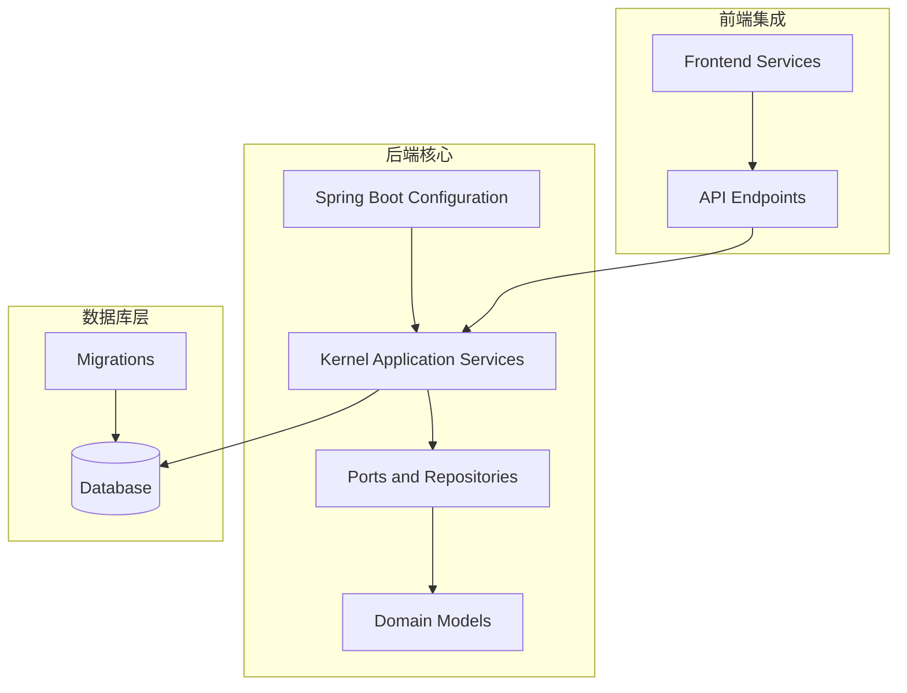
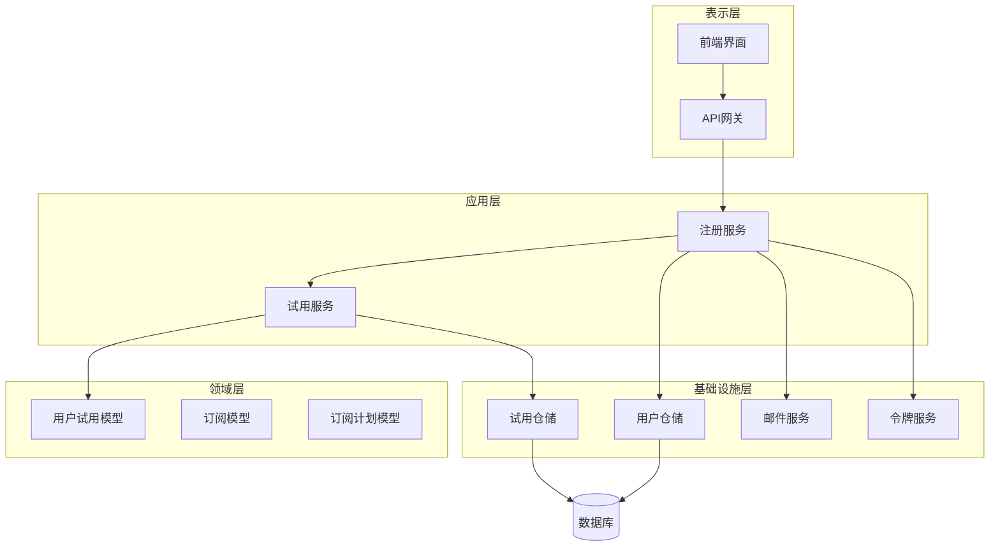
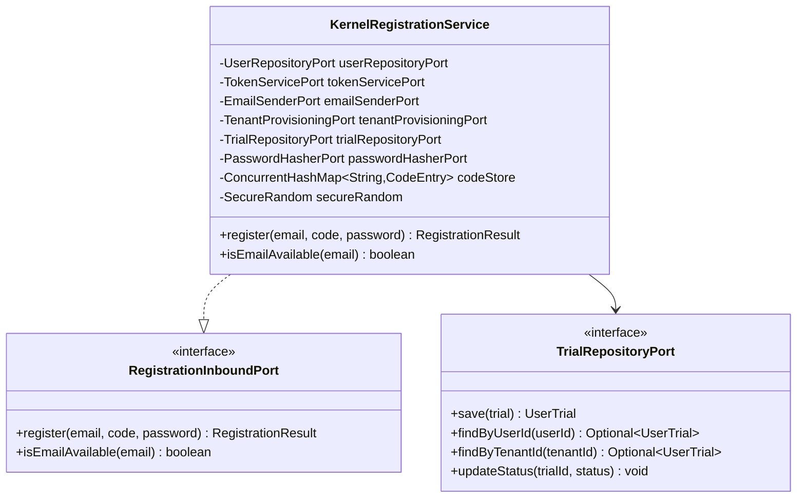
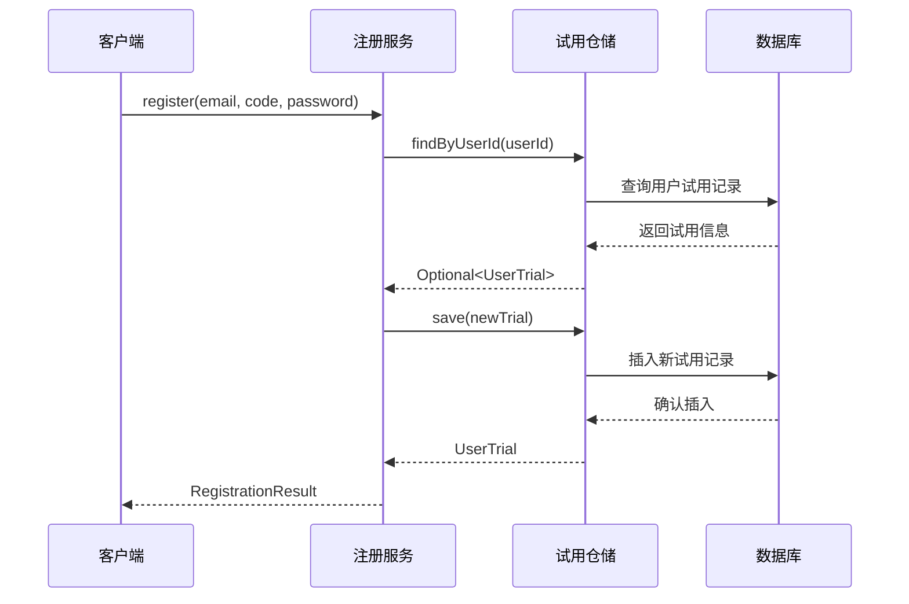
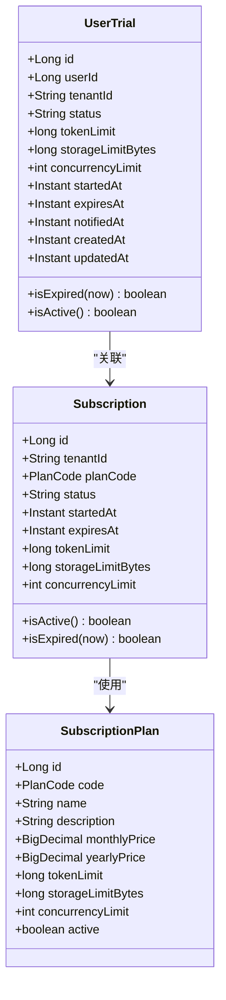
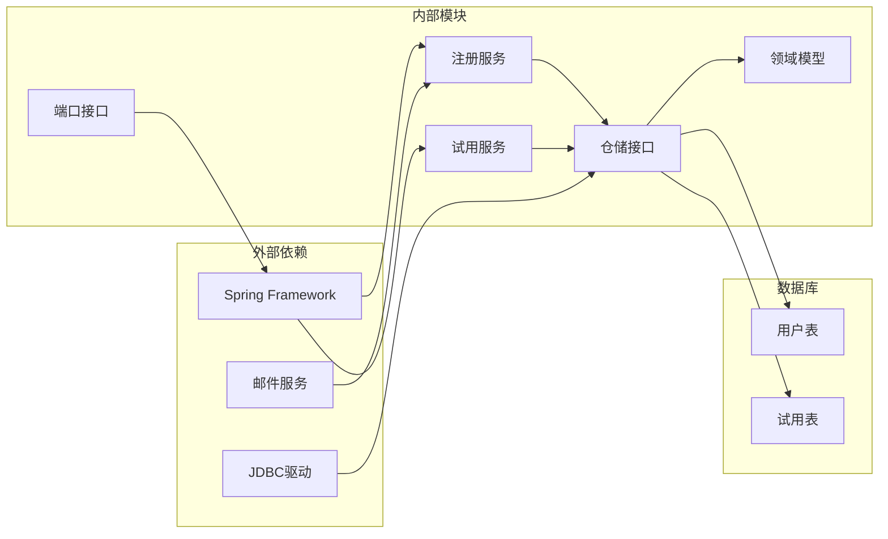

# 用户注册试用

<cite>
**本文档引用的文件**
- [V3__add_user_trial_tables.sql](file://resources/database/migrations/V3__add_user_trial_tables.sql)
- [KernelRegistrationService.java](file://seahorse-agent-kernel/src/main/java/com/miracle/ai/seahorse/agent/kernel/application/auth/KernelRegistrationService.java)
- [RegistrationInboundPort.java](file://seahorse-agent-kernel/src/main/java/com/miracle/ai/seahorse/agent/ports/inbound/auth/RegistrationInboundPort.java)
- [TrialRepositoryPort.java](file://seahorse-agent-kernel/src/main/java/com/miracle/ai/seahorse/agent/ports/outbound/user/TrialRepositoryPort.java)
- [UserTrial.java](file://seahorse-agent-kernel/src/main/java/com/miracle/ai/seahorse/agent/kernel/domain/user/UserTrial.java)
- [KernelTrialService.java](file://seahorse-agent-kernel/src/main/java/com/miracle/ai/seahorse/agent/kernel/application/trial/KernelTrialService.java)
- [SeahorseAgentRegistrationAutoConfiguration.java](file://seahorse-agent-spring-boot-starter/src/main/java/com/miracle/ai/seahorse/agent/adapters/spring/SeahorseAgentRegistrationAutoConfiguration.java)
- [Subscription.java](file://seahorse-agent-kernel/src/main/java/com/miracle/ai/seahorse/agent/kernel/domain/billing/Subscription.java)
- [SubscriptionPlan.java](file://seahorse-agent-kernel/src/main/java/com/miracle/ai/seahorse/agent/kernel/domain/billing/SubscriptionPlan.java)
</cite>

## 目录
1. [简介](#简介)
2. [项目结构](#项目结构)
3. [核心组件](#核心组件)
4. [架构概览](#架构概览)
5. [详细组件分析](#详细组件分析)
6. [依赖关系分析](#依赖关系分析)
7. [性能考虑](#性能考虑)
8. [故障排除指南](#故障排除指南)
9. [结论](#结论)

## 简介

用户注册试用系统是 Seahorse Agent 项目中的一个核心功能模块，负责管理新用户的注册流程、免费试用期的激活以及相关资源配额的分配。该系统基于 Spring Boot 自动配置机制，通过端到端的架构设计实现了完整的用户注册和试用管理流程。

系统的主要目标是为新用户提供无缝的注册体验，同时确保试用期内的资源使用符合预设的限制条件。通过数据库迁移脚本、领域模型和应用服务的协同工作，系统能够有效地管理用户状态、试用期配置和资源配额。

## 项目结构

用户注册试用系统在项目中采用分层架构设计，主要分布在以下目录结构中：

**图表来源**
- [KernelRegistrationService.java:57-78](file://seahorse-agent-kernel/src/main/java/com/miracle/ai/seahorse/agent/kernel/application/auth/KernelRegistrationService.java#L57-L78)
- [SeahorseAgentRegistrationAutoConfiguration.java:38-50](file://seahorse-agent-spring-boot-starter/src/main/java/com/miracle/ai/seahorse/agent/adapters/spring/SeahorseAgentRegistrationAutoConfiguration.java#L38-L50)

**章节来源**
- [KernelRegistrationService.java:57-78](file://seahorse-agent-kernel/src/main/java/com/miracle/ai/seahorse/agent/kernel/application/auth/KernelRegistrationService.java#L57-L78)
- [SeahorseAgentRegistrationAutoConfiguration.java:38-50](file://seahorse-agent-spring-boot-starter/src/main/java/com/miracle/ai/seahorse/agent/adapters/spring/SeahorseAgentRegistrationAutoConfiguration.java#L38-L50)

## 核心组件

用户注册试用系统由多个核心组件构成，每个组件都有明确的职责分工：

### 注册服务组件
注册服务是整个系统的核心协调器，负责处理用户注册请求、验证验证码、创建用户账户并激活免费试用期。该服务集成了密码哈希、令牌生成、邮件发送和租户配置等功能。

### 试用仓储组件
试用仓储接口定义了试用期数据访问的标准方法，包括根据用户ID或租户ID查找试用信息、保存试用记录以及更新试用状态等操作。

### 领域模型组件
用户试用领域模型封装了试用期的所有业务逻辑，包括试用状态管理、过期时间检查、活跃状态判断等功能。这些模型确保了业务规则的一致性和完整性。

**章节来源**
- [KernelRegistrationService.java:57-78](file://seahorse-agent-kernel/src/main/java/com/miracle/ai/seahorse/agent/kernel/application/auth/KernelRegistrationService.java#L57-L78)
- [TrialRepositoryPort.java:34-60](file://seahorse-agent-kernel/src/main/java/com/miracle/ai/seahorse/agent/ports/outbound/user/TrialRepositoryPort.java#L34-L60)
- [UserTrial.java:33-61](file://seahorse-agent-kernel/src/main/java/com/miracle/ai/seahorse/agent/kernel/domain/user/UserTrial.java#L33-L61)

## 架构概览

用户注册试用系统采用清晰的分层架构，实现了关注点分离和依赖注入的最佳实践：

**图表来源**
- [KernelRegistrationService.java:57-78](file://seahorse-agent-kernel/src/main/java/com/miracle/ai/seahorse/agent/kernel/application/auth/KernelRegistrationService.java#L57-L78)
- [KernelTrialService.java](file://seahorse-agent-kernel/src/main/java/com/miracle/ai/seahorse/agent/kernel/application/trial/KernelTrialService.java)
- [UserTrial.java:33-61](file://seahorse-agent-kernel/src/main/java/com/miracle/ai/seahorse/agent/kernel/domain/user/UserTrial.java#L33-L61)

系统架构遵循了整洁架构原则，将业务逻辑与基础设施分离，通过端口和适配器模式实现了依赖倒置。这种设计使得系统具有良好的可测试性和可维护性。

**章节来源**
- [KernelRegistrationService.java:57-78](file://seahorse-agent-kernel/src/main/java/com/miracle/ai/seahorse/agent/kernel/application/auth/KernelRegistrationService.java#L57-L78)
- [KernelTrialService.java](file://seahorse-agent-kernel/src/main/java/com/miracle/ai/seahorse/agent/kernel/application/trial/KernelTrialService.java)

## 详细组件分析

### 注册服务实现

注册服务是用户注册试用系统的核心协调器，负责处理完整的注册流程。该服务通过依赖注入的方式获取各种端口服务，包括用户仓储、令牌服务、邮件发送服务、租户配置服务和试用仓储服务。

服务的关键特性包括：
- **安全的密码处理**：使用BCrypt算法进行密码哈希
- **验证码管理**：维护临时的验证码存储机制
- **资源配额设置**：为免费试用期设置默认的使用限制
- **多步骤流程协调**：从邮箱验证到账户激活的完整流程

**图表来源**
- [KernelRegistrationService.java:57-78](file://seahorse-agent-kernel/src/main/java/com/miracle/ai/seahorse/agent/kernel/application/auth/KernelRegistrationService.java#L57-L78)
- [RegistrationInboundPort.java:34-50](file://seahorse-agent-kernel/src/main/java/com/miracle/ai/seahorse/agent/ports/inbound/auth/RegistrationInboundPort.java#L34-L50)
- [TrialRepositoryPort.java:34-60](file://seahorse-agent-kernel/src/main/java/com/miracle/ai/seahorse/agent/ports/outbound/user/TrialRepositoryPort.java#L34-L60)

**章节来源**
- [KernelRegistrationService.java:57-78](file://seahorse-agent-kernel/src/main/java/com/miracle/ai/seahorse/agent/kernel/application/auth/KernelRegistrationService.java#L57-L78)
- [RegistrationInboundPort.java:34-50](file://seahorse-agent-kernel/src/main/java/com/miracle/ai/seahorse/agent/ports/inbound/auth/RegistrationInboundPort.java#L34-L50)

### 试用仓储接口

试用仓储接口定义了试用期数据访问的标准契约，提供了类型安全的操作方法。接口的设计遵循了开闭原则，允许不同的实现方式（如JDBC、Redis等）替换而不影响上层逻辑。

关键方法包括：
- **保存操作**：持久化新的试用记录
- **查询操作**：按用户ID或租户ID检索试用信息
- **状态更新**：转换试用状态（如从ACTIVE到CONVERTED）

**图表来源**
- [KernelRegistrationService.java:57-78](file://seahorse-agent-kernel/src/main/java/com/miracle/ai/seahorse/agent/kernel/application/auth/KernelRegistrationService.java#L57-L78)
- [TrialRepositoryPort.java:34-60](file://seahorse-agent-kernel/src/main/java/com/miracle/ai/seahorse/agent/ports/outbound/user/TrialRepositoryPort.java#L34-L60)

**章节来源**
- [TrialRepositoryPort.java:34-60](file://seahorse-agent-kernel/src/main/java/com/miracle/ai/seahorse/agent/ports/outbound/user/TrialRepositoryPort.java#L34-L60)

### 用户试用领域模型

用户试用领域模型封装了试用期的所有业务逻辑，包括状态管理和过期检查。模型的设计体现了值对象的特性，不可变性和类型安全。

核心业务逻辑包括：
- **状态常量**：定义了ACTIVE、EXPIRED、CONVERTED三种状态
- **过期检查**：基于当前时间与过期时间的比较
- **活跃状态判断**：简化了状态检查的业务逻辑

**图表来源**
- [UserTrial.java:33-61](file://seahorse-agent-kernel/src/main/java/com/miracle/ai/seahorse/agent/kernel/domain/user/UserTrial.java#L33-L61)
- [Subscription.java:30-65](file://seahorse-agent-kernel/src/main/java/com/miracle/ai/seahorse/agent/kernel/domain/billing/Subscription.java#L30-L65)
- [SubscriptionPlan.java:31-46](file://seahorse-agent-kernel/src/main/java/com/miracle/ai/seahorse/agent/kernel/domain/billing/SubscriptionPlan.java#L31-L46)

**章节来源**
- [UserTrial.java:33-61](file://seahorse-agent-kernel/src/main/java/com/miracle/ai/seahorse/agent/kernel/domain/user/UserTrial.java#L33-L61)
- [Subscription.java:30-65](file://seahorse-agent-kernel/src/main/java/com/miracle/ai/seahorse/agent/kernel/domain/billing/Subscription.java#L30-L65)

### Spring Boot 自动配置

自动配置类负责在应用启动时注册必要的Bean，确保注册和试用服务能够正常工作。配置类通过条件注解确保只有在适当的环境下才进行Bean的注册。

关键配置包括：
- **密码哈希器**：使用BCrypt替代明文哈希
- **邮件发送器**：在开发环境中使用日志记录器
- **注册服务**：注册核心的注册协调服务
- **试用服务**：提供试用期查询功能

**章节来源**
- [SeahorseAgentRegistrationAutoConfiguration.java:38-50](file://seahorse-agent-spring-boot-starter/src/main/java/com/miracle/ai/seahorse/agent/adapters/spring/SeahorseAgentRegistrationAutoConfiguration.java#L38-L50)

## 依赖关系分析

用户注册试用系统的依赖关系体现了清晰的关注点分离和依赖倒置原则：

**图表来源**
- [KernelRegistrationService.java:57-78](file://seahorse-agent-kernel/src/main/java/com/miracle/ai/seahorse/agent/kernel/application/auth/KernelRegistrationService.java#L57-L78)
- [V3__add_user_trial_tables.sql:26-38](file://resources/database/migrations/V3__add_user_trial_tables.sql#L26-L38)

系统通过端口模式实现了对外部依赖的抽象，使得底层实现可以灵活替换。这种设计提高了系统的可测试性和可维护性。

**章节来源**
- [V3__add_user_trial_tables.sql:26-38](file://resources/database/migrations/V3__add_user_trial_tables.sql#L26-L38)

## 性能考虑

用户注册试用系统在设计时充分考虑了性能优化和资源管理：

### 内存管理
- **并发安全**：使用ConcurrentHashMap存储验证码，支持高并发场景
- **随机数生成**：采用SecureRandom确保验证码的安全性
- **内存限制**：为免费试用期设置合理的资源使用上限

### 数据库优化
- **索引设计**：为用户ID、租户ID和状态字段建立索引
- **查询优化**：通过专用的查找方法减少数据库查询复杂度
- **事务管理**：合理使用数据库事务确保数据一致性

### 缓存策略
- **验证码缓存**：临时存储验证码以避免重复发送
- **状态缓存**：缓存常用的试用状态信息
- **配置缓存**：缓存订阅计划和配额信息

## 故障排除指南

### 常见问题及解决方案

**注册失败问题**
- 检查验证码是否正确且未过期
- 验证邮箱地址的有效性
- 确认密码强度要求

**试用期激活问题**
- 检查用户是否存在且未被禁用
- 验证试用期配置是否正确
- 确认租户配置是否完成

**资源配额问题**
- 检查存储空间限制设置
- 验证并发连接数限制
- 确认令牌使用量统计

**章节来源**
- [KernelRegistrationService.java:57-78](file://seahorse-agent-kernel/src/main/java/com/miracle/ai/seahorse/agent/kernel/application/auth/KernelRegistrationService.java#L57-L78)

## 结论

用户注册试用系统展现了现代软件架构的最佳实践，通过清晰的分层设计、端口适配器模式和依赖注入机制，实现了高度模块化的系统结构。系统不仅满足了功能需求，还在安全性、可扩展性和可维护性方面达到了平衡。

该系统为新用户提供了无缝的注册体验，同时通过合理的资源配额管理确保了系统的稳定运行。通过Spring Boot自动配置机制，系统具备了良好的可部署性和可维护性，为后续的功能扩展奠定了坚实的基础。

未来的发展方向包括增强用户体验、优化性能表现以及扩展更多的认证方式和支持更多的试用场景。通过持续的迭代和改进，该系统将继续为用户提供优质的注册试用服务。