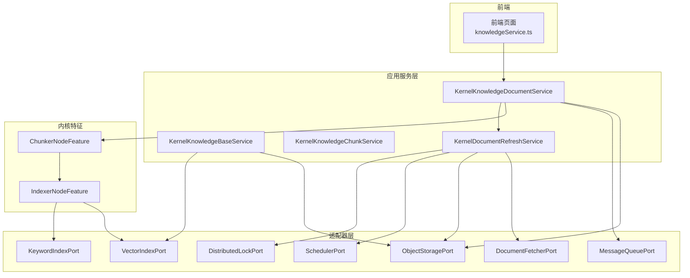
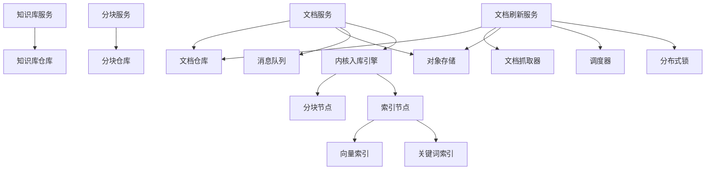
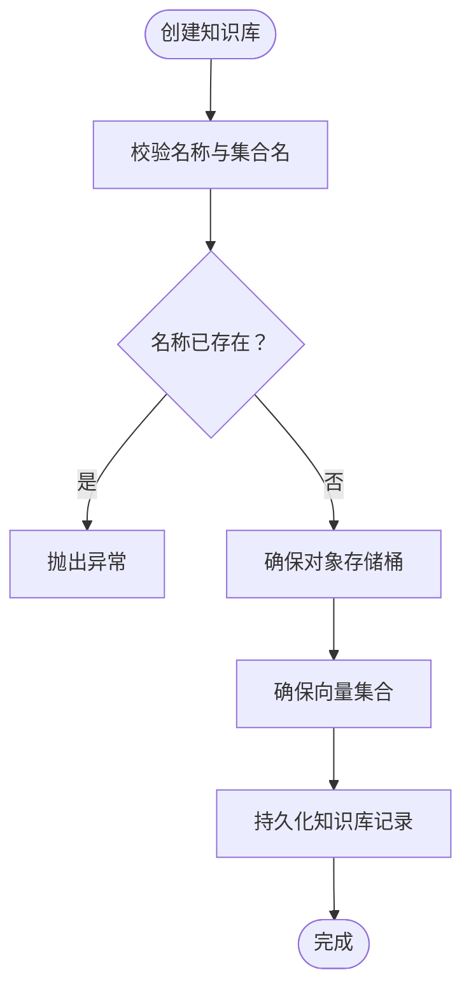
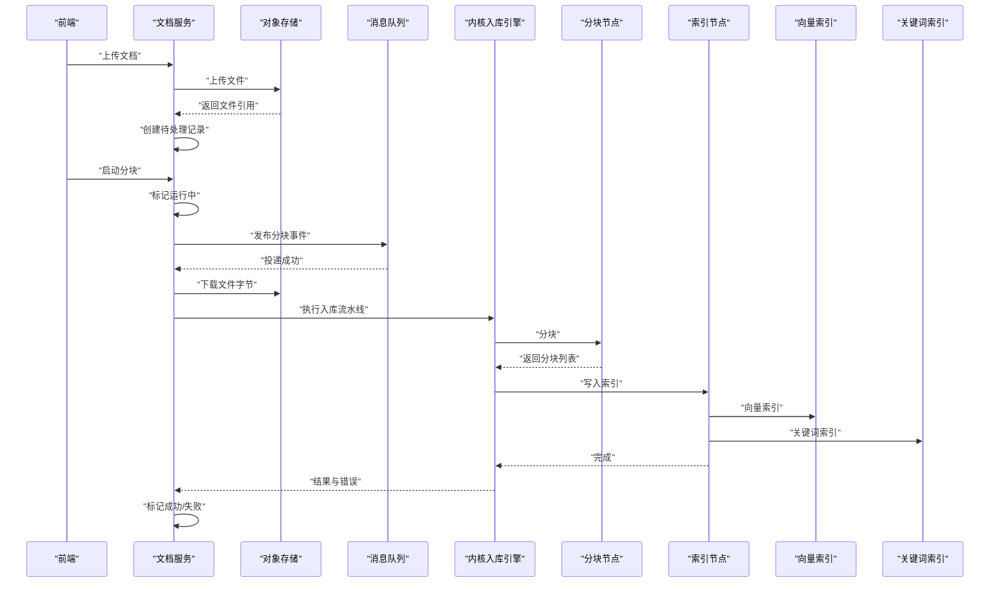
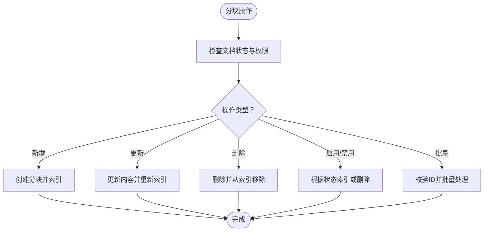
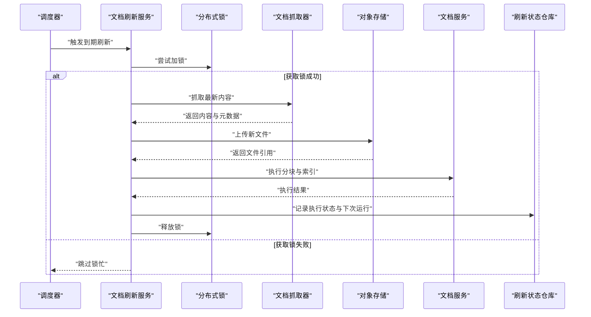
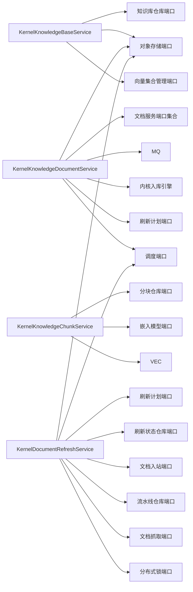
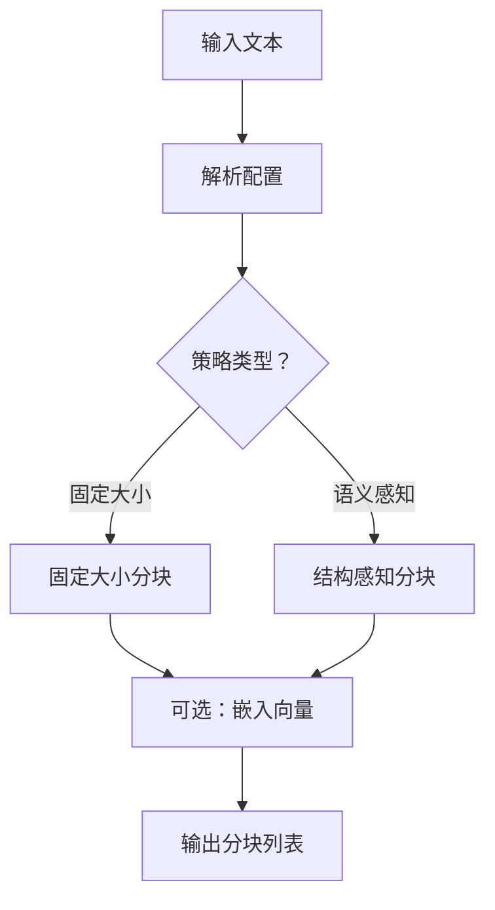
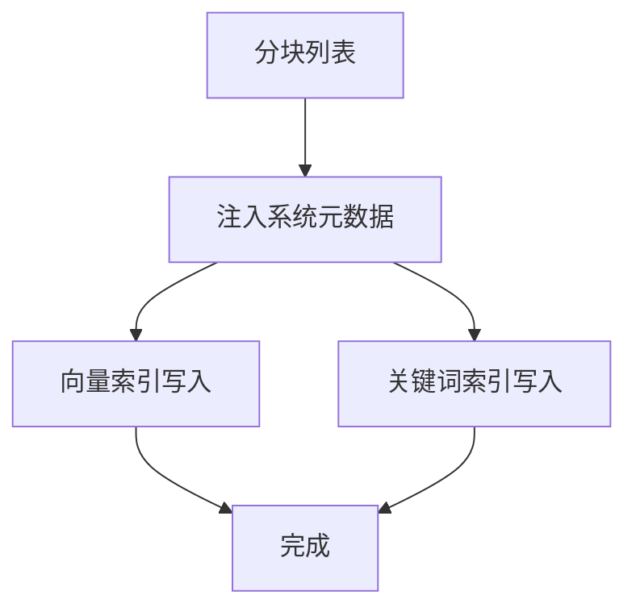

# 知识库应用服务

<cite>
**本文引用的文件**
- [KernelKnowledgeBaseService.java](file://seahorse-agent-kernel/src/main/java/com/miracle/ai/seahorse/agent/kernel/application/knowledge/KernelKnowledgeBaseService.java)
- [KernelKnowledgeDocumentService.java](file://seahorse-agent-kernel/src/main/java/com/miracle/ai/seahorse/agent/kernel/application/knowledge/KernelKnowledgeDocumentService.java)
- [KernelKnowledgeChunkService.java](file://seahorse-agent-kernel/src/main/java/com/miracle/ai/seahorse/agent/kernel/application/knowledge/KernelKnowledgeChunkService.java)
- [KernelDocumentRefreshService.java](file://seahorse-agent-kernel/src/main/java/com/miracle/ai/seahorse/agent/kernel/application/knowledge/KernelDocumentRefreshService.java)
- [KnowledgeDocumentServicePorts.java](file://seahorse-agent-kernel/src/main/java/com/miracle/ai/seahorse/agent/kernel/application/knowledge/KnowledgeDocumentServicePorts.java)
- [IndexerNodeFeature.java](file://seahorse-agent-kernel/src/main/java/com/miracle/ai/seahorse/agent/kernel/feature/ingestion/IndexerNodeFeature.java)
- [ChunkerNodeFeature.java](file://seahorse-agent-kernel/src/main/java/com/miracle/ai/seahorse/agent/kernel/feature/ingestion/ChunkerNodeFeature.java)
- [ElasticsearchKeywordIndexAdapter.java](file://seahorse-agent-adapter-search-elasticsearch/src/main/java/com/miracle/ai/seahorse/agent/adapters/search/elasticsearch/ElasticsearchKeywordIndexAdapter.java)
- [knowledgeService.ts](file://frontend/src/services/knowledgeService.ts)
- [知识管理应用服务.md](file://docs/zh/content/后端系统/核心内核/应用服务层/知识管理应用服务.md)
</cite>

## 目录
1. [简介](#简介)
2. [项目结构](#项目结构)
3. [核心组件](#核心组件)
4. [架构总览](#架构总览)
5. [详细组件分析](#详细组件分析)
6. [依赖关系分析](#依赖关系分析)
7. [性能考量](#性能考量)
8. [故障排查指南](#故障排查指南)
9. [结论](#结论)
10. [附录](#附录)

## 简介
本文件聚焦于知识库应用服务，围绕四大核心服务展开：知识库服务、文档服务、分块服务、文档刷新服务。文档系统性阐述知识文档的全生命周期管理：从上传、解析、分块到向量化存储；解释文档刷新机制的实现原理，包括增量更新、版本控制、冲突处理；并提供最佳实践与常见问题解决方案。

## 项目结构
本项目采用“内核(kernel)+适配器(adapter)+Web适配(web adapter)”的分层架构：
- 内核层：定义领域模型、应用服务与端口接口，屏蔽外部依赖细节。
- 适配器层：对接对象存储、向量数据库、消息队列、定时调度、文档抓取与解析等。
- Web适配层：暴露REST API控制器，作为前端调用入口。

**图示来源**
- [KernelKnowledgeBaseService.java:40-149](file://seahorse-agent-kernel/src/main/java/com/miracle/ai/seahorse/agent/kernel/application/knowledge/KernelKnowledgeBaseService.java#L40-L149)
- [KernelKnowledgeDocumentService.java:59-101](file://seahorse-agent-kernel/src/main/java/com/miracle/ai/seahorse/agent/kernel/application/knowledge/KernelKnowledgeDocumentService.java#L59-L101)
- [KernelDocumentRefreshService.java:54-92](file://seahorse-agent-kernel/src/main/java/com/miracle/ai/seahorse/agent/kernel/application/knowledge/KernelDocumentRefreshService.java#L54-L92)
- [IndexerNodeFeature.java:100-142](file://seahorse-agent-kernel/src/main/java/com/miracle/ai/seahorse/agent/kernel/feature/ingestion/IndexerNodeFeature.java#L100-L142)
- [ChunkerNodeFeature.java:70-88](file://seahorse-agent-kernel/src/main/java/com/miracle/ai/seahorse/agent/kernel/feature/ingestion/ChunkerNodeFeature.java#L70-L88)

**章节来源**
- [知识管理应用服务.md:44-51](file://docs/zh/content/后端系统/核心内核/应用服务层/知识管理应用服务.md#L44-L51)

## 核心组件
- 知识库服务：负责知识库的创建、更新、删除、查询与分页，确保对象存储桶与向量集合存在。
- 文档服务：负责文档上传、启动分块、执行分块、查询与分页、搜索、更新、启用/禁用、删除、分块日志。
- 分块服务：负责分块的增删改查、批量启用/禁用、与向量索引的联动。
- 文档刷新服务：负责基于计划的文档刷新、内容哈希比对、分布式锁、状态记录与下次运行时间计算。

**章节来源**
- [KernelKnowledgeBaseService.java:40-149](file://seahorse-agent-kernel/src/main/java/com/miracle/ai/seahorse/agent/kernel/application/knowledge/KernelKnowledgeBaseService.java#L40-L149)
- [KernelKnowledgeDocumentService.java:59-360](file://seahorse-agent-kernel/src/main/java/com/miracle/ai/seahorse/agent/kernel/application/knowledge/KernelKnowledgeDocumentService.java#L59-L360)
- [KernelKnowledgeChunkService.java:40-226](file://seahorse-agent-kernel/src/main/java/com/miracle/ai/seahorse/agent/kernel/application/knowledge/KernelKnowledgeChunkService.java#L40-L226)
- [KernelDocumentRefreshService.java:54-314](file://seahorse-agent-kernel/src/main/java/com/miracle/ai/seahorse/agent/kernel/application/knowledge/KernelDocumentRefreshService.java#L54-L314)

## 架构总览
应用服务通过端口接口与适配器解耦，内核特征负责具体的解析、分块与向量化逻辑，最终写入向量库与关键词索引。

**图示来源**
- [KernelKnowledgeDocumentService.java:78-101](file://seahorse-agent-kernel/src/main/java/com/miracle/ai/seahorse/agent/kernel/application/knowledge/KernelKnowledgeDocumentService.java#L78-L101)
- [KernelDocumentRefreshService.java:74-92](file://seahorse-agent-kernel/src/main/java/com/miracle/ai/seahorse/agent/kernel/application/knowledge/KernelDocumentRefreshService.java#L74-L92)
- [IndexerNodeFeature.java:100-142](file://seahorse-agent-kernel/src/main/java/com/miracle/ai/seahorse/agent/kernel/feature/ingestion/IndexerNodeFeature.java#L100-L142)
- [ChunkerNodeFeature.java:70-88](file://seahorse-agent-kernel/src/main/java/com/miracle/ai/seahorse/agent/kernel/feature/ingestion/ChunkerNodeFeature.java#L70-L88)

## 详细组件分析

### 知识库服务（KernelKnowledgeBaseService）
职责与特性
- 创建：校验名称唯一性，确保对象存储桶与向量集合存在，持久化知识库记录。
- 更新：校验名称唯一性，若已有向量化文档则禁止修改嵌入模型。
- 删除：若知识库下仍有文档则拒绝删除。
- 查询与分页：支持按名称模糊查询与分页。
- 分块策略：内置固定大小与语义感知两种分块策略。

**图示来源**
- [KernelKnowledgeBaseService.java:57-69](file://seahorse-agent-kernel/src/main/java/com/miracle/ai/seahorse/agent/kernel/application/knowledge/KernelKnowledgeBaseService.java#L57-L69)

**章节来源**
- [KernelKnowledgeBaseService.java:40-149](file://seahorse-agent-kernel/src/main/java/com/miracle/ai/seahorse/agent/kernel/application/knowledge/KernelKnowledgeBaseService.java#L40-L149)

### 文档服务（KernelKnowledgeDocumentService）
职责与特性
- 上传：将文件上传至对象存储，创建“待处理”文档记录。
- 启动分块：将文档标记为“运行中”，并向消息队列发布可靠事件，触发分块执行。
- 执行分块：打开文件流，构建入库上下文，调用内核入库引擎执行流水线，回写成功/失败状态与分块数量。
- 查询与分页：支持按状态与关键字分页查询。
- 搜索：基于知识库查询端口进行文档级搜索。
- 更新：支持更新文档名称、处理模式、分块策略、分块配置、流水线ID、来源位置、刷新计划等；更新后同步刷新计划。
- 启用/禁用：启用时重索引已启用分块；禁用时删除对应向量。
- 删除：删除文档记录、向量、对象存储中的文件。
- 分块日志：查询分块执行日志。

**图示来源**
- [KernelKnowledgeDocumentService.java:103-143](file://seahorse-agent-kernel/src/main/java/com/miracle/ai/seahorse/agent/kernel/application/knowledge/KernelKnowledgeDocumentService.java#L103-L143)
- [IndexerNodeFeature.java:100-142](file://seahorse-agent-kernel/src/main/java/com/miracle/ai/seahorse/agent/kernel/feature/ingestion/IndexerNodeFeature.java#L100-L142)
- [ChunkerNodeFeature.java:70-88](file://seahorse-agent-kernel/src/main/java/com/miracle/ai/seahorse/agent/kernel/feature/ingestion/ChunkerNodeFeature.java#L70-L88)

**章节来源**
- [KernelKnowledgeDocumentService.java:59-360](file://seahorse-agent-kernel/src/main/java/com/miracle/ai/seahorse/agent/kernel/application/knowledge/KernelKnowledgeDocumentService.java#L59-L360)
- [KnowledgeDocumentServicePorts.java:31-48](file://seahorse-agent-kernel/src/main/java/com/miracle/ai/seahorse/agent/kernel/application/knowledge/KnowledgeDocumentServicePorts.java#L31-L48)

### 分块服务（KernelKnowledgeChunkService）
职责与特性
- 分页：按启用状态分页查询分块。
- 新增：仅在文档启用且可编辑时允许新增分块；新增后立即向量索引。
- 更新：内容变更后更新并重新向量化。
- 删除：删除后从向量索引中移除。
- 启用/禁用：启用时索引，禁用时删除。
- 批量操作：限制最大批量数，原子性更新并批量索引或删除。

**图示来源**
- [KernelKnowledgeChunkService.java:58-154](file://seahorse-agent-kernel/src/main/java/com/miracle/ai/seahorse/agent/kernel/application/knowledge/KernelKnowledgeChunkService.java#L58-L154)

**章节来源**
- [KernelKnowledgeChunkService.java:40-226](file://seahorse-agent-kernel/src/main/java/com/miracle/ai/seahorse/agent/kernel/application/knowledge/KernelKnowledgeChunkService.java#L40-L226)

### 文档刷新服务（KernelDocumentRefreshService）
职责与特性
- 刷新策略：基于Cron表达式与分布式锁，避免并发冲突；内容哈希相同则跳过。
- 内容抓取：根据文档来源类型抓取最新内容，上传到对象存储并替换文件引用。
- 入库执行：触发文档执行分块与索引流程。
- 状态管理：记录执行开始/结束、下次运行时间、内容哈希、文件名与大小。
- 计划同步：根据文档更新自动同步刷新计划。

**图示来源**
- [KernelDocumentRefreshService.java:94-151](file://seahorse-agent-kernel/src/main/java/com/miracle/ai/seahorse/agent/kernel/application/knowledge/KernelDocumentRefreshService.java#L94-L151)
- [KernelDocumentRefreshService.java:185-217](file://seahorse-agent-kernel/src/main/java/com/miracle/ai/seahorse/agent/kernel/application/knowledge/KernelDocumentRefreshService.java#L185-L217)

**章节来源**
- [KernelDocumentRefreshService.java:54-314](file://seahorse-agent-kernel/src/main/java/com/miracle/ai/seahorse/agent/kernel/application/knowledge/KernelDocumentRefreshService.java#L54-L314)

## 依赖关系分析
应用服务通过端口接口与适配器解耦，形成清晰的依赖层次：

**图示来源**
- [KernelKnowledgeBaseService.java:44-55](file://seahorse-agent-kernel/src/main/java/com/miracle/ai/seahorse/agent/kernel/application/knowledge/KernelKnowledgeBaseService.java#L44-L55)
- [KernelKnowledgeDocumentService.java:78-101](file://seahorse-agent-kernel/src/main/java/com/miracle/ai/seahorse/agent/kernel/application/knowledge/KernelKnowledgeDocumentService.java#L78-L101)
- [KernelKnowledgeChunkService.java:50-56](file://seahorse-agent-kernel/src/main/java/com/miracle/ai/seahorse/agent/kernel/application/knowledge/KernelKnowledgeChunkService.java#L50-L56)
- [KernelDocumentRefreshService.java:74-92](file://seahorse-agent-kernel/src/main/java/com/miracle/ai/seahorse/agent/kernel/application/knowledge/KernelDocumentRefreshService.java#L74-L92)

**章节来源**
- [KnowledgeDocumentServicePorts.java:31-48](file://seahorse-agent-kernel/src/main/java/com/miracle/ai/seahorse/agent/kernel/application/knowledge/KnowledgeDocumentServicePorts.java#L31-L48)
- [知识管理应用服务.md:361-379](file://docs/zh/content/后端系统/核心内核/应用服务层/知识管理应用服务.md#L361-L379)

## 性能考量
- 分块批处理：分块服务对批量操作设置上限，避免一次性写入过多导致性能抖动。
- 向量化与索引：索引节点统一注入系统元数据，向量索引与关键词索引并行写入，提升检索效率。
- 刷新去重：基于内容哈希判断是否需要刷新，减少不必要的IO与计算。
- 锁粒度：刷新服务使用分布式锁避免并发冲突，同时设定合理的租期以平衡一致性与吞吐。

[本节为通用性能建议，不直接分析具体文件]

## 故障排查指南
- 上传失败：检查对象存储端口配置与权限，确认文件类型与大小限制。
- 分块卡住：查看文档状态是否为“运行中”，确认消息队列投递与消费正常。
- 向量索引异常：检查向量集合是否存在、维度是否匹配、索引参数是否正确。
- 刷新跳过：确认Cron表达式是否有效、内容哈希是否一致、分布式锁是否被占用。
- 分块日志：通过文档服务提供的分块日志接口定位具体错误点。

**章节来源**
- [KernelKnowledgeDocumentService.java:117-143](file://seahorse-agent-kernel/src/main/java/com/miracle/ai/seahorse/agent/kernel/application/knowledge/KernelKnowledgeDocumentService.java#L117-L143)
- [KernelDocumentRefreshService.java:94-151](file://seahorse-agent-kernel/src/main/java/com/miracle/ai/seahorse/agent/kernel/application/knowledge/KernelDocumentRefreshService.java#L94-L151)

## 结论
知识库应用服务通过清晰的职责划分与端口解耦，实现了从知识库创建、文档上传、分块与向量化索引，到文档刷新与状态管理的完整闭环。结合内核特征的可插拔能力与适配器层的多样化实现，系统具备良好的扩展性与稳定性。

[本节为总结性内容，不直接分析具体文件]

## 附录

### 前端交互要点
- 上传文档：通过 multipart/form-data 提交，包含文件、处理模式、分块策略、流水线ID等。
- 更新文档：支持更新名称、处理模式、分块策略、分块配置、流水线ID、来源位置、刷新计划等。
- 启动分块与启用/禁用：分别调用对应的API端点。

**章节来源**
- [knowledgeService.ts:221-264](file://frontend/src/services/knowledgeService.ts#L221-L264)

### 关键流程图（算法实现）
分块策略选择与执行

**图示来源**
- [ChunkerNodeFeature.java:90-88](file://seahorse-agent-kernel/src/main/java/com/miracle/ai/seahorse/agent/kernel/feature/ingestion/ChunkerNodeFeature.java#L90-L88)

向量索引写入与关键词索引

**图示来源**
- [IndexerNodeFeature.java:100-142](file://seahorse-agent-kernel/src/main/java/com/miracle/ai/seahorse/agent/kernel/feature/ingestion/IndexerNodeFeature.java#L100-L142)
- [ElasticsearchKeywordIndexAdapter.java:83-112](file://seahorse-agent-adapter-search-elasticsearch/src/main/java/com/miracle/ai/seahorse/agent/adapters/search/elasticsearch/ElasticsearchKeywordIndexAdapter.java#L83-L112)