# 聊天应用服务

<cite>
**本文引用的文件**
- [KernelChatPreparationSupport.java](file://seahorse-agent-kernel/src/main/java/com/miracle/ai/seahorse/agent/kernel/application/chat/KernelChatPreparationSupport.java)
- [KernelChatResponseSupport.java](file://seahorse-agent-kernel/src/main/java/com/miracle/ai/seahorse/agent/kernel/application/chat/KernelChatResponseSupport.java)
- [KernelChatPipeline.java](file://seahorse-agent-kernel/src/main/java/com/miracle/ai/seahorse/agent/kernel/application/chat/KernelChatPipeline.java)
- [MemoryCaptureStage.java](file://seahorse-agent-kernel/src/main/java/com/miracle/ai/seahorse/agent/kernel/application/chat/MemoryCaptureStage.java)
- [MemoryTurnCaptureStage.java](file://seahorse-agent-kernel/src/main/java/com/miracle/ai/seahorse/agent/kernel/application/chat/MemoryTurnCaptureStage.java)
- [ContextPackRuntimeAssembler.java](file://seahorse-agent-kernel/src/main/java/com/miracle/ai/seahorse/agent/kernel/application/chat/ContextPackRuntimeAssembler.java)
- [MemoryPromptFormatter.java](file://seahorse-agent-kernel/src/main/java/com/miracle/ai/seahorse/agent/kernel/domain/chat/MemoryPromptFormatter.java)
- [OpenAiCompatibleModelAdapter.java](file://seahorse-agent-adapter-ai-openai-compatible/src/main/java/com/miracle/ai/seahorse/agent/adapters/ai/openai/OpenAiCompatibleModelAdapter.java)
- [LocalChatStreamCallbackFactory.java](file://seahorse-agent-adapter-web/src/main/java/com/miracle/ai/seahorse/agent/adapters/local/LocalChatStreamCallbackFactory.java)
- [KernelChatInboundService.java](file://seahorse-agent-kernel/src/main/java/com/miracle/ai/seahorse/agent/kernel/application/chat/KernelChatInboundService.java)
- [ChatPreparationPorts.java](file://seahorse-agent-kernel/src/main/java/com/miracle/ai/seahorse/agent/kernel/application/chat/ChatPreparationPorts.java)
- [ChatResponsePorts.java](file://seahorse-agent-kernel/src/main/java/com/miracle/ai/seahorse/agent/kernel/application/chat/ChatResponsePorts.java)
- [MemoryReadToolPortAdapter.java](file://seahorse-agent-kernel/src/main/java/com/miracle/ai/seahorse/agent/kernel/application/agent/tool/MemoryReadToolPortAdapter.java)
- [HybridMemoryRecallPipeline.java](file://seahorse-agent-kernel/src/main/java/com/miracle/ai/seahorse/agent/kernel/application/memory/retrieval/HybridMemoryRecallPipeline.java)
- [KernelChatPipelineTests.java](file://seahorse-agent-tests/src/test/java/com/miracle/ai/seahorse/agent/kernel/application/chat/KernelChatPipelineTests.java)
- [ChatSelectedSkillResolver.java](file://seahorse-agent-kernel/src/main/java/com/miracle/ai/seahorse/agent/kernel/application/chat/ChatSelectedSkillResolver.java)
- [StreamChatCommand.java](file://seahorse-agent-kernel/src/main/java/com/miracle/ai/seahorse/agent/ports/inbound/chat/StreamChatCommand.java)
- [SeahorseChatController.java](file://seahorse-agent-adapter-web/src/main/java/com/miracle/ai/seahorse/agent/adapters/web/SeahorseChatController.java)
- [KernelChatSkillSelectionTests.java](file://seahorse-agent-kernel/src/test/java/com/miracle/ai/seahorse/agent/kernel/application/chat/KernelChatSkillSelectionTests.java)
- [ChatSelectedSkillResolverTests.java](file://seahorse-agent-kernel/src/test/java/com/miracle/ai/seahorse/agent/kernel/application/chat/ChatSelectedSkillResolverTests.java)
</cite>

## 更新摘要
**所做更改**
- 新增技能选择功能章节，详细介绍ChatSelectedSkillResolver、StreamChatCommand和KernelChatInboundService中的技能选择支持
- 更新架构总览图，增加技能选择流程
- 新增技能选择的序列图和流程图
- 添加技能验证和安全机制说明
- 更新故障排查指南，包含技能选择相关问题

## 目录
1. [简介](#简介)
2. [项目结构](#项目结构)
3. [核心组件](#核心组件)
4. [架构总览](#架构总览)
5. [详细组件分析](#详细组件分析)
6. [技能选择功能](#技能选择功能)
7. [依赖关系分析](#依赖关系分析)
8. [性能考量](#性能考量)
9. [故障排查指南](#故障排查指南)
10. [结论](#结论)
11. [附录](#附录)

## 简介
本文件面向"聊天应用服务"的实现与使用，聚焦于聊天系统的应用服务层，涵盖聊天准备、聊天管道处理、聊天响应支持、内存捕获等核心能力。文档从系统架构、组件职责、数据流与处理逻辑入手，结合实际代码文件定位，帮助读者快速理解并高效集成与扩展聊天能力；同时给出序列图、类图与流程图，直观展示从用户输入到模型推理再到流式响应与记忆捕获的完整闭环。

**更新** 新增技能选择功能，允许用户在聊天过程中动态选择特定技能，增强聊天的个性化和专业化能力。

## 项目结构
聊天应用服务位于后端内核模块（kernel）中，围绕"准备-执行-响应-收尾"四段式流程组织代码。前端通过适配器将流事件发送至客户端，模型适配器负责对接不同大模型供应商的流式输出，记忆系统贯穿准备与收尾阶段以增强上下文与智能性。新增的技能选择功能通过ChatSelectedSkillResolver实现服务器端验证和注入。

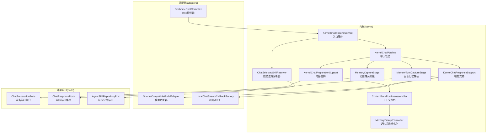

**图表来源**
- [KernelChatInboundService.java](file://seahorse-agent-kernel/src/main/java/com/miracle/ai/seahorse/agent/kernel/application/chat/KernelChatInboundService.java)
- [KernelChatPipeline.java](file://seahorse-agent-kernel/src/main/java/com/miracle/ai/seahorse/agent/kernel/application/chat/KernelChatPipeline.java)
- [KernelChatPreparationSupport.java](file://seahorse-agent-kernel/src/main/java/com/miracle/ai/seahorse/agent/kernel/application/chat/KernelChatPreparationSupport.java)
- [KernelChatResponseSupport.java](file://seahorse-agent-kernel/src/main/java/com/miracle/ai/seahorse/agent/kernel/application/chat/KernelChatResponseSupport.java)
- [ContextPackRuntimeAssembler.java](file://seahorse-agent-kernel/src/main/java/com/miracle/ai/seahorse/agent/kernel/application/chat/ContextPackRuntimeAssembler.java)
- [MemoryPromptFormatter.java](file://seahorse-agent-kernel/src/main/java/com/miracle/ai/seahorse/agent/kernel/domain/chat/MemoryPromptFormatter.java)
- [MemoryCaptureStage.java](file://seahorse-agent-kernel/src/main/java/com/miracle/ai/seahorse/agent/kernel/application/chat/MemoryCaptureStage.java)
- [MemoryTurnCaptureStage.java](file://seahorse-agent-kernel/src/main/java/com/miracle/ai/seahorse/agent/kernel/application/chat/MemoryTurnCaptureStage.java)
- [ChatSelectedSkillResolver.java](file://seahorse-agent-kernel/src/main/java/com/miracle/ai/seahorse/agent/kernel/application/chat/ChatSelectedSkillResolver.java)
- [OpenAiCompatibleModelAdapter.java](file://seahorse-agent-adapter-ai-openai-compatible/src/main/java/com/miracle/ai/seahorse/agent/adapters/ai/openai/OpenAiCompatibleModelAdapter.java)
- [LocalChatStreamCallbackFactory.java](file://seahorse-agent-adapter-web/src/main/java/com/miracle/ai/seahorse/agent/adapters/local/LocalChatStreamCallbackFactory.java)
- [SeahorseChatController.java](file://seahorse-agent-adapter-web/src/main/java/com/miracle/ai/seahorse/agent/adapters/web/SeahorseChatController.java)
- [ChatPreparationPorts.java](file://seahorse-agent-kernel/src/main/java/com/miracle/ai/seahorse/agent/kernel/application/chat/ChatPreparationPorts.java)
- [ChatResponsePorts.java](file://seahorse-agent-kernel/src/main/java/com/miracle/ai/seahorse/agent/kernel/application/chat/ChatResponsePorts.java)

**章节来源**
- [KernelChatInboundService.java](file://seahorse-agent-kernel/src/main/java/com/miracle/ai/seahorse/agent/kernel/application/chat/KernelChatInboundService.java)
- [KernelChatPipeline.java](file://seahorse-agent-kernel/src/main/java/com/miracle/ai/seahorse/agent/kernel/application/chat/KernelChatPipeline.java)
- [ChatSelectedSkillResolver.java](file://seahorse-agent-kernel/src/main/java/com/miracle/ai/seahorse/agent/kernel/application/chat/ChatSelectedSkillResolver.java)
- [StreamChatCommand.java](file://seahorse-agent-kernel/src/main/java/com/miracle/ai/seahorse/agent/ports/inbound/chat/StreamChatCommand.java)
- [SeahorseChatController.java](file://seahorse-agent-adapter-web/src/main/java/com/miracle/ai/seahorse/agent/adapters/web/SeahorseChatController.java)

## 核心组件
- 准备支持（KernelChatPreparationSupport）
  - 负责加载历史消息、激活记忆引擎、根据策略包装回调以进行记忆捕获。
- 响应支持（KernelChatResponseSupport）
  - 负责空检索回退策略、绑定流任务句柄、触发系统级响应或通用提示词回退。
- 聊天管道（KernelChatPipeline）
  - 协调准备、检索、模型调用、流式回调、记忆捕获与收尾的全流程编排。
- 记忆捕获阶段（MemoryCaptureStage / MemoryTurnCaptureStage）
  - 在回答完成或异常时，将候选记忆写入记忆引擎，避免在主链路直接写入噪声。
- 上下文打包（ContextPackRuntimeAssembler）
  - 将多层记忆按权重与来源组装为上下文包，供模型推理使用。
- 提示格式化（MemoryPromptFormatter）
  - 将记忆上下文格式化为可注入提示词的结构化文本。
- 模型适配器（OpenAiCompatibleModelAdapter）
  - 解析流式 SSE 数据，分发内容增量、思考内容与工具调用，保证流结束信号正确传递。
- 流回调工厂（LocalChatStreamCallbackFactory）
  - 将内部回调转换为前端可消费的事件流，包含元数据、完成事件与取消处理。
- 入口服务（KernelChatInboundService）
  - 接收外部请求，构建上下文并交由管道执行。
- 技能选择解析器（ChatSelectedSkillResolver）
  - **新增** 将用户选择的技能名称解析为受信任的技能运行时块，执行服务器端验证和注入策略。
- 端口集合（ChatPreparationPorts / ChatResponsePorts）
  - 定义准备与响应阶段所需的外部依赖契约（记忆、检索、流任务等）。

**章节来源**
- [KernelChatPreparationSupport.java](file://seahorse-agent-kernel/src/main/java/com/miracle/ai/seahorse/agent/kernel/application/chat/KernelChatPreparationSupport.java)
- [KernelChatResponseSupport.java](file://seahorse-agent-kernel/src/main/java/com/miracle/ai/seahorse/agent/kernel/application/chat/KernelChatResponseSupport.java)
- [KernelChatPipeline.java](file://seahorse-agent-kernel/src/main/java/com/miracle/ai/seahorse/agent/kernel/application/chat/KernelChatPipeline.java)
- [MemoryCaptureStage.java](file://seahorse-agent-kernel/src/main/java/com/miracle/ai/seahorse/agent/kernel/application/chat/MemoryCaptureStage.java)
- [MemoryTurnCaptureStage.java](file://seahorse-agent-kernel/src/main/java/com/miracle/ai/seahorse/agent/kernel/application/chat/MemoryTurnCaptureStage.java)
- [ContextPackRuntimeAssembler.java](file://seahorse-agent-kernel/src/main/java/com/miracle/ai/seahorse/agent/kernel/application/chat/ContextPackRuntimeAssembler.java)
- [MemoryPromptFormatter.java](file://seahorse-agent-kernel/src/main/java/com/miracle/ai/seahorse/agent/kernel/domain/chat/MemoryPromptFormatter.java)
- [OpenAiCompatibleModelAdapter.java](file://seahorse-agent-adapter-ai-openai-compatible/src/main/java/com/miracle/ai/seahorse/agent/adapters/ai/openai/OpenAiCompatibleModelAdapter.java)
- [LocalChatStreamCallbackFactory.java](file://seahorse-agent-adapter-web/src/main/java/com/miracle/ai/seahorse/agent/adapters/local/LocalChatStreamCallbackFactory.java)
- [KernelChatInboundService.java](file://seahorse-agent-kernel/src/main/java/com/miracle/ai/seahorse/agent/kernel/application/chat/KernelChatInboundService.java)
- [ChatSelectedSkillResolver.java](file://seahorse-agent-kernel/src/main/java/com/miracle/ai/seahorse/agent/kernel/application/chat/ChatSelectedSkillResolver.java)
- [ChatPreparationPorts.java](file://seahorse-agent-kernel/src/main/java/com/miracle/ai/seahorse/agent/kernel/application/chat/ChatPreparationPorts.java)
- [ChatResponsePorts.java](file://seahorse-agent-kernel/src/main/java/com/miracle/ai/seahorse/agent/kernel/application/chat/ChatResponsePorts.java)

## 架构总览
聊天应用服务采用"准备-执行-响应-收尾"的流水线式架构。入口服务接收请求，准备阶段加载历史与记忆，管道协调检索与模型调用，响应阶段根据检索结果选择直返或系统回退，收尾阶段进行记忆捕获与清理。新增的技能选择功能在入口服务处解析用户选择的技能，通过服务器端验证后注入到上下文中。

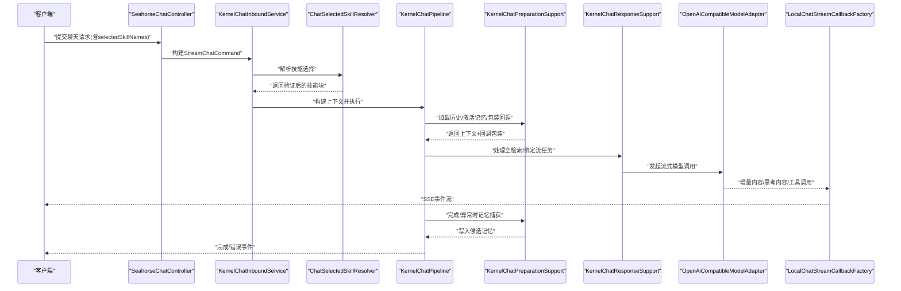

**图表来源**
- [SeahorseChatController.java](file://seahorse-agent-adapter-web/src/main/java/com/miracle/ai/seahorse/agent/adapters/web/SeahorseChatController.java)
- [KernelChatInboundService.java](file://seahorse-agent-kernel/src/main/java/com/miracle/ai/seahorse/agent/kernel/application/chat/KernelChatInboundService.java)
- [ChatSelectedSkillResolver.java](file://seahorse-agent-kernel/src/main/java/com/miracle/ai/seahorse/agent/kernel/application/chat/ChatSelectedSkillResolver.java)
- [KernelChatPipeline.java](file://seahorse-agent-kernel/src/main/java/com/miracle/ai/seahorse/agent/kernel/application/chat/KernelChatPipeline.java)
- [KernelChatPreparationSupport.java](file://seahorse-agent-kernel/src/main/java/com/miracle/ai/seahorse/agent/kernel/application/chat/KernelChatPreparationSupport.java)
- [KernelChatResponseSupport.java](file://seahorse-agent-kernel/src/main/java/com/miracle/ai/seahorse/agent/kernel/application/chat/KernelChatResponseSupport.java)
- [OpenAiCompatibleModelAdapter.java](file://seahorse-agent-adapter-ai-openai-compatible/src/main/java/com/miracle/ai/seahorse/agent/adapters/ai/openai/OpenAiCompatibleModelAdapter.java)
- [LocalChatStreamCallbackFactory.java](file://seahorse-agent-adapter-web/src/main/java/com/miracle/ai/seahorse/agent/adapters/local/LocalChatStreamCallbackFactory.java)

## 详细组件分析

### 准备阶段：历史加载与记忆激活
- 加载历史：从持久化存储加载对话历史，并追加当前用户问题，形成初始上下文。
- 激活记忆：基于会话与用户维度，向记忆引擎请求记忆上下文，用于后续提示词拼装。
- 回调包装：依据策略决定是否启用"回合记忆捕获"或"即时记忆捕获"，将原始回调包装为具备记忆写入能力的回调。

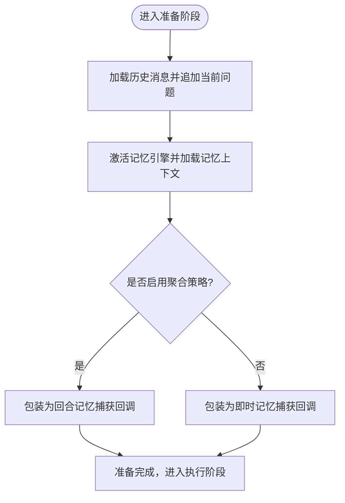

**图表来源**
- [KernelChatPreparationSupport.java](file://seahorse-agent-kernel/src/main/java/com/miracle/ai/seahorse/agent/kernel/application/chat/KernelChatPreparationSupport.java)
- [MemoryTurnCaptureStage.java](file://seahorse-agent-kernel/src/main/java/com/miracle/ai/seahorse/agent/kernel/application/chat/MemoryTurnCaptureStage.java)
- [MemoryCaptureStage.java](file://seahorse-agent-kernel/src/main/java/com/miracle/ai/seahorse/agent/kernel/application/chat/MemoryCaptureStage.java)

**章节来源**
- [KernelChatPreparationSupport.java](file://seahorse-agent-kernel/src/main/java/com/miracle/ai/seahorse/agent/kernel/application/chat/KernelChatPreparationSupport.java)

### 执行阶段：上下文组装与提示格式化
- 上下文组装：将记忆上下文与其他来源（如附件、规则优化等）合并，形成可注入提示词的候选集。
- 提示格式化：将多层记忆按优先级与来源格式化为统一文本，避免冲突并提升可读性。
- 管道编排：KernelChatPipeline协调准备、检索、模型调用与流式回调，确保各阶段有序衔接。

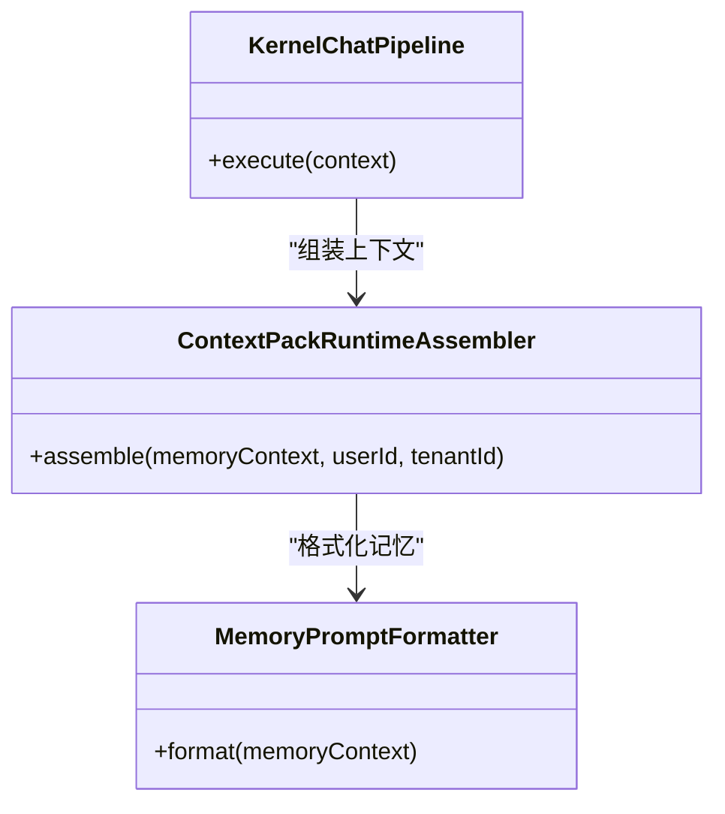

**图表来源**
- [ContextPackRuntimeAssembler.java](file://seahorse-agent-kernel/src/main/java/com/miracle/ai/seahorse/agent/kernel/application/chat/ContextPackRuntimeAssembler.java)
- [MemoryPromptFormatter.java](file://seahorse-agent-kernel/src/main/java/com/miracle/ai/seahorse/agent/kernel/domain/chat/MemoryPromptFormatter.java)
- [KernelChatPipeline.java](file://seahorse-agent-kernel/src/main/java/com/miracle/ai/seahorse/agent/kernel/application/chat/KernelChatPipeline.java)

**章节来源**
- [ContextPackRuntimeAssembler.java](file://seahorse-agent-kernel/src/main/java/com/miracle/ai/seahorse/agent/kernel/application/chat/ContextPackRuntimeAssembler.java)
- [MemoryPromptFormatter.java](file://seahorse-agent-kernel/src/main/java/com/miracle/ai/seahorse/agent/kernel/domain/chat/MemoryPromptFormatter.java)
- [KernelChatPipeline.java](file://seahorse-agent-kernel/src/main/java/com/miracle/ai/seahorse/agent/kernel/application/chat/KernelChatPipeline.java)

### 响应阶段：空检索回退与系统响应
- 空检索处理：当检索为空时，支持"静态消息"或"系统回退"两种策略。前者直接发送预设消息并完成；后者复用通用 system prompt 触发模型流式回复。
- 任务绑定：将流式任务句柄绑定到上下文，便于取消与状态管理。

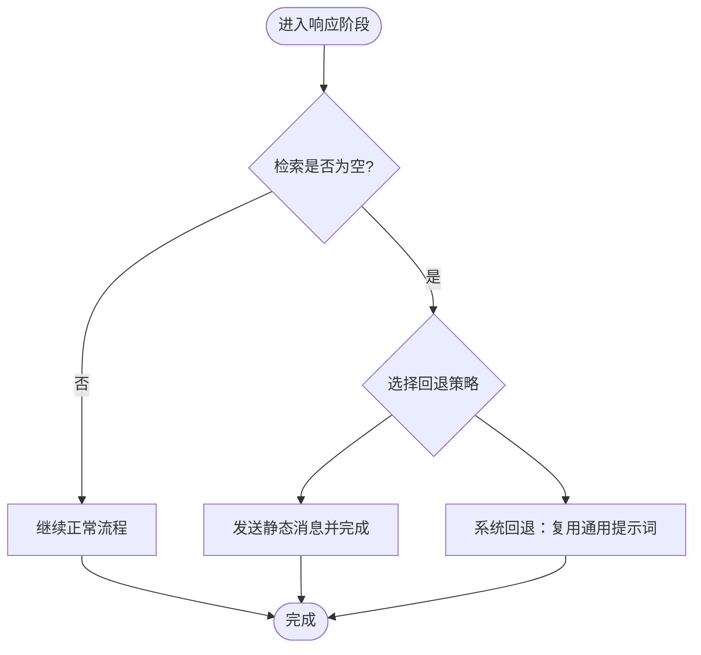

**图表来源**
- [KernelChatResponseSupport.java](file://seahorse-agent-kernel/src/main/java/com/miracle/ai/seahorse/agent/kernel/application/chat/KernelChatResponseSupport.java)

**章节来源**
- [KernelChatResponseSupport.java](file://seahorse-agent-kernel/src/main/java/com/miracle/ai/seahorse/agent/kernel/application/chat/KernelChatResponseSupport.java)

### 收尾阶段：记忆捕获与清理
- 完成捕获：在模型响应完成后，将候选记忆写入记忆引擎，由引擎判定可信度与落库策略。
- 异常捕获：若发生异常，同样提交候选记忆，避免丢失潜在有用信息。
- 清理与释放：完成或异常后，释放流任务资源，确保系统稳定。

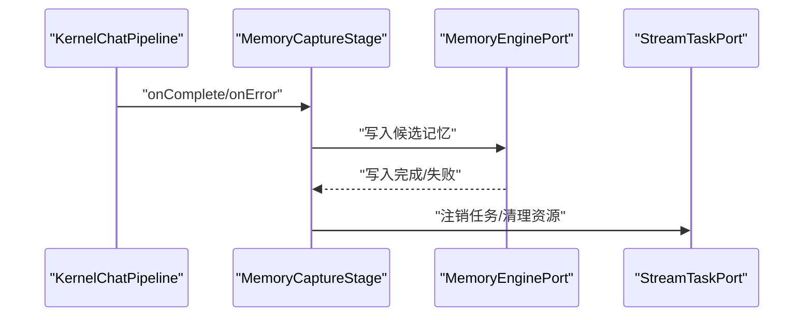

**图表来源**
- [MemoryCaptureStage.java](file://seahorse-agent-kernel/src/main/java/com/miracle/ai/seahorse/agent/kernel/application/chat/MemoryCaptureStage.java)
- [KernelChatPipeline.java](file://seahorse-agent-kernel/src/main/java/com/miracle/ai/seahorse/agent/kernel/application/chat/KernelChatPipeline.java)

**章节来源**
- [MemoryCaptureStage.java](file://seahorse-agent-kernel/src/main/java/com/miracle/ai/seahorse/agent/kernel/application/chat/MemoryCaptureStage.java)
- [KernelChatPipeline.java](file://seahorse-agent-kernel/src/main/java/com/miracle/ai/seahorse/agent/kernel/application/chat/KernelChatPipeline.java)

### 流式响应与前端交互
- 模型适配器：解析流式 SSE 数据，提取内容增量与思考内容，识别工具调用并正确处理结束信号。
- 流回调工厂：将内部回调转换为前端可消费的事件流，包含元数据、增量内容、完成与错误事件，并处理任务取消与注册。

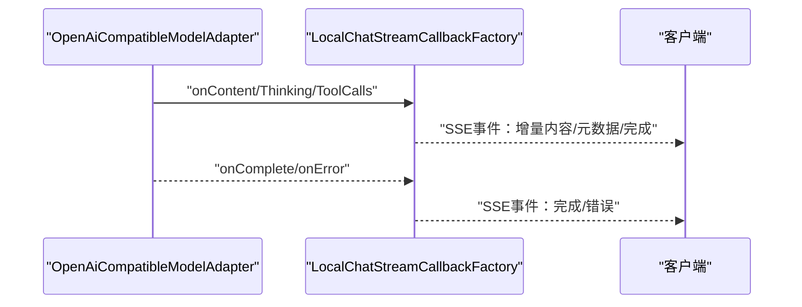

**图表来源**
- [OpenAiCompatibleModelAdapter.java](file://seahorse-agent-adapter-ai-openai-compatible/src/main/java/com/miracle/ai/seahorse/agent/adapters/ai/openai/OpenAiCompatibleModelAdapter.java)
- [LocalChatStreamCallbackFactory.java](file://seahorse-agent-adapter-web/src/main/java/com/miracle/ai/seahorse/agent/adapters/local/LocalChatStreamCallbackFactory.java)

**章节来源**
- [OpenAiCompatibleModelAdapter.java](file://seahorse-agent-adapter-ai-openai-compatible/src/main/java/com/miracle/ai/seahorse/agent/adapters/ai/openai/OpenAiCompatibleModelAdapter.java)
- [LocalChatStreamCallbackFactory.java](file://seahorse-agent-adapter-web/src/main/java/com/miracle/ai/seahorse/agent/adapters/local/LocalChatStreamCallbackFactory.java)

### 与记忆系统、检索系统、工具系统的协作
- 记忆系统：通过"回合记忆捕获"与"即时记忆捕获"在不阻塞主链路的前提下，将候选记忆写入引擎，由引擎完成可信度评估与落库。
- 检索系统：在空检索时提供回退策略，确保对话连续性；同时通过上下文打包将多源信息整合为提示词。
- 工具系统：模型适配器在解析流时收集工具调用，回调工厂负责将工具调用结果反馈给前端。

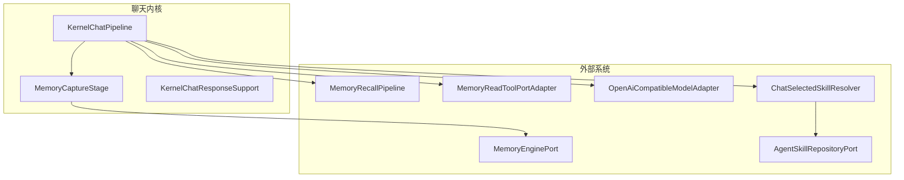

**图表来源**
- [KernelChatPipeline.java](file://seahorse-agent-kernel/src/main/java/com/miracle/ai/seahorse/agent/kernel/application/chat/KernelChatPipeline.java)
- [MemoryCaptureStage.java](file://seahorse-agent-kernel/src/main/java/com/miracle/ai/seahorse/agent/kernel/application/chat/MemoryCaptureStage.java)
- [KernelChatResponseSupport.java](file://seahorse-agent-kernel/src/main/java/com/miracle/ai/seahorse/agent/kernel/application/chat/KernelChatResponseSupport.java)
- [HybridMemoryRecallPipeline.java](file://seahorse-agent-kernel/src/main/java/com/miracle/ai/seahorse/agent/kernel/application/memory/retrieval/HybridMemoryRecallPipeline.java)
- [MemoryReadToolPortAdapter.java](file://seahorse-agent-kernel/src/main/java/com/miracle/ai/seahorse/agent/kernel/application/agent/tool/MemoryReadToolPortAdapter.java)
- [OpenAiCompatibleModelAdapter.java](file://seahorse-agent-adapter-ai-openai-compatible/src/main/java/com/miracle/ai/seahorse/agent/adapters/ai/openai/OpenAiCompatibleModelAdapter.java)
- [ChatSelectedSkillResolver.java](file://seahorse-agent-kernel/src/main/java/com/miracle/ai/seahorse/agent/kernel/application/chat/ChatSelectedSkillResolver.java)
- [AgentSkillRepositoryPort.java](file://seahorse-agent-kernel/src/main/java/com/miracle/ai/seahorse/agent/ports/outbound/agent/AgentSkillRepositoryPort.java)

**章节来源**
- [HybridMemoryRecallPipeline.java](file://seahorse-agent-kernel/src/main/java/com/miracle/ai/seahorse/agent/kernel/application/memory/retrieval/HybridMemoryRecallPipeline.java)
- [MemoryReadToolPortAdapter.java](file://seahorse-agent-kernel/src/main/java/com/miracle/ai/seahorse/agent/kernel/application/agent/tool/MemoryReadToolPortAdapter.java)

## 技能选择功能

### 技能选择解析器（ChatSelectedSkillResolver）
**新增** ChatSelectedSkillResolver负责将用户在聊天界面选择的技能名称解析为受信任的技能运行时块。该解析器执行严格的安全验证，确保只有启用且处于活动状态的技能才会被注入到聊天上下文中。

#### 核心特性
- **服务器端验证**：每个技能名称都经过服务器端重新验证，前端选择永远不可信
- **技能状态检查**：仅接受enabled=true且status=ACTIVE的技能
- **版本绑定**：获取技能的最新修订版本内容
- **注入策略**：根据内容长度和数量自动选择合适的注入模式

#### 注入策略
解析器采用预算驱动的注入策略：
- 当技能数量超过3个时，所有技能切换为元数据模式
- 当总内容长度超过阈值（默认12000字符）时，所有技能切换为元数据模式
- 否则使用元数据+正文的完整注入模式

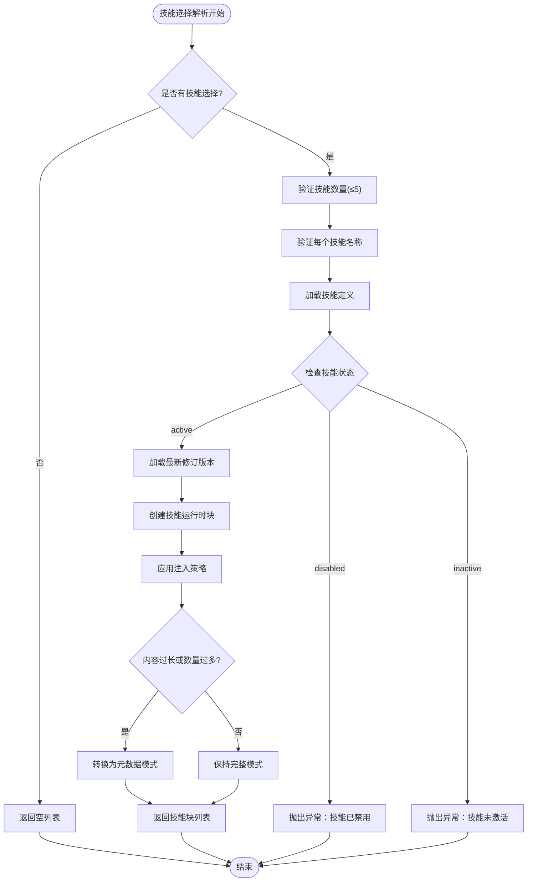

**图表来源**
- [ChatSelectedSkillResolver.java](file://seahorse-agent-kernel/src/main/java/com/miracle/ai/seahorse/agent/kernel/application/chat/ChatSelectedSkillResolver.java)

**章节来源**
- [ChatSelectedSkillResolver.java](file://seahorse-agent-kernel/src/main/java/com/miracle/ai/seahorse/agent/kernel/application/chat/ChatSelectedSkillResolver.java)

### StreamChatCommand中的技能选择支持
**新增** StreamChatCommand扩展了技能选择功能，支持用户在聊天请求中指定selectedSkillNames参数。该参数经过严格的规范化处理：

#### 规范化处理
- **大小写转换**：将所有字母转换为小写
- **下划线转连字符**：将下划线(_)转换为连字符(-)
- **去重处理**：移除重复的技能名称
- **空白字符清理**：去除前后空白字符
- **数量限制**：最多支持5个技能（防止滥用）

#### 参数验证
- 空值处理：null或空列表返回空结果
- 数量超限：超过5个技能时抛出IllegalArgumentException
- 格式验证：确保技能名称符合命名规范

**章节来源**
- [StreamChatCommand.java](file://seahorse-agent-kernel/src/main/java/com/miracle/ai/seahorse/agent/ports/inbound/chat/StreamChatCommand.java)

### KernelChatInboundService中的技能选择集成
**新增** KernelChatInboundService集成了技能选择功能，在聊天请求处理流程中增加了技能解析步骤：

#### 合并策略
解析器支持两种技能来源的合并：
- **版本绑定技能**：来自Agent版本快照的技能
- **每轮选择技能**：来自用户聊天输入的技能

合并规则：
- 版本绑定技能具有优先权，同名情况下版本绑定技能覆盖用户选择
- 如果只有版本绑定技能，直接使用版本技能
- 如果只有用户选择技能，直接使用用户技能
- 如果两者都有，先添加用户技能，再添加版本技能，确保版本技能优先

#### 错误处理
- 当用户提供了selectedSkillNames但解析器未配置时，抛出IllegalStateException
- 技能解析过程中的任何验证失败都会导致请求中断
- 支持优雅降级：即使技能选择失败，聊天仍可正常进行

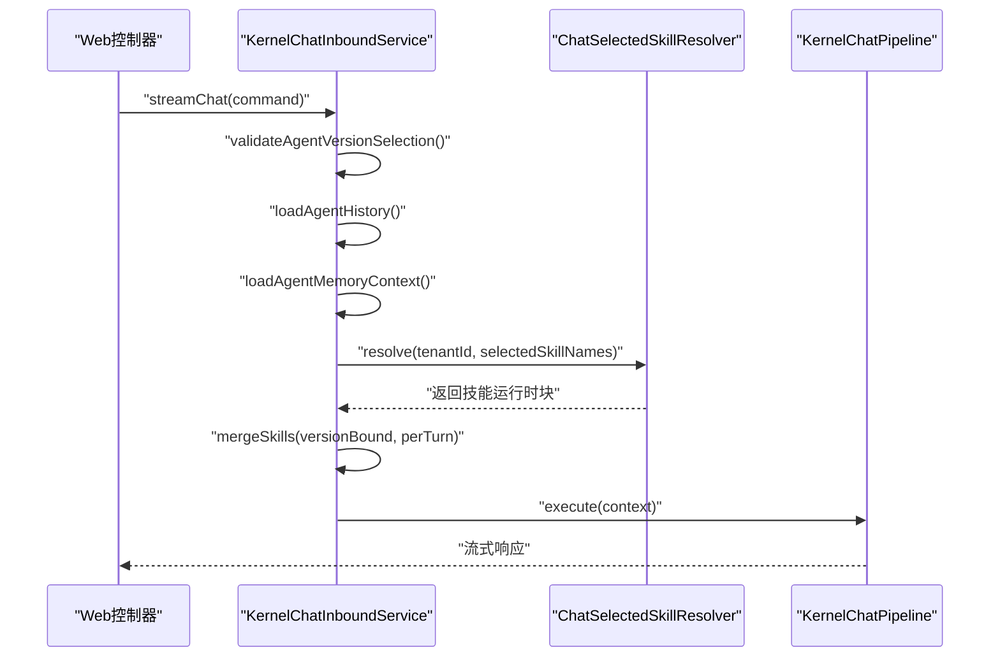

**图表来源**
- [KernelChatInboundService.java](file://seahorse-agent-kernel/src/main/java/com/miracle/ai/seahorse/agent/kernel/application/chat/KernelChatInboundService.java)
- [ChatSelectedSkillResolver.java](file://seahorse-agent-kernel/src/main/java/com/miracle/ai/seahorse/agent/kernel/application/chat/ChatSelectedSkillResolver.java)

**章节来源**
- [KernelChatInboundService.java](file://seahorse-agent-kernel/src/main/java/com/miracle/ai/seahorse/agent/kernel/application/chat/KernelChatInboundService.java)

### Web控制器中的技能选择支持
**新增** SeahorseChatController扩展了API端点，支持selectedSkillNames参数的传入和处理：

#### API端点
- **GET/POST /chat/stream**：支持selectedSkillNames查询参数
- **参数类型**：List<String>，支持多个技能名称
- **参数验证**：与StreamChatCommand相同的验证规则

#### 前端集成
- 前端可以传入多个技能名称，系统会自动进行规范化和去重
- 支持从技能面板直接选择技能，无需复杂的URL构造
- 技能选择状态会在整个聊天会话中保持有效

**章节来源**
- [SeahorseChatController.java](file://seahorse-agent-adapter-web/src/main/java/com/miracle/ai/seahorse/agent/adapters/web/SeahorseChatController.java)

## 依赖关系分析
- 组件耦合
  - KernelChatPipeline 依赖准备与响应支持，以及流回调工厂与模型适配器。
  - 准备支持依赖记忆端口与上下文打包器；响应支持依赖流任务端口与模型适配器。
  - 记忆捕获阶段依赖记忆引擎端口与上下文，确保在完成/异常时写入候选记忆。
  - **新增** KernelChatInboundService 依赖 ChatSelectedSkillResolver 进行技能解析。
  - ChatSelectedSkillResolver 依赖 AgentSkillRepositoryPort 进行技能查询。
- 外部依赖
  - 模型适配器负责解析不同供应商的流式输出协议。
  - 流回调工厂负责事件封装与前端交互。
  - 记忆系统与检索系统通过端口抽象接入，便于替换与扩展。
  - **新增** 技能系统通过 AgentSkillRepositoryPort 接入，支持技能的动态选择。

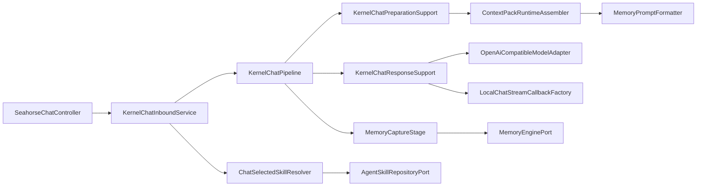

**图表来源**
- [KernelChatPipeline.java](file://seahorse-agent-kernel/src/main/java/com/miracle/ai/seahorse/agent/kernel/application/chat/KernelChatPipeline.java)
- [KernelChatPreparationSupport.java](file://seahorse-agent-kernel/src/main/java/com/miracle/ai/seahorse/agent/kernel/application/chat/KernelChatPreparationSupport.java)
- [KernelChatResponseSupport.java](file://seahorse-agent-kernel/src/main/java/com/miracle/ai/seahorse/agent/kernel/application/chat/KernelChatResponseSupport.java)
- [ContextPackRuntimeAssembler.java](file://seahorse-agent-kernel/src/main/java/com/miracle/ai/seahorse/agent/kernel/application/chat/ContextPackRuntimeAssembler.java)
- [MemoryPromptFormatter.java](file://seahorse-agent-kernel/src/main/java/com/miracle/ai/seahorse/agent/kernel/domain/chat/MemoryPromptFormatter.java)
- [MemoryCaptureStage.java](file://seahorse-agent-kernel/src/main/java/com/miracle/ai/seahorse/agent/kernel/application/chat/MemoryCaptureStage.java)
- [OpenAiCompatibleModelAdapter.java](file://seahorse-agent-adapter-ai-openai-compatible/src/main/java/com/miracle/ai/seahorse/agent/adapters/ai/openai/OpenAiCompatibleModelAdapter.java)
- [LocalChatStreamCallbackFactory.java](file://seahorse-agent-adapter-web/src/main/java/com/miracle/ai/seahorse/agent/adapters/local/LocalChatStreamCallbackFactory.java)
- [KernelChatInboundService.java](file://seahorse-agent-kernel/src/main/java/com/miracle/ai/seahorse/agent/kernel/application/chat/KernelChatInboundService.java)
- [ChatSelectedSkillResolver.java](file://seahorse-agent-kernel/src/main/java/com/miracle/ai/seahorse/agent/kernel/application/chat/ChatSelectedSkillResolver.java)
- [AgentSkillRepositoryPort.java](file://seahorse-agent-kernel/src/main/java/com/miracle/ai/seahorse/agent/ports/outbound/agent/AgentSkillRepositoryPort.java)
- [SeahorseChatController.java](file://seahorse-agent-adapter-web/src/main/java/com/miracle/ai/seahorse/agent/adapters/web/SeahorseChatController.java)

**章节来源**
- [KernelChatPipeline.java](file://seahorse-agent-kernel/src/main/java/com/miracle/ai/seahorse/agent/kernel/application/chat/KernelChatPipeline.java)
- [KernelChatPreparationSupport.java](file://seahorse-agent-kernel/src/main/java/com/miracle/ai/seahorse/agent/kernel/application/chat/KernelChatPreparationSupport.java)
- [KernelChatResponseSupport.java](file://seahorse-agent-kernel/src/main/java/com/miracle/ai/seahorse/agent/kernel/application/chat/KernelChatResponseSupport.java)
- [KernelChatInboundService.java](file://seahorse-agent-kernel/src/main/java/com/miracle/ai/seahorse/agent/kernel/application/chat/KernelChatInboundService.java)
- [ChatSelectedSkillResolver.java](file://seahorse-agent-kernel/src/main/java/com/miracle/ai/seahorse/agent/kernel/application/chat/ChatSelectedSkillResolver.java)

## 性能考量
- 流式处理：通过 SSE 流式传输减少首字节延迟，提升交互体验。
- 记忆写入异步化：在完成/异常时写入候选记忆，避免阻塞主链路。
- 上下文压缩：通过上下文打包与提示格式化，控制上下文长度与质量。
- 任务取消：在前端取消或异常场景下及时注销任务，释放资源。
- **新增** 技能注入优化：通过预算驱动的注入策略，避免过长的技能内容影响模型性能。
- **新增** 技能数量限制：默认最多5个技能，防止过度复杂化影响响应速度。

## 故障排查指南
- 流结束信号缺失
  - 现象：前端未收到完成事件。
  - 排查：检查模型适配器是否正确解析 [SSE 完成标记](file://seahorse-agent-adapter-ai-openai-compatible/src/main/java/com/miracle/ai/seahorse/agent/adapters/ai/openai/OpenAiCompatibleModelAdapter.java)，确认回调工厂是否发送完成与结束事件。
- 记忆未写入
  - 现象：对话结束后无记忆落库。
  - 排查：确认准备阶段是否正确包装回调，检查记忆捕获阶段在完成/异常时的触发条件。
- 空检索回退无效
  - 现象：检索为空时未回退。
  - 排查：验证响应支持中的空检索策略配置与执行分支。
- 前端事件异常
  - 现象：事件顺序错乱或重复。
  - 排查：检查流回调工厂的任务注册与注销逻辑，确保取消与完成事件的正确顺序。
- **新增** 技能选择失败
  - 现象：用户选择的技能无法生效。
  - 排查：检查 ChatSelectedSkillResolver 是否正确配置，验证技能状态和权限，确认注入策略是否触发。
- **新增** 技能数量超限
  - 现象：超过5个技能时请求被拒绝。
  - 排查：检查前端传参是否正确，确认规范化处理逻辑。
- **新增** 技能名称格式错误
  - 现象：技能名称包含非法字符或格式不正确。
  - 排查：验证技能名称的大小写转换和连字符处理，确认数据库中的技能名称格式。

**章节来源**
- [OpenAiCompatibleModelAdapter.java](file://seahorse-agent-adapter-ai-openai-compatible/src/main/java/com/miracle/ai/seahorse/agent/adapters/ai/openai/OpenAiCompatibleModelAdapter.java)
- [LocalChatStreamCallbackFactory.java](file://seahorse-agent-adapter-web/src/main/java/com/miracle/ai/seahorse/agent/adapters/local/LocalChatStreamCallbackFactory.java)
- [KernelChatResponseSupport.java](file://seahorse-agent-kernel/src/main/java/com/miracle/ai/seahorse/agent/kernel/application/chat/KernelChatResponseSupport.java)
- [MemoryCaptureStage.java](file://seahorse-agent-kernel/src/main/java/com/miracle/ai/seahorse/agent/kernel/application/chat/MemoryCaptureStage.java)
- [ChatSelectedSkillResolver.java](file://seahorse-agent-kernel/src/main/java/com/miracle/ai/seahorse/agent/kernel/application/chat/ChatSelectedSkillResolver.java)
- [KernelChatInboundService.java](file://seahorse-agent-kernel/src/main/java/com/miracle/ai/seahorse/agent/kernel/application/chat/KernelChatInboundService.java)

## 结论
聊天应用服务通过清晰的准备-执行-响应-收尾四段式架构，实现了从用户输入到模型推理再到流式响应与记忆捕获的完整闭环。准备阶段加载历史与记忆，执行阶段整合多源上下文，响应阶段提供空检索回退，收尾阶段在不影响主链路的前提下完成记忆捕获。

**更新** 新增的技能选择功能进一步增强了聊天系统的智能化水平。通过服务器端验证的技能选择机制，用户可以在聊天过程中动态选择特定技能，系统会自动进行安全验证和注入优化，确保技能内容不会影响模型性能。该功能既保持了用户体验的灵活性，又确保了系统的安全性和稳定性。

## 附录
- 测试参考
  - 单元测试覆盖了空检索回退、记忆捕获时机与异常场景，可作为行为验证的参考。
  - **新增** 技能选择功能的单元测试和集成测试，验证解析器的正确性和端到端流程。

**章节来源**
- [KernelChatPipelineTests.java](file://seahorse-agent-tests/src/test/java/com/miracle/ai/seahorse/agent/kernel/application/chat/KernelChatPipelineTests.java)
- [KernelChatSkillSelectionTests.java](file://seahorse-agent-kernel/src/test/java/com/miracle/ai/seahorse/agent/kernel/application/chat/KernelChatSkillSelectionTests.java)
- [ChatSelectedSkillResolverTests.java](file://seahorse-agent-kernel/src/test/java/com/miracle/ai/seahorse/agent/kernel/application/chat/ChatSelectedSkillResolverTests.java)