# 计费系统

<cite>
**本文档引用的文件**
- [04-billing.md](file://docs/aegis/plans/saas-mvp-impl/04-billing.md)
- [V5__billing_tables.sql](file://resources/database/migrations/V5__billing_tables.sql)
- [KernelBillingService.java](file://seahorse-agent-kernel/src/main/java/com/miracle/ai/seahorse/agent/kernel/application/billing/KernelBillingService.java)
- [KernelPaymentService.java](file://seahorse-agent-kernel/src/main/java/com/miracle/ai/seahorse/agent/kernel/application/billing/KernelPaymentService.java)
- [KernelSubscriptionService.java](file://seahorse-agent-kernel/src/main/java/com/miracle/ai/seahorse/agent/kernel/application/billing/KernelSubscriptionService.java)
- [QuotaEnforcementService.java](file://seahorse-agent-kernel/src/main/java/com/miracle/ai/seahorse/agent/kernel/application/billing/QuotaEnforcementService.java)
- [KernelQuotaDecisionService.java](file://seahorse-agent-kernel/src/main/java/com/miracle/ai/seahorse/agent/kernel/application/agent/quota/KernelQuotaDecisionService.java)
- [QuotaExceededException.java](file://seahorse-agent-kernel/src/main/java/com/miracle/ai/seahorse/agent/kernel/domain/billing/QuotaExceededException.java)
- [QuotaDecisionResult.java](file://seahorse-agent-kernel/src/main/java/com/miracle/ai/seahorse/agent/kernel/domain/agent/quota/QuotaDecisionResult.java)
- [QuotaDecisionCommand.java](file://seahorse-agent-kernel/src/main/java/com/miracle/ai/seahorse/agent/ports/inbound/agent/QuotaDecisionCommand.java)
- [QuotaDecisionEffect.java](file://seahorse-agent-kernel/src/main/java/com/miracle/ai/seahorse/agent/kernel/domain/agent/quota/QuotaDecisionEffect.java)
- [QuotaPolicy.java](file://seahorse-agent-kernel/src/main/java/com/miracle/ai/seahorse/agent/kernel/domain/agent/quota/QuotaPolicy.java)
- [Bill.java](file://seahorse-agent-kernel/src/main/java/com/miracle/ai/seahorse/agent/kernel/domain/billing/Bill.java)
- [BillLineItem.java](file://seahorse-agent-kernel/src/main/java/com/miracle/ai/seahorse/agent/kernel/domain/billing/BillLineItem.java)
- [PaymentOrder.java](file://seahorse-agent-kernel/src/main/java/com/miracle/ai/seahorse/agent/kernel/domain/billing/PaymentOrder.java)
- [Subscription.java](file://seahorse-agent-kernel/src/main/java/com/miracle/ai/seahorse/agent/kernel/domain/billing/Subscription.java)
- [SubscriptionPlan.java](file://seahorse-agent-kernel/src/main/java/com/miracle/ai/seahorse/agent/kernel/domain/billing/SubscriptionPlan.java)
- [BillingInboundPort.java](file://seahorse-agent-kernel/src/main/java/com/miracle/ai/seahorse/agent/ports/inbound/billing/BillingInboundPort.java)
- [PaymentInboundPort.java](file://seahorse-agent-kernel/src/main/java/com/miracle/ai/seahorse/agent/ports/inbound/billing/PaymentInboundPort.java)
- [SubscriptionInboundPort.java](file://seahorse-agent-kernel/src/main/java/com/miracle/ai/seahorse/agent/ports/inbound/billing/SubscriptionInboundPort.java)
- [BillRepositoryPort.java](file://seahorse-agent-kernel/src/main/java/com/miracle/ai/seahorse/agent/ports/outbound/billing/BillRepositoryPort.java)
- [PaymentOrderRepositoryPort.java](file://seahorse-agent-kernel/src/main/java/com/miracle/ai/seahorse/agent/ports/outbound/billing/PaymentOrderRepositoryPort.java)
- [SubscriptionRepositoryPort.java](file://seahorse-agent-kernel/src/main/java/com/miracle/ai/seahorse/agent/ports/outbound/billing/SubscriptionRepositoryPort.java)
- [JdbcCostUsageRepositoryAdapter.java](file://seahorse-agent-adapter-repository-jdbc/src/main/java/com/miracle/ai/seahorse/agent/adapters/repository/jdbc/JdbcCostUsageRepositoryAdapter.java)
</cite>

## 更新摘要
**所做更改**
- 新增配额强制执行系统章节，详细介绍QuotaEnforcementService的fail-open设计原则
- 添加存储配额、令牌配额和并发限制检查的详细说明
- 新增标准化错误码和升级提示机制
- 更新架构图以反映新的配额强制执行流程
- 添加配额超限HTTP 402响应处理机制

## 目录
1. [简介](#简介)
2. [项目结构](#项目结构)
3. [核心组件](#核心组件)
4. [架构概览](#架构概览)
5. [详细组件分析](#详细组件分析)
6. [配额强制执行系统](#配额强制执行系统)
7. [依赖关系分析](#依赖关系分析)
8. [性能考虑](#性能考虑)
9. [故障排除指南](#故障排除指南)
10. [结论](#结论)

## 简介

计费系统是 SeaHorse Agent 企业级 AI 基础设施中的核心模块，负责处理订阅管理、支付处理、使用量统计和账单生成等功能。该系统采用分层架构设计，实现了完整的 SaaS 计费生命周期管理。

**更新** 系统现已集成配额强制执行系统，通过QuotaEnforcementService实现fail-open设计原则，确保在配额检查服务不可用时系统仍能正常运行。

系统主要包含四个核心功能模块：
- **订阅管理**：处理用户订阅计划的激活、管理和续期
- **支付处理**：支持多种支付渠道的订单创建、支付和回调处理
- **账单生成**：基于使用量统计自动生成月度账单
- **配额强制执行**：实时监控和控制用户资源使用，防止超限额使用

## 项目结构

计费系统采用清晰的分层架构，按照职责分离的原则组织代码：

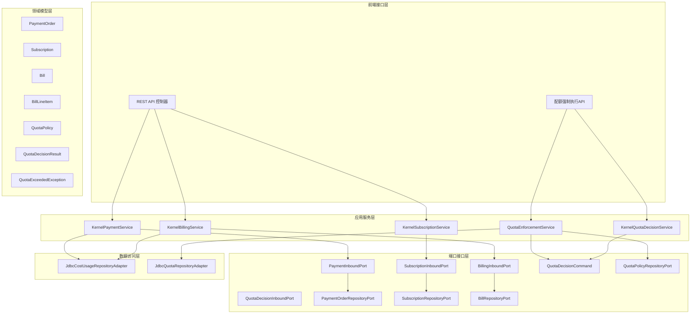

**图表来源**
- [KernelPaymentService.java:578-590](file://seahorse-agent-kernel/src/main/java/com/miracle/ai/seahorse/agent/kernel/application/billing/KernelPaymentService.java#L578-L590)
- [KernelBillingService.java:592-598](file://seahorse-agent-kernel/src/main/java/com/miracle/ai/seahorse/agent/kernel/application/billing/KernelBillingService.java#L592-L598)
- [KernelSubscriptionService.java:555-576](file://seahorse-agent-kernel/src/main/java/com/miracle/ai/seahorse/agent/kernel/application/billing/KernelSubscriptionService.java#L555-L576)
- [QuotaEnforcementService.java:36-120](file://seahorse-agent-kernel/src/main/java/com/miracle/ai/seahorse/agent/kernel/application/billing/QuotaEnforcementService.java#L36-L120)

**章节来源**
- [KernelPaymentService.java:578-590](file://seahorse-agent-kernel/src/main/java/com/miracle/ai/seahorse/agent/kernel/application/billing/KernelPaymentService.java#L578-L590)
- [KernelBillingService.java:592-598](file://seahorse-agent-kernel/src/main/java/com/miracle/ai/seahorse/agent/kernel/application/billing/KernelBillingService.java#L592-L598)
- [KernelSubscriptionService.java:555-576](file://seahorse-agent-kernel/src/main/java/com/miracle/ai/seahorse/agent/kernel/application/billing/KernelSubscriptionService.java#L555-L576)
- [QuotaEnforcementService.java:36-120](file://seahorse-agent-kernel/src/main/java/com/miracle/ai/seahorse/agent/kernel/application/billing/QuotaEnforcementService.java#L36-L120)

## 核心组件

### 支付订单管理

支付订单是计费系统的核心实体，负责跟踪用户的支付请求状态和相关信息。

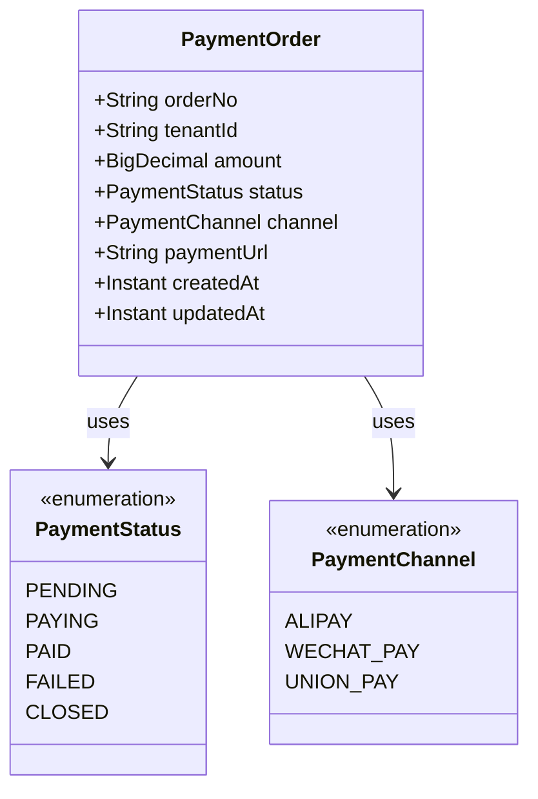

**图表来源**
- [PaymentOrder.java](file://seahorse-agent-kernel/src/main/java/com/miracle/ai/seahorse/agent/kernel/domain/billing/PaymentOrder.java)

### 订阅管理

订阅系统负责管理用户的套餐计划和配额限制。

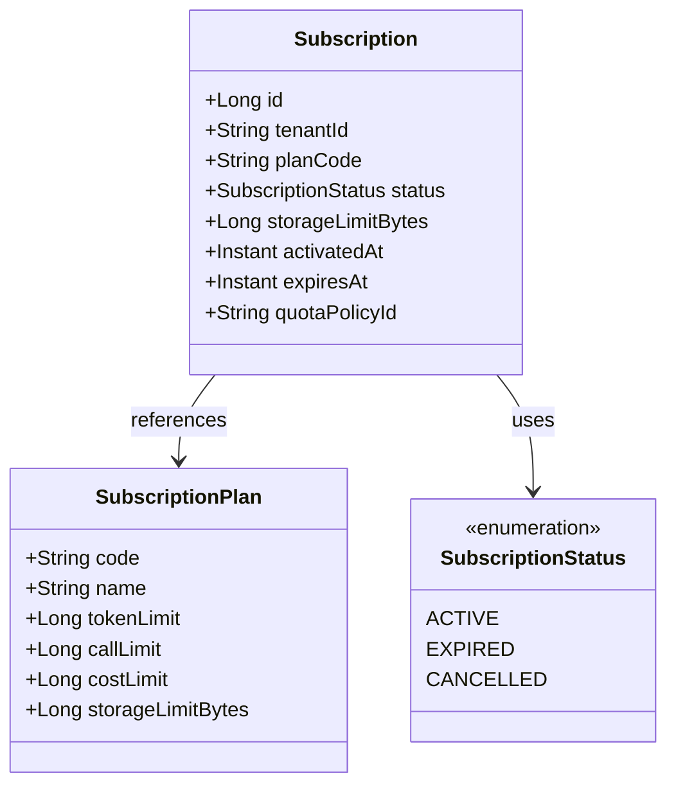

**图表来源**
- [Subscription.java](file://seahorse-agent-kernel/src/main/java/com/miracle/ai/seahorse/agent/kernel/domain/billing/Subscription.java)
- [SubscriptionPlan.java](file://seahorse-agent-kernel/src/main/java/com/miracle/ai/seahorse/agent/kernel/domain/billing/SubscriptionPlan.java)

### 账单管理

账单系统负责生成和管理用户的月度账单。

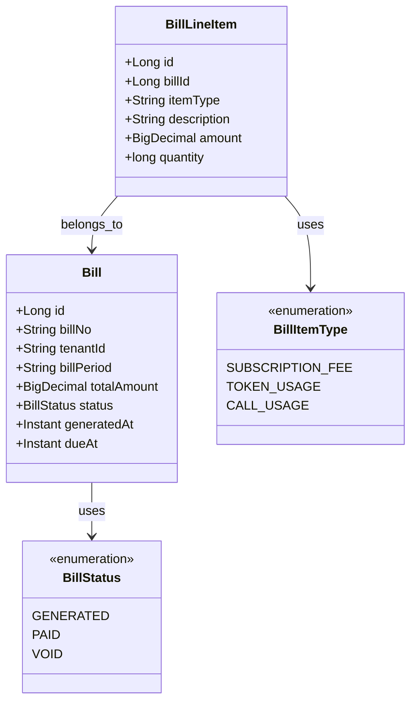

**图表来源**
- [Bill.java](file://seahorse-agent-kernel/src/main/java/com/miracle/ai/seahorse/agent/kernel/domain/billing/Bill.java)
- [BillLineItem.java](file://seahorse-agent-kernel/src/main/java/com/miracle/ai/seahorse/agent/kernel/domain/billing/BillLineItem.java)

**章节来源**
- [PaymentOrder.java](file://seahorse-agent-kernel/src/main/java/com/miracle/ai/seahorse/agent/kernel/domain/billing/PaymentOrder.java)
- [Subscription.java](file://seahorse-agent-kernel/src/main/java/com/miracle/ai/seahorse/agent/kernel/domain/billing/Subscription.java)
- [Bill.java](file://seahorse-agent-kernel/src/main/java/com/miracle/ai/seahorse/agent/kernel/domain/billing/Bill.java)
- [BillLineItem.java](file://seahorse-agent-kernel/src/main/java/com/miracle/ai/seahorse/agent/kernel/domain/billing/BillLineItem.java)

## 架构概览

计费系统采用 Clean Architecture 设计模式，实现了清晰的层次分离和依赖倒置原则。新增的配额强制执行系统通过fail-open设计原则确保系统稳定性。

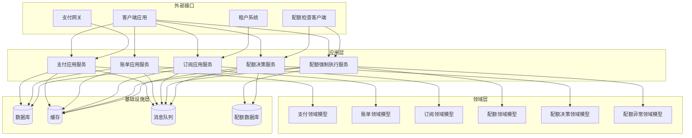

**图表来源**
- [KernelPaymentService.java:578-590](file://seahorse-agent-kernel/src/main/java/com/miracle/ai/seahorse/agent/kernel/application/billing/KernelPaymentService.java#L578-L590)
- [KernelBillingService.java:592-598](file://seahorse-agent-kernel/src/main/java/com/miracle/ai/seahorse/agent/kernel/application/billing/KernelBillingService.java#L592-L598)
- [KernelSubscriptionService.java:555-576](file://seahorse-agent-kernel/src/main/java/com/miracle/ai/seahorse/agent/kernel/application/billing/KernelSubscriptionService.java#L555-L576)
- [QuotaEnforcementService.java:36-120](file://seahorse-agent-kernel/src/main/java/com/miracle/ai/seahorse/agent/kernel/application/billing/QuotaEnforcementService.java#L36-L120)

## 详细组件分析

### 支付处理流程

支付处理是计费系统中最复杂的流程之一，涉及多个步骤和状态转换。

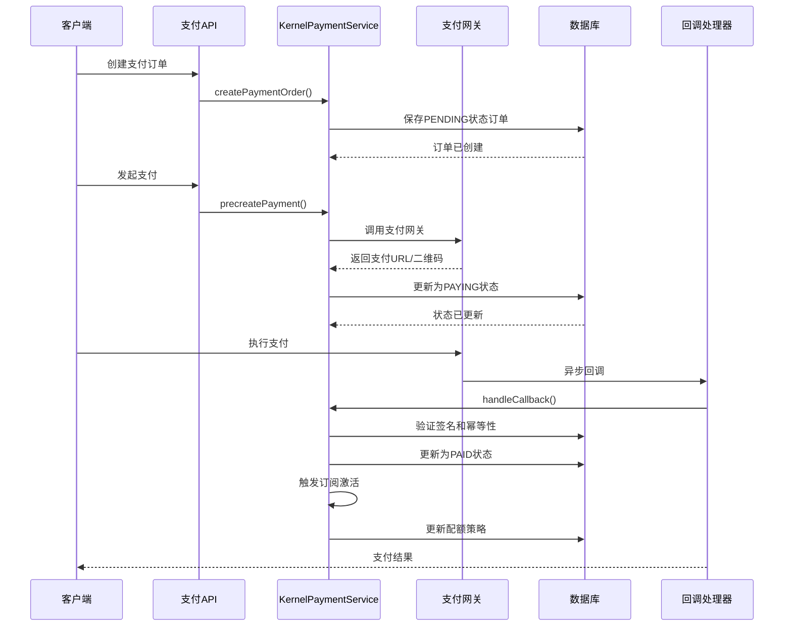

**图表来源**
- [04-billing.md:244-249](file://docs/aegis/plans/saas-mvp-impl/04-billing.md#L244-L249)
- [KernelPaymentService.java:578-590](file://seahorse-agent-kernel/src/main/java/com/miracle/ai/seahorse/agent/kernel/application/billing/KernelPaymentService.java#L578-L590)

### 订阅激活流程

订阅激活流程相对简单，主要是将套餐信息转换为配额策略。

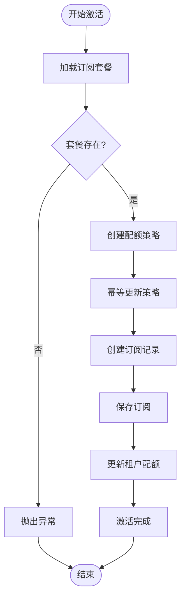

**图表来源**
- [KernelSubscriptionService.java:562-575](file://seahorse-agent-kernel/src/main/java/com/miracle/ai/seahorse/agent/kernel/application/billing/KernelSubscriptionService.java#L562-L575)

### 账单生成流程

账单生成是一个定时任务，每月自动运行生成上个月的账单。

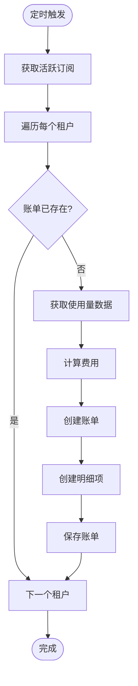

**图表来源**
- [04-billing.md:253-256](file://docs/aegis/plans/saas-mvp-impl/04-billing.md#L253-L256)
- [KernelBillingService.java:592-598](file://seahorse-agent-kernel/src/main/java/com/miracle/ai/seahorse/agent/kernel/application/billing/KernelBillingService.java#L592-L598)

**章节来源**
- [04-billing.md:244-256](file://docs/aegis/plans/saas-mvp-impl/04-billing.md#L244-L256)
- [KernelPaymentService.java:578-590](file://seahorse-agent-kernel/src/main/java/com/miracle/ai/seahorse/agent/kernel/application/billing/KernelPaymentService.java#L578-L590)
- [KernelSubscriptionService.java:555-576](file://seahorse-agent-kernel/src/main/java/com/miracle/ai/seahorse/agent/kernel/application/billing/KernelSubscriptionService.java#L555-L576)
- [KernelBillingService.java:592-598](file://seahorse-agent-kernel/src/main/java/com/miracle/ai/seahorse/agent/kernel/application/billing/KernelBillingService.java#L592-L598)

## 配额强制执行系统

**新增** 配额强制执行系统是计费系统的重要组成部分，通过QuotaEnforcementService实现fail-open设计原则，确保在配额检查服务不可用时系统仍能正常运行。

### QuotaEnforcementService 设计原理

QuotaEnforcementService采用fail-open设计原则，这意味着当配额检查服务暂时不可用或发生错误时，系统不会阻止用户操作，而是允许操作继续进行并记录相关事件。

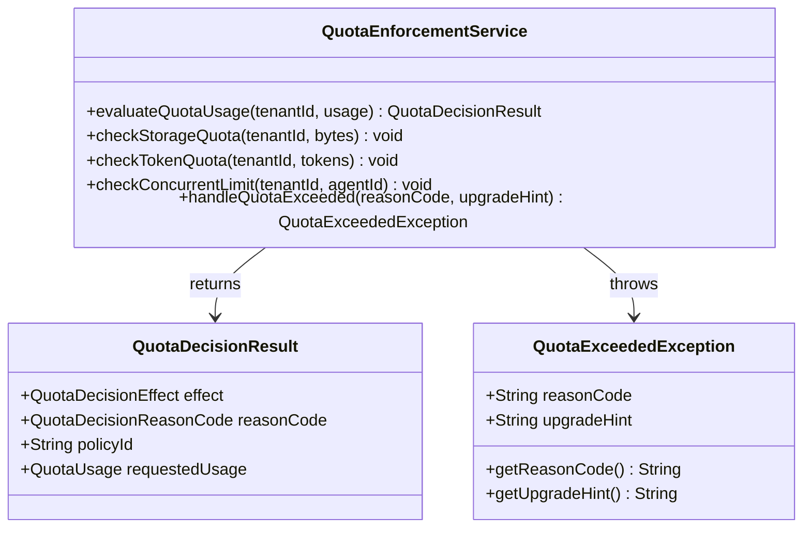

**图表来源**
- [QuotaEnforcementService.java:36-120](file://seahorse-agent-kernel/src/main/java/com/miracle/ai/seahorse/agent/kernel/application/billing/QuotaEnforcementService.java#L36-L120)
- [QuotaDecisionResult.java](file://seahorse-agent-kernel/src/main/java/com/miracle/ai/seahorse/agent/kernel/domain/agent/quota/QuotaDecisionResult.java)
- [QuotaExceededException.java](file://seahorse-agent-kernel/src/main/java/com/miracle/ai/seahorse/agent/kernel/domain/billing/QuotaExceededException.java)

### 配额类型和检查机制

系统支持三种主要类型的配额检查：

#### 存储配额检查
存储配额用于限制用户可以使用的存储空间大小，通常以字节为单位计量。

#### 令牌配额检查  
令牌配额用于限制用户的API调用次数或令牌消耗量，适用于基于令牌计费的服务。

#### 并发限制检查
并发限制检查用于控制同时运行的代理实例数量，防止系统过载。

### 配额超限处理流程

当检测到配额超限时，系统会返回HTTP 402响应，并提供标准化的错误码和升级提示。

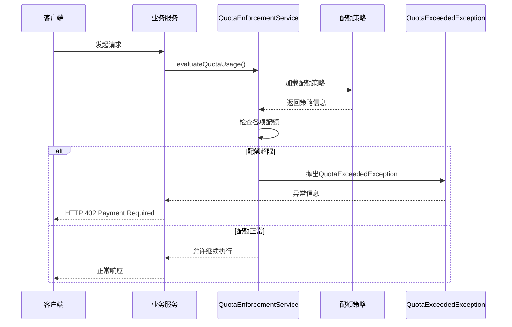

**图表来源**
- [QuotaEnforcementService.java:80-120](file://seahorse-agent-kernel/src/main/java/com/miracle/ai/seahorse/agent/kernel/application/billing/QuotaEnforcementService.java#L80-L120)
- [QuotaExceededException.java:30-70](file://seahorse-agent-kernel/src/main/java/com/miracle/ai/seahorse/agent/kernel/domain/billing/QuotaExceededException.java#L30-L70)

### 标准化错误码

系统定义了标准化的错误码来标识不同类型的配额超限情况：

- **TOKEN_LIMIT_EXCEEDED**：令牌配额超限
- **STORAGE_LIMIT_EXCEEDED**：存储配额超限  
- **CONCURRENT_LIMIT_EXCEEDED**：并发限制超限
- **POLICY_DISABLED**：配额策略被禁用
- **HARD_LIMIT_EXCEEDED**：硬限制超限

### 升级提示机制

当配额超限时，系统会提供人性化的升级建议，帮助用户了解如何解决配额问题：

- **基础套餐升级**：推荐更高级别的套餐
- **按量付费选项**：提供临时的额外配额
- **批量购买折扣**：鼓励用户购买更多配额获得折扣

**章节来源**
- [QuotaEnforcementService.java:36-120](file://seahorse-agent-kernel/src/main/java/com/miracle/ai/seahorse/agent/kernel/application/billing/QuotaEnforcementService.java#L36-L120)
- [KernelQuotaDecisionService.java:77-141](file://seahorse-agent-kernel/src/main/java/com/miracle/ai/seahorse/agent/kernel/application/agent/quota/KernelQuotaDecisionService.java#L77-L141)
- [QuotaExceededException.java:30-70](file://seahorse-agent-kernel/src/main/java/com/miracle/ai/seahorse/agent/kernel/domain/billing/QuotaExceededException.java#L30-L70)
- [QuotaDecisionResult.java](file://seahorse-agent-kernel/src/main/java/com/miracle/ai/seahorse/agent/kernel/domain/agent/quota/QuotaDecisionResult.java)
- [QuotaPolicy.java](file://seahorse-agent-kernel/src/main/java/com/miracle/ai/seahorse/agent/kernel/domain/agent/quota/QuotaPolicy.java)

## 依赖关系分析

计费系统的依赖关系遵循依赖倒置原则，通过端口接口实现松耦合。新增的配额强制执行系统进一步增强了系统的模块化程度。

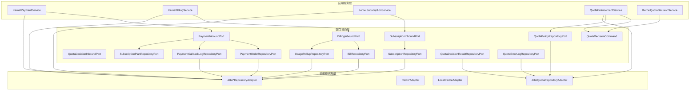

**图表来源**
- [PaymentInboundPort.java](file://seahorse-agent-kernel/src/main/java/com/miracle/ai/seahorse/agent/ports/inbound/billing/PaymentInboundPort.java)
- [SubscriptionInboundPort.java](file://seahorse-agent-kernel/src/main/java/com/miracle/ai/seahorse/agent/ports/inbound/billing/SubscriptionInboundPort.java)
- [BillingInboundPort.java](file://seahorse-agent-kernel/src/main/java/com/miracle/ai/seahorse/agent/ports/inbound/billing/BillingInboundPort.java)
- [QuotaEnforcementService.java:36-120](file://seahorse-agent-kernel/src/main/java/com/miracle/ai/seahorse/agent/kernel/application/billing/QuotaEnforcementService.java#L36-L120)

**章节来源**
- [PaymentInboundPort.java](file://seahorse-agent-kernel/src/main/java/com/miracle/ai/seahorse/agent/ports/inbound/billing/PaymentInboundPort.java)
- [SubscriptionInboundPort.java](file://seahorse-agent-kernel/src/main/java/com/miracle/ai/seahorse/agent/ports/inbound/billing/SubscriptionInboundPort.java)
- [BillingInboundPort.java](file://seahorse-agent-kernel/src/main/java/com/miracle/ai/seahorse/agent/ports/inbound/billing/BillingInboundPort.java)
- [QuotaEnforcementService.java:36-120](file://seahorse-agent-kernel/src/main/java/com/miracle/ai/seahorse/agent/kernel/application/billing/QuotaEnforcementService.java#L36-L120)

## 性能考虑

计费系统在设计时充分考虑了性能优化，新增的配额强制执行系统也采用了多项性能优化策略：

### 数据库优化
- 使用适当的索引策略优化查询性能
- 实现批量操作减少数据库往返次数
- 采用分页查询处理大量数据

### 缓存策略
- 使用本地缓存减少重复查询
- 实现分布式缓存支持多节点部署
- 设置合理的缓存失效策略

### 异步处理
- 支付回调采用异步处理避免阻塞
- 账单生成使用定时任务异步执行
- 使用消息队列解耦系统组件

### 配额检查优化
- **缓存预热**：启动时预加载常用配额策略到内存
- **批量检查**：支持批量配额检查减少数据库访问
- **智能降级**：配额检查服务不可用时自动降级为宽松模式
- **异步日志**：配额超限事件异步记录避免影响主流程

## 故障排除指南

### 支付回调问题
当支付回调无法正常处理时，需要检查以下方面：
1. 验签算法是否正确实现
2. 幂等性检查逻辑
3. 数据库事务一致性
4. 错误重试机制

### 订阅激活失败
订阅激活失败的常见原因：
1. 套餐代码不存在
2. 配额策略更新失败
3. 订阅记录保存异常
4. 时钟同步问题

### 账单生成异常
账单生成异常排查：
1. 定时任务调度问题
2. 使用量聚合数据缺失
3. 账单幂等性检查
4. 数据库连接问题

### 配额强制执行问题
**新增** 配额强制执行系统的故障排除：

#### 配额检查失败
当配额检查服务不可用时：
1. 检查配额数据库连接状态
2. 验证配额策略表结构完整性
3. 查看配额检查服务日志
4. 确认fail-open机制正常工作

#### 配额超限误报
当出现配额超限误报时：
1. 检查配额使用统计的准确性
2. 验证配额策略的正确性
3. 确认时间窗口计算的正确性
4. 查看配额缓存的一致性

#### 升级提示不准确
当升级提示信息不准确时：
1. 检查订阅计划配置
2. 验证套餐价格信息
3. 确认升级路径的有效性
4. 查看用户历史使用记录

**章节来源**
- [04-billing.md:244-249](file://docs/aegis/plans/saas-mvp-impl/04-billing.md#L244-L249)
- [QuotaEnforcementService.java:36-120](file://seahorse-agent-kernel/src/main/java/com/miracle/ai/seahorse/agent/kernel/application/billing/QuotaEnforcementService.java#L36-L120)
- [QuotaExceededException.java:30-70](file://seahorse-agent-kernel/src/main/java/com/miracle/ai/seahorse/agent/kernel/domain/billing/QuotaExceededException.java#L30-L70)

## 结论

SeaHorse Agent 的计费系统是一个设计精良的企业级解决方案，具有以下特点：

1. **模块化设计**：清晰的分层架构便于维护和扩展
2. **高可用性**：完善的错误处理和重试机制，特别是新增的fail-open设计原则
3. **可扩展性**：基于端口接口的设计支持多种适配器实现
4. **性能优化**：合理的缓存策略和异步处理机制
5. **智能化管理**：新增的配额强制执行系统提供精细化的资源控制

**更新** 新增的配额强制执行系统通过fail-open设计原则确保了系统的稳定性和可靠性，即使在配额检查服务出现问题时也能保证基本功能的正常运行。系统支持存储配额、令牌配额和并发限制检查，并提供了标准化的错误码和人性化的升级提示，为企业用户提供更加完善和可靠的计费服务。

该系统为 SeaHorse Agent 提供了完整的 SaaS 计费能力，支持多种支付方式和灵活的订阅管理，配合智能的配额控制系统，能够有效防止资源滥用，确保系统的稳定运行。