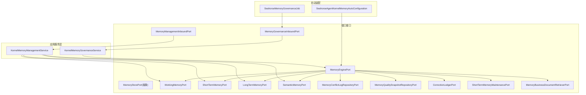
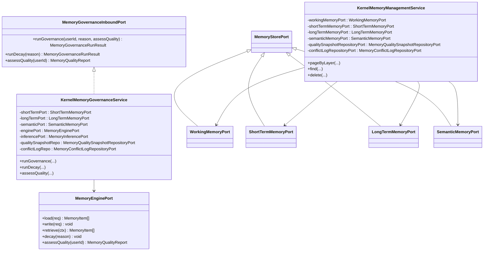
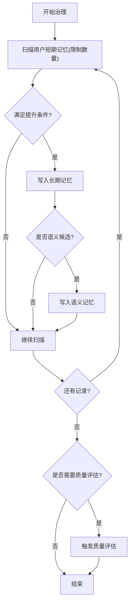
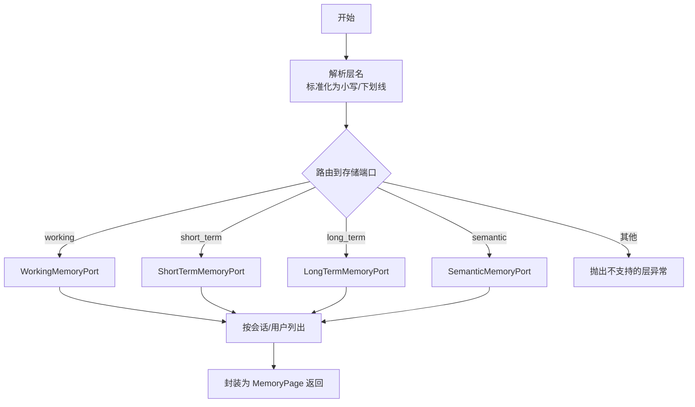
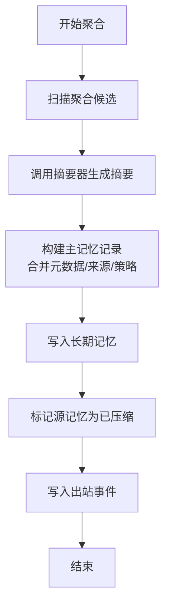
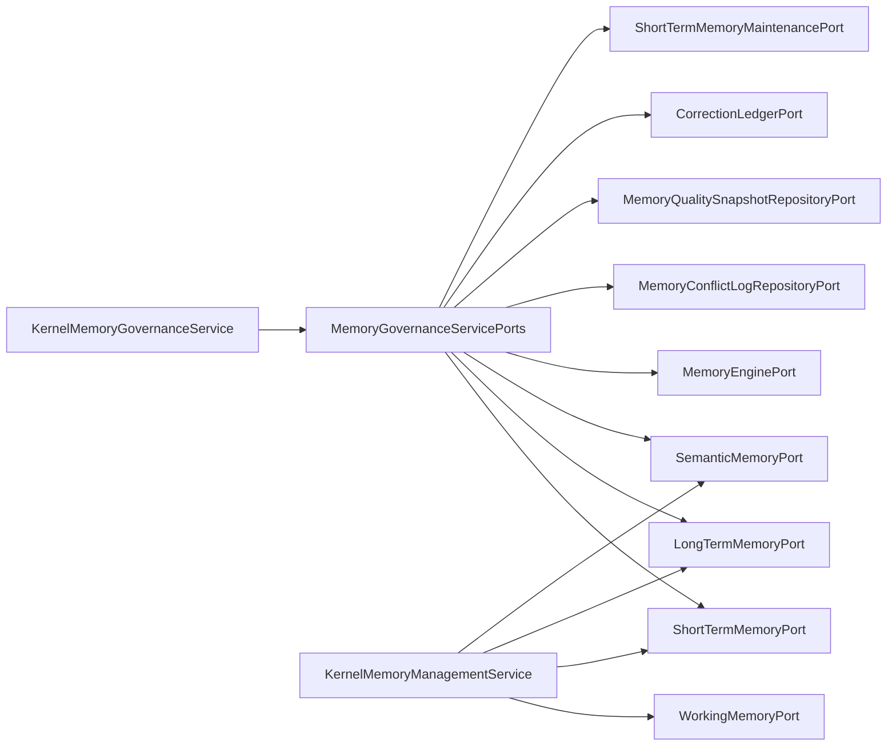

# 记忆应用服务

<cite>
**本文引用的文件**
- [MemoryGovernanceInboundPort.java](file://seahorse-agent-kernel/src/main/java/com/miracle/ai/seahorse/agent/ports/inbound/memory/MemoryGovernanceInboundPort.java)
- [MemoryGovernanceServicePorts.java](file://seahorse-agent-kernel/src/main/java/com/miracle/ai/seahorse/agent/kernel/application/memory/MemoryGovernanceServicePorts.java)
- [KernelMemoryGovernanceService.java](file://seahorse-agent-kernel/src/main/java/com/miracle/ai/seahorse/agent/kernel/application/memory/KernelMemoryGovernanceService.java)
- [KernelMemoryManagementService.java](file://seahorse-agent-kernel/src/main/java/com/miracle/ai/seahorse/agent/kernel/application/memory/KernelMemoryManagementService.java)
- [MemoryManagementInboundPort.java](file://seahorse-agent-kernel/src/main/java/com/miracle/ai/seahorse/agent/ports/inbound/memory/MemoryManagementInboundPort.java)
- [MemoryPage.java](file://seahorse-agent-kernel/src/main/java/com/miracle/ai/seahorse/agent/ports/inbound/memory/MemoryPage.java)
- [MemoryStorePort.java](file://seahorse-agent-kernel/src/main/java/com/miracle/ai/seahorse/agent/ports/outbound/memory/MemoryStorePort.java)
- [WorkingMemoryPort.java](file://seahorse-agent-kernel/src/main/java/com/miracle/ai/seahorse/agent/ports/outbound/memory/WorkingMemoryPort.java)
- [ShortTermMemoryPort.java](file://seahorse-agent-kernel/src/main/java/com/miracle/ai/seahorse/agent/ports/outbound/memory/ShortTermMemoryPort.java)
- [LongTermMemoryPort.java](file://seahorse-agent-kernel/src/main/java/com/miracle/ai/seahorse/agent/ports/outbound/memory/LongTermMemoryPort.java)
- [SemanticMemoryPort.java](file://seahorse-agent-kernel/src/main/java/com/miracle/ai/seahorse/agent/ports/outbound/memory/SemanticMemoryPort.java)
- [MemoryEnginePort.java](file://seahorse-agent-kernel/src/main/java/com/miracle/ai/seahorse/agent/ports/outbound/memory/MemoryEnginePort.java)
- [MemoryConflictLogRepositoryPort.java](file://seahorse-agent-kernel/src/main/java/com/miracle/ai/seahorse/agent/ports/outbound/memory/MemoryConflictLogRepositoryPort.java)
- [MemoryQualitySnapshotRepositoryPort.java](file://seahorse-agent-kernel/src/main/java/com/miracle/ai/seahorse/agent/ports/outbound/memory/MemoryQualitySnapshotRepositoryPort.java)
- [CorrectionLedgerPort.java](file://seahorse-agent-kernel/src/main/java/com/miracle/ai/seahorse/agent/ports/outbound/memory/CorrectionLedgerPort.java)
- [ShortTermMemoryMaintenancePort.java](file://seahorse-agent-kernel/src/main/java/com/miracle/ai/seahorse/agent/ports/outbound/memory/ShortTermMemoryMaintenancePort.java)
- [MemoryCompactionService.java](file://seahorse-agent-kernel/src/main/java/com/miracle/ai/seahorse/agent/kernel/application/memory/maintenance/MemoryCompactionService.java)
- [MemoryCompactionSummarizerPort.java](file://seahorse-agent-kernel/src/main/java/com/miracle/ai/seahorse/agent/ports/outbound/memory/MemoryCompactionSummarizerPort.java)
- [MemoryBusinessDocumentRetrieverPort.java](file://seahorse-agent-kernel/src/main/java/com/miracle/ai/seahorse/agent/ports/outbound/memory/MemoryBusinessDocumentRetrieverPort.java)
- [DefaultMemoryEnginePort.java](file://seahorse-agent-kernel/src/main/java/com/miracle/ai/seahorse/agent/kernel/application/memory/DefaultMemoryEnginePort.java)
- [SeahorseAgentKernelMemoryAutoConfiguration.java](file://seahorse-agent-spring-boot-starter/src/main/java/com/miracle/ai/seahorse/agent/adapters/spring/SeahorseAgentKernelMemoryAutoConfiguration.java)
- [SeahorseMemoryGovernanceJob.java](file://seahorse-agent-spring-boot-starter/src/main/java/com/miracle/ai/seahorse/agent/adapters/spring/SeahorseMemoryGovernanceJob.java)
- [JdbcMemoryTraceRecorderAdapter.java](file://seahorse-agent-adapter-repository-jdbc/src/main/java/com/miracle/ai/seahorse/agent/adapters/repository/jdbc/JdbcMemoryTraceRecorderAdapter.java)
- [seahorse_init.sql](file://resources/database/seahorse_init.sql)
</cite>

## 目录
1. [简介](#简介)
2. [项目结构](#项目结构)
3. [核心组件](#核心组件)
4. [架构总览](#架构总览)
5. [详细组件分析](#详细组件分析)
6. [依赖关系分析](#依赖关系分析)
7. [性能考量](#性能考量)
8. [故障排查指南](#故障排查指南)
9. [结论](#结论)
10. [附录](#附录)

## 简介
本文件系统化阐述记忆应用服务的设计与实现，聚焦于记忆引擎、记忆治理、记忆管理、记忆审查、记忆检索、记忆聚合、记忆维护、记忆出站等能力域。文档以代码为依据，结合端到端流程图与类图，帮助读者理解不同类型记忆（工作、短期、长期、语义）的生命周期管理、记忆捕获与上下文组织、质量保障与冲突治理机制，并说明与聊天系统、检索系统、存储系统之间的协作方式。

## 项目结构
记忆应用服务位于内核模块与适配器模块之间，通过“入站/出站端口”解耦上层调用与底层实现。核心入口包括：
- 入站端口：记忆治理与管理的对外接口
- 出站端口：工作/短期/长期/语义记忆存储与引擎门面
- 应用服务：治理、管理、维护、聚合等业务编排
- 自动装配：Spring Boot Starter 将端口与具体实现绑定
- 运维任务：定时治理作业与分布式锁协调

图表来源
- [KernelMemoryGovernanceService.java:31-174](file://seahorse-agent-kernel/src/main/java/com/miracle/ai/seahorse/agent/kernel/application/memory/KernelMemoryGovernanceService.java#L31-L174)
- [KernelMemoryManagementService.java:32-108](file://seahorse-agent-kernel/src/main/java/com/miracle/ai/seahorse/agent/kernel/application/memory/KernelMemoryManagementService.java#L32-L108)
- [MemoryStorePort.java:29-41](file://seahorse-agent-kernel/src/main/java/com/miracle/ai/seahorse/agent/ports/outbound/memory/MemoryStorePort.java#L29-L41)
- [MemoryEnginePort.java:29-31](file://seahorse-agent-kernel/src/main/java/com/miracle/ai/seahorse/agent/ports/outbound/memory/MemoryEnginePort.java#L29-L31)
- [SeahorseAgentKernelMemoryAutoConfiguration.java:325-345](file://seahorse-agent-spring-boot-starter/src/main/java/com/miracle/ai/seahorse/agent/adapters/spring/SeahorseAgentKernelMemoryAutoConfiguration.java#L325-L345)
- [SeahorseMemoryGovernanceJob.java:30-56](file://seahorse-agent-spring-boot-starter/src/main/java/com/miracle/ai/seahorse/agent/adapters/spring/SeahorseMemoryGovernanceJob.java#L30-L56)

章节来源
- [KernelMemoryGovernanceService.java:31-174](file://seahorse-agent-kernel/src/main/java/com/miracle/ai/seahorse/agent/kernel/application/memory/KernelMemoryGovernanceService.java#L31-L174)
- [KernelMemoryManagementService.java:32-108](file://seahorse-agent-kernel/src/main/java/com/miracle/ai/seahorse/agent/kernel/application/memory/KernelMemoryManagementService.java#L32-L108)
- [MemoryStorePort.java:29-41](file://seahorse-agent-kernel/src/main/java/com/miracle/ai/seahorse/agent/ports/outbound/memory/MemoryStorePort.java#L29-L41)
- [MemoryEnginePort.java:29-31](file://seahorse-agent-kernel/src/main/java/com/miracle/ai/seahorse/agent/ports/outbound/memory/MemoryEnginePort.java#L29-L31)
- [SeahorseAgentKernelMemoryAutoConfiguration.java:325-345](file://seahorse-agent-spring-boot-starter/src/main/java/com/miracle/ai/seahorse/agent/adapters/spring/SeahorseAgentKernelMemoryAutoConfiguration.java#L325-L345)
- [SeahorseMemoryGovernanceJob.java:30-56](file://seahorse-agent-spring-boot-starter/src/main/java/com/miracle/ai/seahorse/agent/adapters/spring/SeahorseMemoryGovernanceJob.java#L30-L56)

## 核心组件
- 记忆治理服务：负责短期记忆提升、语义写入、质量评估与衰减执行
- 记忆管理服务：面向管理与运维，支持按层级列出/查询/删除记忆，查看质量快照与冲突日志
- 记忆引擎端口：统一门面，承载加载、检索、写入、衰减、质量评估等能力
- 记忆存储端口族：工作记忆、短期记忆、长期记忆、语义记忆的抽象基线
- 治理与维护端口：冲突日志、质量快照、修正清单、短期记忆清理
- 聚合与出站：压缩聚合、业务文档检索、追踪记录

章节来源
- [MemoryGovernanceInboundPort.java:20-29](file://seahorse-agent-kernel/src/main/java/com/miracle/ai/seahorse/agent/ports/inbound/memory/MemoryGovernanceInboundPort.java#L20-L29)
- [MemoryGovernanceServicePorts.java:31-70](file://seahorse-agent-kernel/src/main/java/com/miracle/ai/seahorse/agent/kernel/application/memory/MemoryGovernanceServicePorts.java#L31-L70)
- [KernelMemoryGovernanceService.java:31-174](file://seahorse-agent-kernel/src/main/java/com/miracle/ai/seahorse/agent/kernel/application/memory/KernelMemoryGovernanceService.java#L31-L174)
- [KernelMemoryManagementService.java:32-108](file://seahorse-agent-kernel/src/main/java/com/miracle/ai/seahorse/agent/kernel/application/memory/KernelMemoryManagementService.java#L32-L108)
- [MemoryStorePort.java:29-41](file://seahorse-agent-kernel/src/main/java/com/miracle/ai/seahorse/agent/ports/outbound/memory/MemoryStorePort.java#L29-L41)
- [MemoryEnginePort.java:29-31](file://seahorse-agent-kernel/src/main/java/com/miracle/ai/seahorse/agent/ports/outbound/memory/MemoryEnginePort.java#L29-L31)
- [MemoryConflictLogRepositoryPort.java:22-41](file://seahorse-agent-kernel/src/main/java/com/miracle/ai/seahorse/agent/ports/outbound/memory/MemoryConflictLogRepositoryPort.java#L22-L41)
- [MemoryQualitySnapshotRepositoryPort.java:22-29](file://seahorse-agent-kernel/src/main/java/com/miracle/ai/seahorse/agent/ports/outbound/memory/MemoryQualitySnapshotRepositoryPort.java#L22-L29)
- [CorrectionLedgerPort.java:22-43](file://seahorse-agent-kernel/src/main/java/com/miracle/ai/seahorse/agent/ports/outbound/memory/CorrectionLedgerPort.java#L22-L43)
- [ShortTermMemoryMaintenancePort.java:31-47](file://seahorse-agent-kernel/src/main/java/com/miracle/ai/seahorse/agent/ports/outbound/memory/ShortTermMemoryMaintenancePort.java#L31-L47)
- [MemoryBusinessDocumentRetrieverPort.java:24-31](file://seahorse-agent-kernel/src/main/java/com/miracle/ai/seahorse/agent/ports/outbound/memory/MemoryBusinessDocumentRetrieverPort.java#L24-L31)

## 架构总览
记忆应用服务采用“端口-适配器”架构，将业务逻辑与存储实现解耦。治理与管理服务通过端口组合（MemoryGovernanceServicePorts）注入不同层级的记忆存储与治理能力，形成统一的治理与管理入口；记忆引擎作为门面，串联工作、短期、长期、语义记忆以及质量、冲突、修正、维护、业务文档检索等能力。

图表来源
- [MemoryGovernanceInboundPort.java:20-29](file://seahorse-agent-kernel/src/main/java/com/miracle/ai/seahorse/agent/ports/inbound/memory/MemoryGovernanceInboundPort.java#L20-L29)
- [KernelMemoryGovernanceService.java:31-174](file://seahorse-agent-kernel/src/main/java/com/miracle/ai/seahorse/agent/kernel/application/memory/KernelMemoryGovernanceService.java#L31-L174)
- [KernelMemoryManagementService.java:32-108](file://seahorse-agent-kernel/src/main/java/com/miracle/ai/seahorse/agent/kernel/application/memory/KernelMemoryManagementService.java#L32-L108)
- [MemoryEnginePort.java:29-31](file://seahorse-agent-kernel/src/main/java/com/miracle/ai/seahorse/agent/ports/outbound/memory/MemoryEnginePort.java#L29-L31)
- [MemoryStorePort.java:29-41](file://seahorse-agent-kernel/src/main/java/com/miracle/ai/seahorse/agent/ports/outbound/memory/MemoryStorePort.java#L29-L41)
- [WorkingMemoryPort.java](file://seahorse-agent-kernel/src/main/java/com/miracle/ai/seahorse/agent/ports/outbound/memory/WorkingMemoryPort.java#L25)
- [ShortTermMemoryPort.java](file://seahorse-agent-kernel/src/main/java/com/miracle/ai/seahorse/agent/ports/outbound/memory/ShortTermMemoryPort.java#L25)
- [LongTermMemoryPort.java](file://seahorse-agent-kernel/src/main/java/com/miracle/ai/seahorse/agent/ports/outbound/memory/LongTermMemoryPort.java#L25)
- [SemanticMemoryPort.java](file://seahorse-agent-kernel/src/main/java/com/miracle/ai/seahorse/agent/ports/outbound/memory/SemanticMemoryPort.java#L25)

## 详细组件分析

### 记忆治理服务（KernelMemoryGovernanceService）
- 职责：执行短期记忆提升、语义写入、质量评估与衰减执行
- 关键流程：
  - 扫描用户短期记忆（带限制）
  - 基于重要性/置信度与类型权重计算加权评分，超过阈值则写入长期记忆
  - 对 PROFILE/PREFERENCE 类型写入语义记忆
  - 可选触发质量评估与冲突处理
- 输出：治理运行结果（含提升数量、语义写入数量、错误集合、时间戳）与质量评估报告（冲突统计）

图表来源
- [KernelMemoryGovernanceService.java:44-91](file://seahorse-agent-kernel/src/main/java/com/miracle/ai/seahorse/agent/kernel/application/memory/KernelMemoryGovernanceService.java#L44-L91)
- [KernelMemoryGovernanceService.java:109-140](file://seahorse-agent-kernel/src/main/java/com/miracle/ai/seahorse/agent/kernel/application/memory/KernelMemoryGovernanceService.java#L109-L140)

章节来源
- [KernelMemoryGovernanceService.java:31-174](file://seahorse-agent-kernel/src/main/java/com/miracle/ai/seahorse/agent/kernel/application/memory/KernelMemoryGovernanceService.java#L31-L174)
- [MemoryQualityReport.java:26-41](file://seahorse-agent-kernel/src/main/java/com/miracle/ai/seahorse/agent/kernel/domain/memory/MemoryQualityReport.java#L26-L41)

### 记忆管理服务（KernelMemoryManagementService）
- 职责：面向管理与运维的入口，支持按用户/会话列出记忆、查询/删除单条记忆、查看质量快照与冲突日志、解决冲突
- 分层路由：根据传入的层名（working/short_term/long_term/semantic）路由到对应存储端口
- 参数校验：对空值进行严格校验，保证健壮性
- 默认限制：列表默认返回条数受控，防止过大负载

图表来源
- [KernelMemoryManagementService.java:81-95](file://seahorse-agent-kernel/src/main/java/com/miracle/ai/seahorse/agent/kernel/application/memory/KernelMemoryManagementService.java#L81-L95)
- [MemoryPage.java:25-31](file://seahorse-agent-kernel/src/main/java/com/miracle/ai/seahorse/agent/ports/inbound/memory/MemoryPage.java#L25-L31)

章节来源
- [KernelMemoryManagementService.java:32-108](file://seahorse-agent-kernel/src/main/java/com/miracle/ai/seahorse/agent/kernel/application/memory/KernelMemoryManagementService.java#L32-L108)
- [MemoryManagementInboundPort.java:27-40](file://seahorse-agent-kernel/src/main/java/com/miracle/ai/seahorse/agent/ports/inbound/memory/MemoryManagementInboundPort.java#L27-L40)

### 记忆引擎与存储端口族
- MemoryStorePort：定义按 ID 查找、按会话查询、批量写入、清理过期、按用户列表等通用能力
- WorkingMemoryPort/ShortTermMemoryPort/LongTermMemoryPort/SemanticMemoryPort：分别承载工作、短期、长期、语义记忆，继承自 MemoryStorePort
- MemoryEnginePort：统一门面，提供 load/write/retrieve/decay/assessQuality 等能力

章节来源
- [MemoryStorePort.java:29-41](file://seahorse-agent-kernel/src/main/java/com/miracle/ai/seahorse/agent/ports/outbound/memory/MemoryStorePort.java#L29-L41)
- [WorkingMemoryPort.java](file://seahorse-agent-kernel/src/main/java/com/miracle/ai/seahorse/agent/ports/outbound/memory/WorkingMemoryPort.java#L25)
- [ShortTermMemoryPort.java](file://seahorse-agent-kernel/src/main/java/com/miracle/ai/seahorse/agent/ports/outbound/memory/ShortTermMemoryPort.java#L25)
- [LongTermMemoryPort.java](file://seahorse-agent-kernel/src/main/java/com/miracle/ai/seahorse/agent/ports/outbound/memory/LongTermMemoryPort.java#L25)
- [SemanticMemoryPort.java](file://seahorse-agent-kernel/src/main/java/com/miracle/ai/seahorse/agent/ports/outbound/memory/SemanticMemoryPort.java#L25)
- [MemoryEnginePort.java:29-31](file://seahorse-agent-kernel/src/main/java/com/miracle/ai/seahorse/agent/ports/outbound/memory/MemoryEnginePort.java#L29-L31)

### 记忆治理端口组合（MemoryGovernanceServicePorts）
- 聚合治理所需端口：短期记忆、长期记忆、语义记忆、记忆引擎、推理、短期记忆维护、质量快照、冲突日志
- 支持多种构造重载，便于在不同场景注入可用实现或空实现

章节来源
- [MemoryGovernanceServicePorts.java:31-70](file://seahorse-agent-kernel/src/main/java/com/miracle/ai/seahorse/agent/kernel/application/memory/MemoryGovernanceServicePorts.java#L31-L70)

### 记忆审查与质量治理
- 冲突日志：按用户过滤冲突记录，支持保存与标记解决
- 质量快照：按用户与时间维度查询质量快照
- 修正清单：最高优先级修正规则的查询与写入
- 短期记忆维护：扫描过期/衰减记录并标记删除

章节来源
- [MemoryConflictLogRepositoryPort.java:22-41](file://seahorse-agent-kernel/src/main/java/com/miracle/ai/seahorse/agent/ports/outbound/memory/MemoryConflictLogRepositoryPort.java#L22-L41)
- [MemoryQualitySnapshotRepositoryPort.java:22-29](file://seahorse-agent-kernel/src/main/java/com/miracle/ai/seahorse/agent/ports/outbound/memory/MemoryQualitySnapshotRepositoryPort.java#L22-L29)
- [CorrectionLedgerPort.java:22-43](file://seahorse-agent-kernel/src/main/java/com/miracle/ai/seahorse/agent/ports/outbound/memory/CorrectionLedgerPort.java#L22-L43)
- [ShortTermMemoryMaintenancePort.java:31-47](file://seahorse-agent-kernel/src/main/java/com/miracle/ai/seahorse/agent/ports/outbound/memory/ShortTermMemoryMaintenancePort.java#L31-L47)

### 记忆聚合与压缩（MemoryCompactionService）
- 职责：扫描聚合候选、汇总内容、生成主记忆、标记已压缩、写入出站事件
- 关键点：基于分片内容与元数据构建主记忆，保留来源信息与生成标识，支持摘要策略回退

图表来源
- [MemoryCompactionService.java:146-196](file://seahorse-agent-kernel/src/main/java/com/miracle/ai/seahorse/agent/kernel/application/memory/maintenance/MemoryCompactionService.java#L146-L196)
- [MemoryCompactionSummarizerPort.java:22-42](file://seahorse-agent-kernel/src/main/java/com/miracle/ai/seahorse/agent/ports/outbound/memory/MemoryCompactionSummarizerPort.java#L22-L42)

章节来源
- [MemoryCompactionService.java:72-93](file://seahorse-agent-kernel/src/main/java/com/miracle/ai/seahorse/agent/kernel/application/memory/maintenance/MemoryCompactionService.java#L72-L93)
- [MemoryCompactionService.java:146-196](file://seahorse-agent-kernel/src/main/java/com/miracle/ai/seahorse/agent/kernel/application/memory/maintenance/MemoryCompactionService.java#L146-L196)
- [MemoryCompactionSummarizerPort.java:22-42](file://seahorse-agent-kernel/src/main/java/com/miracle/ai/seahorse/agent/ports/outbound/memory/MemoryCompactionSummarizerPort.java#L22-L42)

### 记忆出站与业务文档检索
- 业务文档检索：按租户与查询词检索相关记忆项，支持 TopK
- 记忆追踪记录：记录治理/检索等事件，支持最近事件列表查询

章节来源
- [MemoryBusinessDocumentRetrieverPort.java:24-31](file://seahorse-agent-kernel/src/main/java/com/miracle/ai/seahorse/agent/ports/outbound/memory/MemoryBusinessDocumentRetrieverPort.java#L24-L31)
- [JdbcMemoryTraceRecorderAdapter.java:30-105](file://seahorse-agent-adapter-repository-jdbc/src/main/java/com/miracle/ai/seahorse/agent/adapters/repository/jdbc/JdbcMemoryTraceRecorderAdapter.java#L30-L105)

### 记忆引擎装配与自动配置
- DefaultMemoryEnginePort：通过 builder 注入工作/短期/长期/语义记忆端口，以及质量、冲突、修正、维护、业务文档检索、生命周期、策略配置、检索流水线、精炼器、别名、审查策略、反馈仓库等
- 自动配置：SeahorseAgentKernelMemoryAutoConfiguration 将治理/管理所需端口注入服务

章节来源
- [DefaultMemoryEnginePort.java:147-168](file://seahorse-agent-kernel/src/main/java/com/miracle/ai/seahorse/agent/kernel/application/memory/DefaultMemoryEnginePort.java#L147-L168)
- [DefaultMemoryEnginePort.java:248-269](file://seahorse-agent-kernel/src/main/java/com/miracle/ai/seahorse/agent/kernel/application/memory/DefaultMemoryEnginePort.java#L248-L269)
- [DefaultMemoryEnginePort.java:549-617](file://seahorse-agent-kernel/src/main/java/com/miracle/ai/seahorse/agent/kernel/application/memory/DefaultMemoryEnginePort.java#L549-L617)
- [SeahorseAgentKernelMemoryAutoConfiguration.java:325-345](file://seahorse-agent-spring-boot-starter/src/main/java/com/miracle/ai/seahorse/agent/adapters/spring/SeahorseAgentKernelMemoryAutoConfiguration.java#L325-L345)

### 定时治理作业
- SeahorseMemoryGovernanceJob：基于分布式锁的定时任务，周期性执行记忆衰减

章节来源
- [SeahorseMemoryGovernanceJob.java:30-56](file://seahorse-agent-spring-boot-starter/src/main/java/com/miracle/ai/seahorse/agent/adapters/spring/SeahorseMemoryGovernanceJob.java#L30-L56)

## 依赖关系分析
- 组件耦合与内聚：治理与管理服务通过端口聚合实现高内聚、低耦合；存储端口族统一抽象，便于替换实现
- 外部依赖与集成：数据库 schema 定义冲突日志、质量快照等表；JDBC 适配器提供持久化实现；Spring 自动装配桥接端口与实现
- 潜在循环依赖：端口接口为单向依赖，未见循环依赖迹象

图表来源
- [MemoryGovernanceServicePorts.java:31-70](file://seahorse-agent-kernel/src/main/java/com/miracle/ai/seahorse/agent/kernel/application/memory/MemoryGovernanceServicePorts.java#L31-L70)
- [KernelMemoryGovernanceService.java:31-174](file://seahorse-agent-kernel/src/main/java/com/miracle/ai/seahorse/agent/kernel/application/memory/KernelMemoryGovernanceService.java#L31-L174)
- [KernelMemoryManagementService.java:32-108](file://seahorse-agent-kernel/src/main/java/com/miracle/ai/seahorse/agent/kernel/application/memory/KernelMemoryManagementService.java#L32-L108)

章节来源
- [MemoryGovernanceServicePorts.java:31-70](file://seahorse-agent-kernel/src/main/java/com/miracle/ai/seahorse/agent/kernel/application/memory/MemoryGovernanceServicePorts.java#L31-L70)
- [KernelMemoryGovernanceService.java:31-174](file://seahorse-agent-kernel/src/main/java/com/miracle/ai/seahorse/agent/kernel/application/memory/KernelMemoryGovernanceService.java#L31-L174)
- [KernelMemoryManagementService.java:32-108](file://seahorse-agent-kernel/src/main/java/com/miracle/ai/seahorse/agent/kernel/application/memory/KernelMemoryManagementService.java#L32-L108)

## 性能考量
- 列表默认限制：管理服务对列表返回条数进行受控，默认限制可降低负载
- 短期记忆清理：通过短期记忆维护端口扫描过期/衰减记录，减少无效数据占用
- 聚合摘要：压缩前先尝试摘要，减少主记忆内容长度，提高检索效率
- 分布式锁：治理作业使用分布式锁避免并发重复执行

章节来源
- [KernelMemoryManagementService.java:32-108](file://seahorse-agent-kernel/src/main/java/com/miracle/ai/seahorse/agent/kernel/application/memory/KernelMemoryManagementService.java#L32-L108)
- [ShortTermMemoryMaintenancePort.java:31-47](file://seahorse-agent-kernel/src/main/java/com/miracle/ai/seahorse/agent/ports/outbound/memory/ShortTermMemoryMaintenancePort.java#L31-L47)
- [MemoryCompactionService.java:172-196](file://seahorse-agent-kernel/src/main/java/com/miracle/ai/seahorse/agent/kernel/application/memory/maintenance/MemoryCompactionService.java#L172-L196)
- [SeahorseMemoryGovernanceJob.java:30-56](file://seahorse-agent-spring-boot-starter/src/main/java/com/miracle/ai/seahorse/agent/adapters/spring/SeahorseMemoryGovernanceJob.java#L30-L56)

## 故障排查指南
- 冲突处理
  - 使用 MemoryConflictLogRepositoryPort 列表查询冲突记录，确认冲突类型与影响范围
  - 通过 resolve 标记已解决，记录处理动作与责任人
- 质量监控
  - 使用 MemoryQualitySnapshotRepositoryPort 查询质量快照，识别异常波动
  - 结合领域指标（召回率、相关性、时效性）评估记忆效果
- 端口空值与依赖注入
  - 确保 MemoryGovernanceServicePorts 聚合的所有端口非空，避免运行时 NullPointerException
- 数据库一致性
  - 核对冲突日志、质量快照表索引与字段，确保查询性能与完整性约束

章节来源
- [MemoryConflictLogRepositoryPort.java:22-41](file://seahorse-agent-kernel/src/main/java/com/miracle/ai/seahorse/agent/ports/outbound/memory/MemoryConflictLogRepositoryPort.java#L22-L41)
- [MemoryQualitySnapshotRepositoryPort.java:22-29](file://seahorse-agent-kernel/src/main/java/com/miracle/ai/seahorse/agent/ports/outbound/memory/MemoryQualitySnapshotRepositoryPort.java#L22-L29)
- [MemoryGovernanceServicePorts.java:28-40](file://seahorse-agent-kernel/src/main/java/com/miracle/ai/seahorse/agent/kernel/application/memory/MemoryGovernanceServicePorts.java#L28-L40)
- [seahorse_init.sql:816-840](file://resources/database/seahorse_init.sql#L816-L840)

## 结论
记忆应用服务通过清晰的端口抽象与应用服务编排，实现了对工作、短期、长期、语义记忆的全生命周期管理。治理与管理服务分别承担策略执行与运维支撑，配合质量治理、冲突处理、压缩聚合与出站能力，确保记忆数据的有效性与准确性。自动装配与定时作业进一步提升了系统的可维护性与稳定性。

## 附录
- 记忆服务实现示例（流程路径）
  - 记忆创建：通过 MemoryEnginePort.write 或对应层级端口的保存能力
  - 记忆更新：通过对应层级端口的 upsert 或覆盖写入
  - 记忆删除：通过 MemoryStorePort.deleteExpired 或按 ID 删除
  - 记忆检索：通过 MemoryEnginePort.retrieve 或对应层级端口的查询能力
  - 记忆聚合：通过 MemoryCompactionService 扫描候选、摘要、生成主记忆
  - 记忆清理：通过 ShortTermMemoryMaintenancePort.scanExpiredOrDecayed 与 markDeleted
  - 记忆出站：通过 MemoryBusinessDocumentRetrieverPort.retrieve 与 MemoryOutboxPort（由引擎装配）

章节来源
- [MemoryEnginePort.java:29-31](file://seahorse-agent-kernel/src/main/java/com/miracle/ai/seahorse/agent/ports/outbound/memory/MemoryEnginePort.java#L29-L31)
- [MemoryStorePort.java:29-41](file://seahorse-agent-kernel/src/main/java/com/miracle/ai/seahorse/agent/ports/outbound/memory/MemoryStorePort.java#L29-L41)
- [MemoryCompactionService.java:72-93](file://seahorse-agent-kernel/src/main/java/com/miracle/ai/seahorse/agent/kernel/application/memory/maintenance/MemoryCompactionService.java#L72-L93)
- [ShortTermMemoryMaintenancePort.java:31-47](file://seahorse-agent-kernel/src/main/java/com/miracle/ai/seahorse/agent/ports/outbound/memory/ShortTermMemoryMaintenancePort.java#L31-L47)
- [MemoryBusinessDocumentRetrieverPort.java:24-31](file://seahorse-agent-kernel/src/main/java/com/miracle/ai/seahorse/agent/ports/outbound/memory/MemoryBusinessDocumentRetrieverPort.java#L24-L31)