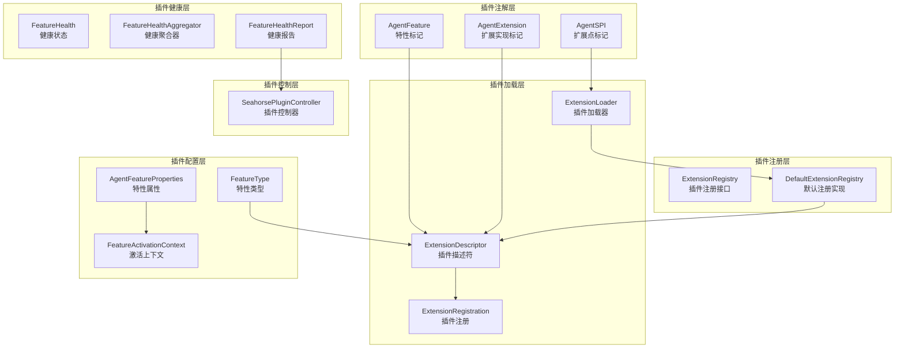
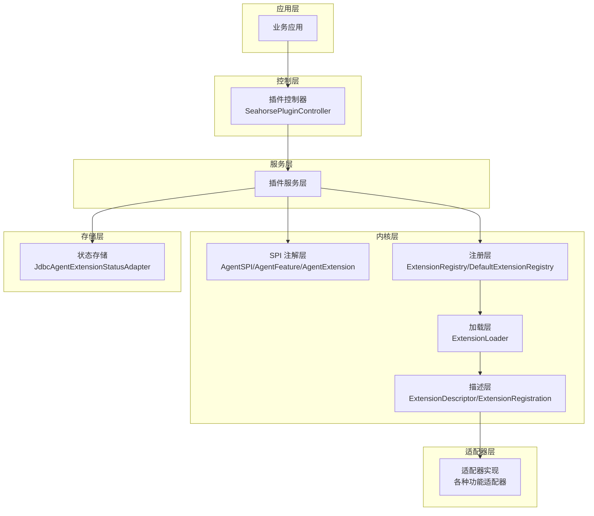
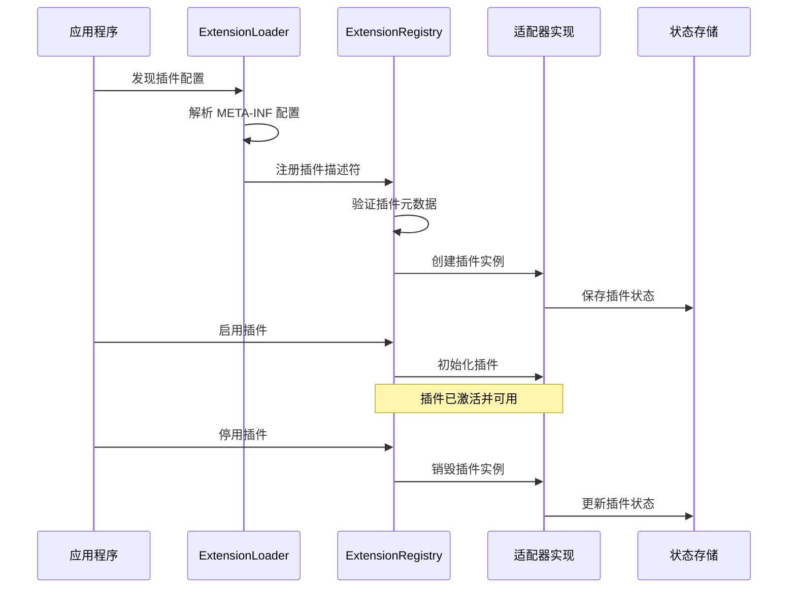
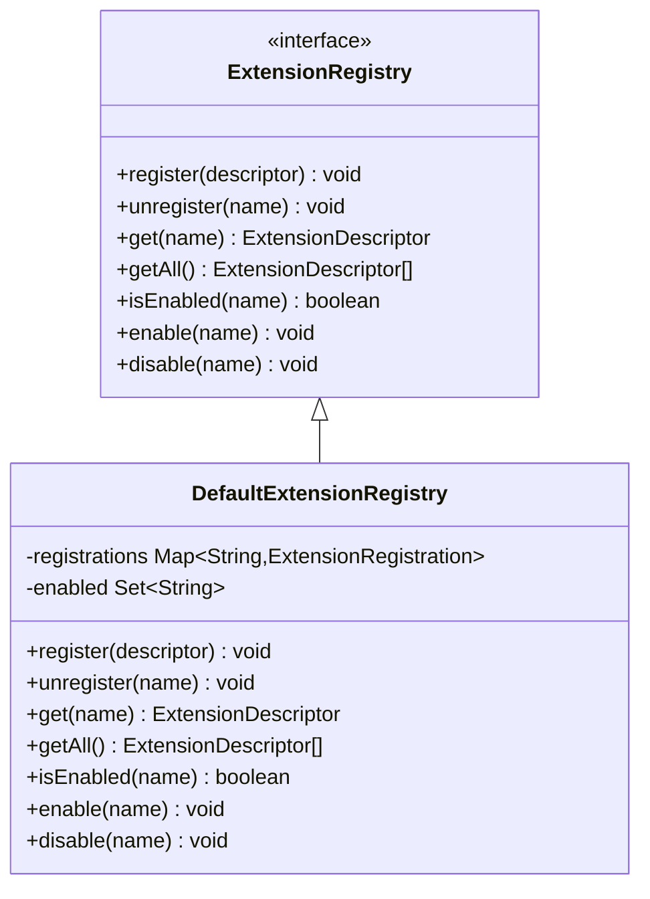
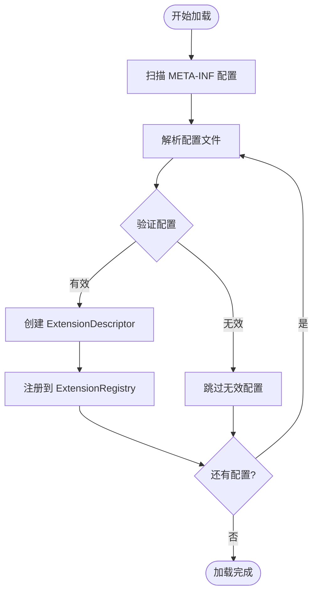
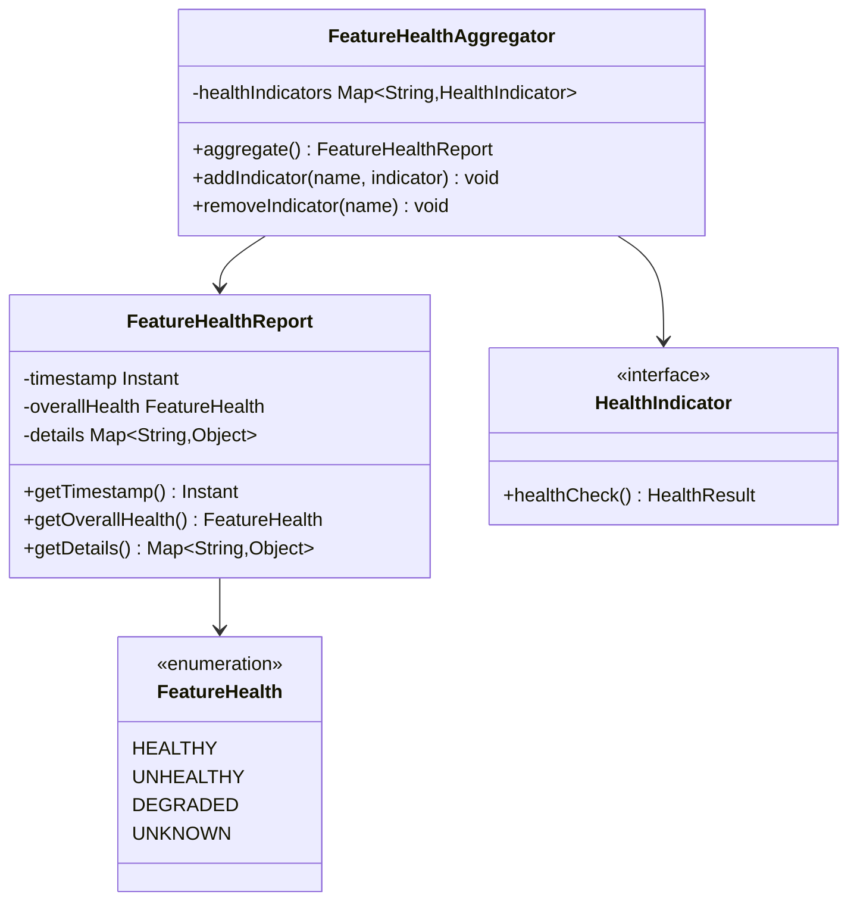
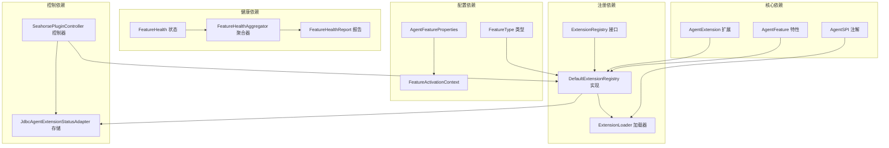
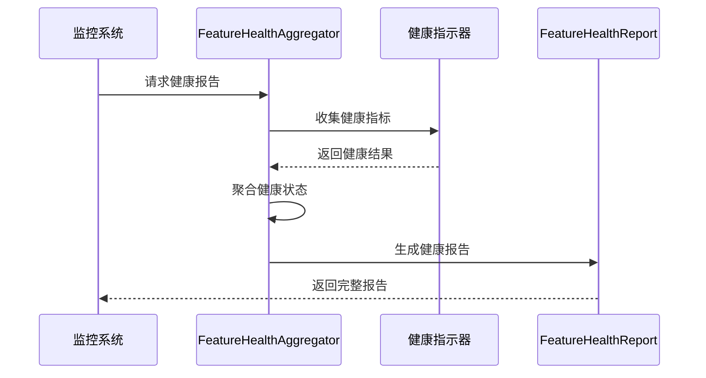

# 插件系统

<cite>
**本文引用的文件**
- [AgentExtension.java](file://seahorse-agent-kernel/src/main/java/com/miracle/ai/seahorse/agent/kernel/plugin/AgentExtension.java)
- [AgentFeature.java](file://seahorse-agent-kernel/src/main/java/com/miracle/ai/seahorse/agent/kernel/plugin/AgentFeature.java)
- [AgentSPI.java](file://seahorse-agent-kernel/src/main/java/com/miracle/ai/seahorse/agent/kernel/plugin/AgentSPI.java)
- [ExtensionLoader.java](file://seahorse-agent-kernel/src/main/java/com/miracle/ai/seahorse/agent/kernel/plugin/ExtensionLoader.java)
- [ExtensionRegistry.java](file://seahorse-agent-kernel/src/main/java/com/miracle/ai/seahorse/agent/kernel/plugin/ExtensionRegistry.java)
- [DefaultExtensionRegistry.java](file://seahorse-agent-kernel/src/main/java/com/miracle/ai/seahorse/agent/kernel/plugin/DefaultExtensionRegistry.java)
- [ExtensionDescriptor.java](file://seahorse-agent-kernel/src/main/java/com/miracle/ai/seahorse/agent/kernel/plugin/ExtensionDescriptor.java)
- [ExtensionRegistration.java](file://seahorse-agent-kernel/src/main/java/com/miracle/ai/seahorse/agent/kernel/plugin/ExtensionRegistration.java)
- [FeatureActivationContext.java](file://seahorse-agent-kernel/src/main/java/com/miracle/ai/seahorse/agent/kernel/plugin/FeatureActivationContext.java)
- [FeatureHealth.java](file://seahorse-agent-kernel/src/main/java/com/miracle/ai/seahorse/agent/kernel/plugin/FeatureHealth.java)
- [FeatureHealthAggregator.java](file://seahorse-agent-kernel/src/main/java/com/miracle/ai/seahorse/agent/kernel/plugin/FeatureHealthAggregator.java)
- [FeatureHealthReport.java](file://seahorse-agent-kernel/src/main/java/com/miracle/ai/seahorse/agent/kernel/plugin/FeatureHealthReport.java)
- [FeatureType.java](file://seahorse-agent-kernel/src/main/java/com/miracle/ai/seahorse/agent/kernel/plugin/FeatureType.java)
- [AgentFeatureProperties.java](file://seahorse-agent-kernel/src/main/java/com/miracle/ai/seahorse/agent/kernel/plugin/AgentFeatureProperties.java)
- [ExtensionLoadDiagnostic.java](file://seahorse-agent-kernel/src/main/java/com/miracle/ai/seahorse/agent/kernel/plugin/ExtensionLoadDiagnostic.java)
- [SeahorsePluginController.java](file://seahorse-agent-adapter-web/src/main/java/com/miracle/ai/seahorse/agent/adapters/web/SeahorsePluginController.java)
- [JdbcAgentExtensionStatusAdapter.java](file://seahorse-agent-adapter-repository-jdbc/src/main/java/com/miracle/ai/seahorse/agent/adapters/repository/jdbc/JdbcAgentExtensionStatusAdapter.java)
- [JdbcAgentExtensionStatusAdapterTests.java](file://seahorse-agent-adapter-repository-jdbc/src/test/java/com/miracle/ai/seahorse/agent/adapters/repository/jdbc/JdbcAgentExtensionStatusAdapterTests.java)
- [DefaultExtensionRegistryTests.java](file://seahorse-agent-tests/src/test/java/com/miracle/ai/seahorse/agent/kernel/plugin/DefaultExtensionRegistryTests.java)
- [插件系统.md](file://docs/zh/content/后端系统/核心内核/插件系统/插件系统.md)
- [插件健康监控.md](file://docs/zh/content/后端系统/插件系统/插件健康监控.md)
</cite>

## 目录
1. [简介](#简介)
2. [项目结构](#项目结构)
3. [核心组件](#核心组件)
4. [架构总览](#架构总览)
5. [详细组件分析](#详细组件分析)
6. [依赖关系分析](#依赖关系分析)
7. [性能考量](#性能考量)
8. [故障排查指南](#故障排查指南)
9. [结论](#结论)
10. [附录](#附录)

## 简介
本文件系统性阐述 Seahorse Agent 微内核的插件体系，重点覆盖 Kernel 的插件架构设计与实现，包括 AgentFeature、AgentExtension、ExtensionLoader、ExtensionRegistry 等核心组件；深入说明插件生命周期管理、动态加载机制、健康状态监控与诊断；解释 PortWrapper 包装器链的设计理念与横切关注点（审计、熔断、观测、限流、重试）的统一处理方式；介绍插件注册、激活、停用流程及依赖关系管理；并提供自定义插件开发指南与最佳实践。

## 项目结构
Kernel 的插件系统位于 kernel/plugin 目录下，采用 SPI（Service Provider Interface）机制实现声明式插件注册与动态加载。插件系统围绕以下核心层次组织：

- 插件注解层：AgentSPI、AgentExtension、AgentFeature 提供插件元数据声明
- 插件注册层：ExtensionRegistry、DefaultExtensionRegistry 管理插件注册与发现
- 插件加载层：ExtensionLoader 负责从 META-INF 配置加载插件实现
- 插件描述层：ExtensionDescriptor、ExtensionRegistration 封装插件描述与注册信息
- 插件配置层：AgentFeatureProperties、FeatureActivationContext 管理特性配置与激活上下文
- 插件健康层：FeatureHealth、FeatureHealthAggregator、FeatureHealthReport 提供健康监控与诊断
- 插件控制层：SeahorsePluginController 对外暴露插件管理接口

**图表来源**
- [AgentSPI.java:26-50](file://seahorse-agent-kernel/src/main/java/com/miracle/ai/seahorse/agent/kernel/plugin/AgentSPI.java#L26-L50)
- [AgentFeature.java:20-79](file://seahorse-agent-kernel/src/main/java/com/miracle/ai/seahorse/agent/kernel/plugin/AgentFeature.java#L20-L79)
- [AgentExtension.java:26-57](file://seahorse-agent-kernel/src/main/java/com/miracle/ai/seahorse/agent/kernel/plugin/AgentExtension.java#L26-L57)
- [ExtensionRegistry.java:1](file://seahorse-agent-kernel/src/main/java/com/miracle/ai/seahorse/agent/kernel/plugin/ExtensionRegistry.java#L1)
- [DefaultExtensionRegistry.java:1](file://seahorse-agent-kernel/src/main/java/com/miracle/ai/seahorse/agent/kernel/plugin/DefaultExtensionRegistry.java#L1)
- [ExtensionLoader.java:1](file://seahorse-agent-kernel/src/main/java/com/miracle/ai/seahorse/agent/kernel/plugin/ExtensionLoader.java#L1)
- [ExtensionDescriptor.java:1](file://seahorse-agent-kernel/src/main/java/com/miracle/ai/seahorse/agent/kernel/plugin/ExtensionDescriptor.java#L1)
- [ExtensionRegistration.java:1](file://seahorse-agent-kernel/src/main/java/com/miracle/ai/seahorse/agent/kernel/plugin/ExtensionRegistration.java#L1)
- [AgentFeatureProperties.java:1](file://seahorse-agent-kernel/src/main/java/com/miracle/ai/seahorse/agent/kernel/plugin/AgentFeatureProperties.java#L1)
- [FeatureActivationContext.java:1](file://seahorse-agent-kernel/src/main/java/com/miracle/ai/seahorse/agent/kernel/plugin/FeatureActivationContext.java#L1)
- [FeatureHealth.java:1](file://seahorse-agent-kernel/src/main/java/com/miracle/ai/seahorse/agent/kernel/plugin/FeatureHealth.java#L1)
- [FeatureHealthAggregator.java:1](file://seahorse-agent-kernel/src/main/java/com/miracle/ai/seahorse/agent/kernel/plugin/FeatureHealthAggregator.java#L1)
- [FeatureHealthReport.java:1](file://seahorse-agent-kernel/src/main/java/com/miracle/ai/seahorse/agent/kernel/plugin/FeatureHealthReport.java#L1)
- [FeatureType.java:1](file://seahorse-agent-kernel/src/main/java/com/miracle/ai/seahorse/agent/kernel/plugin/FeatureType.java#L1)
- [SeahorsePluginController.java:1](file://seahorse-agent-adapter-web/src/main/java/com/miracle/ai/seahorse/agent/adapters/web/SeahorsePluginController.java#L1)

**章节来源**
- [插件系统.md:22-35](file://docs/zh/content/后端系统/核心内核/插件系统/插件系统.md#L22-L35)

## 核心组件
插件系统的核心组件围绕 SPI 机制构建，通过注解声明、注册表管理、加载器解析和健康监控实现完整的插件生命周期管理。

### AgentSPI 注解
AgentSPI 是插件系统的核心注解，用于标记参与微内核扩展加载的端口类型。该注解仅表达内核契约元数据，不触发类扫描或实例化，避免请求期引入反射开销。

- **作用范围**：标记端口接口，声明扩展点参与微内核扩展加载
- **生命周期**：仅在编译期和运行期元数据层面有效
- **性能特性**：避免反射开销，不触发类加载

### AgentFeature 特性
AgentFeature 标记业务扩展能力，统一启用、排序与健康检查。每个 AgentFeature 代表一个可独立启用/禁用的功能模块。

- **功能特性**：统一管理插件的启用状态、排序和健康检查
- **配置管理**：通过 AgentFeatureProperties 进行配置绑定
- **类型标识**：通过 FeatureType 定义特性类型

### AgentExtension 扩展
AgentExtension 标记扩展实现，声明名称、排序与能力标签。每个 AgentExtension 代表具体的功能实现。

- **实现标识**：声明扩展实现的唯一标识和排序
- **能力标签**：标注扩展实现的能力标签和依赖关系
- **生命周期**：跟随 AgentFeature 的生命周期进行管理

**章节来源**
- [AgentSPI.java:26-50](file://seahorse-agent-kernel/src/main/java/com/miracle/ai/seahorse/agent/kernel/plugin/AgentSPI.java#L26-L50)
- [AgentFeature.java:20-79](file://seahorse-agent-kernel/src/main/java/com/miracle/ai/seahorse/agent/kernel/plugin/AgentFeature.java#L20-L79)
- [AgentExtension.java:26-57](file://seahorse-agent-kernel/src/main/java/com/miracle/ai/seahorse/agent/kernel/plugin/AgentExtension.java#L26-L57)

## 架构总览
插件系统采用分层架构设计，通过 SPI 机制实现声明式插件注册与动态加载。系统架构包含以下关键层次：

**图表来源**
- [SeahorsePluginController.java:19-22](file://seahorse-agent-adapter-web/src/main/java/com/miracle/ai/seahorse/agent/adapters/web/SeahorsePluginController.java#L19-L22)
- [ExtensionRegistry.java:1](file://seahorse-agent-kernel/src/main/java/com/miracle/ai/seahorse/agent/kernel/plugin/ExtensionRegistry.java#L1)
- [DefaultExtensionRegistry.java:1](file://seahorse-agent-kernel/src/main/java/com/miracle/ai/seahorse/agent/kernel/plugin/DefaultExtensionRegistry.java#L1)
- [ExtensionLoader.java:1](file://seahorse-agent-kernel/src/main/java/com/miracle/ai/seahorse/agent/kernel/plugin/ExtensionLoader.java#L1)
- [JdbcAgentExtensionStatusAdapter.java:39](file://seahorse-agent-adapter-repository-jdbc/src/main/java/com/miracle/ai/seahorse/agent/adapters/repository/jdbc/JdbcAgentExtensionStatusAdapter.java#L39)

### 插件生命周期管理
插件生命周期包括发现、加载、初始化和卸载四个阶段：

**图表来源**
- [ExtensionLoader.java:1](file://seahorse-agent-kernel/src/main/java/com/miracle/ai/seahorse/agent/kernel/plugin/ExtensionLoader.java#L1)
- [ExtensionRegistry.java:1](file://seahorse-agent-kernel/src/main/java/com/miracle/ai/seahorse/agent/kernel/plugin/ExtensionRegistry.java#L1)
- [JdbcAgentExtensionStatusAdapter.java:73-146](file://seahorse-agent-adapter-repository-jdbc/src/main/java/com/miracle/ai/seahorse/agent/adapters/repository/jdbc/JdbcAgentExtensionStatusAdapter.java#L73-L146)

## 详细组件分析

### ExtensionRegistry 注册接口
ExtensionRegistry 是插件注册的核心接口，定义了插件注册、查询和管理的标准操作。

**图表来源**
- [ExtensionRegistry.java:1](file://seahorse-agent-kernel/src/main/java/com/miracle/ai/seahorse/agent/kernel/plugin/ExtensionRegistry.java#L1)
- [DefaultExtensionRegistry.java:1](file://seahorse-agent-kernel/src/main/java/com/miracle/ai/seahorse/agent/kernel/plugin/DefaultExtensionRegistry.java#L1)

### ExtensionLoader 加载器
ExtensionLoader 负责从 META-INF 配置文件中加载插件实现，支持多种配置格式和扩展点解析。

**图表来源**
- [ExtensionLoader.java:1](file://seahorse-agent-kernel/src/main/java/com/miracle/ai/seahorse/agent/kernel/plugin/ExtensionLoader.java#L1)
- [ExtensionDescriptor.java:1](file://seahorse-agent-kernel/src/main/java/com/miracle/ai/seahorse/agent/kernel/plugin/ExtensionDescriptor.java#L1)

### 插件健康监控体系
插件健康监控通过 FeatureHealth、FeatureHealthAggregator 和 FeatureHealthReport 实现完整的健康状态管理。

**图表来源**
- [FeatureHealth.java:1](file://seahorse-agent-kernel/src/main/java/com/miracle/ai/seahorse/agent/kernel/plugin/FeatureHealth.java#L1)
- [FeatureHealthAggregator.java:1](file://seahorse-agent-kernel/src/main/java/com/miracle/ai/seahorse/agent/kernel/plugin/FeatureHealthAggregator.java#L1)
- [FeatureHealthReport.java:1](file://seahorse-agent-kernel/src/main/java/com/miracle/ai/seahorse/agent/kernel/plugin/FeatureHealthReport.java#L1)

**章节来源**
- [ExtensionRegistry.java:1](file://seahorse-agent-kernel/src/main/java/com/miracle/ai/seahorse/agent/kernel/plugin/ExtensionRegistry.java#L1)
- [DefaultExtensionRegistry.java:1](file://seahorse-agent-kernel/src/main/java/com/miracle/ai/seahorse/agent/kernel/plugin/DefaultExtensionRegistry.java#L1)
- [ExtensionLoader.java:1](file://seahorse-agent-kernel/src/main/java/com/miracle/ai/seahorse/agent/kernel/plugin/ExtensionLoader.java#L1)
- [ExtensionDescriptor.java:1](file://seahorse-agent-kernel/src/main/java/com/miracle/ai/seahorse/agent/kernel/plugin/ExtensionDescriptor.java#L1)
- [FeatureHealth.java:1](file://seahorse-agent-kernel/src/main/java/com/miracle/ai/seahorse/agent/kernel/plugin/FeatureHealth.java#L1)
- [FeatureHealthAggregator.java:1](file://seahorse-agent-kernel/src/main/java/com/miracle/ai/seahorse/agent/kernel/plugin/FeatureHealthAggregator.java#L1)
- [FeatureHealthReport.java:1](file://seahorse-agent-kernel/src/main/java/com/miracle/ai/seahorse/agent/kernel/plugin/FeatureHealthReport.java#L1)

## 依赖关系分析
插件系统内部存在清晰的依赖关系，遵循单一职责原则和依赖倒置原则。

**图表来源**
- [AgentSPI.java:26-50](file://seahorse-agent-kernel/src/main/java/com/miracle/ai/seahorse/agent/kernel/plugin/AgentSPI.java#L26-L50)
- [AgentFeature.java:20-79](file://seahorse-agent-kernel/src/main/java/com/miracle/ai/seahorse/agent/kernel/plugin/AgentFeature.java#L20-L79)
- [AgentExtension.java:26-57](file://seahorse-agent-kernel/src/main/java/com/miracle/ai/seahorse/agent/kernel/plugin/AgentExtension.java#L26-L57)
- [ExtensionRegistry.java:1](file://seahorse-agent-kernel/src/main/java/com/miracle/ai/seahorse/agent/kernel/plugin/ExtensionRegistry.java#L1)
- [DefaultExtensionRegistry.java:1](file://seahorse-agent-kernel/src/main/java/com/miracle/ai/seahorse/agent/kernel/plugin/DefaultExtensionRegistry.java#L1)
- [ExtensionLoader.java:1](file://seahorse-agent-kernel/src/main/java/com/miracle/ai/seahorse/agent/kernel/plugin/ExtensionLoader.java#L1)
- [AgentFeatureProperties.java:1](file://seahorse-agent-kernel/src/main/java/com/miracle/ai/seahorse/agent/kernel/plugin/AgentFeatureProperties.java#L1)
- [FeatureActivationContext.java:1](file://seahorse-agent-kernel/src/main/java/com/miracle/ai/seahorse/agent/kernel/plugin/FeatureActivationContext.java#L1)
- [FeatureHealth.java:1](file://seahorse-agent-kernel/src/main/java/com/miracle/ai/seahorse/agent/kernel/plugin/FeatureHealth.java#L1)
- [FeatureHealthAggregator.java:1](file://seahorse-agent-kernel/src/main/java/com/miracle/ai/seahorse/agent/kernel/plugin/FeatureHealthAggregator.java#L1)
- [FeatureHealthReport.java:1](file://seahorse-agent-kernel/src/main/java/com/miracle/ai/seahorse/agent/kernel/plugin/FeatureHealthReport.java#L1)
- [SeahorsePluginController.java:19-22](file://seahorse-agent-adapter-web/src/main/java/com/miracle/ai/seahorse/agent/adapters/web/SeahorsePluginController.java#L19-L22)
- [JdbcAgentExtensionStatusAdapter.java:39](file://seahorse-agent-adapter-repository-jdbc/src/main/java/com/miracle/ai/seahorse/agent/adapters/repository/jdbc/JdbcAgentExtensionStatusAdapter.java#L39)

**章节来源**
- [插件系统.md:395-409](file://docs/zh/content/后端系统/核心内核/插件系统/插件系统.md#L395-L409)

## 性能考量
插件系统在设计时充分考虑了性能优化，采用多种策略确保高效率运行：

### 反射开销控制
- AgentSPI 注解避免在运行期触发类扫描或实例化
- 插件加载采用延迟初始化策略
- 配置解析在启动期完成，运行期只做查询操作

### 内存管理
- 插件实例采用单例模式管理
- 状态存储使用连接池优化数据库访问
- 缓存机制减少重复计算和I/O操作

### 并发安全
- 注册表操作使用线程安全的数据结构
- 插件状态更新采用原子操作
- 并发访问通过锁机制保证数据一致性

## 故障排查指南
插件系统提供了完善的故障排查机制，包括健康监控、诊断信息和错误处理。

### 健康监控
通过 FeatureHealthAggregator 聚合各个插件的健康状态，生成 FeatureHealthReport 报告：

**图表来源**
- [FeatureHealthAggregator.java:1](file://seahorse-agent-kernel/src/main/java/com/miracle/ai/seahorse/agent/kernel/plugin/FeatureHealthAggregator.java#L1)
- [FeatureHealthReport.java:1](file://seahorse-agent-kernel/src/main/java/com/miracle/ai/seahorse/agent/kernel/plugin/FeatureHealthReport.java#L1)

### 状态持久化
JdbcAgentExtensionStatusAdapter 提供插件状态的持久化存储，支持状态查询和更新：

**章节来源**
- [JdbcAgentExtensionStatusAdapter.java:73-146](file://seahorse-agent-adapter-repository-jdbc/src/main/java/com/miracle/ai/seahorse/agent/adapters/repository/jdbc/JdbcAgentExtensionStatusAdapter.java#L73-L146)
- [JdbcAgentExtensionStatusAdapterTests.java:33-71](file://seahorse-agent-adapter-repository-jdbc/src/test/java/com/miracle/ai/seahorse/agent/adapters/repository/jdbc/JdbcAgentExtensionStatusAdapterTests.java#L33-L71)

### 默认注册表契约测试
DefaultExtensionRegistryTests 确保插件注册表的关键契约得到满足：

**章节来源**
- [DefaultExtensionRegistryTests.java:26-35](file://seahorse-agent-tests/src/test/java/com/miracle/ai/seahorse/agent/kernel/plugin/DefaultExtensionRegistryTests.java#L26-L35)

## 结论
Seahorse Agent 的插件系统通过 SPI 机制实现了高度模块化的架构设计，具备以下核心优势：

1. **声明式注册**：通过注解和配置文件实现插件的声明式注册
2. **生命周期管理**：完整的插件发现、加载、初始化和卸载流程
3. **健康监控**：全面的健康状态监控和诊断能力
4. **性能优化**：避免反射开销，采用延迟初始化和缓存机制
5. **扩展性**：支持热插拔和运行时扩展，确保插件间的隔离性和安全性

该插件系统为 Seahorse Agent 提供了强大的扩展能力，支持业务功能的灵活组合和独立演进。

## 附录

### 自定义插件开发指南
按照以下步骤开发自定义插件：

1. **实现端口接口**
   - 确保实现类实现对应的端口类型（由 AgentSPI 标记）
   - 实现必要的业务逻辑和接口方法

2. **配置插件元数据**
   - 在资源目录 resources/META-INF/seahorse-agent 下创建以"端口全限定名"命名的属性文件
   - 按加载器支持的键编写扩展实现与元数据

3. **声明插件特性**
   - 使用 AgentFeature 注解标记业务扩展能力
   - 配置 AgentFeatureProperties 进行特性管理

4. **依赖声明**
   - 在 Maven 项目中添加对内核与所需适配器的依赖
   - 确保 AutoConfiguration 导入正确

5. **启动期装配**
   - 通过 Spring Boot Starter 的 AutoConfiguration.imports 导入内核与原生适配器自动装配
   - 触发扩展加载与注册

### 插件配置示例
插件配置文件应包含以下关键信息：
- 插件实现类的完全限定名
- 插件名称和版本信息
- 插件依赖关系和排序
- 启用状态和配置参数

### 最佳实践
- 遵循单一职责原则，每个插件专注于特定功能
- 使用接口抽象，避免直接依赖具体实现
- 实现健壮的错误处理和回退机制
- 提供完整的健康监控和诊断信息
- 确保插件间的隔离性和安全性

**章节来源**
- [插件系统.md:405-409](file://docs/zh/content/后端系统/核心内核/插件系统/插件系统.md#L405-L409)