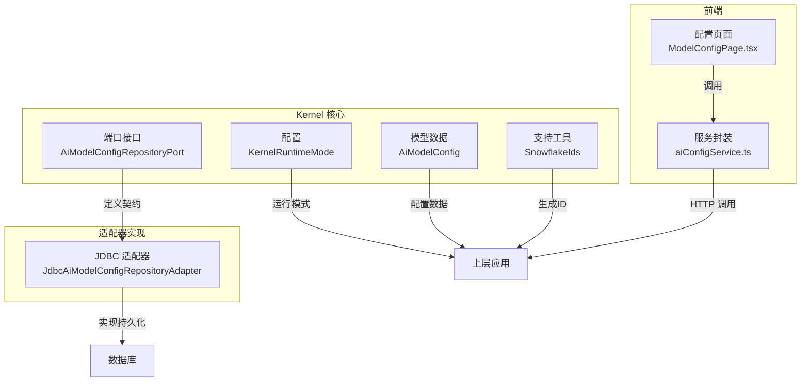
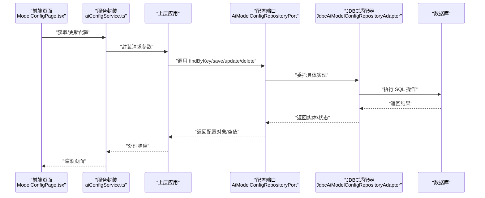
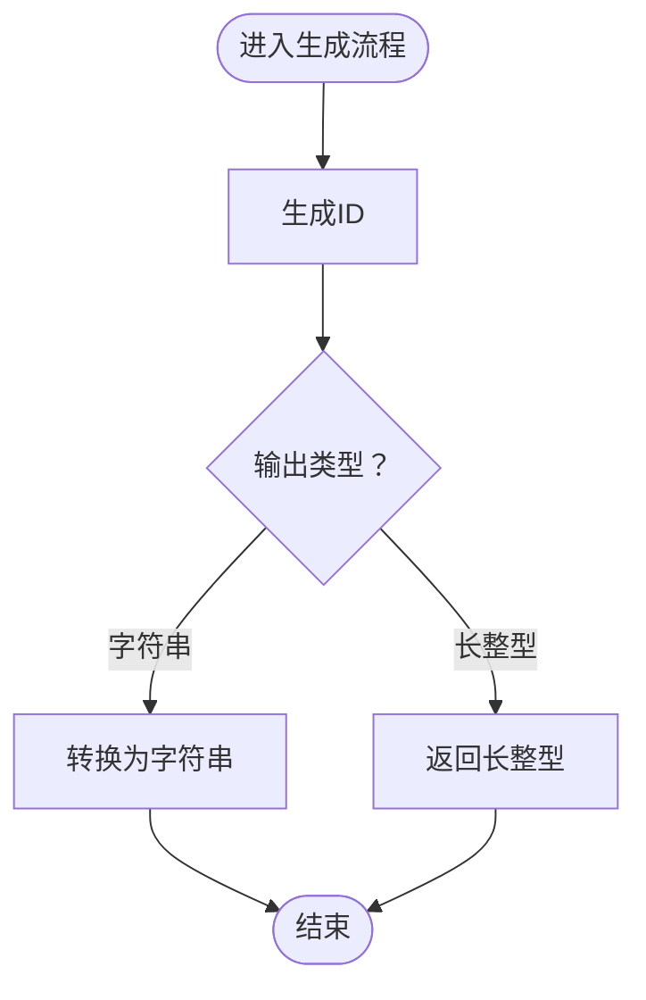
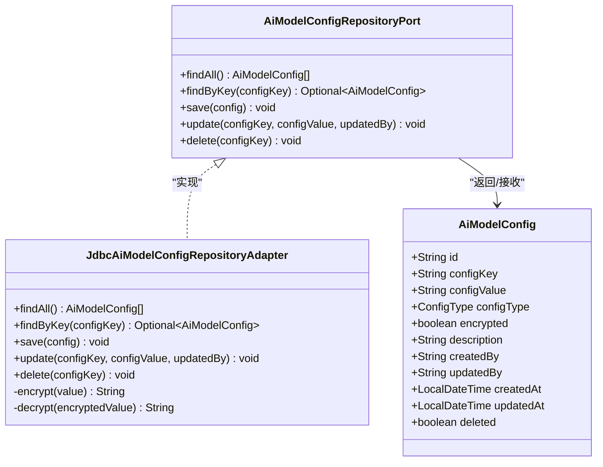
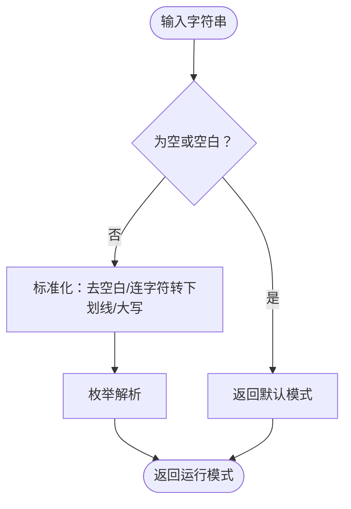
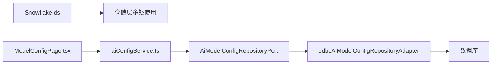

# 支持组件

<cite>
**本文引用的文件**
- [KernelRuntimeMode.java](file://seahorse-agent-kernel/src/main/java/com/miracle/ai/seahorse/agent/kernel/config/KernelRuntimeMode.java)
- [AiModelConfig.java](file://seahorse-agent-kernel/src/main/java/com/miracle/ai/seahorse/agent/kernel/model/AiModelConfig.java)
- [AiModelConfigRepositoryPort.java](file://seahorse-agent-kernel/src/main/java/com/miracle/ai/seahorse/agent/ports/outbound/config/AiModelConfigRepositoryPort.java)
- [JdbcAiModelConfigRepositoryAdapter.java](file://seahorse-agent-adapter-repository-jdbc/src/main/java/com/miracle/ai/seahorse/agent/adapters/repository/jdbc/JdbcAiModelConfigRepositoryAdapter.java)
- [SnowflakeIds.java](file://seahorse-agent-kernel/src/main/java/com/miracle/ai/seahorse/agent/kernel/support/SnowflakeIds.java)
- [JdbcKnowledgeDocumentRepositoryAdapter_optimized.java](file://docs/performance/JdbcKnowledgeDocumentRepositoryAdapter_optimized.java)
- [JdbcDocumentRefreshScheduleAdapter.java](file://seahorse-agent-adapter-repository-jdbc/src/main/java/com/miracle/ai/seahorse/agent/adapters/repository/jdbc/JdbcDocumentRefreshScheduleAdapter.java)
- [JdbcIngestionTaskRepositoryAdapter.java](file://seahorse-agent-adapter-repository-jdbc/src/main/java/com/miracle/ai/seahorse/agent/adapters/repository/jdbc/JdbcIngestionTaskRepositoryAdapter.java)
- [ModelConfigPage.tsx](file://frontend/src/pages/admin/settings/ModelConfigPage.tsx)
- [aiConfigService.ts](file://frontend/src/services/aiConfigService.ts)
</cite>

## 目录
1. [简介](#简介)
2. [项目结构](#项目结构)
3. [核心组件](#核心组件)
4. [架构总览](#架构总览)
5. [详细组件分析](#详细组件分析)
6. [依赖关系分析](#依赖关系分析)
7. [性能考量](#性能考量)
8. [故障排查指南](#故障排查指南)
9. [结论](#结论)
10. [附录](#附录)

## 简介
本文件聚焦于Kernel模块提供的基础支撑组件，涵盖以下三类关键能力：
- 雪花ID生成器：为数据库主键提供紧凑、时序有序且全局唯一的ID。
- 模型配置管理：统一管理AI模型相关的配置项（含类型、加解密、版本化变更），并通过适配器持久化到数据库。
- 运行模式配置：定义内核运行模式枚举，用于在不同部署或测试场景下切换行为。

这些组件通过清晰的接口与可替换的实现，向上层应用提供稳定可靠的基础服务，同时具备良好的扩展性与定制能力。

## 项目结构
Kernel模块位于独立的工程中，包含配置、模型与支持工具等包；配套的适配器工程提供具体实现（如JDBC存储）；前端页面与服务封装了配置管理的用户界面与调用方式。

图示来源
- [KernelRuntimeMode.java:25-45](file://seahorse-agent-kernel/src/main/java/com/miracle/ai/seahorse/agent/kernel/config/KernelRuntimeMode.java#L25-L45)
- [AiModelConfig.java:30-54](file://seahorse-agent-kernel/src/main/java/com/miracle/ai/seahorse/agent/kernel/model/AiModelConfig.java#L30-L54)
- [AiModelConfigRepositoryPort.java:25-35](file://seahorse-agent-kernel/src/main/java/com/miracle/ai/seahorse/agent/ports/outbound/config/AiModelConfigRepositoryPort.java#L25-L35)
- [JdbcAiModelConfigRepositoryAdapter.java:42-138](file://seahorse-agent-adapter-repository-jdbc/src/main/java/com/miracle/ai/seahorse/agent/adapters/repository/jdbc/JdbcAiModelConfigRepositoryAdapter.java#L42-L138)
- [SnowflakeIds.java](file://seahorse-agent-kernel/src/main/java/com/miracle/ai/seahorse/agent/kernel/support/SnowflakeIds.java#L29)

章节来源
- [KernelRuntimeMode.java:25-45](file://seahorse-agent-kernel/src/main/java/com/miracle/ai/seahorse/agent/kernel/config/KernelRuntimeMode.java#L25-L45)
- [AiModelConfig.java:30-54](file://seahorse-agent-kernel/src/main/java/com/miracle/ai/seahorse/agent/kernel/model/AiModelConfig.java#L30-L54)
- [AiModelConfigRepositoryPort.java:25-35](file://seahorse-agent-kernel/src/main/java/com/miracle/ai/seahorse/agent/ports/outbound/config/AiModelConfigRepositoryPort.java#L25-L35)
- [JdbcAiModelConfigRepositoryAdapter.java:42-138](file://seahorse-agent-adapter-repository-jdbc/src/main/java/com/miracle/ai/seahorse/agent/adapters/repository/jdbc/JdbcAiModelConfigRepositoryAdapter.java#L42-L138)
- [SnowflakeIds.java](file://seahorse-agent-kernel/src/main/java/com/miracle/ai/seahorse/agent/kernel/support/SnowflakeIds.java#L29)

## 核心组件
- 雪花ID生成器（SnowflakeIds）
  - 设计目的：提供紧凑、单调递增、时序有序的全局唯一ID，适合作为数据库主键，兼顾性能与可读性。
  - 实现要点：基于时间戳、机器标识与序列号组合，保证同一毫秒内的唯一性与顺序性。
  - 使用场景：各类实体主键生成（如知识文档、任务、刷新计划等）。
- 模型配置管理（AiModelConfig + 适配器）
  - 设计目的：集中管理AI模型相关配置（如API Key、模型名称、是否加密等），支持类型化存储与更新审计。
  - 实现要点：定义配置实体与端口接口，JDBC适配器负责查询、保存、更新与删除，并内置加解密逻辑。
- 运行模式配置（KernelRuntimeMode）
  - 设计目的：统一内核运行模式，便于在不同环境或阶段切换行为。
  - 实现要点：枚举值与字符串解析方法，支持容错与大小写/连字符兼容。

章节来源
- [SnowflakeIds.java](file://seahorse-agent-kernel/src/main/java/com/miracle/ai/seahorse/agent/kernel/support/SnowflakeIds.java#L29)
- [AiModelConfig.java:30-54](file://seahorse-agent-kernel/src/main/java/com/miracle/ai/seahorse/agent/kernel/model/AiModelConfig.java#L30-L54)
- [AiModelConfigRepositoryPort.java:25-35](file://seahorse-agent-kernel/src/main/java/com/miracle/ai/seahorse/agent/ports/outbound/config/AiModelConfigRepositoryPort.java#L25-L35)
- [KernelRuntimeMode.java:25-45](file://seahorse-agent-kernel/src/main/java/com/miracle/ai/seahorse/agent/kernel/config/KernelRuntimeMode.java#L25-L45)

## 架构总览
支持组件在整体架构中的定位如下：
- 上层应用通过端口接口访问配置管理能力，具体实现由适配器提供。
- 雪花ID生成器被广泛用于各仓储层生成主键，确保全局唯一与高并发下的稳定性。
- 运行模式通过配置入口生效，影响内核在不同阶段的行为。

图示来源
- [AiModelConfigRepositoryPort.java:25-35](file://seahorse-agent-kernel/src/main/java/com/miracle/ai/seahorse/agent/ports/outbound/config/AiModelConfigRepositoryPort.java#L25-L35)
- [JdbcAiModelConfigRepositoryAdapter.java:68-138](file://seahorse-agent-adapter-repository-jdbc/src/main/java/com/miracle/ai/seahorse/agent/adapters/repository/jdbc/JdbcAiModelConfigRepositoryAdapter.java#L68-L138)
- [ModelConfigPage.tsx:24-45](file://frontend/src/pages/admin/settings/ModelConfigPage.tsx#L24-L45)
- [aiConfigService.ts:17-37](file://frontend/src/services/aiConfigService.ts#L17-L37)

## 详细组件分析

### 雪花ID生成器（SnowflakeIds）
- 组件职责
  - 提供长整型与字符串形式的全局唯一ID生成，满足高并发、低冲突与时序有序的要求。
  - 广泛应用于仓储层实体主键生成，减少主键冲突与回溯成本。
- 关键流程
  - 生成字符串ID：确保下游存储与展示的一致性。
  - 生成长整型ID：满足高性能场景下的数值比较与排序。
- 性能与可靠性
  - 单实例内单调递增，避免跨实例的时间回拨问题。
  - 在高QPS下仍保持低延迟与高吞吐。

图示来源
- [SnowflakeIds.java](file://seahorse-agent-kernel/src/main/java/com/miracle/ai/seahorse/agent/kernel/support/SnowflakeIds.java#L29)

章节来源
- [SnowflakeIds.java](file://seahorse-agent-kernel/src/main/java/com/miracle/ai/seahorse/agent/kernel/support/SnowflakeIds.java#L29)
- [JdbcKnowledgeDocumentRepositoryAdapter_optimized.java:210-221](file://docs/performance/JdbcKnowledgeDocumentRepositoryAdapter_optimized.java#L210-L221)
- [JdbcDocumentRefreshScheduleAdapter.java](file://seahorse-agent-adapter-repository-jdbc/src/main/java/com/miracle/ai/seahorse/agent/adapters/repository/jdbc/JdbcDocumentRefreshScheduleAdapter.java#L226)
- [JdbcIngestionTaskRepositoryAdapter.java](file://seahorse-agent-adapter-repository-jdbc/src/main/java/com/miracle/ai/seahorse/agent/adapters/repository/jdbc/JdbcIngestionTaskRepositoryAdapter.java#L113)
- [JdbcIngestionTaskRepositoryAdapter.java](file://seahorse-agent-adapter-repository-jdbc/src/main/java/com/miracle/ai/seahorse/agent/adapters/repository/jdbc/JdbcIngestionTaskRepositoryAdapter.java#L188)

### 模型配置管理（AiModelConfig + 适配器）
- 组件职责
  - 定义配置实体与端口接口，屏蔽存储细节。
  - JDBC适配器实现查询、保存、更新与删除，并支持配置值的加解密与类型化存储。
- 数据模型
  - 字段覆盖：键、值、类型、是否加密、描述、创建/更新信息、软删除标记。
  - 类型枚举：字符串、整数、布尔、JSON，便于上层按需解析。
- 典型流程
  - 查询：按键查找配置，支持不存在时返回空。
  - 保存：插入或冲突更新，自动记录创建/更新时间与操作人。
  - 更新：按键更新值与元信息。
  - 删除：软删除，保留历史审计。

图示来源
- [AiModelConfig.java:30-54](file://seahorse-agent-kernel/src/main/java/com/miracle/ai/seahorse/agent/kernel/model/AiModelConfig.java#L30-L54)
- [AiModelConfigRepositoryPort.java:25-35](file://seahorse-agent-kernel/src/main/java/com/miracle/ai/seahorse/agent/ports/outbound/config/AiModelConfigRepositoryPort.java#L25-L35)
- [JdbcAiModelConfigRepositoryAdapter.java:42-138](file://seahorse-agent-adapter-repository-jdbc/src/main/java/com/miracle/ai/seahorse/agent/adapters/repository/jdbc/JdbcAiModelConfigRepositoryAdapter.java#L42-L138)

章节来源
- [AiModelConfig.java:30-54](file://seahorse-agent-kernel/src/main/java/com/miracle/ai/seahorse/agent/kernel/model/AiModelConfig.java#L30-L54)
- [AiModelConfigRepositoryPort.java:25-35](file://seahorse-agent-kernel/src/main/java/com/miracle/ai/seahorse/agent/ports/outbound/config/AiModelConfigRepositoryPort.java#L25-L35)
- [JdbcAiModelConfigRepositoryAdapter.java:68-138](file://seahorse-agent-adapter-repository-jdbc/src/main/java/com/miracle/ai/seahorse/agent/adapters/repository/jdbc/JdbcAiModelConfigRepositoryAdapter.java#L68-L138)

### 运行模式配置（KernelRuntimeMode）
- 组件职责
  - 定义内核运行模式枚举，提供从字符串解析的能力，支持容错与大小写/连字符兼容。
- 使用建议
  - 通过配置中心或环境变量注入模式值，避免硬编码。
  - 在启动阶段完成模式初始化，贯穿应用生命周期。

图示来源
- [KernelRuntimeMode.java:39-45](file://seahorse-agent-kernel/src/main/java/com/miracle/ai/seahorse/agent/kernel/config/KernelRuntimeMode.java#L39-L45)

章节来源
- [KernelRuntimeMode.java:25-45](file://seahorse-agent-kernel/src/main/java/com/miracle/ai/seahorse/agent/kernel/config/KernelRuntimeMode.java#L25-L45)

## 依赖关系分析
- Kernel模块内部
  - 配置端口接口与JDBC适配器之间为“接口-实现”关系，降低耦合度，便于替换存储后端。
  - 支持工具与仓储层存在直接调用关系，用于生成主键。
- 前端与后端
  - 前端页面通过服务封装调用后端接口，实现配置的增删改查。
- 外部依赖
  - JDBC适配器依赖数据库驱动与连接池，注意版本兼容性与性能调优。

图示来源
- [AiModelConfigRepositoryPort.java:25-35](file://seahorse-agent-kernel/src/main/java/com/miracle/ai/seahorse/agent/ports/outbound/config/AiModelConfigRepositoryPort.java#L25-L35)
- [JdbcAiModelConfigRepositoryAdapter.java:42-138](file://seahorse-agent-adapter-repository-jdbc/src/main/java/com/miracle/ai/seahorse/agent/adapters/repository/jdbc/JdbcAiModelConfigRepositoryAdapter.java#L42-L138)
- [ModelConfigPage.tsx:24-45](file://frontend/src/pages/admin/settings/ModelConfigPage.tsx#L24-L45)
- [aiConfigService.ts:17-37](file://frontend/src/services/aiConfigService.ts#L17-L37)

章节来源
- [AiModelConfigRepositoryPort.java:25-35](file://seahorse-agent-kernel/src/main/java/com/miracle/ai/seahorse/agent/ports/outbound/config/AiModelConfigRepositoryPort.java#L25-L35)
- [JdbcAiModelConfigRepositoryAdapter.java:42-138](file://seahorse-agent-adapter-repository-jdbc/src/main/java/com/miracle/ai/seahorse/agent/adapters/repository/jdbc/JdbcAiModelConfigRepositoryAdapter.java#L42-L138)
- [ModelConfigPage.tsx:24-45](file://frontend/src/pages/admin/settings/ModelConfigPage.tsx#L24-L45)
- [aiConfigService.ts:17-37](file://frontend/src/services/aiConfigService.ts#L17-L37)

## 性能考量
- 雪花ID生成
  - 采用长整型与字符串双输出，兼顾数据库索引效率与人类可读性。
  - 在高并发场景下，建议批量生成ID并复用连接，减少上下文切换。
- 配置管理
  - JDBC适配器使用批量更新与冲突处理，减少重复写入。
  - 加解密开销可通过缓存密钥与合理算法选择降低。
- 运行模式
  - 解析过程简单，性能开销极低；建议在应用启动时一次性解析并缓存。

章节来源
- [SnowflakeIds.java](file://seahorse-agent-kernel/src/main/java/com/miracle/ai/seahorse/agent/kernel/support/SnowflakeIds.java#L29)
- [JdbcAiModelConfigRepositoryAdapter.java:80-128](file://seahorse-agent-adapter-repository-jdbc/src/main/java/com/miracle/ai/seahorse/agent/adapters/repository/jdbc/JdbcAiModelConfigRepositoryAdapter.java#L80-L128)
- [KernelRuntimeMode.java:39-45](file://seahorse-agent-kernel/src/main/java/com/miracle/ai/seahorse/agent/kernel/config/KernelRuntimeMode.java#L39-L45)

## 故障排查指南
- 雪花ID生成异常
  - 现象：ID非单调或重复。
  - 排查：确认系统时间是否回拨、实例标识是否一致、序列号溢出处理。
- 配置保存失败
  - 现象：保存/更新无效果或报错。
  - 排查：检查数据库连接、表结构一致性、键唯一性约束、加解密密钥可用性。
- 前端配置不可见或无法编辑
  - 现象：密钥显示为占位符或无法修改。
  - 排查：确认后端返回的加密字段与前端显示逻辑、权限控制是否匹配。

章节来源
- [JdbcAiModelConfigRepositoryAdapter.java:140-150](file://seahorse-agent-adapter-repository-jdbc/src/main/java/com/miracle/ai/seahorse/agent/adapters/repository/jdbc/JdbcAiModelConfigRepositoryAdapter.java#L140-L150)
- [ModelConfigPage.tsx:24-45](file://frontend/src/pages/admin/settings/ModelConfigPage.tsx#L24-L45)
- [aiConfigService.ts:17-37](file://frontend/src/services/aiConfigService.ts#L17-L37)

## 结论
Kernel模块的支持组件以简洁稳定的接口与可替换的实现，为上层应用提供了可靠的ID生成、配置管理与运行模式控制能力。通过合理的性能优化与扩展设计，这些组件能够适应多样化的业务场景，并为后续演进打下坚实基础。

## 附录
- 最佳实践
  - ID生成：在入库前统一使用雪花ID生成器，避免自增主键带来的热点与跨实例冲突。
  - 配置管理：对敏感配置启用加密存储，定期轮换密钥；为配置变更建立审计日志。
  - 运行模式：通过配置中心集中管理模式值，避免硬编码；在CI/CD中区分环境模式。
- 扩展与定制
  - 新增存储后端：实现配置端口接口，替换适配器即可无缝迁移。
  - 自定义ID策略：新增ID生成器实现，遵循单调递增与高并发原则。
  - 运行模式扩展：新增枚举值与解析规则，确保向后兼容。