# 核心内核模块

<cite>
**本文引用的文件**
- [pom.xml](file://seahorse-agent-kernel/pom.xml)
- [KernelRuntimeMode.java](file://seahorse-agent-kernel/src/main/java/com/miracle/ai/seahorse/agent/kernel/config/KernelRuntimeMode.java)
- [SnowflakeIds.java](file://seahorse-agent-kernel/src/main/java/com/miracle/ai/seahorse/agent/kernel/support/SnowflakeIds.java)
- [AgentSPI.java](file://seahorse-agent-kernel/src/main/java/com/miracle/ai/seahorse/agent/kernel/plugin/AgentSPI.java)
- [DefaultExtensionRegistry.java](file://seahorse-agent-kernel/src/main/java/com/miracle/ai/seahorse/agent/kernel/plugin/DefaultExtensionRegistry.java)
- [ExtensionLoader.java](file://seahorse-agent-kernel/src/main/java/com/miracle/ai/seahorse/agent/kernel/plugin/ExtensionLoader.java)
- [ExtensionDescriptor.java](file://seahorse-agent-kernel/src/main/java/com/miracle/ai/seahorse/agent/kernel/plugin/ExtensionDescriptor.java)
- [ExtensionRegistration.java](file://seahorse-agent-kernel/src/main/java/com/miracle/ai/seahorse/agent/kernel/plugin/ExtensionRegistration.java)
- [FeatureActivationContext.java](file://seahorse-agent-kernel/src/main/java/com/miracle/ai/seahorse/agent/kernel/plugin/FeatureActivationContext.java)
- [FeatureHealth.java](file://seahorse-agent-kernel/src/main/java/com/miracle/ai/seahorse/agent/kernel/plugin/FeatureHealth.java)
- [FeatureHealthAggregator.java](file://seahorse-agent-kernel/src/main/java/com/miracle/ai/seahorse/agent/kernel/plugin/FeatureHealthAggregator.java)
- [FeatureHealthReport.java](file://seahorse-agent-kernel/src/main/java/com/miracle/ai/seahorse/agent/kernel/plugin/FeatureHealthReport.java)
- [FeatureType.java](file://seahorse-agent-kernel/src/main/java/com/miracle/ai/seahorse/agent/kernel/plugin/FeatureType.java)
- [AgentExtension.java](file://seahorse-agent-kernel/src/main/java/com/miracle/ai/seahorse/agent/kernel/plugin/AgentExtension.java)
- [AgentFeature.java](file://seahorse-agent-kernel/src/main/java/com/miracle/ai/seahorse/agent/kernel/plugin/AgentFeature.java)
- [AgentFeatureProperties.java](file://seahorse-agent-kernel/src/main/java/com/miracle/ai/seahorse/agent/kernel/plugin/AgentFeatureProperties.java)
- [AiModelConfig.java](file://seahorse-agent-kernel/src/main/java/com/miracle/ai/seahorse/agent/kernel/model/AiModelConfig.java)
- [NoopFallback.java](file://seahorse-agent-kernel/src/main/java/com/miracle/ai/seahorse/agent/ports/common/NoopFallback.java)
- [README.md](file://README.md)
- [docs/README.md](file://docs/README.md)
- [docs/BACKEND-DESIGN-SUMMARY.md](file://docs/BACKEND-DESIGN-SUMMARY.md)
- [docs/DEVELOPMENT-GUIDE.md](file://docs/DEVELOPMENT-GUIDE.md)
- [docs/WORKFLOW-BACKEND-DESIGN-SIMPLE.md](file://docs/WORKFLOW-BACKEND-DESIGN-SIMPLE.md)
- [docs/WORKFLOW-VISUALIZATION-BACKEND-DESIGN.md](file://docs/WORKFLOW-VISUALIZATION-BACKEND-DESIGN.md)
- [docs/zh/项目概述.md](file://docs/zh/项目概述.md)
- [docs/zh/快速开始.md](file://docs/zh/快速开始.md)
- [docs/zh/架构设计/Seahorse Agent 企业级 AI Infra 架构基线.md](file://docs/zh/架构设计/Seahorse Agent 企业级 AI Infra 架构基线.md)
- [docs/zh/架构设计/Seahorse Agent记忆系统Gemini架构深度分析与实施方案.md](file://docs/zh/架构设计/Seahorse Agent记忆系统Gemini架构深度分析与实施方案.md)
- [docs/zh/架构设计/Seahorse Agent记忆系统现状与Gemini文档差距对照.md](file://docs/zh/架构设计/Seahorse Agent记忆系统现状与Gemini文档差距对照.md)
- [docs/zh/开发指南/开源项目技术亮点吸收与改进方案.md](file://docs/zh/开发指南/开源项目技术亮点吸收与改进方案.md)
- [docs/zh/开发指南/开源项目技术亮点吸收与改进方案-二次review报告.md](file://docs/zh/开发指南/开源项目技术亮点吸收与改进方案-二次review报告.md)
- [docs/zh/开发指南/Seahorse Agent非Web端过渡设计整改方案.md](file://docs/zh/开发指南/Seahorse Agent非Web端过渡设计整改方案.md)
- [docs/zh/开发指南/Seahorse Agent记忆系统Gemini对齐差距补齐开发设计与执行计划.md](file://docs/zh/开发指南/Seahorse Agent记忆系统Gemini对齐差距补齐开发设计与执行计划.md)
- [docs/zh/开发指南/agent-capability-phased-implementation-plan.md](file://docs/zh/开发指南/agent-capability-phased-implementation-plan.md)
- [docs/zh/开发指南/agent-vs-rag-capability-baseline.md](file://docs/zh/开发指南/agent-vs-rag-capability-baseline.md)
- [docs/zh/开发指南/code-standard-review.md](file://docs/zh/开发指南/code-standard-review.md)
- [docs/zh/开发指南/MEMORY-FIX-FINAL-STATUS.md](file://docs/zh/开发指南/MEMORY-FIX-FINAL-STATUS.md)
- [docs/zh/开发指南/MEMORY-FIX-SUMMARY.md](file://docs/zh/开发指南/MEMORY-FIX-SUMMARY.md)
- [docs/zh/开发指南/MEMORY-FIX-TODO.md](file://docs/zh/开发指南/MEMORY-FIX-TODO.md)
- [docs/zh/开发指南/MEMORY-SYSTEM-REVIEW.md](file://docs/zh/开发指南/MEMORY-SYSTEM-REVIEW.md)
- [docs/zh/开发指南/WEB-IMPROVEMENTS-QUICK-GUIDE.md](file://docs/zh/开发指南/WEB-IMPROVEMENTS-QUICK-GUIDE.md)
- [docs/zh/开发指南/WEB-IMPROVEMENTS-BACKEND-SUPPORT.md](file://docs/zh/开发指南/WEB-IMPROVEMENTS-BACKEND-SUPPORT.md)
- [docs/zh/开发指南/WEB-IMPROVEMENTS-DELIVERY-SUMMARY.md](file://docs/zh/开发指南/WEB-IMPROVEMENTS-DELIVERY-SUMMARY.md)
- [docs/zh/开发指南/WEB-IMPROVEMENTS-DETAILED-DESIGN.md](file://docs/zh/开发指南/WEB-IMPROVEMENTS-DETAILED-DESIGN.md)
- [docs/zh/开发指南/WEB-IMPROVEMENTS-FROM-DEERFLOW.md](file://docs/zh/开发指南/WEB-IMPROVEMENTS-FROM-DEERFLOW.md)
- [docs/zh/开发指南/WORKFLOW-BACKEND-DESIGN-SIMPLE.md](file://docs/zh/开发指南/WORKFLOW-BACKEND-DESIGN-SIMPLE.md)
- [docs/zh/开发指南/WORKFLOW-VISUALIZATION-BACKEND-DESIGN.md](file://docs/zh/开发指南/WORKFLOW-VISUALIZATION-BACKEND-DESIGN.md)
- [docs/aegis/plans/saas-mvp-impl/06-knowledge-base-enhancement.md](file://docs/aegis/plans/saas-mvp-impl/06-knowledge-base-enhancement.md)
- [docs/aegis/plans/saas-mvp-impl/07-agent-marketplace.md](file://docs/aegis/plans/saas-mvp-impl/07-agent-marketplace.md)
- [docs/aegis/plans/saas-mvp-impl/09-advanced-rag.md](file://docs/aegis/plans/saas-mvp-impl/09-advanced-rag.md)
- [resources/database/migrations/V8__knowledge_base_enhancement.sql](file://resources/database/migrations/V8__knowledge_base_enhancement.sql)
- [resources/database/migrations/V9__agent_marketplace.sql](file://resources/database/migrations/V9__agent_marketplace.sql)
- [frontend/src/router.tsx](file://frontend/src/router.tsx)
- [frontend/src/pages/admin/AdminLayout.tsx](file://frontend/src/pages/admin/AdminLayout.tsx)
- [KernelContextPackBuilderService.java](file://seahorse-agent-kernel/src/main/java/com/miracle/ai/seahorse/agent/kernel/application/agent/context/KernelContextPackBuilderService.java)
- [AuditedResourceAccessPolicyPort.java](file://seahorse-agent-kernel/src/main/java/com/miracle/ai/seahorse/agent/kernel/application/agent/context/AuditedResourceAccessPolicyPort.java)
- [AccessDecisionLogPort.java](file://seahorse-agent-kernel/src/main/java/com/miracle/ai/seahorse/agent/ports/outbound/agent/AccessDecisionLogPort.java)
- [ResourceAccessReasonCodes.java](file://seahorse-agent-kernel/src/main/java/com/miracle/ai/seahorse/agent/kernel/domain/agent/context/ResourceAccessReasonCodes.java)
- [AuditedResourceAccessPolicyPortTests.java](file://seahorse-agent-kernel/src/test/java/com/miracle/ai/seahorse/agent/kernel/application/agent/context/AuditedResourceAccessPolicyPortTests.java)
</cite>

## 更新摘要
**所做更改**
- 新增访问控制日志记录功能的详细说明，重点增强ACL决策DENY时的安全可见性
- 更新KernelContextPackBuilderService中ACL决策日志记录的实现细节
- 新增AccessDecisionLogPort端口接口的设计与实现说明
- 增强安全审计与调试能力的相关章节内容

## 目录
1. [引言](#引言)
2. [项目结构](#项目结构)
3. [核心组件](#核心组件)
4. [架构总览](#架构总览)
5. [详细组件分析](#详细组件分析)
6. [新增内核服务模块](#新增内核服务模块)
7. [访问控制日志记录增强](#访问控制日志记录增强)
8. [依赖分析](#依赖分析)
9. [性能考虑](#性能考虑)
10. [故障排查指南](#故障排查指南)
11. [结论](#结论)
12. [附录](#附录)

## 引言
本文件聚焦Seahorse Agent核心内核模块（Kernel），系统性阐述其作为"框架中立内核"的设计理念与实现。Kernel以Clean Architecture为核心指导思想，围绕应用服务层、领域模型与端口接口进行分层解耦；通过入站端口（inbound）承接外部请求，出站端口（outbound）对接基础设施适配器，从而实现依赖倒置与可替换性。文档同时覆盖智能文档处理、知识库管理、会话记忆、智能问答等关键能力，并给出插件系统的SPI机制与扩展开发指南，帮助不同层次的开发者快速上手与深入掌握。

**更新** 本次更新重点反映了新增的知识库增强、代理市场、管理员操作、工作流可视化、高级RAG等内核服务模块，以及访问控制日志记录功能的增强，全面展现了Kernel从单一Agent能力向企业级AI基础设施的演进。

## 项目结构
Kernel模块位于seahorse-agent-kernel工程下，采用按层与按功能域结合的组织方式：
- 应用层：application包，包含各业务场景的应用服务，如agent、chat、conversation、knowledge、memory、retrieval、workflow等。
- 领域层：domain包，定义核心实体、值对象、聚合根与领域服务，确保业务规则内聚。
- 基础设施层：ports包，分为inbound与outbound两类端口，分别承担对外入口与对内适配职责。
- 插件与扩展：plugin包，提供SPI、扩展加载与注册、特性开关与健康度评估等能力。
- 支撑工具：support包，提供通用支撑，如ID生成等。
- 配置：config包，提供运行时模式等配置项。

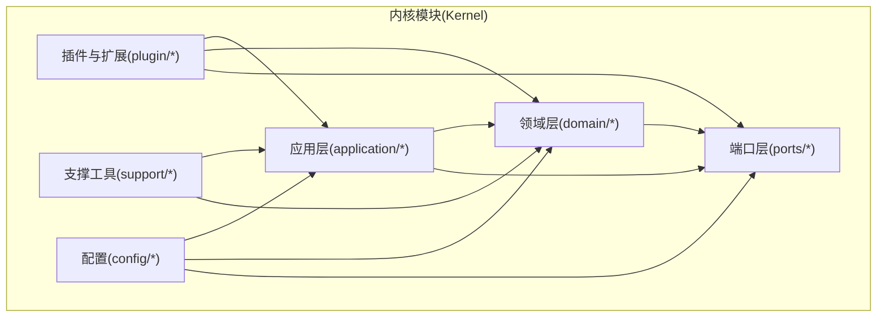

**图表来源**
- [KernelRuntimeMode.java](file://seahorse-agent-kernel/src/main/java/com/miracle/ai/seahorse/agent/kernel/config/KernelRuntimeMode.java)
- [AgentSPI.java](file://seahorse-agent-kernel/src/main/java/com/miracle/ai/seahorse/agent/kernel/plugin/AgentSPI.java)
- [DefaultExtensionRegistry.java](file://seahorse-agent-kernel/src/main/java/com/miracle/ai/seahorse/agent/kernel/plugin/DefaultExtensionRegistry.java)

**章节来源**
- [pom.xml](file://seahorse-agent-kernel/pom.xml)
- [KernelRuntimeMode.java](file://seahorse-agent-kernel/src/main/java/com/miracle/ai/seahorse/agent/kernel/config/KernelRuntimeMode.java)

## 核心组件
- Clean Architecture分层与依赖倒置
  - 应用服务层负责编排业务用例，不直接依赖外部实现，仅依赖领域模型与出站端口。
  - 领域层封装核心业务规则与不变量，保持与基础设施无关。
  - 端口层将"依赖倒置"具体化：入站端口定义外部如何调用应用服务；出站端口定义应用服务如何访问外部设施。
- 入站端口（Inbound Ports）
  - 承载外部请求，如HTTP、消息队列或本地调用，统一进入应用服务。
  - 通过接口契约约束输入输出，便于替换实现与测试。
- 出站端口（Outbound Ports）
  - 抽象外部能力，如缓存、存储、消息队列、向量检索、观察与指标等。
  - 具体适配器在运行时注入，实现与实现细节的解耦。
- 插件系统与SPI
  - 通过AgentSPI定义扩展点，ExtensionLoader负责扫描与装配，DefaultExtensionRegistry集中注册与管理。
  - 提供特性开关、健康度评估与上下文激活，支持按需启用与治理。

**章节来源**
- [AgentSPI.java](file://seahorse-agent-kernel/src/main/java/com/miracle/ai/seahorse/agent/kernel/plugin/AgentSPI.java)
- [DefaultExtensionRegistry.java](file://seahorse-agent-kernel/src/main/java/com/miracle/ai/seahorse/agent/kernel/plugin/DefaultExtensionRegistry.java)
- [ExtensionLoader.java](file://seahorse-agent-kernel/src/main/java/com/miracle/ai/seahorse/agent/kernel/plugin/ExtensionLoader.java)
- [ExtensionDescriptor.java](file://seahorse-agent-kernel/src/main/java/com/miracle/ai/seahorse/agent/kernel/plugin/ExtensionDescriptor.java)
- [ExtensionRegistration.java](file://seahorse-agent-kernel/src/main/java/com/miracle/ai/seahorse/agent/kernel/plugin/ExtensionRegistration.java)
- [FeatureActivationContext.java](file://seahorse-agent-kernel/src/main/java/com/miracle/ai/seahorse/agent/kernel/plugin/FeatureActivationContext.java)
- [FeatureHealth.java](file://seahorse-agent-kernel/src/main/java/com/miracle/ai/seahorse/agent/kernel/plugin/FeatureHealth.java)
- [FeatureHealthAggregator.java](file://seahorse-agent-kernel/src/main/java/com/miracle/ai/seahorse/agent/kernel/plugin/FeatureHealthAggregator.java)
- [FeatureHealthReport.java](file://seahorse-agent-kernel/src/main/java/com/miracle/ai/seahorse/agent/kernel/plugin/FeatureHealthReport.java)
- [FeatureType.java](file://seahorse-agent-kernel/src/main/java/com/miracle/ai/seahorse/agent/kernel/plugin/FeatureType.java)
- [AgentExtension.java](file://seahorse-agent-kernel/src/main/java/com/miracle/ai/seahorse/agent/kernel/plugin/AgentExtension.java)
- [AgentFeature.java](file://seahorse-agent-kernel/src/main/java/com/miracle/ai/seahorse/agent/kernel/plugin/AgentFeature.java)
- [AgentFeatureProperties.java](file://seahorse-agent-kernel/src/main/java/com/miracle/ai/seahorse/agent/kernel/plugin/AgentFeatureProperties.java)

## 架构总览
Kernel遵循Clean Architecture，以"用例为中心"的应用服务编排领域模型，通过端口隔离外部变化。下图展示典型交互：客户端经入站端口进入应用服务，应用服务调用领域模型与出站端口，最终由适配器落地到外部系统。

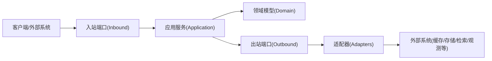

**图表来源**
- [NoopFallback.java](file://seahorse-agent-kernel/src/main/java/com/miracle/ai/seahorse/agent/ports/common/NoopFallback.java)
- [AgentSPI.java](file://seahorse-agent-kernel/src/main/java/com/miracle/ai/seahorse/agent/kernel/plugin/AgentSPI.java)

## 详细组件分析

### 清洁架构与分层职责
- 应用层（Application）
  - 聚焦业务用例编排，协调领域模型与出站端口，保证用例边界清晰、可测试。
  - 示例场景：智能问答、知识库检索、会话记忆、文档处理流水线、工作流可视化等。
- 领域层（Domain）
  - 封装核心业务规则与不变量，如记忆聚合、意图识别、检索策略、知识库版本管理等。
  - 通过实体与值对象表达业务语义，避免被外部实现污染。
- 端口层（Ports）
  - 入站端口：定义外部调用契约，屏蔽传输细节。
  - 出站端口：抽象外部能力，便于替换与扩展。

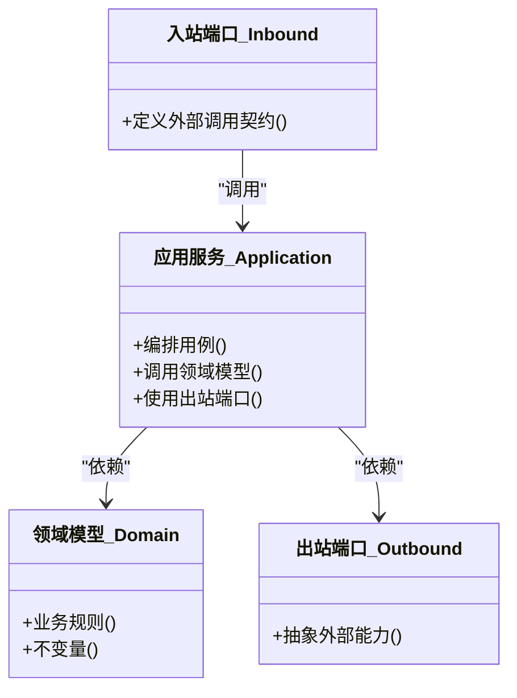

**图表来源**
- [AgentSPI.java](file://seahorse-agent-kernel/src/main/java/com/miracle/ai/seahorse/agent/kernel/plugin/AgentSPI.java)

**章节来源**
- [AgentSPI.java](file://seahorse-agent-kernel/src/main/java/com/miracle/ai/seahorse/agent/kernel/plugin/AgentSPI.java)

### 智能文档处理与知识库管理
- 文档处理流水线
  - 输入：多源文档（本地/云存储/第三方平台）。
  - 处理：解析、清洗、分块、向量化、索引构建与更新。
  - 输出：可检索的知识条目与向量嵌入，支撑后续检索与问答。
- 知识库管理
  - 支持知识库的创建、更新、版本控制与权限治理。
  - 提供关键词索引与元数据管理，提升检索效率与准确性。

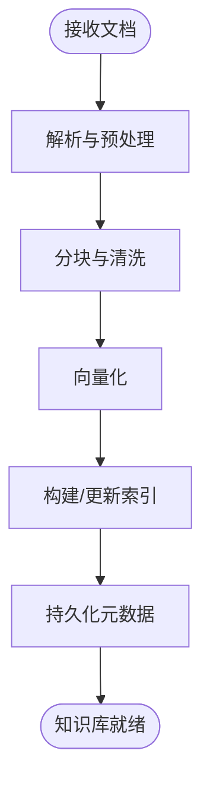

**图表来源**
- [docs/zh/开发指南/WEB-IMPROVEMENTS-DETAILED-DESIGN.md](file://docs/zh/开发指南/WEB-IMPROVEMENTS-DETAILED-DESIGN.md)
- [docs/zh/开发指南/WEB-IMPROVEMENTS-DELIVERY-SUMMARY.md](file://docs/zh/开发指南/WEB-IMPROVEMENTS-DELIVERY-SUMMARY.md)

**章节来源**
- [docs/zh/开发指南/WEB-IMPROVEMENTS-DETAILED-DESIGN.md](file://docs/zh/开发指南/WEB-IMPROVEMENTS-DETAILED-DESIGN.md)
- [docs/zh/开发指南/WEB-IMPROVEMENTS-DELIVERY-SUMMARY.md](file://docs/zh/开发指南/WEB-IMPROVEMENTS-DELIVERY-SUMMARY.md)

### 会话记忆与检索增强
- 记忆聚合与过滤
  - 基于上下文与意图对历史对话进行聚合与过滤，减少噪声，提升相关性。
- 检索策略
  - 结合关键词索引与向量相似度，提供混合检索与重排序。
- 上下文编织
  - 将检索结果与用户问题动态编织为上下文，增强回答质量。

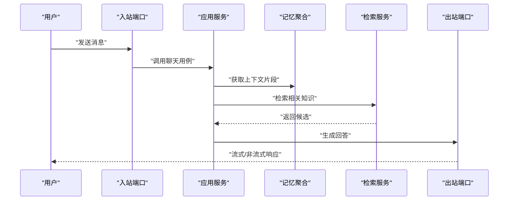

**图表来源**
- [docs/zh/架构设计/Seahorse Agent记忆系统Gemini架构深度分析与实施方案.md](file://docs/zh/架构设计/Seahorse Agent记忆系统Gemini架构深度分析与实施方案.md)
- [docs/zh/架构设计/Seahorse Agent记忆系统现状与Gemini文档差距对照.md](file://docs/zh/架构设计/Seahorse Agent记忆系统现状与Gemini文档差距对照.md)

**章节来源**
- [docs/zh/架构设计/Seahorse Agent记忆系统Gemini架构深度分析与实施方案.md](file://docs/zh/架构设计/Seahorse Agent记忆系统Gemini架构深度分析与实施方案.md)
- [docs/zh/架构设计/Seahorse Agent记忆系统现状与Gemini文档差距对照.md](file://docs/zh/架构设计/Seahorse Agent记忆系统现状与Gemini文档差距对照.md)

### 智能问答与意图识别
- 意图识别
  - 对用户输入进行意图分类与槽位抽取，指导后续处理路径。
- 多轮对话
  - 基于记忆与上下文，维持连贯的对话状态。
- 工具与MCP集成
  - 通过MCP协议桥接外部工具与能力，实现"思考-行动"闭环。

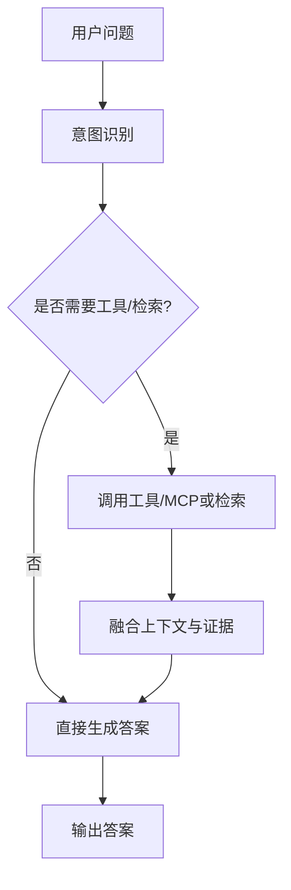

**图表来源**
- [docs/zh/开发指南/WORKFLOW-VISUALIZATION-BACKEND-DESIGN.md](file://docs/zh/开发指南/WORKFLOW-VISUALIZATION-BACKEND-DESIGN.md)
- [docs/zh/开发指南/WORKFLOW-BACKEND-DESIGN-SIMPLE.md](file://docs/zh/开发指南/WORKFLOW-BACKEND-DESIGN-SIMPLE.md)

**章节来源**
- [docs/zh/开发指南/WORKFLOW-VISUALIZATION-BACKEND-DESIGN.md](file://docs/zh/开发指南/WORKFLOW-VISUALIZATION-BACKEND-DESIGN.md)
- [docs/zh/开发指南/WORKFLOW-BACKEND-DESIGN-SIMPLE.md](file://docs/zh/开发指南/WORKFLOW-BACKEND-DESIGN-SIMPLE.md)

### 端口接口设计：入站与出站
- 入站端口（Inbound）
  - 定义外部调用契约，屏蔽传输细节（HTTP/消息队列/本地调用）。
  - 通过接口约束请求与响应格式，便于替换实现与测试。
- 出站端口（Outbound）
  - 抽象外部能力，如缓存、存储、消息队列、向量检索、观察与指标等。
  - 具体适配器在运行时注入，实现与实现细节的解耦。

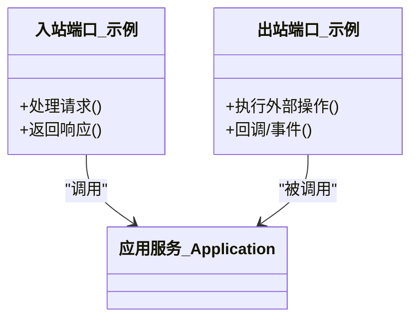

**图表来源**
- [NoopFallback.java](file://seahorse-agent-kernel/src/main/java/com/miracle/ai/seahorse/agent/ports/common/NoopFallback.java)

**章节来源**
- [NoopFallback.java](file://seahorse-agent-kernel/src/main/java/com/miracle/ai/seahorse/agent/ports/common/NoopFallback.java)

### 插件系统与SPI机制
- SPI定义
  - AgentSPI定义扩展点，允许第三方或内部模块以声明式方式接入内核。
- 扩展加载与注册
  - ExtensionLoader扫描类路径下的扩展描述，ExtensionDescriptor描述扩展元信息。
  - DefaultExtensionRegistry集中注册与管理扩展，支持按需启用与生命周期管理。
- 特性管理
  - AgentFeature与AgentFeatureProperties定义特性开关与属性。
  - FeatureActivationContext提供激活上下文，FeatureHealth/FeatureHealthAggregator/FeatureHealthReport用于健康度评估与报告。
- 运行时模式
  - KernelRuntimeMode提供运行时模式配置，影响行为与可观测性。

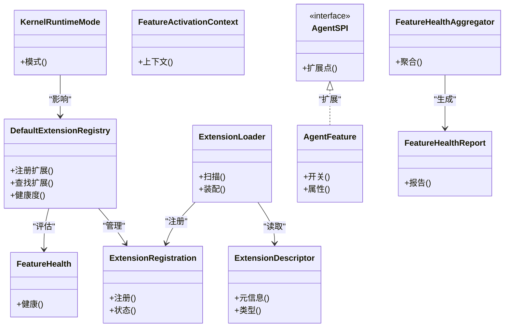

**图表来源**
- [AgentSPI.java](file://seahorse-agent-kernel/src/main/java/com/miracle/ai/seahorse/agent/kernel/plugin/AgentSPI.java)
- [ExtensionDescriptor.java](file://seahorse-agent-kernel/src/main/java/com/miracle/ai/seahorse/agent/kernel/plugin/ExtensionDescriptor.java)
- [ExtensionRegistration.java](file://seahorse-agent-kernel/src/main/java/com/miracle/ai/seahorse/agent/kernel/plugin/ExtensionRegistration.java)
- [DefaultExtensionRegistry.java](file://seahorse-agent-kernel/src/main/java/com/miracle/ai/seahorse/agent/kernel/plugin/DefaultExtensionRegistry.java)
- [ExtensionLoader.java](file://seahorse-agent-kernel/src/main/java/com/miracle/ai/seahorse/agent/kernel/plugin/ExtensionLoader.java)
- [AgentFeature.java](file://seahorse-agent-kernel/src/main/java/com/miracle/ai/seahorse/agent/kernel/plugin/AgentFeature.java)
- [AgentFeatureProperties.java](file://seahorse-agent-kernel/src/main/java/com/miracle/ai/seahorse/agent/kernel/plugin/AgentFeatureProperties.java)
- [FeatureActivationContext.java](file://seahorse-agent-kernel/src/main/java/com/miracle/ai/seahorse/agent/kernel/plugin/FeatureActivationContext.java)
- [FeatureHealth.java](file://seahorse-agent-kernel/src/main/java/com/miracle/ai/seahorse/agent/kernel/plugin/FeatureHealth.java)
- [FeatureHealthAggregator.java](file://seahorse-agent-kernel/src/main/java/com/miracle/ai/seahorse/agent/kernel/plugin/FeatureHealthAggregator.java)
- [FeatureHealthReport.java](file://seahorse-agent-kernel/src/main/java/com/miracle/ai/seahorse/agent/kernel/plugin/FeatureHealthReport.java)
- [KernelRuntimeMode.java](file://seahorse-agent-kernel/src/main/java/com/miracle/ai/seahorse/agent/kernel/config/KernelRuntimeMode.java)

**章节来源**
- [AgentSPI.java](file://seahorse-agent-kernel/src/main/java/com/miracle/ai/seahorse/agent/kernel/plugin/AgentSPI.java)
- [DefaultExtensionRegistry.java](file://seahorse-agent-kernel/src/main/java/com/miracle/ai/seahorse/agent/kernel/plugin/DefaultExtensionRegistry.java)
- [ExtensionLoader.java](file://seahorse-agent-kernel/src/main/java/com/miracle/ai/seahorse/agent/kernel/plugin/ExtensionLoader.java)
- [ExtensionDescriptor.java](file://seahorse-agent-kernel/src/main/java/com/miracle/ai/seahorse/agent/kernel/plugin/ExtensionDescriptor.java)
- [ExtensionRegistration.java](file://seahorse-agent-kernel/src/main/java/com/miracle/ai/seahorse/agent/kernel/plugin/ExtensionRegistration.java)
- [FeatureActivationContext.java](file://seahorse-agent-kernel/src/main/java/com/miracle/ai/seahorse/agent/kernel/plugin/FeatureActivationContext.java)
- [FeatureHealth.java](file://seahorse-agent-kernel/src/main/java/com/miracle/ai/seahorse/agent/kernel/plugin/FeatureHealth.java)
- [FeatureHealthAggregator.java](file://seahorse-agent-kernel/src/main/java/com/miracle/ai/seahorse/agent/kernel/plugin/FeatureHealthAggregator.java)
- [FeatureHealthReport.java](file://seahorse-agent-kernel/src/main/java/com/miracle/ai/seahorse/agent/kernel/plugin/FeatureHealthReport.java)
- [FeatureType.java](file://seahorse-agent-kernel/src/main/java/com/miracle/ai/seahorse/agent/kernel/plugin/FeatureType.java)
- [AgentExtension.java](file://seahorse-agent-kernel/src/main/java/com/miracle/ai/seahorse/agent/kernel/plugin/AgentExtension.java)
- [AgentFeature.java](file://seahorse-agent-kernel/src/main/java/com/miracle/ai/seahorse/agent/kernel/plugin/AgentFeature.java)
- [AgentFeatureProperties.java](file://seahorse-agent-kernel/src/main/java/com/miracle/ai/seahorse/agent/kernel/plugin/AgentFeatureProperties.java)
- [KernelRuntimeMode.java](file://seahorse-agent-kernel/src/main/java/com/miracle/ai/seahorse/agent/kernel/config/KernelRuntimeMode.java)

### 扩展开发指南
- 定义扩展点
  - 在AgentSPI中声明扩展点，明确输入输出与职责边界。
- 实现扩展
  - 实现ExtensionDescriptor描述扩展元信息，实现ExtensionRegistration完成注册。
- 注册与启用
  - 使用DefaultExtensionRegistry注册扩展，结合AgentFeature与AgentFeatureProperties进行特性开关与参数配置。
- 健康与可观测
  - 通过FeatureHealth/FeatureHealthAggregator/FeatureHealthReport进行健康度评估与报告，配合KernelRuntimeMode进行运行时行为控制。
- 最佳实践
  - 保持扩展无副作用、幂等与可回滚；提供完备的错误处理与降级策略；通过入站/出站端口与内核解耦。

**章节来源**
- [AgentSPI.java](file://seahorse-agent-kernel/src/main/java/com/miracle/ai/seahorse/agent/kernel/plugin/AgentSPI.java)
- [DefaultExtensionRegistry.java](file://seahorse-agent-kernel/src/main/java/com/miracle/ai/seahorse/agent/kernel/plugin/DefaultExtensionRegistry.java)
- [ExtensionDescriptor.java](file://seahorse-agent-kernel/src/main/java/com/miracle/ai/seahorse/agent/kernel/plugin/ExtensionDescriptor.java)
- [ExtensionRegistration.java](file://seahorse-agent-kernel/src/main/java/com/miracle/ai/seahorse/agent/kernel/plugin/ExtensionRegistration.java)
- [AgentFeature.java](file://seahorse-agent-kernel/src/main/java/com/miracle/ai/seahorse/agent/kernel/plugin/AgentFeature.java)
- [AgentFeatureProperties.java](file://seahorse-agent-kernel/src/main/java/com/miracle/ai/seahorse/agent/kernel/plugin/AgentFeatureProperties.java)
- [FeatureHealth.java](file://seahorse-agent-kernel/src/main/java/com/miracle/ai/seahorse/agent/kernel/plugin/FeatureHealth.java)
- [FeatureHealthAggregator.java](file://seahorse-agent-kernel/src/main/java/com/miracle/ai/seahorse/agent/kernel/plugin/FeatureHealthAggregator.java)
- [FeatureHealthReport.java](file://seahorse-agent-kernel/src/main/java/com/miracle/ai/seahorse/agent/kernel/plugin/FeatureHealthReport.java)
- [KernelRuntimeMode.java](file://seahorse-agent-kernel/src/main/java/com/miracle/ai/seahorse/agent/kernel/config/KernelRuntimeMode.java)

## 新增内核服务模块

### 知识库增强服务
Kernel新增了完整的知识库增强服务模块，提供企业级知识管理能力：

- **版本管理服务**
  - 支持知识库版本快照与回滚机制
  - 自动保护性快照创建，防止意外回滚
  - 版本对比与变更追踪
- **权限控制服务**
  - MVP阶段支持个人权限模型（OWNER/EDITOR/VIEWER）
  - 团队权限模型的Phase 2扩展规划
  - 细粒度的文档访问控制
- **分享与协作**
  - 默认7天分享过期时间（1-30天可配置）
  - 安全的临时访问链接生成
  - 协作编辑与版本同步

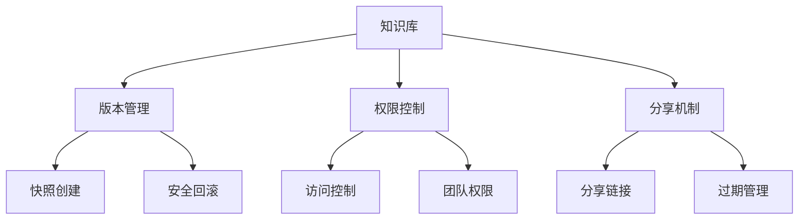

**图表来源**
- [docs/aegis/plans/saas-mvp-impl/06-knowledge-base-enhancement.md](file://docs/aegis/plans/saas-mvp-impl/06-knowledge-base-enhancement.md)
- [resources/database/migrations/V8__knowledge_base_enhancement.sql](file://resources/database/migrations/V8__knowledge_base_enhancement.sql)

**章节来源**
- [docs/aegis/plans/saas-mvp-impl/06-knowledge-base-enhancement.md](file://docs/aegis/plans/saas-mvp-impl/06-knowledge-base-enhancement.md)
- [resources/database/migrations/V8__knowledge_base_enhancement.sql](file://resources/database/migrations/V8__knowledge_base_enhancement.sql)

### 代理市场服务
Kernel实现了完整的代理市场生态系统，支持Agent的商业化运营：

- **代理定义管理**
  - 可见性控制（公开/私有）
  - 多样化的定价模型（免费/一次性付费/订阅制）
  - 评分与评价系统
- **订阅与收益分配**
  - 创作者80%收益分成，平台20%分成
  - 热度算法计算（订阅数40% + 评分30% + 活跃运行20% + 新品加成10%）
- **审核与质量控制**
  - MVP阶段人工审核流程
  - Phase 2计划引入自动审核机制
  - 代理质量评级与推荐

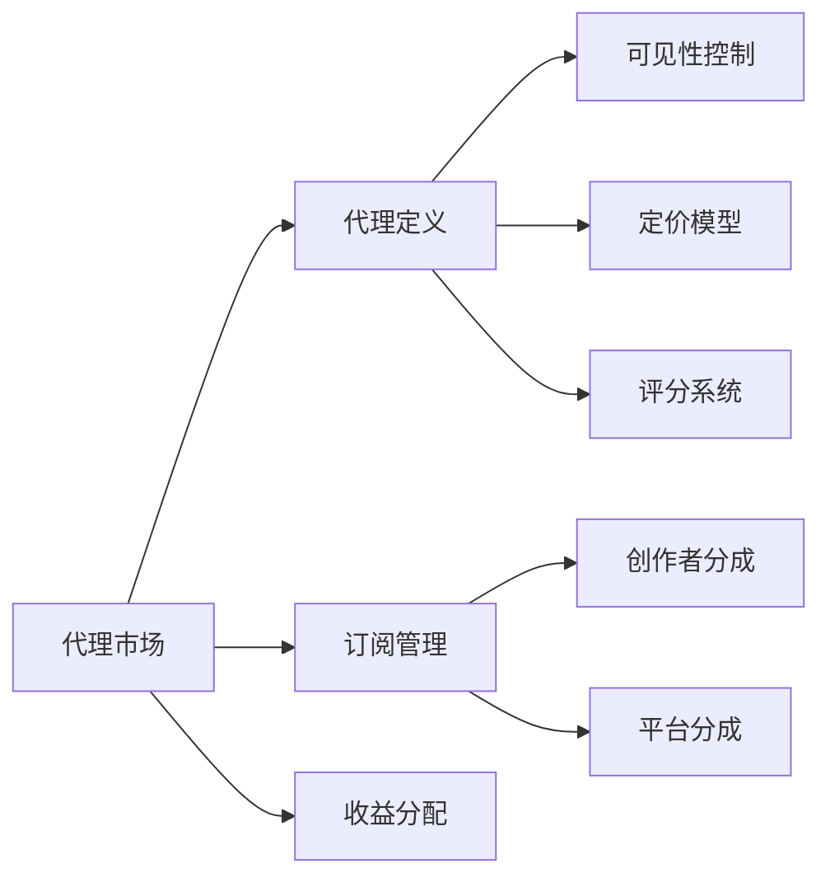

**图表来源**
- [docs/aegis/plans/saas-mvp-impl/07-agent-marketplace.md](file://docs/aegis/plans/saas-mvp-impl/07-agent-marketplace.md)
- [resources/database/migrations/V9__agent_marketplace.sql](file://resources/database/migrations/V9__agent_marketplace.sql)

**章节来源**
- [docs/aegis/plans/saas-mvp-impl/07-agent-marketplace.md](file://docs/aegis/plans/saas-mvp-impl/07-agent-marketplace.md)
- [resources/database/migrations/V9__agent_marketplace.sql](file://resources/database/migrations/V9__agent_marketplace.sql)

### 管理员操作面板
Kernel提供了完整的管理员操作界面，支持多维度的系统治理：

- **路由配置**
  - 详细的管理员路由定义，包括知识库管理、Agent运行管理、工具目录等
  - 基于特性开关的权限控制
  - 动态菜单生成与权限验证
- **功能模块**
  - 知识库管理与文档查看
  - Agent运行状态监控与管理
  - 工具目录与调用审计
  - 审批中心与合规管理
  - RAG评测与链路追踪
  - 系统设置与配置管理

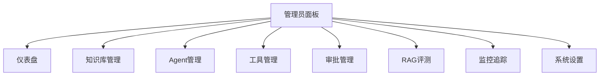

**图表来源**
- [frontend/src/router.tsx](file://frontend/src/router.tsx)
- [frontend/src/pages/admin/AdminLayout.tsx](file://frontend/src/pages/admin/AdminLayout.tsx)

**章节来源**
- [frontend/src/router.tsx](file://frontend/src/router.tsx)
- [frontend/src/pages/admin/AdminLayout.tsx](file://frontend/src/pages/admin/AdminLayout.tsx)

### 工作流可视化服务
Kernel新增了工作流可视化服务，提供Agent执行过程的实时监控与调试能力：

- **执行步骤跟踪**
  - ExecutionStepAggregate聚合执行步骤状态
  - 实时工作流状态可视化
  - 步骤级别的错误诊断与重试机制
- **事件发布与订阅**
  - WorkflowEventPublisher事件发布机制
  - 工作流执行过程的事件驱动架构
  - 支持异步事件处理与状态同步
- **可视化展示**
  - 执行流程的图形化展示
  - 关键节点的状态指示
  - 性能指标与延迟监控

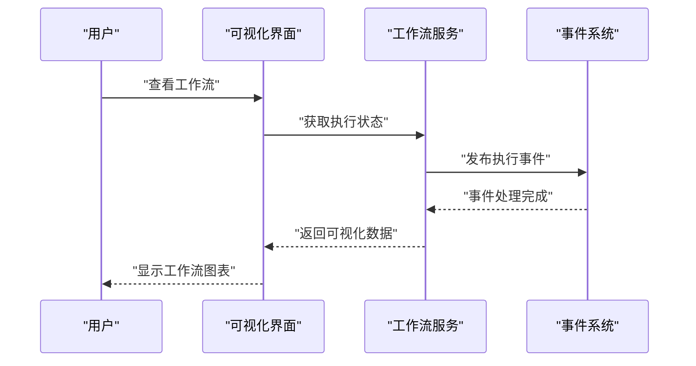

**图表来源**
- [seahorse-agent-kernel/src/main/java/com/miracle/ai/seahorse/agent/kernel/application/workflow/KernelWorkflowVisualizationService.java](file://seahorse-agent-kernel/src/main/java/com/miracle/ai/seahorse/agent/kernel/application/workflow/KernelWorkflowVisualizationService.java)
- [seahorse-agent-kernel/src/main/java/com/miracle/ai/seahorse/agent/ports/outbound/workflow/WorkflowVisualizationRepositoryPort.java](file://seahorse-agent-kernel/src/main/java/com/miracle/ai/seahorse/agent/ports/outbound/workflow/WorkflowVisualizationRepositoryPort.java)

**章节来源**
- [seahorse-agent-kernel/src/main/java/com/miracle/ai/seahorse/agent/kernel/application/workflow/KernelWorkflowVisualizationService.java](file://seahorse-agent-kernel/src/main/java/com/miracle/ai/seahorse/agent/kernel/application/workflow/KernelWorkflowVisualizationService.java)
- [seahorse-agent-kernel/src/main/java/com/miracle/ai/seahorse/agent/kernel/domain/agent/workflow/ExecutionStepAggregate.java](file://seahorse-agent-kernel/src/main/java/com/miracle/ai/seahorse/agent/kernel/domain/agent/workflow/ExecutionStepAggregate.java)
- [seahorse-agent-kernel/src/main/java/com/miracle/ai/seahorse/agent/ports/inbound/workflow/WorkflowVisualizationInboundPort.java](file://seahorse-agent-kernel/src/main/java/com/miracle/ai/seahorse/agent/ports/inbound/workflow/WorkflowVisualizationInboundPort.java)

### 高级RAG服务
Kernel实现了高级RAG（检索增强生成）架构，提供企业级的检索增强能力：

- **检索策略优化**
  - 多模态检索与重排序
  - 查询优化与意图理解
  - 上下文感知的检索增强
- **评测与质量控制**
  - RAG评测数据集管理
  - 检索质量指标评估
  - 版本对比与性能基准
- **链路追踪与可观测性**
  - 完整的RAG执行链路追踪
  - 性能瓶颈识别与优化
  - 用户查询到答案的全流程监控

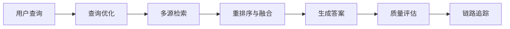

**图表来源**
- [docs/aegis/plans/saas-mvp-impl/09-advanced-rag.md](file://docs/aegis/plans/saas-mvp-impl/09-advanced-rag.md)

**章节来源**
- [docs/aegis/plans/saas-mvp-impl/09-advanced-rag.md](file://docs/aegis/plans/saas-mvp-impl/09-advanced-rag.md)

## 访问控制日志记录增强

### ACL决策日志记录机制
Kernel增强了访问控制日志记录功能，特别是在ACL决策DENY时提供更详细的安全可见性。这一增强通过以下组件实现：

- **AccessDecisionLogPort端口接口**
  - 定义访问决策日志记录的标准接口
  - 支持记录ACL决策的详细信息，包括决策ID、效果、原因代码等
  - 提供空实现（empty）以便在不需要日志记录时使用

- **KernelContextPackBuilderService中的ACL决策处理**
  - 在构建上下文包时检查ACL决策
  - 当检测到ACL决策为DENY时，记录WARN级别的日志
  - 提供更好的安全可见性和调试能力

- **AuditedResourceAccessPolicyPort集成**
  - 与审计日志系统集成，确保所有访问决策都被记录
  - 支持访问决策的审计跟踪和合规要求
  - 提供完整的访问历史记录

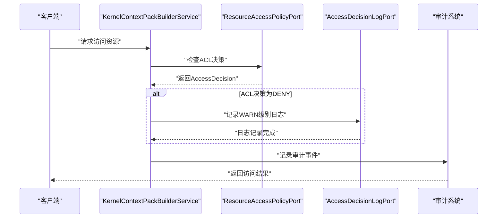

**图表来源**
- [KernelContextPackBuilderService.java](file://seahorse-agent-kernel/src/main/java/com/miracle/ai/seahorse/agent/kernel/application/agent/context/KernelContextPackBuilderService.java)
- [AuditedResourceAccessPolicyPort.java](file://seahorse-agent-kernel/src/main/java/com/miracle/ai/seahorse/agent/kernel/application/agent/context/AuditedResourceAccessPolicyPort.java)
- [AccessDecisionLogPort.java](file://seahorse-agent-kernel/src/main/java/com/miracle/ai/seahorse/agent/ports/outbound/agent/AccessDecisionLogPort.java)

### 日志记录策略与安全可见性
- **分级日志记录**
  - ACL决策为ALLOW时：记录INFO级别日志
  - ACL决策为DENY时：记录WARN级别日志，提供额外的安全关注点
  - 包含完整的决策上下文信息，便于安全审计和调试

- **审计合规支持**
  - 所有访问决策都记录到审计系统
  - 支持合规要求的访问日志保留和查询
  - 提供访问决策的完整生命周期跟踪

- **调试与故障排查**
  - 增强的访问控制问题诊断能力
  - 提供详细的决策原因和上下文信息
  - 支持安全事件的快速定位和分析

**章节来源**
- [KernelContextPackBuilderService.java](file://seahorse-agent-kernel/src/main/java/com/miracle/ai/seahorse/agent/kernel/application/agent/context/KernelContextPackBuilderService.java)
- [AuditedResourceAccessPolicyPort.java](file://seahorse-agent-kernel/src/main/java/com/miracle/ai/seahorse/agent/kernel/application/agent/context/AuditedResourceAccessPolicyPort.java)
- [AccessDecisionLogPort.java](file://seahorse-agent-kernel/src/main/java/com/miracle/ai/seahorse/agent/ports/outbound/agent/AccessDecisionLogPort.java)
- [ResourceAccessReasonCodes.java](file://seahorse-agent-kernel/src/main/java/com/miracle/ai/seahorse/agent/kernel/domain/agent/context/ResourceAccessReasonCodes.java)
- [AuditedResourceAccessPolicyPortTests.java](file://seahorse-agent-kernel/src/test/java/com/miracle/ai/seahorse/agent/kernel/application/agent/context/AuditedResourceAccessPolicyPortTests.java)

## 依赖分析
- 内部依赖
  - 应用层依赖领域层与出站端口，不反向依赖基础设施。
  - 插件系统通过SPI与注册表解耦扩展与内核。
  - 新增模块通过专门的应用服务层与领域模型集成。
  - 访问控制日志记录功能通过AccessDecisionLogPort端口实现解耦。
- 外部依赖
  - 通过出站端口对接缓存、存储、消息队列、向量检索、观察与指标等基础设施。
  - 新增模块依赖数据库版本迁移与前端路由配置。
  - 访问控制日志记录功能依赖日志框架和审计系统。
- 可能的循环依赖
  - 通过端口隔离避免应用层与领域层之间的直接循环依赖。
  - 插件系统通过注册表集中管理，降低循环风险。
  - 新增模块采用分层架构，避免相互依赖。
  - 访问控制日志记录功能通过端口接口实现松耦合。

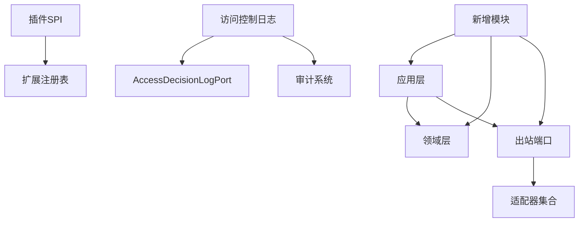

**图表来源**
- [AgentSPI.java](file://seahorse-agent-kernel/src/main/java/com/miracle/ai/seahorse/agent/kernel/plugin/AgentSPI.java)
- [DefaultExtensionRegistry.java](file://seahorse-agent-kernel/src/main/java/com/miracle/ai/seahorse/agent/kernel/plugin/DefaultExtensionRegistry.java)
- [AccessDecisionLogPort.java](file://seahorse-agent-kernel/src/main/java/com/miracle/ai/seahorse/agent/ports/outbound/agent/AccessDecisionLogPort.java)

**章节来源**
- [AgentSPI.java](file://seahorse-agent-kernel/src/main/java/com/miracle/ai/seahorse/agent/kernel/plugin/AgentSPI.java)
- [DefaultExtensionRegistry.java](file://seahorse-agent-kernel/src/main/java/com/miracle/ai/seahorse/agent/kernel/plugin/DefaultExtensionRegistry.java)
- [AccessDecisionLogPort.java](file://seahorse-agent-kernel/src/main/java/com/miracle/ai/seahorse/agent/ports/outbound/agent/AccessDecisionLogPort.java)

## 性能考虑
- 检索与向量化
  - 合理设置向量维度与索引策略，平衡召回与速度。
  - 使用关键词索引与向量索引的混合策略，减少全量扫描。
  - 新增RAG评测模块的性能基准测试与优化。
- 缓存与限流
  - 利用出站端口的缓存与限流能力，降低后端压力与抖动。
  - 知识库增强模块的版本快照缓存策略。
- 并发与异步
  - 在应用层合理拆分任务，利用异步与背压机制提升吞吐。
  - 工作流可视化服务的异步事件处理机制。
- 观测与治理
  - 通过出站端口的观察与指标能力，持续监控延迟、错误率与资源占用。
  - 新增管理员操作面板的系统健康监控与告警机制。
- 访问控制日志记录性能
  - AccessDecisionLogPort提供空实现以避免不必要的日志开销
  - 分级日志记录策略，仅在DENY时产生额外的日志开销
  - 审计日志的批量写入和异步处理机制

## 故障排查指南
- 入站端口问题
  - 检查入站端口契约与参数校验，确认请求格式与鉴权。
- 出站端口问题
  - 核对适配器配置与连接参数，验证外部系统可用性与权限。
- 插件问题
  - 查看扩展注册表状态与健康度报告，定位失败扩展与异常原因。
- 记忆与检索问题
  - 校验记忆聚合策略与检索参数，确认索引完整性与一致性。
- 新增模块问题
  - 知识库增强：检查版本快照创建与权限配置。
  - 代理市场：验证定价模型与收益分配计算。
  - 管理员面板：确认路由权限与特性开关状态。
  - 工作流可视化：检查事件发布与订阅机制。
  - 高级RAG：验证检索策略与评测数据集配置。
- 访问控制日志记录问题
  - 检查AccessDecisionLogPort配置和实现
  - 验证ACL决策DENY时的日志记录是否正常
  - 确认审计系统的可用性和日志存储空间
  - 排查日志级别和过滤器配置问题

**章节来源**
- [NoopFallback.java](file://seahorse-agent-kernel/src/main/java/com/miracle/ai/seahorse/agent/ports/common/NoopFallback.java)
- [FeatureHealthReport.java](file://seahorse-agent-kernel/src/main/java/com/miracle/ai/seahorse/agent/kernel/plugin/FeatureHealthReport.java)
- [AccessDecisionLogPort.java](file://seahorse-agent-kernel/src/main/java/com/miracle/ai/seahorse/agent/ports/outbound/agent/AccessDecisionLogPort.java)

## 结论
Kernel以Clean Architecture为核心，通过入站/出站端口实现依赖倒置与可替换性，结合插件SPI与扩展注册体系，形成高内聚、低耦合且可演进的内核框架。围绕智能文档处理、知识库管理、会话记忆与智能问答的关键能力，Kernel提供了清晰的分层与职责边界，既满足企业级复杂场景需求，也为二次开发与生态扩展奠定坚实基础。

**更新** 本次更新全面反映了Kernel从单一Agent能力向企业级AI基础设施的演进，新增的知识库增强、代理市场、管理员操作、工作流可视化、高级RAG等模块，以及访问控制日志记录功能的增强，展现了Kernel在企业级应用场景中的完整能力矩阵，为构建下一代AI原生应用提供了坚实的内核支撑。

## 附录
- 快速开始与项目概述
  - 参考文档了解项目背景、目标与基本使用方式。
- 开发指南与最佳实践
  - 包含技术亮点吸收、非Web端过渡、记忆系统对齐计划与工作流设计等，帮助开发者高效参与。
- 新增模块开发指南
  - 知识库增强模块的版本管理与权限控制实现
  - 代理市场的商业化运营与收益分配机制
  - 管理员面板的路由配置与权限控制
  - 工作流可视化的事件驱动架构与状态管理
  - 高级RAG的检索优化与评测体系
  - 访问控制日志记录的实现与配置指南

**章节来源**
- [docs/zh/快速开始.md](file://docs/zh/快速开始.md)
- [docs/zh/项目概述.md](file://docs/zh/项目概述.md)
- [docs/zh/开发指南/开源项目技术亮点吸收与改进方案.md](file://docs/zh/开发指南/开源项目技术亮点吸收与改进方案.md)
- [docs/zh/开发指南/开源项目技术亮点吸收与改进方案-二次review报告.md](file://docs/zh/开发指南/开源项目技术亮点吸收与改进方案-二次review报告.md)
- [docs/zh/开发指南/Seahorse Agent非Web端过渡设计整改方案.md](file://docs/zh/开发指南/Seahorse Agent非Web端过渡设计整改方案.md)
- [docs/zh/开发指南/Seahorse Agent记忆系统Gemini对齐差距补齐开发设计与执行计划.md](file://docs/zh/开发指南/Seahorse Agent记忆系统Gemini对齐差距补齐开发设计与执行计划.md)
- [docs/zh/开发指南/agent-capability-phased-implementation-plan.md](file://docs/zh/开发指南/agent-capability-phased-implementation-plan.md)
- [docs/zh/开发指南/agent-vs-rag-capability-baseline.md](file://docs/zh/开发指南/agent-vs-rag-capability-baseline.md)
- [docs/zh/开发指南/code-standard-review.md](file://docs/zh/开发指南/code-standard-review.md)
- [docs/zh/开发指南/MEMORY-FIX-FINAL-STATUS.md](file://docs/zh/开发指南/MEMORY-FIX-FINAL-STATUS.md)
- [docs/zh/开发指南/MEMORY-FIX-SUMMARY.md](file://docs/zh/开发指南/MEMORY-FIX-SUMMARY.md)
- [docs/zh/开发指南/MEMORY-FIX-TODO.md](file://docs/zh/开发指南/MEMORY-FIX-TODO.md)
- [docs/zh/开发指南/MEMORY-SYSTEM-REVIEW.md](file://docs/zh/开发指南/MEMORY-SYSTEM-REVIEW.md)
- [docs/zh/开发指南/WEB-IMPROVEMENTS-QUICK-GUIDE.md](file://docs/zh/开发指南/WEB-IMPROVEMENTS-QUICK-GUIDE.md)
- [docs/zh/开发指南/WEB-IMPROVEMENTS-BACKEND-SUPPORT.md](file://docs/zh/开发指南/WEB-IMPROVEMENTS-BACKEND-SUPPORT.md)
- [docs/zh/开发指南/WEB-IMPROVEMENTS-DELIVERY-SUMMARY.md](file://docs/zh/开发指南/WEB-IMPROVEMENTS-DELIVERY-SUMMARY.md)
- [docs/zh/开发指南/WEB-IMPROVEMENTS-DETAILED-DESIGN.md](file://docs/zh/开发指南/WEB-IMPROVEMENTS-DETAILED-DESIGN.md)
- [docs/zh/开发指南/WEB-IMPROVEMENTS-FROM-DEERFLOW.md](file://docs/zh/开发指南/WEB-IMPROVEMENTS-FROM-DEERFLOW.md)
- [docs/zh/开发指南/WORKFLOW-BACKEND-DESIGN-SIMPLE.md](file://docs/zh/开发指南/WORKFLOW-BACKEND-DESIGN-SIMPLE.md)
- [docs/zh/开发指南/WORKFLOW-VISUALIZATION-BACKEND-DESIGN.md](file://docs/zh/开发指南/WORKFLOW-VISUALIZATION-BACKEND-DESIGN.md)