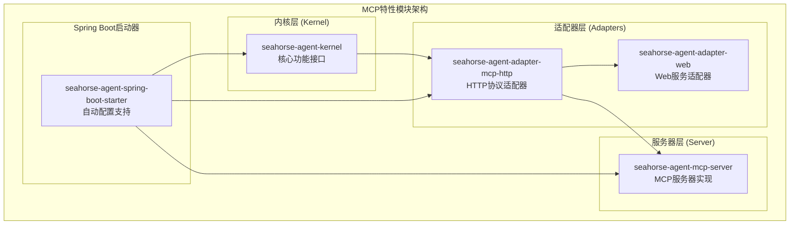
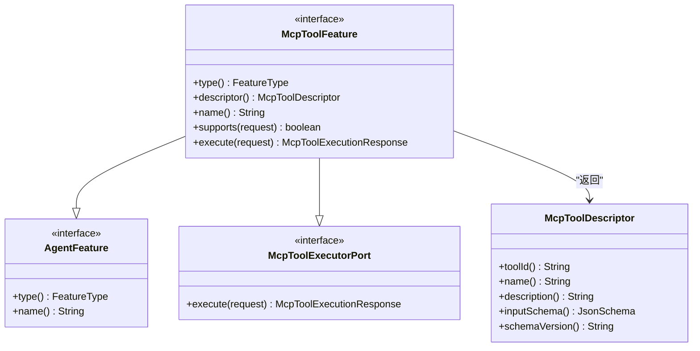
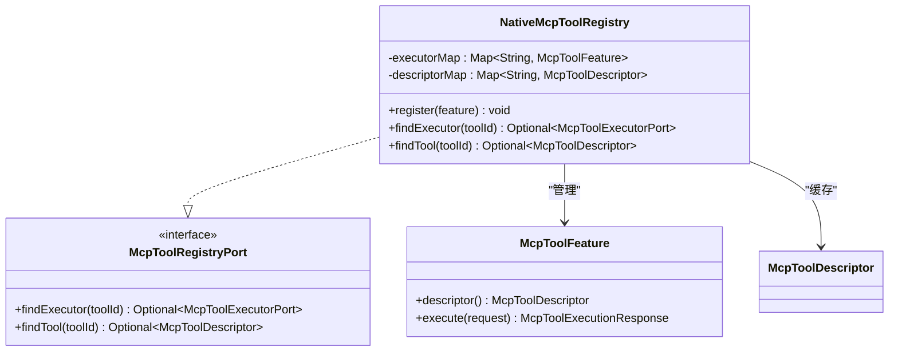
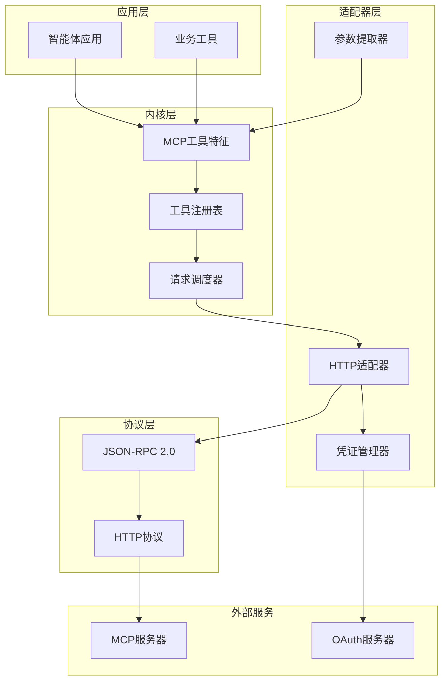
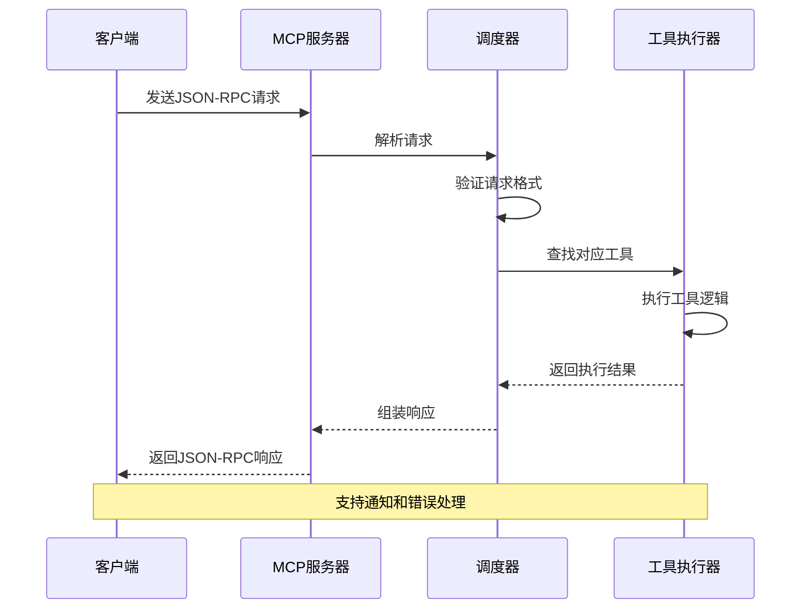
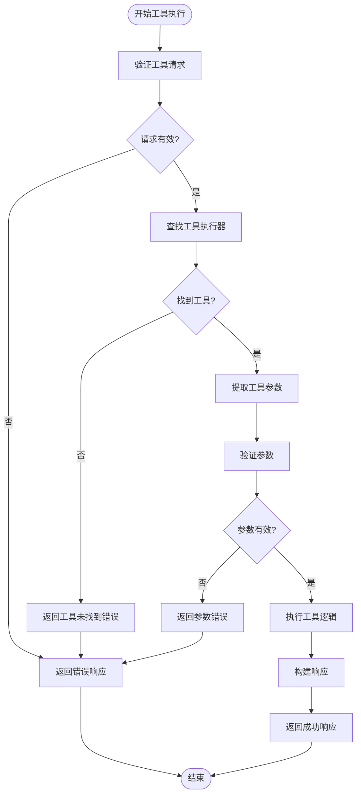
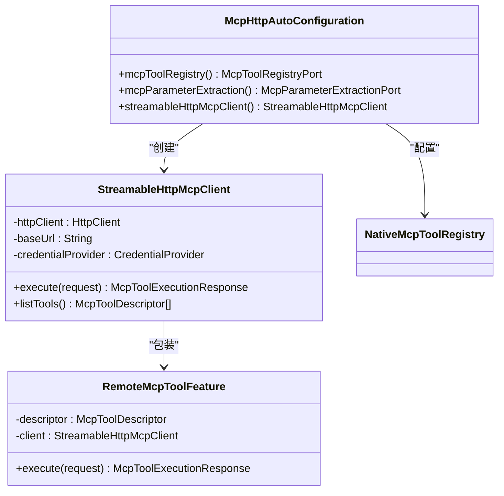
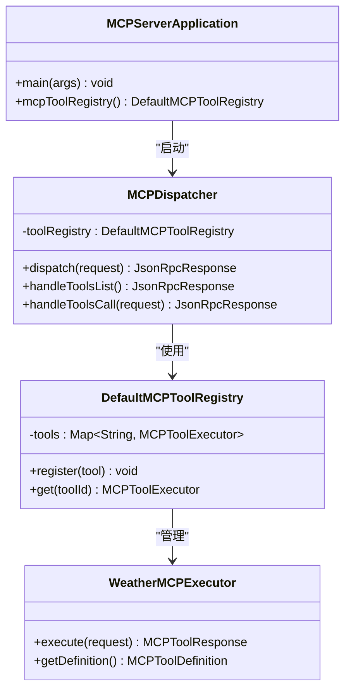
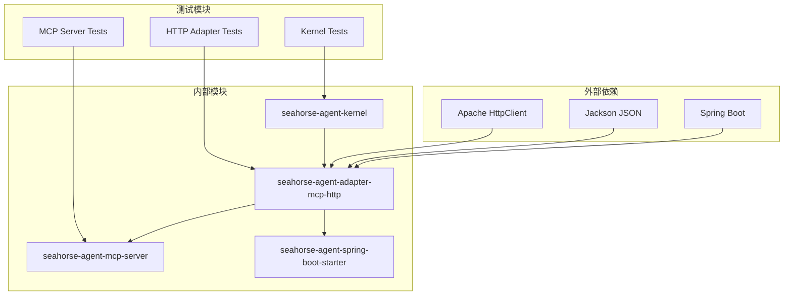

# MCP特性模块

<cite>
**本文档引用的文件**
- [McpToolFeature.java](file://seahorse-agent-kernel/src/main/java/com/miracle/ai/seahorse/agent/kernel/feature/mcp/McpToolFeature.java)
- [NativeMcpToolRegistry.java](file://seahorse-agent-adapter-mcp-http/src/main/java/com/miracle/ai/seahorse/agent/adapters/mcp/http/NativeMcpToolRegistry.java)
- [McpHttpAutoConfiguration.java](file://seahorse-agent-adapter-mcp-http/src/main/java/com/miracle/ai/seahorse/agent/adapters/mcp/http/McpHttpAutoConfiguration.java)
- [McpHttpAdapterProperties.java](file://seahorse-agent-adapter-mcp-http/src/main/java/com/miracle/ai/seahorse/agent/adapters/mcp/http/McpHttpAdapterProperties.java)
- [RemoteMcpToolFeature.java](file://seahorse-agent-adapter-mcp-http/src/main/java/com/miracle/ai/seahorse/agent/adapters/mcp/http/RemoteMcpToolFeature.java)
- [StreamableHttpMcpClient.java](file://seahorse-agent-adapter-mcp-http/src/main/java/com/miracle/ai/seahorse/agent/adapters/mcp/http/StreamableHttpMcpClient.java)
- [MCPDispatcher.java](file://seahorse-agent-mcp-server/src/main/java/com/miracle/ai/seahorse/agent/adapters/mcp/server/endpoint/MCPDispatcher.java)
- [DefaultMCPToolRegistry.java](file://seahorse-agent-mcp-server/src/main/java/com/miracle/ai/seahorse/agent/adapters/mcp/server/core/DefaultMCPToolRegistry.java)
- [MCPServerApplication.java](file://seahorse-agent-mcp-server/src/main/java/com/miracle/ai/seahorse/agent/adapters/mcp/server/MCPServerApplication.java)
- [MCPToolSchema.java](file://seahorse-agent-mcp-server/src/main/java/com/miracle/ai/seahorse/agent/adapters/mcp/server/protocol/MCPToolSchema.java)
- [JsonRpcRequest.java](file://seahorse-agent-mcp-server/src/main/java/com/miracle/ai/seahorse/agent/adapters/mcp/server/protocol/JsonRpcRequest.java)
- [JsonRpcResponse.java](file://seahorse-agent-mcp-server/src/main/java/com/miracle/ai/seahorse/agent/adapters/mcp/server/protocol/JsonRpcResponse.java)
- [MCPToolDefinition.java](file://seahorse-agent-mcp-server/src/main/java/com/miracle/ai/seahorse/agent/adapters/mcp/server/core/MCPToolDefinition.java)
- [MCPToolExecutor.java](file://seahorse-agent-mcp-server/src/main/java/com/miracle/ai/seahorse/agent/adapters/mcp/server/core/MCPToolExecutor.java)
- [WeatherMCPExecutor.java](file://seahorse-agent-mcp-server/src/main/java/com/miracle/ai/seahorse/agent/adapters/mcp/server/executor/WeatherMCPExecutor.java)
- [MCPDispatcherTests.java](file://seahorse-agent-mcp-server/src/test/java/com/miracle/ai/seahorse/agent/adapters/mcp/server/endpoint/MCPDispatcherTests.java)
</cite>

## 目录
1. [简介](#简介)
2. [项目结构](#项目结构)
3. [核心组件](#核心组件)
4. [架构概览](#架构概览)
5. [详细组件分析](#详细组件分析)
6. [依赖关系分析](#依赖关系分析)
7. [性能考虑](#性能考虑)
8. [故障排除指南](#故障排除指南)
9. [结论](#结论)
10. [附录](#附录)

## 简介

MCP（Model Context Protocol）特性模块是Seahorse Agent智能体框架中的重要组成部分，负责实现与外部AI工具的标准化通信协议。该模块基于JSON-RPC 2.0协议实现了完整的MCP协议栈，支持本地工具注册、远程工具调用、参数提取和安全认证等核心功能。

MCP特性模块采用分层架构设计，将协议处理、工具注册、参数提取和安全认证等功能进行清晰分离，既支持本地工具的直接调用，也支持通过HTTP协议与远程MCP服务器进行通信。该模块为智能体提供了统一的工具执行接口，使得工具的发现、调用和管理变得更加标准化和可维护。

## 项目结构

MCP特性模块在项目中采用模块化组织方式，主要包含三个核心模块：

**图表来源**
- [McpToolFeature.java:1-61](file://seahorse-agent-kernel/src/main/java/com/miracle/ai/seahorse/agent/kernel/feature/mcp/McpToolFeature.java#L1-L61)
- [McpHttpAutoConfiguration.java](file://seahorse-agent-adapter-mcp-http/src/main/java/com/miracle/ai/seahorse/agent/adapters/mcp/http/McpHttpAutoConfiguration.java)
- [MCPServerApplication.java](file://seahorse-agent-mcp-server/src/main/java/com/miracle/ai/seahorse/agent/adapters/mcp/server/MCPServerApplication.java)

**章节来源**
- [McpToolFeature.java:1-61](file://seahorse-agent-kernel/src/main/java/com/miracle/ai/seahorse/agent/kernel/feature/mcp/McpToolFeature.java#L1-L61)
- [NativeMcpToolRegistry.java:1-76](file://seahorse-agent-adapter-mcp-http/src/main/java/com/miracle/ai/seahorse/agent/adapters/mcp/http/NativeMcpToolRegistry.java#L1-L76)
- [McpHttpAutoConfiguration.java](file://seahorse-agent-adapter-mcp-http/src/main/java/com/miracle/ai/seahorse/agent/adapters/mcp/http/McpHttpAutoConfiguration.java)

## 核心组件

### MCP工具特征接口

MCP工具特征接口是整个模块的核心抽象，定义了工具执行的标准接口和元数据描述能力。

**图表来源**
- [McpToolFeature.java:20-61](file://seahorse-agent-kernel/src/main/java/com/miracle/ai/seahorse/agent/kernel/feature/mcp/McpToolFeature.java#L20-L61)

### 工具注册表系统

原生MCP工具注册表负责管理本地和远程工具的注册信息，提供统一的工具查找和执行接口。

**图表来源**
- [NativeMcpToolRegistry.java:37-76](file://seahorse-agent-adapter-mcp-http/src/main/java/com/miracle/ai/seahorse/agent/adapters/mcp/http/NativeMcpToolRegistry.java#L37-L76)

**章节来源**
- [McpToolFeature.java:25-61](file://seahorse-agent-kernel/src/main/java/com/miracle/ai/seahorse/agent/kernel/feature/mcp/McpToolFeature.java#L25-L61)
- [NativeMcpToolRegistry.java:32-76](file://seahorse-agent-adapter-mcp-http/src/main/java/com/miracle/ai/seahorse/agent/adapters/mcp/http/NativeMcpToolRegistry.java#L32-L76)

## 架构概览

MCP特性模块采用分层架构设计，从底层的协议处理到上层的应用集成，形成了完整的工具执行生态系统。

**图表来源**
- [McpToolFeature.java:25-61](file://seahorse-agent-kernel/src/main/java/com/miracle/ai/seahorse/agent/kernel/feature/mcp/McpToolFeature.java#L25-L61)
- [McpHttpAutoConfiguration.java](file://seahorse-agent-adapter-mcp-http/src/main/java/com/miracle/ai/seahorse/agent/adapters/mcp/http/McpHttpAutoConfiguration.java)
- [MCPDispatcher.java](file://seahorse-agent-mcp-server/src/main/java/com/miracle/ai/seahorse/agent/adapters/mcp/server/endpoint/MCPDispatcher.java)

## 详细组件分析

### JSON-RPC协议处理

MCP协议基于JSON-RPC 2.0标准实现，提供了标准化的远程过程调用机制。

**图表来源**
- [JsonRpcRequest.java](file://seahorse-agent-mcp-server/src/main/java/com/miracle/ai/seahorse/agent/adapters/mcp/server/protocol/JsonRpcRequest.java)
- [JsonRpcResponse.java](file://seahorse-agent-mcp-server/src/main/java/com/miracle/ai/seahorse/agent/adapters/mcp/server/protocol/JsonRpcResponse.java)
- [MCPDispatcher.java](file://seahorse-agent-mcp-server/src/main/java/com/miracle/ai/seahorse/agent/adapters/mcp/server/endpoint/MCPDispatcher.java)

### 工具执行流程

MCP工具的执行流程遵循标准化的步骤，确保工具调用的一致性和可靠性。

**图表来源**
- [MCPDispatcher.java](file://seahorse-agent-mcp-server/src/main/java/com/miracle/ai/seahorse/agent/adapters/mcp/server/endpoint/MCPDispatcher.java)
- [MCPToolExecutor.java](file://seahorse-agent-mcp-server/src/main/java/com/miracle/ai/seahorse/agent/adapters/mcp/server/core/MCPToolExecutor.java)

### HTTP适配器实现

HTTP适配器负责处理HTTP协议层面的MCP通信，包括请求路由、认证和响应处理。

**图表来源**
- [McpHttpAutoConfiguration.java](file://seahorse-agent-adapter-mcp-http/src/main/java/com/miracle/ai/seahorse/agent/adapters/mcp/http/McpHttpAutoConfiguration.java)
- [StreamableHttpMcpClient.java](file://seahorse-agent-adapter-mcp-http/src/main/java/com/miracle/ai/seahorse/agent/adapters/mcp/http/StreamableHttpMcpClient.java)
- [RemoteMcpToolFeature.java](file://seahorse-agent-adapter-mcp-http/src/main/java/com/miracle/ai/seahorse/agent/adapters/mcp/http/RemoteMcpToolFeature.java)

**章节来源**
- [McpHttpAutoConfiguration.java](file://seahorse-agent-adapter-mcp-http/src/main/java/com/miracle/ai/seahorse/agent/adapters/mcp/http/McpHttpAutoConfiguration.java)
- [StreamableHttpMcpClient.java:1-200](file://seahorse-agent-adapter-mcp-http/src/main/java/com/miracle/ai/seahorse/agent/adapters/mcp/http/StreamableHttpMcpClient.java#L1-L200)
- [RemoteMcpToolFeature.java:1-150](file://seahorse-agent-adapter-mcp-http/src/main/java/com/miracle/ai/seahorse/agent/adapters/mcp/http/RemoteMcpToolFeature.java#L1-L150)

### MCP服务器实现

MCP服务器模块提供了完整的MCP协议实现，支持工具定义、注册和执行。

**图表来源**
- [MCPServerApplication.java](file://seahorse-agent-mcp-server/src/main/java/com/miracle/ai/seahorse/agent/adapters/mcp/server/MCPServerApplication.java)
- [MCPDispatcher.java](file://seahorse-agent-mcp-server/src/main/java/com/miracle/ai/seahorse/agent/adapters/mcp/server/endpoint/MCPDispatcher.java)
- [DefaultMCPToolRegistry.java](file://seahorse-agent-mcp-server/src/main/java/com/miracle/ai/seahorse/agent/adapters/mcp/server/core/DefaultMCPToolRegistry.java)
- [WeatherMCPExecutor.java](file://seahorse-agent-mcp-server/src/main/java/com/miracle/ai/seahorse/agent/adapters/mcp/server/executor/WeatherMCPExecutor.java)

**章节来源**
- [MCPServerApplication.java](file://seahorse-agent-mcp-server/src/main/java/com/miracle/ai/seahorse/agent/adapters/mcp/server/MCPServerApplication.java)
- [MCPDispatcher.java:1-200](file://seahorse-agent-mcp-server/src/main/java/com/miracle/ai/seahorse/agent/adapters/mcp/server/endpoint/MCPDispatcher.java#L1-L200)
- [DefaultMCPToolRegistry.java:1-150](file://seahorse-agent-mcp-server/src/main/java/com/miracle/ai/seahorse/agent/adapters/mcp/server/core/DefaultMCPToolRegistry.java#L1-L150)

## 依赖关系分析

MCP特性模块的依赖关系体现了清晰的分层架构和职责分离。

**图表来源**
- [McpToolFeature.java:20-31](file://seahorse-agent-kernel/src/main/java/com/miracle/ai/seahorse/agent/kernel/feature/mcp/McpToolFeature.java#L20-L31)
- [McpHttpAutoConfiguration.java](file://seahorse-agent-adapter-mcp-http/src/main/java/com/miracle/ai/seahorse/agent/adapters/mcp/http/McpHttpAutoConfiguration.java)
- [MCPDispatcherTests.java:54-85](file://seahorse-agent-mcp-server/src/test/java/com/miracle/ai/seahorse/agent/adapters/mcp/server/endpoint/MCPDispatcherTests.java#L54-L85)

**章节来源**
- [McpToolFeature.java:20-31](file://seahorse-agent-kernel/src/main/java/com/miracle/ai/seahorse/agent/kernel/feature/mcp/McpToolFeature.java#L20-L31)
- [McpHttpAutoConfiguration.java](file://seahorse-agent-adapter-mcp-http/src/main/java/com/miracle/ai/seahorse/agent/adapters/mcp/http/McpHttpAutoConfiguration.java)
- [MCPDispatcherTests.java:54-85](file://seahorse-agent-mcp-server/src/test/java/com/miracle/ai/seahorse/agent/adapters/mcp/server/endpoint/MCPDispatcherTests.java#L54-L85)

## 性能考虑

MCP特性模块在设计时充分考虑了性能优化和资源管理：

### 连接池管理
- HTTP客户端使用连接池复用TCP连接
- 最大连接数和超时时间可配置
- 自动连接健康检查和重连机制

### 缓存策略
- 工具描述信息缓存减少重复查询
- 参数提取结果缓存提升性能
- 凭证令牌缓存降低认证开销

### 异步处理
- 流式HTTP客户端支持异步请求
- 工具执行支持并发处理
- 内存使用优化避免对象频繁创建

## 故障排除指南

### 常见问题诊断

**工具未找到错误**
- 检查工具ID是否正确注册
- 验证工具描述符的toolId字段
- 确认工具注册顺序和覆盖规则

**认证失败**
- 验证OAuth令牌获取流程
- 检查静态Bearer Token配置
- 确认凭据提供者实现

**网络连接问题**
- 检查HTTP客户端配置
- 验证服务器可达性
- 查看连接超时设置

**章节来源**
- [MCPDispatcherTests.java:76-83](file://seahorse-agent-mcp-server/src/test/java/com/miracle/ai/seahorse/agent/adapters/mcp/server/endpoint/MCPDispatcherTests.java#L76-L83)

## 结论

MCP特性模块通过标准化的协议实现和清晰的架构设计，为Seahorse Agent智能体提供了强大的外部工具集成能力。模块采用分层架构，将协议处理、工具管理和安全认证等功能进行有效分离，既保证了系统的可扩展性，又确保了功能的完整性。

该模块的主要优势包括：
- 标准化的MCP协议实现，兼容主流AI工具生态
- 灵活的工具注册机制，支持本地和远程工具混合使用
- 完善的安全机制，包括认证、授权和访问控制
- 良好的性能表现，支持高并发和低延迟的工具调用

通过MCP特性模块，开发者可以轻松地将各种外部工具集成到智能体系统中，实现更强大和灵活的AI应用。

## 附录

### 配置选项参考

**MCP HTTP适配器配置**
- `mcp.http.enabled`: 启用MCP HTTP适配器
- `mcp.http.server-url`: MCP服务器地址
- `mcp.http.connect-timeout`: 连接超时时间
- `mcp.http.read-timeout`: 读取超时时间

**认证配置选项**
- `mcp.http.auth.type`: 认证类型（STATIC_BEARER/OAUTH）
- `mcp.http.auth.static-token`: 静态Bearer Token
- `mcp.http.auth.oauth.token-url`: OAuth令牌端点
- `mcp.http.auth.oauth.client-id`: 客户端ID
- `mcp.http.auth.oauth.client-secret`: 客户端密钥

### 工具开发示例

**自定义MCP工具实现步骤**：
1. 实现McpToolFeature接口
2. 定义工具描述符和输入参数模式
3. 实现工具执行逻辑
4. 在Spring容器中注册为Bean
5. 配置工具元数据和权限

**工具注册最佳实践**：
- 使用稳定的toolId标识工具
- 提供详细的工具描述和参数说明
- 实现健壮的错误处理机制
- 考虑工具的幂等性和安全性