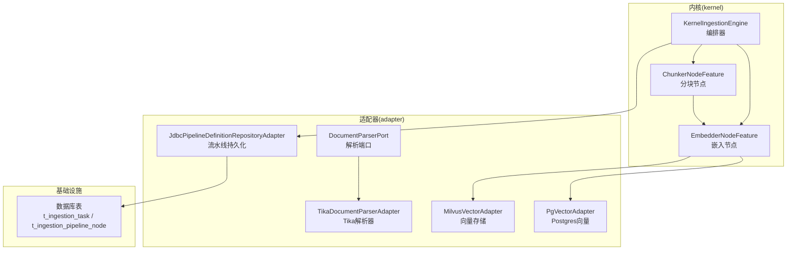
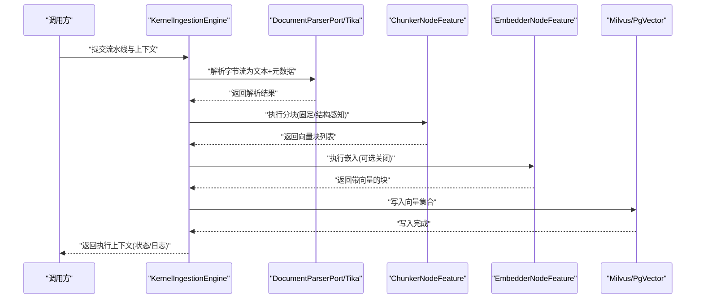
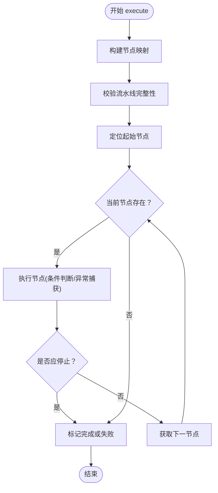
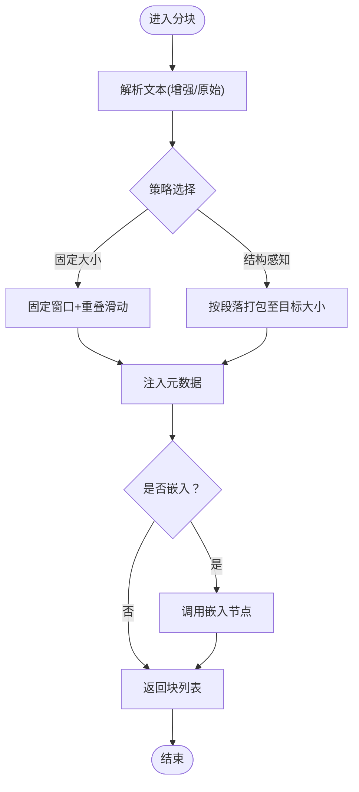
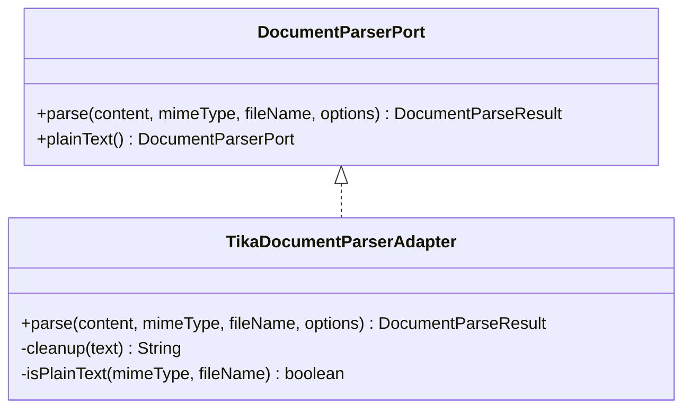
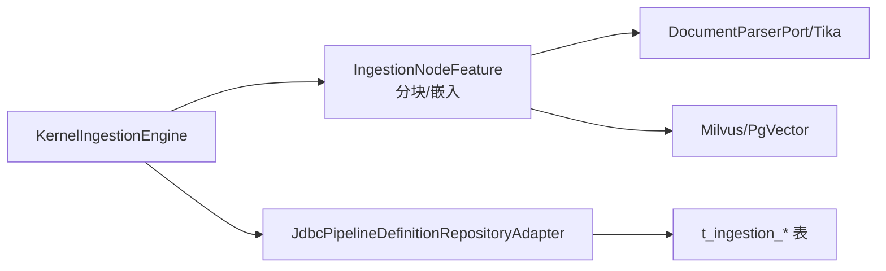

# 摄取特性模块

<cite>
**本文引用的文件**
- [KernelIngestionEngine.java](file://seahorse-agent-kernel/src/main/java/com/miracle/ai/seahorse/agent/kernel/application/ingestion/KernelIngestionEngine.java)
- [ChunkerNodeFeature.java](file://seahorse-agent-kernel/src/main/java/com/miracle/ai/seahorse/agent/kernel/feature/ingestion/ChunkerNodeFeature.java)
- [DocumentParserPort.java](file://seahorse-agent-kernel/src/main/java/com/miracle/ai/seahorse/agent/ports/outbound/ingestion/DocumentParserPort.java)
- [TikaDocumentParserAdapter.java](file://seahorse-agent-adapter-parser-tika/src/main/java/com/miracle/ai/seahorse/agent/adapters/parser/tika/TikaDocumentParserAdapter.java)
- [EmbedderNodeFeature.java](file://seahorse-agent-kernel/src/main/java/com/miracle/ai/seahorse/agent/kernel/feature/ingestion/EmbedderNodeFeature.java)
- [MilvusVectorAdapter.java](file://seahorse-agent-adapter-vector-milvus/src/main/java/com/miracle/ai/seahorse/agent/adapters/vector/milvus/MilvusVectorAdapter.java)
- [PgVectorAdapter.java](file://seahorse-agent-adapter-vector-pgvector/src/main/java/com/miracle/ai/seahorse/agent/adapters/vector/pgvector/PgVectorAdapter.java)
- [JdbcPipelineDefinitionRepositoryAdapter.java](file://seahorse-agent-adapter-repository-jdbc/src/main/java/com/miracle/ai/seahorse/agent/adapters/repository/jdbc/JdbcPipelineDefinitionRepositoryAdapter.java)
- [seahorse_init.sql](file://resources/database/seahorse_init.sql)
- [KernelMetadataBackfillService.java](file://seahorse-agent-kernel/src/main/java/com/miracle/ai/seahorse/agent/kernel/application/metadata/KernelMetadataBackfillService.java)
- [KernelIngestionEngineTests.java](file://seahorse-agent-tests/src/test/java/com/miracle/ai/seahorse/agent/kernel/feature/ingestion/KernelIngestionEngineTests.java)
- [pdf-ingestion-example.md](file://docs/examples/pdf-ingestion-example.md)
- [pdf-pipeline-request.json](file://docs/examples/pdf-pipeline-request.json)
</cite>

## 目录
1. [简介](#简介)
2. [项目结构](#项目结构)
3. [核心组件](#核心组件)
4. [架构总览](#架构总览)
5. [详细组件分析](#详细组件分析)
6. [依赖关系分析](#依赖关系分析)
7. [性能考量](#性能考量)
8. [故障排查指南](#故障排查指南)
9. [结论](#结论)
10. [附录](#附录)

## 简介
本文件系统性阐述“摄取特性模块”的设计与实现，覆盖文档摄取流程、数据预处理、格式转换、嵌入向量化、索引入库、配置参数、处理管道与错误处理机制，并说明其与系统其他模块的协作方式。文档还提供启用配置示例、不同文档格式的支持策略、并发处理能力与性能优化建议，以及使用示例与最佳实践。

## 项目结构
摄取特性模块横跨内核(kernel)、适配器(adapter)与基础设施资源(database)，形成“内核编排 + 适配器实现 + 存储后端”的分层架构。关键目录与职责如下：
- kernel：内核应用层与领域模型，负责编排、节点特征、上下文与状态管理
- adapter-*：各类适配器，如解析器、向量存储、消息队列、对象存储等
- resources/database：数据库初始化脚本，定义摄取任务与流水线节点表结构
- docs/examples：摄取示例与请求样例

图表来源
- [KernelIngestionEngine.java:79-90](file://seahorse-agent-kernel/src/main/java/com/miracle/ai/seahorse/agent/kernel/application/ingestion/KernelIngestionEngine.java#L79-L90)
- [ChunkerNodeFeature.java:70-88](file://seahorse-agent-kernel/src/main/java/com/miracle/ai/seahorse/agent/kernel/feature/ingestion/ChunkerNodeFeature.java#L70-L88)
- [EmbedderNodeFeature.java:63-78](file://seahorse-agent-kernel/src/main/java/com/miracle/ai/seahorse/agent/kernel/feature/ingestion/EmbedderNodeFeature.java#L63-L78)
- [DocumentParserPort.java:29-40](file://seahorse-agent-kernel/src/main/java/com/miracle/ai/seahorse/agent/ports/outbound/ingestion/DocumentParserPort.java#L29-L40)
- [TikaDocumentParserAdapter.java:70-84](file://seahorse-agent-adapter-parser-tika/src/main/java/com/miracle/ai/seahorse/agent/adapters/parser/tika/TikaDocumentParserAdapter.java#L70-L84)
- [MilvusVectorAdapter.java:265-273](file://seahorse-agent-adapter-vector-milvus/src/main/java/com/miracle/ai/seahorse/agent/adapters/vector/milvus/MilvusVectorAdapter.java#L265-L273)
- [PgVectorAdapter.java:299-331](file://seahorse-agent-adapter-vector-pgvector/src/main/java/com/miracle/ai/seahorse/agent/adapters/vector/pgvector/PgVectorAdapter.java#L299-L331)
- [JdbcPipelineDefinitionRepositoryAdapter.java:56-81](file://seahorse-agent-adapter-repository-jdbc/src/main/java/com/miracle/ai/seahorse/agent/adapters/repository/jdbc/JdbcPipelineDefinitionRepositoryAdapter.java#L56-L81)
- [seahorse_init.sql:348-381](file://resources/database/seahorse_init.sql#L348-L381)

章节来源
- [KernelIngestionEngine.java:40-90](file://seahorse-agent-kernel/src/main/java/com/miracle/ai/seahorse/agent/kernel/application/ingestion/KernelIngestionEngine.java#L40-L90)
- [seahorse_init.sql:348-381](file://resources/database/seahorse_init.sql#L348-L381)

## 核心组件
- 内核编排器：负责流水线的起止节点识别、顺序执行、失败中断与日志记录
- 节点特征：分块节点与嵌入节点分别承担文本切片与向量化
- 解析端口与适配器：统一抽象解析接口，Tika适配器支持多格式解析
- 向量存储适配器：Milvus与PgVector适配器负责向量写入与索引
- 流水线持久化：JDBC适配器负责流水线定义与节点配置的持久化
- 数据库表：定义任务与节点的结构，支撑任务追踪与可观测

章节来源
- [KernelIngestionEngine.java:72-90](file://seahorse-agent-kernel/src/main/java/com/miracle/ai/seahorse/agent/kernel/application/ingestion/KernelIngestionEngine.java#L72-L90)
- [ChunkerNodeFeature.java:40-88](file://seahorse-agent-kernel/src/main/java/com/miracle/ai/seahorse/agent/kernel/feature/ingestion/ChunkerNodeFeature.java#L40-L88)
- [EmbedderNodeFeature.java:63-95](file://seahorse-agent-kernel/src/main/java/com/miracle/ai/seahorse/agent/kernel/feature/ingestion/EmbedderNodeFeature.java#L63-L95)
- [DocumentParserPort.java:29-52](file://seahorse-agent-kernel/src/main/java/com/miracle/ai/seahorse/agent/ports/outbound/ingestion/DocumentParserPort.java#L29-L52)
- [TikaDocumentParserAdapter.java:40-84](file://seahorse-agent-adapter-parser-tika/src/main/java/com/miracle/ai/seahorse/agent/adapters/parser/tika/TikaDocumentParserAdapter.java#L40-L84)
- [MilvusVectorAdapter.java:249-279](file://seahorse-agent-adapter-vector-milvus/src/main/java/com/miracle/ai/seahorse/agent/adapters/vector/milvus/MilvusVectorAdapter.java#L249-L279)
- [PgVectorAdapter.java:299-331](file://seahorse-agent-adapter-vector-pgvector/src/main/java/com/miracle/ai/seahorse/agent/adapters/vector/pgvector/PgVectorAdapter.java#L299-L331)
- [JdbcPipelineDefinitionRepositoryAdapter.java:56-81](file://seahorse-agent-adapter-repository-jdbc/src/main/java/com/miracle/ai/seahorse/agent/adapters/repository/jdbc/JdbcPipelineDefinitionRepositoryAdapter.java#L56-L81)
- [seahorse_init.sql:348-381](file://resources/database/seahorse_init.sql#L348-L381)

## 架构总览
摄取特性模块采用“流水线 + 节点特征”的编排模式。内核编排器根据节点配置顺序执行，节点特征负责具体的数据处理逻辑。解析器负责从原始字节流提取文本与元数据，分块节点将文本切分为向量块，嵌入节点生成向量，最终写入向量存储。

图表来源
- [KernelIngestionEngine.java:79-90](file://seahorse-agent-kernel/src/main/java/com/miracle/ai/seahorse/agent/kernel/application/ingestion/KernelIngestionEngine.java#L79-L90)
- [DocumentParserPort.java:31-40](file://seahorse-agent-kernel/src/main/java/com/miracle/ai/seahorse/agent/ports/outbound/ingestion/DocumentParserPort.java#L31-L40)
- [TikaDocumentParserAdapter.java:70-84](file://seahorse-agent-adapter-parser-tika/src/main/java/com/miracle/ai/seahorse/agent/adapters/parser/tika/TikaDocumentParserAdapter.java#L70-L84)
- [ChunkerNodeFeature.java:70-88](file://seahorse-agent-kernel/src/main/java/com/miracle/ai/seahorse/agent/kernel/feature/ingestion/ChunkerNodeFeature.java#L70-L88)
- [EmbedderNodeFeature.java:63-78](file://seahorse-agent-kernel/src/main/java/com/miracle/ai/seahorse/agent/kernel/feature/ingestion/EmbedderNodeFeature.java#L63-L78)
- [MilvusVectorAdapter.java:265-273](file://seahorse-agent-adapter-vector-milvus/src/main/java/com/miracle/ai/seahorse/agent/adapters/vector/milvus/MilvusVectorAdapter.java#L265-L273)
- [PgVectorAdapter.java:299-331](file://seahorse-agent-adapter-vector-pgvector/src/main/java/com/miracle/ai/seahorse/agent/adapters/vector/pgvector/PgVectorAdapter.java#L299-L331)

## 详细组件分析

### 内核编排器（KernelIngestionEngine）
- 职责：识别起始节点、按 nextNodeId 串联执行、失败即停、记录节点日志与耗时
- 关键流程：构建节点映射、校验流水线完整性、执行链路、状态收尾
- 错误处理：节点异常包装为失败结果，记录日志并中止后续节点

图表来源
- [KernelIngestionEngine.java:79-196](file://seahorse-agent-kernel/src/main/java/com/miracle/ai/seahorse/agent/kernel/application/ingestion/KernelIngestionEngine.java#L79-L196)

章节来源
- [KernelIngestionEngine.java:72-196](file://seahorse-agent-kernel/src/main/java/com/miracle/ai/seahorse/agent/kernel/application/ingestion/KernelIngestionEngine.java#L72-L196)

### 分块节点（ChunkerNodeFeature）
- 职责：将文本切分为向量块，支持固定大小与结构感知两种策略，可选嵌入
- 配置参数：strategy、chunkSize、overlapSize、embed、modelId
- 元数据注入：将上下文中的 acceptedMetadata 注入到每个块
- 复杂度：固定大小分块近似 O(n)，结构感知分块受块合并影响

图表来源
- [ChunkerNodeFeature.java:70-88](file://seahorse-agent-kernel/src/main/java/com/miracle/ai/seahorse/agent/kernel/feature/ingestion/ChunkerNodeFeature.java#L70-L88)
- [ChunkerNodeFeature.java:90-129](file://seahorse-agent-kernel/src/main/java/com/miracle/ai/seahorse/agent/kernel/feature/ingestion/ChunkerNodeFeature.java#L90-L129)
- [ChunkerNodeFeature.java:197-208](file://seahorse-agent-kernel/src/main/java/com/miracle/ai/seahorse/agent/kernel/feature/ingestion/ChunkerNodeFeature.java#L197-L208)

章节来源
- [ChunkerNodeFeature.java:40-296](file://seahorse-agent-kernel/src/main/java/com/miracle/ai/seahorse/agent/kernel/feature/ingestion/ChunkerNodeFeature.java#L40-L296)

### 嵌入节点（EmbedderNodeFeature）
- 职责：对向量块内容进行嵌入，支持从节点配置或上下文解析模型ID
- 异常处理：捕获嵌入异常并返回失败结果

章节来源
- [EmbedderNodeFeature.java:63-95](file://seahorse-agent-kernel/src/main/java/com/miracle/ai/seahorse/agent/kernel/feature/ingestion/EmbedderNodeFeature.java#L63-L95)

### 文档解析端口与适配器（DocumentParserPort / TikaDocumentParserAdapter）
- 抽象端口：统一解析接口，支持传入选项与返回解析结果
- Tika适配器：支持 PDF、Word、Excel、PPT、HTML、纯文本等；自动清理空白行与多余空格；提取稳定元数据键
- 兜底策略：纯文本解析器按 UTF-8 解码

图表来源
- [DocumentParserPort.java:29-52](file://seahorse-agent-kernel/src/main/java/com/miracle/ai/seahorse/agent/ports/outbound/ingestion/DocumentParserPort.java#L29-L52)
- [TikaDocumentParserAdapter.java:45-84](file://seahorse-agent-adapter-parser-tika/src/main/java/com/miracle/ai/seahorse/agent/adapters/parser/tika/TikaDocumentParserAdapter.java#L45-L84)

章节来源
- [DocumentParserPort.java:24-53](file://seahorse-agent-kernel/src/main/java/com/miracle/ai/seahorse/agent/ports/outbound/ingestion/DocumentParserPort.java#L24-L53)
- [TikaDocumentParserAdapter.java:40-264](file://seahorse-agent-adapter-parser-tika/src/main/java/com/miracle/ai/seahorse/agent/adapters/parser/tika/TikaDocumentParserAdapter.java#L40-L264)

### 向量存储适配器（Milvus / PgVector）
- Milvus：构造写入行结构，设置索引参数（HNSW、度量类型、mmap 等），序列化向量
- PgVector：创建表与 HNSW 索引，校验维度一致性，向量值序列化

章节来源
- [MilvusVectorAdapter.java:249-279](file://seahorse-agent-adapter-vector-milvus/src/main/java/com/miracle/ai/seahorse/agent/adapters/vector/milvus/MilvusVectorAdapter.java#L249-L279)
- [PgVectorAdapter.java:299-331](file://seahorse-agent-adapter-vector-pgvector/src/main/java/com/miracle/ai/seahorse/agent/adapters/vector/pgvector/PgVectorAdapter.java#L299-L331)

### 流水线定义与持久化（JdbcPipelineDefinitionRepositoryAdapter）
- 职责：创建/查询/更新/删除流水线及其节点，支持分页查询
- 数据结构：流水线表与节点表，节点含 settings_json 与 condition_json

章节来源
- [JdbcPipelineDefinitionRepositoryAdapter.java:56-81](file://seahorse-agent-adapter-repository-jdbc/src/main/java/com/miracle/ai/seahorse/agent/adapters/repository/jdbc/JdbcPipelineDefinitionRepositoryAdapter.java#L56-L81)
- [JdbcPipelineDefinitionRepositoryAdapter.java:126-162](file://seahorse-agent-adapter-repository-jdbc/src/main/java/com/miracle/ai/seahorse/agent/adapters/repository/jdbc/JdbcPipelineDefinitionRepositoryAdapter.java#L126-L162)

### 数据库表结构（t_ingestion_task / t_ingestion_pipeline_node）
- t_ingestion_task：记录任务状态、错误、日志、元数据与时间戳
- t_ingestion_pipeline_node：记录节点类型、顺序、配置与条件

章节来源
- [seahorse_init.sql:348-381](file://resources/database/seahorse_init.sql#L348-L381)

## 依赖关系分析
- 组件耦合：内核编排器通过扩展注册表激活节点特征；节点特征之间存在顺序依赖（分块在前，嵌入可选）
- 外部依赖：解析器依赖 Tika；向量存储依赖 Milvus/PgVector；流水线定义依赖 JDBC
- 条件执行：节点执行受条件端口控制，失败即停，避免无效链路

图表来源
- [KernelIngestionEngine.java:166-172](file://seahorse-agent-kernel/src/main/java/com/miracle/ai/seahorse/agent/kernel/application/ingestion/KernelIngestionEngine.java#L166-L172)
- [ChunkerNodeFeature.java:54-58](file://seahorse-agent-kernel/src/main/java/com/miracle/ai/seahorse/agent/kernel/feature/ingestion/ChunkerNodeFeature.java#L54-L58)
- [EmbedderNodeFeature.java:72-78](file://seahorse-agent-kernel/src/main/java/com/miracle/ai/seahorse/agent/kernel/feature/ingestion/EmbedderNodeFeature.java#L72-L78)
- [JdbcPipelineDefinitionRepositoryAdapter.java:56-81](file://seahorse-agent-adapter-repository-jdbc/src/main/java/com/miracle/ai/seahorse/agent/adapters/repository/jdbc/JdbcPipelineDefinitionRepositoryAdapter.java#L56-L81)
- [seahorse_init.sql:348-381](file://resources/database/seahorse_init.sql#L348-L381)

章节来源
- [KernelIngestionEngine.java:166-172](file://seahorse-agent-kernel/src/main/java/com/miracle/ai/seahorse/agent/kernel/application/ingestion/KernelIngestionEngine.java#L166-L172)
- [ChunkerNodeFeature.java:54-58](file://seahorse-agent-kernel/src/main/java/com/miracle/ai/seahorse/agent/kernel/feature/ingestion/ChunkerNodeFeature.java#L54-L58)
- [EmbedderNodeFeature.java:72-78](file://seahorse-agent-kernel/src/main/java/com/miracle/ai/seahorse/agent/kernel/feature/ingestion/EmbedderNodeFeature.java#L72-L78)
- [JdbcPipelineDefinitionRepositoryAdapter.java:56-81](file://seahorse-agent-adapter-repository-jdbc/src/main/java/com/miracle/ai/seahorse/agent/adapters/repository/jdbc/JdbcPipelineDefinitionRepositoryAdapter.java#L56-L81)

## 性能考量
- 并发处理：内核编排器以串行流水线为主，但可结合外部任务队列与批量处理提升吞吐
- 分块策略：结构感知分块更贴合语义边界，固定大小分块简单高效；合理设置 overlapSize 平衡召回与重复
- 嵌入开销：嵌入可作为节点显式配置，避免不必要的即时嵌入；批量写入向量存储可减少往返
- 存储索引：Milvus 使用 HNSW，PgVector 使用 HNSW cosine 索引；确保维度一致与索引参数匹配
- I/O 优化：解析器对空白行与多余空格进行清理，减少后续处理负担

[本节为通用性能指导，无需特定文件引用]

## 故障排查指南
- 节点失败：内核编排器将异常包装为失败结果并中止后续节点；检查节点日志与错误消息
- 解析异常：Tika 解析失败会抛出非法状态异常；确认 MIME 类型、文件名与输入字节流
- 元数据缺失：回填服务在解析错误时区分“缺少元数据”与一般异常；按提示修正元数据
- 任务追踪：数据库表记录任务状态与错误；结合日志定位问题

章节来源
- [KernelIngestionEngine.java:146-164](file://seahorse-agent-kernel/src/main/java/com/miracle/ai/seahorse/agent/kernel/application/ingestion/KernelIngestionEngine.java#L146-L164)
- [KernelMetadataBackfillService.java:385-408](file://seahorse-agent-kernel/src/main/java/com/miracle/ai/seahorse/agent/kernel/application/metadata/KernelMetadataBackfillService.java#L385-L408)

## 结论
摄取特性模块通过清晰的编排与节点特征分离，实现了从多格式文档解析、文本分块、向量化到向量存储的完整链路。模块具备良好的扩展性与可观测性，配合数据库与适配器可满足多样化业务场景。建议在生产环境中结合批量处理、合理的分块策略与索引参数，持续优化吞吐与检索质量。

[本节为总结性内容，无需特定文件引用]

## 附录

### 启用与配置示例
- 流水线定义：通过 JDBC 适配器创建/更新流水线与节点，节点包含 settings_json 与 condition_json
- 示例文档：参考示例文档与请求样例，了解 PDF 摄取的典型配置与请求格式

章节来源
- [JdbcPipelineDefinitionRepositoryAdapter.java:126-162](file://seahorse-agent-adapter-repository-jdbc/src/main/java/com/miracle/ai/seahorse/agent/adapters/repository/jdbc/JdbcPipelineDefinitionRepositoryAdapter.java#L126-L162)
- [pdf-ingestion-example.md](file://docs/examples/pdf-ingestion-example.md)
- [pdf-pipeline-request.json](file://docs/examples/pdf-pipeline-request.json)

### 不同文档格式支持与处理策略
- 支持格式：PDF、Word、Excel、PPT、HTML、纯文本等
- 处理策略：纯文本走快速路径；其他格式交由 Tika 解析；解析结果包含规范化文本与稳定元数据键

章节来源
- [TikaDocumentParserAdapter.java:40-84](file://seahorse-agent-adapter-parser-tika/src/main/java/com/miracle/ai/seahorse/agent/adapters/parser/tika/TikaDocumentParserAdapter.java#L40-L84)
- [DocumentParserPort.java:24-53](file://seahorse-agent-kernel/src/main/java/com/miracle/ai/seahorse/agent/ports/outbound/ingestion/DocumentParserPort.java#L24-L53)

### 最佳实践
- 明确流水线节点顺序：先解析，再分块，必要时再嵌入
- 合理设置分块参数：根据内容密度调整 chunkSize 与 overlapSize
- 控制嵌入时机：显式使用嵌入节点以获得更灵活的控制
- 观测与告警：利用节点日志与数据库任务状态进行监控

章节来源
- [KernelIngestionEngine.java:146-164](file://seahorse-agent-kernel/src/main/java/com/miracle/ai/seahorse/agent/kernel/application/ingestion/KernelIngestionEngine.java#L146-L164)
- [ChunkerNodeFeature.java:225-233](file://seahorse-agent-kernel/src/main/java/com/miracle/ai/seahorse/agent/kernel/feature/ingestion/ChunkerNodeFeature.java#L225-L233)