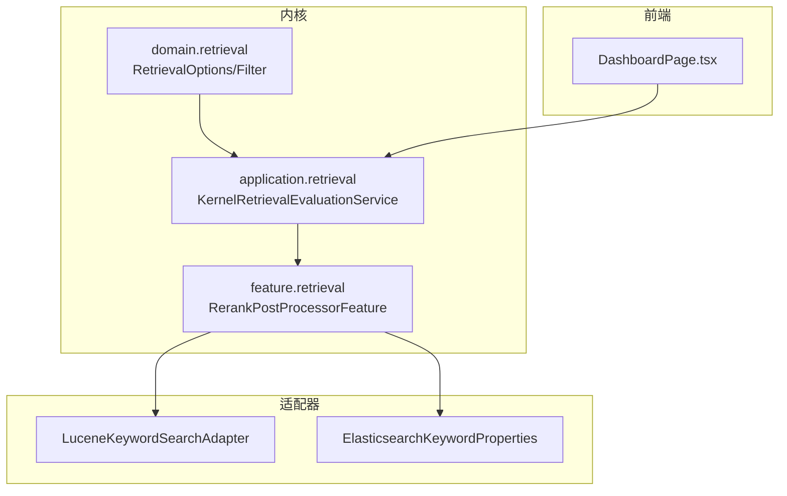
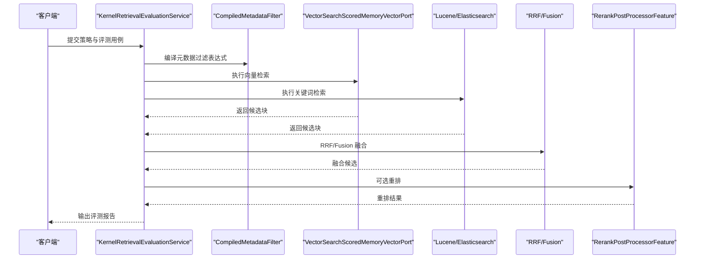
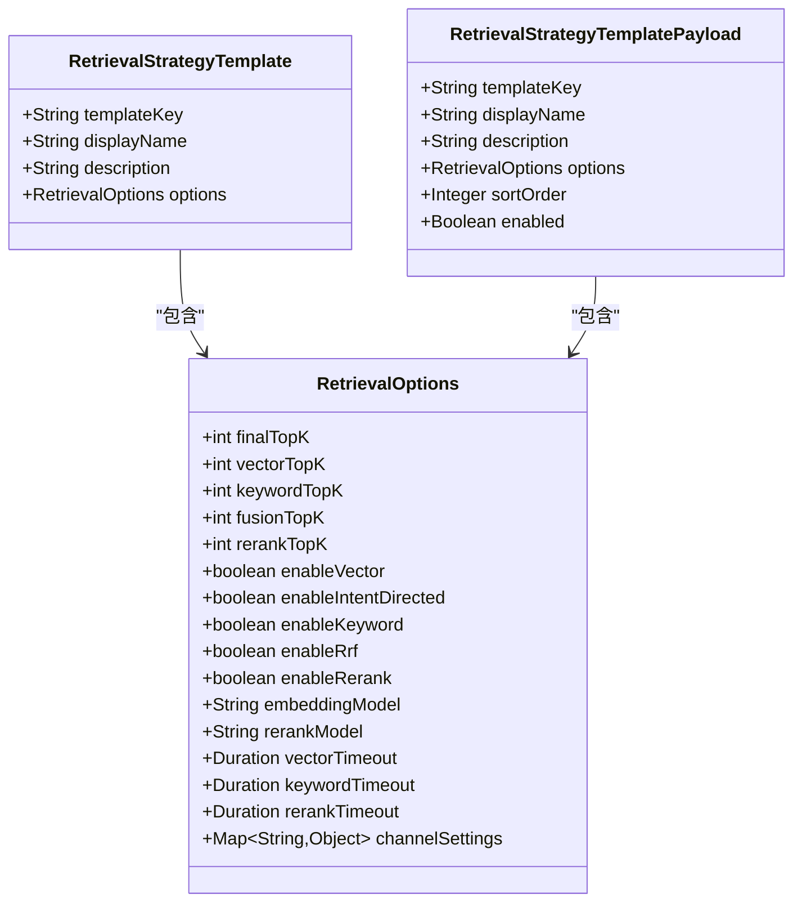
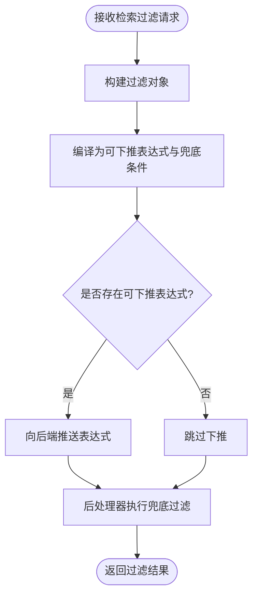
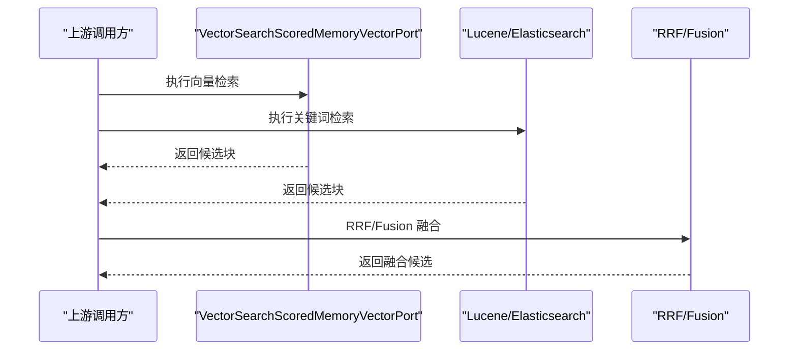
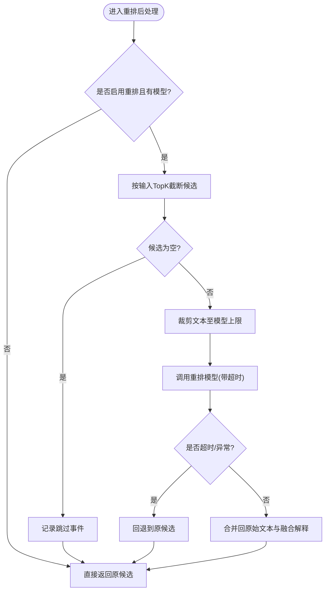
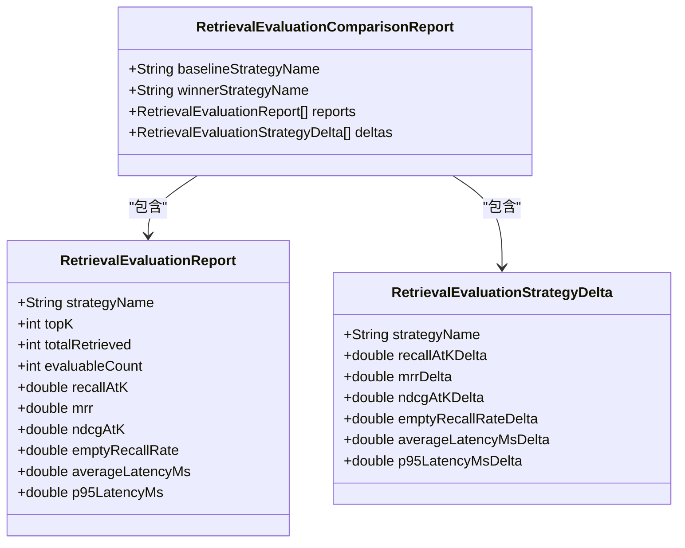
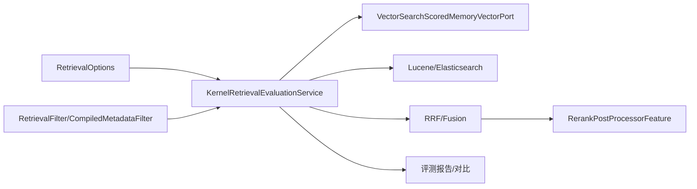

# 检索特性模块

<cite>
**本文引用的文件**
- [RetrievalOptions.java](file://seahorse-agent-kernel/src/main/java/com/miracle/ai/seahorse/agent/kernel/domain/retrieval/RetrievalOptions.java)
- [KernelRetrievalEvaluationService.java](file://seahorse-agent-kernel/src/main/java/com/miracle/ai/seahorse/agent/kernel/application/retrieval/KernelRetrievalEvaluationService.java)
- [RetrievalEvaluationStrategyDelta.java](file://seahorse-agent-kernel/src/main/java/com/miracle/ai/seahorse/agent/ports/inbound/retrieval/RetrievalEvaluationStrategyDelta.java)
- [RetrievalStrategyTemplate.java](file://seahorse-agent-kernel/src/main/java/com/miracle/ai/seahorse/agent/ports/inbound/retrieval/RetrievalStrategyTemplate.java)
- [RetrievalStrategyTemplatePayload.java](file://seahorse-agent-kernel/src/main/java/com/miracle/ai/seahorse/agent/ports/inbound/retrieval/RetrievalStrategyTemplatePayload.java)
- [RetrievalFilter.java](file://seahorse-agent-kernel/src/main/java/com/miracle/ai/seahorse/agent/kernel/domain/retrieval/RetrievalFilter.java)
- [CompiledMetadataFilter.java](file://seahorse-agent-kernel/src/main/java/com/miracle/ai/seahorse/agent/kernel/domain/retrieval/filter/CompiledMetadataFilter.java)
- [VectorSearchScoredMemoryVectorPort.java](file://seahorse-agent-kernel/src/main/java/com/miracle/ai/seahorse/agent/kernel/application/memory/retrieval/VectorSearchScoredMemoryVectorPort.java)
- [LuceneKeywordSearchAdapter.java](file://seahorse-agent-adapter-search-lucene/src/main/java/com/miracle/ai/seahorse/agent/adapters/search/lucene/LuceneKeywordSearchAdapter.java)
- [ElasticsearchKeywordProperties.java](file://seahorse-agent-adapter-search-elasticsearch/src/main/java/com/miracle/ai/seahorse/agent/adapters/search/elasticsearch/ElasticsearchKeywordProperties.java)
- [RerankPostProcessorFeature.java](file://seahorse-agent-kernel/src/main/java/com/miracle/ai/seahorse/agent/kernel/feature/retrieval/RerankPostProcessorFeature.java)
- [DashboardPage.tsx](file://frontend/src/pages/admin/dashboard/DashboardPage.tsx)
- [性能测试.md](file://docs/zh/content/测试策略/性能测试.md)
</cite>

## 目录
1. [简介](#简介)
2. [项目结构](#项目结构)
3. [核心组件](#核心组件)
4. [架构总览](#架构总览)
5. [详细组件分析](#详细组件分析)
6. [依赖关系分析](#依赖关系分析)
7. [性能考量](#性能考量)
8. [故障排查指南](#故障排查指南)
9. [结论](#结论)
10. [附录](#附录)

## 简介
本文件系统性梳理检索特性模块的设计与实现，覆盖检索策略、多通道融合与智能重排、评估指标与对比分析、配置参数与启用方式、性能优化与监控等主题。模块以“向量检索 + 关键词检索 + 融合 + 重排”的流水线为核心，支持模板化的策略配置、可插拔的后端适配器以及完善的评测与监控体系。

## 项目结构
检索特性模块横跨内核(kernel)与适配器(adapter)层，并与前端监控面板联动：
- 内核层(domain、application、feature)：定义检索选项、过滤编译、评估服务、重排后处理特征等
- 适配器层：提供向量与关键词检索的具体实现（如 Lucene、Elasticsearch）
- 前端层：提供仪表盘与可视化，用于观测检索性能与质量

**图表来源**
- [RetrievalOptions.java](file://seahorse-agent-kernel/src/main/java/com/miracle/ai/seahorse/agent/kernel/domain/retrieval/RetrievalOptions.java)
- [KernelRetrievalEvaluationService.java](file://seahorse-agent-kernel/src/main/java/com/miracle/ai/seahorse/agent/kernel/application/retrieval/KernelRetrievalEvaluationService.java)
- [RerankPostProcessorFeature.java](file://seahorse-agent-kernel/src/main/java/com/miracle/ai/seahorse/agent/kernel/feature/retrieval/RerankPostProcessorFeature.java)
- [LuceneKeywordSearchAdapter.java](file://seahorse-agent-adapter-search-lucene/src/main/java/com/miracle/ai/seahorse/agent/adapters/search/lucene/LuceneKeywordSearchAdapter.java)
- [ElasticsearchKeywordProperties.java](file://seahorse-agent-adapter-search-elasticsearch/src/main/java/com/miracle/ai/seahorse/agent/adapters/search/elasticsearch/ElasticsearchKeywordProperties.java)
- [DashboardPage.tsx](file://frontend/src/pages/admin/dashboard/DashboardPage.tsx)

**章节来源**
- [RetrievalOptions.java](file://seahorse-agent-kernel/src/main/java/com/miracle/ai/seahorse/agent/kernel/domain/retrieval/RetrievalOptions.java)
- [KernelRetrievalEvaluationService.java](file://seahorse-agent-kernel/src/main/java/com/miracle/ai/seahorse/agent/kernel/application/retrieval/KernelRetrievalEvaluationService.java)
- [RerankPostProcessorFeature.java](file://seahorse-agent-kernel/src/main/java/com/miracle/ai/seahorse/agent/kernel/feature/retrieval/RerankPostProcessorFeature.java)
- [LuceneKeywordSearchAdapter.java](file://seahorse-agent-adapter-search-lucene/src/main/java/com/miracle/ai/seahorse/agent/adapters/search/lucene/LuceneKeywordSearchAdapter.java)
- [ElasticsearchKeywordProperties.java](file://seahorse-agent-adapter-search-elasticsearch/src/main/java/com/miracle/ai/seahorse/agent/adapters/search/elasticsearch/ElasticsearchKeywordProperties.java)
- [DashboardPage.tsx](file://frontend/src/pages/admin/dashboard/DashboardPage.tsx)

## 核心组件
- 检索选项与模板
  - RetrievalOptions：统一控制向量/关键词/融合/重排的开关、TopK、模型与超时等
  - RetrievalStrategyTemplate/RetrievalStrategyTemplatePayload：策略模板的持久化与管理载体
- 过滤编译与执行
  - RetrievalFilter/CompiledMetadataFilter：将用户输入编译为可下推表达式与兜底条件
- 评估与对比
  - KernelRetrievalEvaluationService：批量评测与策略对比，产出报告与差异
  - RetrievalEvaluationStrategyDelta：策略相对基线的指标差值
- 重排后处理
  - RerankPostProcessorFeature：基于配置的重排后处理，支持超时/异常回退
- 检索适配器
  - LuceneKeywordSearchAdapter：本地嵌入式 Lucene 关键词检索
  - ElasticsearchKeywordProperties：Elasticsearch 关键词检索属性（字段、分析器、认证等）

**章节来源**
- [RetrievalOptions.java](file://seahorse-agent-kernel/src/main/java/com/miracle/ai/seahorse/agent/kernel/domain/retrieval/RetrievalOptions.java)
- [RetrievalStrategyTemplate.java](file://seahorse-agent-kernel/src/main/java/com/miracle/ai/seahorse/agent/ports/inbound/retrieval/RetrievalStrategyTemplate.java)
- [RetrievalStrategyTemplatePayload.java](file://seahorse-agent-kernel/src/main/java/com/miracle/ai/seahorse/agent/ports/inbound/retrieval/RetrievalStrategyTemplatePayload.java)
- [RetrievalFilter.java](file://seahorse-agent-kernel/src/main/java/com/miracle/ai/seahorse/agent/kernel/domain/retrieval/RetrievalFilter.java)
- [CompiledMetadataFilter.java](file://seahorse-agent-kernel/src/main/java/com/miracle/ai/seahorse/agent/kernel/domain/retrieval/filter/CompiledMetadataFilter.java)
- [KernelRetrievalEvaluationService.java](file://seahorse-agent-kernel/src/main/java/com/miracle/ai/seahorse/agent/kernel/application/retrieval/KernelRetrievalEvaluationService.java)
- [RetrievalEvaluationStrategyDelta.java](file://seahorse-agent-kernel/src/main/java/com/miracle/ai/seahorse/agent/ports/inbound/retrieval/RetrievalEvaluationStrategyDelta.java)
- [RerankPostProcessorFeature.java](file://seahorse-agent-kernel/src/main/java/com/miracle/ai/seahorse/agent/kernel/feature/retrieval/RerankPostProcessorFeature.java)
- [LuceneKeywordSearchAdapter.java](file://seahorse-agent-adapter-search-lucene/src/main/java/com/miracle/ai/seahorse/agent/adapters/search/lucene/LuceneKeywordSearchAdapter.java)
- [ElasticsearchKeywordProperties.java](file://seahorse-agent-adapter-search-elasticsearch/src/main/java/com/miracle/ai/seahorse/agent/adapters/search/elasticsearch/ElasticsearchKeywordProperties.java)

## 架构总览
检索特性采用“策略模板 + 过滤编译 + 多通道检索 + 融合 + 重排”的流水线式架构，支持可插拔的后端与可配置的重排模型。

**图表来源**
- [KernelRetrievalEvaluationService.java](file://seahorse-agent-kernel/src/main/java/com/miracle/ai/seahorse/agent/kernel/application/retrieval/KernelRetrievalEvaluationService.java)
- [VectorSearchScoredMemoryVectorPort.java](file://seahorse-agent-kernel/src/main/java/com/miracle/ai/seahorse/agent/kernel/application/memory/retrieval/VectorSearchScoredMemoryVectorPort.java)
- [LuceneKeywordSearchAdapter.java](file://seahorse-agent-adapter-search-lucene/src/main/java/com/miracle/ai/seahorse/agent/adapters/search/lucene/LuceneKeywordSearchAdapter.java)
- [RerankPostProcessorFeature.java](file://seahorse-agent-kernel/src/main/java/com/miracle/ai/seahorse/agent/kernel/feature/retrieval/RerankPostProcessorFeature.java)

## 详细组件分析

### 检索选项与策略模板
- 检索选项
  - 控制项：finalTopK、vectorTopK、keywordTopK、fusionTopK、rerankTopK、enableVector、enableKeyword、enableRrf、enableRerank、embeddingModel、rerankModel、vectorTimeout、keywordTimeout、rerankTimeout、channelSettings
  - 默认值：finalTopK=5；vectorTopK=finalTopK*4；keywordTopK=finalTopK*4；fusionTopK=finalTopK*3；rerankTopK=finalTopK；enableVector=true；enableIntentDirected=true；enableKeyword=false；enableRrf=true；enableRerank=false
- 策略模板
  - RetrievalStrategyTemplate：模板键、显示名、描述、默认选项
  - RetrievalStrategyTemplatePayload：模板管理请求体，支持排序与启用状态

**图表来源**
- [RetrievalOptions.java](file://seahorse-agent-kernel/src/main/java/com/miracle/ai/seahorse/agent/kernel/domain/retrieval/RetrievalOptions.java)
- [RetrievalStrategyTemplate.java](file://seahorse-agent-kernel/src/main/java/com/miracle/ai/seahorse/agent/ports/inbound/retrieval/RetrievalStrategyTemplate.java)
- [RetrievalStrategyTemplatePayload.java](file://seahorse-agent-kernel/src/main/java/com/miracle/ai/seahorse/agent/ports/inbound/retrieval/RetrievalStrategyTemplatePayload.java)

**章节来源**
- [RetrievalOptions.java](file://seahorse-agent-kernel/src/main/java/com/miracle/ai/seahorse/agent/kernel/domain/retrieval/RetrievalOptions.java)
- [RetrievalStrategyTemplate.java](file://seahorse-agent-kernel/src/main/java/com/miracle/ai/seahorse/agent/ports/inbound/retrieval/RetrievalStrategyTemplate.java)
- [RetrievalStrategyTemplatePayload.java](file://seahorse-agent-kernel/src/main/java/com/miracle/ai/seahorse/agent/ports/inbound/retrieval/RetrievalStrategyTemplatePayload.java)

### 元数据过滤编译与执行
- 输入：用户提供的检索过滤请求
- 编译：将用户输入编译为可下推表达式与仅后处理兜底的条件集合
- 执行：向量/关键词后端分别消费表达式与兜底条件，确保 Schema 一致性与安全

**图表来源**
- [RetrievalFilter.java](file://seahorse-agent-kernel/src/main/java/com/miracle/ai/seahorse/agent/kernel/domain/retrieval/RetrievalFilter.java)
- [CompiledMetadataFilter.java](file://seahorse-agent-kernel/src/main/java/com/miracle/ai/seahorse/agent/kernel/domain/retrieval/filter/CompiledMetadataFilter.java)

**章节来源**
- [RetrievalFilter.java](file://seahorse-agent-kernel/src/main/java/com/miracle/ai/seahorse/agent/kernel/domain/retrieval/RetrievalFilter.java)
- [CompiledMetadataFilter.java](file://seahorse-agent-kernel/src/main/java/com/miracle/ai/seahorse/agent/kernel/domain/retrieval/filter/CompiledMetadataFilter.java)

### 多通道检索与融合
- 向量检索：通过向量端口执行，返回候选块
- 关键词检索：通过 Lucene 或 Elasticsearch 执行，支持字段权重、分析器与认证
- 融合：默认启用 RRF，将多通道候选融合为统一列表

**图表来源**
- [VectorSearchScoredMemoryVectorPort.java](file://seahorse-agent-kernel/src/main/java/com/miracle/ai/seahorse/agent/kernel/application/memory/retrieval/VectorSearchScoredMemoryVectorPort.java)
- [LuceneKeywordSearchAdapter.java](file://seahorse-agent-adapter-search-lucene/src/main/java/com/miracle/ai/seahorse/agent/adapters/search/lucene/LuceneKeywordSearchAdapter.java)
- [ElasticsearchKeywordProperties.java](file://seahorse-agent-adapter-search-elasticsearch/src/main/java/com/miracle/ai/seahorse/agent/adapters/search/elasticsearch/ElasticsearchKeywordProperties.java)

**章节来源**
- [VectorSearchScoredMemoryVectorPort.java](file://seahorse-agent-kernel/src/main/java/com/miracle/ai/seahorse/agent/kernel/application/memory/retrieval/VectorSearchScoredMemoryVectorPort.java)
- [LuceneKeywordSearchAdapter.java](file://seahorse-agent-adapter-search-lucene/src/main/java/com/miracle/ai/seahorse/agent/adapters/search/lucene/LuceneKeywordSearchAdapter.java)
- [ElasticsearchKeywordProperties.java](file://seahorse-agent-adapter-search-elasticsearch/src/main/java/com/miracle/ai/seahorse/agent/adapters/search/elasticsearch/ElasticsearchKeywordProperties.java)

### 智能重排与后处理
- 条件：当启用重排且配置了重排模型时生效
- 输入截断：默认使用 fusionTopK，可通过配置覆盖
- 文本裁剪：为模型侧输入设置最大字符数，保证性能与稳定性
- 回退策略：超时、异常、空结果或无法匹配时回退原候选
- 事件记录：记录模型、输入/输出 TopK、耗时、是否超时/回退/异常

**图表来源**
- [RerankPostProcessorFeature.java](file://seahorse-agent-kernel/src/main/java/com/miracle/ai/seahorse/agent/kernel/feature/retrieval/RerankPostProcessorFeature.java)

**章节来源**
- [RerankPostProcessorFeature.java](file://seahorse-agent-kernel/src/main/java/com/miracle/ai/seahorse/agent/kernel/feature/retrieval/RerankPostProcessorFeature.java)

### 评测指标与策略对比
- 单策略评测：计算平均召回、MRR、nDCG、空召回率、平均/分位延迟
- 策略对比：以基线策略为基准，计算各指标差值，综合排序质量、召回、MRR、空召回率与延迟进行胜负判定

**图表来源**
- [KernelRetrievalEvaluationService.java](file://seahorse-agent-kernel/src/main/java/com/miracle/ai/seahorse/agent/kernel/application/retrieval/KernelRetrievalEvaluationService.java)
- [RetrievalEvaluationStrategyDelta.java](file://seahorse-agent-kernel/src/main/java/com/miracle/ai/seahorse/agent/ports/inbound/retrieval/RetrievalEvaluationStrategyDelta.java)

**章节来源**
- [KernelRetrievalEvaluationService.java](file://seahorse-agent-kernel/src/main/java/com/miracle/ai/seahorse/agent/kernel/application/retrieval/KernelRetrievalEvaluationService.java)
- [RetrievalEvaluationStrategyDelta.java](file://seahorse-agent-kernel/src/main/java/com/miracle/ai/seahorse/agent/ports/inbound/retrieval/RetrievalEvaluationStrategyDelta.java)

## 依赖关系分析
- 内核与适配器解耦：通过端口与适配器分离，便于替换后端
- 过滤编译前置：所有检索均需经过过滤编译，保障一致性与安全性
- 重排可插拔：通过 Feature 机制按需启用，避免不必要的开销

**图表来源**
- [RetrievalOptions.java](file://seahorse-agent-kernel/src/main/java/com/miracle/ai/seahorse/agent/kernel/domain/retrieval/RetrievalOptions.java)
- [KernelRetrievalEvaluationService.java](file://seahorse-agent-kernel/src/main/java/com/miracle/ai/seahorse/agent/kernel/application/retrieval/KernelRetrievalEvaluationService.java)
- [RetrievalFilter.java](file://seahorse-agent-kernel/src/main/java/com/miracle/ai/seahorse/agent/kernel/domain/retrieval/RetrievalFilter.java)
- [CompiledMetadataFilter.java](file://seahorse-agent-kernel/src/main/java/com/miracle/ai/seahorse/agent/kernel/domain/retrieval/filter/CompiledMetadataFilter.java)
- [VectorSearchScoredMemoryVectorPort.java](file://seahorse-agent-kernel/src/main/java/com/miracle/ai/seahorse/agent/kernel/application/memory/retrieval/VectorSearchScoredMemoryVectorPort.java)
- [LuceneKeywordSearchAdapter.java](file://seahorse-agent-adapter-search-lucene/src/main/java/com/miracle/ai/seahorse/agent/adapters/search/lucene/LuceneKeywordSearchAdapter.java)
- [RerankPostProcessorFeature.java](file://seahorse-agent-kernel/src/main/java/com/miracle/ai/seahorse/agent/kernel/feature/retrieval/RerankPostProcessorFeature.java)

**章节来源**
- [RetrievalOptions.java](file://seahorse-agent-kernel/src/main/java/com/miracle/ai/seahorse/agent/kernel/domain/retrieval/RetrievalOptions.java)
- [KernelRetrievalEvaluationService.java](file://seahorse-agent-kernel/src/main/java/com/miracle/ai/seahorse/agent/kernel/application/retrieval/KernelRetrievalEvaluationService.java)
- [RetrievalFilter.java](file://seahorse-agent-kernel/src/main/java/com/miracle/ai/seahorse/agent/kernel/domain/retrieval/RetrievalFilter.java)
- [CompiledMetadataFilter.java](file://seahorse-agent-kernel/src/main/java/com/miracle/ai/seahorse/agent/kernel/domain/retrieval/filter/CompiledMetadataFilter.java)
- [VectorSearchScoredMemoryVectorPort.java](file://seahorse-agent-kernel/src/main/java/com/miracle/ai/seahorse/agent/kernel/application/memory/retrieval/VectorSearchScoredMemoryVectorPort.java)
- [LuceneKeywordSearchAdapter.java](file://seahorse-agent-adapter-search-lucene/src/main/java/com/miracle/ai/seahorse/agent/adapters/search/lucene/LuceneKeywordSearchAdapter.java)
- [RerankPostProcessorFeature.java](file://seahorse-agent-kernel/src/main/java/com/miracle/ai/seahorse/agent/kernel/feature/retrieval/RerankPostProcessorFeature.java)

## 性能考量
- TopK 与超时
  - 通过 vectorTopK、keywordTopK、fusionTopK、rerankTopK 控制候选规模，避免下游压力过大
  - 为向量、关键词、重排分别配置超时，防止长尾阻塞
- 重排输入截断
  - 重排前按输入 TopK 截断候选，降低模型调用成本
- 文本裁剪
  - 对重排输入文本设置最大字符数，兼顾质量与性能
- 监控与可视化
  - 平台提供 Micrometer 观测与 Grafana 可视化，建议在压测中开启关键端点指标导出
  - 前端仪表盘展示成功率、平均/P95 响应、无知识率等关键指标

**章节来源**
- [RerankPostProcessorFeature.java](file://seahorse-agent-kernel/src/main/java/com/miracle/ai/seahorse/agent/kernel/feature/retrieval/RerankPostProcessorFeature.java)
- [性能测试.md](file://docs/zh/content/测试策略/性能测试.md)
- [DashboardPage.tsx](file://frontend/src/pages/admin/dashboard/DashboardPage.tsx)

## 故障排查指南
- 重排超时/异常
  - 现象：重排阶段超时或抛出异常
  - 处理：检查 rerank 超时配置、模型可用性与输入 TopK；确认回退逻辑是否生效
- 无召回
  - 现象：空召回率偏高
  - 处理：检查过滤编译是否过于严格、索引覆盖率与字段权重、关键词后端可用性
- 融合效果不佳
  - 现象：排序质量下降
  - 处理：调整 RRF 权重、融合 TopK、尝试启用/禁用关键词通道
- 重排模型未生效
  - 现象：策略模板配置了重排模型但未触发
  - 处理：确认策略模板启用状态、有效选项中的 enableRerank 与 rerankModel 配置

**章节来源**
- [RerankPostProcessorFeature.java](file://seahorse-agent-kernel/src/main/java/com/miracle/ai/seahorse/agent/kernel/feature/retrieval/RerankPostProcessorFeature.java)
- [KernelRetrievalEvaluationService.java](file://seahorse-agent-kernel/src/main/java/com/miracle/ai/seahorse/agent/kernel/application/retrieval/KernelRetrievalEvaluationService.java)

## 结论
检索特性模块通过“策略模板 + 过滤编译 + 多通道检索 + 融合 + 可插拔重排”的架构，实现了可配置、可观测、可评测的检索能力。配合完善的评估与监控体系，能够持续优化检索质量与性能。

## 附录

### 启用与配置示例（步骤说明）
- 创建检索策略模板
  - 使用策略模板管理接口提交 templateKey、displayName、description、options、sortOrder、enabled
- 配置检索选项
  - 设置 finalTopK、vectorTopK、keywordTopK、fusionTopK、rerankTopK、enableVector、enableKeyword、enableRrf、enableRerank、embeddingModel、rerankModel、vectorTimeout、keywordTimeout、rerankTimeout、channelSettings
- 配置过滤条件
  - 通过检索过滤请求构建系统过滤与元数据条件，经编译后下推至后端
- 启用重排
  - 在策略模板中配置 rerankModel，并确保 enableRerank 为真；必要时调整 rerank 输入 TopK 与文本裁剪上限
- 运行评测与对比
  - 提交评测用例与策略集合，获取报告与策略差异，选择最优策略

**章节来源**
- [RetrievalStrategyTemplatePayload.java](file://seahorse-agent-kernel/src/main/java/com/miracle/ai/seahorse/agent/ports/inbound/retrieval/RetrievalStrategyTemplatePayload.java)
- [RetrievalOptions.java](file://seahorse-agent-kernel/src/main/java/com/miracle/ai/seahorse/agent/kernel/domain/retrieval/RetrievalOptions.java)
- [RetrievalFilter.java](file://seahorse-agent-kernel/src/main/java/com/miracle/ai/seahorse/agent/kernel/domain/retrieval/RetrievalFilter.java)
- [CompiledMetadataFilter.java](file://seahorse-agent-kernel/src/main/java/com/miracle/ai/seahorse/agent/kernel/domain/retrieval/filter/CompiledMetadataFilter.java)
- [RerankPostProcessorFeature.java](file://seahorse-agent-kernel/src/main/java/com/miracle/ai/seahorse/agent/kernel/feature/retrieval/RerankPostProcessorFeature.java)
- [KernelRetrievalEvaluationService.java](file://seahorse-agent-kernel/src/main/java/com/miracle/ai/seahorse/agent/kernel/application/retrieval/KernelRetrievalEvaluationService.java)

### 监控指标与性能分析方法
- 指标
  - 成功率、平均/P95 响应、无知识率、评测指标（Recall@K、MRR、nDCG）
- 方法
  - 使用 Micrometer 导出指标，结合 Prometheus 与 Grafana 可视化
  - 前端仪表盘按时间窗口聚合展示趋势与洞察

**章节来源**
- [性能测试.md](file://docs/zh/content/测试策略/性能测试.md)
- [DashboardPage.tsx](file://frontend/src/pages/admin/dashboard/DashboardPage.tsx)