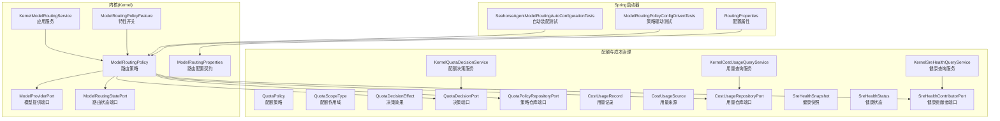
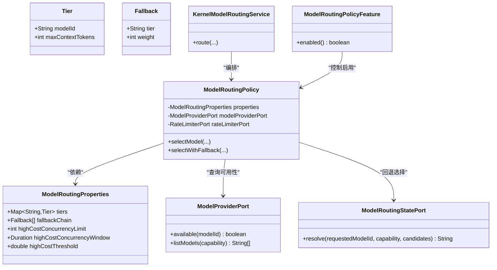
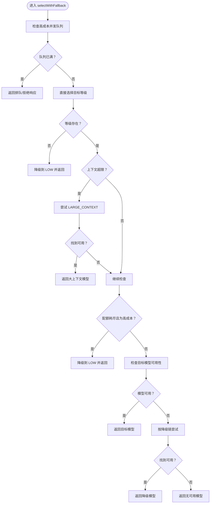
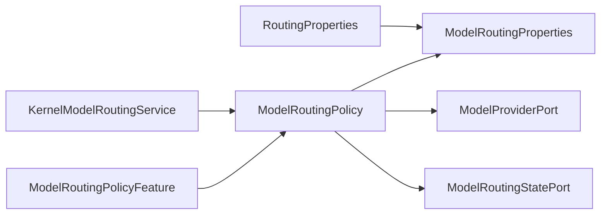

# 模型特性模块

<cite>
**本文引用的文件**
- [ModelRoutingPolicy.java](file://seahorse-agent-kernel/src/main/java/com/miracle/ai/seahorse/agent/kernel/application/agent/routing/ModelRoutingPolicy.java)
- [ModelRoutingProperties.java](file://seahorse-agent-kernel/src/main/java/com/miracle/ai/seahorse/agent/kernel/application/agent/routing/ModelRoutingProperties.java)
- [RoutingProperties.java](file://seahorse-agent-spring-boot-starter/src/main/java/com/miracle/ai/seahorse/agent/adapters/spring/properties/RoutingProperties.java)
- [ModelRoutingStatePort.java](file://seahorse-agent-kernel/src/main/java/com/miracle/ai/seahorse/agent/ports/outbound/model/ModelRoutingStatePort.java)
- [ModelProviderPort.java](file://seahorse-agent-kernel/src/main/java/com/miracle/ai/seahorse/agent/ports/outbound/model/ModelProviderPort.java)
- [KernelModelRoutingService.java](file://seahorse-agent-kernel/src/main/java/com/miracle/ai/seahorse/agent/kernel/application/model/KernelModelRoutingService.java)
- [ModelRoutingPolicyFeature.java](file://seahorse-agent-kernel/src/main/java/com/miracle/ai/seahorse/agent/kernel/feature/model/ModelRoutingPolicyFeature.java)
- [SeahorseAgentModelRoutingAutoConfigurationTests.java](file://seahorse-agent-spring-boot-starter/src/test/java/com/miracle/ai/seahorse/agent/adapters/spring/SeahorseAgentModelRoutingAutoConfigurationTests.java)
- [ModelRoutingPolicyConfigDrivenTests.java](file://seahorse-agent-kernel/src/test/java/com/miracle/ai/seahorse/agent/kernel/application/agent/routing/ModelRoutingPolicyConfigDrivenTests.java)
- [QuotaPolicy.java](file://docs/company-agent/ai-infra-phases/20-unfinished-phase-implementation-pack.md)
- [QuotaScopeType.java](file://docs/company-agent/ai-infra-phases/20-unfinished-phase-implementation-pack.md)
- [QuotaDecisionEffect.java](file://docs/company-agent/ai-infra-phases/20-unfinished-phase-implementation-pack.md)
- [QuotaDefaults.java](file://docs/company-agent/ai-infra-phases/20-unfinished-phase-implementation-pack.md)
- [CostUsageRecord.java](file://docs/company-agent/ai-infra-phases/20-unfinished-phase-implementation-pack.md)
- [CostUsageSource.java](file://docs/company-agent/ai-infra-phases/20-unfinished-phase-implementation-pack.md)
- [SreHealthSnapshot.java](file://docs/company-agent/ai-infra-phases/20-unfinished-phase-implementation-pack.md)
- [SreHealthStatus.java](file://docs/company-agent/ai-infra-phases/20-unfinished-phase-implementation-pack.md)
- [QuotaPolicyRepositoryPort.java](file://docs/company-agent/ai-infra-phases/20-unfinished-phase-implementation-pack.md)
- [QuotaDecisionPort.java](file://docs/company-agent/ai-infra-phases/20-unfinished-phase-implementation-pack.md)
- [CostUsageRepositoryPort.java](file://docs/company-agent/ai-infra-phases/20-unfinished-phase-implementation-pack.md)
- [SreHealthContributorPort.java](file://docs/company-agent/ai-infra-phases/20-unfinished-phase-implementation-pack.md)
- [KernelQuotaDecisionService.java](file://docs/company-agent/ai-infra-phases/20-unfinished-phase-implementation-pack.md)
- [KernelCostUsageQueryService.java](file://docs/company-agent/ai-infra-phases/20-unfinished-phase-implementation-pack.md)
- [KernelSreHealthQueryService.java](file://docs/company-agent/ai-infra-phases/20-unfinished-phase-implementation-pack.md)
- [JdbcQuotaPolicyRepositoryAdapter.java](file://docs/company-agent/ai-infra-phases/20-unfinished-phase-implementation-pack.md)
- [JdbcCostUsageRepositoryAdapter.java](file://docs/company-agent/ai-infra-phases/20-unfinished-phase-implementation-pack.md)
- [SeahorseQuotaController.java](file://docs/company-agent/ai-infra-phases/20-unfinished-phase-implementation-pack.md)
- [SeahorseCostUsageController.java](file://docs/company-agent/ai-infra-phases/20-unfinished-phase-implementation-pack.md)
- [SeahorseSreHealthController.java](file://docs/company-agent/ai-infra-phases/20-unfinished-phase-implementation-pack.md)
</cite>

## 目录
1. [简介](#简介)
2. [项目结构](#项目结构)
3. [核心组件](#核心组件)
4. [架构总览](#架构总览)
5. [详细组件分析](#详细组件分析)
6. [依赖关系分析](#依赖关系分析)
7. [性能考量](#性能考量)
8. [故障排查指南](#故障排查指南)
9. [结论](#结论)
10. [附录](#附录)

## 简介
本文件系统化梳理“模型特性模块”的设计与实现，重点覆盖以下方面：
- 模型路由：基于优先级的模型选择、降级链路与可用性检测
- 多模型支持与智能路由：按上下文规模、配额与成本阈值动态决策
- 性能监控与资源管理：并发窗口限制、高成本阈值与速率控制
- 成本控制与配额治理：配额策略、用量记录与健康度评估
- 启用配置示例：模型优先级、故障转移与性能阈值设置
- 优化建议：容量规划、降级策略与可观测性

## 项目结构
模型特性模块横跨内核(kernel)与Spring启动器(starter)两部分：
- 内核层定义纯领域契约与策略逻辑（路由策略、状态端口、服务）
- Spring启动器提供配置属性与自动装配测试
- 配额与成本治理文档化了成本控制与健康度评估的领域模型

图表来源
- [ModelRoutingPolicy.java:34-128](file://seahorse-agent-kernel/src/main/java/com/miracle/ai/seahorse/agent/kernel/application/agent/routing/ModelRoutingPolicy.java#L34-L128)
- [ModelRoutingProperties.java:30-36](file://seahorse-agent-kernel/src/main/java/com/miracle/ai/seahorse/agent/kernel/application/agent/routing/ModelRoutingProperties.java#L30-L36)
- [RoutingProperties.java:29-71](file://seahorse-agent-spring-boot-starter/src/main/java/com/miracle/ai/seahorse/agent/adapters/spring/properties/RoutingProperties.java#L29-L71)
- [ModelRoutingStatePort.java:31-44](file://seahorse-agent-kernel/src/main/java/com/miracle/ai/seahorse/agent/ports/outbound/model/ModelRoutingStatePort.java#L31-L44)
- [ModelProviderPort.java:36-63](file://seahorse-agent-kernel/src/main/java/com/miracle/ai/seahorse/agent/ports/outbound/model/ModelProviderPort.java#L36-L63)
- [KernelModelRoutingService.java](file://seahorse-agent-kernel/src/main/java/com/miracle/ai/seahorse/agent/kernel/application/model/KernelModelRoutingService.java)
- [ModelRoutingPolicyFeature.java](file://seahorse-agent-kernel/src/main/java/com/miracle/ai/seahorse/agent/kernel/feature/model/ModelRoutingPolicyFeature.java)
- [SeahorseAgentModelRoutingAutoConfigurationTests.java:48-55](file://seahorse-agent-spring-boot-starter/src/test/java/com/miracle/ai/seahorse/agent/adapters/spring/SeahorseAgentModelRoutingAutoConfigurationTests.java#L48-L55)
- [ModelRoutingPolicyConfigDrivenTests.java:36-61](file://seahorse-agent-kernel/src/test/java/com/miracle/ai/seahorse/agent/kernel/application/agent/routing/ModelRoutingPolicyConfigDrivenTests.java#L36-L61)
- [QuotaPolicy.java:365-380](file://docs/company-agent/ai-infra-phases/20-unfinished-phase-implementation-pack.md#L365-L380)
- [QuotaScopeType.java:369-370](file://docs/company-agent/ai-infra-phases/20-unfinished-phase-implementation-pack.md#L369-L370)
- [QuotaDecisionEffect.java:371-372](file://docs/company-agent/ai-infra-phases/20-unfinished-phase-implementation-pack.md#L371-L372)
- [QuotaDefaults.java:372-373](file://docs/company-agent/ai-infra-phases/20-unfinished-phase-implementation-pack.md#L372-L373)
- [CostUsageRecord.java:373-374](file://docs/company-agent/ai-infra-phases/20-unfinished-phase-implementation-pack.md#L373-L374)
- [CostUsageSource.java:374-375](file://docs/company-agent/ai-infra-phases/20-unfinished-phase-implementation-pack.md#L374-L375)
- [SreHealthSnapshot.java:375-376](file://docs/company-agent/ai-infra-phases/20-unfinished-phase-implementation-pack.md#L375-L376)
- [SreHealthStatus.java:376-377](file://docs/company-agent/ai-infra-phases/20-unfinished-phase-implementation-pack.md#L376-L377)
- [QuotaPolicyRepositoryPort.java:377-378](file://docs/company-agent/ai-infra-phases/20-unfinished-phase-implementation-pack.md#L377-L378)
- [QuotaDecisionPort.java:377-378](file://docs/company-agent/ai-infra-phases/20-unfinished-phase-implementation-pack.md#L377-L378)
- [CostUsageRepositoryPort.java:377-378](file://docs/company-agent/ai-infra-phases/20-unfinished-phase-implementation-pack.md#L377-L378)
- [SreHealthContributorPort.java:377-378](file://docs/company-agent/ai-infra-phases/20-unfinished-phase-implementation-pack.md#L377-L378)
- [KernelQuotaDecisionService.java:378-379](file://docs/company-agent/ai-infra-phases/20-unfinished-phase-implementation-pack.md#L378-L379)
- [KernelCostUsageQueryService.java:378-379](file://docs/company-agent/ai-infra-phases/20-unfinished-phase-implementation-pack.md#L378-L379)
- [KernelSreHealthQueryService.java:378-379](file://docs/company-agent/ai-infra-phases/20-unfinished-phase-implementation-pack.md#L378-L379)
- [JdbcQuotaPolicyRepositoryAdapter.java:379-380](file://docs/company-agent/ai-infra-phases/20-unfinished-phase-implementation-pack.md#L379-L380)
- [JdbcCostUsageRepositoryAdapter.java:379-380](file://docs/company-agent/ai-infra-phases/20-unfinished-phase-implementation-pack.md#L379-L380)
- [SeahorseQuotaController.java:1241-1251](file://docs/company-agent/ai-infra-phases/20-unfinished-phase-implementation-pack.md#L1241-L1251)
- [SeahorseCostUsageController.java:1241-1251](file://docs/company-agent/ai-infra-phases/20-unfinished-phase-implementation-pack.md#L1241-L1251)
- [SeahorseSreHealthController.java:1241-1251](file://docs/company-agent/ai-infra-phases/20-unfinished-phase-implementation-pack.md#L1241-L1251)

章节来源
- [ModelRoutingPolicy.java:34-128](file://seahorse-agent-kernel/src/main/java/com/miracle/ai/seahorse/agent/kernel/application/agent/routing/ModelRoutingPolicy.java#L34-L128)
- [RoutingProperties.java:29-71](file://seahorse-agent-spring-boot-starter/src/main/java/com/miracle/ai/seahorse/agent/adapters/spring/properties/RoutingProperties.java#L29-L71)

## 核心组件
- 路由策略（ModelRoutingPolicy）：根据请求的模型等级、剩余配额、上下文令牌数，结合配置的降级链与可用性检测，返回最终模型ID，并标注是否降级
- 路由配置（ModelRoutingProperties）：纯领域契约，包含分层配置、降级链、高成本并发阈值与窗口
- 配置属性（RoutingProperties）：Spring Boot属性映射，提供默认分层、降级链与高成本阈值配置
- 模型提供端口（ModelProviderPort）：用于查询模型可用性与列出具备特定能力的模型列表
- 路由状态端口（ModelRoutingStatePort）：在未显式指定模型ID时，从候选集中选择首个可用模型
- 应用服务（KernelModelRoutingService）：面向业务的路由编排入口
- 特性开关（ModelRoutingPolicyFeature）：控制路由策略是否启用
- 自动装配测试与策略驱动测试：验证配置生效与策略行为

章节来源
- [ModelRoutingPolicy.java:34-128](file://seahorse-agent-kernel/src/main/java/com/miracle/ai/seahorse/agent/kernel/application/agent/routing/ModelRoutingPolicy.java#L34-L128)
- [ModelRoutingProperties.java:30-36](file://seahorse-agent-kernel/src/main/java/com/miracle/ai/seahorse/agent/kernel/application/agent/routing/ModelRoutingProperties.java#L30-L36)
- [RoutingProperties.java:29-71](file://seahorse-agent-spring-boot-starter/src/main/java/com/miracle/ai/seahorse/agent/adapters/spring/properties/RoutingProperties.java#L29-L71)
- [ModelRoutingStatePort.java:31-44](file://seahorse-agent-kernel/src/main/java/com/miracle/ai/seahorse/agent/ports/outbound/model/ModelRoutingStatePort.java#L31-L44)
- [ModelProviderPort.java:36-63](file://seahorse-agent-kernel/src/main/java/com/miracle/ai/seahorse/agent/ports/outbound/model/ModelProviderPort.java#L36-L63)
- [KernelModelRoutingService.java](file://seahorse-agent-kernel/src/main/java/com/miracle/ai/seahorse/agent/kernel/application/model/KernelModelRoutingService.java)
- [ModelRoutingPolicyFeature.java](file://seahorse-agent-kernel/src/main/java/com/miracle/ai/seahorse/agent/kernel/feature/model/ModelRoutingPolicyFeature.java)
- [SeahorseAgentModelRoutingAutoConfigurationTests.java:48-55](file://seahorse-agent-spring-boot-starter/src/test/java/com/miracle/ai/seahorse/agent/adapters/spring/SeahorseAgentModelRoutingAutoConfigurationTests.java#L48-L55)
- [ModelRoutingPolicyConfigDrivenTests.java:36-61](file://seahorse-agent-kernel/src/test/java/com/miracle/ai/seahorse/agent/kernel/application/agent/routing/ModelRoutingPolicyConfigDrivenTests.java#L36-L61)

## 架构总览
模型特性模块采用“内核契约 + Spring属性 + 端口适配”的分层架构：
- 内核层提供纯策略与领域模型，确保可测试与可替换
- Spring启动器负责属性绑定与自动装配，便于在不同运行环境中启用/禁用
- 端口抽象（Provider、State、RateLimiter等）解耦外部依赖，便于注入真实实现或noop实现

图表来源
- [ModelRoutingProperties.java:30-36](file://seahorse-agent-kernel/src/main/java/com/miracle/ai/seahorse/agent/kernel/application/agent/routing/ModelRoutingProperties.java#L30-L36)
- [ModelRoutingPolicy.java:34-128](file://seahorse-agent-kernel/src/main/java/com/miracle/ai/seahorse/agent/kernel/application/agent/routing/ModelRoutingPolicy.java#L34-L128)
- [ModelRoutingStatePort.java:31-44](file://seahorse-agent-kernel/src/main/java/com/miracle/ai/seahorse/agent/ports/outbound/model/ModelRoutingStatePort.java#L31-L44)
- [ModelProviderPort.java:36-63](file://seahorse-agent-kernel/src/main/java/com/miracle/ai/seahorse/agent/ports/outbound/model/ModelProviderPort.java#L36-L63)
- [KernelModelRoutingService.java](file://seahorse-agent-kernel/src/main/java/com/miracle/ai/seahorse/agent/kernel/application/model/KernelModelRoutingService.java)
- [ModelRoutingPolicyFeature.java](file://seahorse-agent-kernel/src/main/java/com/miracle/ai/seahorse/agent/kernel/feature/model/ModelRoutingPolicyFeature.java)

## 详细组件分析

### 路由策略（ModelRoutingPolicy）
- 输入参数：请求的模型等级、剩余配额、上下文令牌数、用户标识（用于高成本并发窗口）
- 决策流程：
  1) 检查高成本并发队列是否已满（若满则拒绝或排队）
  2) 直接选择：若请求等级不存在，降级到低等级；若上下文过大，尝试大上下文等级；若配额耗尽且为高成本模型，降级到低等级
  3) 可用性检测：若目标模型不可用，则按降级链逐级尝试
  4) 回退策略：若所有等级均不可用，返回无可用模型的结果并记录降级原因
- 输出：模型ID与是否降级的标记

图表来源
- [ModelRoutingPolicy.java:60-128](file://seahorse-agent-kernel/src/main/java/com/miracle/ai/seahorse/agent/kernel/application/agent/routing/ModelRoutingPolicy.java#L60-L128)

章节来源
- [ModelRoutingPolicy.java:60-128](file://seahorse-agent-kernel/src/main/java/com/miracle/ai/seahorse/agent/kernel/application/agent/routing/ModelRoutingPolicy.java#L60-L128)

### 路由配置（ModelRoutingProperties）
- 分层配置（Tier）：每个等级绑定一个模型ID与最大上下文令牌数
- 降级链（Fallback）：按权重顺序尝试多个等级，避免重复尝试同一等级
- 高成本阈值与并发窗口：用于限制高成本调用的并发，防止资源过载

章节来源
- [ModelRoutingProperties.java:30-36](file://seahorse-agent-kernel/src/main/java/com/miracle/ai/seahorse/agent/kernel/application/agent/routing/ModelRoutingProperties.java#L30-L36)

### 配置属性（RoutingProperties）
- 默认分层与降级链：提供开箱即用的策略配置
- 高成本并发限制与窗口：通过属性控制高成本模型的并发速率
- Spring Boot自动装配测试：验证配置项生效与策略选择行为

章节来源
- [RoutingProperties.java:29-71](file://seahorse-agent-spring-boot-starter/src/main/java/com/miracle/ai/seahorse/agent/adapters/spring/properties/RoutingProperties.java#L29-L71)
- [SeahorseAgentModelRoutingAutoConfigurationTests.java:48-55](file://seahorse-agent-spring-boot-starter/src/test/java/com/miracle/ai/seahorse/agent/adapters/spring/SeahorseAgentModelRoutingAutoConfigurationTests.java#L48-L55)

### 模型提供端口（ModelProviderPort）
- 能力查询：按能力（如聊天）列出候选模型
- 可用性判断：检查指定模型是否可用
- 空实现：当未注入真实实现时，返回空列表或不可用

章节来源
- [ModelProviderPort.java:36-63](file://seahorse-agent-kernel/src/main/java/com/miracle/ai/seahorse/agent/ports/outbound/model/ModelProviderPort.java#L36-L63)

### 路由状态端口（ModelRoutingStatePort）
- 在未显式指定模型ID时，从候选集中选择第一个可用模型
- 保证在无明确要求时仍能返回可运行的模型

章节来源
- [ModelRoutingStatePort.java:31-44](file://seahorse-agent-kernel/src/main/java/com/miracle/ai/seahorse/agent/ports/outbound/model/ModelRoutingStatePort.java#L31-L44)

### 应用服务与特性开关
- KernelModelRoutingService：对外暴露统一的路由入口，封装策略与端口交互
- ModelRoutingPolicyFeature：通过特性开关控制策略启用/禁用，便于灰度与回滚

章节来源
- [KernelModelRoutingService.java](file://seahorse-agent-kernel/src/main/java/com/miracle/ai/seahorse/agent/kernel/application/model/KernelModelRoutingService.java)
- [ModelRoutingPolicyFeature.java](file://seahorse-agent-kernel/src/main/java/com/miracle/ai/seahorse/agent/kernel/feature/model/ModelRoutingPolicyFeature.java)

### 策略驱动测试
- 验证自定义配置优先于硬编码默认值
- 验证未知等级降级到配置的低等级
- 验证主模型不可用时按配置的降级链遍历

章节来源
- [ModelRoutingPolicyConfigDrivenTests.java:36-61](file://seahorse-agent-kernel/src/test/java/com/miracle/ai/seahorse/agent/kernel/application/agent/routing/ModelRoutingPolicyConfigDrivenTests.java#L36-L61)

## 依赖关系分析
- 路由策略依赖配置契约与端口抽象，确保策略与实现解耦
- 应用服务编排策略与端口，形成清晰的职责边界
- 配置属性通过Spring自动装配注入策略，便于环境差异化配置

图表来源
- [RoutingProperties.java:29-71](file://seahorse-agent-spring-boot-starter/src/main/java/com/miracle/ai/seahorse/agent/adapters/spring/properties/RoutingProperties.java#L29-L71)
- [ModelRoutingProperties.java:30-36](file://seahorse-agent-kernel/src/main/java/com/miracle/ai/seahorse/agent/kernel/application/agent/routing/ModelRoutingProperties.java#L30-L36)
- [ModelRoutingPolicy.java:34-128](file://seahorse-agent-kernel/src/main/java/com/miracle/ai/seahorse/agent/kernel/application/agent/routing/ModelRoutingPolicy.java#L34-L128)
- [ModelRoutingStatePort.java:31-44](file://seahorse-agent-kernel/src/main/java/com/miracle/ai/seahorse/agent/ports/outbound/model/ModelRoutingStatePort.java#L31-L44)
- [ModelProviderPort.java:36-63](file://seahorse-agent-kernel/src/main/java/com/miracle/ai/seahorse/agent/ports/outbound/model/ModelProviderPort.java#L36-L63)
- [KernelModelRoutingService.java](file://seahorse-agent-kernel/src/main/java/com/miracle/ai/seahorse/agent/kernel/application/model/KernelModelRoutingService.java)
- [ModelRoutingPolicyFeature.java](file://seahorse-agent-kernel/src/main/java/com/miracle/ai/seahorse/agent/kernel/feature/model/ModelRoutingPolicyFeature.java)

## 性能考量
- 上下文令牌限制：当请求上下文超过等级上限时，自动尝试大上下文等级，避免失败重试
- 高成本并发控制：通过并发限制与时间窗口，防止高成本模型在短时间内被过度调用
- 降级链策略：在主模型不可用或资源紧张时，快速切换到备选模型，提升整体可用性
- 可观测性：结合配额与健康度评估，持续监控资源使用与系统健康状况

## 故障排查指南
- 模型不可用：检查模型提供端口的可用性判断与模型列表，确认目标模型是否在能力列表中
- 降级频繁：检查分层配置与降级链权重，确认是否存在等级上限或配额耗尽导致的降级
- 并发受限：检查高成本并发限制与窗口配置，必要时调整以平衡性能与稳定性
- 配额不足：结合配额决策与用量记录，定位高成本调用来源并优化策略

章节来源
- [ModelRoutingPolicy.java:60-128](file://seahorse-agent-kernel/src/main/java/com/miracle/ai/seahorse/agent/kernel/application/agent/routing/ModelRoutingPolicy.java#L60-L128)
- [ModelRoutingStatePort.java:31-44](file://seahorse-agent-kernel/src/main/java/com/miracle/ai/seahorse/agent/ports/outbound/model/ModelRoutingStatePort.java#L31-L44)
- [ModelRoutingPolicyConfigDrivenTests.java:36-61](file://seahorse-agent-kernel/src/test/java/com/miracle/ai/seahorse/agent/kernel/application/agent/routing/ModelRoutingPolicyConfigDrivenTests.java#L36-L61)

## 结论
模型特性模块通过清晰的分层设计与端口抽象，实现了灵活的多模型支持与智能路由。借助配置化的分层与降级链、高成本并发控制以及可用性检测，系统能够在复杂场景下保持稳定与高性能。配合配额与健康度评估，进一步完善了成本控制与资源管理机制。

## 附录

### 启用配置示例（基于属性）
- 分层与降级链：通过配置项定义各等级的模型ID与权重
- 高成本阈值与并发窗口：设置高成本模型的并发限制与统计窗口
- 示例路径参考：
  - [RoutingProperties.java:29-71](file://seahorse-agent-spring-boot-starter/src/main/java/com/miracle/ai/seahorse/agent/adapters/spring/properties/RoutingProperties.java#L29-L71)
  - [SeahorseAgentModelRoutingAutoConfigurationTests.java:48-55](file://seahorse-agent-spring-boot-starter/src/test/java/com/miracle/ai/seahorse/agent/adapters/spring/SeahorseAgentModelRoutingAutoConfigurationTests.java#L48-L55)

### 成本控制与资源管理机制
- 配额策略（QuotaPolicy）：定义作用域、窗口、限额与告警比例
- 决策效果（QuotaDecisionEffect）：允许、警告、拒绝、需要审批
- 用量记录（CostUsageRecord）：按来源记录token、成本与调用次数
- 健康度评估（SreHealthSnapshot/Status）：聚合组件贡献者状态，识别风险
- 控制器与查询服务：提供REST接口进行策略维护与用量/健康查询

章节来源
- [QuotaPolicy.java:365-380](file://docs/company-agent/ai-infra-phases/20-unfinished-phase-implementation-pack.md#L365-L380)
- [QuotaScopeType.java:369-370](file://docs/company-agent/ai-infra-phases/20-unfinished-phase-implementation-pack.md#L369-L370)
- [QuotaDecisionEffect.java:371-372](file://docs/company-agent/ai-infra-phases/20-unfinished-phase-implementation-pack.md#L371-L372)
- [QuotaDefaults.java:372-373](file://docs/company-agent/ai-infra-phases/20-unfinished-phase-implementation-pack.md#L372-L373)
- [CostUsageRecord.java:373-374](file://docs/company-agent/ai-infra-phases/20-unfinished-phase-implementation-pack.md#L373-L374)
- [CostUsageSource.java:374-375](file://docs/company-agent/ai-infra-phases/20-unfinished-phase-implementation-pack.md#L374-L375)
- [SreHealthSnapshot.java:375-376](file://docs/company-agent/ai-infra-phases/20-unfinished-phase-implementation-pack.md#L375-L376)
- [SreHealthStatus.java:376-377](file://docs/company-agent/ai-infra-phases/20-unfinished-phase-implementation-pack.md#L376-L377)
- [QuotaPolicyRepositoryPort.java:377-378](file://docs/company-agent/ai-infra-phases/20-unfinished-phase-implementation-pack.md#L377-L378)
- [QuotaDecisionPort.java:377-378](file://docs/company-agent/ai-infra-phases/20-unfinished-phase-implementation-pack.md#L377-L378)
- [CostUsageRepositoryPort.java:377-378](file://docs/company-agent/ai-infra-phases/20-unfinished-phase-implementation-pack.md#L377-L378)
- [SreHealthContributorPort.java:377-378](file://docs/company-agent/ai-infra-phases/20-unfinished-phase-implementation-pack.md#L377-L378)
- [KernelQuotaDecisionService.java:378-379](file://docs/company-agent/ai-infra-phases/20-unfinished-phase-implementation-pack.md#L378-L379)
- [KernelCostUsageQueryService.java:378-379](file://docs/company-agent/ai-infra-phases/20-unfinished-phase-implementation-pack.md#L378-L379)
- [KernelSreHealthQueryService.java:378-379](file://docs/company-agent/ai-infra-phases/20-unfinished-phase-implementation-pack.md#L378-L379)
- [JdbcQuotaPolicyRepositoryAdapter.java:379-380](file://docs/company-agent/ai-infra-phases/20-unfinished-phase-implementation-pack.md#L379-L380)
- [JdbcCostUsageRepositoryAdapter.java:379-380](file://docs/company-agent/ai-infra-phases/20-unfinished-phase-implementation-pack.md#L379-L380)
- [SeahorseQuotaController.java:1241-1251](file://docs/company-agent/ai-infra-phases/20-unfinished-phase-implementation-pack.md#L1241-L1251)
- [SeahorseCostUsageController.java:1241-1251](file://docs/company-agent/ai-infra-phases/20-unfinished-phase-implementation-pack.md#L1241-L1251)
- [SeahorseSreHealthController.java:1241-1251](file://docs/company-agent/ai-infra-phases/20-unfinished-phase-implementation-pack.md#L1241-L1251)