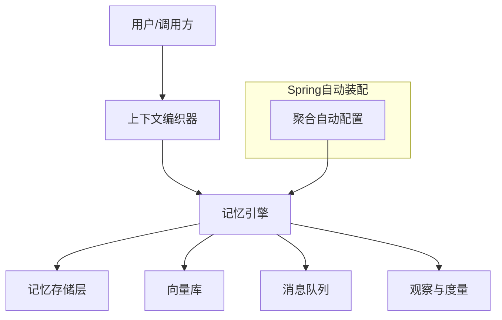
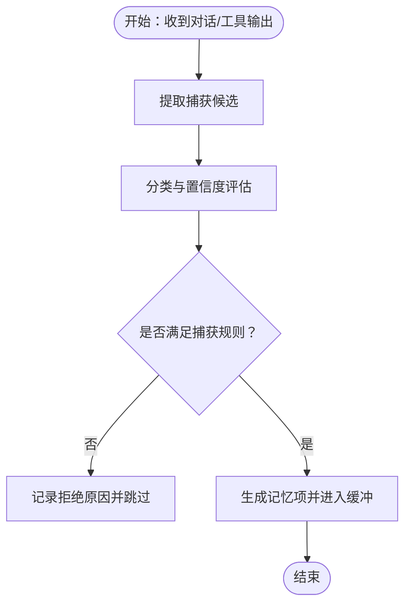
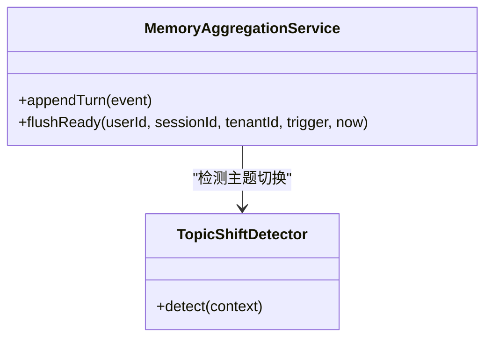
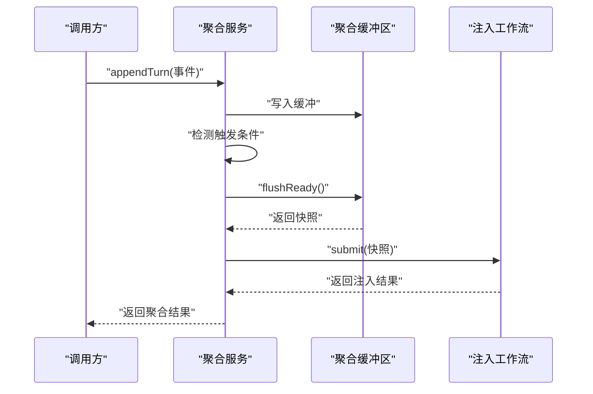
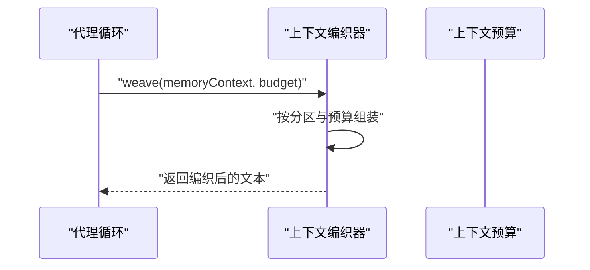
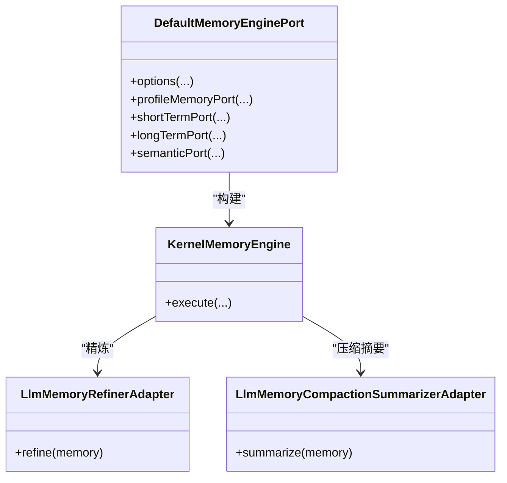
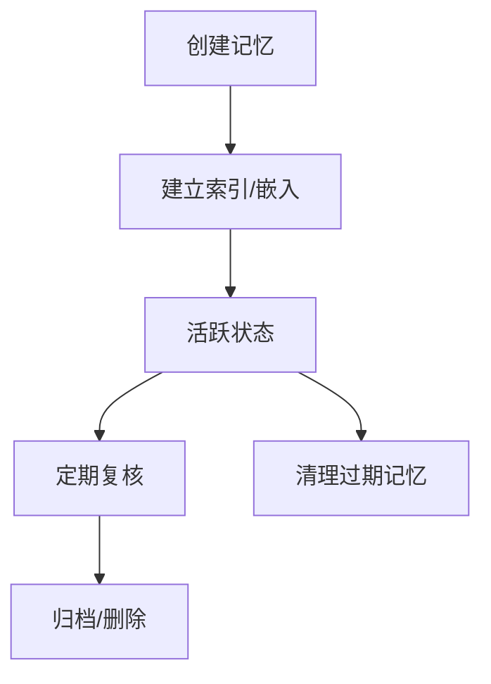
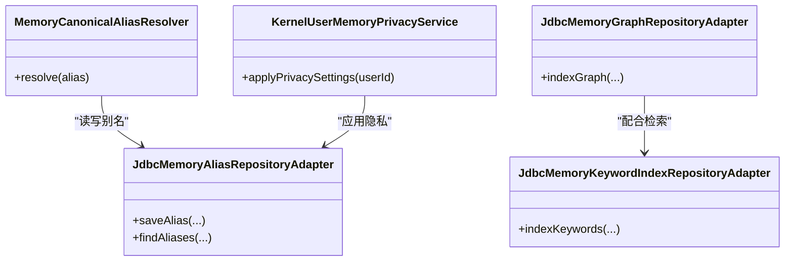
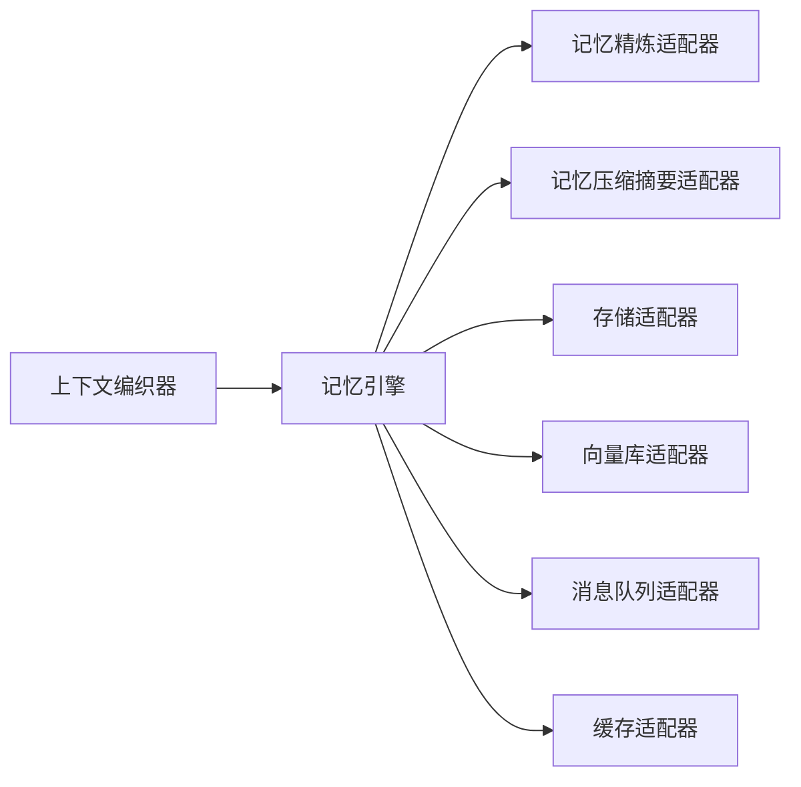

# 记忆特性模块

<cite>
**本文引用的文件**
- [DefaultMemoryAggregationService.java](file://seahorse-agent-kernel/src/main/java/com/miracle/ai/seahorse/agent/kernel/application/memory/aggregation/DefaultMemoryAggregationService.java)
- [SeahorseAgentMemoryAggregationAutoConfiguration.java](file://seahorse-agent-spring-boot-starter/src/main/java/com/miracle/ai/seahorse/agent/adapters/spring/SeahorseAgentMemoryAggregationAutoConfiguration.java)
- [ContextWeaverPort.java](file://seahorse-agent-kernel/src/main/java/com/miracle/ai/seahorse/agent/ports/outbound/memory/ContextWeaverPort.java)
- [DefaultContextWeaver.java](file://seahorse-agent-kernel/src/main/java/com/miracle/ai/seahorse/agent/kernel/application/memory/DefaultContextWeaver.java)
- [DefaultMemoryEnginePort.java](file://seahorse-agent-kernel/src/main/java/com/miracle/ai/seahorse/agent/kernel/application/memory/DefaultMemoryEnginePort.java)
- [KernelMemoryEngine.java](file://seahorse-agent-kernel/src/main/java/com/miracle/ai/seahorse/agent/kernel/application/memory/KernelMemoryEngine.java)
- [KernelMemoryManagementService.java](file://seahorse-agent-kernel/src/main/java/com/miracle/ai/seahorse/agent/kernel/application/memory/KernelMemoryManagementService.java)
- [KernelMemoryReviewService.java](file://seahorse-agent-kernel/src/main/java/com/miracle/ai/seahorse/agent/kernel/application/memory/KernelMemoryReviewService.java)
- [KernelMemoryGovernanceService.java](file://seahorse-agent-kernel/src/main/java/com/miracle/ai/seahorse/agent/kernel/application/memory/KernelMemoryGovernanceService.java)
- [KernelMemoryTraceQueryService.java](file://seahorse-agent-kernel/src/main/java/com/miracle/ai/seahorse/agent/kernel/application/memory/KernelMemoryTraceQueryService.java)
- [KernelUserMemoryPrivacyService.java](file://seahorse-agent-kernel/src/main/java/com/miracle/ai/seahorse/agent/kernel/application/memory/KernelUserMemoryPrivacyService.java)
- [MemoryCaptureRules.java](file://seahorse-agent-kernel/src/main/java/com/miracle/ai/seahorse/agent/kernel/application/memory/MemoryCaptureRules.java)
- [MemoryCaptureCandidateExtractor.java](file://seahorse-agent-kernel/src/main/java/com/miracle/ai/seahorse/agent/kernel/application/memory/MemoryCaptureCandidateExtractor.java)
- [MemoryCaptureDecision.java](file://seahorse-agent-kernel/src/main/java/com/miracle/ai/seahorse/agent/kernel/application/memory/MemoryCaptureDecision.java)
- [MemoryCaptureRejectionReason.java](file://seahorse-agent-kernel/src/main/java/com/miracle/ai/seahorse/agent/kernel/application/memory/MemoryCaptureRejectionReason.java)
- [MemoryClassificationResult.java](file://seahorse-agent-kernel/src/main/java/com/miracle/ai/seahorse/agent/kernel/application/memory/MemoryClassificationResult.java)
- [MemoryCanonicalAliasResolver.java](file://seahorse-agent-kernel/src/main/java/com/miracle/ai/seahorse/agent/kernel/application/memory/MemoryCanonicalAliasResolver.java)
- [MemoryAggregationServiceTests.java](file://seahorse-agent-tests/src/test/java/com/miracle/ai/seahorse/agent/kernel/application/memory/aggregation/MemoryAggregationServiceTests.java)
- [MemoryWorkflowRoutingTests.java](file://seahorse-agent-tests/src/test/java/com/miracle/ai/seahorse/agent/kernel/application/memory/MemoryWorkflowRoutingTests.java)
- [DefaultContextWeaverObservationTests.java](file://seahorse-agent-tests/src/test/java/com/miracle/ai/seahorse/agent/kernel/application/memory/DefaultContextWeaverObservationTests.java)
- [KernelAgentLoopTests.java](file://seahorse-agent-tests/src/test/java/com/miracle/ai/seahorse/agent/kernel/application/agent/KernelAgentLoopTests.java)
- [LlmMemoryRefinerAdapter.java](file://seahorse-agent-adapter-ai-openai-compatible/src/main/java/com/miracle/ai/seahorse/agent/adapters/ai/openai/LlmMemoryRefinerAdapter.java)
- [OpenAiCompatibleMemoryRefinerAutoConfiguration.java](file://seahorse-agent-adapter-ai-openai-compatible/src/main/java/com/miracle/ai/seahorse/agent/adapters/ai/openai/OpenAiCompatibleMemoryRefinerAutoConfiguration.java)
- [LlmMemoryCompactionSummarizerAdapter.java](file://seahorse-agent-adapter-ai-openai-compatible/src/main/java/com/miracle/ai/seahorse/agent/adapters/ai/openai/LlmMemoryCompactionSummarizerAdapter.java)
- [OpenAiCompatibleMemoryCompactionAutoConfiguration.java](file://seahorse-agent-adapter-ai-openai-compatible/src/main/java/com/miracle/ai/seahorse/agent/adapters/ai/openai/OpenAiCompatibleMemoryCompactionAutoConfiguration.java)
- [RedisMemoryAggregationBufferPort.java](file://seahorse-agent-adapter-cache-redis/src/main/java/com/miracle/ai/seahorse/agent/adapters/cache/redis/RedisMemoryAggregationBufferPort.java)
- [RedisMemoryAggregationSchedulerPort.java](file://seahorse-agent-adapter-cache-redis/src/main/java/com/miracle/ai/seahorse/agent/adapters/cache/redis/RedisMemoryAggregationSchedulerPort.java)
- [JdbcMemoryAggregationBufferAdapter.java](file://seahorse-agent-adapter-repository-jdbc/src/main/java/com/miracle/ai/seahorse/agent/adapters/repository/jdbc/JdbcMemoryAggregationBufferAdapter.java)
- [JdbcLongTermMemoryRepositoryAdapter.java](file://seahorse-agent-adapter-repository-jdbc/src/main/java/com/miracle/ai/seahorse/agent/adapters/repository/jdbc/JdbcLongTermMemoryRepositoryAdapter.java)
- [JdbcMemoryAliasRepositoryAdapter.java](file://seahorse-agent-adapter-repository-jdbc/src/main/java/com/miracle/ai/seahorse/agent/adapters/repository/jdbc/JdbcMemoryAliasRepositoryAdapter.java)
- [JdbcMemoryGraphRepositoryAdapter.java](file://seahorse-agent-adapter-repository-jdbc/src/main/java/com/miracle/ai/seahorse/agent/adapters/repository/jdbc/JdbcMemoryGraphRepositoryAdapter.java)
- [JdbcMemoryKeywordIndexRepositoryAdapter.java](file://seahorse-agent-adapter-repository-jdbc/src/main/java/com/miracle/ai/seahorse/agent/adapters/repository/jdbc/JdbcMemoryKeywordIndexRepositoryAdapter.java)
- [JdbcMemoryKeywordSearchRepositoryAdapter.java](file://seahorse-agent-adapter-repository-jdbc/src/main/java/com/miracle/ai/seahorse/agent/adapters/repository/jdbc/JdbcMemoryKeywordSearchRepositoryAdapter.java)
- [JdbcMemoryLifecycleRepositoryAdapter.java](file://seahorse-agent-adapter-repository-jdbc/src/main/java/com/miracle/ai/seahorse/agent/adapters/repository/jdbc/JdbcMemoryLifecycleRepositoryAdapter.java)
- [JdbcMemoryOutboxRepositoryAdapter.java](file://seahorse-agent-adapter-repository-jdbc/src/main/java/com/miracle/ai/seahorse/agent/adapters/repository/jdbc/JdbcMemoryOutboxRepositoryAdapter.java)
- [JdbcConversationMemoryAdapter.java](file://seahorse-agent-adapter-repository-jdbc/src/main/java/com/miracle/ai/seahorse/agent/adapters/repository/jdbc/JdbcConversationMemoryAdapter.java)
- [application.properties](file://seahorse-agent-bootstrap/src/main/resources/application.properties)
</cite>

## 目录
1. [引言](#引言)
2. [项目结构](#项目结构)
3. [核心组件](#核心组件)
4. [架构总览](#架构总览)
5. [详细组件分析](#详细组件分析)
6. [依赖关系分析](#依赖关系分析)
7. [性能考虑](#性能考虑)
8. [故障排查指南](#故障排查指南)
9. [结论](#结论)
10. [附录](#附录)

## 引言
本文件系统性阐述“记忆特性模块”的设计与实现，覆盖记忆捕获、记忆过滤、记忆聚合等关键能力；说明配置参数、生命周期管理与性能优化策略；解释记忆特性与上下文编织器（Context Weaver）及记忆引擎（Memory Engine）的协作方式；提供启用配置示例、隐私保护与数据安全措施，并给出可操作的记忆管理示例与最佳实践。

## 项目结构
记忆特性模块横跨内核(kernel)、适配器(adapters)与测试(tests)三层，围绕以下关键路径组织：
- 内核层：定义记忆域模型、上下文编织、记忆引擎、治理与管理服务
- 适配器层：提供缓存、消息队列、向量库、存储等基础设施对接
- 测试层：验证聚合策略、上下文编织行为与观测指标

```mermaid
graph TB
subgraph "内核(kernel)"
K1["DefaultContextWeaver<br/>上下文编织器"]
K2["DefaultMemoryEnginePort<br/>记忆引擎端口"]
K3["KernelMemoryEngine<br/>记忆引擎"]
K4["KernelMemoryManagementService<br/>记忆管理服务"]
K5["KernelMemoryReviewService<br/>记忆复核服务"]
K6["KernelMemoryGovernanceService<br/>记忆治理服务"]
K7["KernelMemoryTraceQueryService<br/>记忆追踪查询服务"]
K8["KernelUserMemoryPrivacyService<br/>用户记忆隐私服务"]
end
subgraph "适配器(adapters)"
A1["RedisMemoryAggregationBufferPort<br/>聚合缓冲区"]
A2["RedisMemoryAggregationSchedulerPort<br/>聚合调度器"]
A3["JdbcMemoryAggregationBufferAdapter<br/>JDBC聚合缓冲"]
A4["JdbcLongTermMemoryRepositoryAdapter<br/>长期记忆仓库"]
A5["JdbcMemoryAliasRepositoryAdapter<br/>别名仓库"]
A6["JdbcMemoryGraphRepositoryAdapter<br/>图谱仓库"]
A7["JdbcMemoryKeywordIndexRepositoryAdapter<br/>关键词索引"]
A8["JdbcMemoryKeywordSearchRepositoryAdapter<br/>关键词检索"]
A9["JdbcMemoryLifecycleRepositoryAdapter<br/>生命周期仓库"]
A10["JdbcMemoryOutboxRepositoryAdapter<br/>出站事件仓库"]
A11["JdbcConversationMemoryAdapter<br/>对话记忆"]
A12["LlmMemoryRefinerAdapter<br/>记忆精炼"]
A13["LlmMemoryCompactionSummarizerAdapter<br/>记忆压缩摘要"]
end
subgraph "Spring自动装配"
S1["SeahorseAgentMemoryAggregationAutoConfiguration<br/>聚合自动配置"]
end
K1 --> K2
K2 --> K3
K3 --> K4
K3 --> K5
K3 --> K6
K3 --> K7
K3 --> K8
S1 --> K4
S1 --> K5
S1 --> K6
S1 --> K7
S1 --> K8
K4 --> A1
K4 --> A2
K4 --> A3
K5 --> A5
K6 --> A6
K6 --> A7
K6 --> A8
K6 --> A9
K6 --> A10
K6 --> A11
K3 --> A12
K3 --> A13
```

**图表来源**
- [DefaultContextWeaver.java](file://seahorse-agent-kernel/src/main/java/com/miracle/ai/seahorse/agent/kernel/application/memory/DefaultContextWeaver.java)
- [DefaultMemoryEnginePort.java](file://seahorse-agent-kernel/src/main/java/com/miracle/ai/seahorse/agent/kernel/application/memory/DefaultMemoryEnginePort.java)
- [KernelMemoryEngine.java](file://seahorse-agent-kernel/src/main/java/com/miracle/ai/seahorse/agent/kernel/application/memory/KernelMemoryEngine.java)
- [KernelMemoryManagementService.java](file://seahorse-agent-kernel/src/main/java/com/miracle/ai/seahorse/agent/kernel/application/memory/KernelMemoryManagementService.java)
- [KernelMemoryReviewService.java](file://seahorse-agent-kernel/src/main/java/com/miracle/ai/seahorse/agent/kernel/application/memory/KernelMemoryReviewService.java)
- [KernelMemoryGovernanceService.java](file://seahorse-agent-kernel/src/main/java/com/miracle/ai/seahorse/agent/kernel/application/memory/KernelMemoryGovernanceService.java)
- [KernelMemoryTraceQueryService.java](file://seahorse-agent-kernel/src/main/java/com/miracle/ai/seahorse/agent/kernel/application/memory/KernelMemoryTraceQueryService.java)
- [KernelUserMemoryPrivacyService.java](file://seahorse-agent-kernel/src/main/java/com/miracle/ai/seahorse/agent/kernel/application/memory/KernelUserMemoryPrivacyService.java)
- [RedisMemoryAggregationBufferPort.java](file://seahorse-agent-adapter-cache-redis/src/main/java/com/miracle/ai/seahorse/agent/adapters/cache/redis/RedisMemoryAggregationBufferPort.java)
- [RedisMemoryAggregationSchedulerPort.java](file://seahorse-agent-adapter-cache-redis/src/main/java/com/miracle/ai/seahorse/agent/adapters/cache/redis/RedisMemoryAggregationSchedulerPort.java)
- [JdbcMemoryAggregationBufferAdapter.java](file://seahorse-agent-adapter-repository-jdbc/src/main/java/com/miracle/ai/seahorse/agent/adapters/repository/jdbc/JdbcMemoryAggregationBufferAdapter.java)
- [JdbcLongTermMemoryRepositoryAdapter.java](file://seahorse-agent-adapter-repository-jdbc/src/main/java/com/miracle/ai/seahorse/agent/adapters/repository/jdbc/JdbcLongTermMemoryRepositoryAdapter.java)
- [JdbcMemoryAliasRepositoryAdapter.java](file://seahorse-agent-adapter-repository-jdbc/src/main/java/com/miracle/ai/seahorse/agent/adapters/repository/jdbc/JdbcMemoryAliasRepositoryAdapter.java)
- [JdbcMemoryGraphRepositoryAdapter.java](file://seahorse-agent-adapter-repository-jdbc/src/main/java/com/miracle/ai/seahorse/agent/adapters/repository/jdbc/JdbcMemoryGraphRepositoryAdapter.java)
- [JdbcMemoryKeywordIndexRepositoryAdapter.java](file://seahorse-agent-adapter-repository-jdbc/src/main/java/com/miracle/ai/seahorse/agent/adapters/repository/jdbc/JdbcMemoryKeywordIndexRepositoryAdapter.java)
- [JdbcMemoryKeywordSearchRepositoryAdapter.java](file://seahorse-agent-adapter-repository-jdbc/src/main/java/com/miracle/ai/seahorse/agent/adapters/repository/jdbc/JdbcMemoryKeywordSearchRepositoryAdapter.java)
- [JdbcMemoryLifecycleRepositoryAdapter.java](file://seahorse-agent-adapter-repository-jdbc/src/main/java/com/miracle/ai/seahorse/agent/adapters/repository/jdbc/JdbcMemoryLifecycleRepositoryAdapter.java)
- [JdbcMemoryOutboxRepositoryAdapter.java](file://seahorse-agent-adapter-repository-jdbc/src/main/java/com/miracle/ai/seahorse/agent/adapters/repository/jdbc/JdbcMemoryOutboxRepositoryAdapter.java)
- [JdbcConversationMemoryAdapter.java](file://seahorse-agent-adapter-repository-jdbc/src/main/java/com/miracle/ai/seahorse/agent/adapters/repository/jdbc/JdbcConversationMemoryAdapter.java)
- [LlmMemoryRefinerAdapter.java](file://seahorse-agent-adapter-ai-openai-compatible/src/main/java/com/miracle/ai/seahorse/agent/adapters/ai/openai/LlmMemoryRefinerAdapter.java)
- [LlmMemoryCompactionSummarizerAdapter.java](file://seahorse-agent-adapter-ai-openai-compatible/src/main/java/com/miracle/ai/seahorse/agent/adapters/ai/openai/LlmMemoryCompactionSummarizerAdapter.java)
- [SeahorseAgentMemoryAggregationAutoConfiguration.java](file://seahorse-agent-spring-boot-starter/src/main/java/com/miracle/ai/seahorse/agent/adapters/spring/SeahorseAgentMemoryAggregationAutoConfiguration.java)

**章节来源**
- [DefaultContextWeaver.java](file://seahorse-agent-kernel/src/main/java/com/miracle/ai/seahorse/agent/kernel/application/memory/DefaultContextWeaver.java)
- [DefaultMemoryEnginePort.java](file://seahorse-agent-kernel/src/main/java/com/miracle/ai/seahorse/agent/kernel/application/memory/DefaultMemoryEnginePort.java)
- [KernelMemoryEngine.java](file://seahorse-agent-kernel/src/main/java/com/miracle/ai/seahorse/agent/kernel/application/memory/KernelMemoryEngine.java)
- [KernelMemoryManagementService.java](file://seahorse-agent-kernel/src/main/java/com/miracle/ai/seahorse/agent/kernel/application/memory/KernelMemoryManagementService.java)
- [KernelMemoryReviewService.java](file://seahorse-agent-kernel/src/main/java/com/miracle/ai/seahorse/agent/kernel/application/memory/KernelMemoryReviewService.java)
- [KernelMemoryGovernanceService.java](file://seahorse-agent-kernel/src/main/java/com/miracle/ai/seahorse/agent/kernel/application/memory/KernelMemoryGovernanceService.java)
- [KernelMemoryTraceQueryService.java](file://seahorse-agent-kernel/src/main/java/com/miracle/ai/seahorse/agent/kernel/application/memory/KernelMemoryTraceQueryService.java)
- [KernelUserMemoryPrivacyService.java](file://seahorse-agent-kernel/src/main/java/com/miracle/ai/seahorse/agent/kernel/application/memory/KernelUserMemoryPrivacyService.java)
- [RedisMemoryAggregationBufferPort.java](file://seahorse-agent-adapter-cache-redis/src/main/java/com/miracle/ai/seahorse/agent/adapters/cache/redis/RedisMemoryAggregationBufferPort.java)
- [RedisMemoryAggregationSchedulerPort.java](file://seahorse-agent-adapter-cache-redis/src/main/java/com/miracle/ai/seahorse/agent/adapters/cache/redis/RedisMemoryAggregationSchedulerPort.java)
- [JdbcMemoryAggregationBufferAdapter.java](file://seahorse-agent-adapter-repository-jdbc/src/main/java/com/miracle/ai/seahorse/agent/adapters/repository/jdbc/JdbcMemoryAggregationBufferAdapter.java)
- [JdbcLongTermMemoryRepositoryAdapter.java](file://seahorse-agent-adapter-repository-jdbc/src/main/java/com/miracle/ai/seahorse/agent/adapters/repository/jdbc/JdbcLongTermMemoryRepositoryAdapter.java)
- [JdbcMemoryAliasRepositoryAdapter.java](file://seahorse-agent-adapter-repository-jdbc/src/main/java/com/miracle/ai/seahorse/agent/adapters/repository/jdbc/JdbcMemoryAliasRepositoryAdapter.java)
- [JdbcMemoryGraphRepositoryAdapter.java](file://seahorse-agent-adapter-repository-jdbc/src/main/java/com/miracle/ai/seahorse/agent/adapters/repository/jdbc/JdbcMemoryGraphRepositoryAdapter.java)
- [JdbcMemoryKeywordIndexRepositoryAdapter.java](file://seahorse-agent-adapter-repository-jdbc/src/main/java/com/miracle/ai/seahorse/agent/adapters/repository/jdbc/JdbcMemoryKeywordIndexRepositoryAdapter.java)
- [JdbcMemoryKeywordSearchRepositoryAdapter.java](file://seahorse-agent-adapter-repository-jdbc/src/main/java/com/miracle/ai/seahorse/agent/adapters/repository/jdbc/JdbcMemoryKeywordSearchRepositoryAdapter.java)
- [JdbcMemoryLifecycleRepositoryAdapter.java](file://seahorse-agent-adapter-repository-jdbc/src/main/java/com/miracle/ai/seahorse/agent/adapters/repository/jdbc/JdbcMemoryLifecycleRepositoryAdapter.java)
- [JdbcMemoryOutboxRepositoryAdapter.java](file://seahorse-agent-adapter-repository-jdbc/src/main/java/com/miracle/ai/seahorse/agent/adapters/repository/jdbc/JdbcMemoryOutboxRepositoryAdapter.java)
- [JdbcConversationMemoryAdapter.java](file://seahorse-agent-adapter-repository-jdbc/src/main/java/com/miracle/ai/seahorse/agent/adapters/repository/jdbc/JdbcConversationMemoryAdapter.java)
- [LlmMemoryRefinerAdapter.java](file://seahorse-agent-adapter-ai-openai-compatible/src/main/java/com/miracle/ai/seahorse/agent/adapters/ai/openai/LlmMemoryRefinerAdapter.java)
- [LlmMemoryCompactionSummarizerAdapter.java](file://seahorse-agent-adapter-ai-openai-compatible/src/main/java/com/miracle/ai/seahorse/agent/adapters/ai/openai/LlmMemoryCompactionSummarizerAdapter.java)
- [SeahorseAgentMemoryAggregationAutoConfiguration.java](file://seahorse-agent-spring-boot-starter/src/main/java/com/miracle/ai/seahorse/agent/adapters/spring/SeahorseAgentMemoryAggregationAutoConfiguration.java)

## 核心组件
- 上下文编织器（Context Weaver）
  - 负责将记忆内容按预算与优先级编织到提示词中，支持多种记忆类型分区与截断策略
  - 提供统一的编织接口与默认实现，便于替换与扩展
- 记忆引擎（Memory Engine）
  - 统一编排短期、长期、语义与档案记忆的写入、检索、精炼与压缩
  - 支持可插拔的存储与向量化后端
- 聚合服务（Aggregation Service）
  - 将多轮对话片段聚合为可检索的单元，支持触发器与主题切换检测
- 管理与治理（Management & Governance）
  - 生命周期管理、复核流程、审计追踪、隐私控制与合规策略
- 适配器（Adapters）
  - 缓存（Redis）、消息队列（Pulsar）、向量库（Milvus/pgvector/noop）、存储（本地/S3/JDBC）等

**章节来源**
- [ContextWeaverPort.java](file://seahorse-agent-kernel/src/main/java/com/miracle/ai/seahorse/agent/ports/outbound/memory/ContextWeaverPort.java)
- [DefaultContextWeaver.java](file://seahorse-agent-kernel/src/main/java/com/miracle/ai/seahorse/agent/kernel/application/memory/DefaultContextWeaver.java)
- [DefaultMemoryEnginePort.java](file://seahorse-agent-kernel/src/main/java/com/miracle/ai/seahorse/agent/kernel/application/memory/DefaultMemoryEnginePort.java)
- [KernelMemoryEngine.java](file://seahorse-agent-kernel/src/main/java/com/miracle/ai/seahorse/agent/kernel/application/memory/KernelMemoryEngine.java)
- [DefaultMemoryAggregationService.java](file://seahorse-agent-kernel/src/main/java/com/miracle/ai/seahorse/agent/kernel/application/memory/aggregation/DefaultMemoryAggregationService.java)

## 架构总览
记忆特性模块采用“内核+适配器+测试”分层架构，通过端口与适配器解耦具体实现，支持在不同运行环境灵活组合。

**图表来源**
- [DefaultContextWeaver.java](file://seahorse-agent-kernel/src/main/java/com/miracle/ai/seahorse/agent/kernel/application/memory/DefaultContextWeaver.java)
- [DefaultMemoryEnginePort.java](file://seahorse-agent-kernel/src/main/java/com/miracle/ai/seahorse/agent/kernel/application/memory/DefaultMemoryEnginePort.java)
- [KernelMemoryEngine.java](file://seahorse-agent-kernel/src/main/java/com/miracle/ai/seahorse/agent/kernel/application/memory/KernelMemoryEngine.java)
- [SeahorseAgentMemoryAggregationAutoConfiguration.java](file://seahorse-agent-spring-boot-starter/src/main/java/com/miracle/ai/seahorse/agent/adapters/spring/SeahorseAgentMemoryAggregationAutoConfiguration.java)

## 详细组件分析

### 记忆捕获（Capture）
- 捕获候选提取：从对话与工具调用中抽取潜在记忆项
- 捕获决策：基于规则与分类结果决定是否捕获
- 捕获规则：可配置的规则集，支持白名单/黑名单与动态开关
- 拒绝原因：记录拒绝原因以便审计与优化

**图表来源**
- [MemoryCaptureCandidateExtractor.java](file://seahorse-agent-kernel/src/main/java/com/miracle/ai/seahorse/agent/kernel/application/memory/MemoryCaptureCandidateExtractor.java)
- [MemoryCaptureDecision.java](file://seahorse-agent-kernel/src/main/java/com/miracle/ai/seahorse/agent/kernel/application/memory/MemoryCaptureDecision.java)
- [MemoryCaptureRules.java](file://seahorse-agent-kernel/src/main/java/com/miracle/ai/seahorse/agent/kernel/application/memory/MemoryCaptureRules.java)
- [MemoryCaptureRejectionReason.java](file://seahorse-agent-kernel/src/main/java/com/miracle/ai/seahorse/agent/kernel/application/memory/MemoryCaptureRejectionReason.java)
- [MemoryClassificationResult.java](file://seahorse-agent-kernel/src/main/java/com/miracle/ai/seahorse/agent/kernel/application/memory/MemoryClassificationResult.java)

**章节来源**
- [MemoryCaptureCandidateExtractor.java](file://seahorse-agent-kernel/src/main/java/com/miracle/ai/seahorse/agent/kernel/application/memory/MemoryCaptureCandidateExtractor.java)
- [MemoryCaptureDecision.java](file://seahorse-agent-kernel/src/main/java/com/miracle/ai/seahorse/agent/kernel/application/memory/MemoryCaptureDecision.java)
- [MemoryCaptureRules.java](file://seahorse-agent-kernel/src/main/java/com/miracle/ai/seahorse/agent/kernel/application/memory/MemoryCaptureRules.java)
- [MemoryCaptureRejectionReason.java](file://seahorse-agent-kernel/src/main/java/com/miracle/ai/seahorse/agent/kernel/application/memory/MemoryCaptureRejectionReason.java)
- [MemoryClassificationResult.java](file://seahorse-agent-kernel/src/main/java/com/miracle/ai/seahorse/agent/kernel/application/memory/MemoryClassificationResult.java)

### 记忆过滤（Filter）
- 过滤条件：基于内容、主题、时效性与敏感度的过滤策略
- 主题切换检测：用于识别话题变化，指导聚合与检索
- 规则化与可插拔：支持通过策略接口扩展过滤逻辑

**图表来源**
- [DefaultMemoryAggregationService.java](file://seahorse-agent-kernel/src/main/java/com/miracle/ai/seahorse/agent/kernel/application/memory/aggregation/DefaultMemoryAggregationService.java)

**章节来源**
- [DefaultMemoryAggregationService.java](file://seahorse-agent-kernel/src/main/java/com/miracle/ai/seahorse/agent/kernel/application/memory/aggregation/DefaultMemoryAggregationService.java)

### 记忆聚合（Aggregate）
- 聚合缓冲区：按会话/租户/用户维度缓存待聚合片段
- 聚合调度器：基于时间、大小或显式触发进行调度
- 提交与注入：将聚合结果提交到记忆注入工作流

**图表来源**
- [DefaultMemoryAggregationService.java](file://seahorse-agent-kernel/src/main/java/com/miracle/ai/seahorse/agent/kernel/application/memory/aggregation/DefaultMemoryAggregationService.java)
- [RedisMemoryAggregationBufferPort.java](file://seahorse-agent-adapter-cache-redis/src/main/java/com/miracle/ai/seahorse/agent/adapters/cache/redis/RedisMemoryAggregationBufferPort.java)
- [RedisMemoryAggregationSchedulerPort.java](file://seahorse-agent-adapter-cache-redis/src/main/java/com/miracle/ai/seahorse/agent/adapters/cache/redis/RedisMemoryAggregationSchedulerPort.java)
- [JdbcMemoryAggregationBufferAdapter.java](file://seahorse-agent-adapter-repository-jdbc/src/main/java/com/miracle/ai/seahorse/agent/adapters/repository/jdbc/JdbcMemoryAggregationBufferAdapter.java)

**章节来源**
- [DefaultMemoryAggregationService.java](file://seahorse-agent-kernel/src/main/java/com/miracle/ai/seahorse/agent/kernel/application/memory/aggregation/DefaultMemoryAggregationService.java)
- [RedisMemoryAggregationBufferPort.java](file://seahorse-agent-adapter-cache-redis/src/main/java/com/miracle/ai/seahorse/agent/adapters/cache/redis/RedisMemoryAggregationBufferPort.java)
- [RedisMemoryAggregationSchedulerPort.java](file://seahorse-agent-adapter-cache-redis/src/main/java/com/miracle/ai/seahorse/agent/adapters/cache/redis/RedisMemoryAggregationSchedulerPort.java)
- [JdbcMemoryAggregationBufferAdapter.java](file://seahorse-agent-adapter-repository-jdbc/src/main/java/com/miracle/ai/seahorse/agent/adapters/repository/jdbc/JdbcMemoryAggregationBufferAdapter.java)

### 上下文编织器（Context Weaver）
- 将记忆按预算与优先级编织到提示词中，支持多分区与截断
- 可观测性：在上下文为空时避免无意义观测，在发生截断时记录观测事件

**图表来源**
- [ContextWeaverPort.java](file://seahorse-agent-kernel/src/main/java/com/miracle/ai/seahorse/agent/ports/outbound/memory/ContextWeaverPort.java)
- [DefaultContextWeaver.java](file://seahorse-agent-kernel/src/main/java/com/miracle/ai/seahorse/agent/kernel/application/memory/DefaultContextWeaver.java)

**章节来源**
- [ContextWeaverPort.java](file://seahorse-agent-kernel/src/main/java/com/miracle/ai/seahorse/agent/ports/outbound/memory/ContextWeaverPort.java)
- [DefaultContextWeaver.java](file://seahorse-agent-kernel/src/main/java/com/miracle/ai/seahorse/agent/kernel/application/memory/DefaultContextWeaver.java)
- [DefaultContextWeaverObservationTests.java](file://seahorse-agent-tests/src/test/java/com/miracle/ai/seahorse/agent/kernel/application/memory/DefaultContextWeaverObservationTests.java)

### 记忆引擎（Memory Engine）
- 统一编排短期、长期、语义与档案记忆
- 支持记忆精炼与压缩摘要，提升检索质量与成本效率
- 与外部LLM服务集成，通过适配器实现

**图表来源**
- [DefaultMemoryEnginePort.java](file://seahorse-agent-kernel/src/main/java/com/miracle/ai/seahorse/agent/kernel/application/memory/DefaultMemoryEnginePort.java)
- [KernelMemoryEngine.java](file://seahorse-agent-kernel/src/main/java/com/miracle/ai/seahorse/agent/kernel/application/memory/KernelMemoryEngine.java)
- [LlmMemoryRefinerAdapter.java](file://seahorse-agent-adapter-ai-openai-compatible/src/main/java/com/miracle/ai/seahorse/agent/adapters/ai/openai/LlmMemoryRefinerAdapter.java)
- [LlmMemoryCompactionSummarizerAdapter.java](file://seahorse-agent-adapter-ai-openai-compatible/src/main/java/com/miracle/ai/seahorse/agent/adapters/ai/openai/LlmMemoryCompactionSummarizerAdapter.java)

**章节来源**
- [DefaultMemoryEnginePort.java](file://seahorse-agent-kernel/src/main/java/com/miracle/ai/seahorse/agent/kernel/application/memory/DefaultMemoryEnginePort.java)
- [KernelMemoryEngine.java](file://seahorse-agent-kernel/src/main/java/com/miracle/ai/seahorse/agent/kernel/application/memory/KernelMemoryEngine.java)
- [LlmMemoryRefinerAdapter.java](file://seahorse-agent-adapter-ai-openai-compatible/src/main/java/com/miracle/ai/seahorse/agent/adapters/ai/openai/LlmMemoryRefinerAdapter.java)
- [LlmMemoryCompactionSummarizerAdapter.java](file://seahorse-agent-adapter-ai-openai-compatible/src/main/java/com/miracle/ai/seahorse/agent/adapters/ai/openai/LlmMemoryCompactionSummarizerAdapter.java)

### 记忆生命周期管理（Lifecycle Management）
- 生命周期仓库：记录记忆的创建、更新、归档、删除等状态
- 出站事件仓库：异步处理记忆相关事件（如索引、清理）
- 对话记忆：与会话绑定的记忆项

**图表来源**
- [JdbcMemoryLifecycleRepositoryAdapter.java](file://seahorse-agent-adapter-repository-jdbc/src/main/java/com/miracle/ai/seahorse/agent/adapters/repository/jdbc/JdbcMemoryLifecycleRepositoryAdapter.java)
- [JdbcMemoryOutboxRepositoryAdapter.java](file://seahorse-agent-adapter-repository-jdbc/src/main/java/com/miracle/ai/seahorse/agent/adapters/repository/jdbc/JdbcMemoryOutboxRepositoryAdapter.java)
- [JdbcConversationMemoryAdapter.java](file://seahorse-agent-adapter-repository-jdbc/src/main/java/com/miracle/ai/seahorse/agent/adapters/repository/jdbc/JdbcConversationMemoryAdapter.java)

**章节来源**
- [JdbcMemoryLifecycleRepositoryAdapter.java](file://seahorse-agent-adapter-repository-jdbc/src/main/java/com/miracle/ai/seahorse/agent/adapters/repository/jdbc/JdbcMemoryLifecycleRepositoryAdapter.java)
- [JdbcMemoryOutboxRepositoryAdapter.java](file://seahorse-agent-adapter-repository-jdbc/src/main/java/com/miracle/ai/seahorse/agent/adapters/repository/jdbc/JdbcMemoryOutboxRepositoryAdapter.java)
- [JdbcConversationMemoryAdapter.java](file://seahorse-agent-adapter-repository-jdbc/src/main/java/com/miracle/ai/seahorse/agent/adapters/repository/jdbc/JdbcConversationMemoryAdapter.java)

### 记忆治理与隐私（Governance & Privacy）
- 别名解析与规范化：确保同一实体在不同上下文中的一致性
- 图谱与关键词索引：支撑检索与治理
- 用户隐私服务：提供隐私设置与访问控制

**图表来源**
- [MemoryCanonicalAliasResolver.java](file://seahorse-agent-kernel/src/main/java/com/miracle/ai/seahorse/agent/kernel/application/memory/MemoryCanonicalAliasResolver.java)
- [JdbcMemoryAliasRepositoryAdapter.java](file://seahorse-agent-adapter-repository-jdbc/src/main/java/com/miracle/ai/seahorse/agent/adapters/repository/jdbc/JdbcMemoryAliasRepositoryAdapter.java)
- [JdbcMemoryGraphRepositoryAdapter.java](file://seahorse-agent-adapter-repository-jdbc/src/main/java/com/miracle/ai/seahorse/agent/adapters/repository/jdbc/JdbcMemoryGraphRepositoryAdapter.java)
- [JdbcMemoryKeywordIndexRepositoryAdapter.java](file://seahorse-agent-adapter-repository-jdbc/src/main/java/com/miracle/ai/seahorse/agent/adapters/repository/jdbc/JdbcMemoryKeywordIndexRepositoryAdapter.java)
- [KernelUserMemoryPrivacyService.java](file://seahorse-agent-kernel/src/main/java/com/miracle/ai/seahorse/agent/kernel/application/memory/KernelUserMemoryPrivacyService.java)

**章节来源**
- [MemoryCanonicalAliasResolver.java](file://seahorse-agent-kernel/src/main/java/com/miracle/ai/seahorse/agent/kernel/application/memory/MemoryCanonicalAliasResolver.java)
- [JdbcMemoryAliasRepositoryAdapter.java](file://seahorse-agent-adapter-repository-jdbc/src/main/java/com/miracle/ai/seahorse/agent/adapters/repository/jdbc/JdbcMemoryAliasRepositoryAdapter.java)
- [JdbcMemoryGraphRepositoryAdapter.java](file://seahorse-agent-adapter-repository-jdbc/src/main/java/com/miracle/ai/seahorse/agent/adapters/repository/jdbc/JdbcMemoryGraphRepositoryAdapter.java)
- [JdbcMemoryKeywordIndexRepositoryAdapter.java](file://seahorse-agent-adapter-repository-jdbc/src/main/java/com/miracle/ai/seahorse/agent/adapters/repository/jdbc/JdbcMemoryKeywordIndexRepositoryAdapter.java)
- [KernelUserMemoryPrivacyService.java](file://seahorse-agent-kernel/src/main/java/com/miracle/ai/seahorse/agent/kernel/application/memory/KernelUserMemoryPrivacyService.java)

## 依赖关系分析
- 组件耦合
  - 上下文编织器与记忆引擎松耦合，通过端口接口交互
  - 聚合服务依赖缓冲区与调度器端口，支持多种实现
  - 记忆引擎依赖精炼与压缩适配器，便于替换LLM供应商
- 外部依赖
  - 缓存：Redis（本地/远程）
  - 存储：JDBC（MySQL/PG等）
  - 向量库：Milvus、pgvector 或空实现
  - 消息队列：Pulsar
- 循环依赖
  - 通过端口与抽象类避免直接循环依赖

**图表来源**
- [DefaultContextWeaver.java](file://seahorse-agent-kernel/src/main/java/com/miracle/ai/seahorse/agent/kernel/application/memory/DefaultContextWeaver.java)
- [DefaultMemoryEnginePort.java](file://seahorse-agent-kernel/src/main/java/com/miracle/ai/seahorse/agent/kernel/application/memory/DefaultMemoryEnginePort.java)
- [LlmMemoryRefinerAdapter.java](file://seahorse-agent-adapter-ai-openai-compatible/src/main/java/com/miracle/ai/seahorse/agent/adapters/ai/openai/LlmMemoryRefinerAdapter.java)
- [LlmMemoryCompactionSummarizerAdapter.java](file://seahorse-agent-adapter-ai-openai-compatible/src/main/java/com/miracle/ai/seahorse/agent/adapters/ai/openai/LlmMemoryCompactionSummarizerAdapter.java)

**章节来源**
- [DefaultContextWeaver.java](file://seahorse-agent-kernel/src/main/java/com/miracle/ai/seahorse/agent/kernel/application/memory/DefaultContextWeaver.java)
- [DefaultMemoryEnginePort.java](file://seahorse-agent-kernel/src/main/java/com/miracle/ai/seahorse/agent/kernel/application/memory/DefaultMemoryEnginePort.java)
- [LlmMemoryRefinerAdapter.java](file://seahorse-agent-adapter-ai-openai-compatible/src/main/java/com/miracle/ai/seahorse/agent/adapters/ai/openai/LlmMemoryRefinerAdapter.java)
- [LlmMemoryCompactionSummarizerAdapter.java](file://seahorse-agent-adapter-ai-openai-compatible/src/main/java/com/miracle/ai/seahorse/agent/adapters/ai/openai/LlmMemoryCompactionSummarizerAdapter.java)

## 性能考虑
- 缓冲与调度
  - 使用Redis或JDBC作为聚合缓冲区，结合调度器按需触发，降低写放大
- 截断与预算
  - 上下文编织器严格遵循预算，避免超长提示导致延迟与成本上升
- 精炼与压缩
  - 通过LLM进行记忆精炼与压缩摘要，减少向量维度与检索开销
- 观测与度量
  - 在关键路径记录观测事件，便于定位瓶颈与优化

**章节来源**
- [DefaultContextWeaver.java](file://seahorse-agent-kernel/src/main/java/com/miracle/ai/seahorse/agent/kernel/application/memory/DefaultContextWeaver.java)
- [DefaultMemoryAggregationService.java](file://seahorse-agent-kernel/src/main/java/com/miracle/ai/seahorse/agent/kernel/application/memory/aggregation/DefaultMemoryAggregationService.java)
- [DefaultContextWeaverObservationTests.java](file://seahorse-agent-tests/src/test/java/com/miracle/ai/seahorse/agent/kernel/application/memory/DefaultContextWeaverObservationTests.java)

## 故障排查指南
- 聚合未生效
  - 检查聚合策略是否启用、缓冲区是否返回快照、触发条件是否满足
- 编织异常
  - 确认预算配置合理，关注截断观测事件
- 记忆未入库
  - 核对注入工作流返回结果与存储适配器状态
- 隐私问题
  - 检查用户隐私设置与别名解析是否正确应用

**章节来源**
- [MemoryAggregationServiceTests.java](file://seahorse-agent-tests/src/test/java/com/miracle/ai/seahorse/agent/kernel/application/memory/aggregation/MemoryAggregationServiceTests.java)
- [DefaultContextWeaverObservationTests.java](file://seahorse-agent-tests/src/test/java/com/miracle/ai/seahorse/agent/kernel/application/memory/DefaultContextWeaverObservationTests.java)
- [KernelAgentLoopTests.java](file://seahorse-agent-tests/src/test/java/com/miracle/ai/seahorse/agent/kernel/application/agent/KernelAgentLoopTests.java)

## 结论
记忆特性模块通过清晰的端口抽象与丰富的适配器生态，实现了从捕获、过滤、聚合到编织与治理的全链路闭环。其可插拔架构与可观测性设计，使得在不同运行环境中都能获得稳定、高效且可治理的记忆能力。

## 附录

### 启用配置示例
- 聚合功能启用
  - 在配置中开启聚合开关，注册聚合缓冲区与调度器端口
  - 示例参考：[SeahorseAgentMemoryAggregationAutoConfiguration.java](file://seahorse-agent-spring-boot-starter/src/main/java/com/miracle/ai/seahorse/agent/adapters/spring/SeahorseAgentMemoryAggregationAutoConfiguration.java)
- 记忆规则与过滤
  - 定义捕获规则与分类阈值，结合主题切换检测
  - 示例参考：[MemoryCaptureRules.java](file://seahorse-agent-kernel/src/main/java/com/miracle/ai/seahorse/agent/kernel/application/memory/MemoryCaptureRules.java)
- 存储策略
  - 选择JDBC/Redis/向量库等适配器组合，按需启用
  - 示例参考：[JdbcMemoryAggregationBufferAdapter.java](file://seahorse-agent-adapter-repository-jdbc/src/main/java/com/miracle/ai/seahorse/agent/adapters/repository/jdbc/JdbcMemoryAggregationBufferAdapter.java)，[RedisMemoryAggregationBufferPort.java](file://seahorse-agent-adapter-cache-redis/src/main/java/com/miracle/ai/seahorse/agent/adapters/cache/redis/RedisMemoryAggregationBufferPort.java)

**章节来源**
- [SeahorseAgentMemoryAggregationAutoConfiguration.java](file://seahorse-agent-spring-boot-starter/src/main/java/com/miracle/ai/seahorse/agent/adapters/spring/SeahorseAgentMemoryAggregationAutoConfiguration.java)
- [MemoryCaptureRules.java](file://seahorse-agent-kernel/src/main/java/com/miracle/ai/seahorse/agent/kernel/application/memory/MemoryCaptureRules.java)
- [JdbcMemoryAggregationBufferAdapter.java](file://seahorse-agent-adapter-repository-jdbc/src/main/java/com/miracle/ai/seahorse/agent/adapters/repository/jdbc/JdbcMemoryAggregationBufferAdapter.java)
- [RedisMemoryAggregationBufferPort.java](file://seahorse-agent-adapter-cache-redis/src/main/java/com/miracle/ai/seahorse/agent/adapters/cache/redis/RedisMemoryAggregationBufferPort.java)

### 隐私保护与数据安全
- 用户隐私服务：集中管理隐私设置，影响记忆可见性与处理策略
- 别名解析：规范化实体名称，避免隐私泄露
- 访问控制：结合ACL与资源权限，限制对记忆数据的访问

**章节来源**
- [KernelUserMemoryPrivacyService.java](file://seahorse-agent-kernel/src/main/java/com/miracle/ai/seahorse/agent/kernel/application/memory/KernelUserMemoryPrivacyService.java)
- [MemoryCanonicalAliasResolver.java](file://seahorse-agent-kernel/src/main/java/com/miracle/ai/seahorse/agent/kernel/application/memory/MemoryCanonicalAliasResolver.java)

### 最佳实践
- 明确预算与优先级：在上下文编织前设定合理的预算与分区优先级
- 合理配置聚合策略：根据业务负载调整缓冲与触发条件
- 使用观测指标：持续监控截断率与延迟，及时优化
- 分层治理：通过别名、图谱与关键词索引实现可追溯与可治理