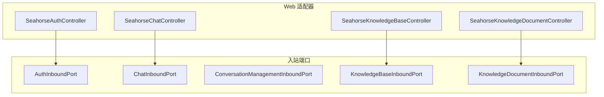
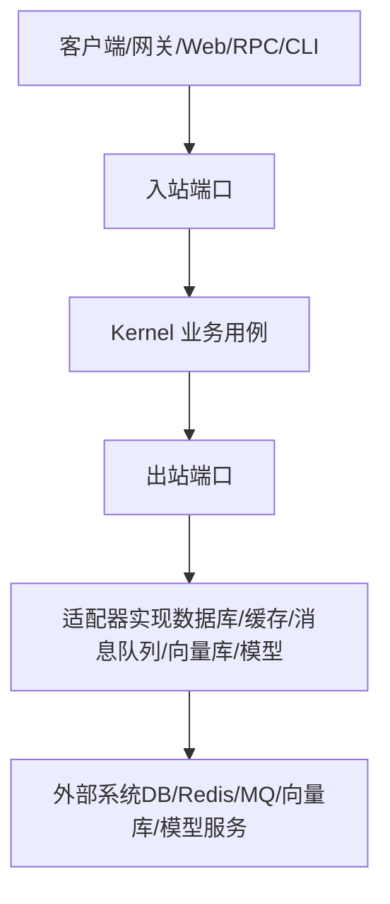
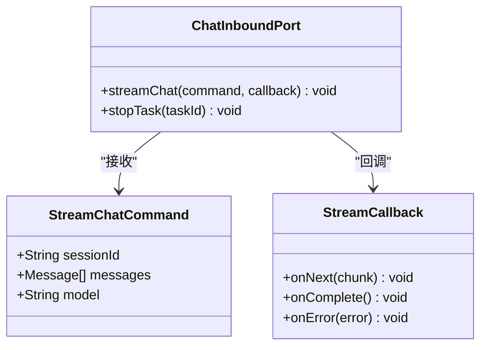
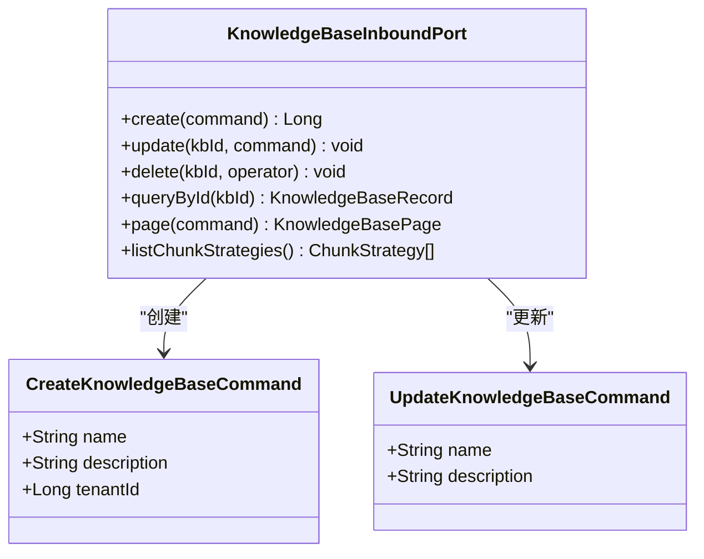
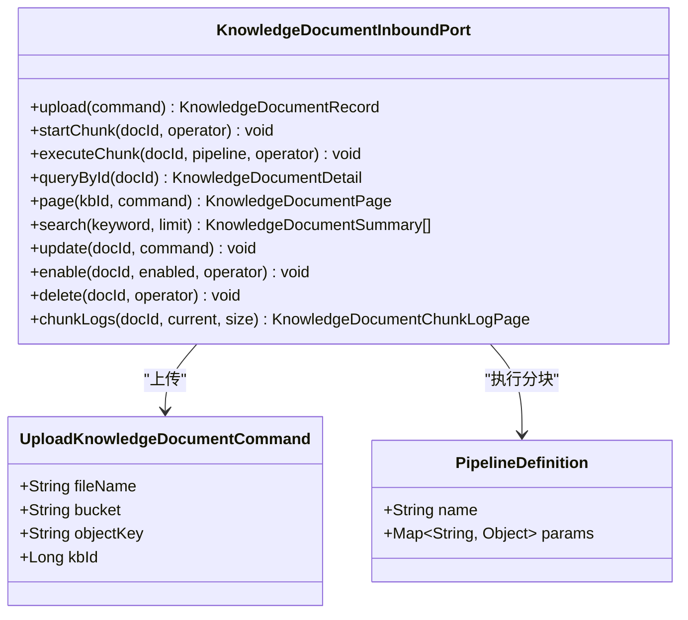
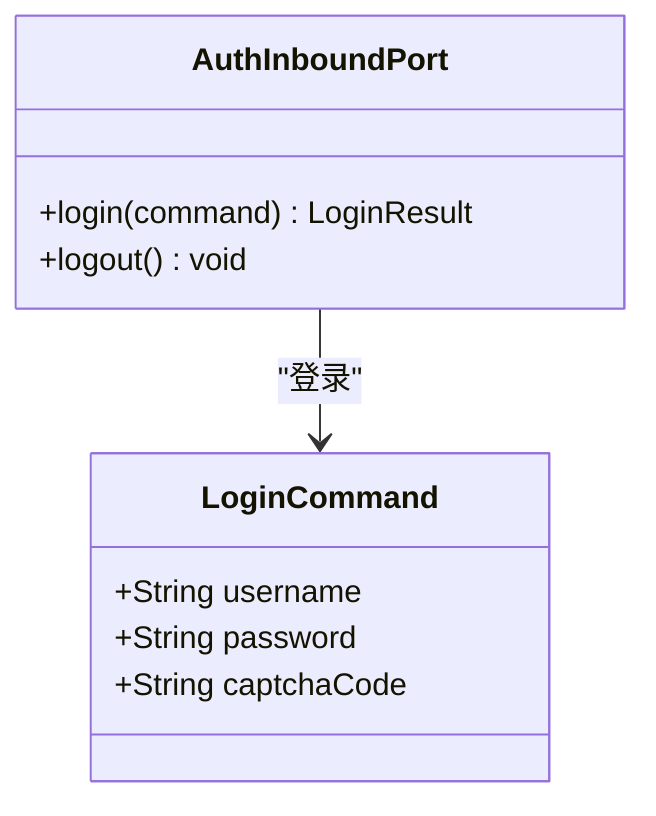
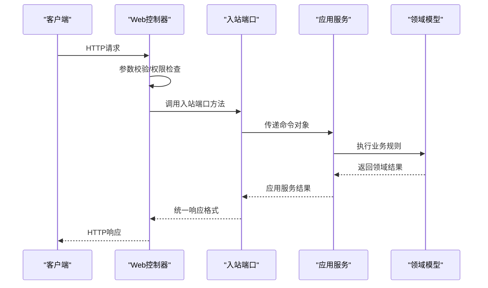
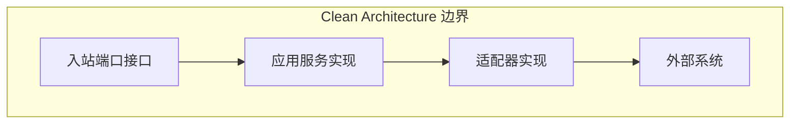

# 入站端口

<cite>
**本文引用的文件**
- [ChatInboundPort.java](file://seahorse-agent-kernel/src/main/java/com/miracle/ai/seahorse/agent/ports/inbound/chat/ChatInboundPort.java)
- [KnowledgeBaseInboundPort.java](file://seahorse-agent-kernel/src/main/java/com/miracle/ai/seahorse/agent/ports/inbound/knowledge/KnowledgeBaseInboundPort.java)
- [KnowledgeDocumentInboundPort.java](file://seahorse-agent-kernel/src/main/java/com/miracle/ai/seahorse/agent/ports/inbound/knowledge/KnowledgeDocumentInboundPort.java)
- [AuthInboundPort.java](file://seahorse-agent-kernel/src/main/java/com/miracle/ai/seahorse/agent/ports/inbound/auth/AuthInboundPort.java)
- [KernelChatInboundService.java](file://seahorse-agent-kernel/src/main/java/com/miracle/ai/seahorse/agent/kernel/application/chat/KernelChatInboundService.java)
- [KernelResearchInboundService.java](file://seahorse-agent-kernel/src/main/java/com/miracle/ai/seahorse/agent/kernel/application/agent/research/KernelResearchInboundService.java)
- [入站端口.md](file://docs/zh/content/后端系统/核心内核/端口接口/入站端口.md)
- [企业级可插拔RAG架构设计.md](file://docs/zh/content/架构设计/企业级可插拔RAG架构设计.md)
</cite>

## 目录
1. [引言](#引言)
2. [项目结构](#项目结构)
3. [核心组件](#核心组件)
4. [架构总览](#架构总览)
5. [详细组件分析](#详细组件分析)
6. [依赖分析](#依赖分析)
7. [性能考虑](#性能考虑)
8. [故障排查指南](#故障排查指南)
9. [结论](#结论)

## 引言
本文件聚焦于 Kernel 中的“入站端口”（Inbound Ports），系统性阐述其设计理念、命令对象设计、异常处理机制，以及与应用服务层的交互方式。入站端口作为领域驱动设计中的边界，隔离外部系统（如 Web 控制器、消息消费者、定时任务）对内核业务逻辑的直接侵入，统一通过命令对象与领域服务交互，确保业务规则集中在内核层，便于测试、演进与维护。

## 项目结构
入站端口位于 Kernel 模块的 ports.inbound 包下，按功能域划分：认证、聊天、会话管理、知识库与知识文档等。Web 适配器通过 Spring MVC 将 HTTP 请求转换为命令对象，并调用对应的入站端口方法，完成从协议到领域的解耦。

**图表来源**
- [入站端口.md:38-57](file://docs/zh/content/后端系统/核心内核/端口接口/入站端口.md#L38-L57)

**章节来源**
- [入站端口.md:32-57](file://docs/zh/content/后端系统/核心内核/端口接口/入站端口.md#L32-L57)

## 核心组件
- ChatInboundPort：问答入站端口，负责流式对话与任务取消。
- KnowledgeBaseInboundPort：知识库管理入站端口，负责知识库的增删改查与分页查询。
- KnowledgeDocumentInboundPort：知识库文档入站端口，负责文档上传、分块执行、查询与删除。
- AuthInboundPort：认证入站端口，负责登录与登出。

**章节来源**
- [ChatInboundPort.java:22-43](file://seahorse-agent-kernel/src/main/java/com/miracle/ai/seahorse/agent/ports/inbound/chat/ChatInboundPort.java#L22-L43)
- [KnowledgeBaseInboundPort.java:26-42](file://seahorse-agent-kernel/src/main/java/com/miracle/ai/seahorse/agent/ports/inbound/knowledge/KnowledgeBaseInboundPort.java#L26-L42)
- [KnowledgeDocumentInboundPort.java:29-121](file://seahorse-agent-kernel/src/main/java/com/miracle/ai/seahorse/agent/ports/inbound/knowledge/KnowledgeDocumentInboundPort.java#L29-L121)
- [AuthInboundPort.java:20-25](file://seahorse-agent-kernel/src/main/java/com/miracle/ai/seahorse/agent/ports/inbound/auth/AuthInboundPort.java#L20-L25)

## 架构总览
入站端口遵循整洁架构的“用例/内核”边界，入站端口负责协议转换，出站端口负责与外部系统交互。适配器模块通过实现这些端口接口，将具体实现注入到 Kernel。

**图表来源**
- [入站端口.md:88-95](file://docs/zh/content/后端系统/核心内核/端口接口/入站端口.md#L88-L95)

**章节来源**
- [入站端口.md:85-95](file://docs/zh/content/后端系统/核心内核/端口接口/入站端口.md#L85-L95)

## 详细组件分析

### ChatInboundPort 分析
ChatInboundPort 定义了流式问答与任务取消两个核心方法，采用命令对象封装请求参数，回调函数处理流式输出。

**图表来源**
- [ChatInboundPort.java:27-43](file://seahorse-agent-kernel/src/main/java/com/miracle/ai/seahorse/agent/ports/inbound/chat/ChatInboundPort.java#L27-L43)

**章节来源**
- [ChatInboundPort.java:22-43](file://seahorse-agent-kernel/src/main/java/com/miracle/ai/seahorse/agent/ports/inbound/chat/ChatInboundPort.java#L22-L43)

### KnowledgeBaseInboundPort 分析
KnowledgeBaseInboundPort 提供知识库的完整 CRUD 能力，包含分页查询与分块策略列表获取。

**图表来源**
- [KnowledgeBaseInboundPort.java:29-42](file://seahorse-agent-kernel/src/main/java/com/miracle/ai/seahorse/agent/ports/inbound/knowledge/KnowledgeBaseInboundPort.java#L29-L42)

**章节来源**
- [KnowledgeBaseInboundPort.java:26-42](file://seahorse-agent-kernel/src/main/java/com/miracle/ai/seahorse/agent/ports/inbound/knowledge/KnowledgeBaseInboundPort.java#L26-L42)

### KnowledgeDocumentInboundPort 分析
KnowledgeDocumentInboundPort 支持文档上传、分块执行、查询、搜索、启用禁用与删除等操作，并提供分块执行日志查询。

**图表来源**
- [KnowledgeDocumentInboundPort.java:34-121](file://seahorse-agent-kernel/src/main/java/com/miracle/ai/seahorse/agent/ports/inbound/knowledge/KnowledgeDocumentInboundPort.java#L34-L121)

**章节来源**
- [KnowledgeDocumentInboundPort.java:29-121](file://seahorse-agent-kernel/src/main/java/com/miracle/ai/seahorse/agent/ports/inbound/knowledge/KnowledgeDocumentInboundPort.java#L29-L121)

### AuthInboundPort 分析
AuthInboundPort 提供登录与登出功能，采用命令对象封装认证参数。

**图表来源**
- [AuthInboundPort.java:20-25](file://seahorse-agent-kernel/src/main/java/com/miracle/ai/seahorse/agent/ports/inbound/auth/AuthInboundPort.java#L20-L25)

**章节来源**
- [AuthInboundPort.java:20-25](file://seahorse-agent-kernel/src/main/java/com/miracle/ai/seahorse/agent/ports/inbound/auth/AuthInboundPort.java#L20-L25)

### 应用服务协作模式
入站端口与应用服务的协作遵循 Clean Architecture 的依赖倒置原则：外部系统仅依赖抽象接口，应用服务实现业务用例编排。

**图表来源**
- [入站端口.md:88-95](file://docs/zh/content/后端系统/核心内核/端口接口/入站端口.md#L88-L95)

## 依赖分析
入站端口设计遵循以下原则：
- 单一职责：每个端口专注于特定业务域，避免职责扩散
- 接口隔离：方法粒度细，按用例需求提供最小接口集
- 依赖倒置：外部系统依赖抽象接口，不依赖具体实现

**图表来源**
- [企业级可插拔RAG架构设计.md:142-187](file://docs/zh/content/架构设计/企业级可插拔RAG架构设计.md#L142-L187)

**章节来源**
- [企业级可插拔RAG架构设计.md:142-187](file://docs/zh/content/架构设计/企业级可插拔RAG架构设计.md#L142-L187)

## 性能考虑
- 流式处理：聊天场景采用流式回调，减少内存占用
- 分页查询：知识库与文档查询支持分页，避免大数据量传输
- 异步执行：文档分块执行通过消息队列异步化，提升吞吐量
- 缓存策略：合理利用缓存端口，减少重复计算

## 故障排查指南
- 参数校验失败：检查命令对象字段完整性与类型匹配
- 权限不足：确认认证状态与资源访问权限
- 资源不存在：验证ID有效性与租户隔离
- 并发冲突：检查分布式锁与乐观锁机制
- 外部依赖异常：监控适配器健康状态与重试策略

## 结论
入站端口作为 Clean Architecture 的关键边界，有效隔离了外部系统与内核业务逻辑，通过命令对象与回调机制实现了协议转换与业务编排的解耦。遵循单一职责、接口隔离与依赖倒置的设计原则，确保了系统的可维护性与可扩展性。建议在实际实现中重点关注参数校验、异常处理与性能优化，以提供稳定可靠的业务服务能力。