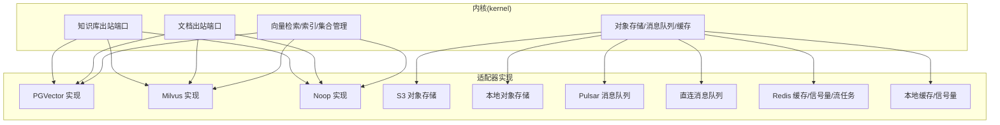
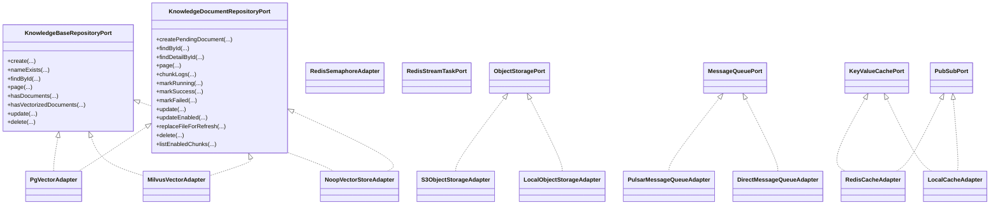
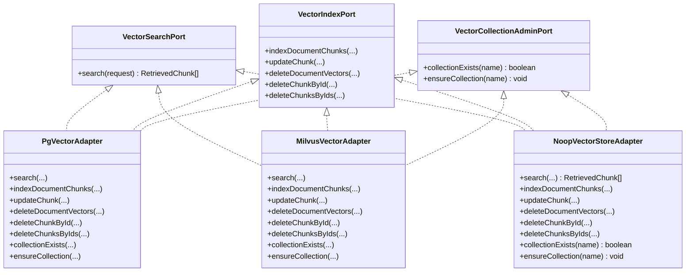
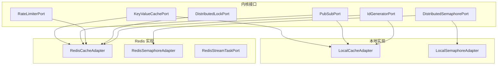
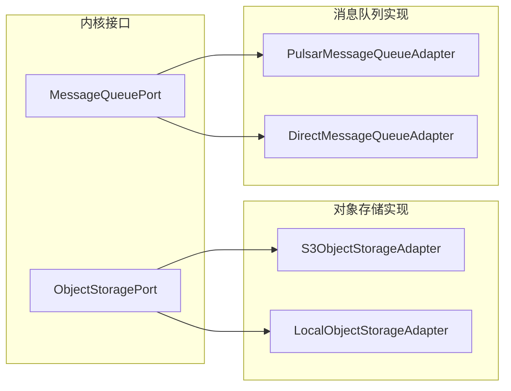
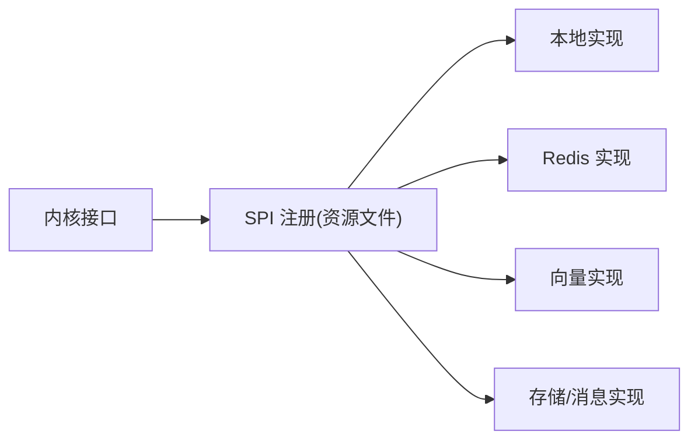

# 出站端口

<cite>
**本文引用的文件**
- [出站端口.md](file://docs/zh/content/后端系统/核心内核/端口接口/出站端口/出站端口.md)
- [缓存出站端口.md](file://docs/zh/content/后端系统/核心内核/端口接口/出站端口/缓存出站端口.md)
- [向量出站端口.md](file://docs/zh/content/后端系统/核心内核/端口接口/出站端口/向量出站端口.md)
- [端口接口.md](file://docs/zh/content/后端系统/核心内核/端口接口/端口接口.md)
- [KnowledgeBaseRepositoryPort.java](file://seahorse-agent-kernel/src/main/java/com/miracle/ai/seahorse/agent/ports/outbound/knowledge/KnowledgeBaseRepositoryPort.java)
- [KnowledgeDocumentRepositoryPort.java](file://seahorse-agent-kernel/src/main/java/com/miracle/ai/seahorse/agent/ports/outbound/knowledge/KnowledgeDocumentRepositoryPort.java)
- [VectorSearchPort.java](file://seahorse-agent-kernel/src/main/java/com/miracle/ai/seahorse/agent/ports/outbound/vector/VectorSearchPort.java)
- [VectorIndexPort.java](file://seahorse-agent-kernel/src/main/java/com/miracle/ai/seahorse/agent/ports/outbound/vector/VectorIndexPort.java)
- [VectorCollectionAdminPort.java](file://seahorse-agent-kernel/src/main/java/com/miracle/ai/seahorse/agent/ports/outbound/vector/VectorCollectionAdminPort.java)
- [ObjectStoragePort.java](file://seahorse-agent-kernel/src/main/java/com/miracle/ai/seahorse/agent/ports/outbound/storage/ObjectStoragePort.java)
- [MessageQueuePort.java](file://seahorse-agent-kernel/src/main/java/com/miracle/ai/seahorse/agent/ports/outbound/mq/MessageQueuePort.java)
- [KeyValueCachePort.java](file://seahorse-agent-kernel/src/main/java/com/miracle/ai/seahorse/agent/ports/outbound/cache/KeyValueCachePort.java)
- [PubSubPort.java](file://seahorse-agent-kernel/src/main/java/com/miracle/ai/seahorse/agent/ports/outbound/cache/PubSubPort.java)
- [DistributedLockPort.java](file://seahorse-agent-kernel/src/main/java/com/miracle/ai/seahorse/agent/ports/outbound/coordination/DistributedLockPort.java)
- [DistributedSemaphorePort.java](file://seahorse-agent-kernel/src/main/java/com/miracle/ai/seahorse/agent/ports/outbound/coordination/DistributedSemaphorePort.java)
- [IdGeneratorPort.java](file://seahorse-agent-kernel/src/main/java/com/miracle/ai/seahorse/agent/ports/outbound/id/IdGeneratorPort.java)
- [LocalCacheAdapter.java](file://seahorse-agent-adapter-cache-local/src/main/java/com/miracle/ai/seahorse/agent/adapters/cache/local/LocalCacheAdapter.java)
- [RedisCacheAdapter.java](file://seahorse-agent-adapter-cache-redis/src/main/java/com/miracle/ai/seahorse/agent/adapters/cache/redis/RedisCacheAdapter.java)
- [RedisSemaphoreAdapter.java](file://seahorse-agent-adapter-cache-redis/src/main/java/com/miracle/ai/seahorse/agent/adapters/cache/redis/RedisSemaphoreAdapter.java)
- [RedisStreamTaskPort.java](file://seahorse-agent-adapter-cache-redis/src/main/java/com/miracle/ai/seahorse/agent/adapters/cache/redis/RedisStreamTaskPort.java)
- [PgVectorAdapter.java](file://seahorse-agent-adapter-vector-pgvector/src/main/java/com/miracle/ai/seahorse/agent/adapters/vector/pgvector/PgVectorAdapter.java)
- [MilvusVectorAdapter.java](file://seahorse-agent-adapter-vector-milvus/src/main/java/com/miracle/ai/seahorse/agent/adapters/vector/milvus/MilvusVectorAdapter.java)
- [NoopVectorStoreAdapter.java](file://seahorse-agent-adapter-vector-noop/src/main/java/com/miracle/ai/seahorse/agent/adapters/vector/noop/NoopVectorStoreAdapter.java)
- [S3ObjectStorageAdapter.java](file://seahorse-agent-adapter-storage-s3/src/main/java/com/miracle/ai/seahorse/agent/adapters/storage/s3/S3ObjectStorageAdapter.java)
- [LocalObjectStorageAdapter.java](file://seahorse-agent-adapter-storage-local/src/main/java/com/miracle/ai/seahorse/agent/adapters/storage/local/LocalObjectStorageAdapter.java)
- [PulsarMessageQueueAdapter.java](file://seahorse-agent-adapter-mq-pulsar/src/main/java/com/miracle/ai/seahorse/agent/adapters/mq/pulsar/PulsarMessageQueueAdapter.java)
- [DirectMessageQueueAdapter.java](file://seahorse-agent-adapter-mq-direct/src/main/java/com/miracle/ai/seahorse/agent/adapters/mq/direct/DirectMessageQueueAdapter.java)
- [SeahorseAgentKernelAutoConfigurationTests.java](file://seahorse-agent-tests/src/test/java/com/miracle/ai/seahorse/agent/adapters/spring/SeahorseAgentKernelAutoConfigurationTests.java)
- [IndexerNodeFeatureTests.java](file://seahorse-agent-tests/src/test/java/com/miracle/ai/seahorse/agent/kernel/feature/ingestion/IndexerNodeFeatureTests.java)
- [KernelKnowledgeDocumentServiceTests.java](file://seahorse-agent-tests/src/test/java/com/miracle/ai/seahorse/agent/kernel/application/knowledge/KernelKnowledgeDocumentServiceTests.java)
</cite>

## 目录
1. [引言](#引言)
2. [项目结构](#项目结构)
3. [核心组件](#核心组件)
4. [架构总览](#架构总览)
5. [详细组件分析](#详细组件分析)
6. [依赖分析](#依赖分析)
7. [性能考虑](#性能考虑)
8. [故障排查指南](#故障排查指南)
9. [结论](#结论)
10. [附录](#附录)

## 引言
本文件系统性阐述 Clean Architecture 中“出站端口”（Outbound Ports）的作用与实现方式，重点说明应用服务如何通过出站端口与外部系统（数据库、消息队列、缓存、对象存储、向量数据库等）解耦。出站端口作为应用层与基础设施层之间的抽象边界，定义了应用服务对外部系统的依赖契约，确保：
- 接口稳定：应用层不随外部系统变化而频繁调整
- 版本兼容：通过接口演进与适配器替换实现平滑升级
- 替换灵活：同一接口可绑定不同适配器，支持动态切换与灰度发布

## 项目结构
本项目采用“内核接口 + 多实现适配器”的分层设计：
- kernel 模块：定义所有出站端口接口与数据模型，隔离业务逻辑与外部系统差异
- adapter-* 模块：提供具体实现，覆盖缓存（本地/Redis）、消息队列（Pulsar/直连）、对象存储（S3/本地）、向量数据库（Milvus/pgvector/noop）等
- 配置机制：通过资源目录下的 SPI 注册文件声明默认实现，运行时按需加载

**图表来源**
- [出站端口.md](file://docs/zh/content/后端系统/核心内核/端口接口/出站端口/出站端口.md)
- [缓存出站端口.md](file://docs/zh/content/后端系统/核心内核/端口接口/出站端口/缓存出站端口.md)
- [向量出站端口.md](file://docs/zh/content/后端系统/核心内核/端口接口/出站端口/向量出站端口.md)

**章节来源**
- [出站端口.md](file://docs/zh/content/后端系统/核心内核/端口接口/出站端口/出站端口.md)
- [缓存出站端口.md](file://docs/zh/content/后端系统/核心内核/端口接口/出站端口/缓存出站端口.md)
- [向量出站端口.md](file://docs/zh/content/后端系统/核心内核/端口接口/出站端口/向量出站端口.md)

## 核心组件
本节概述各类出站端口的职责、输入输出与典型使用场景，便于快速定位与选用。

- 认证与用户出站端口
  - CurrentUserPort：获取当前用户上下文，提供便捷方法
  - UserRepositoryPort：用户实体的增删改查、分页与唯一性校验
- 缓存出站端口
  - KeyValueCachePort：字符串键值缓存的 get/set/delete
  - PubSubPort：发布订阅抽象，支持订阅返回可关闭句柄
  - RateLimiterPort：统一限流判定
  - DistributedLockPort：分布式互斥
  - DistributedSemaphorePort：分布式信号量
  - IdGeneratorPort：命名空间 ID 生成
- 聊天与意图出站端口
  - ConversationMemoryPort：加载历史并追加消息，支持默认空实现
  - IntentGuidancePort：歧义检测与引导决策
- 知识库与文档出站端口
  - KnowledgeBaseRepositoryPort：知识库的创建、查询、分页、更新、删除与状态检查
  - KnowledgeDocumentRepositoryPort：文档的创建、查询、分页、状态流转、启用/禁用、删除与分块列表
- 内存出站端口
  - LongTermMemoryPort、WorkingMemoryPort：长期/工作记忆的存储抽象
- 模型出站端口
  - ChatModelPort：非流式对话，支持便捷重载
  - EmbeddingModelPort：文本向量化
- 向量出站端口
  - VectorSearchPort：向量检索
  - VectorIndexPort：向量索引的批量/单条写入、更新与删除
  - VectorCollectionAdminPort：集合存在性检查与确保创建
- 存储与消息队列出站端口
  - ObjectStoragePort：对象存储上传、可靠上传、打开流、按 URL 删除
  - MessageQueuePort：消息发送抽象（适配器提供具体实现）

**章节来源**
- [出站端口.md](file://docs/zh/content/后端系统/核心内核/端口接口/出站端口/出站端口.md)
- [端口接口.md](file://docs/zh/content/后端系统/核心内核/端口接口/端口接口.md)

## 架构总览
下图展示了内核端口与适配器之间的绑定关系，以及默认实现的选择策略（通过 SPI 注册与资源文件配置）。

```mermaid
graph TB
subgraph "内核接口"
IF1["KnowledgeBaseRepositoryPort"]
IF2["KnowledgeDocumentRepositoryPort"]
IF3["VectorSearchPort"]
IF4["VectorIndexPort"]
IF5["VectorCollectionAdminPort"]
IF6["ObjectStoragePort"]
IF7["MessageQueuePort"]
IF8["KeyValueCachePort"]
IF9["PubSubPort"]
end
subgraph "PGVector 实现"
PG1["PgVectorAdapter"]
end
subgraph "Milvus 实现"
ML1["MilvusVectorAdapter"]
end
subgraph "Noop 实现"
NP1["NoopVectorStoreAdapter"]
end
subgraph "对象存储实现"
S31["S3ObjectStorageAdapter"]
LO1["LocalObjectStorageAdapter"]
end
subgraph "消息队列实现"
PS1["PulsarMessageQueueAdapter"]
DC1["DirectMessageQueueAdapter"]
end
subgraph "缓存实现"
RC1["RedisCacheAdapter"]
RS1["RedisSemaphoreAdapter"]
RST1["RedisStreamTaskPort"]
LC1["LocalCacheAdapter"]
end
IF1 --> PG1
IF1 --> ML1
IF1 --> NP1
IF2 --> PG1
IF2 --> ML1
IF2 --> NP1
IF3 --> PG1
IF3 --> ML1
IF3 --> NP1
IF4 --> PG1
IF4 --> ML1
IF4 --> NP1
IF5 --> PG1
IF5 --> ML1
IF5 --> NP1
IF6 --> S31
IF6 --> LO1
IF7 --> PS1
IF7 --> DC1
IF8 --> RC1
IF8 --> LC1
IF9 --> RC1
IF9 --> LC1
```

**图表来源**
- [向量出站端口.md](file://docs/zh/content/后端系统/核心内核/端口接口/出站端口/向量出站端口.md)
- [缓存出站端口.md](file://docs/zh/content/后端系统/核心内核/端口接口/出站端口/缓存出站端口.md)
- [出站端口.md](file://docs/zh/content/后端系统/核心内核/端口接口/出站端口/出站端口.md)

## 详细组件分析

### 知识库与文档出站端口
- 知识库仓库端口（KnowledgeBaseRepositoryPort）
  - 职责：知识库的创建、重名校验、查询、分页、状态检查、更新与删除
  - 典型方法：create、nameExists、findById、page、hasDocuments、hasVectorizedDocuments、update、delete
  - 使用场景：知识库生命周期管理、状态检查
  - 异常处理：查询不存在返回空；删除/更新失败返回布尔值
- 文档仓库端口（KnowledgeDocumentRepositoryPort）
  - 职责：文档的创建、查询、分页、状态流转、启用/禁用、删除、分块列表
  - 典型方法：createPendingDocument、findById、findDetailById、page、chunkLogs、markRunning/markSuccess/markFailed、update/updateEnabled、replaceFileForRefresh、delete、listEnabledChunks
  - 使用场景：文档入库、状态机推进、分块日志查询、启用/禁用与删除
  - 异常处理：默认实现返回空或空集合；业务层需判断返回值

**图表来源**
- [KnowledgeBaseRepositoryPort.java](file://seahorse-agent-kernel/src/main/java/com/miracle/ai/seahorse/agent/ports/outbound/knowledge/KnowledgeBaseRepositoryPort.java)
- [KnowledgeDocumentRepositoryPort.java](file://seahorse-agent-kernel/src/main/java/com/miracle/ai/seahorse/agent/ports/outbound/knowledge/KnowledgeDocumentRepositoryPort.java)
- [VectorSearchPort.java](file://seahorse-agent-kernel/src/main/java/com/miracle/ai/seahorse/agent/ports/outbound/vector/VectorSearchPort.java)
- [VectorIndexPort.java](file://seahorse-agent-kernel/src/main/java/com/miracle/ai/seahorse/agent/ports/outbound/vector/VectorIndexPort.java)
- [VectorCollectionAdminPort.java](file://seahorse-agent-kernel/src/main/java/com/miracle/ai/seahorse/agent/ports/outbound/vector/VectorCollectionAdminPort.java)
- [ObjectStoragePort.java](file://seahorse-agent-kernel/src/main/java/com/miracle/ai/seahorse/agent/ports/outbound/storage/ObjectStoragePort.java)
- [MessageQueuePort.java](file://seahorse-agent-kernel/src/main/java/com/miracle/ai/seahorse/agent/ports/outbound/mq/MessageQueuePort.java)
- [KeyValueCachePort.java](file://seahorse-agent-kernel/src/main/java/com/miracle/ai/seahorse/agent/ports/outbound/cache/KeyValueCachePort.java)
- [PubSubPort.java](file://seahorse-agent-kernel/src/main/java/com/miracle/ai/seahorse/agent/ports/outbound/cache/PubSubPort.java)

**章节来源**
- [出站端口.md](file://docs/zh/content/后端系统/核心内核/端口接口/出站端口/出站端口.md)

### 向量出站端口
- 向量检索端口（VectorSearchPort）
  - 职责：执行语义相似度搜索，返回检索到的文本片段及相似度分数
  - 请求模型：包含集合名、查询文本、查询向量、返回数量与过滤条件
- 向量索引端口（VectorIndexPort）
  - 职责：文档分片的批量写入、更新与删除，屏蔽底层向量存储实现细节
- 向量集合管理端口（VectorCollectionAdminPort）
  - 职责：集合（表）的存在性检查与确保创建，避免直接依赖具体 SDK 的管理 API

实现概览
- PGVector 实现：基于 PostgreSQL + pgvector，支持 HNSW 索引与余弦距离，提供批量写入、UPSERT、按 ID 删除等能力
- Milvus 实现：基于 Milvus 客户端 SDK，支持 HNSW 索引与多种度量类型，提供插入、更新、删除与检索
- Noop 实现：占位实现，写入仅记录集合存在性，检索返回空结果

**图表来源**
- [向量出站端口.md](file://docs/zh/content/后端系统/核心内核/端口接口/出站端口/向量出站端口.md)
- [VectorSearchPort.java](file://seahorse-agent-kernel/src/main/java/com/miracle/ai/seahorse/agent/ports/outbound/vector/VectorSearchPort.java)
- [VectorIndexPort.java](file://seahorse-agent-kernel/src/main/java/com/miracle/ai/seahorse/agent/ports/outbound/vector/VectorIndexPort.java)
- [VectorCollectionAdminPort.java](file://seahorse-agent-kernel/src/main/java/com/miracle/ai/seahorse/agent/ports/outbound/vector/VectorCollectionAdminPort.java)
- [PgVectorAdapter.java](file://seahorse-agent-adapter-vector-pgvector/src/main/java/com/miracle/ai/seahorse/agent/adapters/vector/pgvector/PgVectorAdapter.java)
- [MilvusVectorAdapter.java](file://seahorse-agent-adapter-vector-milvus/src/main/java/com/miracle/ai/seahorse/agent/adapters/vector/milvus/MilvusVectorAdapter.java)
- [NoopVectorStoreAdapter.java](file://seahorse-agent-adapter-vector-noop/src/main/java/com/miracle/ai/seahorse/agent/adapters/vector/noop/NoopVectorStoreAdapter.java)

**章节来源**
- [向量出站端口.md](file://docs/zh/content/后端系统/核心内核/端口接口/出站端口/向量出站端口.md)

### 缓存出站端口
- 键值缓存端口（KeyValueCachePort）
  - 职责：提供字符串键值的读取、写入（带 TTL）与删除能力
  - 典型场景：会话状态、临时令牌、查询结果缓存
- 发布订阅端口（PubSubPort）
  - 职责：发布消息与订阅主题，支持自动关闭的订阅句柄
  - 典型场景：事件广播、跨服务通知、异步任务编排
- 统一限流端口（RateLimiterPort）
  - 职责：基于资源与主体的统一限流判定，返回是否允许、剩余许可与重试建议
  - 典型场景：API 限流、下游依赖保护、突发流量削峰
- 分布式锁端口（DistributedLockPort）
  - 职责：尝试获取锁并在持有期间提供解锁；提供空实现以兼容无分布式锁环境
  - 典型场景：分布式互斥、幂等执行、抢购/秒杀
- 分布式信号量端口（DistributedSemaphorePort）
  - 职责：按资源与持有者申请/释放许可，支持许可 TTL；提供空实现
  - 典型场景：并发池控制、共享资源配额、限速令牌桶扩展
- ID 生成器端口（IdGeneratorPort）
  - 职责：为指定命名空间生成单调递增 ID，支持分布式唯一性
  - 典型场景：订单号、任务 ID、日志追踪 ID

实现概览
- 本地实现：LocalCacheAdapter、LocalSemaphoreAdapter
- Redis 实现：RedisCacheAdapter、RedisSemaphoreAdapter、RedisStreamTaskPort

**图表来源**
- [缓存出站端口.md](file://docs/zh/content/后端系统/核心内核/端口接口/出站端口/缓存出站端口.md)
- [KeyValueCachePort.java](file://seahorse-agent-kernel/src/main/java/com/miracle/ai/seahorse/agent/ports/outbound/cache/KeyValueCachePort.java)
- [PubSubPort.java](file://seahorse-agent-kernel/src/main/java/com/miracle/ai/seahorse/agent/ports/outbound/cache/PubSubPort.java)
- [DistributedLockPort.java](file://seahorse-agent-kernel/src/main/java/com/miracle/ai/seahorse/agent/ports/outbound/coordination/DistributedLockPort.java)
- [DistributedSemaphorePort.java](file://seahorse-agent-kernel/src/main/java/com/miracle/ai/seahorse/agent/ports/outbound/coordination/DistributedSemaphorePort.java)
- [IdGeneratorPort.java](file://seahorse-agent-kernel/src/main/java/com/miracle/ai/seahorse/agent/ports/outbound/id/IdGeneratorPort.java)
- [LocalCacheAdapter.java](file://seahorse-agent-adapter-cache-local/src/main/java/com/miracle/ai/seahorse/agent/adapters/cache/local/LocalCacheAdapter.java)
- [RedisCacheAdapter.java](file://seahorse-agent-adapter-cache-redis/src/main/java/com/miracle/ai/seahorse/agent/adapters/cache/redis/RedisCacheAdapter.java)
- [RedisSemaphoreAdapter.java](file://seahorse-agent-adapter-cache-redis/src/main/java/com/miracle/ai/seahorse/agent/adapters/cache/redis/RedisSemaphoreAdapter.java)
- [RedisStreamTaskPort.java](file://seahorse-agent-adapter-cache-redis/src/main/java/com/miracle/ai/seahorse/agent/adapters/cache/redis/RedisStreamTaskPort.java)

**章节来源**
- [缓存出站端口.md](file://docs/zh/content/后端系统/核心内核/端口接口/出站端口/缓存出站端口.md)

### 对象存储与消息队列出站端口
- 对象存储端口（ObjectStoragePort）
  - 职责：对象存储上传、可靠上传、打开流、按 URL 删除
  - 实现：S3ObjectStorageAdapter（云端）、LocalObjectStorageAdapter（本地）
- 消息队列端口（MessageQueuePort）
  - 职责：消息发送抽象（适配器提供具体实现）
  - 实现：PulsarMessageQueueAdapter（生产者）、DirectMessageQueueAdapter（直连）

**图表来源**
- [ObjectStoragePort.java](file://seahorse-agent-kernel/src/main/java/com/miracle/ai/seahorse/agent/ports/outbound/storage/ObjectStoragePort.java)
- [MessageQueuePort.java](file://seahorse-agent-kernel/src/main/java/com/miracle/ai/seahorse/agent/ports/outbound/mq/MessageQueuePort.java)
- [S3ObjectStorageAdapter.java](file://seahorse-agent-adapter-storage-s3/src/main/java/com/miracle/ai/seahorse/agent/adapters/storage/s3/S3ObjectStorageAdapter.java)
- [LocalObjectStorageAdapter.java](file://seahorse-agent-adapter-storage-local/src/main/java/com/miracle/ai/seahorse/agent/adapters/storage/local/LocalObjectStorageAdapter.java)
- [PulsarMessageQueueAdapter.java](file://seahorse-agent-adapter-mq-pulsar/src/main/java/com/miracle/ai/seahorse/agent/adapters/mq/pulsar/PulsarMessageQueueAdapter.java)
- [DirectMessageQueueAdapter.java](file://seahorse-agent-adapter-mq-direct/src/main/java/com/miracle/ai/seahorse/agent/adapters/mq/direct/DirectMessageQueueAdapter.java)

**章节来源**
- [出站端口.md](file://docs/zh/content/后端系统/核心内核/端口接口/出站端口/出站端口.md)

## 依赖分析
- 接口与实现解耦
  - 内核仅定义端口接口，具体实现通过 SPI 与资源文件注入，降低耦合度
- 适配器分布
  - 本地适配器：LocalCacheAdapter、LocalSemaphoreAdapter、LocalObjectStorageAdapter
  - Redis 适配器：RedisCacheAdapter、RedisSemaphoreAdapter、RedisStreamTaskPort
  - 向量适配器：PgVectorAdapter、MilvusVectorAdapter、NoopVectorStoreAdapter
  - 存储与消息队列适配器：S3ObjectStorageAdapter、PulsarMessageQueueAdapter、DirectMessageQueueAdapter
- 配置映射
  - 各端口在对应适配器模块的资源目录中声明 SPI 映射文件，确保运行时正确加载

**图表来源**
- [缓存出站端口.md](file://docs/zh/content/后端系统/核心内核/端口接口/出站端口/缓存出站端口.md)
- [向量出站端口.md](file://docs/zh/content/后端系统/核心内核/端口接口/出站端口/向量出站端口.md)
- [出站端口.md](file://docs/zh/content/后端系统/核心内核/端口接口/出站端口/出站端口.md)

**章节来源**
- [缓存出站端口.md](file://docs/zh/content/后端系统/核心内核/端口接口/出站端口/缓存出站端口.md)
- [向量出站端口.md](file://docs/zh/content/后端系统/核心内核/端口接口/出站端口/向量出站端口.md)
- [出站端口.md](file://docs/zh/content/后端系统/核心内核/端口接口/出站端口/出站端口.md)

## 性能考虑
- 接口稳定性与版本兼容
  - 通过稳定的端口契约与数据模型，避免因外部系统升级导致的业务层重构
  - 适配器层承担版本差异与迁移成本，业务层保持不变
- 替换灵活性
  - 同一接口可绑定多个适配器，支持按环境/功能开关动态切换
  - 通过测试桩与占位实现（如 NoopVectorStoreAdapter）验证业务流程
- 可观测性与可观测端口
  - ObservationPort 抽象指标与追踪上报，适配器提供具体实现
- 并发与限流
  - RateLimiterPort 提供统一限流策略，避免下游过载
  - DistributedSemaphorePort 支持并发池控制与资源配额

## 故障排查指南
- 端口未加载或实现缺失
  - 检查对应适配器模块的 SPI 注册文件是否存在且路径正确
  - 确认运行时类路径包含适配器依赖
- 向量检索异常
  - 验证集合存在性与索引配置（维度、度量类型、索引参数）
  - 检查查询向量维度与存储一致
- 缓存/分布式锁问题
  - 确认 Redis 连接与权限配置
  - 检查 TTL 设置与过期策略
- 对象存储/消息队列异常
  - 核对凭证与网络连通性
  - 查看适配器日志与错误码映射

## 结论
出站端口是 Clean Architecture 在本项目中的关键抽象，它将应用层与外部系统解耦，使系统具备更强的稳定性、可维护性与可扩展性。通过明确的接口契约、多实现适配器与 SPI 配置机制，团队可以在不改变业务逻辑的前提下灵活替换与扩展外部依赖，满足不同环境与场景的需求。

## 附录
- 测试参考
  - 自动配置测试：验证端口绑定与默认实现加载
  - 功能测试：记录端口调用轨迹，验证行为一致性
  - 应用层测试：通过静态桩实现知识库查询与文档仓库，验证业务流程

**章节来源**
- [SeahorseAgentKernelAutoConfigurationTests.java](file://seahorse-agent-tests/src/test/java/com/miracle/ai/seahorse/agent/adapters/spring/SeahorseAgentKernelAutoConfigurationTests.java)
- [IndexerNodeFeatureTests.java](file://seahorse-agent-tests/src/test/java/com/miracle/ai/seahorse/agent/kernel/feature/ingestion/IndexerNodeFeatureTests.java)
- [KernelKnowledgeDocumentServiceTests.java](file://seahorse-agent-tests/src/test/java/com/miracle/ai/seahorse/agent/kernel/application/knowledge/KernelKnowledgeDocumentServiceTests.java)