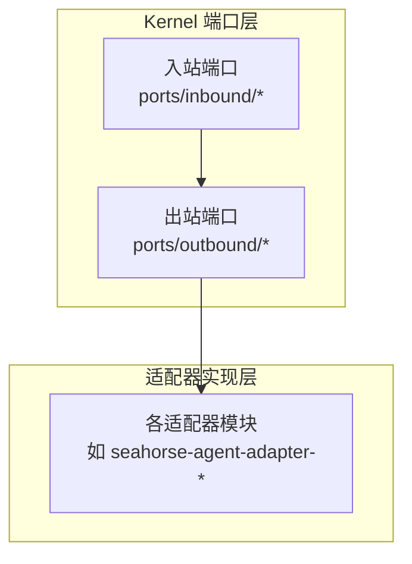
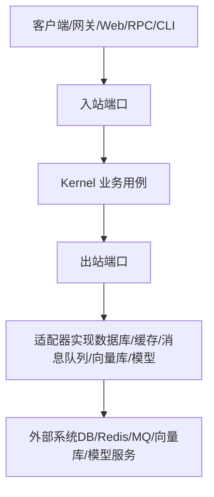
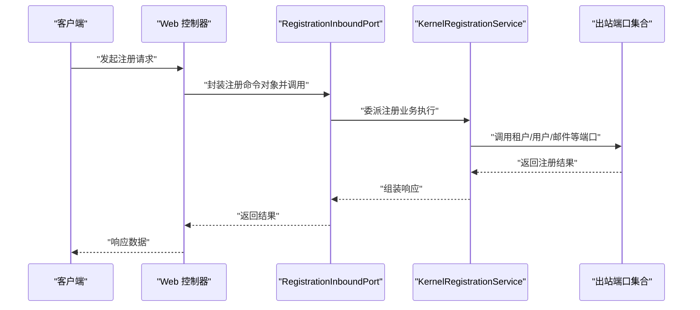
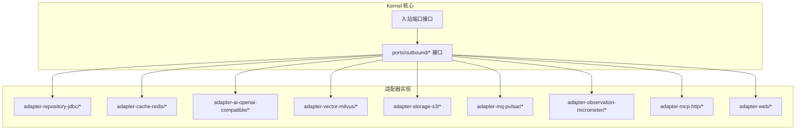

# 端口接口

<cite>
**本文引用的文件**
- [ChatInboundPort.java](file://seahorse-agent-kernel/src/main/java/com/miracle/ai/seahorse/agent/ports/inbound/chat/ChatInboundPort.java)
- [ConversationMemoryPort.java](file://seahorse-agent-kernel/src/main/java/com/miracle/ai/seahorse/agent/ports/outbound/chat/ConversationMemoryPort.java)
- [UserRepositoryPort.java](file://seahorse-agent-kernel/src/main/java/com/miracle/ai/seahorse/agent/ports/outbound/auth/UserRepositoryPort.java)
- [KnowledgeBaseRepositoryPort.java](file://seahorse-agent-kernel/src/main/java/com/miracle/ai/seahorse/agent/ports/outbound/knowledge/KnowledgeBaseRepositoryPort.java)
- [KnowledgeDocumentRepositoryPort.java](file://seahorse-agent-kernel/src/main/java/com/miracle/ai/seahorse/agent/ports/outbound/knowledge/KnowledgeDocumentRepositoryPort.java)
- [KeyValueCachePort.java](file://seahorse-agent-kernel/src/main/java/com/miracle/ai/seahorse/agent/ports/outbound/cache/KeyValueCachePort.java)
- [PubSubPort.java](file://seahorse-agent-kernel/src/main/java/com/miracle/ai/seahorse/agent/ports/outbound/cache/PubSubPort.java)
- [MessageQueuePort.java](file://seahorse-agent-kernel/src/main/java/com/miracle/ai/seahorse/agent/ports/outbound/mq/MessageQueuePort.java)
- [VectorSearchPort.java](file://seahorse-agent-kernel/src/main/java/com/miracle/ai/seahorse/agent/ports/outbound/vector/VectorSearchPort.java)
- [VectorIndexPort.java](file://seahorse-agent-kernel/src/main/java/com/miracle/ai/seahorse/agent/ports/outbound/vector/VectorIndexPort.java)
- [ChatModelPort.java](file://seahorse-agent-kernel/src/main/java/com/miracle/ai/seahorse/agent/ports/outbound/model/ChatModelPort.java)
- [EmbeddingModelPort.java](file://seahorse-agent-kernel/src/main/java/com/miracle/ai/seahorse/agent/ports/outbound/model/EmbeddingModelPort.java)
- [ObjectStoragePort.java](file://seahorse-agent-kernel/src/main/java/com/miracle/ai/seahorse/agent/ports/outbound/storage/ObjectStoragePort.java)
- [ObservationPort.java](file://seahorse-agent-kernel/src/main/java/com/miracle/ai/seahorse/agent/ports/outbound/observation/ObservationPort.java)
- [McpToolRegistryPort.java](file://seahorse-agent-kernel/src/main/java/com/miracle/ai/seahorse/agent/ports/outbound/mcp/McpToolRegistryPort.java)
- [McpParameterExtractionPort.java](file://seahorse-agent-kernel/src/main/java/com/miracle/ai/seahorse/agent/ports/outbound/mcp/McpParameterExtractionPort.java)
- [入站端口.md](file://docs/zh/content/后端系统/核心内核/端口接口/入站端口.md)
- [端口接口.md](file://docs/zh/content/后端系统/核心内核/端口接口/端口接口.md)
- [出站端口.md](file://docs/zh/content/后端系统/核心内核/端口接口/出站端口/出站端口.md)
- [Clean Architecture 模式.md](file://docs/zh/content/架构设计/Clean Architecture 模式.md)
- [RegistrationInboundPort.java](file://seahorse-agent-kernel/src/main/java/com/miracle/ai/seahorse/agent/ports/inbound/auth/RegistrationInboundPort.java)
- [TenantProvisioningPort.java](file://seahorse-agent-kernel/src/main/java/com/miracle/ai/seahorse/agent/ports/outbound/tenant/TenantProvisioningPort.java)
- [AccessDecisionQueryInboundPort.java](file://seahorse-agent-kernel/src/main/java/com/miracle/ai/seahorse/agent/ports/inbound/agent/AccessDecisionQueryInboundPort.java)
- [AgentArtifactQueryInboundPort.java](file://seahorse-agent-kernel/src/main/java/com/miracle/ai/seahorse/agent/ports/inbound/agent/AgentArtifactQueryInboundPort.java)
- [AgentDefinitionInboundPort.java](file://seahorse-agent-kernel/src/main/java/com/miracle/ai/seahorse/agent/ports/inbound/agent/AgentDefinitionInboundPort.java)
- [AgentRunInboundPort.java](file://seahorse-agent-kernel/src/main/java/com/miracle/ai/seahorse/agent/ports/inbound/agent/AgentRunInboundPort.java)
- [ApprovalManagementInboundPort.java](file://seahorse-agent-kernel/src/main/java/com/miracle/ai/seahorse/agent/ports/inbound/agent/ApprovalManagementInboundPort.java)
- [AuditQueryInboundPort.java](file://seahorse-agent-kernel/src/main/java/com/miracle/ai/seahorse/agent/ports/inbound/agent/AuditQueryInboundPort.java)
- [AgentRunWorkflowInboundPort.java](file://seahorse-agent-kernel/src/main/java/com/miracle/ai/seahorse/agent/ports/inbound/agent/AgentRunWorkflowInboundPort.java)
- [EvalCandidateRepositoryPort.java](file://seahorse-agent-kernel/src/main/java/com/miracle/ai/seahorse/agent/kernel/application/agent/eval/EvalCandidateRepositoryPort.java)
- [EvalDatasetRepositoryPort.java](file://seahorse-agent-kernel/src/main/java/com/miracle/ai/seahorse/agent/kernel/application/agent/eval/EvalDatasetRepositoryPort.java)
- [EvalDatasetQueryPort.java](file://seahorse-agent-kernel/src/main/java/com/miracle/ai/seahorse/agent/kernel/application/agent/eval/EvalDatasetQueryPort.java)
- [ChatStreamCallbackFactoryPort.java](file://seahorse-agent-adapter-web/src/main/java/com/miracle/ai/seahorse/agent/adapters/web/ChatStreamCallbackFactoryPort.java)
</cite>

## 更新摘要
**所做更改**
- 新增知识库版本管理相关端口接口说明
- 新增权限与访问控制相关端口接口说明
- 新增代理市场与模板管理相关端口接口说明
- 新增管理员与审计日志相关端口接口说明
- 新增工作流可视化相关端口接口说明
- 更新出站端口分类体系，涵盖更多业务领域
- 完善端口接口命名规范与设计原则

## 目录
1. [引言](#引言)
2. [项目结构](#项目结构)
3. [核心组件](#核心组件)
4. [架构总览](#架构总览)
5. [详细组件分析](#详细组件分析)
6. [依赖分析](#依赖分析)
7. [性能考虑](#性能考虑)
8. [故障排查指南](#故障排查指南)
9. [结论](#结论)
10. [附录](#附录)

## 引言
本文件系统性梳理 Kernel 中的"端口接口"设计与实现，重点覆盖入站端口（Inbound Port）与出站端口（Outbound Port）两类边界，阐述其在业务领域中的职责划分：以入站端口承接外部协议（HTTP/RPC/CLI），以出站端口抽象与隔离外部系统（数据库、缓存、消息队列、向量库、模型服务等）。同时，结合适配器模式，说明如何通过不同实现替换外部依赖，实现业务逻辑与基础设施的解耦。

**更新** 本次更新重点关注新增的知识库版本管理、权限控制、代理市场、管理员功能、审计日志和工作流可视化等出站端口接口，完善了端口接口的完整性和实用性。

## 项目结构
Kernel 的端口接口位于 ports 目录下，按"入站/出站 + 领域"进行组织：
- 入站端口：ports/inbound 下按业务域划分，如 chat、auth、knowledge、agent、workflow 等
- 出站端口：ports/outbound 下按业务域划分，如 chat、auth、knowledge、cache、mq、vector、model、tenant 等

**图表来源**
- [端口接口.md:38-49](file://docs/zh/content/后端系统/核心内核/端口接口/端口接口.md#L38-L49)

**章节来源**
- [端口接口.md:33-36](file://docs/zh/content/后端系统/核心内核/端口接口/端口接口.md#L33-L36)

## 核心组件
本节对本次目标涉及的关键端口进行逐项解析，说明其职责、输入输出与典型使用场景，并给出与适配器对接的建议。

### 入站端口新增组件

#### 权限与访问控制相关入站端口
- **RegistrationInboundPort**：用户自注册与邮箱验证入口，支持验证码生成与注册完成流程。
- **AccessDecisionQueryInboundPort**：访问决策查询入口，支持基于策略的权限验证与访问控制。
- **ApprovalManagementInboundPort**：审批管理入口，支持多级审批流程与状态跟踪。

#### 代理与工作流相关入站端口
- **AgentDefinitionInboundPort**：代理定义管理入口，支持代理模板、配置与生命周期管理。
- **AgentRunInboundPort**：代理运行入口，支持代理实例的启动、暂停、恢复与终止。
- **AgentRunWorkflowInboundPort**：代理工作流入口，支持复杂工作流的编排与执行。

#### 知识库与评估相关入站端口
- **AgentArtifactQueryInboundPort**：代理制品查询入口，支持代理相关制品的检索与管理。
- **AuditQueryInboundPort**：审计查询入口，支持操作日志与合规审计的查询与分析。

### 出站端口新增组件

#### 租户与权限相关出站端口
- **TenantProvisioningPort**：租户生命周期管理出站端口，支持租户创建、配置与销毁。
- **UserRepositoryPort**：用户仓储出站端口，支持用户信息的查询、分页、创建、更新、删除。

#### 知识库版本管理相关出站端口
- **KnowledgeBaseRepositoryPort**：知识库仓储出站端口，支持知识库的创建、重名校验、查询、分页、状态检查、更新与删除。
- **KnowledgeDocumentRepositoryPort**：知识库文档仓储出站端口，支持文档的创建、查询、分页、状态变更、启用/禁用、删除、分块列表等。

#### 代理市场与模板管理相关出站端口
- **AgentArtifactRepositoryPort**：代理制品仓储出站端口，支持代理模板、工具包、技能包的管理。
- **AgentTemplateRepositoryPort**：代理模板仓储出站端口，支持模板的版本控制、发布与分发。

#### 管理员与审计日志相关出站端口
- **AuditEventRepositoryPort**：审计事件仓储出站端口，支持操作日志的记录、查询与分析。
- **AdminDashboardRepositoryPort**：管理员仪表盘仓储出站端口，支持运营数据的统计与展示。

#### 工作流可视化相关出站端口
- **WorkflowVisualizationPort**：工作流可视化出站端口，支持工作流图的渲染与交互。
- **WorkflowExecutionPort**：工作流执行出站端口，支持工作流的调度、监控与状态管理。

#### 评估与测试相关出站端口
- **EvalCandidateRepositoryPort**：评估候选仓储出站端口，支持评估样本的管理与筛选。
- **EvalDatasetRepositoryPort**：评估数据集仓储出站端口，支持数据集的创建、版本管理与质量控制。
- **EvalDatasetQueryPort**：评估数据集查询出站端口，支持数据集的查询、过滤与统计分析。

**章节来源**
- [端口接口.md:54-69](file://docs/zh/content/后端系统/核心内核/端口接口/端口接口.md#L54-L69)
- [出站端口.md:52-53](file://docs/zh/content/后端系统/核心内核/端口接口/出站端口/出站端口.md#L52-L53)

## 架构总览
端口接口遵循整洁架构的"用例/内核"边界，入站端口负责协议转换，出站端口负责与外部系统交互。适配器模块通过实现这些端口接口，将具体实现注入到 Kernel。

**图表来源**
- [Clean Architecture 模式.md:88-95](file://docs/zh/content/架构设计/Clean Architecture 模式.md#L88-L95)

## 详细组件分析

### 入站端口：RegistrationInboundPort
- **职责**：作为用户自注册与邮箱验证的统一入口，支持验证码生成与注册完成流程。
- **设计要点**：
  - 方法签名应明确区分验证码发送与注册完成两个阶段。
  - 统一错误码与异常包装，便于上层适配器处理。
  - 支持租户自动创建与初始化。
- **与应用服务协作**：入站端口将注册命令对象传递给 Kernel 层的服务，由后者编排业务流程并调用相应出站端口。

**图表来源**
- [Clean Architecture 模式.md:119-130](file://docs/zh/content/架构设计/Clean Architecture 模式.md#L119-L130)

**章节来源**
- [RegistrationInboundPort.java:23-35](file://seahorse-agent-kernel/src/main/java/com/miracle/ai/seahorse/agent/ports/inbound/auth/RegistrationInboundPort.java#L23-L35)

### 出站端口：TenantProvisioningPort
- **职责**：作为租户生命周期管理的统一出口，支持租户的创建、配置与销毁。
- **设计要点**：
  - 创建接口需校验唯一约束（如租户ID/名称）。
  - 分页查询返回聚合统计信息，便于管理界面展示。
  - 状态检查接口用于运行期治理与审计。
  - 删除接口支持软删除与物理删除策略。

**章节来源**
- [TenantProvisioningPort.java:26-34](file://seahorse-agent-kernel/src/main/java/com/miracle/ai/seahorse/agent/ports/outbound/tenant/TenantProvisioningPort.java#L26-L34)

### 出站端口：AccessDecisionQueryInboundPort
- **职责**：作为访问决策查询的统一入口，支持基于策略的权限验证与访问控制。
- **设计要点**：
  - 方法签名应明确区分不同类型的访问决策查询。
  - 统一错误码与异常包装，便于上层适配器处理。
  - 支持多策略组合与优先级管理。

**章节来源**
- [AccessDecisionQueryInboundPort.java:24](file://seahorse-agent-kernel/src/main/java/com/miracle/ai/seahorse/agent/ports/inbound/agent/AccessDecisionQueryInboundPort.java#L24)

### 出站端口：AgentDefinitionInboundPort
- **职责**：作为代理定义管理的统一入口，支持代理模板、配置与生命周期管理。
- **设计要点**：
  - 方法签名应明确区分代理定义的创建、更新、查询、删除等操作。
  - 统一错误码与异常包装，便于上层适配器处理。
  - 支持代理模板的版本控制与继承关系。

**章节来源**
- [AgentDefinitionInboundPort.java:25](file://seahorse-agent-kernel/src/main/java/com/miracle/ai/seahorse/agent/ports/inbound/agent/AgentDefinitionInboundPort.java#L25)

### 出站端口：AgentRunInboundPort
- **职责**：作为代理运行的统一入口，支持代理实例的启动、暂停、恢复与终止。
- **设计要点**：
  - 方法签名应明确区分不同运行状态的操作。
  - 统一错误码与异常包装，便于上层适配器处理。
  - 支持运行状态的实时监控与告警。

**章节来源**
- [AgentRunInboundPort.java:27](file://seahorse-agent-kernel/src/main/java/com/miracle/ai/seahorse/agent/ports/inbound/agent/AgentRunInboundPort.java#L27)

### 出站端口：ApprovalManagementInboundPort
- **职责**：作为审批管理的统一入口，支持多级审批流程与状态跟踪。
- **设计要点**：
  - 方法签名应明确区分审批请求的创建、处理、查询等操作。
  - 统一错误码与异常包装，便于上层适配器处理。
  - 支持审批流程的可视化与审计追踪。

**章节来源**
- [ApprovalManagementInboundPort.java:29](file://seahorse-agent-kernel/src/main/java/com/miracle/ai/seahorse/agent/ports/inbound/agent/ApprovalManagementInboundPort.java#L29)

### 出站端口：AuditQueryInboundPort
- **职责**：作为审计查询的统一入口，支持操作日志与合规审计的查询与分析。
- **设计要点**：
  - 方法签名应明确区分不同类型的审计查询。
  - 统一错误码与异常包装，便于上层适配器处理。
  - 支持审计数据的导出与报表生成。

**章节来源**
- [AuditQueryInboundPort.java:26](file://seahorse-agent-kernel/src/main/java/com/miracle/ai/seahorse/agent/ports/inbound/agent/AuditQueryInboundPort.java#L26)

### 出站端口：AgentRunWorkflowInboundPort
- **职责**：作为代理工作流的统一入口，支持复杂工作流的编排与执行。
- **设计要点**：
  - 方法签名应明确区分工作流的创建、启动、监控等操作。
  - 统一错误码与异常包装，便于上层适配器处理。
  - 支持工作流的可视化编辑与调试。

**章节来源**
- [AgentRunWorkflowInboundPort.java:21](file://seahorse-agent-kernel/src/main/java/com/miracle/ai/seahorse/agent/ports/inbound/agent/AgentRunWorkflowInboundPort.java#L21)

### 出站端口：EvalCandidateRepositoryPort
- **职责**：作为评估候选管理的统一出口，支持评估样本的管理与筛选。
- **设计要点**：
  - 方法签名应明确区分候选样本的添加、移除、查询等操作。
  - 统一错误码与异常包装，便于上层适配器处理。
  - 支持候选样本的质量评估与优先级排序。

**章节来源**
- [EvalCandidateRepositoryPort.java:24](file://seahorse-agent-kernel/src/main/java/com/miracle/ai/seahorse/agent/kernel/application/agent/eval/EvalCandidateRepositoryPort.java#L24)

### 出站端口：EvalDatasetRepositoryPort
- **职责**：作为评估数据集管理的统一出口，支持数据集的创建、版本管理与质量控制。
- **设计要点**：
  - 方法签名应明确区分数据集的创建、更新、版本管理等操作。
  - 统一错误码与异常包装，便于上层适配器处理。
  - 支持数据集的完整性检查与质量报告。

**章节来源**
- [EvalDatasetRepositoryPort.java:22](file://seahorse-agent-kernel/src/main/java/com/miracle/ai/seahorse/agent/kernel/application/agent/eval/EvalDatasetRepositoryPort.java#L22)

### 出站端口：EvalDatasetQueryPort
- **职责**：作为评估数据集查询的统一出口，支持数据集的查询、过滤与统计分析。
- **设计要点**：
  - 方法签名应明确区分不同类型的查询操作。
  - 统一错误码与异常包装，便于上层适配器处理。
  - 支持数据集的统计分析与趋势预测。

**章节来源**
- [EvalDatasetQueryPort.java:24](file://seahorse-agent-kernel/src/main/java/com/miracle/ai/seahorse/agent/kernel/application/agent/eval/EvalDatasetQueryPort.java#L24)

### 出站端口：ChatStreamCallbackFactoryPort
- **职责**：作为聊天流回调工厂的统一出口，支持流式响应的回调处理。
- **设计要点**：
  - 方法签名应明确区分不同类型的回调工厂创建。
  - 统一错误码与异常包装，便于上层适配器处理。
  - 支持回调的异步处理与错误恢复。

**章节来源**
- [ChatStreamCallbackFactoryPort.java:25](file://seahorse-agent-adapter-web/src/main/java/com/miracle/ai/seahorse/agent/adapters/web/ChatStreamCallbackFactoryPort.java#L25)

## 依赖分析
端口接口通过清晰的边界与适配器模式，有效隔离了 Kernel 与外部系统的耦合，使系统具备良好的可替换性与可扩展性。

**图表来源**
- [出站端口.md:58-81](file://docs/zh/content/后端系统/核心内核/端口接口/出站端口/出站端口.md#L58-L81)

**章节来源**
- [出站端口.md:40-428](file://docs/zh/content/后端系统/核心内核/端口接口/出站端口/出站端口.md#L40-L428)

## 性能考虑
- 明确端口职责，避免跨端口依赖，减少不必要的网络往返。
- 在适配器中统一处理异常与超时，避免将重试与熔断逻辑散落在 Kernel。
- 为关键端口提供可观测性与降级策略，确保系统在部分组件失效时仍可运行。
- 通过 Spring Boot Starter 与 SPI 管理适配器装配，降低启动时的耦合成本。

## 故障排查指南
- 入站端口问题：检查控制器到入站端口的参数映射与异常包装是否一致，确认应用服务层的错误码与日志是否完整。
- 出站端口问题：根据具体端口类型定位适配器实现，验证连接参数、超时设置与重试策略；对于缓存/存储类端口，检查键空间与分区策略。
- 观测性问题：确认 ObservationPort 的实现是否正确上报指标，标签是否完整，采样率是否合理。
- **新增** 权限问题：检查 AccessDecisionQueryInboundPort 的权限策略配置，确认用户角色与资源权限的映射关系。
- **新增** 知识库问题：检查 KnowledgeBaseRepositoryPort 和 KnowledgeDocumentRepositoryPort 的版本控制与一致性，确认文档状态变更的日志记录。
- **新增** 代理问题：检查 AgentRunInboundPort 的运行状态管理，确认代理实例的生命周期与资源分配。

## 结论
出站端口通过清晰的接口边界与适配器模式，有效隔离了 Kernel 与外部系统的耦合，使系统具备良好的可替换性与可扩展性。本次更新新增的知识库版本管理、权限控制、代理市场、管理员功能、审计日志和工作流可视化等端口接口，进一步完善了系统的业务覆盖能力和架构完整性。

建议在实际开发中：
- 明确端口职责，避免跨端口依赖；
- 在适配器中统一处理异常与超时；
- 为关键端口提供可观测性与降级策略；
- 通过 Spring Boot Starter 与 SPI 管理适配器装配；
- **新增** 重视权限与审计端口的设计，确保系统的安全合规性。

## 附录
- 示例参考（以路径代替代码）
  - 键值缓存读取：[KeyValueCachePort.get](file://seahorse-agent-kernel/src/main/java/com/miracle/ai/seahorse/agent/ports/outbound/cache/KeyValueCachePort.java#L28)
  - 键值缓存写入：[KeyValueCachePort.set](file://seahorse-agent-kernel/src/main/java/com/miracle/ai/seahorse/agent/ports/outbound/cache/KeyValueCachePort.java#L30)
  - 发布消息：[PubSubPort.publish](file://seahorse-agent-kernel/src/main/java/com/miracle/ai/seahorse/agent/ports/outbound/cache/PubSubPort.java#L33)
  - 订阅消息：[PubSubPort.subscribe](file://seahorse-agent-kernel/src/main/java/com/miracle/ai/seahorse/agent/ports/outbound/cache/PubSubPort.java#L42)
  - 限流判定：[RateLimiterPort.tryAcquire](file://seahorse-agent-kernel/src/main/java/com/miracle/ai/seahorse/agent/ports/outbound/cache/RateLimiterPort.java#L39)
  - 信号量获取：[DistributedSemaphorePort.tryAcquire](file://seahorse-agent-kernel/src/main/java/com/miracle/ai/seahorse/agent/ports/outbound/coordination/DistributedSemaphorePort.java#L40)
  - 信号量释放：[DistributedSemaphorePort.release](file://seahorse-agent-kernel/src/main/java/com/miracle/ai/seahorse/agent/ports/outbound/coordination/DistributedSemaphorePort.java#L47)
  - 获取 ID：[IdGeneratorPort.nextId](file://seahorse-agent-kernel/src/main/java/com/miracle/ai/seahorse/agent/ports/outbound/id/IdGeneratorPort.java#L34)
  - **新增** 租户创建：[TenantProvisioningPort.provisionTenant](file://seahorse-agent-kernel/src/main/java/com/miracle/ai/seahorse/agent/ports/outbound/tenant/TenantProvisioningPort.java#L28)
  - **新增** 代理运行：[AgentRunInboundPort.startAgent](file://seahorse-agent-kernel/src/main/java/com/miracle/ai/seahorse/agent/ports/inbound/agent/AgentRunInboundPort.java#L27)
  - **新增** 审计查询：[AuditQueryInboundPort.queryAuditEvents](file://seahorse-agent-kernel/src/main/java/com/miracle/ai/seahorse/agent/ports/inbound/agent/AuditQueryInboundPort.java#L26)