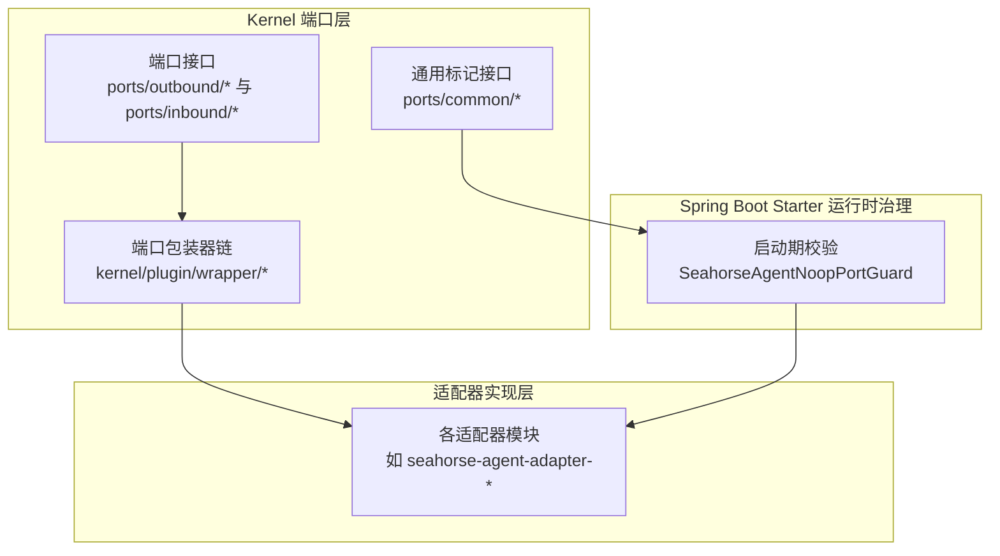
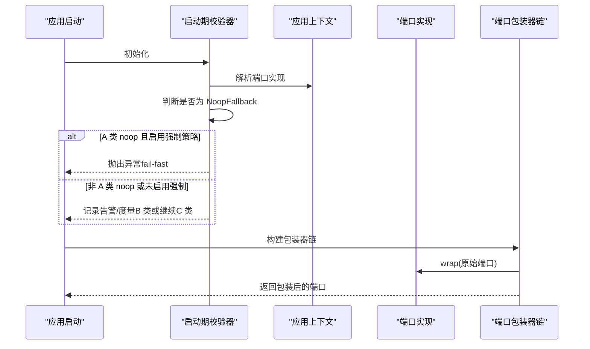
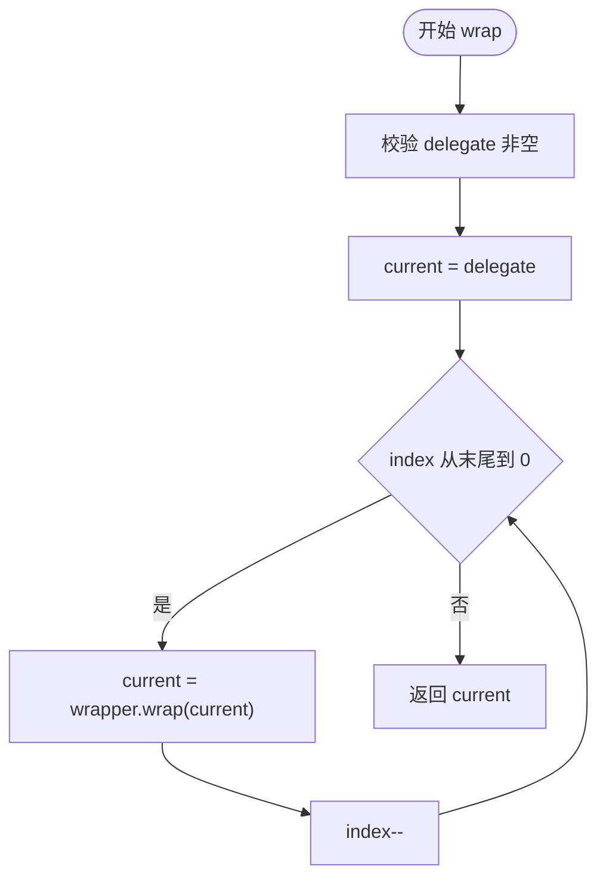
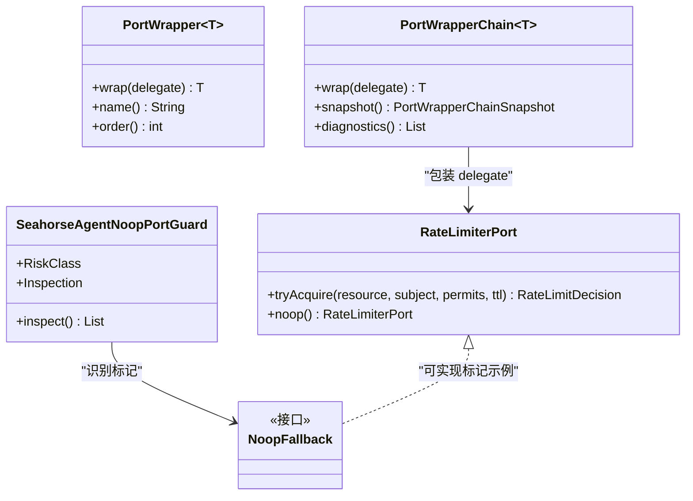

# 通用端口

<cite>
**本文引用的文件**
- [NoopFallback.java](file://seahorse-agent-kernel/src/main/java/com/miracle/ai/seahorse/agent/ports/common/NoopFallback.java)
- [SeahorseAgentNoopPortGuard.java](file://seahorse-agent-spring-boot-starter/src/main/java/com/miracle/ai/seahorse/agent/adapters/spring/SeahorseAgentNoopPortGuard.java)
- [SeahorseAgentNoopPortGuardTests.java](file://seahorse-agent-tests/src/test/java/com/miracle/ai/seahorse/agent/adapters/spring/SeahorseAgentNoopPortGuardTests.java)
- [PortWrapper.java](file://seahorse-agent-kernel/src/main/java/com/miracle/ai/seahorse/agent/kernel/plugin/wrapper/PortWrapper.java)
- [PortWrapperChain.java](file://seahorse-agent-kernel/src/main/java/com/miracle/ai/seahorse/agent/kernel/plugin/wrapper/PortWrapperChain.java)
- [PortWrapperChainTests.java](file://seahorse-agent-tests/src/test/java/com/miracle/ai/seahorse/agent/kernel/plugin/wrapper/PortWrapperChainTests.java)
- [PortWrapperChain.md](file://docs/zh/content/后端系统/核心内核/插件系统/端口包装器链.md)
- [RateLimiterPort.java](file://seahorse-agent-kernel/src/main/java/com/miracle/ai/seahorse/agent/ports/outbound/cache/RateLimiterPort.java)
- [RateLimitDecision.java](file://seahorse-agent-kernel/src/main/java/com/miracle/ai/seahorse/agent/ports/outbound/cache/RateLimitDecision.java)
- [AgentSPI.java](file://seahorse-agent-kernel/src/main/java/com/miracle/ai/seahorse/agent/kernel/plugin/AgentSPI.java)
- [端口接口.md](file://docs/zh/content/后端系统/核心内核/端口接口/端口接口.md)
- [出站端口.md](file://docs/zh/content/后端系统/核心内核/端口接口/出站端口/出站端口.md)
</cite>

## 目录
1. [简介](#简介)
2. [项目结构](#项目结构)
3. [核心组件](#核心组件)
4. [架构总览](#架构总览)
5. [详细组件分析](#详细组件分析)
6. [依赖分析](#依赖分析)
7. [性能考量](#性能考量)
8. [故障排查指南](#故障排查指南)
9. [结论](#结论)
10. [附录：通用端口实现示例与最佳实践](#附录通用端口实现示例与最佳实践)

## 简介
本文件聚焦“通用端口”的设计与实践，系统阐述其在端口接口体系中的定位与价值：作为跨领域与跨模块的通用抽象接口，统一承载横切关注点（如观测、审计、限流、重试、熔断等），并通过标准化的实现模式降低重复代码、提升可维护性与可测试性。本文围绕以下主题展开：
- 通用端口的设计理念：接口复用、标准化、一致性
- 生产级风险治理：显式 noop 标记与启动期校验
- 插件化横切能力：端口包装器链的装配与执行模型
- 典型通用端口实现：RateLimiterPort、NoopFallback、PortExceptionHandler（概念性说明）
- 与业务端口的关系：如何通过通用端口提升系统整体质量

## 项目结构
通用端口主要分布在 Kernel 的“端口接口层”与 Spring Boot Starter 的“运行时治理层”，并通过适配器模块提供具体实现。

图表来源
- [端口接口.md:38-49](file://docs/zh/content/后端系统/核心内核/端口接口/端口接口.md#L38-L49)
- [出站端口.md:220-244](file://docs/zh/content/后端系统/核心内核/端口接口/出站端口/出站端口.md#L220-L244)

章节来源
- [端口接口.md:19-49](file://docs/zh/content/后端系统/核心内核/端口接口/端口接口.md#L19-L49)
- [出站端口.md:220-244](file://docs/zh/content/后端系统/核心内核/端口接口/出站端口/出站端口.md#L220-L244)

## 核心组件
- 显式 noop 标记接口 NoopFallback：为静态 noop 工厂返回的实例提供稳定识别标记，配合启动期校验实现生产级风险治理。
- 启动期校验器 SeahorseAgentNoopPortGuard：扫描上下文中已注册的端口实现，按风险分类进行告警或强制 fail-fast。
- 端口包装器链 PortWrapperChain：以统一的装配与执行模型，串联观测、审计、限流、重试、熔断等横切能力。
- 通用端口示例：RateLimiterPort（统一限流端口，含标准 noop 实现）。

章节来源
- [NoopFallback.java:20-41](file://seahorse-agent-kernel/src/main/java/com/miracle/ai/seahorse/agent/ports/common/NoopFallback.java#L20-L41)
- [SeahorseAgentNoopPortGuard.java:58-141](file://seahorse-agent-spring-boot-starter/src/main/java/com/miracle/ai/seahorse/agent/adapters/spring/SeahorseAgentNoopPortGuard.java#L58-L141)
- [PortWrapperChain.java:37-76](file://seahorse-agent-kernel/src/main/java/com/miracle/ai/seahorse/agent/kernel/plugin/wrapper/PortWrapperChain.java#L37-L76)
- [RateLimiterPort.java:24-44](file://seahorse-agent-kernel/src/main/java/com/miracle/ai/seahorse/agent/ports/outbound/cache/RateLimiterPort.java#L24-L44)

## 架构总览
通用端口通过“标记 + 校验 + 包装器链 + 标准化实现”的组合拳，形成一套可复用、可治理、可演进的基础设施抽象。

图表来源
- [SeahorseAgentNoopPortGuard.java:123-138](file://seahorse-agent-spring-boot-starter/src/main/java/com/miracle/ai/seahorse/agent/adapters/spring/SeahorseAgentNoopPortGuard.java#L123-L138)
- [PortWrapperChain.java:51-58](file://seahorse-agent-kernel/src/main/java/com/miracle/ai/seahorse/agent/kernel/plugin/wrapper/PortWrapperChain.java#L51-L58)

## 详细组件分析

### NoopFallback 标记接口
- 设计目标：为静态 noop 工厂返回的实例提供稳定识别标记，使启动期校验器能够按风险等级进行差异化治理。
- 使用约束：
  - 仅作为元数据标记，不承诺具体行为；
  - 由 lambda 表达式产生的 noop 无法直接实现接口，需改为命名内部类；
  - 属于 kernel 层，适配器实现侧不应直接依赖。
- 风险分类：
  - A 类（写入/审计/索引等关键链路）：生产强制 fail-fast；
  - B 类（向量/关键字索引/观测增强）：记录告警与度量，不阻塞启动；
  - C 类（refiner/summarizer/graph 等纯增强）：允许保留 noop。

章节来源
- [NoopFallback.java:20-41](file://seahorse-agent-kernel/src/main/java/com/miracle/ai/seahorse/agent/ports/common/NoopFallback.java#L20-L41)

### 启动期校验器 SeahorseAgentNoopPortGuard
- 功能要点：
  - 对登记的风险端口进行扫描，解析上下文中的实现；
  - 识别是否为显式 noop fallback；
  - 按风险等级输出诊断信息；
  - 当启用 A 类强制策略时，立即抛出异常阻止启动。
- 配置开关：
  - seahorse-agent.runtime.noop-guard.enabled：默认开启；
  - seahorse-agent.runtime.noop-guard.enforce-class-a：默认关闭，开启后 A 类 noop 直接 fail-fast。

章节来源
- [SeahorseAgentNoopPortGuard.java:58-141](file://seahorse-agent-spring-boot-starter/src/main/java/com/miracle/ai/seahorse/agent/adapters/spring/SeahorseAgentNoopPortGuard.java#L58-L141)
- [SeahorseAgentNoopPortGuardTests.java:94-110](file://seahorse-agent-tests/src/test/java/com/miracle/ai/seahorse/agent/adapters/spring/SeahorseAgentNoopPortGuardTests.java#L94-L110)

### 端口包装器链 PortWrapperChain
- 组装与执行：
  - 按 order 升序排序，构建时过滤空值；
  - 运行时逆序遍历，确保最外层先 wrap；
  - 支持快照与诊断，暴露健康度与告警信息。
- 典型横切关注点（顺序示意）：
  - 审计（order=20）
  - 观测（order=25）
  - 限流（order=30）
  - 重试（order=40）
  - 熔断（order=50）

图表来源
- [PortWrapperChain.java:51-58](file://seahorse-agent-kernel/src/main/java/com/miracle/ai/seahorse/agent/kernel/plugin/wrapper/PortWrapperChain.java#L51-L58)

章节来源
- [PortWrapperChain.java:37-76](file://seahorse-agent-kernel/src/main/java/com/miracle/ai/seahorse/agent/kernel/plugin/wrapper/PortWrapperChain.java#L37-L76)
- [PortWrapperChain.md:157-166](file://docs/zh/content/后端系统/核心内核/插件系统/端口包装器链.md#L157-L166)

### 通用端口示例：统一限流端口 RateLimiterPort
- 设计要点：
  - 统一资源标识、主体、许可数与时长参数；
  - 返回标准化的 RateLimitDecision，包含允许/拒绝、剩余许可、建议等待时间与原因；
  - 提供标准 noop 实现，满足通用端口的零副作用与可替换性。
- 与通用端口的关系：
  - 通过统一接口与标准实现，减少重复代码；
  - 与包装器链协作，实现限流横切逻辑的可插拔治理。

章节来源
- [RateLimiterPort.java:24-44](file://seahorse-agent-kernel/src/main/java/com/miracle/ai/seahorse/agent/ports/outbound/cache/RateLimiterPort.java#L24-L44)
- [RateLimitDecision.java:31-50](file://seahorse-agent-kernel/src/main/java/com/miracle/ai/seahorse/agent/ports/outbound/cache/RateLimitDecision.java#L31-L50)

### 通用端口与业务端口的关系
- 业务端口聚焦领域职责（如用户、知识、对话、内存等），通用端口负责横切能力（观测、审计、限流、重试、熔断等）。
- 通过统一的端口包装器链，通用能力以插拔方式注入到业务端口调用路径中，既保持业务逻辑的纯净，又提升系统可观测性与韧性。

章节来源
- [端口接口.md:30-49](file://docs/zh/content/后端系统/核心内核/端口接口/端口接口.md#L30-L49)
- [出站端口.md:220-244](file://docs/zh/content/后端系统/核心内核/端口接口/出站端口/出站端口.md#L220-L244)

## 依赖分析
- NoopFallback 与启动期校验器：
  - 启动期校验器通过 instanceof NoopFallback 识别显式 noop fallback；
  - 风险分类决定治理策略（告警/度量或 fail-fast）。
- 端口包装器链与通用端口：
  - 通用端口（如 RateLimiterPort）作为 delegate 被包装器链包裹；
  - 包装器顺序决定横切逻辑的执行时机与组合效果。
- AgentSPI 与通用端口：
  - 通过 defaultName="noop" 为通用端口提供标准 noop 实现，确保在缺少适配器时系统仍可启动。

图表来源
- [NoopFallback.java:40](file://seahorse-agent-kernel/src/main/java/com/miracle/ai/seahorse/agent/ports/common/NoopFallback.java#L40)
- [SeahorseAgentNoopPortGuard.java:89-94](file://seahorse-agent-spring-boot-starter/src/main/java/com/miracle/ai/seahorse/agent/adapters/spring/SeahorseAgentNoopPortGuard.java#L89-L94)
- [RateLimiterPort.java:28-44](file://seahorse-agent-kernel/src/main/java/com/miracle/ai/seahorse/agent/ports/outbound/cache/RateLimiterPort.java#L28-L44)
- [PortWrapper.java:25-57](file://seahorse-agent-kernel/src/main/java/com/miracle/ai/seahorse/agent/kernel/plugin/wrapper/PortWrapper.java#L25-L57)
- [PortWrapperChain.java:37-76](file://seahorse-agent-kernel/src/main/java/com/miracle/ai/seahorse/agent/kernel/plugin/wrapper/PortWrapperChain.java#L37-L76)

章节来源
- [AgentSPI.java:35-50](file://seahorse-agent-kernel/src/main/java/com/miracle/ai/seahorse/agent/kernel/plugin/AgentSPI.java#L35-L50)
- [RateLimiterPort.java:27-44](file://seahorse-agent-kernel/src/main/java/com/miracle/ai/seahorse/agent/ports/outbound/cache/RateLimiterPort.java#L27-L44)

## 性能考量
- 启动期校验：仅在应用启动时执行一次，成本可控。
- 运行期包装器链：构建阶段完成排序与诊断，运行时为 O(n) 简单迭代，开销极低。
- 通用端口实现：标准 noop 采用零副作用设计，避免额外计算与 IO。

章节来源
- [PortWrapperChain.md:152-156](file://docs/zh/content/后端系统/核心内核/插件系统/端口包装器链.md#L152-L156)

## 故障排查指南
- 启动期 A 类 noop 导致 fail-fast
  - 现象：生产环境启动直接失败。
  - 排查：检查 seahorse-agent.runtime.noop-guard.enforce-class-a 配置；确认对应端口是否实现为显式 noop fallback。
- B 类 noop 导致告警与度量
  - 现象：启动期记录告警与度量，不影响启动。
  - 排查：确认端口实现是否为显式 noop fallback；评估是否需要引入真实适配器。
- 包装器链健康度异常
  - 现象：快照健康度为 false，存在重复名称或顺序冲突。
  - 排查：检查包装器的 name 与 order 设置；修正重复或冲突配置。

章节来源
- [SeahorseAgentNoopPortGuard.java:123-138](file://seahorse-agent-spring-boot-starter/src/main/java/com/miracle/ai/seahorse/agent/adapters/spring/SeahorseAgentNoopPortGuard.java#L123-L138)
- [PortWrapperChainTests.java:45-56](file://seahorse-agent-tests/src/test/java/com/miracle/ai/seahorse/agent/kernel/plugin/wrapper/PortWrapperChainTests.java#L45-L56)

## 结论
通用端口通过“标记 + 校验 + 包装器链 + 标准化实现”的设计，实现了跨领域、跨模块的能力复用与标准化治理。它不仅减少了重复代码、提升了可维护性，还在生产环境中提供了可预期的风险控制手段。配合业务端口，通用端口有效提升了系统的整体质量与韧性。

## 附录：通用端口实现示例与最佳实践
- 显式 noop 标记接口 NoopFallback
  - 适用场景：静态 noop 工厂返回的实例需要被启动期校验器稳定识别。
  - 最佳实践：将 lambda noop 改为命名内部类实现；仅作为元数据标记，不承载业务行为。
- 启动期校验器 SeahorseAgentNoopPortGuard
  - 适用场景：生产环境对关键端口的 noop 降级进行治理。
  - 最佳实践：A 类端口在生产必须替换为真实实现；B 类端口可保留 noop 但需记录告警与度量；C 类端口允许 noop。
- 端口包装器链 PortWrapperChain
  - 适用场景：为通用横切能力（观测、审计、限流、重试、熔断）提供统一装配与执行模型。
  - 最佳实践：合理设置 order 顺序；避免在 wrap 中进行昂贵操作；利用快照与诊断能力进行运行时治理。
- 通用端口示例：统一限流端口 RateLimiterPort
  - 适用场景：跨模块统一限流策略与决策结果标准化。
  - 最佳实践：遵循统一参数与返回值约定；提供标准 noop 实现；与包装器链协同工作。

章节来源
- [NoopFallback.java:20-41](file://seahorse-agent-kernel/src/main/java/com/miracle/ai/seahorse/agent/ports/common/NoopFallback.java#L20-L41)
- [SeahorseAgentNoopPortGuard.java:58-141](file://seahorse-agent-spring-boot-starter/src/main/java/com/miracle/ai/seahorse/agent/adapters/spring/SeahorseAgentNoopPortGuard.java#L58-L141)
- [PortWrapperChain.md:356-373](file://docs/zh/content/后端系统/核心内核/插件系统/端口包装器链.md#L356-L373)
- [RateLimiterPort.java:24-44](file://seahorse-agent-kernel/src/main/java/com/miracle/ai/seahorse/agent/ports/outbound/cache/RateLimiterPort.java#L24-L44)