# 代理领域模型

<cite>
**本文引用的文件**
- [AgentDefinition.java](file://seahorse-agent-kernel/src/main/java/com/miracle/ai/seahorse/agent/kernel/domain/agent/definition/AgentDefinition.java)
- [AgentStatus.java](file://seahorse-agent-kernel/src/main/java/com/miracle/ai/seahorse/agent/kernel/domain/agent/definition/AgentStatus.java)
- [AgentRun.java](file://seahorse-agent-kernel/src/main/java/com/miracle/ai/seahorse/agent/kernel/domain/agent/runtime/AgentRun.java)
- [AgentCheckpoint.java](file://seahorse-agent-kernel/src/main/java/com/miracle/ai/seahorse/agent/kernel/domain/agent/runtime/AgentCheckpoint.java)
- [AgentCheckpointType.java](file://seahorse-agent-kernel/src/main/java/com/miracle/ai/seahorse/agent/kernel/domain/agent/runtime/AgentCheckpointType.java)
- [AgentArtifact.java](file://seahorse-agent-kernel/src/main/java/com/miracle/ai/seahorse/agent/kernel/domain/agent/artifact/AgentArtifact.java)
- [AgentArtifactType.java](file://seahorse-agent-kernel/src/main/java/com/miracle/ai/seahorse/agent/kernel/domain/agent/artifact/AgentArtifactType.java)
- [AgentVersionRollout.java](file://seahorse-agent-kernel/src/main/java/com/miracle/ai/seahorse/agent/kernel/domain/agent/rollout/AgentVersionRollout.java)
- [AgentRolloutStatus.java](file://seahorse-agent-kernel/src/main/java/com/miracle/ai/seahorse/agent/kernel/domain/agent/rollout/AgentRolloutStatus.java)
- [AgentRolloutFailureCode.java](file://seahorse-agent-kernel/src/main/java/com/miracle/ai/seahorse/agent/kernel/domain/agent/rollout/AgentRolloutFailureCode.java)
- [AgentSkill.java](file://seahorse-agent-kernel/src/main/java/com/miracle/ai/seahorse/agent/kernel/domain/agent/skill/AgentSkill.java)
- [AgentSkillRevision.java](file://seahorse-agent-kernel/src/main/java/com/miracle/ai/seahorse/agent/kernel/domain/agent/skill/AgentSkillRevision.java)
- [AgentSkillBinding.java](file://seahorse-agent-kernel/src/main/java/com/miracle/ai/seahorse/agent/kernel/domain/agent/skill/AgentSkillBinding.java)
- [AgentSkillCategory.java](file://seahorse-agent-kernel/src/main/java/com/miracle/ai/seahorse/agent/kernel/domain/agent/skill/AgentSkillCategory.java)
- [AgentSkillStatus.java](file://seahorse-agent-kernel/src/main/java/com/miracle/ai/seahorse/agent/kernel/domain/agent/skill/AgentSkillStatus.java)
- [AgentSkillSource.java](file://seahorse-agent-kernel/src/main/java/com/miracle/ai/seahorse/agent/kernel/domain/agent/skill/AgentSkillSource.java)
- [SkillInjectMode.java](file://seahorse-agent-kernel/src/main/java/com/miracle/ai/seahorse/agent/kernel/domain/agent/skill/SkillInjectMode.java)
- [SkillScanDecision.java](file://seahorse-agent-kernel/src/main/java/com/miracle/ai/seahorse/agent/kernel/domain/agent/skill/SkillScanDecision.java)
- [SkillRuntimeBlock.java](file://seahorse-agent-kernel/src/main/java/com/miracle/ai/seahorse/agent/kernel/domain/agent/skill/SkillRuntimeBlock.java)
- [KernelAgentSkillManagementService.java](file://seahorse-agent-kernel/src/main/java/com/miracle/ai/seahorse/agent/kernel/application/agent/skill/KernelAgentSkillManagementService.java)
- [KernelAgentSkillBindingService.java](file://seahorse-agent-kernel/src/main/java/com/miracle/ai/seahorse/agent/kernel/application/agent/skill/KernelAgentSkillBindingService.java)
- [AgentSkillBindingInboundPort.java](file://seahorse-agent-kernel/src/main/java/com/miracle/ai/seahorse/agent/ports/inbound/agent/skill/AgentSkillBindingInboundPort.java)
- [AgentSkillManagementInboundPort.java](file://seahorse-agent-kernel/src/main/java/com/miracle/ai/seahorse/agent/ports/inbound/agent/skill/AgentSkillManagementInboundPort.java)
- [AgentSkillRepositoryPort.java](file://seahorse-agent-kernel/src/main/java/com/miracle/ai/seahorse/agent/ports/outbound/agent/AgentSkillRepositoryPort.java)
- [JdbcAgentDefinitionRepositoryAdapter.java](file://seahorse-agent-adapter-repository-jdbc/src/main/java/com/miracle/ai/seahorse/agent/adapters/repository/jdbc/JdbcAgentDefinitionRepositoryAdapter.java)
- [JdbcAgentRunRepositoryAdapter.java](file://seahorse-agent-adapter-repository-jdbc/src/main/java/com/miracle/ai/seahorse/agent/adapters/repository/jdbc/JdbcAgentRunRepositoryAdapter.java)
- [JdbcAgentCheckpointRepositoryAdapter.java](file://seahorse-agent-adapter-repository-jdbc/src/main/java/com/miracle/ai/seahorse/agent/adapters/repository/jdbc/JdbcAgentCheckpointRepositoryAdapter.java)
- [JdbcAgentArtifactRepositoryAdapter.java](file://seahorse-agent-adapter-repository-jdbc/src/main/java/com/miracle/ai/seahorse/agent/adapters/repository/jdbc/JdbcAgentArtifactRepositoryAdapter.java)
- [JdbcAgentSkillRepositoryAdapter.java](file://seahorse-agent-adapter-repository-jdbc/src/main/java/com/miracle/ai/seahorse/agent/adapters/repository/jdbc/JdbcAgentSkillRepositoryAdapter.java)
- [SeahorseAgentRolloutController.java](file://seahorse-agent-adapter-web/src/main/java/com/miracle/ai/seahorse/agent/adapters/web/SeahorseAgentRolloutController.java)
- [agentDefinitionService.ts](file://frontend/src/services/agentDefinitionService.ts)
- [agentArtifactService.ts](file://frontend/src/services/agentArtifactService.ts)
- [index.ts](file://frontend/src/types/index.ts)
</cite>

## 更新摘要
**变更内容**
- 新增完整的技能管理领域模型，包括 AgentSkill、AgentSkillRevision、AgentSkillBinding 核心实体
- 新增技能分类、状态、来源等枚举类型
- 新增技能注入模式和安全扫描决策机制
- 新增技能管理应用服务和绑定服务
- 扩展代理定义与技能绑定的关系，支持多技能组合

## 目录
1. [引言](#引言)
2. [项目结构](#项目结构)
3. [核心组件](#核心组件)
4. [架构总览](#架构总览)
5. [详细组件分析](#详细组件分析)
6. [技能管理领域模型](#技能管理领域模型)
7. [依赖分析](#依赖分析)
8. [性能考虑](#性能考虑)
9. [故障排查指南](#故障排查指南)
10. [结论](#结论)
11. [附录](#附录)

## 引言
本文件系统性梳理代理（AGENT）领域的核心领域模型与运行机制，覆盖以下关键主题：
- 核心实体：AgentDefinition（代理定义）、AgentRun（代理运行实例）、AgentCheckpoint（运行检查点）、AgentArtifact（产物）
- 技能管理：AgentSkill（技能定义）、AgentSkillRevision（技能修订）、AgentSkillBinding（技能绑定）
- 生命周期管理：草稿、发布、禁用、归档；版本控制与发布流程
- 运行时状态管理：检查点类型、步骤与事件记录
- 发布与灰度：AgentVersionRollout 的灰度发布、暂停、提升、回滚与失败处理
- 多版本并存与高级能力：灰度发布、A/B 测试支撑
- 技能组合与注入：支持多技能组合、注入模式控制、安全扫描
- UML 类图与状态图：从创建到发布的完整流程
- 实际代码示例路径与最佳实践

## 项目结构
代理领域模型主要分布在内核模块与适配器层：
- 内核 domain 层：定义代理定义、运行、检查点、产物与版本发布状态等核心领域对象
- 技能管理 domain 层：定义技能、修订、绑定等技能管理核心领域对象
- 应用服务层：提供发布与灰度相关应用服务，以及技能管理与绑定服务
- 适配器层：通过 JDBC 实现持久化，通过 Web 控制器暴露灰度接口
- 前端类型与服务：定义与后端交互的数据契约与调用方式

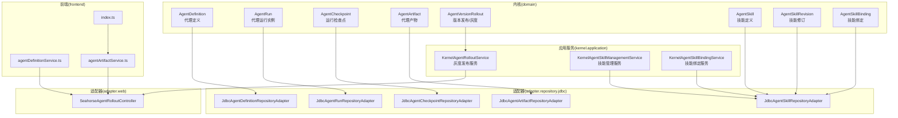

**图表来源**
- [AgentDefinition.java](file://seahorse-agent-kernel/src/main/java/com/miracle/ai/seahorse/agent/kernel/domain/agent/definition/AgentDefinition.java)
- [AgentRun.java](file://seahorse-agent-kernel/src/main/java/com/miracle/ai/seahorse/agent/kernel/domain/agent/runtime/AgentRun.java)
- [AgentCheckpoint.java](file://seahorse-agent-kernel/src/main/java/com/miracle/ai/seahorse/agent/kernel/domain/agent/runtime/AgentCheckpoint.java)
- [AgentArtifact.java](file://seahorse-agent-kernel/src/main/java/com/miracle/ai/seahorse/agent/kernel/domain/agent/artifact/AgentArtifact.java)
- [AgentVersionRollout.java](file://seahorse-agent-kernel/src/main/java/com/miracle/ai/seahorse/agent/kernel/domain/agent/rollout/AgentVersionRollout.java)
- [AgentSkill.java](file://seahorse-agent-kernel/src/main/java/com/miracle/ai/seahorse/agent/kernel/domain/agent/skill/AgentSkill.java)
- [AgentSkillRevision.java](file://seahorse-agent-kernel/src/main/java/com/miracle/ai/seahorse/agent/kernel/domain/agent/skill/AgentSkillRevision.java)
- [AgentSkillBinding.java](file://seahorse-agent-kernel/src/main/java/com/miracle/ai/seahorse/agent/kernel/domain/agent/skill/AgentSkillBinding.java)
- [KernelAgentRolloutService.java](file://seahorse-agent-kernel/src/main/java/com/miracle/ai/seahorse/agent/kernel/application/agent/rollout/KernelAgentRolloutService.java)
- [KernelAgentSkillManagementService.java](file://seahorse-agent-kernel/src/main/java/com/miracle/ai/seahorse/agent/kernel/application/agent/skill/KernelAgentSkillManagementService.java)
- [KernelAgentSkillBindingService.java](file://seahorse-agent-kernel/src/main/java/com/miracle/ai/seahorse/agent/kernel/application/agent/skill/KernelAgentSkillBindingService.java)
- [JdbcAgentDefinitionRepositoryAdapter.java](file://seahorse-agent-adapter-repository-jdbc/src/main/java/com/miracle/ai/seahorse/agent/adapters/repository/jdbc/JdbcAgentDefinitionRepositoryAdapter.java)
- [JdbcAgentRunRepositoryAdapter.java](file://seahorse-agent-adapter-repository-jdbc/src/main/java/com/miracle/ai/seahorse/agent/adapters/repository/jdbc/JdbcAgentRunRepositoryAdapter.java)
- [JdbcAgentCheckpointRepositoryAdapter.java](file://seahorse-agent-adapter-repository-jdbc/src/main/java/com/miracle/ai/seahorse/agent/adapters/repository/jdbc/JdbcAgentCheckpointRepositoryAdapter.java)
- [JdbcAgentArtifactRepositoryAdapter.java](file://seahorse-agent-adapter-repository-jdbc/src/main/java/com/miracle/ai/seahorse/agent/adapters/repository/jdbc/JdbcAgentArtifactRepositoryAdapter.java)
- [JdbcAgentSkillRepositoryAdapter.java](file://seahorse-agent-adapter-repository-jdbc/src/main/java/com/miracle/ai/seahorse/agent/adapters/repository/jdbc/JdbcAgentSkillRepositoryAdapter.java)
- [SeahorseAgentRolloutController.java](file://seahorse-agent-adapter-web/src/main/java/com/miracle/ai/seahorse/agent/adapters/web/SeahorseAgentRolloutController.java)
- [agentDefinitionService.ts](file://frontend/src/services/agentDefinitionService.ts)
- [agentArtifactService.ts](file://frontend/src/services/agentArtifactService.ts)
- [index.ts](file://frontend/src/types/index.ts)

**章节来源**
- [AgentDefinition.java](file://seahorse-agent-kernel/src/main/java/com/miracle/ai/seahorse/agent/kernel/domain/agent/definition/AgentDefinition.java)
- [AgentRun.java](file://seahorse-agent-kernel/src/main/java/com/miracle/ai/seahorse/agent/kernel/domain/agent/runtime/AgentRun.java)
- [AgentCheckpoint.java](file://seahorse-agent-kernel/src/main/java/com/miracle/ai/seahorse/agent/kernel/domain/agent/runtime/AgentCheckpoint.java)
- [AgentArtifact.java](file://seahorse-agent-kernel/src/main/java/com/miracle/ai/seahorse/agent/kernel/domain/agent/artifact/AgentArtifact.java)
- [AgentVersionRollout.java](file://seahorse-agent-kernel/src/main/java/com/miracle/ai/seahorse/agent/kernel/domain/agent/rollout/AgentVersionRollout.java)
- [AgentSkill.java](file://seahorse-agent-kernel/src/main/java/com/miracle/ai/seahorse/agent/kernel/domain/agent/skill/AgentSkill.java)
- [AgentSkillRevision.java](file://seahorse-agent-kernel/src/main/java/com/miracle/ai/seahorse/agent/kernel/domain/agent/skill/AgentSkillRevision.java)
- [AgentSkillBinding.java](file://seahorse-agent-kernel/src/main/java/com/miracle/ai/seahorse/agent/kernel/domain/agent/skill/AgentSkillBinding.java)
- [KernelAgentRolloutService.java](file://seahorse-agent-kernel/src/main/java/com/miracle/ai/seahorse/agent/kernel/application/agent/rollout/KernelAgentRolloutService.java)
- [KernelAgentSkillManagementService.java](file://seahorse-agent-kernel/src/main/java/com/miracle/ai/seahorse/agent/kernel/application/agent/skill/KernelAgentSkillManagementService.java)
- [KernelAgentSkillBindingService.java](file://seahorse-agent-kernel/src/main/java/com/miracle/ai/seahorse/agent/kernel/application/agent/skill/KernelAgentSkillBindingService.java)
- [JdbcAgentDefinitionRepositoryAdapter.java](file://seahorse-agent-adapter-repository-jdbc/src/main/java/com/miracle/ai/seahorse/agent/adapters/repository/jdbc/JdbcAgentDefinitionRepositoryAdapter.java)
- [JdbcAgentRunRepositoryAdapter.java](file://seahorse-agent-adapter-repository-jdbc/src/main/java/com/miracle/ai/seahorse/agent/adapters/repository/jdbc/JdbcAgentRunRepositoryAdapter.java)
- [JdbcAgentCheckpointRepositoryAdapter.java](file://seahorse-agent-adapter-repository-jdbc/src/main/java/com/miracle/ai/seahorse/agent/adapters/repository/jdbc/JdbcAgentCheckpointRepositoryAdapter.java)
- [JdbcAgentArtifactRepositoryAdapter.java](file://seahorse-agent-adapter-repository-jdbc/src/main/java/com/miracle/ai/seahorse/agent/adapters/repository/jdbc/JdbcAgentArtifactRepositoryAdapter.java)
- [JdbcAgentSkillRepositoryAdapter.java](file://seahorse-agent-adapter-repository-jdbc/src/main/java/com/miracle/ai/seahorse/agent/adapters/repository/jdbc/JdbcAgentSkillRepositoryAdapter.java)
- [SeahorseAgentRolloutController.java](file://seahorse-agent-adapter-web/src/main/java/com/miracle/ai/seahorse/agent/adapters/web/SeahorseAgentRolloutController.java)
- [agentDefinitionService.ts](file://frontend/src/services/agentDefinitionService.ts)
- [agentArtifactService.ts](file://frontend/src/services/agentArtifactService.ts)
- [index.ts](file://frontend/src/types/index.ts)

## 核心组件
本节聚焦代理领域模型的关键实体及其职责与约束。

- 代理定义（AgentDefinition）
  - 职责：描述代理的基本信息、当前版本、最新发布版本、状态、指令与策略等
  - 关键属性：标识、名称、描述、租户、状态、当前版本号、最新发布版本号、工具绑定摘要、风险等级、所有者、模型/上下文/风险策略等
  - 状态枚举：DRAFT（草稿）、PUBLISHED（已发布）、DISABLED（已禁用）、ARCHIVED（已归档）

- 代理运行实例（AgentRun）
  - 职责：承载一次代理执行会话的运行时上下文，包含输入、上下文、步骤、事件与最终产物
  - 关键属性：运行 ID、代理 ID、租户 ID、用户 ID、输入、上下文、状态、时间戳等

- 运行检查点（AgentCheckpoint）
  - 职责：在运行过程中记录关键节点的状态快照，便于恢复、重试与审计
  - 关键属性：检查点 ID、运行 ID、步骤 ID、检查点类型、数据负载、创建时间
  - 检查点类型：模型轮次、工具调用前/后、等待审批等

- 代理产物（AgentArtifact）
  - 职责：记录运行产生的可检索、可预览、可扫描的产物
  - 关键属性：产物 ID、运行 ID、消息 ID、租户/用户 ID、类型、标题、MIME 类型、存储引用、预览文本、处置策略、扫描状态、创建时间等

- 版本发布与灰度（AgentVersionRollout）
  - 职责：管理代理版本的灰度发布、暂停、提升为生产、回滚与失败处理
  - 关键属性：发布 ID、租户 ID、代理 ID、版本 ID、灰度百分比、状态、门禁报告 ID、时间戳、操作者
  - 状态枚举：RUNNING（进行中）、PAUSED（已暂停）、PROMOTED（已提升）、ROLLED_BACK（已回滚）、FAILED（已失败）
  - 失败码：用于记录回滚失败、目标缺失等场景

- 技能定义（AgentSkill）
  - 职责：描述技能的基本信息、分类、来源、状态、启用状态等
  - 关键属性：技能名称、租户 ID、分类、来源、状态、启用状态、最新修订 ID、描述、标签、允许的工具列表等
  - 分类枚举：PUBLIC（公共）、CUSTOM（自定义）
  - 状态枚举：ACTIVE（激活）、DISABLED（禁用）、DELETED（删除）

- 技能修订（AgentSkillRevision）
  - 职责：记录技能的修订历史，包含内容、哈希值、扫描结果等
  - 关键属性：修订 ID、技能名称、租户 ID、修订号、内容哈希、内容、前置信息、扫描决策、扫描结果、创建者、创建时间
  - 修订号必须大于 0

- 技能绑定（AgentSkillBinding）
  - 职责：将技能绑定到特定代理，指定注入模式和修订版本
  - 关键属性：代理 ID、租户 ID、技能名称、修订 ID、注入模式、创建者、创建时间
  - 注入模式：仅元数据、元数据和正文

**章节来源**
- [AgentDefinition.java](file://seahorse-agent-kernel/src/main/java/com/miracle/ai/seahorse/agent/kernel/domain/agent/definition/AgentDefinition.java)
- [AgentStatus.java](file://seahorse-agent-kernel/src/main/java/com/miracle/ai/seahorse/agent/kernel/domain/agent/definition/AgentStatus.java)
- [AgentRun.java](file://seahorse-agent-kernel/src/main/java/com/miracle/ai/seahorse/agent/kernel/domain/agent/runtime/AgentRun.java)
- [AgentCheckpoint.java](file://seahorse-agent-kernel/src/main/java/com/miracle/ai/seahorse/agent/kernel/domain/agent/runtime/AgentCheckpoint.java)
- [AgentCheckpointType.java](file://seahorse-agent-kernel/src/main/java/com/miracle/ai/seahorse/agent/kernel/domain/agent/runtime/AgentCheckpointType.java)
- [AgentArtifact.java](file://seahorse-agent-kernel/src/main/java/com/miracle/ai/seahorse/agent/kernel/domain/agent/artifact/AgentArtifact.java)
- [AgentArtifactType.java](file://seahorse-agent-kernel/src/main/java/com/miracle/ai/seahorse/agent/kernel/domain/agent/artifact/AgentArtifactType.java)
- [AgentVersionRollout.java](file://seahorse-agent-kernel/src/main/java/com/miracle/ai/seahorse/agent/kernel/domain/agent/rollout/AgentVersionRollout.java)
- [AgentRolloutStatus.java](file://seahorse-agent-kernel/src/main/java/com/miracle/ai/seahorse/agent/kernel/domain/agent/rollout/AgentRolloutStatus.java)
- [AgentRolloutFailureCode.java](file://seahorse-agent-kernel/src/main/java/com/miracle/ai/seahorse/agent/kernel/domain/agent/rollout/AgentRolloutFailureCode.java)
- [AgentSkill.java](file://seahorse-agent-kernel/src/main/java/com/miracle/ai/seahorse/agent/kernel/domain/agent/skill/AgentSkill.java)
- [AgentSkillRevision.java](file://seahorse-agent-kernel/src/main/java/com/miracle/ai/seahorse/agent/kernel/domain/agent/skill/AgentSkillRevision.java)
- [AgentSkillBinding.java](file://seahorse-agent-kernel/src/main/java/com/miracle/ai/seahorse/agent/kernel/domain/agent/skill/AgentSkillBinding.java)
- [AgentSkillCategory.java](file://seahorse-agent-kernel/src/main/java/com/miracle/ai/seahorse/agent/kernel/domain/agent/skill/AgentSkillCategory.java)
- [AgentSkillStatus.java](file://seahorse-agent-kernel/src/main/java/com/miracle/ai/seahorse/agent/kernel/domain/agent/skill/AgentSkillStatus.java)
- [AgentSkillSource.java](file://seahorse-agent-kernel/src/main/java/com/miracle/ai/seahorse/agent/kernel/domain/agent/skill/AgentSkillSource.java)
- [SkillInjectMode.java](file://seahorse-agent-kernel/src/main/java/com/miracle/ai/seahorse/agent/kernel/domain/agent/skill/SkillInjectMode.java)

## 架构总览
下图展示了代理领域模型在系统中的分层与交互关系，以及灰度发布的端到端流程。

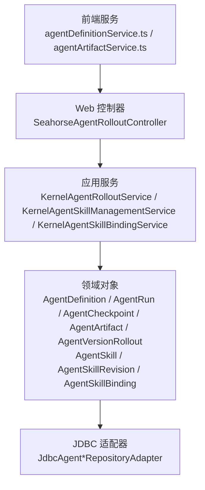

**图表来源**
- [SeahorseAgentRolloutController.java](file://seahorse-agent-adapter-web/src/main/java/com/miracle/ai/seahorse/agent/adapters/web/SeahorseAgentRolloutController.java)
- [KernelAgentRolloutService.java](file://seahorse-agent-kernel/src/main/java/com/miracle/ai/seahorse/agent/kernel/application/agent/rollout/KernelAgentRolloutService.java)
- [KernelAgentSkillManagementService.java](file://seahorse-agent-kernel/src/main/java/com/miracle/ai/seahorse/agent/kernel/application/agent/skill/KernelAgentSkillManagementService.java)
- [KernelAgentSkillBindingService.java](file://seahorse-agent-kernel/src/main/java/com/miracle/ai/seahorse/agent/kernel/application/agent/skill/KernelAgentSkillBindingService.java)
- [AgentDefinition.java](file://seahorse-agent-kernel/src/main/java/com/miracle/ai/seahorse/agent/kernel/domain/agent/definition/AgentDefinition.java)
- [AgentRun.java](file://seahorse-agent-kernel/src/main/java/com/miracle/ai/seahorse/agent/kernel/domain/agent/runtime/AgentRun.java)
- [AgentCheckpoint.java](file://seahorse-agent-kernel/src/main/java/com/miracle/ai/seahorse/agent/kernel/domain/agent/runtime/AgentCheckpoint.java)
- [AgentArtifact.java](file://seahorse-agent-kernel/src/main/java/com/miracle/ai/seahorse/agent/kernel/domain/agent/artifact/AgentArtifact.java)
- [AgentVersionRollout.java](file://seahorse-agent-kernel/src/main/java/com/miracle/ai/seahorse/agent/kernel/domain/agent/rollout/AgentVersionRollout.java)
- [AgentSkill.java](file://seahorse-agent-kernel/src/main/java/com/miracle/ai/seahorse/agent/kernel/domain/agent/skill/AgentSkill.java)
- [AgentSkillRevision.java](file://seahorse-agent-kernel/src/main/java/com/miracle/ai/seahorse/agent/kernel/domain/agent/skill/AgentSkillRevision.java)
- [AgentSkillBinding.java](file://seahorse-agent-kernel/src/main/java/com/miracle/ai/seahorse/agent/kernel/domain/agent/skill/AgentSkillBinding.java)
- [JdbcAgentDefinitionRepositoryAdapter.java](file://seahorse-agent-adapter-repository-jdbc/src/main/java/com/miracle/ai/seahorse/agent/adapters/repository/jdbc/JdbcAgentDefinitionRepositoryAdapter.java)
- [JdbcAgentRunRepositoryAdapter.java](file://seahorse-agent-adapter-repository-jdbc/src/main/java/com/miracle/ai/seahorse/agent/adapters/repository/jdbc/JdbcAgentRunRepositoryAdapter.java)
- [JdbcAgentCheckpointRepositoryAdapter.java](file://seahorse-agent-adapter-repository-jdbc/src/main/java/com/miracle/ai/seahorse/agent/adapters/repository/jdbc/JdbcAgentCheckpointRepositoryAdapter.java)
- [JdbcAgentArtifactRepositoryAdapter.java](file://seahorse-agent-adapter-repository-jdbc/src/main/java/com/miracle/ai/seahorse/agent/adapters/repository/jdbc/JdbcAgentArtifactRepositoryAdapter.java)
- [JdbcAgentSkillRepositoryAdapter.java](file://seahorse-agent-adapter-repository-jdbc/src/main/java/com/miracle/ai/seahorse/agent/adapters/repository/jdbc/JdbcAgentSkillRepositoryAdapter.java)

## 详细组件分析

### 代理定义（AgentDefinition）与状态机
- 定义与职责：描述代理的元数据、策略与版本信息，驱动发布与灰度流程
- 状态流转：草稿 → 发布；发布 → 禁用/归档；草稿可回退至发布
- 与版本的关系：维护 currentVersionId/currentVersionNumber 与 latestPublishedVersionId/latestPublishedVersionNumber

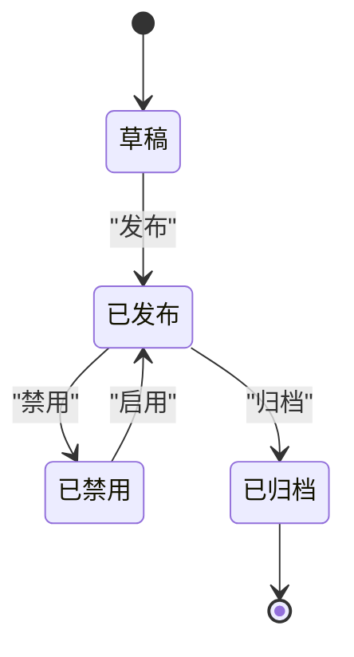

**图表来源**
- [AgentStatus.java](file://seahorse-agent-kernel/src/main/java/com/miracle/ai/seahorse/agent/kernel/domain/agent/definition/AgentStatus.java)
- [AgentDefinition.java](file://seahorse-agent-kernel/src/main/java/com/miracle/ai/seahorse/agent/kernel/domain/agent/definition/AgentDefinition.java)

**章节来源**
- [AgentDefinition.java](file://seahorse-agent-kernel/src/main/java/com/miracle/ai/seahorse/agent/kernel/domain/agent/definition/AgentDefinition.java)
- [AgentStatus.java](file://seahorse-agent-kernel/src/main/java/com/miracle/ai/seahorse/agent/kernel/domain/agent/definition/AgentStatus.java)

### 代理运行实例（AgentRun）与检查点（AgentCheckpoint）
- 运行实例：承载一次对话或任务的完整生命周期，包含输入、上下文、步骤与事件
- 检查点：在关键节点保存运行状态，支持重试、恢复与审计
- 检查点类型：模型轮次、工具调用前/后、等待审批等

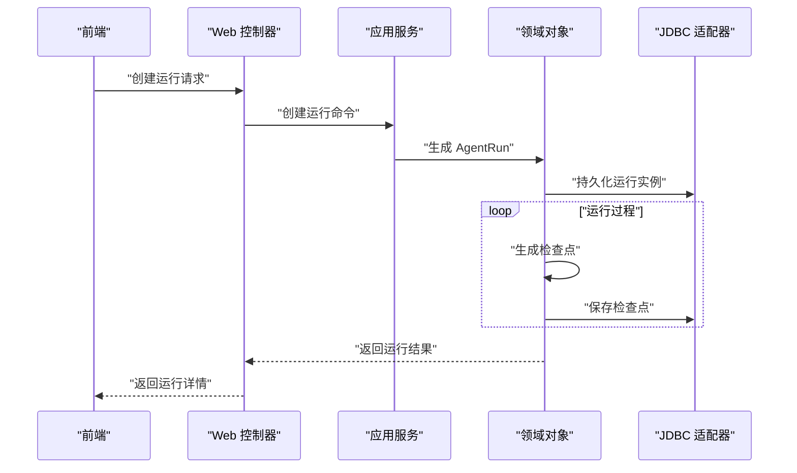

**图表来源**
- [AgentRun.java](file://seahorse-agent-kernel/src/main/java/com/miracle/ai/seahorse/agent/kernel/domain/agent/runtime/AgentRun.java)
- [AgentCheckpoint.java](file://seahorse-agent-kernel/src/main/java/com/miracle/ai/seahorse/agent/kernel/domain/agent/runtime/AgentCheckpoint.java)
- [AgentCheckpointType.java](file://seahorse-agent-kernel/src/main/java/com/miracle/ai/seahorse/agent/kernel/domain/agent/runtime/AgentCheckpointType.java)
- [JdbcAgentRunRepositoryAdapter.java](file://seahorse-agent-adapter-repository-jdbc/src/main/java/com/miracle/ai/seahorse/agent/adapters/repository/jdbc/JdbcAgentRunRepositoryAdapter.java)
- [JdbcAgentCheckpointRepositoryAdapter.java](file://seahorse-agent-adapter-repository-jdbc/src/main/java/com/miracle/ai/seahorse/agent/adapters/repository/jdbc/JdbcAgentCheckpointRepositoryAdapter.java)

**章节来源**
- [AgentRun.java](file://seahorse-agent-kernel/src/main/java/com/miracle/ai/seahorse/agent/kernel/domain/agent/runtime/AgentRun.java)
- [AgentCheckpoint.java](file://seahorse-agent-kernel/src/main/java/com/miracle/ai/seahorse/agent/kernel/domain/agent/runtime/AgentCheckpoint.java)
- [AgentCheckpointType.java](file://seahorse-agent-kernel/src/main/java/com/miracle/ai/seahorse/agent/kernel/domain/agent/runtime/AgentCheckpointType.java)
- [JdbcAgentRunRepositoryAdapter.java](file://seahorse-agent-adapter-repository-jdbc/src/main/java/com/miracle/ai/seahorse/agent/adapters/repository/jdbc/JdbcAgentRunRepositoryAdapter.java)
- [JdbcAgentCheckpointRepositoryAdapter.java](file://seahorse-agent-adapter-repository-jdbc/src/main/java/com/miracle/ai/seahorse/agent/adapters/repository/jdbc/JdbcAgentCheckpointRepositoryAdapter.java)

### 代理产物（AgentArtifact）
- 用途：记录运行产生的可检索、可预览、可扫描的产物，支持后续治理与审计
- 关键字段：类型、MIME、存储引用、预览文本、处置策略、扫描状态等

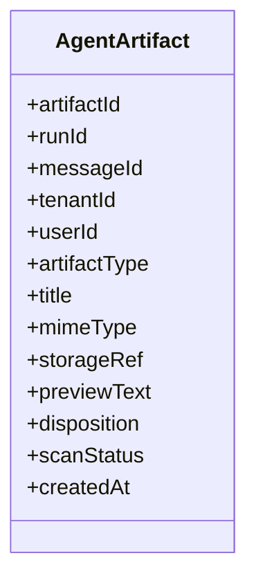

**图表来源**
- [AgentArtifact.java](file://seahorse-agent-kernel/src/main/java/com/miracle/ai/seahorse/agent/kernel/domain/agent/artifact/AgentArtifact.java)
- [AgentArtifactType.java](file://seahorse-agent-kernel/src/main/java/com/miracle/ai/seahorse/agent/kernel/domain/agent/artifact/AgentArtifactType.java)

**章节来源**
- [AgentArtifact.java](file://seahorse-agent-kernel/src/main/java/com/miracle/ai/seahorse/agent/kernel/domain/agent/artifact/AgentArtifact.java)
- [AgentArtifactType.java](file://seahorse-agent-kernel/src/main/java/com/miracle/ai/seahorse/agent/kernel/domain/agent/artifact/AgentArtifactType.java)
- [JdbcAgentArtifactRepositoryAdapter.java](file://seahorse-agent-adapter-repository-jdbc/src/main/java/com/miracle/ai/seahorse/agent/adapters/repository/jdbc/JdbcAgentArtifactRepositoryAdapter.java)

### 版本发布与灰度（AgentVersionRollout）
- 灰度创建：指定租户、代理、版本与灰度百分比，初始状态为 RUNNING
- 暂停/提升/回滚/失败：根据门禁报告与回滚目标进行状态变更
- 应用服务负责校验与持久化，控制器提供 REST 接口

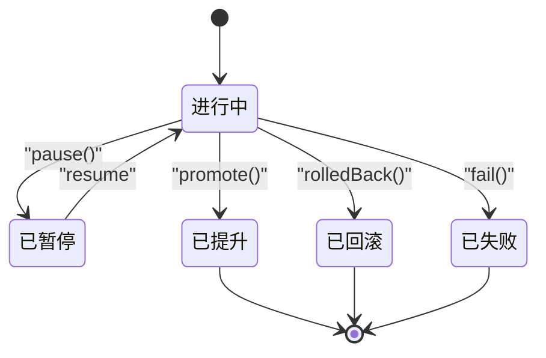

**图表来源**
- [AgentVersionRollout.java](file://seahorse-agent-kernel/src/main/java/com/miracle/ai/seahorse/agent/kernel/domain/agent/rollout/AgentVersionRollout.java)
- [AgentRolloutStatus.java](file://seahorse-agent-kernel/src/main/java/com/miracle/ai/seahorse/agent/kernel/domain/agent/rollout/AgentRolloutStatus.java)
- [AgentRolloutFailureCode.java](file://seahorse-agent-kernel/src/main/java/com/miracle/ai/seahorse/agent/kernel/domain/agent/rollout/AgentRolloutFailureCode.java)
- [KernelAgentRolloutService.java](file://seahorse-agent-kernel/src/main/java/com/miracle/ai/seahorse/agent/kernel/application/agent/rollout/KernelAgentRolloutService.java)

**章节来源**
- [KernelAgentRolloutService.java](file://seahorse-agent-kernel/src/main/java/com/miracle/ai/seahorse/agent/kernel/application/agent/rollout/KernelAgentRolloutService.java)
- [AgentVersionRollout.java](file://seahorse-agent-kernel/src/main/java/com/miracle/ai/seahorse/agent/kernel/domain/agent/rollout/AgentVersionRollout.java)
- [AgentRolloutStatus.java](file://seahorse-agent-kernel/src/main/java/com/miracle/ai/seahorse/agent/kernel/domain/agent/rollout/AgentRolloutStatus.java)
- [AgentRolloutFailureCode.java](file://seahorse-agent-kernel/src/main/java/com/miracle/ai/seahorse/agent/kernel/domain/agent/rollout/AgentRolloutFailureCode.java)
- [SeahorseAgentRolloutController.java](file://seahorse-agent-adapter-web/src/main/java/com/miracle/ai/seahorse/agent/adapters/web/SeahorseAgentRolloutController.java)

### 灰度发布端到端序列
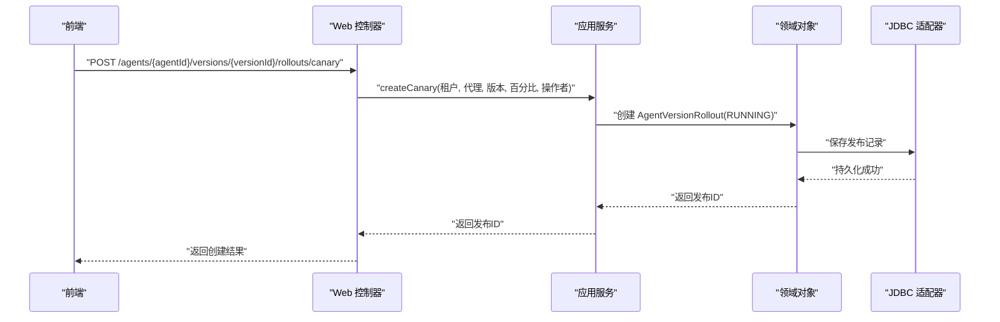

**图表来源**
- [SeahorseAgentRolloutController.java](file://seahorse-agent-adapter-web/src/main/java/com/miracle/ai/seahorse/agent/adapters/web/SeahorseAgentRolloutController.java)
- [KernelAgentRolloutService.java](file://seahorse-agent-kernel/src/main/java/com/miracle/ai/seahorse/agent/kernel/application/agent/rollout/KernelAgentRolloutService.java)
- [AgentVersionRollout.java](file://seahorse-agent-kernel/src/main/java/com/miracle/ai/seahorse/agent/kernel/domain/agent/rollout/AgentVersionRollout.java)
- [JdbcAgentDefinitionRepositoryAdapter.java](file://seahorse-agent-adapter-repository-jdbc/src/main/java/com/miracle/ai/seahorse/agent/adapters/repository/jdbc/JdbcAgentDefinitionRepositoryAdapter.java)

## 技能管理领域模型

### 技能定义（AgentSkill）
- 定义与职责：描述技能的基本信息、分类、来源、状态、启用状态等
- 关键属性：技能名称、租户 ID、分类、来源、状态、启用状态、最新修订 ID、描述、标签、允许的工具列表等
- 名称规范：小写、连字符格式，3-128字符，必须以字母数字开头和结尾
- 分类枚举：PUBLIC（公共）、CUSTOM（自定义）
- 状态枚举：ACTIVE（激活）、DISABLED（禁用）、DELETED（删除）

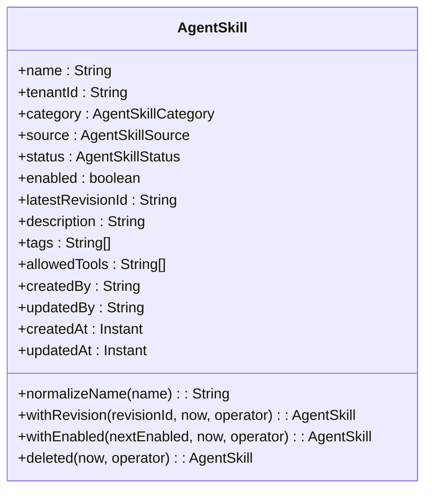

**图表来源**
- [AgentSkill.java](file://seahorse-agent-kernel/src/main/java/com/miracle/ai/seahorse/agent/kernel/domain/agent/skill/AgentSkill.java)
- [AgentSkillCategory.java](file://seahorse-agent-kernel/src/main/java/com/miracle/ai/seahorse/agent/kernel/domain/agent/skill/AgentSkillCategory.java)
- [AgentSkillStatus.java](file://seahorse-agent-kernel/src/main/java/com/miracle/ai/seahorse/agent/kernel/domain/agent/skill/AgentSkillStatus.java)
- [AgentSkillSource.java](file://seahorse-agent-kernel/src/main/java/com/miracle/ai/seahorse/agent/kernel/domain/agent/skill/AgentSkillSource.java)

### 技能修订（AgentSkillRevision）
- 定义与职责：记录技能的修订历史，包含内容、哈希值、扫描结果等
- 关键属性：修订 ID、技能名称、租户 ID、修订号、内容哈希、内容、前置信息、扫描决策、扫描结果、创建者、创建时间
- 修订号必须大于 0
- 内容哈希：使用 SHA-256 计算内容哈希值
- 扫描决策：ALLOW（允许）、WARN（警告）、BLOCK（阻止）

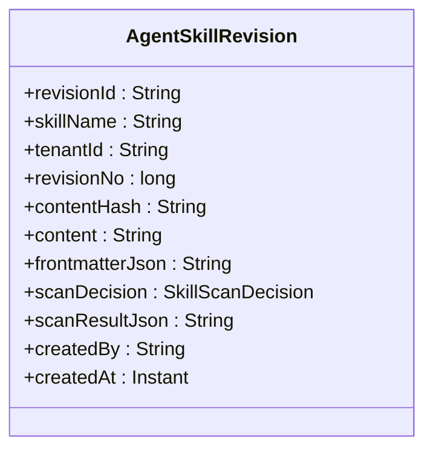

**图表来源**
- [AgentSkillRevision.java](file://seahorse-agent-kernel/src/main/java/com/miracle/ai/seahorse/agent/kernel/domain/agent/skill/AgentSkillRevision.java)
- [SkillScanDecision.java](file://seahorse-agent-kernel/src/main/java/com/miracle/ai/seahorse/agent/kernel/domain/agent/skill/SkillScanDecision.java)

### 技能绑定（AgentSkillBinding）
- 定义与职责：将技能绑定到特定代理，指定注入模式和修订版本
- 关键属性：代理 ID、租户 ID、技能名称、修订 ID、注入模式、创建者、创建时间
- 注入模式：METADATA_ONLY（仅元数据）、METADATA_AND_BODY（元数据和正文）
- 规范化：技能名称自动标准化为 kebab-case 格式

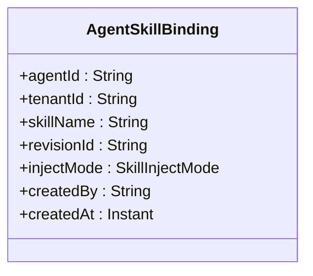

**图表来源**
- [AgentSkillBinding.java](file://seahorse-agent-kernel/src/main/java/com/miracle/ai/seahorse/agent/kernel/domain/agent/skill/AgentSkillBinding.java)
- [SkillInjectMode.java](file://seahorse-agent-kernel/src/main/java/com/miracle/ai/seahorse/agent/kernel/domain/agent/skill/SkillInjectMode.java)

### 技能管理应用服务
- 职责：提供技能的创建、更新、删除、启用、禁用、历史查询等功能
- 主要功能：
  - 创建自定义技能：解析 Markdown 文档，生成技能和修订
  - 更新自定义技能：生成新修订版本
  - 删除自定义技能：标记为删除状态
  - 启用/禁用技能：切换技能启用状态
  - 公共技能安装：导入公共技能，避免重复导入相同内容
  - 技能历史：查询技能修订历史
  - 回滚技能：基于修订 ID 回滚到指定版本

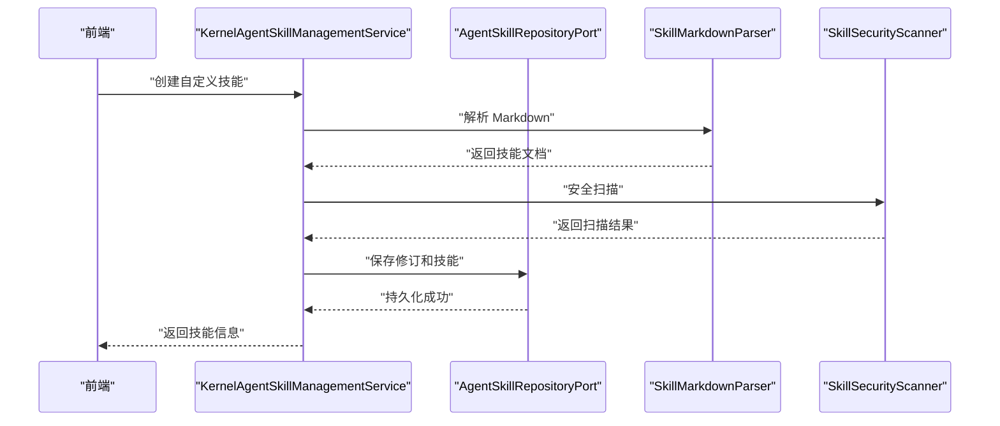

**图表来源**
- [KernelAgentSkillManagementService.java](file://seahorse-agent-kernel/src/main/java/com/miracle/ai/seahorse/agent/kernel/application/agent/skill/KernelAgentSkillManagementService.java)

### 技能绑定应用服务
- 职责：管理代理与技能的绑定关系，支持批量替换和查询
- 主要功能：
  - 列出绑定：查询代理的所有技能绑定
  - 替换绑定：批量替换代理的技能绑定
  - 快照生成：生成运行时所需的技能快照 JSON
  - 规范化：自动规范化技能名称和注入模式

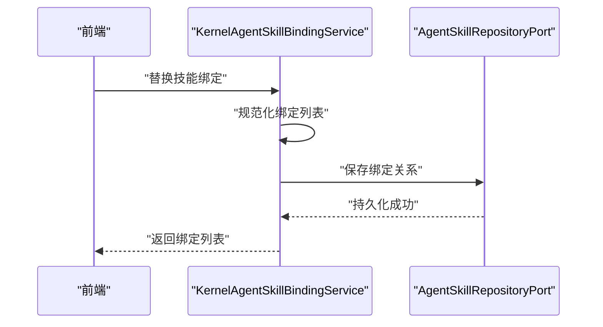

**图表来源**
- [KernelAgentSkillBindingService.java](file://seahorse-agent-kernel/src/main/java/com/miracle/ai/seahorse/agent/kernel/application/agent/skill/KernelAgentSkillBindingService.java)

**章节来源**
- [AgentSkill.java](file://seahorse-agent-kernel/src/main/java/com/miracle/ai/seahorse/agent/kernel/domain/agent/skill/AgentSkill.java)
- [AgentSkillRevision.java](file://seahorse-agent-kernel/src/main/java/com/miracle/ai/seahorse/agent/kernel/domain/agent/skill/AgentSkillRevision.java)
- [AgentSkillBinding.java](file://seahorse-agent-kernel/src/main/java/com/miracle/ai/seahorse/agent/kernel/domain/agent/skill/AgentSkillBinding.java)
- [AgentSkillCategory.java](file://seahorse-agent-kernel/src/main/java/com/miracle/ai/seahorse/agent/kernel/domain/agent/skill/AgentSkillCategory.java)
- [AgentSkillStatus.java](file://seahorse-agent-kernel/src/main/java/com/miracle/ai/seahorse/agent/kernel/domain/agent/skill/AgentSkillStatus.java)
- [AgentSkillSource.java](file://seahorse-agent-kernel/src/main/java/com/miracle/ai/seahorse/agent/kernel/domain/agent/skill/AgentSkillSource.java)
- [SkillInjectMode.java](file://seahorse-agent-kernel/src/main/java/com/miracle/ai/seahorse/agent/kernel/domain/agent/skill/SkillInjectMode.java)
- [SkillScanDecision.java](file://seahorse-agent-kernel/src/main/java/com/miracle/ai/seahorse/agent/kernel/domain/agent/skill/SkillScanDecision.java)
- [SkillRuntimeBlock.java](file://seahorse-agent-kernel/src/main/java/com/miracle/ai/seahorse/agent/kernel/domain/agent/skill/SkillRuntimeBlock.java)
- [KernelAgentSkillManagementService.java](file://seahorse-agent-kernel/src/main/java/com/miracle/ai/seahorse/agent/kernel/application/agent/skill/KernelAgentSkillManagementService.java)
- [KernelAgentSkillBindingService.java](file://seahorse-agent-kernel/src/main/java/com/miracle/ai/seahorse/agent/kernel/application/agent/skill/KernelAgentSkillBindingService.java)
- [AgentSkillBindingInboundPort.java](file://seahorse-agent-kernel/src/main/java/com/miracle/ai/seahorse/agent/ports/inbound/agent/skill/AgentSkillBindingInboundPort.java)
- [AgentSkillManagementInboundPort.java](file://seahorse-agent-kernel/src/main/java/com/miracle/ai/seahorse/agent/ports/inbound/agent/skill/AgentSkillManagementInboundPort.java)
- [AgentSkillRepositoryPort.java](file://seahorse-agent-kernel/src/main/java/com/miracle/ai/seahorse/agent/ports/outbound/agent/AgentSkillRepositoryPort.java)

## 依赖分析
- 组件耦合
  - 应用服务依赖领域对象与仓库适配器
  - Web 控制器依赖应用服务与前端契约
  - 前端服务依赖后端 API 与类型定义
  - 技能管理服务依赖 Markdown 解析器和安全扫描器
- 外部依赖
  - JDBC 适配器提供持久化能力
  - Spring Web 提供 REST 接口
  - Jackson ObjectMapper 用于 JSON 序列化
  - MessageDigest 用于内容哈希计算
- 可能的循环依赖
  - 当前结构清晰，无明显循环依赖迹象

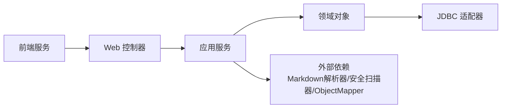

**图表来源**
- [SeahorseAgentRolloutController.java](file://seahorse-agent-adapter-web/src/main/java/com/miracle/ai/seahorse/agent/adapters/web/SeahorseAgentRolloutController.java)
- [KernelAgentRolloutService.java](file://seahorse-agent-kernel/src/main/java/com/miracle/ai/seahorse/agent/kernel/application/agent/rollout/KernelAgentRolloutService.java)
- [KernelAgentSkillManagementService.java](file://seahorse-agent-kernel/src/main/java/com/miracle/ai/seahorse/agent/kernel/application/agent/skill/KernelAgentSkillManagementService.java)
- [KernelAgentSkillBindingService.java](file://seahorse-agent-kernel/src/main/java/com/miracle/ai/seahorse/agent/kernel/application/agent/skill/KernelAgentSkillBindingService.java)
- [AgentDefinition.java](file://seahorse-agent-kernel/src/main/java/com/miracle/ai/seahorse/agent/kernel/domain/agent/definition/AgentDefinition.java)
- [AgentSkill.java](file://seahorse-agent-kernel/src/main/java/com/miracle/ai/seahorse/agent/kernel/domain/agent/skill/AgentSkill.java)
- [JdbcAgentDefinitionRepositoryAdapter.java](file://seahorse-agent-adapter-repository-jdbc/src/main/java/com/miracle/ai/seahorse/agent/adapters/repository/jdbc/JdbcAgentDefinitionRepositoryAdapter.java)
- [JdbcAgentSkillRepositoryAdapter.java](file://seahorse-agent-adapter-repository-jdbc/src/main/java/com/miracle/ai/seahorse/agent/adapters/repository/jdbc/JdbcAgentSkillRepositoryAdapter.java)

**章节来源**
- [SeahorseAgentRolloutController.java](file://seahorse-agent-adapter-web/src/main/java/com/miracle/ai/seahorse/agent/adapters/web/SeahorseAgentRolloutController.java)
- [KernelAgentRolloutService.java](file://seahorse-agent-kernel/src/main/java/com/miracle/ai/seahorse/agent/kernel/application/agent/rollout/KernelAgentRolloutService.java)
- [KernelAgentSkillManagementService.java](file://seahorse-agent-kernel/src/main/java/com/miracle/ai/seahorse/agent/kernel/application/agent/skill/KernelAgentSkillManagementService.java)
- [KernelAgentSkillBindingService.java](file://seahorse-agent-kernel/src/main/java/com/miracle/ai/seahorse/agent/kernel/application/agent/skill/KernelAgentSkillBindingService.java)
- [AgentDefinition.java](file://seahorse-agent-kernel/src/main/java/com/miracle/ai/seahorse/agent/kernel/domain/agent/definition/AgentDefinition.java)
- [AgentSkill.java](file://seahorse-agent-kernel/src/main/java/com/miracle/ai/seahorse/agent/kernel/domain/agent/skill/AgentSkill.java)
- [JdbcAgentDefinitionRepositoryAdapter.java](file://seahorse-agent-adapter-repository-jdbc/src/main/java/com/miracle/ai/seahorse/agent/adapters/repository/jdbc/JdbcAgentDefinitionRepositoryAdapter.java)
- [JdbcAgentSkillRepositoryAdapter.java](file://seahorse-agent-adapter-repository-jdbc/src/main/java/com/miracle/ai/seahorse/agent/adapters/repository/jdbc/JdbcAgentSkillRepositoryAdapter.java)

## 性能考虑
- 检查点写入：批量/异步写入可降低写放大
- 查询优化：按运行 ID、时间范围建立索引
- 灰度计算：百分比分配应幂等且可复现
- 前端缓存：对只读数据进行本地缓存，减少重复请求
- 技能内容哈希：使用 SHA-256 哈希避免重复存储相同内容
- 技能安全扫描：异步扫描避免阻塞主线程
- 技能绑定缓存：对常用技能绑定进行内存缓存

## 故障排查指南
- 灰度失败
  - 现象：Promote/回滚失败
  - 排查：检查门禁报告是否存在、目标版本是否可用、回滚目标是否匹配
  - 参考：失败码与状态转换逻辑
- 检查点丢失
  - 现象：运行中断后无法恢复
  - 排查：确认检查点保存是否成功、数据库连接与事务配置
- 产物缺失
  - 现象：运行完成但产物未生成
  - 排查：确认产物创建流程、存储引用与 MIME 类型
- 技能导入失败
  - 现象：技能导入报错
  - 排查：检查 Markdown 格式、安全扫描结果、内容哈希验证
- 技能绑定错误
  - 现象：技能绑定不生效
  - 排查：确认技能名称规范化、修订 ID 存在、注入模式正确

**章节来源**
- [KernelAgentRolloutService.java](file://seahorse-agent-kernel/src/main/java/com/miracle/ai/seahorse/agent/kernel/application/agent/rollout/KernelAgentRolloutService.java)
- [AgentVersionRollout.java](file://seahorse-agent-kernel/src/main/java/com/miracle/ai/seahorse/agent/kernel/domain/agent/rollout/AgentVersionRollout.java)
- [AgentRolloutFailureCode.java](file://seahorse-agent-kernel/src/main/java/com/miracle/ai/seahorse/agent/kernel/domain/agent/rollout/AgentRolloutFailureCode.java)
- [KernelAgentSkillManagementService.java](file://seahorse-agent-kernel/src/main/java/com/miracle/ai/seahorse/agent/kernel/application/agent/skill/KernelAgentSkillManagementService.java)
- [KernelAgentSkillBindingService.java](file://seahorse-agent-kernel/src/main/java/com/miracle/ai/seahorse/agent/kernel/application/agent/skill/KernelAgentSkillBindingService.java)
- [JdbcAgentCheckpointRepositoryAdapter.java](file://seahorse-agent-adapter-repository-jdbc/src/main/java/com/miracle/ai/seahorse/agent/adapters/repository/jdbc/JdbcAgentCheckpointRepositoryAdapter.java)
- [JdbcAgentArtifactRepositoryAdapter.java](file://seahorse-agent-adapter-repository-jdbc/src/main/java/com/miracle/ai/seahorse/agent/adapters/repository/jdbc/JdbcAgentArtifactRepositoryAdapter.java)
- [JdbcAgentSkillRepositoryAdapter.java](file://seahorse-agent-adapter-repository-jdbc/src/main/java/com/miracle/ai/seahorse/agent/adapters/repository/jdbc/JdbcAgentSkillRepositoryAdapter.java)

## 结论
本领域模型以"定义—运行—产物—发布/灰度—技能管理"为主线，实现了代理生命周期的闭环管理。通过检查点与产物的细粒度建模，结合灰度发布与状态机，满足多版本并存、灰度发布与回滚等高级需求。新增的技能管理模块提供了完整的技能生命周期管理，包括技能创建、修订、绑定、安全扫描等功能，支持代理的灵活扩展和组合。建议在生产环境中强化持久化与可观测性，确保状态一致性与可追溯性。

## 附录
- 前端类型与服务参考
  - 代理定义类型：[agentDefinitionService.ts](file://frontend/src/services/agentDefinitionService.ts)
  - 代理产物类型与服务：[agentArtifactService.ts](file://frontend/src/services/agentArtifactService.ts)，[index.ts](file://frontend/src/types/index.ts)
- 关键实现参考
  - 代理定义与状态：[AgentDefinition.java](file://seahorse-agent-kernel/src/main/java/com/miracle/ai/seahorse/agent/kernel/domain/agent/definition/AgentDefinition.java)，[AgentStatus.java](file://seahorse-agent-kernel/src/main/java/com/miracle/ai/seahorse/agent/kernel/domain/agent/definition/AgentStatus.java)
  - 运行与检查点：[AgentRun.java](file://seahorse-agent-kernel/src/main/java/com/miracle/ai/seahorse/agent/kernel/domain/agent/runtime/AgentRun.java)，[AgentCheckpoint.java](file://seahorse-agent-kernel/src/main/java/com/miracle/ai/seahorse/agent/kernel/domain/agent/runtime/AgentCheckpoint.java)，[AgentCheckpointType.java](file://seahorse-agent-kernel/src/main/java/com/miracle/ai/seahorse/agent/kernel/domain/agent/runtime/AgentCheckpointType.java)
  - 产物：[AgentArtifact.java](file://seahorse-agent-kernel/src/main/java/com/miracle/ai/seahorse/agent/kernel/domain/agent/artifact/AgentArtifact.java)，[AgentArtifactType.java](file://seahorse-agent-kernel/src/main/java/com/miracle/ai/seahorse/agent/kernel/domain/agent/artifact/AgentArtifactType.java)
  - 发布与灰度：[KernelAgentRolloutService.java](file://seahorse-agent-kernel/src/main/java/com/miracle/ai/seahorse/agent/kernel/application/agent/rollout/KernelAgentRolloutService.java)，[AgentVersionRollout.java](file://seahorse-agent-kernel/src/main/java/com/miracle/ai/seahorse/agent/kernel/domain/agent/rollout/AgentVersionRollout.java)，[AgentRolloutStatus.java](file://seahorse-agent-kernel/src/main/java/com/miracle/ai/seahorse/agent/kernel/domain/agent/rollout/AgentRolloutStatus.java)，[AgentRolloutFailureCode.java](file://seahorse-agent-kernel/src/main/java/com/miracle/ai/seahorse/agent/kernel/domain/agent/rollout/AgentRolloutFailureCode.java)
  - 技能管理：[KernelAgentSkillManagementService.java](file://seahorse-agent-kernel/src/main/java/com/miracle/ai/seahorse/agent/kernel/application/agent/skill/KernelAgentSkillManagementService.java)，[KernelAgentSkillBindingService.java](file://seahorse-agent-kernel/src/main/java/com/miracle/ai/seahorse/agent/kernel/application/agent/skill/KernelAgentSkillBindingService.java)
  - 技能领域模型：[AgentSkill.java](file://seahorse-agent-kernel/src/main/java/com/miracle/ai/seahorse/agent/kernel/domain/agent/skill/AgentSkill.java)，[AgentSkillRevision.java](file://seahorse-agent-kernel/src/main/java/com/miracle/ai/seahorse/agent/kernel/domain/agent/skill/AgentSkillRevision.java)，[AgentSkillBinding.java](file://seahorse-agent-kernel/src/main/java/com/miracle/ai/seahorse/agent/kernel/domain/agent/skill/AgentSkillBinding.java)
  - 技能枚举：[AgentSkillCategory.java](file://seahorse-agent-kernel/src/main/java/com/miracle/ai/seahorse/agent/kernel/domain/agent/skill/AgentSkillCategory.java)，[AgentSkillStatus.java](file://seahorse-agent-kernel/src/main/java/com/miracle/ai/seahorse/agent/kernel/domain/agent/skill/AgentSkillStatus.java)，[AgentSkillSource.java](file://seahorse-agent-kernel/src/main/java/com/miracle/ai/seahorse/agent/kernel/domain/agent/skill/AgentSkillSource.java)，[SkillInjectMode.java](file://seahorse-agent-kernel/src/main/java/com/miracle/ai/seahorse/agent/kernel/domain/agent/skill/SkillInjectMode.java)，[SkillScanDecision.java](file://seahorse-agent-kernel/src/main/java/com/miracle/ai/seahorse/agent/kernel/domain/agent/skill/SkillScanDecision.java)
  - 适配器与控制器：[JdbcAgentDefinitionRepositoryAdapter.java](file://seahorse-agent-adapter-repository-jdbc/src/main/java/com/miracle/ai/seahorse/agent/adapters/repository/jdbc/JdbcAgentDefinitionRepositoryAdapter.java)，[JdbcAgentRunRepositoryAdapter.java](file://seahorse-agent-adapter-repository-jdbc/src/main/java/com/miracle/ai/seahorse/agent/adapters/repository/jdbc/JdbcAgentRunRepositoryAdapter.java)，[JdbcAgentCheckpointRepositoryAdapter.java](file://seahorse-agent-adapter-repository-jdbc/src/main/java/com/miracle/ai/seahorse/agent/adapters/repository/jdbc/JdbcAgentCheckpointRepositoryAdapter.java)，[JdbcAgentArtifactRepositoryAdapter.java](file://seahorse-agent-adapter-repository-jdbc/src/main/java/com/miracle/ai/seahorse/agent/adapters/repository/jdbc/JdbcAgentArtifactRepositoryAdapter.java)，[JdbcAgentSkillRepositoryAdapter.java](file://seahorse-agent-adapter-repository-jdbc/src/main/java/com/miracle/ai/seahorse/agent/adapters/repository/jdbc/JdbcAgentSkillRepositoryAdapter.java)，[SeahorseAgentRolloutController.java](file://seahorse-agent-adapter-web/src/main/java/com/miracle/ai/seahorse/agent/adapters/web/SeahorseAgentRolloutController.java)