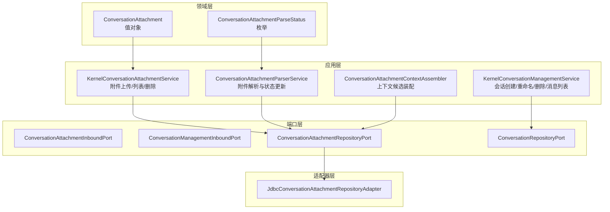
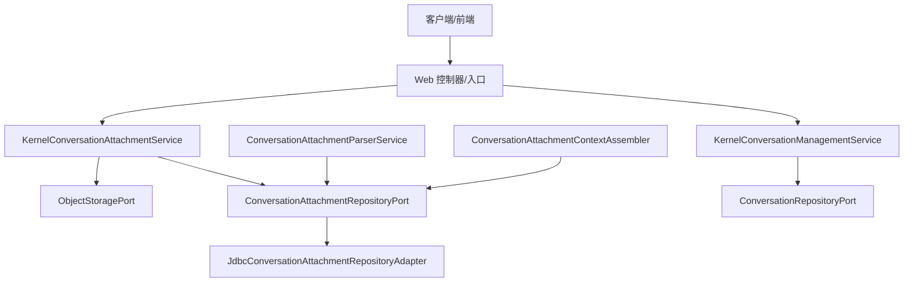
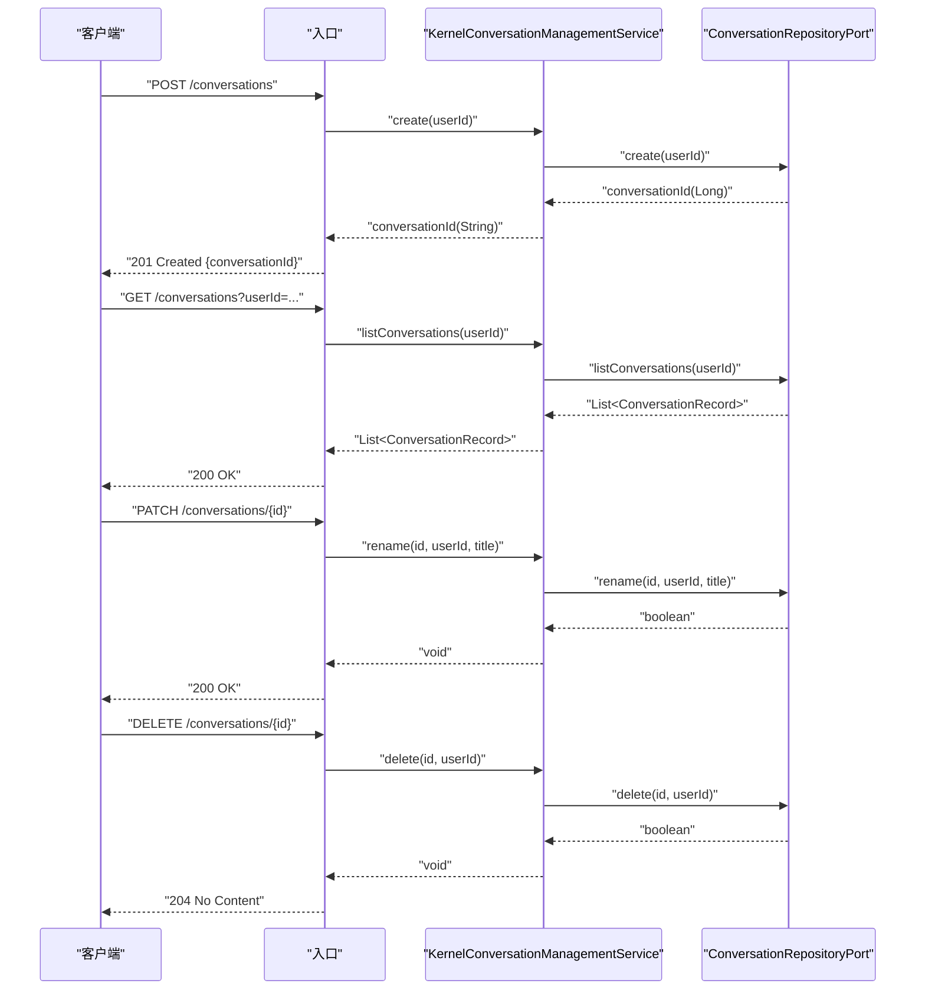
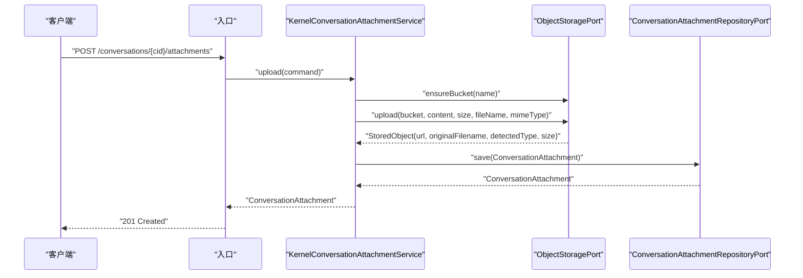
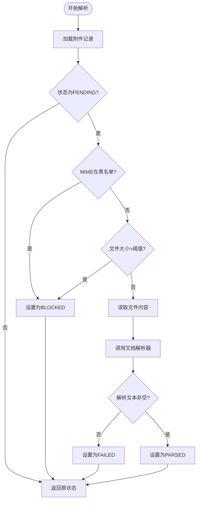
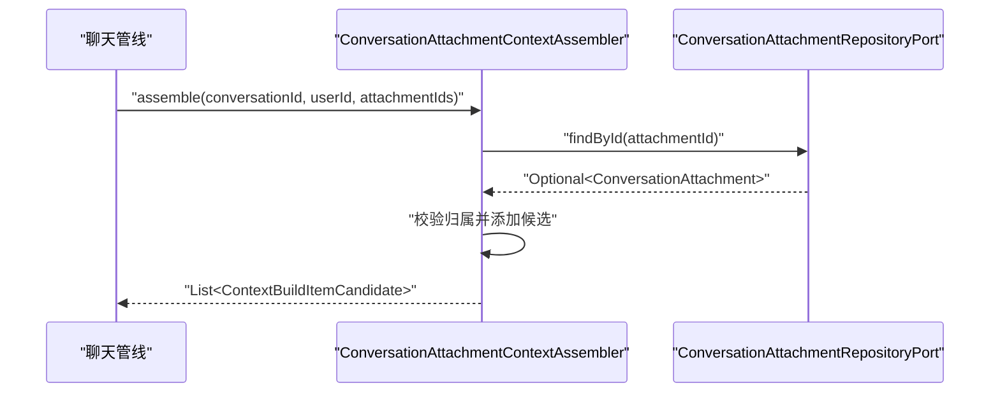
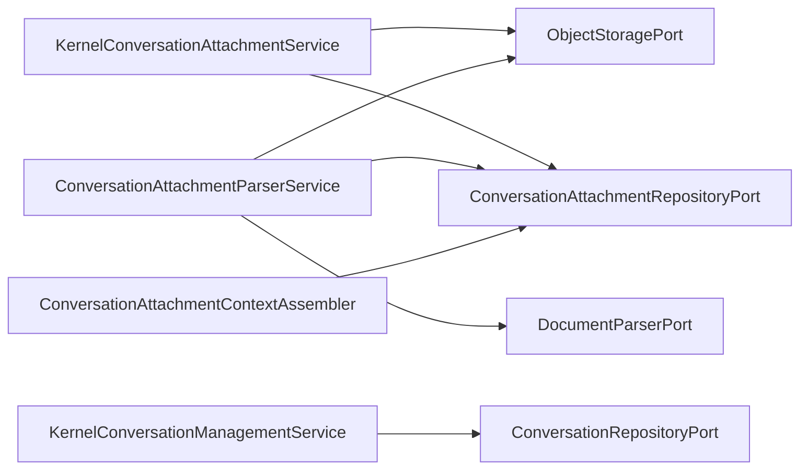

# 会话领域模型

<cite>
**本文引用的文件**
- [ConversationAttachment.java](file://seahorse-agent-kernel/src/main/java/com/miracle/ai/seahorse/agent/kernel/domain/conversation/ConversationAttachment.java)
- [ConversationAttachmentParseStatus.java](file://seahorse-agent-kernel/src/main/java/com/miracle/ai/seahorse/agent/kernel/domain/conversation/ConversationAttachmentParseStatus.java)
- [KernelConversationAttachmentService.java](file://seahorse-agent-kernel/src/main/java/com/miracle/ai/seahorse/agent/kernel/application/conversation/KernelConversationAttachmentService.java)
- [ConversationAttachmentParserService.java](file://seahorse-agent-kernel/src/main/java/com/miracle/ai/seahorse/agent/kernel/application/conversation/ConversationAttachmentParserService.java)
- [KernelConversationManagementService.java](file://seahorse-agent-kernel/src/main/java/com/miracle/ai/seahorse/agent/kernel/application/conversation/KernelConversationManagementService.java)
- [ConversationAttachmentContextAssembler.java](file://seahorse-agent-kernel/src/main/java/com/miracle/ai/seahorse/agent/kernel/application/chat/ConversationAttachmentContextAssembler.java)
- [ConversationAttachmentInboundPort.java](file://seahorse-agent-kernel/src/main/java/com/miracle/ai/seahorse/agent/ports/inbound/conversation/ConversationAttachmentInboundPort.java)
- [ConversationManagementInboundPort.java](file://seahorse-agent-kernel/src/main/java/com/miracle/ai/seahorse/agent/ports/inbound/conversation/ConversationManagementInboundPort.java)
- [ConversationAttachmentRepositoryPort.java](file://seahorse-agent-kernel/src/main/java/com/miracle/ai/seahorse/agent/ports/outbound/conversation/ConversationAttachmentRepositoryPort.java)
- [ConversationRepositoryPort.java](file://seahorse-agent-kernel/src/main/java/com/miracle/ai/seahorse/agent/ports/outbound/conversation/ConversationRepositoryPort.java)
- [JdbcConversationAttachmentRepositoryAdapter.java](file://seahorse-agent-adapter-repository-jdbc/src/main/java/com/miracle/ai/seahorse/agent/adapters/repository/jdbc/JdbcConversationAttachmentRepositoryAdapter.java)
- [SeahorseConversationAttachmentControllerTests.java](file://seahorse-agent-adapter-web/src/test/java/com/miracle/ai/seahorse/agent/adapters/web/SeahorseConversationAttachmentControllerTests.java)
</cite>

## 目录
1. [引言](#引言)
2. [项目结构](#项目结构)
3. [核心组件](#核心组件)
4. [架构总览](#架构总览)
5. [详细组件分析](#详细组件分析)
6. [依赖分析](#依赖分析)
7. [性能考虑](#性能考虑)
8. [故障排查指南](#故障排查指南)
9. [结论](#结论)
10. [附录](#附录)

## 引言
本文件系统化梳理“会话领域模型”的设计与实现，聚焦于会话(CONVERSATION)、消息附件(MessageAttachment)与内容解析(AttachmentParser)三大核心实体及其业务规则。文档覆盖会话生命周期管理（创建、重命名、删除、消息列表）、附件上传/下载/删除、内容解析与状态机、存储策略、与用户及工具调用的关系，并提供流程图与数据流图帮助理解从创建到结束的完整生命周期。同时给出多模态内容支持、文件上传下载、内容安全检查、会话历史查询与检索、附件管理的最佳实践与示例路径。

## 项目结构
围绕会话与附件的关键模块分布如下：
- 领域层(domain): 定义不可变值对象与枚举，确保业务规则内聚
- 应用层(application): 提供会话管理与附件管理的用例实现
- 端口层(ports): 定义入站/出站端口契约，解耦实现
- 适配器层(adapters): JDBC仓储适配器、对象存储适配器、Web控制器测试等

图表来源
- [ConversationAttachment.java:23-67](file://seahorse-agent-kernel/src/main/java/com/miracle/ai/seahorse/agent/kernel/domain/conversation/ConversationAttachment.java#L23-L67)
- [ConversationAttachmentParseStatus.java:20-25](file://seahorse-agent-kernel/src/main/java/com/miracle/ai/seahorse/agent/kernel/domain/conversation/ConversationAttachmentParseStatus.java#L20-L25)
- [KernelConversationAttachmentService.java:36-128](file://seahorse-agent-kernel/src/main/java/com/miracle/ai/seahorse/agent/kernel/application/conversation/KernelConversationAttachmentService.java#L36-L128)
- [ConversationAttachmentParserService.java:42-125](file://seahorse-agent-kernel/src/main/java/com/miracle/ai/seahorse/agent/kernel/application/conversation/ConversationAttachmentParserService.java#L42-L125)
- [KernelConversationManagementService.java:31-94](file://seahorse-agent-kernel/src/main/java/com/miracle/ai/seahorse/agent/kernel/application/conversation/KernelConversationManagementService.java#L31-L94)
- [ConversationAttachmentContextAssembler.java:76-100](file://seahorse-agent-kernel/src/main/java/com/miracle/ai/seahorse/agent/kernel/application/chat/ConversationAttachmentContextAssembler.java#L76-L100)
- [ConversationAttachmentRepositoryPort.java](file://seahorse-agent-kernel/src/main/java/com/miracle/ai/seahorse/agent/ports/outbound/conversation/ConversationAttachmentRepositoryPort.java)
- [ConversationRepositoryPort.java](file://seahorse-agent-kernel/src/main/java/com/miracle/ai/seahorse/agent/ports/outbound/conversation/ConversationRepositoryPort.java)
- [JdbcConversationAttachmentRepositoryAdapter.java:122-175](file://seahorse-agent-adapter-repository-jdbc/src/main/java/com/miracle/ai/seahorse/agent/adapters/repository/jdbc/JdbcConversationAttachmentRepositoryAdapter.java#L122-L175)

章节来源
- [KernelConversationAttachmentService.java:36-128](file://seahorse-agent-kernel/src/main/java/com/miracle/ai/seahorse/agent/kernel/application/conversation/KernelConversationAttachmentService.java#L36-L128)
- [KernelConversationManagementService.java:31-94](file://seahorse-agent-kernel/src/main/java/com/miracle/ai/seahorse/agent/kernel/application/conversation/KernelConversationManagementService.java#L31-L94)
- [ConversationAttachmentContextAssembler.java:76-100](file://seahorse-agent-kernel/src/main/java/com/miracle/ai/seahorse/agent/kernel/application/chat/ConversationAttachmentContextAssembler.java#L76-L100)

## 核心组件
- 会话管理服务(KernelConversationManagementService)
  - 负责会话的创建、重命名、删除、消息列表查询
  - 对输入进行校验（如标题长度限制），并委托仓储端口完成持久化
- 会话附件服务(KernelConversationAttachmentService)
  - 实现附件上传、列表查询、删除；封装对象存储桶、资源引用JSON构建、雪花ID生成
- 附件解析服务(ConversationAttachmentParserService)
  - 将附件从PENDING推进到PARSED/FAILED/BLOCKED，基于MIME类型与大小进行安全检查
- 上下文装配器(ConversationAttachmentContextAssembler)
  - 按会话与附件ID集合装配上下文候选，限制附件数量，校验归属关系
- 领域对象与枚举
  - ConversationAttachment：不可变值对象，包含附件元数据、解析状态、资源引用等
  - ConversationAttachmentParseStatus：解析状态枚举（PENDING/PARSED/FAILED/BLOCKED）

章节来源
- [KernelConversationManagementService.java:31-94](file://seahorse-agent-kernel/src/main/java/com/miracle/ai/seahorse/agent/kernel/application/conversation/KernelConversationManagementService.java#L31-L94)
- [KernelConversationAttachmentService.java:36-128](file://seahorse-agent-kernel/src/main/java/com/miracle/ai/seahorse/agent/kernel/application/conversation/KernelConversationAttachmentService.java#L36-L128)
- [ConversationAttachmentParserService.java:42-125](file://seahorse-agent-kernel/src/main/java/com/miracle/ai/seahorse/agent/kernel/application/conversation/ConversationAttachmentParserService.java#L42-L125)
- [ConversationAttachmentContextAssembler.java:76-100](file://seahorse-agent-kernel/src/main/java/com/miracle/ai/seahorse/agent/kernel/application/chat/ConversationAttachmentContextAssembler.java#L76-L100)
- [ConversationAttachment.java:23-67](file://seahorse-agent-kernel/src/main/java/com/miracle/ai/seahorse/agent/kernel/domain/conversation/ConversationAttachment.java#L23-L67)
- [ConversationAttachmentParseStatus.java:20-25](file://seahorse-agent-kernel/src/main/java/com/miracle/ai/seahorse/agent/kernel/domain/conversation/ConversationAttachmentParseStatus.java#L20-L25)

## 架构总览
会话领域采用“分层+端口适配器”架构：
- 入站端口定义对外API（会话管理、附件管理）
- 应用服务实现用例逻辑，编排仓储与外部能力（对象存储、文档解析）
- 领域对象承载不变性与业务规则
- 出站端口对接具体实现（JDBC仓储、对象存储、文档解析器）

图表来源
- [KernelConversationManagementService.java:31-94](file://seahorse-agent-kernel/src/main/java/com/miracle/ai/seahorse/agent/kernel/application/conversation/KernelConversationManagementService.java#L31-L94)
- [KernelConversationAttachmentService.java:36-128](file://seahorse-agent-kernel/src/main/java/com/miracle/ai/seahorse/agent/kernel/application/conversation/KernelConversationAttachmentService.java#L36-L128)
- [ConversationAttachmentParserService.java:42-125](file://seahorse-agent-kernel/src/main/java/com/miracle/ai/seahorse/agent/kernel/application/conversation/ConversationAttachmentParserService.java#L42-L125)
- [ConversationAttachmentContextAssembler.java:76-100](file://seahorse-agent-kernel/src/main/java/com/miracle/ai/seahorse/agent/kernel/application/chat/ConversationAttachmentContextAssembler.java#L76-L100)
- [ConversationAttachmentRepositoryPort.java](file://seahorse-agent-kernel/src/main/java/com/miracle/ai/seahorse/agent/ports/outbound/conversation/ConversationAttachmentRepositoryPort.java)
- [ConversationRepositoryPort.java](file://seahorse-agent-kernel/src/main/java/com/miracle/ai/seahorse/agent/ports/outbound/conversation/ConversationRepositoryPort.java)
- [JdbcConversationAttachmentRepositoryAdapter.java:122-175](file://seahorse-agent-adapter-repository-jdbc/src/main/java/com/miracle/ai/seahorse/agent/adapters/repository/jdbc/JdbcConversationAttachmentRepositoryAdapter.java#L122-L175)

## 详细组件分析

### 会话生命周期管理
- 创建：校验用户ID非空，调用仓储创建会话并返回会话ID字符串
- 列表：按用户ID查询会话列表
- 重命名：校验标题非空且长度不超过上限，委托仓储更新
- 删除：校验存在性后删除
- 消息列表：按会话ID与用户ID查询消息记录

图表来源
- [KernelConversationManagementService.java:41-79](file://seahorse-agent-kernel/src/main/java/com/miracle/ai/seahorse/agent/kernel/application/conversation/KernelConversationManagementService.java#L41-L79)
- [ConversationManagementInboundPort.java:25-39](file://seahorse-agent-kernel/src/main/java/com/miracle/ai/seahorse/agent/ports/inbound/conversation/ConversationManagementInboundPort.java#L25-L39)
- [ConversationRepositoryPort.java:25-36](file://seahorse-agent-kernel/src/main/java/com/miracle/ai/seahorse/agent/ports/outbound/conversation/ConversationRepositoryPort.java#L25-L36)

章节来源
- [KernelConversationManagementService.java:31-94](file://seahorse-agent-kernel/src/main/java/com/miracle/ai/seahorse/agent/kernel/application/conversation/KernelConversationManagementService.java#L31-L94)
- [ConversationManagementInboundPort.java:25-39](file://seahorse-agent-kernel/src/main/java/com/miracle/ai/seahorse/agent/ports/inbound/conversation/ConversationManagementInboundPort.java#L25-L39)
- [ConversationRepositoryPort.java:25-36](file://seahorse-agent-kernel/src/main/java/com/miracle/ai/seahorse/agent/ports/outbound/conversation/ConversationRepositoryPort.java#L25-L36)

### 附件上传与存储策略
- 上传流程：校验命令参数，确保对象存储桶存在，上传至对象存储，生成附件ID与资源引用JSON，保存到仓储
- 存储策略：默认桶名“conversation-attachments”，默认MIME类型为二进制，文件名优先使用请求中的名称，否则使用存储检测名称
- 安全与合规：通过资源引用JSON记录附件归属（会话ID、用户ID、存储URL），便于后续审计与权限控制

图表来源
- [KernelConversationAttachmentService.java:53-77](file://seahorse-agent-kernel/src/main/java/com/miracle/ai/seahorse/agent/kernel/application/conversation/KernelConversationAttachmentService.java#L53-L77)
- [ConversationAttachmentInboundPort.java](file://seahorse-agent-kernel/src/main/java/com/miracle/ai/seahorse/agent/ports/inbound/conversation/ConversationAttachmentInboundPort.java)
- [ConversationAttachmentRepositoryPort.java](file://seahorse-agent-kernel/src/main/java/com/miracle/ai/seahorse/agent/ports/outbound/conversation/ConversationAttachmentRepositoryPort.java)

章节来源
- [KernelConversationAttachmentService.java:36-128](file://seahorse-agent-kernel/src/main/java/com/miracle/ai/seahorse/agent/kernel/application/conversation/KernelConversationAttachmentService.java#L36-L128)

### 附件解析与状态机
- 状态机：PENDING → PARSING → PARSED/FAILED/BLOCKED
- 安全检查：黑名单MIME类型、超大文件阻断
- 内容解析：从对象存储读取内容，调用文档解析器产出文本，若为空则标记FAILED，否则标记PARSED
- 结果回写：更新附件解析状态与资源引用JSON

图表来源
- [ConversationAttachmentParserService.java:69-109](file://seahorse-agent-kernel/src/main/java/com/miracle/ai/seahorse/agent/kernel/application/conversation/ConversationAttachmentParserService.java#L69-L109)
- [ConversationAttachment.java:23-67](file://seahorse-agent-kernel/src/main/java/com/miracle/ai/seahorse/agent/kernel/domain/conversation/ConversationAttachment.java#L23-L67)
- [ConversationAttachmentParseStatus.java:20-25](file://seahorse-agent-kernel/src/main/java/com/miracle/ai/seahorse/agent/kernel/domain/conversation/ConversationAttachmentParseStatus.java#L20-L25)

章节来源
- [ConversationAttachmentParserService.java:42-125](file://seahorse-agent-kernel/src/main/java/com/miracle/ai/seahorse/agent/kernel/application/conversation/ConversationAttachmentParserService.java#L42-L125)

### 附件上下文装配与多模态支持
- 装配流程：根据会话ID、用户ID与附件ID列表，限制最大附件数，逐个校验附件归属并生成上下文候选
- 多模态支持：解析器输出文本作为上下文素材，可扩展为图像/音频等多模态向量索引或关键词索引（由上层ContextPack装配器决定）

图表来源
- [ConversationAttachmentContextAssembler.java:86-100](file://seahorse-agent-kernel/src/main/java/com/miracle/ai/seahorse/agent/kernel/application/chat/ConversationAttachmentContextAssembler.java#L86-L100)
- [ConversationAttachmentRepositoryPort.java](file://seahorse-agent-kernel/src/main/java/com/miracle/ai/seahorse/agent/ports/outbound/conversation/ConversationAttachmentRepositoryPort.java)

章节来源
- [ConversationAttachmentContextAssembler.java:76-100](file://seahorse-agent-kernel/src/main/java/com/miracle/ai/seahorse/agent/kernel/application/chat/ConversationAttachmentContextAssembler.java#L76-L100)

### 会话与用户、工具调用、内存管理的关系
- 用户边界：所有操作均以用户ID作为安全边界，附件删除时校验归属
- 工具调用：会话ID与用户ID可用于工具参数中，例如记忆检索工具通过会话维度限定检索范围
- 内存管理：工具调用可触发短期记忆的读取/遗忘，会话作为记忆的组织单元之一

章节来源
- [KernelConversationAttachmentService.java:88-98](file://seahorse-agent-kernel/src/main/java/com/miracle/ai/seahorse/agent/kernel/application/conversation/KernelConversationAttachmentService.java#L88-L98)
- [KernelConversationManagementService.java:58-79](file://seahorse-agent-kernel/src/main/java/com/miracle/ai/seahorse/agent/kernel/application/conversation/KernelConversationManagementService.java#L58-L79)

## 依赖分析
- 组件内聚与解耦
  - 应用服务仅编排端口，不直接依赖具体实现，降低耦合
  - 领域对象保持不变性，业务规则集中在构造器与方法中
- 关键依赖链
  - KernelConversationAttachmentService → ObjectStoragePort → ConversationAttachmentRepositoryPort
  - ConversationAttachmentParserService → ObjectStoragePort → DocumentParserPort → ConversationAttachmentRepositoryPort
  - KernelConversationManagementService → ConversationRepositoryPort
- 可能的循环依赖
  - 当前未发现循环依赖；端口接口清晰分离了入站/出站职责

图表来源
- [KernelConversationAttachmentService.java:44-51](file://seahorse-agent-kernel/src/main/java/com/miracle/ai/seahorse/agent/kernel/application/conversation/KernelConversationAttachmentService.java#L44-L51)
- [ConversationAttachmentParserService.java:54-64](file://seahorse-agent-kernel/src/main/java/com/miracle/ai/seahorse/agent/kernel/application/conversation/ConversationAttachmentParserService.java#L54-L64)
- [KernelConversationManagementService.java:35-39](file://seahorse-agent-kernel/src/main/java/com/miracle/ai/seahorse/agent/kernel/application/conversation/KernelConversationManagementService.java#L35-L39)
- [ConversationAttachmentContextAssembler.java:76-80](file://seahorse-agent-kernel/src/main/java/com/miracle/ai/seahorse/agent/kernel/application/chat/ConversationAttachmentContextAssembler.java#L76-L80)

章节来源
- [ConversationAttachmentRepositoryPort.java:25-36](file://seahorse-agent-kernel/src/main/java/com/miracle/ai/seahorse/agent/ports/outbound/conversation/ConversationAttachmentRepositoryPort.java#L25-L36)
- [ConversationRepositoryPort.java:25-36](file://seahorse-agent-kernel/src/main/java/com/miracle/ai/seahorse/agent/ports/outbound/conversation/ConversationRepositoryPort.java#L25-L36)

## 性能考虑
- 附件解析阈值
  - 最大文件大小限制与黑名单MIME类型可有效避免高开销解析与潜在风险文件
- 读取与解析
  - 限制单次读取字节数，避免内存峰值过高
- 批处理与并发
  - 解析服务建议异步化，结合队列或工作流调度，避免阻塞主线程
- 存储与索引
  - 大文件建议采用分块/流式处理，解析后的文本可进入关键词索引或向量库，提升检索效率

## 故障排查指南
- 附件不存在或无权限
  - 删除附件时若未找到或归属不符，抛出异常；请确认附件ID与用户ID正确
- 解析失败
  - 若解析器返回空文本或运行时异常，状态将置为FAILED；检查对象存储URL与MIME类型
- 存储桶问题
  - 上传前需确保桶存在；若失败，请检查对象存储配置与权限
- 仓储映射异常
  - JDBC适配器映射字段顺序与数据库一致，若出现异常请核对SQL与字段映射

章节来源
- [KernelConversationAttachmentService.java:88-98](file://seahorse-agent-kernel/src/main/java/com/miracle/ai/seahorse/agent/kernel/application/conversation/KernelConversationAttachmentService.java#L88-L98)
- [ConversationAttachmentParserService.java:104-108](file://seahorse-agent-kernel/src/main/java/com/miracle/ai/seahorse/agent/kernel/application/conversation/ConversationAttachmentParserService.java#L104-L108)
- [JdbcConversationAttachmentRepositoryAdapter.java:149-170](file://seahorse-agent-adapter-repository-jdbc/src/main/java/com/miracle/ai/seahorse/agent/adapters/repository/jdbc/JdbcConversationAttachmentRepositoryAdapter.java#L149-L170)

## 结论
本会话领域模型以不可变值对象为核心，配合应用服务与端口解耦，实现了从会话生命周期管理到附件上传、解析、上下文装配的完整闭环。通过严格的输入校验、安全检查与状态机管理，保障了系统的可靠性与安全性。建议在生产环境中结合异步解析、限流与可观测性，持续优化性能与稳定性。

## 附录
- 会话历史查询与内容检索
  - 使用会话ID与用户ID查询消息列表，结合附件解析结果进行检索
  - 示例路径参考：[KernelConversationManagementService.java:74-79](file://seahorse-agent-kernel/src/main/java/com/miracle/ai/seahorse/agent/kernel/application/conversation/KernelConversationManagementService.java#L74-L79)
- 附件管理最佳实践
  - 上传前校验MIME类型与大小，使用默认二进制类型兜底
  - 通过资源引用JSON记录归属，便于权限审计
  - 示例路径参考：[KernelConversationAttachmentService.java:53-77](file://seahorse-agent-kernel/src/main/java/com/miracle/ai/seahorse/agent/kernel/application/conversation/KernelConversationAttachmentService.java#L53-L77)
- Web控制器测试参考
  - 单元测试中构造附件对象与端口提供者，验证控制器行为
  - 示例路径参考：[SeahorseConversationAttachmentControllerTests.java:94-107](file://seahorse-agent-adapter-web/src/test/java/com/miracle/ai/seahorse/agent/adapters/web/SeahorseConversationAttachmentControllerTests.java#L94-L107)