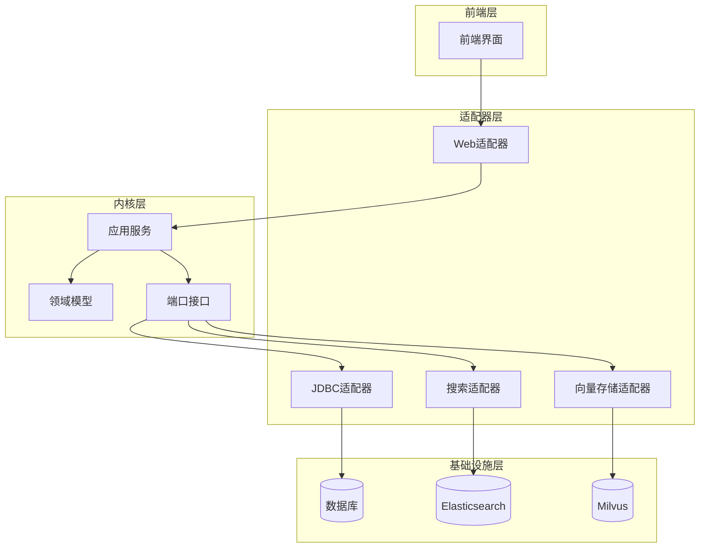
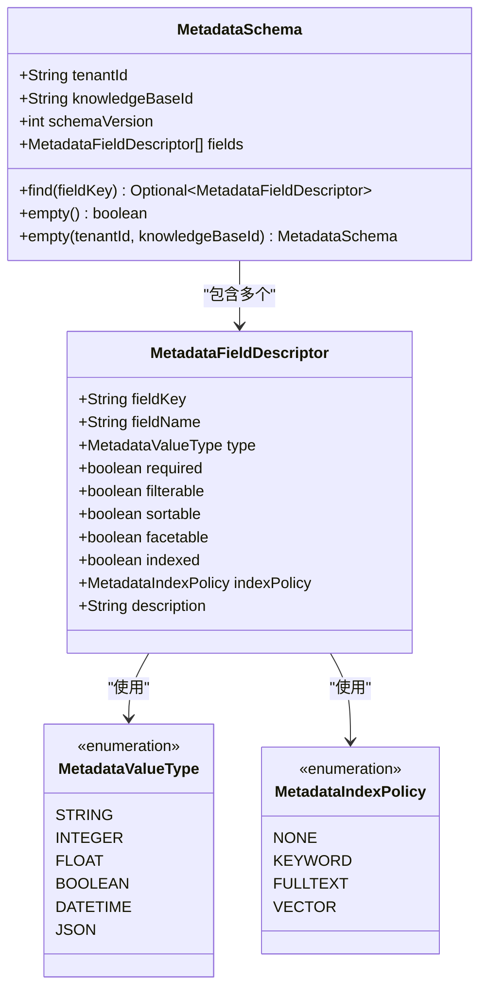
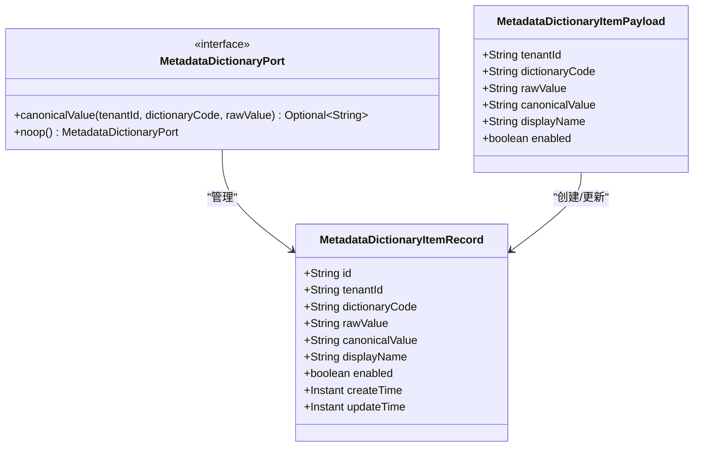
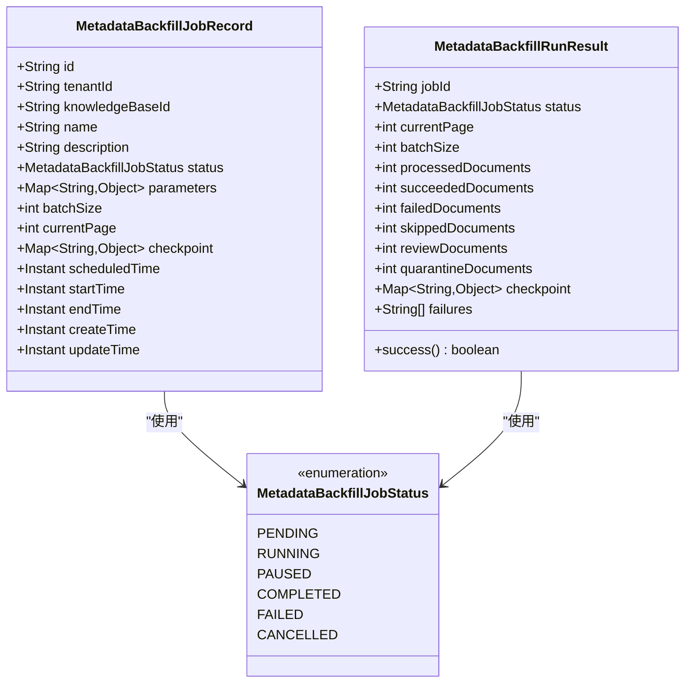
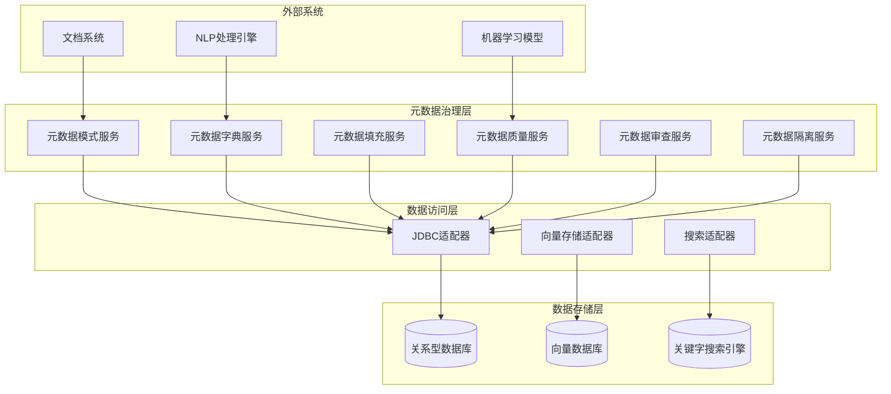
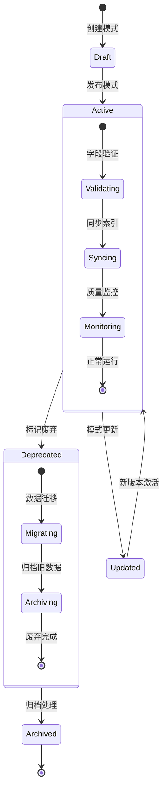
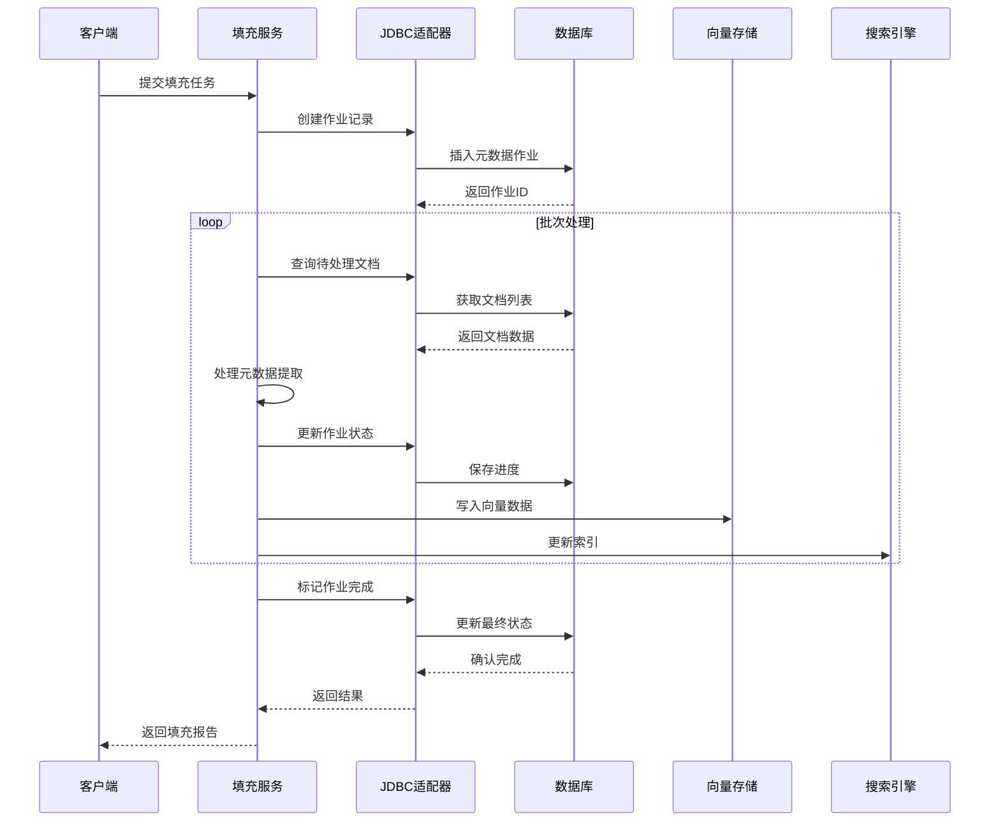
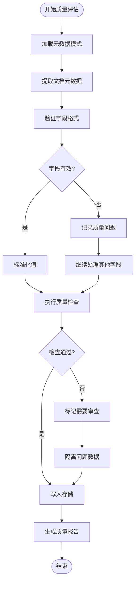
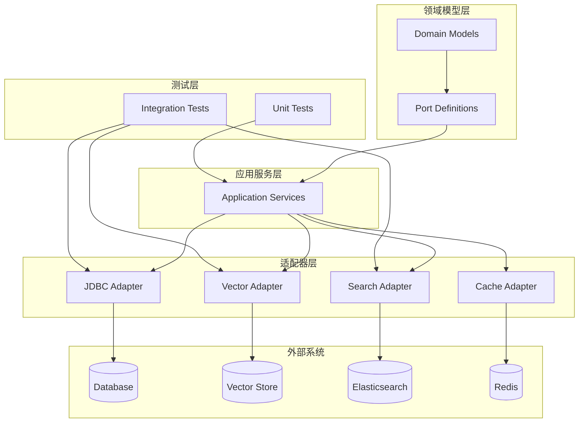

# 元数据领域模型

<cite>
**本文档引用的文件**
- [MetadataSchema.java](file://seahorse-agent-kernel/src/main/java/com/miracle/ai/seahorse/agent/kernel/domain/metadata/MetadataSchema.java)
- [MetadataDictionaryItemRecord.java](file://seahorse-agent-kernel/src/main/java/com/miracle/ai/seahorse/agent/ports/outbound/metadata/MetadataDictionaryItemRecord.java)
- [MetadataDictionaryPort.java](file://seahorse-agent-kernel/src/main/java/com/miracle/ai/seahorse/agent/ports/outbound/metadata/MetadataDictionaryPort.java)
- [MetadataBackfillRunResult.java](file://seahorse-agent-kernel/src/main/java/com/miracle/ai/seahorse/agent/ports/inbound/metadata/MetadataBackfillRunResult.java)
- [JdbcMetadataBackfillSupport.java](file://seahorse-agent-adapter-repository-jdbc/src/main/java/com/miracle/ai/seahorse/agent/adapters/repository/jdbc/JdbcMetadataBackfillSupport.java)
- [JdbcMetadataGovernanceRepositoryAdapter.java](file://seahorse-agent-adapter-repository-jdbc/src/main/java/com/miracle/ai/seahorse/agent/adapters/repository/jdbc/JdbcMetadataGovernanceRepositoryAdapter.java)
- [JdbcMetadataDictionaryManagementAdapterTests.java](file://seahorse-agent-adapter-repository-jdbc/src/test/java/com/miracle/ai/seahorse/agent/adapters/repository/jdbc/JdbcMetadataDictionaryManagementAdapterTests.java)
- [KernelMetadataBackfillService.java](file://seahorse-agent-kernel/src/main/java/com/miracle/ai/seahorse/agent/kernel/application/metadata/KernelMetadataBackfillService.java)
- [KernelMetadataDictionaryService.java](file://seahorse-agent-kernel/src/main/java/com/miracle/ai/seahorse/agent/kernel/application/metadata/KernelMetadataDictionaryService.java)
- [KernelMetadataQualityService.java](file://seahorse-agent-kernel/src/main/java/com/miracle/ai/seahorse/agent/kernel/application/metadata/KernelMetadataQualityService.java)
- [KernelMetadataReviewService.java](file://seahorse-agent-kernel/src/main/java/com/miracle/ai/seahorse/agent/kernel/application/metadata/KernelMetadataReviewService.java)
- [KernelMetadataQuarantineService.java](file://seahorse-agent-kernel/src/main/java/com/miracle/ai/seahorse/agent/kernel/application/metadata/KernelMetadataQuarantineService.java)
- [KernelMetadataSchemaService.java](file://seahorse-agent-kernel/src/main/java/com/miracle/ai/seahorse/agent/kernel/application/metadata/KernelMetadataSchemaService.java)
- [KernelMetadataSchemaUsageService.java](file://seahorse-agent-kernel/src/main/java/com/miracle/ai/seahorse/agent/kernel/application/metadata/KernelMetadataSchemaUsageService.java)
- [SeahorseWebApiContractTests.java](file://seahorse-agent-tests/src/test/java/com/miracle/ai/seahorse/agent/adapters/web/SeahorseWebApiContractTests.java)
</cite>

## 目录
1. [引言](#引言)
2. [项目结构](#项目结构)
3. [核心组件](#核心组件)
4. [架构概览](#架构概览)
5. [详细组件分析](#详细组件分析)
6. [依赖分析](#依赖分析)
7. [性能考虑](#性能考虑)
8. [故障排除指南](#故障排除指南)
9. [结论](#结论)
10. [附录](#附录)

## 引言

本文件详细阐述了Seahorse Agent项目中的元数据领域模型设计。该模型涵盖了元数据模式管理、字典维护、数据填充、质量评估、审查流程等关键概念，并解释了元数据与文档内容、向量存储、检索系统之间的关系。

元数据领域模型的核心目标是支持结构化数据管理、字段验证、数据迁移和版本控制等功能，同时提供元数据治理、质量监控和合规检查的实际应用能力。

## 项目结构

该项目采用分层架构设计，元数据相关功能分布在以下层次：



**图表来源**
- [KernelMetadataBackfillService.java](file://seahorse-agent-kernel/src/main/java/com/miracle/ai/seahorse/agent/kernel/application/metadata/KernelMetadataBackfillService.java)
- [JdbcMetadataBackfillSupport.java](file://seahorse-agent-adapter-repository-jdbc/src/main/java/com/miracle/ai/seahorse/agent/adapters/repository/jdbc/JdbcMetadataBackfillSupport.java)

**章节来源**
- [KernelMetadataBackfillService.java](file://seahorse-agent-kernel/src/main/java/com/miracle/ai/seahorse/agent/kernel/application/metadata/KernelMetadataBackfillService.java)
- [JdbcMetadataBackfillSupport.java](file://seahorse-agent-adapter-repository-jdbc/src/main/java/com/miracle/ai/seahorse/agent/adapters/repository/jdbc/JdbcMetadataBackfillSupport.java)

## 核心组件

### 元数据模式管理

元数据模式是整个元数据系统的基础，它定义了知识库中可用的字段及其属性。



**图表来源**
- [MetadataSchema.java](file://seahorse-agent-kernel/src/main/java/com/miracle/ai/seahorse/agent/kernel/domain/metadata/MetadataSchema.java)

### 元数据字典管理

元数据字典提供了标准化的值映射机制，确保数据的一致性和准确性。



**图表来源**
- [MetadataDictionaryItemRecord.java](file://seahorse-agent-kernel/src/main/java/com/miracle/ai/seahorse/agent/ports/outbound/metadata/MetadataDictionaryItemRecord.java)
- [MetadataDictionaryPort.java](file://seahorse-agent-kernel/src/main/java/com/miracle/ai/seahorse/agent/ports/outbound/metadata/MetadataDictionaryPort.java)

### 元数据填充作业

元数据填充作业负责批量处理和同步元数据信息。



**图表来源**
- [MetadataBackfillRunResult.java](file://seahorse-agent-kernel/src/main/java/com/miracle/ai/seahorse/agent/ports/inbound/metadata/MetadataBackfillRunResult.java)

**章节来源**
- [MetadataSchema.java](file://seahorse-agent-kernel/src/main/java/com/miracle/ai/seahorse/agent/kernel/domain/metadata/MetadataSchema.java)
- [MetadataDictionaryItemRecord.java](file://seahorse-agent-kernel/src/main/java/com/miracle/ai/seahorse/agent/ports/outbound/metadata/MetadataDictionaryItemRecord.java)
- [MetadataDictionaryPort.java](file://seahorse-agent-kernel/src/main/java/com/miracle/ai/seahorse/agent/ports/outbound/metadata/MetadataDictionaryPort.java)
- [MetadataBackfillRunResult.java](file://seahorse-agent-kernel/src/main/java/com/miracle/ai/seahorse/agent/ports/inbound/metadata/MetadataBackfillRunResult.java)

## 架构概览

元数据系统采用事件驱动的架构模式，通过适配器模式实现与不同存储系统的集成。



**图表来源**
- [KernelMetadataSchemaService.java](file://seahorse-agent-kernel/src/main/java/com/miracle/ai/seahorse/agent/kernel/application/metadata/KernelMetadataSchemaService.java)
- [KernelMetadataDictionaryService.java](file://seahorse-agent-kernel/src/main/java/com/miracle/ai/seahorse/agent/kernel/application/metadata/KernelMetadataDictionaryService.java)
- [KernelMetadataBackfillService.java](file://seahorse-agent-kernel/src/main/java/com/miracle/ai/seahorse/agent/kernel/application/metadata/KernelMetadataBackfillService.java)
- [KernelMetadataQualityService.java](file://seahorse-agent-kernel/src/main/java/com/miracle/ai/seahorse/agent/kernel/application/metadata/KernelMetadataQualityService.java)
- [KernelMetadataReviewService.java](file://seahorse-agent-kernel/src/main/java/com/miracle/ai/seahorse/agent/kernel/application/metadata/KernelMetadataReviewService.java)
- [KernelMetadataQuarantineService.java](file://seahorse-agent-kernel/src/main/java/com/miracle/ai/seahorse/agent/kernel/application/metadata/KernelMetadataQuarantineService.java)

## 详细组件分析

### 元数据模式生命周期

元数据模式的生命周期包括创建、更新、版本管理和废弃等阶段。



**图表来源**
- [KernelMetadataSchemaService.java](file://seahorse-agent-kernel/src/main/java/com/miracle/ai/seahorse/agent/kernel/application/metadata/KernelMetadataSchemaService.java)
- [KernelMetadataSchemaUsageService.java](file://seahorse-agent-kernel/src/main/java/com/miracle/ai/seahorse/agent/kernel/application/metadata/KernelMetadataSchemaUsageService.java)

### 元数据填充工作流

元数据填充作业提供了批量处理和增量更新的能力。



**图表来源**
- [KernelMetadataBackfillService.java](file://seahorse-agent-kernel/src/main/java/com/miracle/ai/seahorse/agent/kernel/application/metadata/KernelMetadataBackfillService.java)
- [JdbcMetadataBackfillSupport.java](file://seahorse-agent-adapter-repository-jdbc/src/main/java/com/miracle/ai/seahorse/agent/adapters/repository/jdbc/JdbcMetadataBackfillSupport.java)

### 元数据质量评估流程

质量评估确保元数据的准确性和完整性。



**图表来源**
- [KernelMetadataQualityService.java](file://seahorse-agent-kernel/src/main/java/com/miracle/ai/seahorse/agent/kernel/application/metadata/KernelMetadataQualityService.java)
- [KernelMetadataReviewService.java](file://seahorse-agent-kernel/src/main/java/com/miracle/ai/seahorse/agent/kernel/application/metadata/KernelMetadataReviewService.java)

**章节来源**
- [KernelMetadataBackfillService.java](file://seahorse-agent-kernel/src/main/java/com/miracle/ai/seahorse/agent/kernel/application/metadata/KernelMetadataBackfillService.java)
- [JdbcMetadataBackfillSupport.java](file://seahorse-agent-adapter-repository-jdbc/src/main/java/com/miracle/ai/seahorse/agent/adapters/repository/jdbc/JdbcMetadataBackfillSupport.java)
- [KernelMetadataQualityService.java](file://seahorse-agent-kernel/src/main/java/com/miracle/ai/seahorse/agent/kernel/application/metadata/KernelMetadataQualityService.java)
- [KernelMetadataReviewService.java](file://seahorse-agent-kernel/src/main/java/com/miracle/ai/seahorse/agent/kernel/application/metadata/KernelMetadataReviewService.java)

## 依赖分析

元数据系统各组件之间的依赖关系如下：



**图表来源**
- [JdbcMetadataGovernanceRepositoryAdapter.java](file://seahorse-agent-adapter-repository-jdbc/src/main/java/com/miracle/ai/seahorse/agent/adapters/repository/jdbc/JdbcMetadataGovernanceRepositoryAdapter.java)
- [KernelMetadataDictionaryService.java](file://seahorse-agent-kernel/src/main/java/com/miracle/ai/seahorse/agent/kernel/application/metadata/KernelMetadataDictionaryService.java)

**章节来源**
- [JdbcMetadataGovernanceRepositoryAdapter.java](file://seahorse-agent-adapter-repository-jdbc/src/main/java/com/miracle/ai/seahorse/agent/adapters/repository/jdbc/JdbcMetadataGovernanceRepositoryAdapter.java)
- [KernelMetadataDictionaryService.java](file://seahorse-agent-kernel/src/main/java/com/miracle/ai/seahorse/agent/kernel/application/metadata/KernelMetadataDictionaryService.java)

## 性能考虑

### 查询优化策略

1. **索引策略优化**
   - 关键字字段使用专用索引
   - 向量字段使用向量索引
   - 组合查询使用复合索引

2. **缓存策略**
   - 高频查询结果缓存
   - 模式定义缓存
   - 字典项缓存

3. **批处理优化**
   - 大数据量分批处理
   - 并行处理提高效率
   - 进度跟踪避免重复计算

### 存储优化

1. **数据压缩**
   - 文本数据压缩存储
   - 向量数据量化存储
   - 元数据精简存储

2. **分区策略**
   - 时间分区管理
   - 租户隔离存储
   - 热点数据分离

## 故障排除指南

### 常见问题诊断

1. **元数据模式冲突**
   ```mermaid
flowchart TD
A[模式冲突] --> B{版本检查}
B --> |版本不匹配| C[强制升级]
B --> |字段类型不兼容| D[数据转换]
B --> |字段缺失| E[向后兼容]
C --> F[重新部署]
D --> G[数据迁移]
E --> H[默认值处理]
F --> I[系统恢复]
G --> I
H --> I
```

2. **填充作业失败**
   - 检查数据库连接
   - 验证模式定义
   - 查看错误日志
   - 重试机制配置

3. **质量评估异常**
   - 字段验证失败
   - 数据格式错误
   - 外部依赖问题
   - 资源限制检查

**章节来源**
- [JdbcMetadataDictionaryManagementAdapterTests.java](file://seahorse-agent-adapter-repository-jdbc/src/test/java/com/miracle/ai/seahorse/agent/adapters/repository/jdbc/JdbcMetadataDictionaryManagementAdapterTests.java)
- [SeahorseWebApiContractTests.java](file://seahorse-agent-tests/src/test/java/com/miracle/ai/seahorse/agent/adapters/web/SeahorseWebApiContractTests.java)

## 结论

Seahorse Agent的元数据领域模型提供了一个完整的、可扩展的元数据管理系统。该系统通过清晰的分层架构、完善的领域模型设计和丰富的适配器支持，实现了元数据的全生命周期管理。

关键优势包括：
- **结构化管理**：通过模式定义实现元数据的规范化管理
- **质量保证**：内置的质量评估和审查机制确保数据准确性
- **性能优化**：多层缓存和索引策略提升系统性能
- **扩展性强**：插件化的适配器架构支持多种存储系统
- **治理完善**：完整的审计和合规检查功能

该模型为构建企业级AI基础设施提供了坚实的元数据基础，支持从文档处理到智能检索的完整数据管道。

## 附录

### API参考

#### 元数据模式管理API
- `POST /api/metadata/schemas` - 创建元数据模式
- `GET /api/metadata/schemas/{id}` - 获取模式详情
- `PUT /api/metadata/schemas/{id}` - 更新模式定义
- `DELETE /api/metadata/schemas/{id}` - 删除模式

#### 元数据字典API
- `POST /api/metadata/dictionaries` - 创建字典项
- `GET /api/metadata/dictionaries/{code}` - 获取字典列表
- `PUT /api/metadata/dictionaries/{id}` - 更新字典项
- `DELETE /api/metadata/dictionaries/{id}` - 删除字典项

#### 元数据填充API
- `POST /api/metadata/backfill` - 提交填充任务
- `GET /api/metadata/backfill/{id}` - 获取填充状态
- `POST /api/metadata/backfill/{id}/pause` - 暂停任务
- `POST /api/metadata/backfill/{id}/resume` - 恢复任务

### 配置选项

#### 元数据模式配置
- `metadata.schema.validation.enabled` - 启用模式验证
- `metadata.schema.version.ttl` - 版本保留时间
- `metadata.schema.cache.size` - 模式缓存大小

#### 元数据字典配置
- `metadata.dictionary.cache.ttl` - 字典缓存过期时间
- `metadata.dictionary.sync.enabled` - 启用字典同步
- `metadata.dictionary.validation.rules` - 验证规则配置

#### 元数据填充配置
- `metadata.backfill.batch.size` - 批处理大小
- `metadata.backfill.concurrent.jobs` - 并发作业数
- `metadata.backfill.retry.attempts` - 重试次数
- `metadata.backfill.error.threshold` - 错误阈值