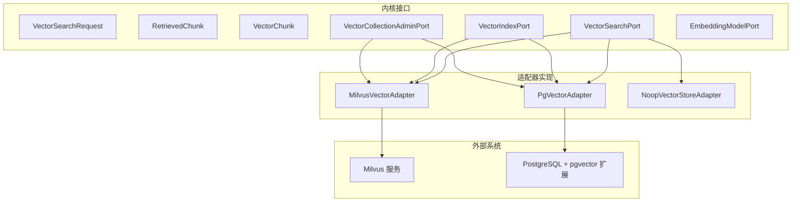
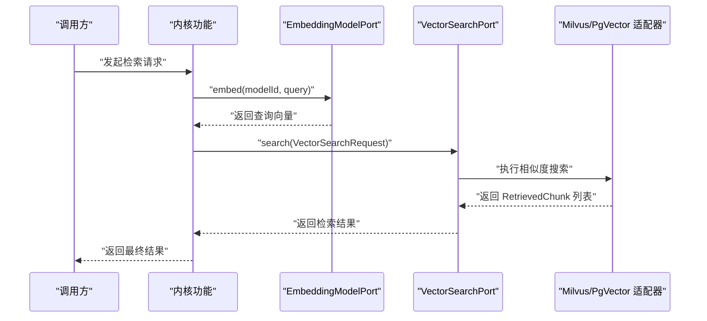
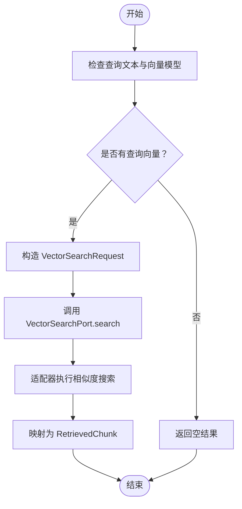
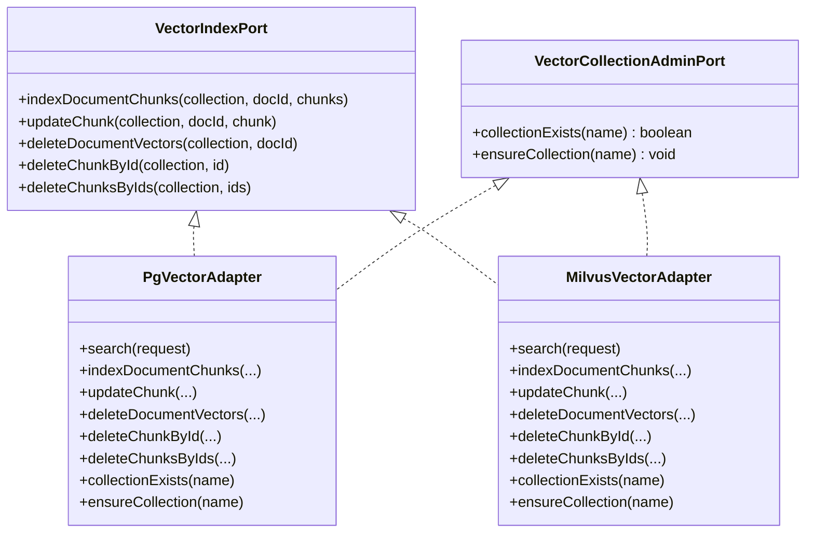
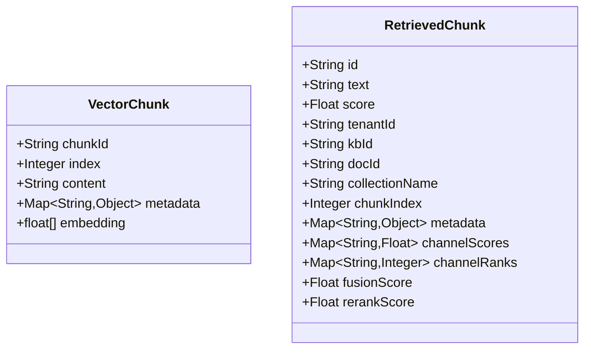
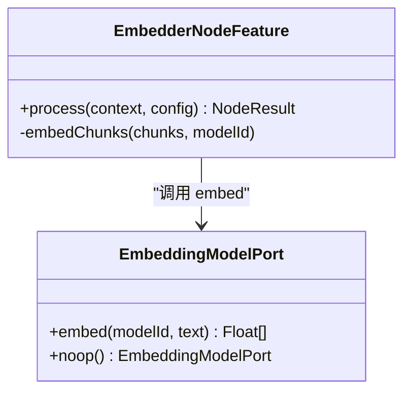
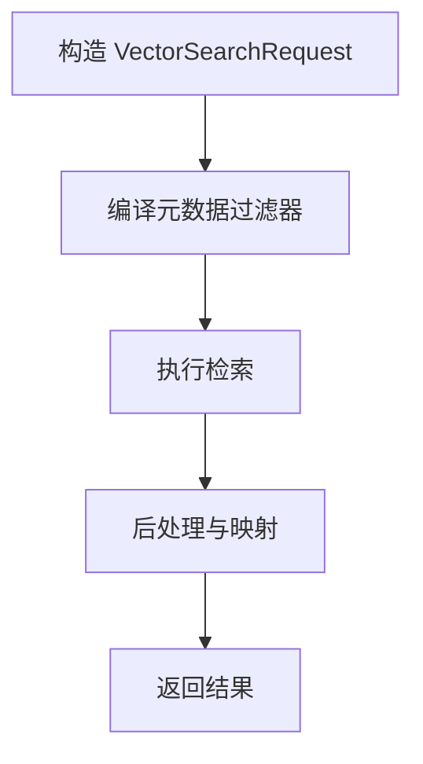
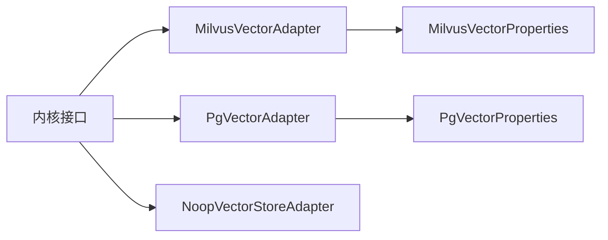

# 向量领域模型

<cite>
**本文引用的文件**
- [VectorSearchRequest.java](file://seahorse-agent-kernel/src/main/java/com/miracle/ai/seahorse/agent/ports/outbound/vector/VectorSearchRequest.java)
- [VectorSearchPort.java](file://seahorse-agent-kernel/src/main/java/com/miracle/ai/seahorse/agent/ports/outbound/vector/VectorSearchPort.java)
- [VectorIndexPort.java](file://seahorse-agent-kernel/src/main/java/com/miracle/ai/seahorse/agent/ports/outbound/vector/VectorIndexPort.java)
- [VectorCollectionAdminPort.java](file://seahorse-agent-kernel/src/main/java/com/miracle/ai/seahorse/agent/ports/outbound/vector/VectorCollectionAdminPort.java)
- [RetrievedChunk.java](file://seahorse-agent-kernel/src/main/java/com/miracle/ai/seahorse/agent/kernel/domain/retrieval/RetrievedChunk.java)
- [VectorChunk.java](file://seahorse-agent-kernel/src/main/java/com/miracle/ai/seahorse/agent/kernel/domain/vector/VectorChunk.java)
- [EmbeddingModelPort.java](file://seahorse-agent-kernel/src/main/java/com/miracle/ai/seahorse/agent/ports/outbound/model/EmbeddingModelPort.java)
- [MilvusVectorAdapter.java](file://seahorse-agent-adapter-vector-milvus/src/main/java/com/miracle/ai/seahorse/agent/adapters/vector/milvus/MilvusVectorAdapter.java)
- [MilvusVectorProperties.java](file://seahorse-agent-adapter-vector-milvus/src/main/java/com/miracle/ai/seahorse/agent/adapters/vector/milvus/MilvusVectorProperties.java)
- [PgVectorAdapter.java](file://seahorse-agent-adapter-vector-pgvector/src/main/java/com/miracle/ai/seahorse/agent/adapters/vector/pgvector/PgVectorAdapter.java)
- [PgVectorProperties.java](file://seahorse-agent-adapter-vector-pgvector/src/main/java/com/miracle/ai/seahorse/agent/adapters/vector/pgvector/PgVectorProperties.java)
- [VectorSearchScoredMemoryVectorPort.java](file://seahorse-agent-kernel/src/main/java/com/miracle/ai/seahorse/agent/kernel/application/memory/retrieval/VectorSearchScoredMemoryVectorPort.java)
- [VectorGlobalSearchFeature.java](file://seahorse-agent-kernel/src/main/java/com/miracle/ai/seahorse/agent/kernel/feature/retrieval/VectorGlobalSearchFeature.java)
- [IntentDirectedSearchFeature.java](file://seahorse-agent-kernel/src/main/java/com/miracle/ai/seahorse/agent/kernel/feature/retrieval/IntentDirectedSearchFeature.java)
- [EmbedderNodeFeature.java](file://seahorse-agent-kernel/src/main/java/com/miracle/ai/seahorse/agent/kernel/feature/ingestion/EmbedderNodeFeature.java)
- [向量数据库适配器.md](file://docs/zh/content/后端系统/适配器模块/向量数据库适配器.md)
- [向量领域模型.md](file://docs/zh/content/后端系统/核心内核/领域模型/向量领域模型.md)
- [向量出站端口.md](file://docs/zh/content/后端系统/核心内核/端口接口/出站端口/向量出站端口.md)
- [模型出站端口.md](file://docs/zh/content/后端系统/核心内核/端口接口/出站端口/模型出站端口.md)
- [混合检索与重排完善设计方案.md](file://docs/zh/content/架构设计/混合检索与重排完善设计方案.md)
</cite>

## 目录
1. [简介](#简介)
2. [项目结构](#项目结构)
3. [核心组件](#核心组件)
4. [架构总览](#架构总览)
5. [详细组件分析](#详细组件分析)
6. [依赖分析](#依赖分析)
7. [性能考虑](#性能考虑)
8. [故障排查指南](#故障排查指南)
9. [结论](#结论)
10. [附录](#附录)

## 简介
本文件系统性梳理向量领域的核心模型与实现，围绕以下目标展开：
- 明确向量相关的核心实体：VectorSearchRequest、RetrievedChunk、VectorChunk、VectorSearchPort、VectorIndexPort、VectorCollectionAdminPort、EmbeddingModelPort
- 解释向量集合管理、索引构建、相似度计算、维度处理等关键概念
- 描述向量与文本嵌入、语义搜索、聚类分析的关系
- 展示从文本生成向量到检索的完整流程图与算法图
- 说明向量模型如何支持高维数据处理、近似最近邻搜索、动态索引与性能优化
- 提供向量质量评估、索引维护、查询优化的实际应用参考与调优建议

## 项目结构
项目采用“内核接口 + 多适配器”的分层设计：上层仅依赖统一的向量与模型端口接口，下层通过适配器对接不同后端（Milvus、PgVector、空实现）。内核负责领域模型与业务流程编排，适配器负责与外部系统的集成。

**图表来源**
- [向量数据库适配器.md:45-73](file://docs/zh/content/后端系统/适配器模块/向量数据库适配器.md#L45-L73)

**章节来源**
- [向量数据库适配器.md:22-73](file://docs/zh/content/后端系统/适配器模块/向量数据库适配器.md#L22-L73)

## 核心组件
本节聚焦向量领域模型的关键实体与职责边界，帮助读者快速理解各组件的作用与交互。

- VectorSearchRequest：向量检索请求载体，包含集合名、查询文本、查询向量、TopK、过滤条件等
- RetrievedChunk：检索结果分片，包含分片标识、文本、得分、元数据、融合与重排相关字段
- VectorChunk：索引分片，包含分片ID、顺序、内容、业务元数据、向量数组
- VectorSearchPort：向量检索端口，抽象检索能力
- VectorIndexPort：向量索引端口，抽象写入、更新、删除能力
- VectorCollectionAdminPort：向量集合管理端口，抽象集合存在性检查与确保
- EmbeddingModelPort：嵌入模型端口，抽象文本向量生成能力

**章节来源**
- [VectorSearchRequest.java](file://seahorse-agent-kernel/src/main/java/com/miracle/ai/seahorse/agent/ports/outbound/vector/VectorSearchRequest.java)
- [RetrievedChunk.java:33-82](file://seahorse-agent-kernel/src/main/java/com/miracle/ai/seahorse/agent/kernel/domain/retrieval/RetrievedChunk.java#L33-L82)
- [VectorChunk.java:31-62](file://seahorse-agent-kernel/src/main/java/com/miracle/ai/seahorse/agent/kernel/domain/vector/VectorChunk.java#L31-L62)
- [VectorSearchPort.java:30-39](file://seahorse-agent-kernel/src/main/java/com/miracle/ai/seahorse/agent/ports/outbound/vector/VectorSearchPort.java#L30-L39)
- [VectorIndexPort.java:30-73](file://seahorse-agent-kernel/src/main/java/com/miracle/ai/seahorse/agent/ports/outbound/vector/VectorIndexPort.java#L30-L73)
- [VectorCollectionAdminPort.java:25-41](file://seahorse-agent-kernel/src/main/java/com/miracle/ai/seahorse/agent/ports/outbound/vector/VectorCollectionAdminPort.java#L25-L41)
- [EmbeddingModelPort.java:27-46](file://seahorse-agent-kernel/src/main/java/com/miracle/ai/seahorse/agent/ports/outbound/model/EmbeddingModelPort.java#L27-L46)

## 架构总览
下图展示了从文本到向量再到检索的整体流程，以及内核与适配器的交互关系。

**图表来源**
- [VectorSearchScoredMemoryVectorPort.java:70-97](file://seahorse-agent-kernel/src/main/java/com/miracle/ai/seahorse/agent/kernel/application/memory/retrieval/VectorSearchScoredMemoryVectorPort.java#L70-L97)
- [EmbeddingModelPort.java:27-46](file://seahorse-agent-kernel/src/main/java/com/miracle/ai/seahorse/agent/ports/outbound/model/EmbeddingModelPort.java#L27-L46)
- [VectorSearchPort.java:30-39](file://seahorse-agent-kernel/src/main/java/com/miracle/ai/seahorse/agent/ports/outbound/vector/VectorSearchPort.java#L30-L39)
- [MilvusVectorAdapter.java:97-102](file://seahorse-agent-adapter-vector-milvus/src/main/java/com/miracle/ai/seahorse/agent/adapters/vector/milvus/MilvusVectorAdapter.java#L97-L102)
- [PgVectorAdapter.java:83-96](file://seahorse-agent-adapter-vector-pgvector/src/main/java/com/miracle/ai/seahorse/agent/adapters/vector/pgvector/PgVectorAdapter.java#L83-L96)

## 详细组件分析

### 向量检索流程与算法
- 文本预处理：根据检索上下文选择合适的嵌入模型，生成查询向量
- 检索执行：将查询向量与索引库进行相似度匹配，返回TopK结果
- 结果映射：将后端返回的实体映射为统一的 RetrievedChunk，补充元数据与评分

**图表来源**
- [VectorSearchScoredMemoryVectorPort.java:70-97](file://seahorse-agent-kernel/src/main/java/com/miracle/ai/seahorse/agent/kernel/application/memory/retrieval/VectorSearchScoredMemoryVectorPort.java#L70-L97)
- [VectorGlobalSearchFeature.java:125-146](file://seahorse-agent-kernel/src/main/java/com/miracle/ai/seahorse/agent/kernel/feature/retrieval/VectorGlobalSearchFeature.java#L125-L146)

**章节来源**
- [VectorSearchScoredMemoryVectorPort.java:50-101](file://seahorse-agent-kernel/src/main/java/com/miracle/ai/seahorse/agent/kernel/application/memory/retrieval/VectorSearchScoredMemoryVectorPort.java#L50-L101)
- [VectorGlobalSearchFeature.java:117-151](file://seahorse-agent-kernel/src/main/java/com/miracle/ai/seahorse/agent/kernel/feature/retrieval/VectorGlobalSearchFeature.java#L117-L151)

### 向量索引与集合管理
- 索引写入：支持批量写入文档分块向量，按ID更新或删除，按文档ID删除整批向量
- 集合管理：检查后端类型与扩展安装情况，确保表/集合存在与索引可用
- 维度约束：严格校验向量维度与表名合法性，防止不一致导致的检索失败

**图表来源**
- [VectorIndexPort.java:30-73](file://seahorse-agent-kernel/src/main/java/com/miracle/ai/seahorse/agent/ports/outbound/vector/VectorIndexPort.java#L30-L73)
- [VectorCollectionAdminPort.java:25-41](file://seahorse-agent-kernel/src/main/java/com/miracle/ai/seahorse/agent/ports/outbound/vector/VectorCollectionAdminPort.java#L25-L41)
- [PgVectorAdapter.java:98-133](file://seahorse-agent-adapter-vector-pgvector/src/main/java/com/miracle/ai/seahorse/agent/adapters/vector/pgvector/PgVectorAdapter.java#L98-L133)
- [MilvusVectorAdapter.java:97-102](file://seahorse-agent-adapter-vector-milvus/src/main/java/com/miracle/ai/seahorse/agent/adapters/vector/milvus/MilvusVectorAdapter.java#L97-L102)

**章节来源**
- [PgVectorAdapter.java:98-133](file://seahorse-agent-adapter-vector-pgvector/src/main/java/com/miracle/ai/seahorse/agent/adapters/vector/pgvector/PgVectorAdapter.java#L98-L133)
- [MilvusVectorAdapter.java:97-102](file://seahorse-agent-adapter-vector-milvus/src/main/java/com/miracle/ai/seahorse/agent/adapters/vector/milvus/MilvusVectorAdapter.java#L97-L102)

### 向量分块与检索结果模型
- VectorChunk：统一的分块契约，包含分片ID、顺序、内容、元数据与向量数组
- RetrievedChunk：检索结果模型，包含基础字段与融合/重排相关字段，便于后续排序与解释

**图表来源**
- [VectorChunk.java:31-62](file://seahorse-agent-kernel/src/main/java/com/miracle/ai/seahorse/agent/kernel/domain/vector/VectorChunk.java#L31-L62)
- [RetrievedChunk.java:33-82](file://seahorse-agent-kernel/src/main/java/com/miracle/ai/seahorse/agent/kernel/domain/retrieval/RetrievedChunk.java#L33-L82)

**章节来源**
- [向量领域模型.md:134-161](file://docs/zh/content/后端系统/核心内核/领域模型/向量领域模型.md#L134-L161)

### 嵌入模型与向量生成
- EmbeddingModelPort：抽象文本向量生成能力，支持空实现以适配无向量化场景
- 内核节点：在索引入口处批量生成向量，确保分块具备可用embedding

**图表来源**
- [EmbeddingModelPort.java:27-46](file://seahorse-agent-kernel/src/main/java/com/miracle/ai/seahorse/agent/ports/outbound/model/EmbeddingModelPort.java#L27-L46)
- [EmbedderNodeFeature.java:72-78](file://seahorse-agent-kernel/src/main/java/com/miracle/ai/seahorse/agent/kernel/feature/ingestion/EmbedderNodeFeature.java#L72-L78)

**章节来源**
- [EmbeddingModelPort.java:27-46](file://seahorse-agent-kernel/src/main/java/com/miracle/ai/seahorse/agent/ports/outbound/model/EmbeddingModelPort.java#L27-L46)
- [EmbedderNodeFeature.java:72-78](file://seahorse-agent-kernel/src/main/java/com/miracle/ai/seahorse/agent/kernel/feature/ingestion/EmbedderNodeFeature.java#L72-L78)

### 向量检索请求与过滤
- 请求结构：包含集合名、查询文本、查询向量、TopK与编译后的元数据过滤器
- 过滤策略：支持按租户、知识库、文档等维度进行过滤，保证检索范围可控

**图表来源**
- [VectorSearchScoredMemoryVectorPort.java:82-96](file://seahorse-agent-kernel/src/main/java/com/miracle/ai/seahorse/agent/kernel/application/memory/retrieval/VectorSearchScoredMemoryVectorPort.java#L82-L96)
- [混合检索与重排完善设计方案.md:499-523](file://docs/zh/content/架构设计/混合检索与重排完善设计方案.md#L499-L523)

**章节来源**
- [VectorSearchScoredMemoryVectorPort.java:50-101](file://seahorse-agent-kernel/src/main/java/com/miracle/ai/seahorse/agent/kernel/application/memory/retrieval/VectorSearchScoredMemoryVectorPort.java#L50-L101)
- [混合检索与重排完善设计方案.md:499-523](file://docs/zh/content/架构设计/混合检索与重排完善设计方案.md#L499-L523)

## 依赖分析
- 内核接口与适配器解耦：通过统一端口隔离具体实现，便于替换与扩展
- 适配器内部依赖：Milvus适配器依赖Milvus客户端；PgVector适配器依赖JDBC与pgvector扩展
- 配置契约：Milvus与PgVector均提供属性类，约束维度、索引参数等关键配置

**图表来源**
- [MilvusVectorProperties.java:56-68](file://seahorse-agent-adapter-vector-milvus/src/main/java/com/miracle/ai/seahorse/agent/adapters/vector/milvus/MilvusVectorProperties.java#L56-L68)
- [PgVectorProperties.java:28-38](file://seahorse-agent-adapter-vector-pgvector/src/main/java/com/miracle/ai/seahorse/agent/adapters/vector/pgvector/PgVectorProperties.java#L28-L38)

**章节来源**
- [MilvusVectorProperties.java:56-68](file://seahorse-agent-adapter-vector-milvus/src/main/java/com/miracle/ai/seahorse/agent/adapters/vector/milvus/MilvusVectorProperties.java#L56-L68)
- [PgVectorProperties.java:28-38](file://seahorse-agent-adapter-vector-pgvector/src/main/java/com/miracle/ai/seahorse/agent/adapters/vector/pgvector/PgVectorProperties.java#L28-L38)

## 性能考虑
- 近似最近邻搜索：Milvus使用HNSW索引与自定义ef参数；PgVector使用HNSW与余弦距离
- 维度与索引参数：严格校验维度，合理设置HNSW参数以平衡召回与性能
- 批量写入：PgVector使用PreparedStatement批处理，减少网络往返
- 查询优化：设置ef_search/HNSW检索参数，提升召回质量
- 索引维护：定期重建索引、清理无效数据、监控索引大小与查询延迟

**章节来源**
- [向量出站端口.md:173-204](file://docs/zh/content/后端系统/核心内核/端口接口/出站端口/向量出站端口.md#L173-L204)
- [PgVectorAdapter.java:70-96](file://seahorse-agent-adapter-vector-pgvector/src/main/java/com/miracle/ai/seahorse/agent/adapters/vector/pgvector/PgVectorAdapter.java#L70-L96)

## 故障排查指南
- 维度不匹配：Milvus适配器在写入前校验维度，不一致会抛出异常
- 后端类型与扩展：PgVector适配器在连接时校验数据库类型与扩展安装状态
- 空向量处理：当嵌入模型不可用或返回空向量时，检索流程提前返回空结果
- 索引缺失：集合不存在时需先确保集合存在，再进行写入与检索

**章节来源**
- [MilvusVectorAdapter.java:310-318](file://seahorse-agent-adapter-vector-milvus/src/main/java/com/miracle/ai/seahorse/agent/adapters/vector/milvus/MilvusVectorAdapter.java#L310-L318)
- [PgVectorAdapter.java:258-272](file://seahorse-agent-adapter-vector-pgvector/src/main/java/com/miracle/ai/seahorse/agent/adapters/vector/pgvector/PgVectorAdapter.java#L258-L272)
- [VectorSearchScoredMemoryVectorPort.java:78-81](file://seahorse-agent-kernel/src/main/java/com/miracle/ai/seahorse/agent/kernel/application/memory/retrieval/VectorSearchScoredMemoryVectorPort.java#L78-L81)

## 结论
本向量领域模型通过统一的端口与领域模型，实现了从文本嵌入、向量索引到相似度检索的完整闭环。适配器层屏蔽了底层系统的差异，使内核能够专注于业务逻辑与流程编排。通过严格的维度校验、近似最近邻索引与批量写入策略，系统在高维数据场景下具备良好的可扩展性与性能表现。

## 附录
- 向量质量评估：结合检索结果的多样性、相关性与稳定性进行评估
- 索引维护：定期检查集合状态、索引参数与数据完整性
- 查询优化：根据业务场景调整TopK、过滤条件与索引参数，持续优化召回与延迟