# 摄取领域模型

<cite>
**本文档引用的文件**
- [IngestionContext.java](file://seahorse-agent-kernel/src/main/java/com/miracle/ai/seahorse/agent/kernel/domain/ingestion/IngestionContext.java)
- [IngestionStatus.java](file://seahorse-agent-kernel/src/main/java/com/miracle/ai/seahorse/agent/kernel/domain/ingestion/IngestionStatus.java)
- [NodeConfig.java](file://seahorse-agent-kernel/src/main/java/com/miracle/ai/seahorse/agent/kernel/domain/ingestion/NodeConfig.java)
- [NodeLog.java](file://seahorse-agent-kernel/src/main/java/com/miracle/ai/seahorse/agent/kernel/domain/ingestion/NodeLog.java)
- [NodeResult.java](file://seahorse-agent-kernel/src/main/java/com/miracle/ai/seahorse/agent/kernel/domain/ingestion/NodeResult.java)
- [PipelineDefinition.java](file://seahorse-agent-kernel/src/main/java/com/miracle/ai/seahorse/agent/kernel/domain/ingestion/PipelineDefinition.java)
- [VectorChunk.java](file://seahorse-agent-kernel/src/main/java/com/miracle/ai/seahorse/agent/kernel/domain/vector/VectorChunk.java)
- [DocumentParserPort.java](file://seahorse-agent-kernel/src/main/java/com/miracle/ai/seahorse/agent/ports/outbound/ingestion/DocumentParserPort.java)
- [KernelIngestionEngine.java](file://seahorse-agent-kernel/src/main/java/com/miracle/ai/seahorse/agent/kernel/application/ingestion/KernelIngestionEngine.java)
- [KernelIngestionPipelineService.java](file://seahorse-agent-kernel/src/main/java/com/miracle/ai/seahorse/agent/kernel/application/ingestion/KernelIngestionPipelineService.java)
- [KernelIngestionTaskService.java](file://seahorse-agent-kernel/src/main/java/com/miracle/ai/seahorse/agent/kernel/application/ingestion/KernelIngestionTaskService.java)
- [ChunkerNodeFeature.java](file://seahorse-agent-kernel/src/main/java/com/miracle/ai/seahorse/agent/kernel/feature/ingestion/ChunkerNodeFeature.java)
- [ParserNodeFeature.java](file://seahorse-agent-kernel/src/main/java/com/miracle/ai/seahorse/agent/kernel/feature/ingestion/ParserNodeFeature.java)
- [FetcherNodeFeature.java](file://seahorse-agent-kernel/src/main/java/com/miracle/ai/seahorse/agent/kernel/feature/ingestion/FetcherNodeFeature.java)
- [IndexerNodeFeature.java](file://seahorse-agent-kernel/src/main/java/com/miracle/ai/seahorse/agent/kernel/feature/ingestion/IndexerNodeFeature.java)
- [EnricherNodeFeature.java](file://seahorse-agent-kernel/src/main/java/com/miracle/ai/seahorse/agent/kernel/feature/ingestion/EnricherNodeFeature.java)
- [EmbedderNodeFeature.java](file://seahorse-agent-kernel/src/main/java/com/miracle/ai/seahorse/agent/kernel/feature/ingestion/EmbedderNodeFeature.java)
- [MetadataExtractorNodeFeature.java](file://seahorse-agent-kernel/src/main/java/com/miracle/ai/seahorse/agent/kernel/feature/ingestion/MetadataExtractorNodeFeature.java)
- [MetadataNormalizerNodeFeature.java](file://seahorse-agent-kernel/src/main/java/com/miracle/ai/seahorse/agent/kernel/feature/ingestion/MetadataNormalizerNodeFeature.java)
- [MetadataValidatorNodeFeature.java](file://seahorse-agent-kernel/src/main/java/com/miracle/ai/seahorse/agent/kernel/feature/ingestion/MetadataValidatorNodeFeature.java)
- [KernelMetadataBackfillService.java](file://seahorse-agent-kernel/src/main/java/com/miracle/ai/seahorse/agent/kernel/application/metadata/KernelMetadataBackfillService.java)
- [pdf-ingestion-example.md](file://docs/examples/pdf-ingestion-example.md)
- [pdf-pipeline-request.json](file://docs/examples/pdf-pipeline-request.json)
- [TikaDocumentParserAdapter.java](file://seahorse-agent-adapter-parser-tika/src/main/java/com/miracle/ai/seahorse/agent/adapters/parser/tika/TikaDocumentParserAdapter.java)
- [JdbcIngestionTaskRepositoryAdapter.java](file://seahorse-agent-adapter-repository-jdbc/src/main/java/com/miracle/ai/seahorse/agent/adapters/repository/jdbc/JdbcIngestionTaskRepositoryAdapter.java)
- [LocalIngestionNodeLogAdapter.java](file://seahorse-agent-adapter-web/src/main/java/com/miracle/ai/seahorse/agent/adapters/local/LocalIngestionNodeLogAdapter.java)
</cite>

## 目录
1. [简介](#简介)
2. [项目结构](#项目结构)
3. [核心组件](#核心组件)
4. [架构总览](#架构总览)
5. [详细组件分析](#详细组件分析)
6. [依赖分析](#依赖分析)
7. [性能考虑](#性能考虑)
8. [故障排查指南](#故障排查指南)
9. [结论](#结论)
10. [附录](#附录)

## 简介
本文档系统化阐述“摄取领域模型”，聚焦文档从上传到向量化入库的完整流水线。围绕以下核心领域模型展开：IngestionContext（处理上下文）、IngestionStatus（处理状态枚举）、NodeConfig（节点配置）、NodeLog（节点日志）、NodeResult（节点结果）、PipelineDefinition（流水线定义）、VectorChunk（向量分片）、DocumentParserPort（文档解析出站端口）。文档将阐明各模型在处理流程中的职责、属性语义与业务逻辑，并通过图示展示它们在端到端处理链路中的协作关系与数据流转。

## 项目结构
围绕文档摄取的关键模块分布如下：
- kernel 应用层：KernelIngestionEngine、KernelIngestionPipelineService、KernelIngestionTaskService
- kernel 领域模型：IngestionContext、PipelineDefinition、NodeConfig、NodeLog、NodeResult、IngestionStatus、VectorChunk、DocumentParserPort
- 适配器层：Tika 文档解析适配器、JDBC 任务仓库适配器、本地节点日志适配器等
- 示例与文档：PDF 摄取示例与请求模板

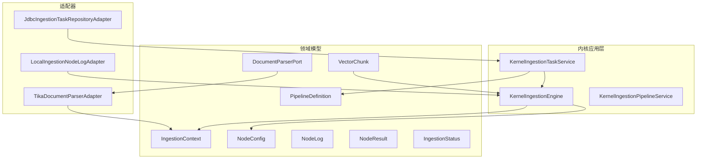

**图表来源**
- [KernelIngestionEngine.java:45-192](file://seahorse-agent-kernel/src/main/java/com/miracle/ai/seahorse/agent/kernel/application/ingestion/KernelIngestionEngine.java#L45-L192)
- [KernelIngestionPipelineService.java:30-120](file://seahorse-agent-kernel/src/main/java/com/miracle/ai/seahorse/agent/kernel/application/ingestion/KernelIngestionPipelineService.java#L30-L120)
- [KernelIngestionTaskService.java:52-210](file://seahorse-agent-kernel/src/main/java/com/miracle/ai/seahorse/agent/kernel/application/ingestion/KernelIngestionTaskService.java#L52-L210)
- [IngestionContext.java:35-62](file://seahorse-agent-kernel/src/main/java/com/miracle/ai/seahorse/agent/kernel/domain/ingestion/IngestionContext.java#L35-L62)
- [PipelineDefinition.java:30-40](file://seahorse-agent-kernel/src/main/java/com/miracle/ai/seahorse/agent/kernel/domain/ingestion/PipelineDefinition.java#L30-L40)
- [NodeConfig.java:29-40](file://seahorse-agent-kernel/src/main/java/com/miracle/ai/seahorse/agent/kernel/domain/ingestion/NodeConfig.java#L29-L40)
- [NodeLog.java:30-43](file://seahorse-agent-kernel/src/main/java/com/miracle/ai/seahorse/agent/kernel/domain/ingestion/NodeLog.java#L30-L43)
- [NodeResult.java:28-63](file://seahorse-agent-kernel/src/main/java/com/miracle/ai/seahorse/agent/kernel/domain/ingestion/NodeResult.java#L28-L63)
- [IngestionStatus.java:23-27](file://seahorse-agent-kernel/src/main/java/com/miracle/ai/seahorse/agent/kernel/domain/ingestion/IngestionStatus.java#L23-L27)
- [VectorChunk.java:31-62](file://seahorse-agent-kernel/src/main/java/com/miracle/ai/seahorse/agent/kernel/domain/vector/VectorChunk.java#L31-L62)
- [DocumentParserPort.java:24-53](file://seahorse-agent-kernel/src/main/java/com/miracle/ai/seahorse/agent/ports/outbound/ingestion/DocumentParserPort.java#L24-L53)
- [TikaDocumentParserAdapter.java:44-120](file://seahorse-agent-adapter-parser-tika/src/main/java/com/miracle/ai/seahorse/agent/adapters/parser/tika/TikaDocumentParserAdapter.java#L44-L120)
- [JdbcIngestionTaskRepositoryAdapter.java:55-231](file://seahorse-agent-adapter-repository-jdbc/src/main/java/com/miracle/ai/seahorse/agent/adapters/repository/jdbc/JdbcIngestionTaskRepositoryAdapter.java#L55-L231)
- [LocalIngestionNodeLogAdapter.java:35-60](file://seahorse-agent-adapter-web/src/main/java/com/miracle/ai/seahorse/agent/adapters/local/LocalIngestionNodeLogAdapter.java#L35-L60)

**章节来源**
- [KernelIngestionEngine.java:45-192](file://seahorse-agent-kernel/src/main/java/com/miracle/ai/seahorse/agent/kernel/application/ingestion/KernelIngestionEngine.java#L45-L192)
- [KernelIngestionPipelineService.java:30-120](file://seahorse-agent-kernel/src/main/java/com/miracle/ai/seahorse/agent/kernel/application/ingestion/KernelIngestionPipelineService.java#L30-L120)
- [KernelIngestionTaskService.java:52-210](file://seahorse-agent-kernel/src/main/java/com/miracle/ai/seahorse/agent/kernel/application/ingestion/KernelIngestionTaskService.java#L52-L210)

## 核心组件
- IngestionContext：承载一次摄取任务的全量上下文，包括原始字节、MIME类型、解析文本、文档对象、分片列表、增强文本、关键词、问题、元数据、元数据模式、候选/规范化/质量/问题信息、验证结果、向量空间ID、状态、节点日志、异常以及是否跳过索引写入等。
- PipelineDefinition：描述一条摄取流水线，包含节点列表及流水线元信息。
- NodeConfig：描述单个节点的配置，包括节点ID、节点类型、设置、条件、下一节点ID。
- NodeLog：记录节点执行日志，包含节点ID/类型、消息、耗时、成功标志、错误信息、输出。
- NodeResult：节点执行结果，包含成功/继续/消息/异常等。
- IngestionStatus：任务状态枚举，包括 PENDING、RUNNING、COMPLETED、FAILED。
- VectorChunk：向量分片，包含分片ID、顺序索引、内容、业务元数据、向量。
- DocumentParserPort：文档解析出站端口，定义解析接口与纯文本解析器工厂方法。

**章节来源**
- [IngestionContext.java:35-62](file://seahorse-agent-kernel/src/main/java/com/miracle/ai/seahorse/agent/kernel/domain/ingestion/IngestionContext.java#L35-L62)
- [PipelineDefinition.java:30-40](file://seahorse-agent-kernel/src/main/java/com/miracle/ai/seahorse/agent/kernel/domain/ingestion/PipelineDefinition.java#L30-L40)
- [NodeConfig.java:29-40](file://seahorse-agent-kernel/src/main/java/com/miracle/ai/seahorse/agent/kernel/domain/ingestion/NodeConfig.java#L29-L40)
- [NodeLog.java:30-43](file://seahorse-agent-kernel/src/main/java/com/miracle/ai/seahorse/agent/kernel/domain/ingestion/NodeLog.java#L30-L43)
- [NodeResult.java:28-63](file://seahorse-agent-kernel/src/main/java/com/miracle/ai/seahorse/agent/kernel/domain/ingestion/NodeResult.java#L28-L63)
- [IngestionStatus.java:23-27](file://seahorse-agent-kernel/src/main/java/com/miracle/ai/seahorse/agent/kernel/domain/ingestion/IngestionStatus.java#L23-L27)
- [VectorChunk.java:31-62](file://seahorse-agent-kernel/src/main/java/com/miracle/ai/seahorse/agent/kernel/domain/vector/VectorChunk.java#L31-L62)
- [DocumentParserPort.java:24-53](file://seahorse-agent-kernel/src/main/java/com/miracle/ai/seahorse/agent/ports/outbound/ingestion/DocumentParserPort.java#L24-L53)

## 架构总览
摄取系统采用“流水线+节点特征”的架构。KernelIngestionEngine 负责解析流水线拓扑、串行执行节点、条件判断、日志记录与失败中断；KernelIngestionTaskService 封装任务生命周期，协调引擎执行，持久化任务与节点日志，汇总执行结果；KernelIngestionPipelineService 提供流水线的创建、查询、分页与删除等管理能力。节点特征（如 Fetcher、Parser、Enhancer、Chunker、Embedder、Enricher、Indexer、MetadataExtractor、MetadataNormalizer、MetadataValidator）各自承担特定处理职责，通过 IngestionContext 传递数据，通过 NodeResult 返回结果。

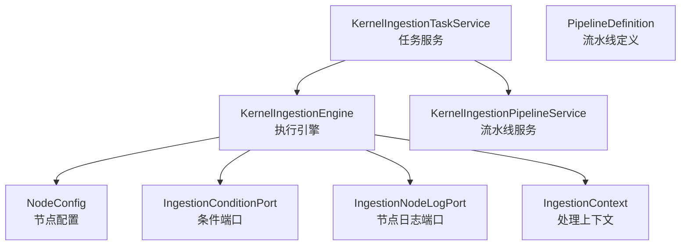

**图表来源**
- [KernelIngestionEngine.java:79-192](file://seahorse-agent-kernel/src/main/java/com/miracle/ai/seahorse/agent/kernel/application/ingestion/KernelIngestionEngine.java#L79-L192)
- [KernelIngestionTaskService.java:128-210](file://seahorse-agent-kernel/src/main/java/com/miracle/ai/seahorse/agent/kernel/application/ingestion/KernelIngestionTaskService.java#L128-L210)
- [KernelIngestionPipelineService.java:30-120](file://seahorse-agent-kernel/src/main/java/com/miracle/ai/seahorse/agent/kernel/application/ingestion/KernelIngestionPipelineService.java#L30-L120)

## 详细组件分析

### IngestionContext（处理上下文）
- 职责：承载一次摄取任务的全量上下文，贯穿整个流水线执行过程。
- 关键属性：
  - 任务与流水线标识：taskId、pipelineId
  - 数据源与原始输入：source、rawBytes、mimeType
  - 文本与文档：rawText、document
  - 分片：chunks（VectorChunk 列表）
  - 增强：enhancedText、keywords、questions
  - 元数据：metadata、metadataSchema、metadataCandidates、normalizedMetadata、metadataFieldQualities、metadataIssues、metadataValidationResult
  - 系统控制：vectorSpaceId、status、logs、error、skipIndexerWrite

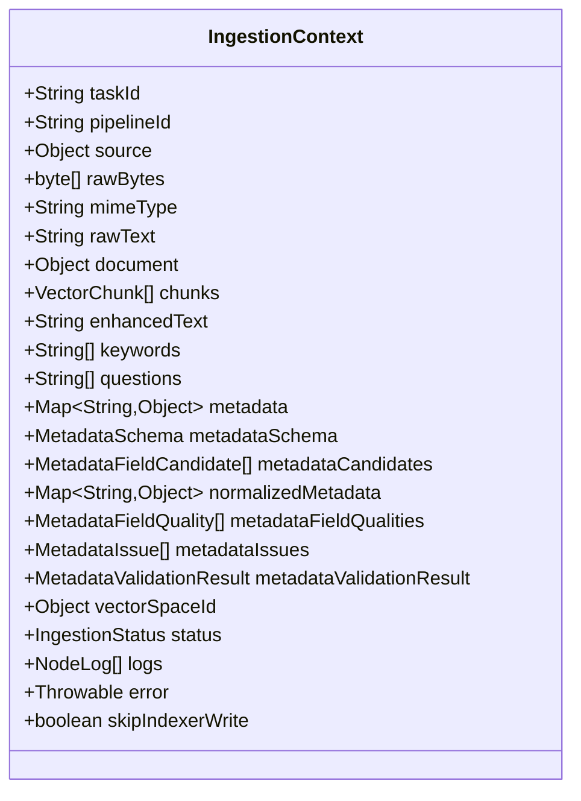

**图表来源**
- [IngestionContext.java:35-62](file://seahorse-agent-kernel/src/main/java/com/miracle/ai/seahorse/agent/kernel/domain/ingestion/IngestionContext.java#L35-L62)

**章节来源**
- [IngestionContext.java:35-62](file://seahorse-agent-kernel/src/main/java/com/miracle/ai/seahorse/agent/kernel/domain/ingestion/IngestionContext.java#L35-L62)

### PipelineDefinition（流水线定义）
- 职责：描述一条摄取流水线，包含节点列表及流水线元信息。
- 关键属性：id、name、description、nodes（NodeConfig 列表）

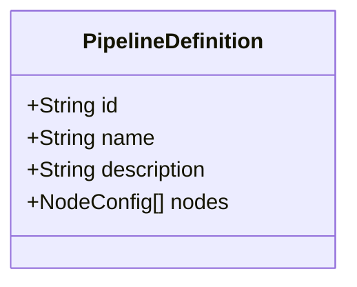

**图表来源**
- [PipelineDefinition.java:30-40](file://seahorse-agent-kernel/src/main/java/com/miracle/ai/seahorse/agent/kernel/domain/ingestion/PipelineDefinition.java#L30-L40)

**章节来源**
- [PipelineDefinition.java:30-40](file://seahorse-agent-kernel/src/main/java/com/miracle/ai/seahorse/agent/kernel/domain/ingestion/PipelineDefinition.java#L30-L40)

### NodeConfig（节点配置）
- 职责：描述单个节点的配置，用于引擎解析执行链路。
- 关键属性：nodeId、nodeType、settings（JsonNode）、condition（JsonNode）、nextNodeId

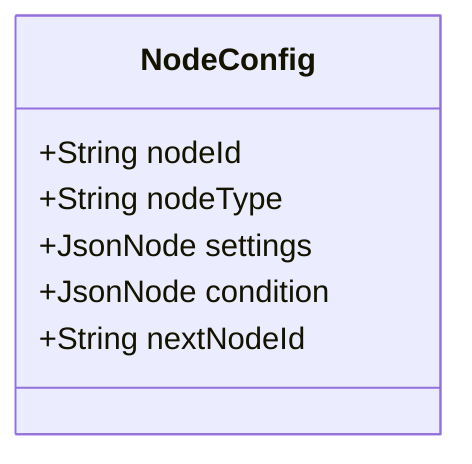

**图表来源**
- [NodeConfig.java:29-40](file://seahorse-agent-kernel/src/main/java/com/miracle/ai/seahorse/agent/kernel/domain/ingestion/NodeConfig.java#L29-L40)

**章节来源**
- [NodeConfig.java:29-40](file://seahorse-agent-kernel/src/main/java/com/miracle/ai/seahorse/agent/kernel/domain/ingestion/NodeConfig.java#L29-L40)

### NodeLog / NodeResult（节点日志与结果）
- NodeLog：记录节点执行日志，包含节点ID/类型、消息、耗时、成功标志、错误信息、输出。
- NodeResult：节点执行结果，包含成功/继续/消息/异常等，提供 ok/skip/fail/terminate 工厂方法。

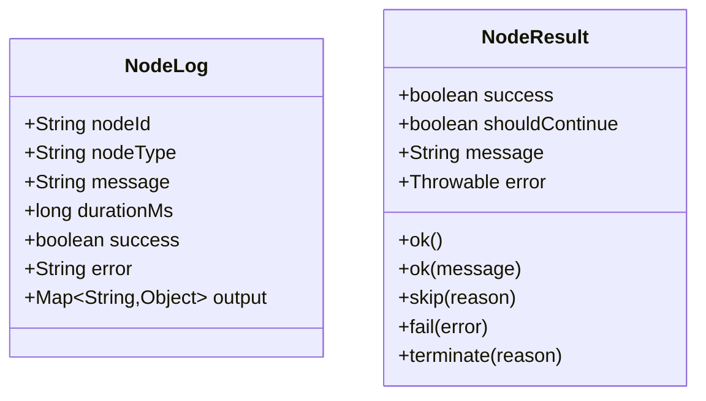

**图表来源**
- [NodeLog.java:30-43](file://seahorse-agent-kernel/src/main/java/com/miracle/ai/seahorse/agent/kernel/domain/ingestion/NodeLog.java#L30-L43)
- [NodeResult.java:28-63](file://seahorse-agent-kernel/src/main/java/com/miracle/ai/seahorse/agent/kernel/domain/ingestion/NodeResult.java#L28-L63)

**章节来源**
- [NodeLog.java:30-43](file://seahorse-agent-kernel/src/main/java/com/miracle/ai/seahorse/agent/kernel/domain/ingestion/NodeLog.java#L30-L43)
- [NodeResult.java:28-63](file://seahorse-agent-kernel/src/main/java/com/miracle/ai/seahorse/agent/kernel/domain/ingestion/NodeResult.java#L28-L63)

### IngestionStatus（任务状态）
- 枚举值：PENDING、RUNNING、COMPLETED、FAILED

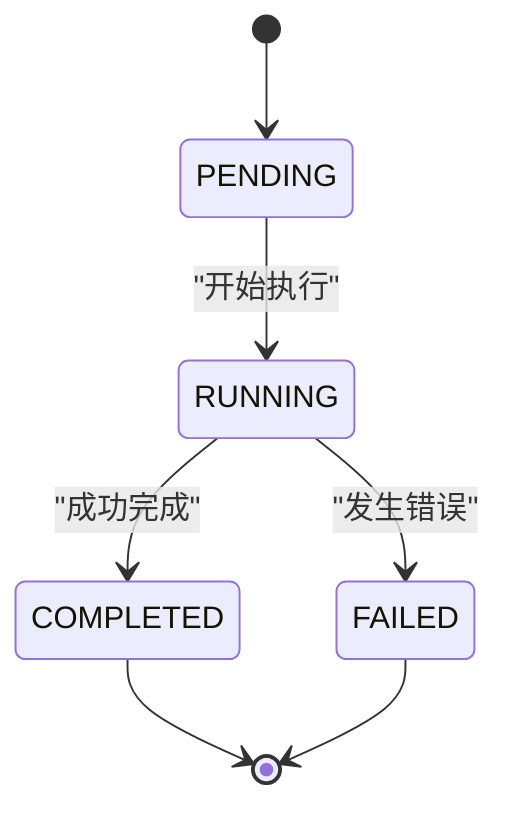

**图表来源**
- [IngestionStatus.java:23-27](file://seahorse-agent-kernel/src/main/java/com/miracle/ai/seahorse/agent/kernel/domain/ingestion/IngestionStatus.java#L23-L27)

**章节来源**
- [IngestionStatus.java:23-27](file://seahorse-agent-kernel/src/main/java/com/miracle/ai/seahorse/agent/kernel/domain/ingestion/IngestionStatus.java#L23-L27)

### VectorChunk（向量分片）
- 职责：向量存储写入契约，承载分片ID、顺序索引、内容、业务元数据、向量。
- 关键属性：chunkId、index、content、metadata、embedding

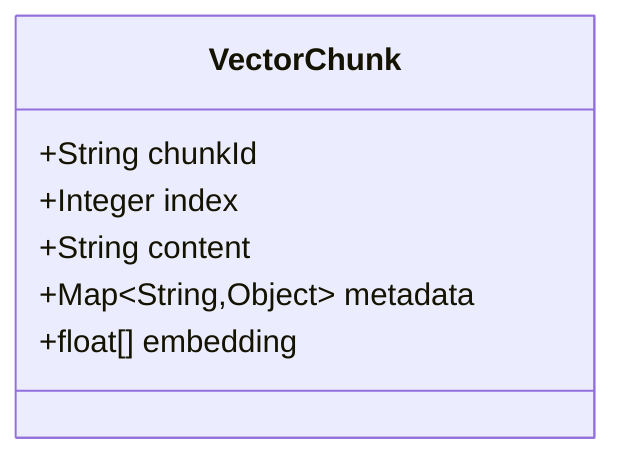

**图表来源**
- [VectorChunk.java:31-62](file://seahorse-agent-kernel/src/main/java/com/miracle/ai/seahorse/agent/kernel/domain/vector/VectorChunk.java#L31-L62)

**章节来源**
- [VectorChunk.java:31-62](file://seahorse-agent-kernel/src/main/java/com/miracle/ai/seahorse/agent/kernel/domain/vector/VectorChunk.java#L31-L62)

### DocumentParserPort（文档解析出站端口）
- 职责：定义文档解析接口，L2 Parser 节点只依赖该端口，具体解析能力由 L3 适配器提供。
- 方法：parse(content, mimeType, fileName, options)、plainText()

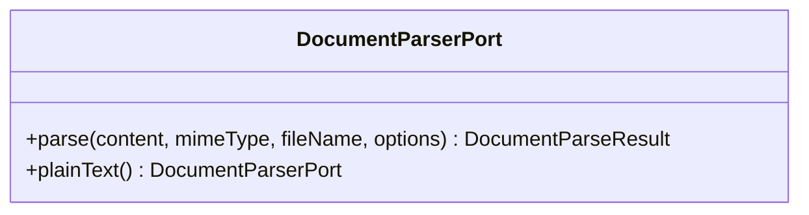

**图表来源**
- [DocumentParserPort.java:24-53](file://seahorse-agent-kernel/src/main/java/com/miracle/ai/seahorse/agent/ports/outbound/ingestion/DocumentParserPort.java#L24-L53)

**章节来源**
- [DocumentParserPort.java:24-53](file://seahorse-agent-kernel/src/main/java/com/miracle/ai/seahorse/agent/ports/outbound/ingestion/DocumentParserPort.java#L24-L53)

### 节点特征（核心处理单元）
- FetcherNodeFeature：负责从数据源获取原始字节流，校验并填充 MIME 类型、文件名等。
- ParserNodeFeature：调用 DocumentParserPort 解析原始字节为文本与元数据。
- EnhancerNodeFeature：对文本进行增强（如关键词抽取、摘要生成、上下文增强）。
- ChunkerNodeFeature：将文本切分为 VectorChunk，支持结构感知与固定大小两种策略，默认嵌入。
- EmbedderNodeFeature：为 VectorChunk 计算向量。
- EnricherNodeFeature：对每个 VectorChunk 进行元信息增强（如附加文档元数据）。
- IndexerNodeFeature：将 VectorChunk 写入向量存储与知识库，过滤与合并元数据。
- MetadataExtractorNodeFeature：从源元数据与解析元数据中抽取字段，支持 LLM 抽取。
- MetadataNormalizerNodeFeature：规范化抽取结果，计算置信度与证据。
- MetadataValidatorNodeFeature：校验规范化结果，决定接受/复核/隔离等决策。

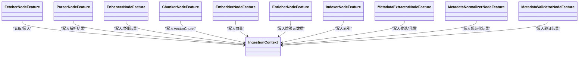

**图表来源**
- [FetcherNodeFeature.java:76-111](file://seahorse-agent-kernel/src/main/java/com/miracle/ai/seahorse/agent/kernel/feature/ingestion/FetcherNodeFeature.java#L76-L111)
- [ParserNodeFeature.java:69-104](file://seahorse-agent-kernel/src/main/java/com/miracle/ai/seahorse/agent/kernel/feature/ingestion/ParserNodeFeature.java#L69-L104)
- [EnhancerNodeFeature.java:66-117](file://seahorse-agent-kernel/src/main/java/com/miracle/ai/seahorse/agent/kernel/feature/ingestion/EnhancerNodeFeature.java#L66-L117)
- [ChunkerNodeFeature.java:70-88](file://seahorse-agent-kernel/src/main/java/com/miracle/ai/seahorse/agent/kernel/feature/ingestion/ChunkerNodeFeature.java#L70-L88)
- [EmbedderNodeFeature.java:57-70](file://seahorse-agent-kernel/src/main/java/com/miracle/ai/seahorse/agent/kernel/feature/ingestion/EmbedderNodeFeature.java#L57-L70)
- [EnricherNodeFeature.java:68-85](file://seahorse-agent-kernel/src/main/java/com/miracle/ai/seahorse/agent/kernel/feature/ingestion/EnricherNodeFeature.java#L68-L85)
- [IndexerNodeFeature.java:91-140](file://seahorse-agent-kernel/src/main/java/com/miracle/ai/seahorse/agent/kernel/feature/ingestion/IndexerNodeFeature.java#L91-L140)
- [MetadataExtractorNodeFeature.java:93-126](file://seahorse-agent-kernel/src/main/java/com/miracle/ai/seahorse/agent/kernel/feature/ingestion/MetadataExtractorNodeFeature.java#L93-L126)
- [MetadataNormalizerNodeFeature.java:71-102](file://seahorse-agent-kernel/src/main/java/com/miracle/ai/seahorse/agent/kernel/feature/ingestion/MetadataNormalizerNodeFeature.java#L71-L102)
- [MetadataValidatorNodeFeature.java:92-135](file://seahorse-agent-kernel/src/main/java/com/miracle/ai/seahorse/agent/kernel/feature/ingestion/MetadataValidatorNodeFeature.java#L92-L135)

**章节来源**
- [FetcherNodeFeature.java:76-111](file://seahorse-agent-kernel/src/main/java/com/miracle/ai/seahorse/agent/kernel/feature/ingestion/FetcherNodeFeature.java#L76-L111)
- [ParserNodeFeature.java:69-104](file://seahorse-agent-kernel/src/main/java/com/miracle/ai/seahorse/agent/kernel/feature/ingestion/ParserNodeFeature.java#L69-L104)
- [EnhancerNodeFeature.java:66-117](file://seahorse-agent-kernel/src/main/java/com/miracle/ai/seahorse/agent/kernel/feature/ingestion/EnhancerNodeFeature.java#L66-L117)
- [ChunkerNodeFeature.java:70-88](file://seahorse-agent-kernel/src/main/java/com/miracle/ai/seahorse/agent/kernel/feature/ingestion/ChunkerNodeFeature.java#L70-L88)
- [EmbedderNodeFeature.java:57-70](file://seahorse-agent-kernel/src/main/java/com/miracle/ai/seahorse/agent/kernel/feature/ingestion/EmbedderNodeFeature.java#L57-L70)
- [EnricherNodeFeature.java:68-85](file://seahorse-agent-kernel/src/main/java/com/miracle/ai/seahorse/agent/kernel/feature/ingestion/EnricherNodeFeature.java#L68-L85)
- [IndexerNodeFeature.java:91-140](file://seahorse-agent-kernel/src/main/java/com/miracle/ai/seahorse/agent/kernel/feature/ingestion/IndexerNodeFeature.java#L91-L140)
- [MetadataExtractorNodeFeature.java:93-126](file://seahorse-agent-kernel/src/main/java/com/miracle/ai/seahorse/agent/kernel/feature/ingestion/MetadataExtractorNodeFeature.java#L93-L126)
- [MetadataNormalizerNodeFeature.java:71-102](file://seahorse-agent-kernel/src/main/java/com/miracle/ai/seahorse/agent/kernel/feature/ingestion/MetadataNormalizerNodeFeature.java#L71-L102)
- [MetadataValidatorNodeFeature.java:92-135](file://seahorse-agent-kernel/src/main/java/com/miracle/ai/seahorse/agent/kernel/feature/ingestion/MetadataValidatorNodeFeature.java#L92-L135)

### 执行引擎与任务服务
- KernelIngestionEngine：解析流水线拓扑，串行执行节点，处理条件端口与日志端口，失败时中断并记录错误。
- KernelIngestionTaskService：创建运行中任务，构建上下文，调用引擎执行，更新任务状态与日志，汇总结果。
- KernelIngestionPipelineService：提供流水线的创建、查询、分页与删除等管理能力。

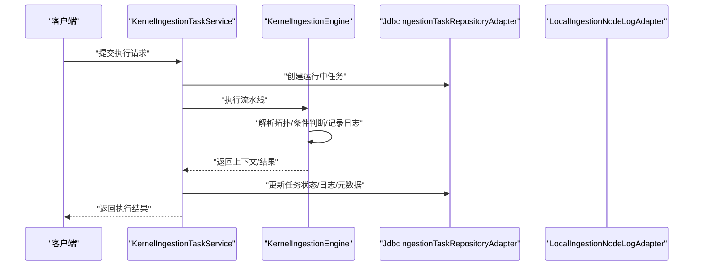

**图表来源**
- [KernelIngestionTaskService.java:128-210](file://seahorse-agent-kernel/src/main/java/com/miracle/ai/seahorse/agent/kernel/application/ingestion/KernelIngestionTaskService.java#L128-L210)
- [KernelIngestionEngine.java:79-192](file://seahorse-agent-kernel/src/main/java/com/miracle/ai/seahorse/agent/kernel/application/ingestion/KernelIngestionEngine.java#L79-L192)
- [JdbcIngestionTaskRepositoryAdapter.java:55-231](file://seahorse-agent-adapter-repository-jdbc/src/main/java/com/miracle/ai/seahorse/agent/adapters/repository/jdbc/JdbcIngestionTaskRepositoryAdapter.java#L55-L231)
- [LocalIngestionNodeLogAdapter.java:35-60](file://seahorse-agent-adapter-web/src/main/java/com/miracle/ai/seahorse/agent/adapters/local/LocalIngestionNodeLogAdapter.java#L35-L60)

**章节来源**
- [KernelIngestionEngine.java:79-192](file://seahorse-agent-kernel/src/main/java/com/miracle/ai/seahorse/agent/kernel/application/ingestion/KernelIngestionEngine.java#L79-L192)
- [KernelIngestionTaskService.java:128-210](file://seahorse-agent-kernel/src/main/java/com/miracle/ai/seahorse/agent/kernel/application/ingestion/KernelIngestionTaskService.java#L128-L210)
- [KernelIngestionPipelineService.java:30-120](file://seahorse-agent-kernel/src/main/java/com/miracle/ai/seahorse/agent/kernel/application/ingestion/KernelIngestionPipelineService.java#L30-L120)

### 文档处理流程时序图（从上传到知识库入库）
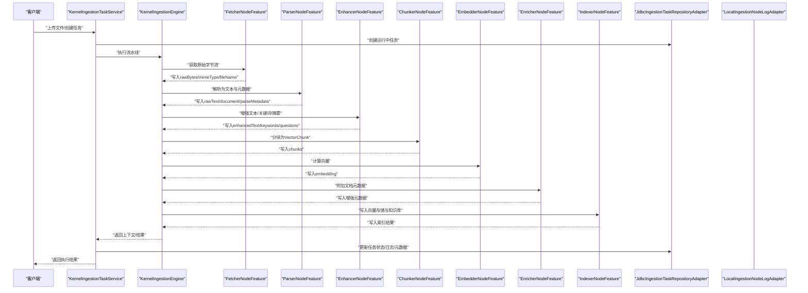

**图表来源**
- [pdf-ingestion-example.md:1-80](file://docs/examples/pdf-ingestion-example.md#L1-L80)
- [KernelIngestionTaskService.java:128-210](file://seahorse-agent-kernel/src/main/java/com/miracle/ai/seahorse/agent/kernel/application/ingestion/KernelIngestionTaskService.java#L128-L210)
- [KernelIngestionEngine.java:79-192](file://seahorse-agent-kernel/src/main/java/com/miracle/ai/seahorse/agent/kernel/application/ingestion/KernelIngestionEngine.java#L79-L192)
- [FetcherNodeFeature.java:76-111](file://seahorse-agent-kernel/src/main/java/com/miracle/ai/seahorse/agent/kernel/feature/ingestion/FetcherNodeFeature.java#L76-L111)
- [ParserNodeFeature.java:69-104](file://seahorse-agent-kernel/src/main/java/com/miracle/ai/seahorse/agent/kernel/feature/ingestion/ParserNodeFeature.java#L69-L104)
- [EnhancerNodeFeature.java:66-117](file://seahorse-agent-kernel/src/main/java/com/miracle/ai/seahorse/agent/kernel/feature/ingestion/EnhancerNodeFeature.java#L66-L117)
- [ChunkerNodeFeature.java:70-88](file://seahorse-agent-kernel/src/main/java/com/miracle/ai/seahorse/agent/kernel/feature/ingestion/ChunkerNodeFeature.java#L70-L88)
- [EmbedderNodeFeature.java:57-70](file://seahorse-agent-kernel/src/main/java/com/miracle/ai/seahorse/agent/kernel/feature/ingestion/EmbedderNodeFeature.java#L57-L70)
- [EnricherNodeFeature.java:68-85](file://seahorse-agent-kernel/src/main/java/com/miracle/ai/seahorse/agent/kernel/feature/ingestion/EnricherNodeFeature.java#L68-L85)
- [IndexerNodeFeature.java:91-140](file://seahorse-agent-kernel/src/main/java/com/miracle/ai/seahorse/agent/kernel/feature/ingestion/IndexerNodeFeature.java#L91-L140)
- [JdbcIngestionTaskRepositoryAdapter.java:55-231](file://seahorse-agent-adapter-repository-jdbc/src/main/java/com/miracle/ai/seahorse/agent/adapters/repository/jdbc/JdbcIngestionTaskRepositoryAdapter.java#L55-L231)
- [LocalIngestionNodeLogAdapter.java:35-60](file://seahorse-agent-adapter-web/src/main/java/com/miracle/ai/seahorse/agent/adapters/local/LocalIngestionNodeLogAdapter.java#L35-L60)

**章节来源**
- [pdf-ingestion-example.md:1-80](file://docs/examples/pdf-ingestion-example.md#L1-L80)

### 分块策略与向量化处理
- 分块策略：支持结构感知与固定大小两种策略，可配置分块大小与重叠大小，默认启用嵌入。
- 向量化：可由 Chunker 节点直接嵌入，也可通过独立 Embedder 节点处理，最终生成 VectorChunk 并写入索引。

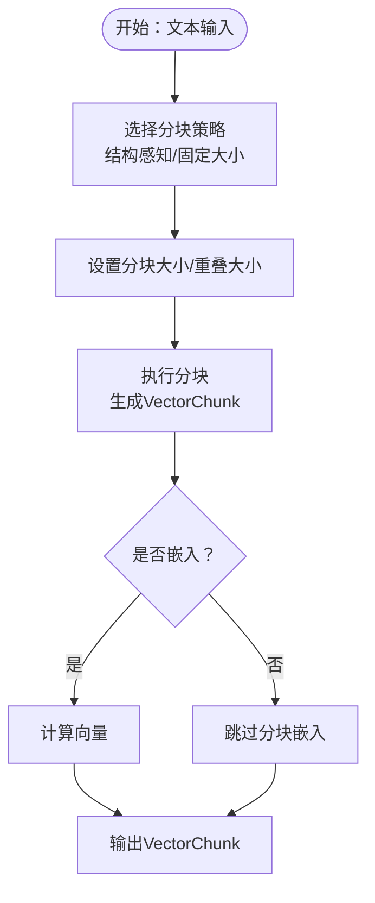

**图表来源**
- [ChunkerNodeFeature.java:90-120](file://seahorse-agent-kernel/src/main/java/com/miracle/ai/seahorse/agent/kernel/feature/ingestion/ChunkerNodeFeature.java#L90-L120)
- [ChunkerNodeFeature.java:225-233](file://seahorse-agent-kernel/src/main/java/com/miracle/ai/seahorse/agent/kernel/feature/ingestion/ChunkerNodeFeature.java#L225-L233)
- [EmbedderNodeFeature.java:57-70](file://seahorse-agent-kernel/src/main/java/com/miracle/ai/seahorse/agent/kernel/feature/ingestion/EmbedderNodeFeature.java#L57-L70)

**章节来源**
- [ChunkerNodeFeature.java:90-120](file://seahorse-agent-kernel/src/main/java/com/miracle/ai/seahorse/agent/kernel/feature/ingestion/ChunkerNodeFeature.java#L90-L120)
- [ChunkerNodeFeature.java:225-233](file://seahorse-agent-kernel/src/main/java/com/miracle/ai/seahorse/agent/kernel/feature/ingestion/ChunkerNodeFeature.java#L225-L233)
- [EmbedderNodeFeature.java:57-70](file://seahorse-agent-kernel/src/main/java/com/miracle/ai/seahorse/agent/kernel/feature/ingestion/EmbedderNodeFeature.java#L57-L70)

### 元数据提取与治理
- 元数据抽取：支持从源元数据与解析元数据中抽取字段，可启用 LLM 抽取。
- 元数据规范化：计算置信度与证据，处理多来源冲突。
- 元数据验证：校验字段是否注册、是否必填，决定接受、复核或隔离。

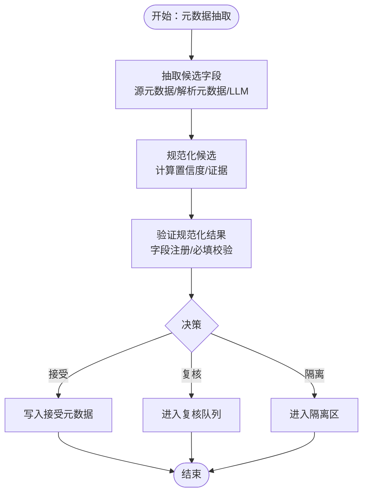

**图表来源**
- [MetadataExtractorNodeFeature.java:93-126](file://seahorse-agent-kernel/src/main/java/com/miracle/ai/seahorse/agent/kernel/feature/ingestion/MetadataExtractorNodeFeature.java#L93-L126)
- [MetadataNormalizerNodeFeature.java:71-102](file://seahorse-agent-kernel/src/main/java/com/miracle/ai/seahorse/agent/kernel/feature/ingestion/MetadataNormalizerNodeFeature.java#L71-L102)
- [MetadataValidatorNodeFeature.java:92-135](file://seahorse-agent-kernel/src/main/java/com/miracle/ai/seahorse/agent/kernel/feature/ingestion/MetadataValidatorNodeFeature.java#L92-L135)

**章节来源**
- [MetadataExtractorNodeFeature.java:93-126](file://seahorse-agent-kernel/src/main/java/com/miracle/ai/seahorse/agent/kernel/feature/ingestion/MetadataExtractorNodeFeature.java#L93-L126)
- [MetadataNormalizerNodeFeature.java:71-102](file://seahorse-agent-kernel/src/main/java/com/miracle/ai/seahorse/agent/kernel/feature/ingestion/MetadataNormalizerNodeFeature.java#L71-L102)
- [MetadataValidatorNodeFeature.java:92-135](file://seahorse-agent-kernel/src/main/java/com/miracle/ai/seahorse/agent/kernel/feature/ingestion/MetadataValidatorNodeFeature.java#L92-L135)

### 状态管理、重试机制与错误处理
- 状态管理：任务状态在引擎执行过程中由 PENDING 变为 RUNNING，最终变为 COMPLETED 或 FAILED。
- 错误处理：节点执行失败时，引擎记录错误并中断后续节点执行；任务服务负责更新任务状态与错误信息。
- 日志记录：节点执行结果通过 IngestionNodeLogPort 记录，便于追踪与审计。

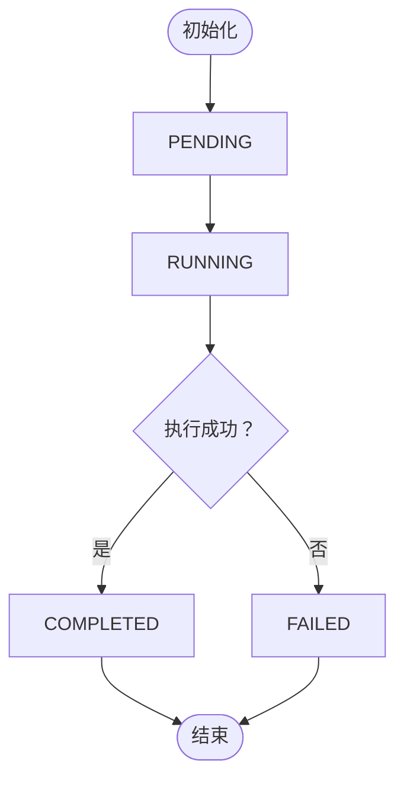

**图表来源**
- [KernelIngestionEngine.java:174-192](file://seahorse-agent-kernel/src/main/java/com/miracle/ai/seahorse/agent/kernel/application/ingestion/KernelIngestionEngine.java#L174-L192)
- [KernelIngestionTaskService.java:183-210](file://seahorse-agent-kernel/src/main/java/com/miracle/ai/seahorse/agent/kernel/application/ingestion/KernelIngestionTaskService.java#L183-L210)
- [IngestionStatus.java:23-27](file://seahorse-agent-kernel/src/main/java/com/miracle/ai/seahorse/agent/kernel/domain/ingestion/IngestionStatus.java#L23-L27)

**章节来源**
- [KernelIngestionEngine.java:174-192](file://seahorse-agent-kernel/src/main/java/com/miracle/ai/seahorse/agent/kernel/application/ingestion/KernelIngestionEngine.java#L174-L192)
- [KernelIngestionTaskService.java:183-210](file://seahorse-agent-kernel/src/main/java/com/miracle/ai/seahorse/agent/kernel/application/ingestion/KernelIngestionTaskService.java#L183-L210)
- [IngestionStatus.java:23-27](file://seahorse-agent-kernel/src/main/java/com/miracle/ai/seahorse/agent/kernel/domain/ingestion/IngestionStatus.java#L23-L27)

### 实际应用场景与示例
- PDF 摄取示例：演示从上传 PDF 到解析、增强、分块、向量化与索引的完整流程。
- 请求模板：提供完整的流水线创建与任务上传请求体示例。

**章节来源**
- [pdf-ingestion-example.md:1-80](file://docs/examples/pdf-ingestion-example.md#L1-L80)
- [pdf-pipeline-request.json:1-60](file://docs/examples/pdf-pipeline-request.json#L1-L60)

## 依赖分析
- 组件耦合与内聚：节点特征内聚于单一职责，通过 IngestionContext 传递数据，降低耦合；引擎与服务层负责编排与持久化。
- 直接与间接依赖：引擎依赖节点特征与条件/日志端口；任务服务依赖引擎与仓库适配器；解析器通过 DocumentParserPort 与具体适配器解耦。
- 外部依赖与集成点：Tika 解析器、JDBC 仓库、本地日志适配器等。

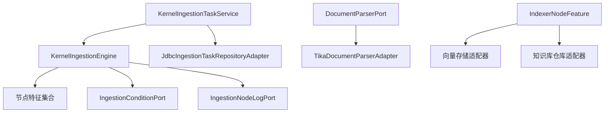

**图表来源**
- [KernelIngestionEngine.java:79-192](file://seahorse-agent-kernel/src/main/java/com/miracle/ai/seahorse/agent/kernel/application/ingestion/KernelIngestionEngine.java#L79-L192)
- [KernelIngestionTaskService.java:128-210](file://seahorse-agent-kernel/src/main/java/com/miracle/ai/seahorse/agent/kernel/application/ingestion/KernelIngestionTaskService.java#L128-L210)
- [DocumentParserPort.java:24-53](file://seahorse-agent-kernel/src/main/java/com/miracle/ai/seahorse/agent/ports/outbound/ingestion/DocumentParserPort.java#L24-L53)
- [TikaDocumentParserAdapter.java:44-120](file://seahorse-agent-adapter-parser-tika/src/main/java/com/miracle/ai/seahorse/agent/adapters/parser/tika/TikaDocumentParserAdapter.java#L44-L120)
- [JdbcIngestionTaskRepositoryAdapter.java:55-231](file://seahorse-agent-adapter-repository-jdbc/src/main/java/com/miracle/ai/seahorse/agent/adapters/repository/jdbc/JdbcIngestionTaskRepositoryAdapter.java#L55-L231)

**章节来源**
- [KernelIngestionEngine.java:79-192](file://seahorse-agent-kernel/src/main/java/com/miracle/ai/seahorse/agent/kernel/application/ingestion/KernelIngestionEngine.java#L79-L192)
- [KernelIngestionTaskService.java:128-210](file://seahorse-agent-kernel/src/main/java/com/miracle/ai/seahorse/agent/kernel/application/ingestion/KernelIngestionTaskService.java#L128-L210)
- [DocumentParserPort.java:24-53](file://seahorse-agent-kernel/src/main/java/com/miracle/ai/seahorse/agent/ports/outbound/ingestion/DocumentParserPort.java#L24-L53)

## 性能考虑
- 并发处理：通过任务服务与引擎的解耦，可在不同节点间并行处理多个任务；建议结合消息队列与限流策略实现高吞吐。
- 资源限制：合理配置分块大小与重叠大小，避免过大导致内存压力；向量化模型调用需考虑 GPU/CPU 资源。
- 增量更新：支持基于文档 ID 的增量刷新与回填，减少重复处理成本。
- 批量处理：批量上传与批量回填可显著提升吞吐，建议在任务服务中实现批处理策略。
- 实时处理：对于实时场景，建议采用流式处理与异步写入，确保低延迟与高可用。

## 故障排查指南
- 任务状态异常：检查任务服务是否正确更新状态与错误信息；查看节点日志定位失败节点。
- 解析失败：确认 DocumentParserPort 的实现与文件类型匹配；检查 MIME 类型与文件名解析。
- 分块/嵌入失败：验证分块策略与向量模型配置；检查 VectorChunk 是否包含必要字段。
- 元数据问题：通过元数据抽取/规范化/验证节点的日志与问题记录，定位字段缺失或冲突。
- 回填失败：检查回填服务的暂停原因与隔离记录，修复模式缺失或版本不一致问题。

**章节来源**
- [KernelIngestionTaskService.java:183-210](file://seahorse-agent-kernel/src/main/java/com/miracle/ai/seahorse/agent/kernel/application/ingestion/KernelIngestionTaskService.java#L183-L210)
- [KernelMetadataBackfillService.java:385-408](file://seahorse-agent-kernel/src/main/java/com/miracle/ai/seahorse/agent/kernel/application/metadata/KernelMetadataBackfillService.java#L385-L408)
- [LocalIngestionNodeLogAdapter.java:35-60](file://seahorse-agent-adapter-web/src/main/java/com/miracle/ai/seahorse/agent/adapters/local/LocalIngestionNodeLogAdapter.java#L35-L60)

## 结论
本文档系统梳理了摄取领域模型与执行机制，明确了任务服务、引擎与节点特征之间的协作关系，并结合解析与向量化适配器给出了实际落地方案。通过规范的流水线拓扑、条件执行与可观测性记录，系统能够稳定地完成从文档获取到索引的全流程处理。建议在生产环境中配合消息队列与限流策略实现高吞吐与高可用，并持续优化分块与向量参数以获得最佳检索效果。

## 附录
- 使用示例：PDF 摄取完整示例与请求模板
  - [pdf-ingestion-example.md:1-80](file://docs/examples/pdf-ingestion-example.md#L1-L80)
  - [pdf-pipeline-request.json:1-60](file://docs/examples/pdf-pipeline-request.json#L1-L60)