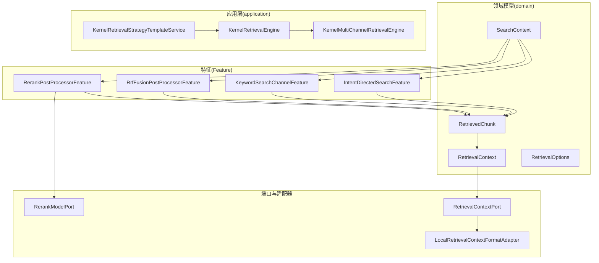
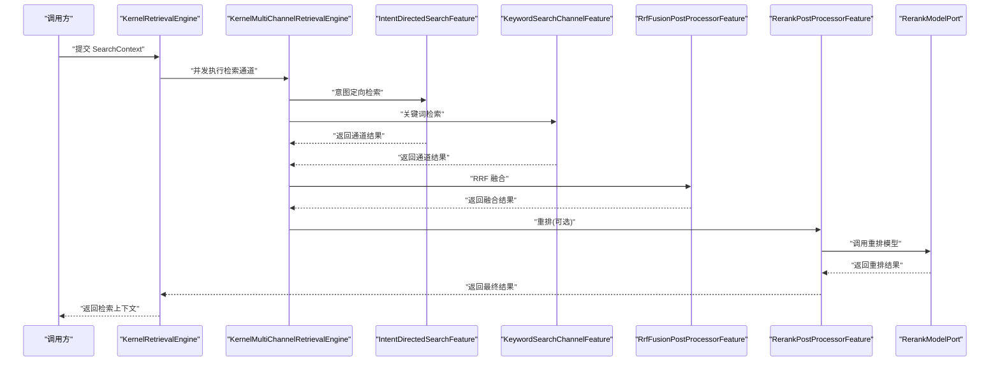
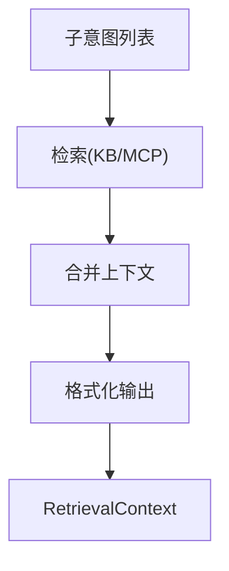
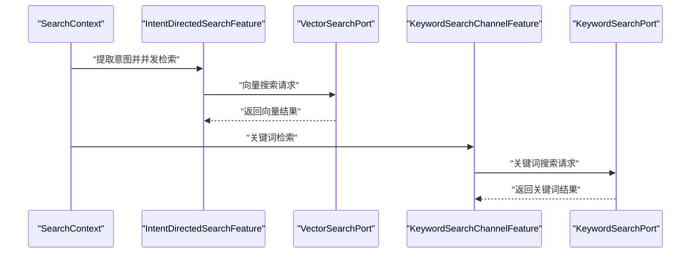
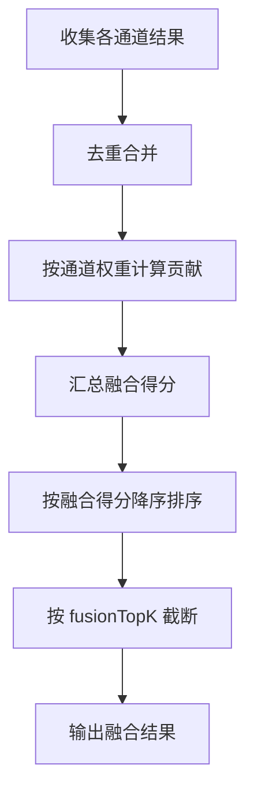
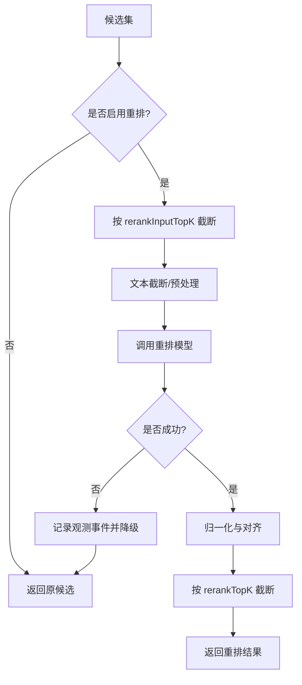
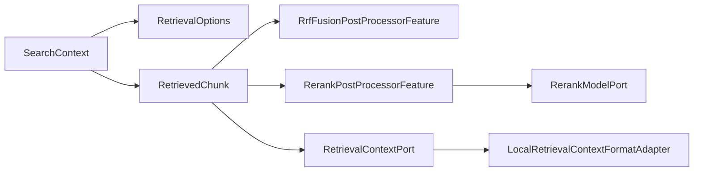

# 检索领域模型

<cite>
**本文引用的文件**
- [RetrievalContext.java](file://seahorse-agent-kernel/src/main/java/com/miracle/ai/seahorse/agent/kernel/domain/retrieval/RetrievalContext.java)
- [RetrievedChunk.java](file://seahorse-agent-kernel/src/main/java/com/miracle/ai/seahorse/agent/kernel/domain/retrieval/RetrievedChunk.java)
- [SearchContext.java](file://seahorse-agent-kernel/src/main/java/com/miracle/ai/seahorse/agent/kernel/domain/retrieval/SearchContext.java)
- [RetrievalOptions.java](file://seahorse-agent-kernel/src/main/java/com/miracle/ai/seahorse/agent/kernel/domain/retrieval/RetrievalOptions.java)
- [RerankPostProcessorFeature.java](file://seahorse-agent-kernel/src/main/java/com/miracle/ai/seahorse/agent/kernel/feature/retrieval/RerankPostProcessorFeature.java)
- [IntentDirectedSearchFeature.java](file://seahorse-agent-kernel/src/main/java/com/miracle/ai/seahorse/agent/kernel/feature/retrieval/IntentDirectedSearchFeature.java)
- [KeywordSearchChannelFeature.java](file://seahorse-agent-kernel/src/main/java/com/miracle/ai/seahorse/agent/kernel/feature/retrieval/KeywordSearchChannelFeature.java)
- [RrfFusionPostProcessorFeature.java](file://seahorse-agent-kernel/src/main/java/com/miracle/ai/seahorse/agent/kernel/feature/retrieval/RrfFusionPostProcessorFeature.java)
- [KernelRetrievalEngine.java](file://seahorse-agent-kernel/src/main/java/com/miracle/ai/seahorse/agent/kernel/application/retrieval/KernelRetrievalEngine.java)
- [KernelMultiChannelRetrievalEngine.java](file://seahorse-agent-kernel/src/main/java/com/miracle/ai/seahorse/agent/kernel/application/retrieval/KernelMultiChannelRetrievalEngine.java)
- [KernelRetrievalStrategyTemplateService.java](file://seahorse-agent-kernel/src/main/java/com/miracle/ai/seahorse/agent/kernel/application/retrieval/KernelRetrievalStrategyTemplateService.java)
- [RerankModelPort.java](file://seahorse-agent-kernel/src/main/java/com/miracle/ai/seahorse/agent/ports/outbound/model/RerankModelPort.java)
- [RetrievalContextPort.java](file://seahorse-agent-kernel/src/main/java/com/miracle/ai/seahorse/agent/ports/outbound/chat/RetrievalContextPort.java)
- [LocalRetrievalContextFormatAdapter.java](file://seahorse-agent-adapter-web/src/main/java/com/miracle/ai/seahorse/agent/adapters/local/LocalRetrievalContextFormatAdapter.java)
- [RerankPostProcessorFeatureTests.java](file://seahorse-agent-tests/src/test/java/com/miracle/ai/seahorse/agent/kernel/feature/retrieval/RerankPostProcessorFeatureTests.java)
- [IntentDirectedSearchFeatureTests.java](file://seahorse-agent-tests/src/test/java/com/miracle/ai/seahorse/agent/kernel/feature/retrieval/IntentDirectedSearchFeatureTests.java)
- [RrfFusionPostProcessorFeatureTests.java](file://seahorse-agent-tests/src/test/java/com/miracle/ai/seahorse/agent/kernel/feature/retrieval/RrfFusionPostProcessorFeatureTests.java)
- [RetrievalEvaluationCase.java](file://seahorse-agent-kernel/src/main/java/com/miracle/ai/seahorse/agent/ports/inbound/retrieval/RetrievalEvaluationCase.java)
- [KernelRetrievalEvaluationDatasetService.java](file://seahorse-agent-kernel/src/main/java/com/miracle/ai/seahorse/agent/kernel/application/retrieval/KernelRetrievalEvaluationDatasetService.java)
- [SeahorseRetrievalEvaluationController.java](file://seahorse-agent-adapter-web/src/main/java/com/miracle/ai/seahorse/agent/adapters/web/SeahorseRetrievalEvaluationController.java)
- [SeahorseRetrievalStrategyTemplateController.java](file://seahorse-agent-adapter-web/src/main/java/com/miracle/ai/seahorse/agent/adapters/web/SeahorseRetrievalStrategyTemplateController.java)
</cite>

## 目录
1. [引言](#引言)
2. [项目结构](#项目结构)
3. [核心组件](#核心组件)
4. [架构总览](#架构总览)
5. [详细组件分析](#详细组件分析)
6. [依赖分析](#依赖分析)
7. [性能考虑](#性能考虑)
8. [故障排查指南](#故障排查指南)
9. [结论](#结论)
10. [附录](#附录)

## 引言
本文件系统化梳理检索领域的领域模型与实现，围绕以下目标展开：
- 定义检索相关的核心实体：SearchContext、RetrievalContext、RetrievedChunk、RetrievalOptions 等，阐明其属性、约束与业务规则。
- 解释检索策略配置、上下文组装、结果重排、评分与融合机制。
- 说明检索与向量搜索、关键词搜索、混合检索的关系与协同方式。
- 提供检索流程的序列图与算法流程图，覆盖从查询到结果的完整链路。
- 展示多策略并行、结果融合、上下文增强、性能优化等能力。
- 提供检索评估、A/B 测试、性能调优的实际应用参考。

## 项目结构
检索领域模型主要位于 kernel 的 domain 与 feature 包中，应用层负责编排与策略模板，适配器层提供 Web 控制器与上下文格式化实现。

**图表来源**
- [SearchContext.java:35-70](file://seahorse-agent-kernel/src/main/java/com/miracle/ai/seahorse/agent/kernel/domain/retrieval/SearchContext.java#L35-L70)
- [RetrievalContext.java:29-50](file://seahorse-agent-kernel/src/main/java/com/miracle/ai/seahorse/agent/kernel/domain/retrieval/RetrievalContext.java#L29-L50)
- [RetrievedChunk.java:37-82](file://seahorse-agent-kernel/src/main/java/com/miracle/ai/seahorse/agent/kernel/domain/retrieval/RetrievedChunk.java#L37-L82)
- [RetrievalOptions.java:14-64](file://seahorse-agent-kernel/src/main/java/com/miracle/ai/seahorse/agent/kernel/domain/retrieval/RetrievalOptions.java#L14-L64)
- [IntentDirectedSearchFeature.java:78-142](file://seahorse-agent-kernel/src/main/java/com/miracle/ai/seahorse/agent/kernel/feature/retrieval/IntentDirectedSearchFeature.java#L78-L142)
- [KeywordSearchChannelFeature.java:29-73](file://seahorse-agent-kernel/src/main/java/com/miracle/ai/seahorse/agent/kernel/feature/retrieval/KeywordSearchChannelFeature.java#L29-L73)
- [RrfFusionPostProcessorFeature.java:114-149](file://seahorse-agent-kernel/src/main/java/com/miracle/ai/seahorse/agent/kernel/feature/retrieval/RrfFusionPostProcessorFeature.java#L114-L149)
- [RerankPostProcessorFeature.java:58-123](file://seahorse-agent-kernel/src/main/java/com/miracle/ai/seahorse/agent/kernel/feature/retrieval/RerankPostProcessorFeature.java#L58-L123)
- [KernelRetrievalEngine.java:52-55](file://seahorse-agent-kernel/src/main/java/com/miracle/ai/seahorse/agent/kernel/application/retrieval/KernelRetrievalEngine.java#L52-L55)
- [KernelMultiChannelRetrievalEngine.java:46](file://seahorse-agent-kernel/src/main/java/com/miracle/ai/seahorse/agent/kernel/application/retrieval/KernelMultiChannelRetrievalEngine.java#L46)
- [KernelRetrievalStrategyTemplateService.java:111-142](file://seahorse-agent-kernel/src/main/java/com/miracle/ai/seahorse/agent/kernel/application/retrieval/KernelRetrievalStrategyTemplateService.java#L111-L142)
- [RerankModelPort.java:29-48](file://seahorse-agent-kernel/src/main/java/com/miracle/ai/seahorse/agent/ports/outbound/model/RerankModelPort.java#L29-L48)
- [RetrievalContextPort.java:28-38](file://seahorse-agent-kernel/src/main/java/com/miracle/ai/seahorse/agent/ports/outbound/chat/RetrievalContextPort.java#L28-L38)
- [LocalRetrievalContextFormatAdapter.java:35](file://seahorse-agent-adapter-web/src/main/java/com/miracle/ai/seahorse/agent/adapters/local/LocalRetrievalContextFormatAdapter.java#L35)

**章节来源**
- [SearchContext.java:35-70](file://seahorse-agent-kernel/src/main/java/com/miracle/ai/seahorse/agent/kernel/domain/retrieval/SearchContext.java#L35-L70)
- [RetrievalContext.java:29-50](file://seahorse-agent-kernel/src/main/java/com/miracle/ai/seahorse/agent/kernel/domain/retrieval/RetrievalContext.java#L29-L50)
- [RetrievedChunk.java:37-82](file://seahorse-agent-kernel/src/main/java/com/miracle/ai/seahorse/agent/kernel/domain/retrieval/RetrievedChunk.java#L37-L82)
- [RetrievalOptions.java:14-64](file://seahorse-agent-kernel/src/main/java/com/miracle/ai/seahorse/agent/kernel/domain/retrieval/RetrievalOptions.java#L14-L64)

## 核心组件
- SearchContext：检索阶段共享上下文，承载原始问题、改写问题、子问题、意图、topK、过滤器、选项、编译后的元数据过滤、追踪作用域与元数据。
- RetrievedChunk：最小检索命中单元，包含 id、text、score、租户/知识库/文档/集合信息、元数据、通道得分与排名、融合解释、融合得分、重排得分等。
- RetrievalContext：KB 与 MCP 检索上下文的统一承载模型，支持 mcpContext、kbContext 二选一或并存，并提供来源存在性与空值判断。
- RetrievalOptions：检索策略参数，包含 finalTopK/vectorTopK/keywordTopK/fusionTopK/rerankTopK、开关 enableVector/enableIntentDirected/enableKeyword/enableRrf/enableRerank、embeddingModel/rerankModel、各通道超时与通道权重设置等。

业务规则与约束：
- SearchContext 的 effectiveOptions 优先使用传入 options，否则回退到 defaults(topK)，确保默认启用向量与 RRF，关键词与重排默认关闭。
- RetrievedChunk 的字段用于支撑排序、去重、融合解释与重排，其中 fusionExplanation 记录 RRF 参数、通道排名与贡献，便于可观测性与排障。
- RetrievalContext 提供 hasMcp/hasKb/isEmpty 等便捷判断，便于上层上下文拼装与渲染。

**章节来源**
- [SearchContext.java:60-70](file://seahorse-agent-kernel/src/main/java/com/miracle/ai/seahorse/agent/kernel/domain/retrieval/SearchContext.java#L60-L70)
- [RetrievedChunk.java:37-82](file://seahorse-agent-kernel/src/main/java/com/miracle/ai/seahorse/agent/kernel/domain/retrieval/RetrievedChunk.java#L37-L82)
- [RetrievalContext.java:29-50](file://seahorse-agent-kernel/src/main/java/com/miracle/ai/seahorse/agent/kernel/domain/retrieval/RetrievalContext.java#L29-L50)
- [RetrievalOptions.java:14-64](file://seahorse-agent-kernel/src/main/java/com/miracle/ai/seahorse/agent/kernel/domain/retrieval/RetrievalOptions.java#L14-L64)

## 架构总览
检索系统采用“意图驱动 + 多通道并行 + 结果融合 + 重排”的分层架构：
- 应用层负责策略模板与引擎编排，支持单通道与多通道混合检索。
- 特征层实现具体检索通道（意图定向、关键词）与后处理（RRF 融合、重排）。
- 领域模型统一承载检索状态与结果。
- 端口抽象屏蔽底层实现细节，便于替换与扩展。

**图表来源**
- [KernelRetrievalEngine.java:52-55](file://seahorse-agent-kernel/src/main/java/com/miracle/ai/seahorse/agent/kernel/application/retrieval/KernelRetrievalEngine.java#L52-L55)
- [KernelMultiChannelRetrievalEngine.java:46](file://seahorse-agent-kernel/src/main/java/com/miracle/ai/seahorse/agent/kernel/application/retrieval/KernelMultiChannelRetrievalEngine.java#L46)
- [IntentDirectedSearchFeature.java:106-114](file://seahorse-agent-kernel/src/main/java/com/miracle/ai/seahorse/agent/kernel/feature/retrieval/IntentDirectedSearchFeature.java#L106-L114)
- [KeywordSearchChannelFeature.java:55-72](file://seahorse-agent-kernel/src/main/java/com/miracle/ai/seahorse/agent/kernel/feature/retrieval/KeywordSearchChannelFeature.java#L55-L72)
- [RrfFusionPostProcessorFeature.java:114-149](file://seahorse-agent-kernel/src/main/java/com/miracle/ai/seahorse/agent/kernel/feature/retrieval/RrfFusionPostProcessorFeature.java#L114-L149)
- [RerankPostProcessorFeature.java:72-123](file://seahorse-agent-kernel/src/main/java/com/miracle/ai/seahorse/agent/kernel/feature/retrieval/RerankPostProcessorFeature.java#L72-L123)
- [RerankModelPort.java:29-48](file://seahorse-agent-kernel/src/main/java/com/miracle/ai/seahorse/agent/ports/outbound/model/RerankModelPort.java#L29-L48)

## 详细组件分析

### 检索策略配置与模板
- KernelRetrievalStrategyTemplateService 提供内置策略模板，如“混合召回 RRF”与“混合召回重排”，分别通过 enableRrf 或 enableRerank 控制下游后处理。
- RetrievalOptions.defaults(topK) 默认启用向量与 RRF，关键词与重排默认关闭，保证开箱即用且兼顾性能。

关键点：
- finalTopK 控制最终输出规模，vectorTopK/keywordTopK/fusionTopK/rerankTopK 作为中间放大系数，配合各阶段截断。
- channelSettings 支持自定义 RRF 权重与融合参数，便于 A/B 测试与策略迭代。

**章节来源**
- [KernelRetrievalStrategyTemplateService.java:111-142](file://seahorse-agent-kernel/src/main/java/com/miracle/ai/seahorse/agent/kernel/application/retrieval/KernelRetrievalStrategyTemplateService.java#L111-L142)
- [RetrievalOptions.java:45-59](file://seahorse-agent-kernel/src/main/java/com/miracle/ai/seahorse/agent/kernel/domain/retrieval/RetrievalOptions.java#L45-L59)

### 上下文组装与格式化
- RetrievalContextPort 定义检索上下文端口，负责基于子意图检索 KB 与 MCP，并合并为统一上下文。
- LocalRetrievalContextFormatAdapter 提供本地实现，将检索结果格式化为可渲染的上下文字符串。

**图表来源**
- [RetrievalContextPort.java:28-38](file://seahorse-agent-kernel/src/main/java/com/miracle/ai/seahorse/agent/ports/outbound/chat/RetrievalContextPort.java#L28-L38)
- [LocalRetrievalContextFormatAdapter.java:35](file://seahorse-agent-adapter-web/src/main/java/com/miracle/ai/seahorse/agent/adapters/local/LocalRetrievalContextFormatAdapter.java#L35)

**章节来源**
- [RetrievalContextPort.java:28-38](file://seahorse-agent-kernel/src/main/java/com/miracle/ai/seahorse/agent/ports/outbound/chat/RetrievalContextPort.java#L28-L38)
- [LocalRetrievalContextFormatAdapter.java:35](file://seahorse-agent-adapter-web/src/main/java/com/miracle/ai/seahorse/agent/adapters/local/LocalRetrievalContextFormatAdapter.java#L35)

### 检索通道与并行执行
- 意图定向通道（IntentDirectedSearchFeature）：根据子意图并发发起向量检索，按意图置信度与集合配置调整 topK，异常意图不影响整体结果。
- 关键词通道（KeywordSearchChannelFeature）：基于 BM25 的关键词检索，受 RetrievalOptions.enableKeyword 控制。

**图表来源**
- [IntentDirectedSearchFeature.java:126-135](file://seahorse-agent-kernel/src/main/java/com/miracle/ai/seahorse/agent/kernel/feature/retrieval/IntentDirectedSearchFeature.java#L126-L135)
- [KeywordSearchChannelFeature.java:55-72](file://seahorse-agent-kernel/src/main/java/com/miracle/ai/seahorse/agent/kernel/feature/retrieval/KeywordSearchChannelFeature.java#L55-L72)

**章节来源**
- [IntentDirectedSearchFeature.java:106-114](file://seahorse-agent-kernel/src/main/java/com/miracle/ai/seahorse/agent/kernel/feature/retrieval/IntentDirectedSearchFeature.java#L106-L114)
- [IntentDirectedSearchFeatureTests.java:55-112](file://seahorse-agent-tests/src/test/java/com/miracle/ai/seahorse/agent/kernel/feature/retrieval/IntentDirectedSearchFeatureTests.java#L55-L112)
- [KeywordSearchChannelFeature.java:47-72](file://seahorse-agent-kernel/src/main/java/com/miracle/ai/seahorse/agent/kernel/feature/retrieval/KeywordSearchChannelFeature.java#L47-L72)

### 结果融合（RRF）
- RrfFusionPostProcessorFeature 将多通道结果按 RRF 公式融合，支持通道权重与 k 参数配置，默认 k=60，意图通道权重更高。
- 融合后按 fusionTopK 截断，并记录融合解释（strategy、rrfK、fusionScore、channelRanks、channelContributions），便于可观测性与排障。

**图表来源**
- [RrfFusionPostProcessorFeature.java:114-149](file://seahorse-agent-kernel/src/main/java/com/miracle/ai/seahorse/agent/kernel/feature/retrieval/RrfFusionPostProcessorFeature.java#L114-L149)

**章节来源**
- [RrfFusionPostProcessorFeature.java:114-149](file://seahorse-agent-kernel/src/main/java/com/miracle/ai/seahorse/agent/kernel/feature/retrieval/RrfFusionPostProcessorFeature.java#L114-L149)
- [RrfFusionPostProcessorFeatureTests.java:54-159](file://seahorse-agent-tests/src/test/java/com/miracle/ai/seahorse/agent/kernel/feature/retrieval/RrfFusionPostProcessorFeatureTests.java#L54-L159)

### 结果重排（Rerank）
- RerankPostProcessorFeature 在候选集上执行重排，支持超时控制与降级（超时或异常时保留原候选并记录观测事件）。
- 重排前先按 rerankInputTopK 收窄候选，再按 rerankTopK 输出，兼顾成本与效果。
- 通过 RerankModelPort 抽象模型调用，支持不同提供商与本地 noop 实现。

**图表来源**
- [RerankPostProcessorFeature.java:72-123](file://seahorse-agent-kernel/src/main/java/com/miracle/ai/seahorse/agent/kernel/feature/retrieval/RerankPostProcessorFeature.java#L72-L123)
- [RerankModelPort.java:29-48](file://seahorse-agent-kernel/src/main/java/com/miracle/ai/seahorse/agent/ports/outbound/model/RerankModelPort.java#L29-L48)

**章节来源**
- [RerankPostProcessorFeature.java:58-123](file://seahorse-agent-kernel/src/main/java/com/miracle/ai/seahorse/agent/kernel/feature/retrieval/RerankPostProcessorFeature.java#L58-L123)
- [RerankPostProcessorFeatureTests.java:197-264](file://seahorse-agent-tests/src/test/java/com/miracle/ai/seahorse/agent/kernel/feature/retrieval/RerankPostProcessorFeatureTests.java#L197-L264)

### 评分机制与融合解释
- RetrievedChunk 的 channelScores/channelRanks 记录各通道的初始得分与排名，融合解释 fusionExplanation 记录 RRF 的策略、k 值、通道贡献与融合得分，便于可视化与审计。

**章节来源**
- [RetrievedChunk.java:64-82](file://seahorse-agent-kernel/src/main/java/com/miracle/ai/seahorse/agent/kernel/domain/retrieval/RetrievedChunk.java#L64-L82)

### 检索评估与 A/B 测试
- RetrievalEvaluationCase 定义评测样本，包含问题、期望命中的 KB/文档/分片 ID、过滤条件与样本级 options。
- KernelRetrievalEvaluationDatasetService 负责评测集存储与指标计算入口。
- SeahorseRetrievalEvaluationController/SeahorseRetrievalStrategyTemplateController 提供评测与策略模板的 Web 接口，支持 A/B 策略对比与策略下发。

**章节来源**
- [RetrievalEvaluationCase.java:37-66](file://seahorse-agent-kernel/src/main/java/com/miracle/ai/seahorse/agent/ports/inbound/retrieval/RetrievalEvaluationCase.java#L37-L66)
- [KernelRetrievalEvaluationDatasetService.java:44-46](file://seahorse-agent-kernel/src/main/java/com/miracle/ai/seahorse/agent/kernel/application/retrieval/KernelRetrievalEvaluationDatasetService.java#L44-L46)
- [SeahorseRetrievalEvaluationController.java:34](file://seahorse-agent-adapter-web/src/main/java/com/miracle/ai/seahorse/agent/adapters/web/SeahorseRetrievalEvaluationController.java#L34)
- [SeahorseRetrievalStrategyTemplateController.java:37](file://seahorse-agent-adapter-web/src/main/java/com/miracle/ai/seahorse/agent/adapters/web/SeahorseRetrievalStrategyTemplateController.java#L37)

## 依赖分析
- SearchContext 依赖 RetrievalOptions 与意图子契约，提供主问题选择逻辑与有效选项解析。
- RetrievedChunk 作为跨通道与后处理的统一载体，承载元数据、通道得分与融合解释。
- 特征层之间通过 RetrievedChunk 串联，RRF 与重排均以候选集为输入，互不耦合。
- 端口层通过 RerankModelPort 与 RetrievalContextPort 抽象实现，便于替换与扩展。

**图表来源**
- [SearchContext.java:35-70](file://seahorse-agent-kernel/src/main/java/com/miracle/ai/seahorse/agent/kernel/domain/retrieval/SearchContext.java#L35-L70)
- [RetrievedChunk.java:37-82](file://seahorse-agent-kernel/src/main/java/com/miracle/ai/seahorse/agent/kernel/domain/retrieval/RetrievedChunk.java#L37-L82)
- [RrfFusionPostProcessorFeature.java:114-149](file://seahorse-agent-kernel/src/main/java/com/miracle/ai/seahorse/agent/kernel/feature/retrieval/RrfFusionPostProcessorFeature.java#L114-L149)
- [RerankPostProcessorFeature.java:72-123](file://seahorse-agent-kernel/src/main/java/com/miracle/ai/seahorse/agent/kernel/feature/retrieval/RerankPostProcessorFeature.java#L72-L123)
- [RerankModelPort.java:29-48](file://seahorse-agent-kernel/src/main/java/com/miracle/ai/seahorse/agent/ports/outbound/model/RerankModelPort.java#L29-L48)
- [RetrievalContextPort.java:28-38](file://seahorse-agent-kernel/src/main/java/com/miracle/ai/seahorse/agent/ports/outbound/chat/RetrievalContextPort.java#L28-L38)
- [LocalRetrievalContextFormatAdapter.java:35](file://seahorse-agent-adapter-web/src/main/java/com/miracle/ai/seahorse/agent/adapters/local/LocalRetrievalContextFormatAdapter.java#L35)

**章节来源**
- [SearchContext.java:60-70](file://seahorse-agent-kernel/src/main/java/com/miracle/ai/seahorse/agent/kernel/domain/retrieval/SearchContext.java#L60-L70)
- [RetrievedChunk.java:64-82](file://seahorse-agent-kernel/src/main/java/com/miracle/ai/seahorse/agent/kernel/domain/retrieval/RetrievedChunk.java#L64-L82)

## 性能考虑
- 并行检索：意图定向通道对多个意图并发执行，缩短整体等待时间。
- 候选集放大与截断：vectorTopK/keywordTopK 作为放大系数，RRF 与重排阶段再按 fusionTopK/rerankTopK 截断，平衡召回与成本。
- 超时与降级：重排支持超时控制，超时或异常时记录观测事件并保留原候选，保障稳定性。
- 权重与参数：RRF 默认权重与 k 值已优化，可通过 channelSettings 进行 A/B 调参。

**章节来源**
- [IntentDirectedSearchFeature.java:126-135](file://seahorse-agent-kernel/src/main/java/com/miracle/ai/seahorse/agent/kernel/feature/retrieval/IntentDirectedSearchFeature.java#L126-L135)
- [RerankPostProcessorFeature.java:125-136](file://seahorse-agent-kernel/src/main/java/com/miracle/ai/seahorse/agent/kernel/feature/retrieval/RerankPostProcessorFeature.java#L125-L136)
- [RrfFusionPostProcessorFeature.java:114-149](file://seahorse-agent-kernel/src/main/java/com/miracle/ai/seahorse/agent/kernel/feature/retrieval/RrfFusionPostProcessorFeature.java#L114-L149)

## 故障排查指南
- 重排超时与降级：当重排超时或抛出异常时，观测事件会记录状态（如 timeout）、是否启用降级等，便于定位问题。
- 融合解释：融合结果中的 fusionExplanation 可帮助确认 RRF 参数、通道贡献与排名来源。
- 单意图失败：意图定向通道对单个意图失败进行容错，不影响其他意图结果。

**章节来源**
- [RerankPostProcessorFeatureTests.java:197-264](file://seahorse-agent-tests/src/test/java/com/miracle/ai/seahorse/agent/kernel/feature/retrieval/RerankPostProcessorFeatureTests.java#L197-L264)
- [IntentDirectedSearchFeatureTests.java:75-92](file://seahorse-agent-tests/src/test/java/com/miracle/ai/seahorse/agent/kernel/feature/retrieval/IntentDirectedSearchFeatureTests.java#L75-L92)

## 结论
本检索领域模型以 SearchContext 为核心上下文，通过 RetrievedChunk 统一承载多通道结果，并以 RetrievalContext 汇聚 KB 与 MCP 上下文。应用层提供策略模板与引擎编排，特征层实现意图定向、关键词、RRF 融合与重排，端口层抽象模型与上下文格式化，形成“意图—检索—融合—重排—上下文”的完整闭环。通过可配置的策略、可观测的融合解释与超时降级机制，系统在准确性与性能之间取得平衡，并支持 A/B 测试与持续优化。

## 附录
- 检索与向量搜索、关键词搜索、混合检索的关系：向量搜索提供语义召回，关键词搜索补充精确匹配，混合检索通过 RRF 融合与可选重排提升整体质量。
- 实际应用参考：通过策略模板与 Web 控制器进行策略下发与评测，结合融合解释与观测事件进行排障与优化。