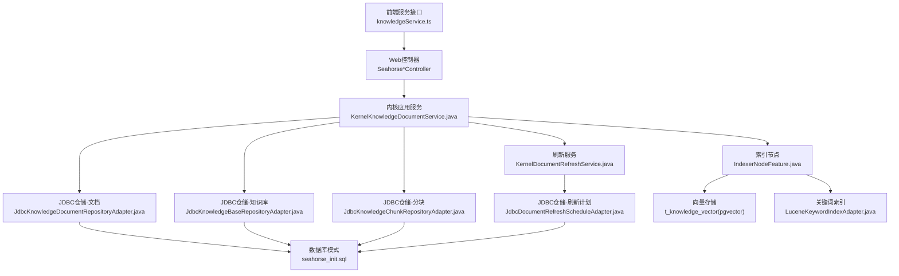
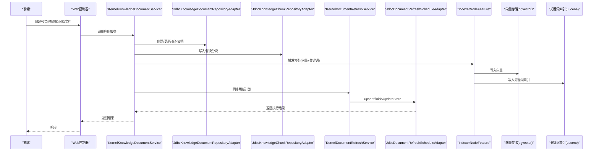
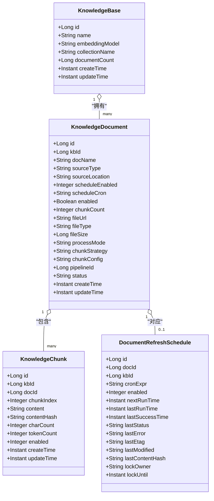
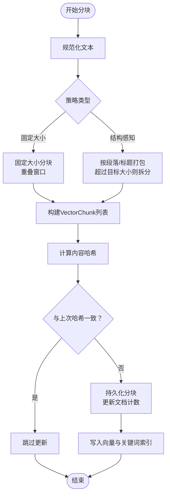
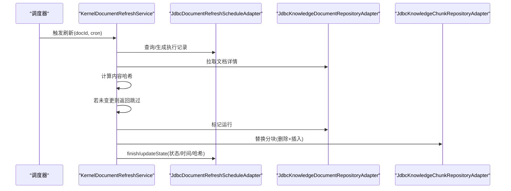
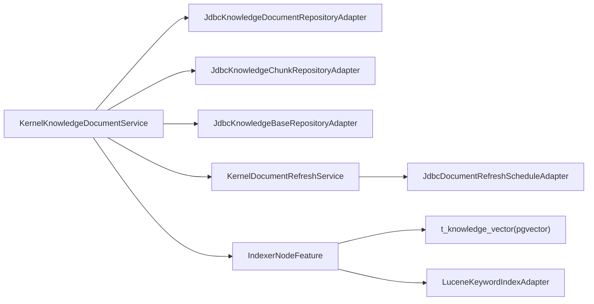

# 知识库领域模型

<cite>
**本文引用的文件**
- [seahorse_init.sql](file://resources/database/seahorse_init.sql)
- [JdbcKnowledgeBaseRepositoryAdapter.java](file://seahorse-agent-adapter-repository-jdbc/src/main/java/com/miracle/ai/seahorse/agent/adapters/repository/jdbc/JdbcKnowledgeBaseRepositoryAdapter.java)
- [JdbcKnowledgeDocumentRepositoryAdapter.java](file://seahorse-agent-adapter-repository-jdbc/src/main/java/com/miracle/ai/seahorse/agent/adapters/repository/jdbc/JdbcKnowledgeDocumentRepositoryAdapter.java)
- [JdbcKnowledgeChunkRepositoryAdapter.java](file://seahorse-agent-adapter-repository-jdbc/src/main/java/com/miracle/ai/seahorse/agent/adapters/repository/jdbc/JdbcKnowledgeChunkRepositoryAdapter.java)
- [JdbcDocumentRefreshScheduleAdapter.java](file://seahorse-agent-adapter-repository-jdbc/src/main/java/com/miracle/ai/seahorse/agent/adapters/repository/jdbc/JdbcDocumentRefreshScheduleAdapter.java)
- [KernelKnowledgeDocumentService.java](file://seahorse-agent-kernel/src/main/java/com/miracle/ai/seahorse/agent/kernel/application/knowledge/KernelKnowledgeDocumentService.java)
- [KernelDocumentRefreshService.java](file://seahorse-agent-kernel/src/main/java/com/miracle/ai/seahorse/agent/kernel/application/knowledge/KernelDocumentRefreshService.java)
- [ChunkerNodeFeature.java](file://seahorse-agent-kernel/src/main/java/com/miracle/ai/seahorse/agent/kernel/feature/ingestion/ChunkerNodeFeature.java)
- [IndexerNodeFeature.java](file://seahorse-agent-kernel/src/main/java/com/miracle/ai/seahorse/agent/kernel/feature/ingestion/IndexerNodeFeature.java)
- [LuceneKeywordIndexAdapter.java](file://seahorse-agent-adapter-search-lucene/src/main/java/com/miracle/ai/seahorse/agent/adapters/search/lucene/LuceneKeywordIndexAdapter.java)
- [knowledgeService.ts](file://frontend/src/services/knowledgeService.ts)
- [KnowledgeDocumentsPage.tsx](file://frontend/src/pages/admin/knowledge/KnowledgeDocumentsPage.tsx)
</cite>

## 目录
1. [简介](#简介)
2. [项目结构](#项目结构)
3. [核心组件](#核心组件)
4. [架构总览](#架构总览)
5. [详细组件分析](#详细组件分析)
6. [依赖分析](#依赖分析)
7. [性能考虑](#性能考虑)
8. [故障排查指南](#故障排查指南)
9. [结论](#结论)
10. [附录](#附录)

## 简介
本文件系统化梳理知识库(KNOWLEDGE)领域的核心模型与实现，覆盖以下关键主题：
- 实体模型：KnowledgeBase、KnowledgeDocument、KnowledgeChunk、DocumentRefreshSchedule
- 业务规则：知识库管理、文档版本控制、分块策略、刷新机制、质量评估
- 技术集成：向量存储(pgvector)、关键词索引(Lucene)、元数据管理
- 生命周期流程：从创建到维护的全链路时序与实体关系
- 性能优化与运维：分页、索引、缓存、并发与可观测性

## 项目结构
知识库领域模型由“前端服务接口”、“内核应用层”、“JDBC仓储层”、“向量与关键词索引适配器”以及“数据库模式”共同构成。

图表来源
- [knowledgeService.ts:1-55](file://frontend/src/services/knowledgeService.ts#L1-L55)
- [KernelKnowledgeDocumentService.java:278-308](file://seahorse-agent-kernel/src/main/java/com/miracle/ai/seahorse/agent/kernel/application/knowledge/KernelKnowledgeDocumentService.java#L278-L308)
- [JdbcKnowledgeBaseRepositoryAdapter.java:40-262](file://seahorse-agent-adapter-repository-jdbc/src/main/java/com/miracle/ai/seahorse/agent/adapters/repository/jdbc/JdbcKnowledgeBaseRepositoryAdapter.java#L40-L262)
- [JdbcKnowledgeDocumentRepositoryAdapter.java:52-561](file://seahorse-agent-adapter-repository-jdbc/src/main/java/com/miracle/ai/seahorse/agent/adapters/repository/jdbc/JdbcKnowledgeDocumentRepositoryAdapter.java#L52-L561)
- [JdbcKnowledgeChunkRepositoryAdapter.java:49-422](file://seahorse-agent-adapter-repository-jdbc/src/main/java/com/miracle/ai/seahorse/agent/adapters/repository/jdbc/JdbcKnowledgeChunkRepositoryAdapter.java#L49-L422)
- [JdbcDocumentRefreshScheduleAdapter.java:199-233](file://seahorse-agent-adapter-repository-jdbc/src/main/java/com/miracle/ai/seahorse/agent/adapters/repository/jdbc/JdbcDocumentRefreshScheduleAdapter.java#L199-L233)
- [IndexerNodeFeature.java:52-74](file://seahorse-agent-kernel/src/main/java/com/miracle/ai/seahorse/agent/kernel/feature/ingestion/IndexerNodeFeature.java#L52-L74)
- [LuceneKeywordIndexAdapter.java:58-84](file://seahorse-agent-adapter-search-lucene/src/main/java/com/miracle/ai/seahorse/agent/adapters/search/lucene/LuceneKeywordIndexAdapter.java#L58-L84)
- [seahorse_init.sql:116-237](file://resources/database/seahorse_init.sql#L116-L237)

章节来源
- [seahorse_init.sql:116-237](file://resources/database/seahorse_init.sql#L116-L237)
- [JdbcKnowledgeBaseRepositoryAdapter.java:40-262](file://seahorse-agent-adapter-repository-jdbc/src/main/java/com/miracle/ai/seahorse/agent/adapters/repository/jdbc/JdbcKnowledgeBaseRepositoryAdapter.java#L40-L262)
- [JdbcKnowledgeDocumentRepositoryAdapter.java:52-561](file://seahorse-agent-adapter-repository-jdbc/src/main/java/com/miracle/ai/seahorse/agent/adapters/repository/jdbc/JdbcKnowledgeDocumentRepositoryAdapter.java#L52-L561)
- [JdbcKnowledgeChunkRepositoryAdapter.java:49-422](file://seahorse-agent-adapter-repository-jdbc/src/main/java/com/miracle/ai/seahorse/agent/adapters/repository/jdbc/JdbcKnowledgeChunkRepositoryAdapter.java#L49-L422)
- [JdbcDocumentRefreshScheduleAdapter.java:199-233](file://seahorse-agent-adapter-repository-jdbc/src/main/java/com/miracle/ai/seahorse/agent/adapters/repository/jdbc/JdbcDocumentRefreshScheduleAdapter.java#L199-L233)
- [KernelKnowledgeDocumentService.java:278-308](file://seahorse-agent-kernel/src/main/java/com/miracle/ai/seahorse/agent/kernel/application/knowledge/KernelKnowledgeDocumentService.java#L278-L308)
- [IndexerNodeFeature.java:52-74](file://seahorse-agent-kernel/src/main/java/com/miracle/ai/seahorse/agent/kernel/feature/ingestion/IndexerNodeFeature.java#L52-L74)
- [LuceneKeywordIndexAdapter.java:58-84](file://seahorse-agent-adapter-search-lucene/src/main/java/com/miracle/ai/seahorse/agent/adapters/search/lucene/LuceneKeywordIndexAdapter.java#L58-L84)

## 核心组件
- KnowledgeBase（知识库）
  - 职责：标识嵌入模型与向量集合名；统计文档数量；分页查询与校验名称唯一性；软删除。
  - 关键字段：id、name、embedding_model、collection_name、document_count等。
- KnowledgeDocument（知识文档）
  - 职责：记录文档来源、处理模式、分块策略与配置、刷新计划、状态与计数；支持分页、日志查询、启用/禁用、替换文件用于刷新、软删除。
  - 关键字段：kb_id、doc_name、file_url、file_type、file_size、process_mode、status、schedule_enabled、schedule_cron、chunk_strategy、chunk_config、pipeline_id、chunk_count等。
- KnowledgeChunk（知识分块）
  - 职责：持久化分块内容、哈希、字符/令牌计数、启用状态；支持按文档分页、批量查询、启用状态切换、删除并同步文档计数。
  - 关键字段：kb_id、doc_id、chunk_index、content、content_hash、char_count、token_count、enabled等。
- DocumentRefreshSchedule（文档刷新计划）
  - 职责：维护文档刷新的Cron表达式、下次运行时间、锁持有者与时间、最近内容哈希/ETag/Last-Modified及状态；支持启动执行、完成记录与状态更新。
  - 关键字段：doc_id、kb_id、cron_expr、enabled、next_run_time、last_run_time、last_success_time、last_status、last_error、last_etag、last_modified、last_content_hash、lock_owner、lock_until等。

章节来源
- [JdbcKnowledgeBaseRepositoryAdapter.java:40-262](file://seahorse-agent-adapter-repository-jdbc/src/main/java/com/miracle/ai/seahorse/agent/adapters/repository/jdbc/JdbcKnowledgeBaseRepositoryAdapter.java#L40-L262)
- [JdbcKnowledgeDocumentRepositoryAdapter.java:52-561](file://seahorse-agent-adapter-repository-jdbc/src/main/java/com/miracle/ai/seahorse/agent/adapters/repository/jdbc/JdbcKnowledgeDocumentRepositoryAdapter.java#L52-L561)
- [JdbcKnowledgeChunkRepositoryAdapter.java:49-422](file://seahorse-agent-adapter-repository-jdbc/src/main/java/com/miracle/ai/seahorse/agent/adapters/repository/jdbc/JdbcKnowledgeChunkRepositoryAdapter.java#L49-L422)
- [JdbcDocumentRefreshScheduleAdapter.java:199-233](file://seahorse-agent-adapter-repository-jdbc/src/main/java/com/miracle/ai/seahorse/agent/adapters/repository/jdbc/JdbcDocumentRefreshScheduleAdapter.java#L199-L233)

## 架构总览
知识库领域采用“仓储适配器+应用服务+内核特性”的分层设计：
- 前端通过服务接口调用Web控制器，进入内核应用服务；
- 应用服务协调仓储与刷新服务，驱动索引节点将分块写入向量与关键词索引；
- 刷新服务基于Cron调度，检测内容变更并触发增量更新；
- 数据库存储所有结构化信息，并通过索引提升检索性能。

图表来源
- [KernelKnowledgeDocumentService.java:278-308](file://seahorse-agent-kernel/src/main/java/com/miracle/ai/seahorse/agent/kernel/application/knowledge/KernelKnowledgeDocumentService.java#L278-L308)
- [JdbcKnowledgeDocumentRepositoryAdapter.java:52-561](file://seahorse-agent-adapter-repository-jdbc/src/main/java/com/miracle/ai/seahorse/agent/adapters/repository/jdbc/JdbcKnowledgeDocumentRepositoryAdapter.java#L52-L561)
- [JdbcKnowledgeChunkRepositoryAdapter.java:49-422](file://seahorse-agent-adapter-repository-jdbc/src/main/java/com/miracle/ai/seahorse/agent/adapters/repository/jdbc/JdbcKnowledgeChunkRepositoryAdapter.java#L49-L422)
- [KernelDocumentRefreshService.java:114-198](file://seahorse-agent-kernel/src/main/java/com/miracle/ai/seahorse/agent/kernel/application/knowledge/KernelDocumentRefreshService.java#L114-L198)
- [JdbcDocumentRefreshScheduleAdapter.java:199-233](file://seahorse-agent-adapter-repository-jdbc/src/main/java/com/miracle/ai/seahorse/agent/adapters/repository/jdbc/JdbcDocumentRefreshScheduleAdapter.java#L199-L233)
- [IndexerNodeFeature.java:52-74](file://seahorse-agent-kernel/src/main/java/com/miracle/ai/seahorse/agent/kernel/feature/ingestion/IndexerNodeFeature.java#L52-L74)
- [LuceneKeywordIndexAdapter.java:58-84](file://seahorse-agent-adapter-search-lucene/src/main/java/com/miracle/ai/seahorse/agent/adapters/search/lucene/LuceneKeywordIndexAdapter.java#L58-L84)

## 详细组件分析

### 实体类图

图表来源
- [seahorse_init.sql:116-237](file://resources/database/seahorse_init.sql#L116-L237)
- [JdbcKnowledgeBaseRepositoryAdapter.java:40-262](file://seahorse-agent-adapter-repository-jdbc/src/main/java/com/miracle/ai/seahorse/agent/adapters/repository/jdbc/JdbcKnowledgeBaseRepositoryAdapter.java#L40-L262)
- [JdbcKnowledgeDocumentRepositoryAdapter.java:52-561](file://seahorse-agent-adapter-repository-jdbc/src/main/java/com/miracle/ai/seahorse/agent/adapters/repository/jdbc/JdbcKnowledgeDocumentRepositoryAdapter.java#L52-L561)
- [JdbcKnowledgeChunkRepositoryAdapter.java:49-422](file://seahorse-agent-adapter-repository-jdbc/src/main/java/com/miracle/ai/seahorse/agent/adapters/repository/jdbc/JdbcKnowledgeChunkRepositoryAdapter.java#L49-L422)
- [JdbcDocumentRefreshScheduleAdapter.java:199-233](file://seahorse-agent-adapter-repository-jdbc/src/main/java/com/miracle/ai/seahorse/agent/adapters/repository/jdbc/JdbcDocumentRefreshScheduleAdapter.java#L199-L233)

章节来源
- [seahorse_init.sql:116-237](file://resources/database/seahorse_init.sql#L116-L237)

### 分块策略与内容去重
- 分块策略
  - 固定大小分块与结构感知分块两种策略，支持重叠窗口与目标字符数控制。
  - 元数据过滤仅保留系统元数据键集，避免冗余索引。
- 内容去重
  - 以内容哈希对比判断是否需要更新；刷新服务在内容未变时跳过处理。
- 向量与关键词索引
  - 索引节点同时写入向量存储与关键词索引，关键词索引支持文档级重建，避免重复召回。

图表来源
- [ChunkerNodeFeature.java:91-198](file://seahorse-agent-kernel/src/main/java/com/miracle/ai/seahorse/agent/kernel/feature/ingestion/ChunkerNodeFeature.java#L91-L198)
- [JdbcKnowledgeChunkRepositoryAdapter.java:142-155](file://seahorse-agent-adapter-repository-jdbc/src/main/java/com/miracle/ai/seahorse/agent/adapters/repository/jdbc/JdbcKnowledgeChunkRepositoryAdapter.java#L142-L155)
- [KernelDocumentRefreshService.java:185-197](file://seahorse-agent-kernel/src/main/java/com/miracle/ai/seahorse/agent/kernel/application/knowledge/KernelDocumentRefreshService.java#L185-L197)
- [IndexerNodeFeature.java:52-74](file://seahorse-agent-kernel/src/main/java/com/miracle/ai/seahorse/agent/kernel/feature/ingestion/IndexerNodeFeature.java#L52-L74)
- [LuceneKeywordIndexAdapter.java:58-84](file://seahorse-agent-adapter-search-lucene/src/main/java/com/miracle/ai/seahorse/agent/adapters/search/lucene/LuceneKeywordIndexAdapter.java#L58-L84)

章节来源
- [ChunkerNodeFeature.java:227-259](file://seahorse-agent-kernel/src/main/java/com/miracle/ai/seahorse/agent/kernel/feature/ingestion/ChunkerNodeFeature.java#L227-L259)
- [KernelDocumentRefreshService.java:170-198](file://seahorse-agent-kernel/src/main/java/com/miracle/ai/seahorse/agent/kernel/application/knowledge/KernelDocumentRefreshService.java#L170-L198)

### 刷新机制与增量更新
- 刷新计划
  - 支持启用/禁用、Cron表达式、下次运行时间、锁机制与最近状态记录。
- 执行流程
  - 检查文档状态为非运行；拉取新内容；计算内容哈希；若未变更则跳过；否则标记运行、处理、写入分块、更新向量与关键词索引、更新计划状态与下次运行时间。
- 前端交互
  - 管理页面支持选择分块策略、配置参数（如块大小、重叠大小）与“不分块”模式。

图表来源
- [KernelDocumentRefreshService.java:114-198](file://seahorse-agent-kernel/src/main/java/com/miracle/ai/seahorse/agent/kernel/application/knowledge/KernelDocumentRefreshService.java#L114-L198)
- [JdbcDocumentRefreshScheduleAdapter.java:199-233](file://seahorse-agent-adapter-repository-jdbc/src/main/java/com/miracle/ai/seahorse/agent/adapters/repository/jdbc/JdbcDocumentRefreshScheduleAdapter.java#L199-L233)
- [JdbcKnowledgeDocumentRepositoryAdapter.java:296-311](file://seahorse-agent-adapter-repository-jdbc/src/main/java/com/miracle/ai/seahorse/agent/adapters/repository/jdbc/JdbcKnowledgeDocumentRepositoryAdapter.java#L296-L311)
- [JdbcKnowledgeChunkRepositoryAdapter.java:142-155](file://seahorse-agent-adapter-repository-jdbc/src/main/java/com/miracle/ai/seahorse/agent/adapters/repository/jdbc/JdbcKnowledgeChunkRepositoryAdapter.java#L142-L155)

章节来源
- [KernelKnowledgeDocumentService.java:282-301](file://seahorse-agent-kernel/src/main/java/com/miracle/ai/seahorse/agent/kernel/application/knowledge/KernelKnowledgeDocumentService.java#L282-L301)
- [KnowledgeDocumentsPage.tsx:1276-1631](file://frontend/src/pages/admin/knowledge/KnowledgeDocumentsPage.tsx#L1276-L1631)

### 知识库查询、统计与质量监控
- 查询与分页
  - 知识库：按名称模糊查询、分页、统计文档数。
  - 文档：按状态/关键字分页、查看分块处理日志。
  - 分块：按启用状态分页、批量查询与启用状态切换。
- 质量监控
  - 日志表记录抽取、分块、嵌入、持久化各阶段耗时与错误信息；支持按文档聚合统计。
- 前端示例
  - 管理页面提供分块策略配置与参数调整入口，便于质量控制与A/B对比。

章节来源
- [JdbcKnowledgeBaseRepositoryAdapter.java:134-162](file://seahorse-agent-adapter-repository-jdbc/src/main/java/com/miracle/ai/seahorse/agent/adapters/repository/jdbc/JdbcKnowledgeBaseRepositoryAdapter.java#L134-L162)
- [JdbcKnowledgeDocumentRepositoryAdapter.java:217-249](file://seahorse-agent-adapter-repository-jdbc/src/main/java/com/miracle/ai/seahorse/agent/adapters/repository/jdbc/JdbcKnowledgeDocumentRepositoryAdapter.java#L217-L249)
- [JdbcKnowledgeChunkRepositoryAdapter.java:167-177](file://seahorse-agent-adapter-repository-jdbc/src/main/java/com/miracle/ai/seahorse/agent/adapters/repository/jdbc/JdbcKnowledgeChunkRepositoryAdapter.java#L167-L177)

## 依赖分析
- 组件耦合
  - 应用服务依赖仓储与刷新服务，仓储之间通过文档/分块主键关联；刷新计划与文档一一对应。
- 外部依赖
  - 向量存储使用pgvector扩展；关键词索引使用Lucene；数据库采用PostgreSQL。
- 潜在循环
  - 无直接循环依赖；刷新服务通过仓储间接访问数据库，符合分层原则。

图表来源
- [KernelKnowledgeDocumentService.java:278-308](file://seahorse-agent-kernel/src/main/java/com/miracle/ai/seahorse/agent/kernel/application/knowledge/KernelKnowledgeDocumentService.java#L278-L308)
- [JdbcKnowledgeDocumentRepositoryAdapter.java:52-561](file://seahorse-agent-adapter-repository-jdbc/src/main/java/com/miracle/ai/seahorse/agent/adapters/repository/jdbc/JdbcKnowledgeDocumentRepositoryAdapter.java#L52-L561)
- [JdbcKnowledgeChunkRepositoryAdapter.java:49-422](file://seahorse-agent-adapter-repository-jdbc/src/main/java/com/miracle/ai/seahorse/agent/adapters/repository/jdbc/JdbcKnowledgeChunkRepositoryAdapter.java#L49-L422)
- [JdbcKnowledgeBaseRepositoryAdapter.java:40-262](file://seahorse-agent-adapter-repository-jdbc/src/main/java/com/miracle/ai/seahorse/agent/adapters/repository/jdbc/JdbcKnowledgeBaseRepositoryAdapter.java#L40-L262)
- [KernelDocumentRefreshService.java:114-198](file://seahorse-agent-kernel/src/main/java/com/miracle/ai/seahorse/agent/kernel/application/knowledge/KernelDocumentRefreshService.java#L114-L198)
- [JdbcDocumentRefreshScheduleAdapter.java:199-233](file://seahorse-agent-adapter-repository-jdbc/src/main/java/com/miracle/ai/seahorse/agent/adapters/repository/jdbc/JdbcDocumentRefreshScheduleAdapter.java#L199-L233)
- [IndexerNodeFeature.java:52-74](file://seahorse-agent-kernel/src/main/java/com/miracle/ai/seahorse/agent/kernel/feature/ingestion/IndexerNodeFeature.java#L52-L74)
- [LuceneKeywordIndexAdapter.java:58-84](file://seahorse-agent-adapter-search-lucene/src/main/java/com/miracle/ai/seahorse/agent/adapters/search/lucene/LuceneKeywordIndexAdapter.java#L58-L84)

## 性能考虑
- 数据库层面
  - 索引：知识库名称、文档kb_id、分块doc_id、刷新计划next_run与lock_until等。
  - 分页：统一限制每页最大条数，避免超大偏移。
- 向量与关键词索引
  - 向量索引使用HNSW+余弦距离；关键词索引支持文档级重建，减少重复召回。
- 并发与锁
  - 刷新计划表提供lock_owner/lock_until字段，避免并发重复执行。
- 前端体验
  - 分块策略参数实时生效，便于快速验证效果。

章节来源
- [seahorse_init.sql:128-217](file://resources/database/seahorse_init.sql#L128-L217)
- [JdbcKnowledgeChunkRepositoryAdapter.java:375-383](file://seahorse-agent-adapter-repository-jdbc/src/main/java/com/miracle/ai/seahorse/agent/adapters/repository/jdbc/JdbcKnowledgeChunkRepositoryAdapter.java#L375-L383)
- [KernelDocumentRefreshService.java:132-141](file://seahorse-agent-kernel/src/main/java/com/miracle/ai/seahorse/agent/kernel/application/knowledge/KernelDocumentRefreshService.java#L132-L141)

## 故障排查指南
- 常见问题
  - 文档状态异常：检查状态机是否处于running，刷新会被跳过。
  - 内容未更新：确认内容哈希是否一致；检查last_content_hash是否正确回写。
  - 分块未生效：确认enabled状态与文档计数是否同步更新。
  - 刷新未触发：检查Cron表达式、next_run_time与锁状态。
- 定位手段
  - 查看分块处理日志表，定位各阶段耗时与错误。
  - 关注刷新执行记录表的状态与消息字段。
- 建议
  - 对高频失败场景增加重试与告警；对大文档分块策略进行A/B对比。

章节来源
- [JdbcKnowledgeDocumentRepositoryAdapter.java:100-128](file://seahorse-agent-adapter-repository-jdbc/src/main/java/com/miracle/ai/seahorse/agent/adapters/repository/jdbc/JdbcKnowledgeDocumentRepositoryAdapter.java#L100-L128)
- [JdbcDocumentRefreshScheduleAdapter.java:199-233](file://seahorse-agent-adapter-repository-jdbc/src/main/java/com/miracle/ai/seahorse/agent/adapters/repository/jdbc/JdbcDocumentRefreshScheduleAdapter.java#L199-L233)
- [KernelDocumentRefreshService.java:114-198](file://seahorse-agent-kernel/src/main/java/com/miracle/ai/seahorse/agent/kernel/application/knowledge/KernelDocumentRefreshService.java#L114-L198)

## 结论
本知识库领域模型以清晰的实体边界与分层架构支撑大规模文档管理与检索增强应用。通过标准化的分块策略、内容去重与刷新机制，结合向量与关键词索引，实现了高效、可维护且可扩展的知识库生命周期管理。建议在生产环境中配合完善的监控与告警体系，持续优化分块策略与索引参数，确保检索质量与性能双优。

## 附录
- 前端服务接口类型定义参考
  - [knowledgeService.ts:1-55](file://frontend/src/services/knowledgeService.ts#L1-L55)
- 前端管理页面交互参考
  - [KnowledgeDocumentsPage.tsx:1276-1631](file://frontend/src/pages/admin/knowledge/KnowledgeDocumentsPage.tsx#L1276-L1631)