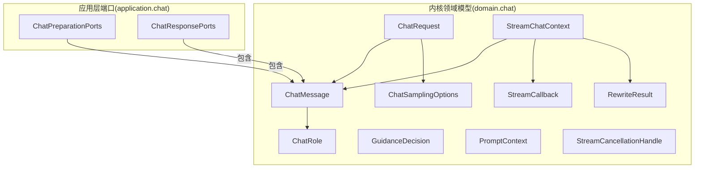
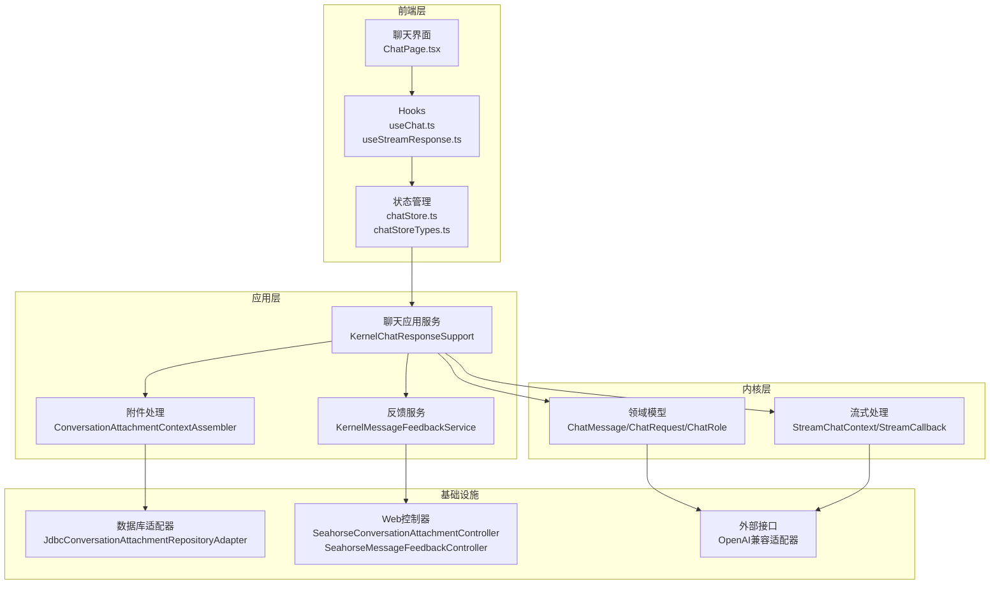
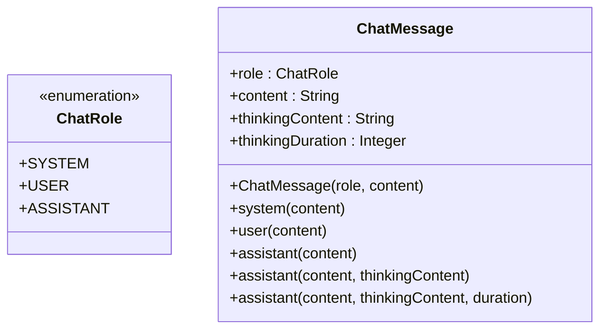
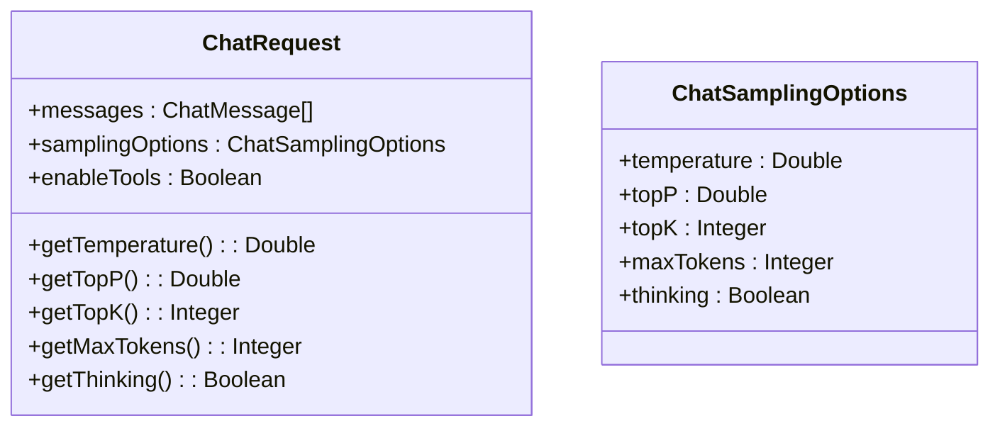
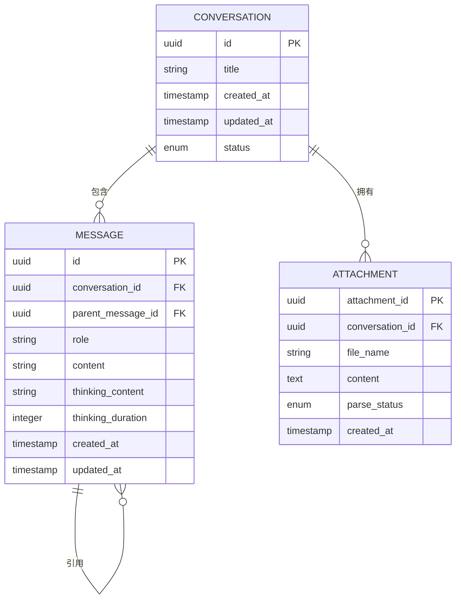
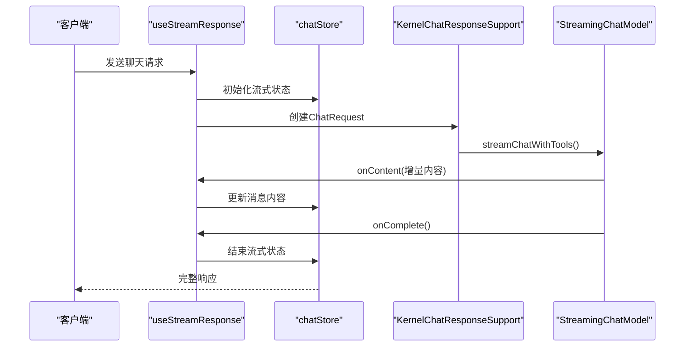
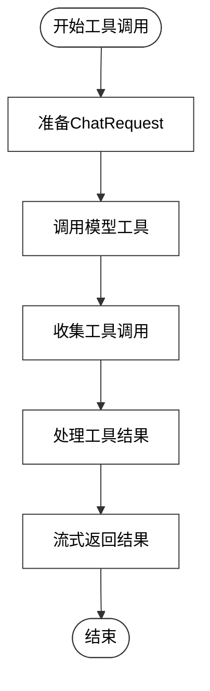
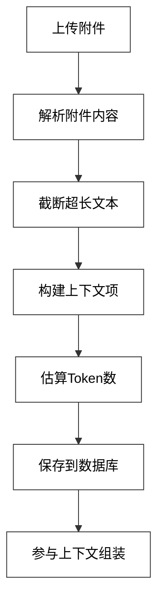
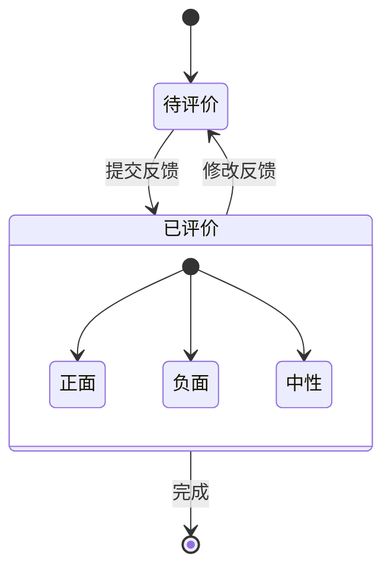
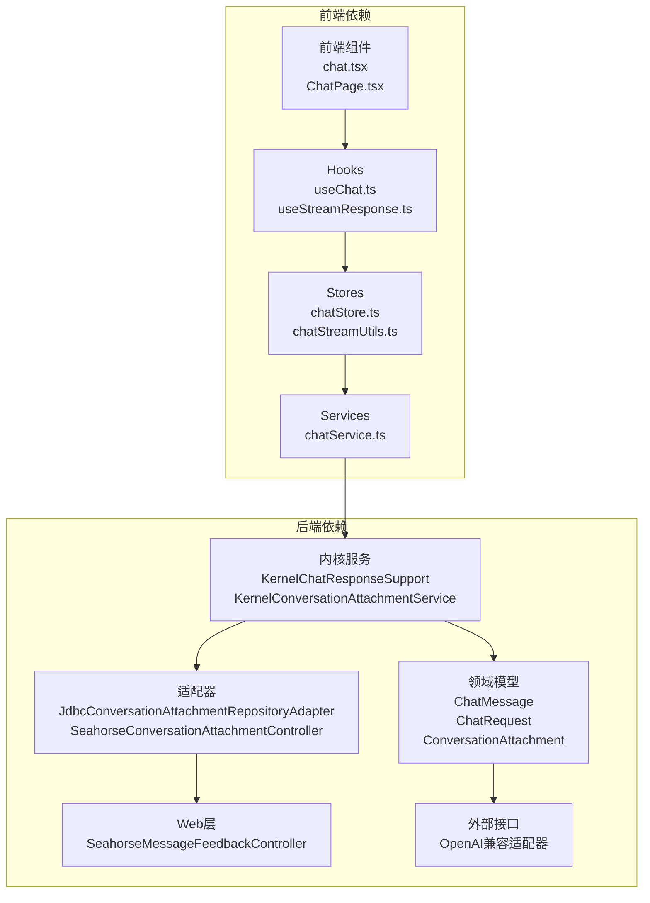

# 聊天领域模型

<cite>
**本文引用的文件**
- [领域模型.md](file://docs/zh/content/后端系统/核心内核/领域模型/领域模型.md)
- [聊天领域模型.md](file://docs/zh/content/后端系统/核心内核/领域模型/聊天领域模型.md)
- [ChatMessage.java](file://seahorse-agent-kernel/src/main/java/com/miracle/ai/seahorse/agent/kernel/domain/chat/ChatMessage.java)
- [ChatRequest.java](file://seahorse-agent-kernel/src/main/java/com/miracle/ai/seahorse/agent/kernel/domain/chat/ChatRequest.java)
- [ChatRole.java](file://seahorse-agent-kernel/src/main/java/com/miracle/ai/seahorse/agent/kernel/domain/chat/ChatRole.java)
- [ChatSamplingOptions.java](file://seahorse-agent-kernel/src/main/java/com/miracle/ai/seahorse/agent/kernel/domain/chat/ChatSamplingOptions.java)
- [KernelChatResponseSupport.java](file://seahorse-agent-kernel/src/main/java/com/miracle/ai/seahorse/agent/kernel/application/chat/KernelChatResponseSupport.java)
- [ConversationAttachmentContextAssembler.java](file://seahorse-agent-kernel/src/main/java/com/miracle/ai/seahorse/agent/kernel/application/chat/ConversationAttachmentContextAssembler.java)
- [KernelConversationAttachmentService.java](file://seahorse-agent-kernel/src/main/java/com/miracle/ai/seahorse/agent/kernel/application/conversation/KernelConversationAttachmentService.java)
- [ConversationAttachment.java](file://seahorse-agent-kernel/src/main/java/com/miracle/ai/seahorse/agent/kernel/domain/conversation/ConversationAttachment.java)
- [JdbcConversationAttachmentRepositoryAdapter.java](file://seahorse-agent-adapter-repository-jdbc/src/main/java/com/miracle/ai/seahorse/agent/adapters/repository/jdbc/JdbcConversationAttachmentRepositoryAdapter.java)
- [SeahorseConversationAttachmentController.java](file://seahorse-agent-adapter-web/src/main/java/com/miracle/ai/seahorse/agent/adapters/web/SeahorseConversationAttachmentController.java)
- [KernelMessageFeedbackService.java](file://seahorse-agent-kernel/src/main/java/com/miracle/ai/seahorse/agent/kernel/application/feedback/KernelMessageFeedbackService.java)
- [SeahorseMessageFeedbackController.java](file://seahorse-agent-adapter-web/src/main/java/com/miracle/ai/seahorse/agent/adapters/web/SeahorseMessageFeedbackController.java)
- [MessageFeedbackRequest.java](file://seahorse-agent-adapter-web/src/main/java/com/miracle/ai/seahorse/agent/adapters/web/MessageFeedbackRequest.java)
- [FeedbackEvaluationCandidate.java](file://seahorse-agent-adapter-web/src/main/java/com/miracle/ai/seahorse/agent/ports/outbound/feedback/FeedbackEvaluationCandidate.java)
- [useChat.ts](file://frontend/src/hooks/useChat.ts)
- [useStreamResponse.ts](file://frontend/src/hooks/useStreamResponse.ts)
- [chatStore.ts](file://frontend/src/stores/chatStore.ts)
- [chatStoreTypes.ts](file://frontend/src/stores/chatStoreTypes.ts)
- [chatStreamUtils.ts](file://frontend/src/stores/chatStreamUtils.ts)
- [chatService.ts](file://frontend/src/services/chatService.ts)
- [chat.tsx](file://frontend/src/components/chat/chat.tsx)
- [ChatPage.tsx](file://frontend/src/pages/ChatPage.tsx)
- [KernelAgentRunResumeServiceTests.java](file://seahorse-agent-kernel/src/test/java/com/miracle/ai/seahorse/agent/kernel/application/agent/runtime/KernelAgentRunResumeServiceTests.java)
</cite>

## 目录
1. [引言](#引言)
2. [项目结构](#项目结构)
3. [核心组件](#核心组件)
4. [架构总览](#架构总览)
5. [详细组件分析](#详细组件分析)
6. [依赖分析](#依赖分析)
7. [性能考虑](#性能考虑)
8. [故障排查指南](#故障排查指南)
9. [结论](#结论)
10. [附录：使用示例路径](#附录使用示例路径)

## 引言
本文件系统性梳理聊天领域的核心领域模型与应用级端口集合，覆盖消息模型、请求模型、角色枚举、采样选项、引导决策、提示上下文、重写结果、流式回调与取消句柄、以及流式聊天上下文等关键类型。文档从属性定义、业务含义、使用场景与相互关系出发，辅以可视化图示与示例路径，帮助读者快速理解并正确使用这些模型。

## 项目结构
聊天领域模型位于内核模块的 domain.chat 包中，同时在 application.chat 中提供问答流程的前置与响应阶段端口集合，用于装配与编排具体能力（如检索、改写、意图解析、流式模型调用等）。

**图表来源**
- [聊天领域模型.md:37-63](file://docs/zh/content/后端系统/核心内核/领域模型/聊天领域模型.md#L37-L63)

**章节来源**
- [聊天领域模型.md:34-63](file://docs/zh/content/后端系统/核心内核/领域模型/聊天领域模型.md#L34-L63)

## 核心组件
本节对各领域模型进行逐项说明，包含属性语义、典型用法与约束。

- 聊天模型
  - ChatRole：角色枚举，限定消息来源（系统、用户、助手）。
  - ChatMessage：单轮对话消息，支持普通内容与"思考"内容及耗时；提供便捷构造器以快速构建系统/用户/助手消息。
  - ChatRequest：一次推理请求的聚合载体，包含消息列表、采样参数与工具开关；通过采样选项暴露温度、topP、topK、最大token、是否启用思考等能力。

- 文档处理模型
  - PipelineDefinition：流水线定义，包含节点集合，描述处理流程拓扑。
  - NodeConfig：节点配置，包含节点ID、类型、设置、条件与下一跳节点，支撑可编排的处理链路。
  - IngestionContext：流水线执行上下文，承载源数据、原始字节、MIME、解析后文本、向量化分片、关键词、问题、元数据、向量空间标识、状态、日志、错误以及写入策略等。

- 内存管理模型
  - MemoryLayer：记忆分层枚举（工作、短期、长期、语义），用于区分不同记忆来源与用途。
  - MemoryItem：记忆条目，包含唯一标识、用户/会话、层、类型、内容、元数据、来源ID集合、重要性/置信度/相关性评分与创建时间等。
  - MemoryContext：加载后的多层记忆上下文，聚合当前问题、工作记忆、短期/长期/语义记忆以及提示消息，作为下游推理的上下文输入。

- 检索模型
  - SearchContext：检索共享上下文，包含原始问题、改写问题、子问题、意图、topK 与元数据；提供主问题选择逻辑。
  - RetrievedChunk：检索命中的最小单元，包含唯一ID、文本与得分。
  - RetrievalContext：KB 与 MCP 检索上下文的统一承载，支持两类来源标记与意图分组的命中集合，提供来源存在性判断与空值判定。

**章节来源**
- [领域模型.md:58-76](file://docs/zh/content/后端系统/核心内核/领域模型/领域模型.md#L58-L76)

## 架构总览
聊天系统采用分层架构，核心领域模型位于内核层，应用层负责编排与装配具体能力。前端通过服务层与后端交互，支持实时流式响应与历史回放。

**图表来源**
- [KernelChatResponseSupport.java:63-79](file://seahorse-agent-kernel/src/main/java/com/miracle/ai/seahorse/agent/kernel/application/chat/KernelChatResponseSupport.java#L63-L79)
- [ConversationAttachmentContextAssembler.java:148-176](file://seahorse-agent-kernel/src/main/java/com/miracle/ai/seahorse/agent/kernel/application/chat/ConversationAttachmentContextAssembler.java#L148-L176)
- [JdbcConversationAttachmentRepositoryAdapter.java](file://seahorse-agent-adapter-repository-jdbc/src/main/java/com/miracle/ai/seahorse/agent/adapters/repository/jdbc/JdbcConversationAttachmentRepositoryAdapter.java)

## 详细组件分析

### ChatMessage 组件分析
ChatMessage 是聊天系统的核心数据结构，代表单轮对话中的消息实体。

**图表来源**
- [ChatMessage.java](file://seahorse-agent-kernel/src/main/java/com/miracle/ai/seahorse/agent/kernel/domain/chat/ChatMessage.java)
- [ChatRole.java](file://seahorse-agent-kernel/src/main/java/com/miracle/ai/seahorse/agent/kernel/domain/chat/ChatRole.java)

**章节来源**
- [聊天领域模型.md:118-160](file://docs/zh/content/后端系统/核心内核/领域模型/聊天领域模型.md#L118-L160)

### ChatRequest 组件分析
ChatRequest 聚合了一次推理请求的所有必要信息，是聊天流程的输入载体。

**图表来源**
- [ChatRequest.java](file://seahorse-agent-kernel/src/main/java/com/miracle/ai/seahorse/agent/kernel/domain/chat/ChatRequest.java)
- [ChatSamplingOptions.java](file://seahorse-agent-kernel/src/main/java/com/miracle/ai/seahorse/agent/kernel/domain/chat/ChatSamplingOptions.java)

**章节来源**
- [聊天领域模型.md:118-160](file://docs/zh/content/后端系统/核心内核/领域模型/聊天领域模型.md#L118-L160)

### 会话与消息关系分析
聊天系统中的会话与消息存在明确的一对多关系，支持消息排序、引用关系和附件处理。

**图表来源**
- [ConversationAttachment.java](file://seahorse-agent-kernel/src/main/java/com/miracle/ai/seahorse/agent/kernel/domain/conversation/ConversationAttachment.java)
- [JdbcConversationAttachmentRepositoryAdapter.java](file://seahorse-agent-adapter-repository-jdbc/src/main/java/com/miracle/ai/seahorse/agent/adapters/repository/jdbc/JdbcConversationAttachmentRepositoryAdapter.java)

**章节来源**
- [ConversationAttachmentContextAssembler.java:148-176](file://seahorse-agent-kernel/src/main/java/com/miracle/ai/seahorse/agent/kernel/application/chat/ConversationAttachmentContextAssembler.java#L148-L176)

### 流式响应处理流程
系统支持实时流式响应，通过回调机制实现增量内容传输。

**图表来源**
- [KernelAgentRunResumeServiceTests.java:291-317](file://seahorse-agent-kernel/src/test/java/com/miracle/ai/seahorse/agent/kernel/application/agent/runtime/KernelAgentRunResumeServiceTests.java#L291-L317)
- [useStreamResponse.ts](file://frontend/src/hooks/useStreamResponse.ts)

**章节来源**
- [KernelChatResponseSupport.java:68-79](file://seahorse-agent-kernel/src/main/java/com/miracle/ai/seahorse/agent/kernel/application/chat/KernelChatResponseSupport.java#L68-L79)

### 工具调用集成流程
系统支持工具调用，通过工具收集器处理外部能力调用。

**图表来源**
- [KernelAgentRunResumeServiceTests.java:304-315](file://seahorse-agent-kernel/src/test/java/com/miracle/ai/seahorse/agent/kernel/application/agent/runtime/KernelAgentRunResumeServiceTests.java#L304-L315)

**章节来源**
- [KernelChatResponseSupport.java:68-79](file://seahorse-agent-kernel/src/main/java/com/miracle/ai/seahorse/agent/kernel/application/chat/KernelChatResponseSupport.java#L68-L79)

### 附件处理与上下文构建
系统支持会话附件上传与解析，自动构建上下文内容。

**图表来源**
- [ConversationAttachmentContextAssembler.java:148-176](file://seahorse-agent-kernel/src/main/java/com/miracle/ai/seahorse/agent/kernel/application/chat/ConversationAttachmentContextAssembler.java#L148-L176)
- [KernelConversationAttachmentService.java](file://seahorse-agent-kernel/src/main/java/com/miracle/ai/seahorse/agent/kernel/application/conversation/KernelConversationAttachmentService.java)

**章节来源**
- [ConversationAttachmentContextAssembler.java:148-176](file://seahorse-agent-kernel/src/main/java/com/miracle/ai/seahorse/agent/kernel/application/chat/ConversationAttachmentContextAssembler.java#L148-L176)

### 消息反馈与评价流程
系统提供消息反馈功能，支持投票、评论和原因标注。

**图表来源**
- [KernelMessageFeedbackService.java](file://seahorse-agent-kernel/src/main/java/com/miracle/ai/seahorse/agent/kernel/application/feedback/KernelMessageFeedbackService.java)
- [FeedbackEvaluationCandidate.java:22-32](file://seahorse-agent-adapter-web/src/main/java/com/miracle/ai/seahorse/agent/ports/outbound/feedback/FeedbackEvaluationCandidate.java#L22-L32)

**章节来源**
- [KernelMessageFeedbackService.java](file://seahorse-agent-kernel/src/main/java/com/miracle/ai/seahorse/agent/kernel/application/feedback/KernelMessageFeedbackService.java)
- [SeahorseMessageFeedbackController.java](file://seahorse-agent-adapter-web/src/main/java/com/miracle/ai/seahorse/agent/adapters/web/SeahorseMessageFeedbackController.java)
- [MessageFeedbackRequest.java](file://seahorse-agent-adapter-web/src/main/java/com/miracle/ai/seahorse/agent/adapters/web/MessageFeedbackRequest.java)

## 依赖分析
聊天系统各组件之间存在清晰的依赖关系，遵循分层架构原则。

**图表来源**
- [chat.tsx](file://frontend/src/components/chat/chat.tsx)
- [ChatPage.tsx](file://frontend/src/pages/ChatPage.tsx)
- [KernelChatResponseSupport.java](file://seahorse-agent-kernel/src/main/java/com/miracle/ai/seahorse/agent/kernel/application/chat/KernelChatResponseSupport.java)
- [JdbcConversationAttachmentRepositoryAdapter.java](file://seahorse-agent-adapter-repository-jdbc/src/main/java/com/miracle/ai/seahorse/agent/adapters/repository/jdbc/JdbcConversationAttachmentRepositoryAdapter.java)

**章节来源**
- [KernelChatResponseSupport.java:63-79](file://seahorse-agent-kernel/src/main/java/com/miracle/ai/seahorse/agent/kernel/application/chat/KernelChatResponseSupport.java#L63-L79)
- [KernelConversationAttachmentService.java](file://seahorse-agent-kernel/src/main/java/com/miracle/ai/seahorse/agent/kernel/application/conversation/KernelConversationAttachmentService.java)

## 性能考虑
- 流式处理优化：通过增量内容传输减少首屏延迟
- 上下文压缩：合理控制消息历史长度，避免上下文过长影响性能
- 附件处理：对大文件进行截断处理，限制单次上下文大小
- 缓存策略：利用本地缓存和Redis缓存提升重复查询性能

## 故障排查指南
- 流式响应异常：检查模型适配器配置和网络连接
- 附件上传失败：验证文件格式和大小限制
- 反馈提交错误：确认用户权限和数据完整性
- 性能问题：监控上下文长度和Token使用情况

**章节来源**
- [KernelChatResponseSupport.java:68-79](file://seahorse-agent-kernel/src/main/java/com/miracle/ai/seahorse/agent/kernel/application/chat/KernelChatResponseSupport.java#L68-L79)
- [KernelMessageFeedbackService.java](file://seahorse-agent-kernel/src/main/java/com/miracle/ai/seahorse/agent/kernel/application/feedback/KernelMessageFeedbackService.java)

## 结论
聊天领域模型通过清晰的分层架构和标准化的数据结构，为多轮对话、流式响应、工具调用和附件处理提供了完整的解决方案。系统支持实时交互、历史回放和消息反馈等实际应用场景，具备良好的扩展性和稳定性。

## 附录：使用示例路径
- 基础聊天请求：[useChat.ts](file://frontend/src/hooks/useChat.ts)
- 流式响应处理：[useStreamResponse.ts](file://frontend/src/hooks/useStreamResponse.ts)
- 状态管理：[chatStore.ts](file://frontend/src/stores/chatStore.ts)
- 类型定义：[chatStoreTypes.ts](file://frontend/src/stores/chatStoreTypes.ts)
- 流式工具：[chatStreamUtils.ts](file://frontend/src/stores/chatStreamUtils.ts)
- 服务调用：[chatService.ts](file://frontend/src/services/chatService.ts)
- 组件实现：[chat.tsx](file://frontend/src/components/chat/chat.tsx)
- 页面入口：[ChatPage.tsx](file://frontend/src/pages/ChatPage.tsx)
- 测试示例：[KernelAgentRunResumeServiceTests.java:291-317](file://seahorse-agent-kernel/src/test/java/com/miracle/ai/seahorse/agent/kernel/application/agent/runtime/KernelAgentRunResumeServiceTests.java#L291-L317)