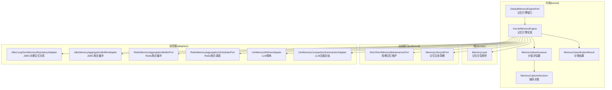
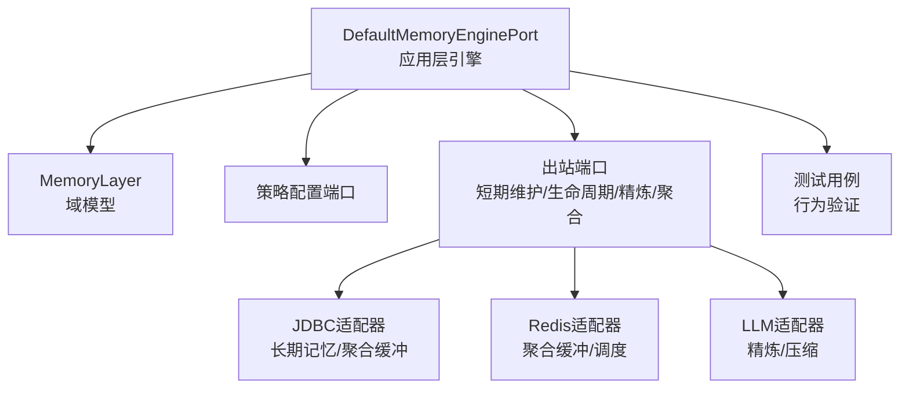
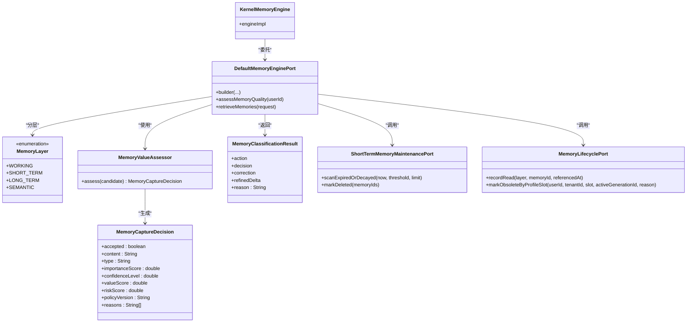
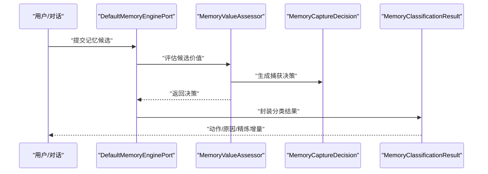
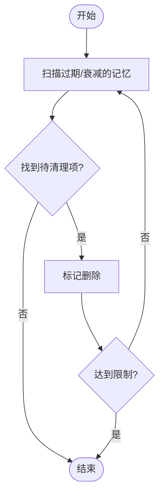
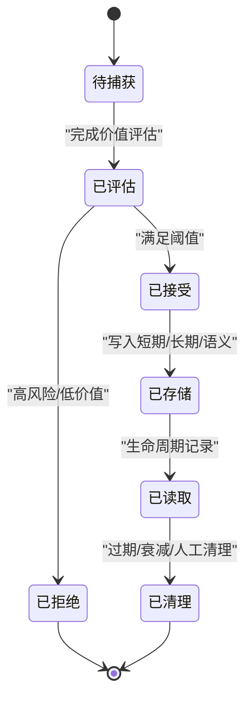
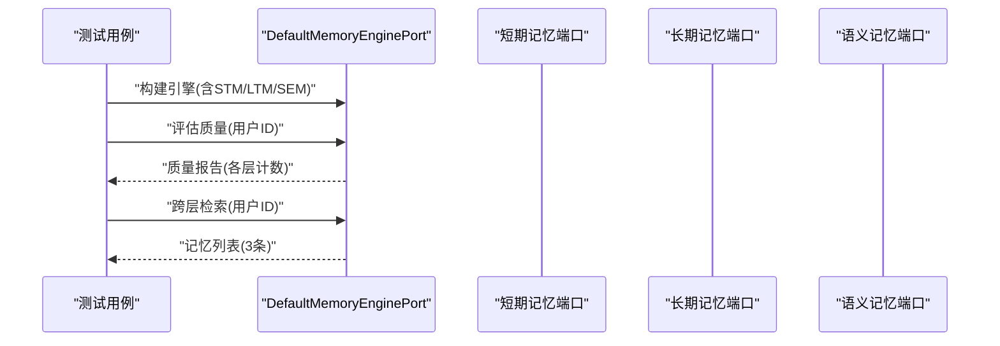
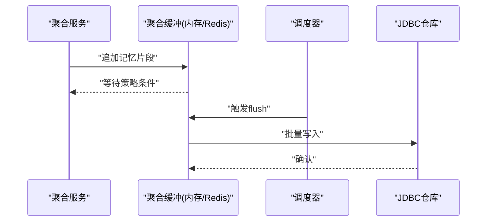
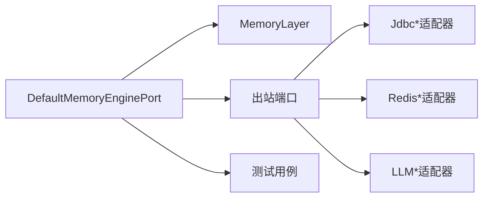

# 记忆领域模型

<cite>
**本文档引用的文件**
- [DefaultMemoryEnginePort.java](file://seahorse-agent-kernel/src/main/java/com/miracle/ai/seahorse/agent/kernel/application/memory/DefaultMemoryEnginePort.java)
- [KernelMemoryEngine.java](file://seahorse-agent-kernel/src/main/java/com/miracle/ai/seahorse/agent/kernel/application/memory/KernelMemoryEngine.java)
- [MemoryCaptureDecision.java](file://seahorse-agent-kernel/src/main/java/com/miracle/ai/seahorse/agent/kernel/application/memory/MemoryCaptureDecision.java)
- [MemoryClassificationResult.java](file://seahorse-agent-kernel/src/main/java/com/miracle/ai/seahorse/agent/kernel/application/memory/MemoryClassificationResult.java)
- [MemoryValueAssessor.java](file://seahorse-agent-kernel/src/main/java/com/miracle/ai/seahorse/agent/kernel/application/memory/MemoryValueAssessor.java)
- [MemoryLayer.java](file://seahorse-agent-kernel/src/main/java/com/miracle/ai/seahorse/agent/kernel/domain/memory/MemoryLayer.java)
- [ShortTermMemoryMaintenancePort.java](file://seahorse-agent-kernel/src/main/java/com/miracle/ai/seahorse/agent/ports/outbound/memory/ShortTermMemoryMaintenancePort.java)
- [MemoryLifecyclePort.java](file://seahorse-agent-kernel/src/main/java/com/miracle/ai/seahorse/agent/ports/outbound/memory/MemoryLifecyclePort.java)
- [JdbcLongTermMemoryRepositoryAdapter.java](file://seahorse-agent-adapter-repository-jdbc/src/main/java/com/miracle/ai/seahorse/agent/adapters/repository/jdbc/JdbcLongTermMemoryRepositoryAdapter.java)
- [JdbcMemoryAggregationBufferAdapter.java](file://seahorse-agent-adapter-repository-jdbc/src/main/java/com/miracle/ai/seahorse/agent/adapters/repository/jdbc/JdbcMemoryAggregationBufferAdapter.java)
- [RedisMemoryAggregationBufferPort.java](file://seahorse-agent-adapter-cache-redis/src/main/java/com/miracle/ai/seahorse/agent/adapters/cache/redis/RedisMemoryAggregationBufferPort.java)
- [RedisMemoryAggregationSchedulerPort.java](file://seahorse-agent-adapter-cache-redis/src/main/java/com/miracle/ai/seahorse/agent/adapters/cache/redis/RedisMemoryAggregationSchedulerPort.java)
- [LlmMemoryRefinerAdapter.java](file://seahorse-agent-adapter-ai-openai-compatible/src/main/java/com/miracle/ai/seahorse/agent/adapters/ai/openai/LlmMemoryRefinerAdapter.java)
- [LlmMemoryCompactionSummarizerAdapter.java](file://seahorse-agent-adapter-ai-openai-compatible/src/main/java/com/miracle/ai/seahorse/agent/adapters/ai/openai/LlmMemoryCompactionSummarizerAdapter.java)
- [DefaultMemoryEnginePortTests.java](file://seahorse-agent-tests/src/test/java/com/miracle/ai/seahorse/agent/kernel/application/memory/DefaultMemoryEnginePortTests.java)
- [MemoryAggregationServiceTests.java](file://seahorse-agent-tests/src/test/java/com/miracle/ai/seahorse/agent/kernel/application/memory/aggregation/MemoryAggregationServiceTests.java)
</cite>

## 目录
1. [引言](#引言)
2. [项目结构](#项目结构)
3. [核心组件](#核心组件)
4. [架构总览](#架构总览)
5. [详细组件分析](#详细组件分析)
6. [依赖关系分析](#依赖关系分析)
7. [性能考虑](#性能考虑)
8. [故障排除指南](#故障排除指南)
9. [结论](#结论)
10. [附录](#附录)

## 引言
本文件系统性梳理Seahorse记忆领域模型的设计与实现，覆盖短期记忆、长期记忆、工作记忆、语义记忆等分层，以及记忆捕获、分类、存储、检索、聚合、清理、衰减、治理与质量评估等关键能力。文档通过类图、时序图、流程图与状态图，帮助读者理解记忆从产生到消亡的完整生命周期，并说明记忆模型如何支撑上下文保持、意图识别、检索增强与个性化推荐等场景。

## 项目结构
记忆域主要分布在以下模块：
- kernel：记忆引擎、策略与服务（应用层）
- adapter-*：适配器，连接具体存储、缓存与外部AI服务
- tests：针对记忆引擎与聚合服务的行为验证

图表来源
- [DefaultMemoryEnginePort.java:751-775](file://seahorse-agent-kernel/src/main/java/com/miracle/ai/seahorse/agent/kernel/application/memory/DefaultMemoryEnginePort.java#L751-L775)
- [KernelMemoryEngine.java](file://seahorse-agent-kernel/src/main/java/com/miracle/ai/seahorse/agent/kernel/application/memory/KernelMemoryEngine.java)
- [MemoryValueAssessor.java:32-59](file://seahorse-agent-kernel/src/main/java/com/miracle/ai/seahorse/agent/kernel/application/memory/MemoryValueAssessor.java#L32-L59)
- [MemoryCaptureDecision.java:23-31](file://seahorse-agent-kernel/src/main/java/com/miracle/ai/seahorse/agent/kernel/application/memory/MemoryCaptureDecision.java#L23-L31)
- [MemoryClassificationResult.java:24-35](file://seahorse-agent-kernel/src/main/java/com/miracle/ai/seahorse/agent/kernel/application/memory/MemoryClassificationResult.java#L24-L35)
- [MemoryLayer.java:23-28](file://seahorse-agent-kernel/src/main/java/com/miracle/ai/seahorse/agent/kernel/domain/memory/MemoryLayer.java#L23-L28)
- [ShortTermMemoryMaintenancePort.java:31-47](file://seahorse-agent-kernel/src/main/java/com/miracle/ai/seahorse/agent/ports/outbound/memory/ShortTermMemoryMaintenancePort.java#L31-L47)
- [MemoryLifecyclePort.java:32-51](file://seahorse-agent-kernel/src/main/java/com/miracle/ai/seahorse/agent/ports/outbound/memory/MemoryLifecyclePort.java#L32-L51)
- [JdbcLongTermMemoryRepositoryAdapter.java](file://seahorse-agent-adapter-repository-jdbc/src/main/java/com/miracle/ai/seahorse/agent/adapters/repository/jdbc/JdbcLongTermMemoryRepositoryAdapter.java)
- [JdbcMemoryAggregationBufferAdapter.java](file://seahorse-agent-adapter-repository-jdbc/src/main/java/com/miracle/ai/seahorse/agent/adapters/repository/jdbc/JdbcMemoryAggregationBufferAdapter.java)
- [RedisMemoryAggregationBufferPort.java](file://seahorse-agent-adapter-cache-redis/src/main/java/com/miracle/ai/seahorse/agent/adapters/cache/redis/RedisMemoryAggregationBufferPort.java)
- [RedisMemoryAggregationSchedulerPort.java](file://seahorse-agent-adapter-cache-redis/src/main/java/com/miracle/ai/seahorse/agent/adapters/cache/redis/RedisMemoryAggregationSchedulerPort.java)
- [LlmMemoryRefinerAdapter.java](file://seahorse-agent-adapter-ai-openai-compatible/src/main/java/com/miracle/ai/seahorse/agent/adapters/ai/openai/LlmMemoryRefinerAdapter.java)
- [LlmMemoryCompactionSummarizerAdapter.java](file://seahorse-agent-adapter-ai-openai-compatible/src/main/java/com/miracle/ai/seahorse/agent/adapters/ai/openai/LlmMemoryCompactionSummarizerAdapter.java)

章节来源
- [DefaultMemoryEnginePort.java:751-775](file://seahorse-agent-kernel/src/main/java/com/miracle/ai/seahorse/agent/kernel/application/memory/DefaultMemoryEnginePort.java#L751-L775)
- [MemoryLayer.java:23-28](file://seahorse-agent-kernel/src/main/java/com/miracle/ai/seahorse/agent/kernel/domain/memory/MemoryLayer.java#L23-L28)

## 核心组件
- 记忆分层：WORKING、SHORT_TERM、LONG_TERM、SEMANTIC
- 记忆引擎：统一编排短期/长期/语义记忆的捕获、分类、存储、检索与治理
- 价值评估：基于风险阈值、显性信号、稳定性、特异性等指标进行捕获决策
- 捕获决策：输出是否接受、内容、类型、重要度、置信度、价值度、风险度、策略版本与原因
- 分类结果：封装动作、决策、占用修正、精炼增量与原因
- 生命周期与维护：记录读取、标记过期/衰减、批量清理
- 聚合与调度：缓冲区与调度器，支持内存与Redis实现
- 外部精炼：通过LLM进行记忆精炼与压缩总结

章节来源
- [MemoryLayer.java:23-28](file://seahorse-agent-kernel/src/main/java/com/miracle/ai/seahorse/agent/kernel/domain/memory/MemoryLayer.java#L23-L28)
- [MemoryValueAssessor.java:32-59](file://seahorse-agent-kernel/src/main/java/com/miracle/ai/seahorse/agent/kernel/application/memory/MemoryValueAssessor.java#L32-L59)
- [MemoryCaptureDecision.java:23-31](file://seahorse-agent-kernel/src/main/java/com/miracle/ai/seahorse/agent/kernel/application/memory/MemoryCaptureDecision.java#L23-L31)
- [MemoryClassificationResult.java:24-35](file://seahorse-agent-kernel/src/main/java/com/miracle/ai/seahorse/agent/kernel/application/memory/MemoryClassificationResult.java#L24-L35)
- [ShortTermMemoryMaintenancePort.java:31-47](file://seahorse-agent-kernel/src/main/java/com/miracle/ai/seahorse/agent/ports/outbound/memory/ShortTermMemoryMaintenancePort.java#L31-L47)
- [MemoryLifecyclePort.java:32-51](file://seahorse-agent-kernel/src/main/java/com/miracle/ai/seahorse/agent/ports/outbound/memory/MemoryLifecyclePort.java#L32-L51)

## 架构总览
记忆域采用“应用层引擎 + 域模型 + 出站端口 + 适配器”的分层设计。应用层负责编排与策略，域层定义分层类型，出站端口抽象存储与维护操作，适配器对接具体实现（JDBC、Redis、LLM）。

图表来源
- [DefaultMemoryEnginePort.java:751-775](file://seahorse-agent-kernel/src/main/java/com/miracle/ai/seahorse/agent/kernel/application/memory/DefaultMemoryEnginePort.java#L751-L775)
- [MemoryLayer.java:23-28](file://seahorse-agent-kernel/src/main/java/com/miracle/ai/seahorse/agent/kernel/domain/memory/MemoryLayer.java#L23-L28)
- [JdbcLongTermMemoryRepositoryAdapter.java](file://seahorse-agent-adapter-repository-jdbc/src/main/java/com/miracle/ai/seahorse/agent/adapters/repository/jdbc/JdbcLongTermMemoryRepositoryAdapter.java)
- [JdbcMemoryAggregationBufferAdapter.java](file://seahorse-agent-adapter-repository-jdbc/src/main/java/com/miracle/ai/seahorse/agent/adapters/repository/jdbc/JdbcMemoryAggregationBufferAdapter.java)
- [RedisMemoryAggregationBufferPort.java](file://seahorse-agent-adapter-cache-redis/src/main/java/com/miracle/ai/seahorse/agent/adapters/cache/redis/RedisMemoryAggregationBufferPort.java)
- [RedisMemoryAggregationSchedulerPort.java](file://seahorse-agent-adapter-cache-redis/src/main/java/com/miracle/ai/seahorse/agent/adapters/cache/redis/RedisMemoryAggregationSchedulerPort.java)
- [LlmMemoryRefinerAdapter.java](file://seahorse-agent-adapter-ai-openai-compatible/src/main/java/com/miracle/ai/seahorse/agent/adapters/ai/openai/LlmMemoryRefinerAdapter.java)
- [LlmMemoryCompactionSummarizerAdapter.java](file://seahorse-agent-adapter-ai-openai-compatible/src/main/java/com/miracle/ai/seahorse/agent/adapters/ai/openai/LlmMemoryCompactionSummarizerAdapter.java)

## 详细组件分析

### 类图：记忆引擎与核心实体

图表来源
- [MemoryLayer.java:23-28](file://seahorse-agent-kernel/src/main/java/com/miracle/ai/seahorse/agent/kernel/domain/memory/MemoryLayer.java#L23-L28)
- [MemoryValueAssessor.java:32-59](file://seahorse-agent-kernel/src/main/java/com/miracle/ai/seahorse/agent/kernel/application/memory/MemoryValueAssessor.java#L32-L59)
- [MemoryCaptureDecision.java:23-31](file://seahorse-agent-kernel/src/main/java/com/miracle/ai/seahorse/agent/kernel/application/memory/MemoryCaptureDecision.java#L23-L31)
- [MemoryClassificationResult.java:24-35](file://seahorse-agent-kernel/src/main/java/com/miracle/ai/seahorse/agent/kernel/application/memory/MemoryClassificationResult.java#L24-L35)
- [DefaultMemoryEnginePort.java:751-775](file://seahorse-agent-kernel/src/main/java/com/miracle/ai/seahorse/agent/kernel/application/memory/DefaultMemoryEnginePort.java#L751-L775)
- [KernelMemoryEngine.java](file://seahorse-agent-kernel/src/main/java/com/miracle/ai/seahorse/agent/kernel/application/memory/KernelMemoryEngine.java)
- [ShortTermMemoryMaintenancePort.java:31-47](file://seahorse-agent-kernel/src/main/java/com/miracle/ai/seahorse/agent/ports/outbound/memory/ShortTermMemoryMaintenancePort.java#L31-L47)
- [MemoryLifecyclePort.java:32-51](file://seahorse-agent-kernel/src/main/java/com/miracle/ai/seahorse/agent/ports/outbound/memory/MemoryLifecyclePort.java#L32-L51)

章节来源
- [DefaultMemoryEnginePort.java:751-775](file://seahorse-agent-kernel/src/main/java/com/miracle/ai/seahorse/agent/kernel/application/memory/DefaultMemoryEnginePort.java#L751-L775)
- [MemoryValueAssessor.java:32-59](file://seahorse-agent-kernel/src/main/java/com/miracle/ai/seahorse/agent/kernel/application/memory/MemoryValueAssessor.java#L32-L59)
- [MemoryCaptureDecision.java:23-31](file://seahorse-agent-kernel/src/main/java/com/miracle/ai/seahorse/agent/kernel/application/memory/MemoryCaptureDecision.java#L23-L31)
- [MemoryClassificationResult.java:24-35](file://seahorse-agent-kernel/src/main/java/com/miracle/ai/seahorse/agent/kernel/application/memory/MemoryClassificationResult.java#L24-L35)
- [MemoryLayer.java:23-28](file://seahorse-agent-kernel/src/main/java/com/miracle/ai/seahorse/agent/kernel/domain/memory/MemoryLayer.java#L23-L28)
- [ShortTermMemoryMaintenancePort.java:31-47](file://seahorse-agent-kernel/src/main/java/com/miracle/ai/seahorse/agent/ports/outbound/memory/ShortTermMemoryMaintenancePort.java#L31-L47)
- [MemoryLifecyclePort.java:32-51](file://seahorse-agent-kernel/src/main/java/com/miracle/ai/seahorse/agent/ports/outbound/memory/MemoryLifecyclePort.java#L32-L51)

### 时序图：记忆捕获与分类

图表来源
- [DefaultMemoryEnginePort.java:751-775](file://seahorse-agent-kernel/src/main/java/com/miracle/ai/seahorse/agent/kernel/application/memory/DefaultMemoryEnginePort.java#L751-L775)
- [MemoryValueAssessor.java:32-59](file://seahorse-agent-kernel/src/main/java/com/miracle/ai/seahorse/agent/kernel/application/memory/MemoryValueAssessor.java#L32-L59)
- [MemoryCaptureDecision.java:23-31](file://seahorse-agent-kernel/src/main/java/com/miracle/ai/seahorse/agent/kernel/application/memory/MemoryCaptureDecision.java#L23-L31)
- [MemoryClassificationResult.java:24-35](file://seahorse-agent-kernel/src/main/java/com/miracle/ai/seahorse/agent/kernel/application/memory/MemoryClassificationResult.java#L24-L35)

章节来源
- [DefaultMemoryEnginePort.java:751-775](file://seahorse-agent-kernel/src/main/java/com/miracle/ai/seahorse/agent/kernel/application/memory/DefaultMemoryEnginePort.java#L751-L775)
- [MemoryValueAssessor.java:32-59](file://seahorse-agent-kernel/src/main/java/com/miracle/ai/seahorse/agent/kernel/application/memory/MemoryValueAssessor.java#L32-L59)
- [MemoryCaptureDecision.java:23-31](file://seahorse-agent-kernel/src/main/java/com/miracle/ai/seahorse/agent/kernel/application/memory/MemoryCaptureDecision.java#L23-L31)
- [MemoryClassificationResult.java:24-35](file://seahorse-agent-kernel/src/main/java/com/miracle/ai/seahorse/agent/kernel/application/memory/MemoryClassificationResult.java#L24-L35)

### 流程图：短期记忆衰减与清理

图表来源
- [ShortTermMemoryMaintenancePort.java:31-47](file://seahorse-agent-kernel/src/main/java/com/miracle/ai/seahorse/agent/ports/outbound/memory/ShortTermMemoryMaintenancePort.java#L31-L47)

章节来源
- [ShortTermMemoryMaintenancePort.java:31-47](file://seahorse-agent-kernel/src/main/java/com/miracle/ai/seahorse/agent/ports/outbound/memory/ShortTermMemoryMaintenancePort.java#L31-L47)

### 状态图：记忆生命周期

图表来源
- [MemoryValueAssessor.java:32-59](file://seahorse-agent-kernel/src/main/java/com/miracle/ai/seahorse/agent/kernel/application/memory/MemoryValueAssessor.java#L32-L59)
- [MemoryLifecyclePort.java:32-51](file://seahorse-agent-kernel/src/main/java/com/miracle/ai/seahorse/agent/ports/outbound/memory/MemoryLifecyclePort.java#L32-L51)
- [ShortTermMemoryMaintenancePort.java:31-47](file://seahorse-agent-kernel/src/main/java/com/miracle/ai/seahorse/agent/ports/outbound/memory/ShortTermMemoryMaintenancePort.java#L31-L47)

章节来源
- [MemoryValueAssessor.java:32-59](file://seahorse-agent-kernel/src/main/java/com/miracle/ai/seahorse/agent/kernel/application/memory/MemoryValueAssessor.java#L32-L59)
- [MemoryLifecyclePort.java:32-51](file://seahorse-agent-kernel/src/main/java/com/miracle/ai/seahorse/agent/ports/outbound/memory/MemoryLifecyclePort.java#L32-L51)
- [ShortTermMemoryMaintenancePort.java:31-47](file://seahorse-agent-kernel/src/main/java/com/miracle/ai/seahorse/agent/ports/outbound/memory/ShortTermMemoryMaintenancePort.java#L31-L47)

### 组件A：记忆引擎与质量评估
- 统一入口：DefaultMemoryEnginePort.builder(...)构建引擎
- 质量评估：跨分层统计与报告
- 行为验证：测试用例覆盖全层检索与质量报告

图表来源
- [DefaultMemoryEnginePort.java:751-775](file://seahorse-agent-kernel/src/main/java/com/miracle/ai/seahorse/agent/kernel/application/memory/DefaultMemoryEnginePort.java#L751-L775)
- [DefaultMemoryEnginePortTests.java:2400-2429](file://seahorse-agent-tests/src/test/java/com/miracle/ai/seahorse/agent/kernel/application/memory/DefaultMemoryEnginePortTests.java#L2400-L2429)

章节来源
- [DefaultMemoryEnginePort.java:751-775](file://seahorse-agent-kernel/src/main/java/com/miracle/ai/seahorse/agent/kernel/application/memory/DefaultMemoryEnginePort.java#L751-L775)
- [DefaultMemoryEnginePortTests.java:2400-2429](file://seahorse-agent-tests/src/test/java/com/miracle/ai/seahorse/agent/kernel/application/memory/DefaultMemoryEnginePortTests.java#L2400-L2429)

### 组件B：记忆聚合与调度
- 缓冲区：JDBC与Redis两种实现
- 调度器：按策略触发flush与合并
- 行为验证：测试覆盖append-turn不触发flush等场景

图表来源
- [JdbcMemoryAggregationBufferAdapter.java](file://seahorse-agent-adapter-repository-jdbc/src/main/java/com/miracle/ai/seahorse/agent/adapters/repository/jdbc/JdbcMemoryAggregationBufferAdapter.java)
- [RedisMemoryAggregationBufferPort.java](file://seahorse-agent-adapter-cache-redis/src/main/java/com/miracle/ai/seahorse/agent/adapters/cache/redis/RedisMemoryAggregationBufferPort.java)
- [RedisMemoryAggregationSchedulerPort.java](file://seahorse-agent-adapter-cache-redis/src/main/java/com/miracle/ai/seahorse/agent/adapters/cache/redis/RedisMemoryAggregationSchedulerPort.java)
- [MemoryAggregationServiceTests.java:259-282](file://seahorse-agent-tests/src/test/java/com/miracle/ai/seahorse/agent/kernel/application/memory/aggregation/MemoryAggregationServiceTests.java#L259-L282)

章节来源
- [JdbcMemoryAggregationBufferAdapter.java](file://seahorse-agent-adapter-repository-jdbc/src/main/java/com/miracle/ai/seahorse/agent/adapters/repository/jdbc/JdbcMemoryAggregationBufferAdapter.java)
- [RedisMemoryAggregationBufferPort.java](file://seahorse-agent-adapter-cache-redis/src/main/java/com/miracle/ai/seahorse/agent/adapters/cache/redis/RedisMemoryAggregationBufferPort.java)
- [RedisMemoryAggregationSchedulerPort.java](file://seahorse-agent-adapter-cache-redis/src/main/java/com/miracle/ai/seahorse/agent/adapters/cache/redis/RedisMemoryAggregationSchedulerPort.java)
- [MemoryAggregationServiceTests.java:259-282](file://seahorse-agent-tests/src/test/java/com/miracle/ai/seahorse/agent/kernel/application/memory/aggregation/MemoryAggregationServiceTests.java#L259-L282)

### 组件C：长期记忆存储
- JDBC适配器：提供长期记忆的持久化能力
- 支持：查询、写入、索引、关键词检索等扩展点

章节来源
- [JdbcLongTermMemoryRepositoryAdapter.java](file://seahorse-agent-adapter-repository-jdbc/src/main/java/com/miracle/ai/seahorse/agent/adapters/repository/jdbc/JdbcLongTermMemoryRepositoryAdapter.java)

### 组件D：LLM精炼与压缩
- 精炼：将冗长或重复的记忆提炼为更紧凑的表达
- 压缩总结：对多条记忆进行摘要归纳，降低存储与检索成本

章节来源
- [LlmMemoryRefinerAdapter.java](file://seahorse-agent-adapter-ai-openai-compatible/src/main/java/com/miracle/ai/seahorse/agent/adapters/ai/openai/LlmMemoryRefinerAdapter.java)
- [LlmMemoryCompactionSummarizerAdapter.java](file://seahorse-agent-adapter-ai-openai-compatible/src/main/java/com/miracle/ai/seahorse/agent/adapters/ai/openai/LlmMemoryCompactionSummarizerAdapter.java)

## 依赖关系分析
- 应用层与域层：引擎依赖分层枚举与策略配置
- 引擎与端口：通过出站端口解耦存储与维护逻辑
- 端口与适配器：JDBC/Redis/LLM适配器实现具体功能
- 测试与验证：通过测试用例验证引擎行为与聚合流程

图表来源
- [DefaultMemoryEnginePort.java:751-775](file://seahorse-agent-kernel/src/main/java/com/miracle/ai/seahorse/agent/kernel/application/memory/DefaultMemoryEnginePort.java#L751-L775)
- [MemoryLayer.java:23-28](file://seahorse-agent-kernel/src/main/java/com/miracle/ai/seahorse/agent/kernel/domain/memory/MemoryLayer.java#L23-L28)
- [JdbcLongTermMemoryRepositoryAdapter.java](file://seahorse-agent-adapter-repository-jdbc/src/main/java/com/miracle/ai/seahorse/agent/adapters/repository/jdbc/JdbcLongTermMemoryRepositoryAdapter.java)
- [JdbcMemoryAggregationBufferAdapter.java](file://seahorse-agent-adapter-repository-jdbc/src/main/java/com/miracle/ai/seahorse/agent/adapters/repository/jdbc/JdbcMemoryAggregationBufferAdapter.java)
- [RedisMemoryAggregationBufferPort.java](file://seahorse-agent-adapter-cache-redis/src/main/java/com/miracle/ai/seahorse/agent/adapters/cache/redis/RedisMemoryAggregationBufferPort.java)
- [RedisMemoryAggregationSchedulerPort.java](file://seahorse-agent-adapter-cache-redis/src/main/java/com/miracle/ai/seahorse/agent/adapters/cache/redis/RedisMemoryAggregationSchedulerPort.java)
- [LlmMemoryRefinerAdapter.java](file://seahorse-agent-adapter-ai-openai-compatible/src/main/java/com/miracle/ai/seahorse/agent/adapters/ai/openai/LlmMemoryRefinerAdapter.java)
- [LlmMemoryCompactionSummarizerAdapter.java](file://seahorse-agent-adapter-ai-openai-compatible/src/main/java/com/miracle/ai/seahorse/agent/adapters/ai/openai/LlmMemoryCompactionSummarizerAdapter.java)

章节来源
- [DefaultMemoryEnginePort.java:751-775](file://seahorse-agent-kernel/src/main/java/com/miracle/ai/seahorse/agent/kernel/application/memory/DefaultMemoryEnginePort.java#L751-L775)
- [MemoryLayer.java:23-28](file://seahorse-agent-kernel/src/main/java/com/miracle/ai/seahorse/agent/kernel/domain/memory/MemoryLayer.java#L23-L28)
- [JdbcLongTermMemoryRepositoryAdapter.java](file://seahorse-agent-adapter-repository-jdbc/src/main/java/com/miracle/ai/seahorse/agent/adapters/repository/jdbc/JdbcLongTermMemoryRepositoryAdapter.java)
- [JdbcMemoryAggregationBufferAdapter.java](file://seahorse-agent-adapter-repository-jdbc/src/main/java/com/miracle/ai/seahorse/agent/adapters/repository/jdbc/JdbcMemoryAggregationBufferAdapter.java)
- [RedisMemoryAggregationBufferPort.java](file://seahorse-agent-adapter-cache-redis/src/main/java/com/miracle/ai/seahorse/agent/adapters/cache/redis/RedisMemoryAggregationBufferPort.java)
- [RedisMemoryAggregationSchedulerPort.java](file://seahorse-agent-adapter-cache-redis/src/main/java/com/miracle/ai/seahorse/agent/adapters/cache/redis/RedisMemoryAggregationSchedulerPort.java)
- [LlmMemoryRefinerAdapter.java](file://seahorse-agent-adapter-ai-openai-compatible/src/main/java/com/miracle/ai/seahorse/agent/adapters/ai/openai/LlmMemoryRefinerAdapter.java)
- [LlmMemoryCompactionSummarizerAdapter.java](file://seahorse-agent-adapter-ai-openai-compatible/src/main/java/com/miracle/ai/seahorse/agent/adapters/ai/openai/LlmMemoryCompactionSummarizerAdapter.java)

## 性能考虑
- 聚合策略：通过缓冲与调度减少写放大，建议根据吞吐与延迟目标调整flush条件
- 存储分层：短期记忆用于高频访问，长期记忆用于持久化与回放，语义记忆用于知识抽取
- LLM精炼：在高成本场景下，优先本地规则过滤后再触发LLM处理
- 清理与衰减：定期扫描过期/低价值记忆，避免无界增长

## 故障排除指南
- 捕获被拒：检查风险阈值与显性信号，必要时调整策略版本
- 聚合未触发：确认缓冲条件与调度策略，参考测试用例断言
- 生命周期异常：核查记录读取与过期标记逻辑

章节来源
- [MemoryValueAssessor.java:32-59](file://seahorse-agent-kernel/src/main/java/com/miracle/ai/seahorse/agent/kernel/application/memory/MemoryValueAssessor.java#L32-L59)
- [MemoryAggregationServiceTests.java:259-282](file://seahorse-agent-tests/src/test/java/com/miracle/ai/seahorse/agent/kernel/application/memory/aggregation/MemoryAggregationServiceTests.java#L259-L282)
- [MemoryLifecyclePort.java:32-51](file://seahorse-agent-kernel/src/main/java/com/miracle/ai/seahorse/agent/ports/outbound/memory/MemoryLifecyclePort.java#L32-L51)
- [ShortTermMemoryMaintenancePort.java:31-47](file://seahorse-agent-kernel/src/main/java/com/miracle/ai/seahorse/agent/ports/outbound/memory/ShortTermMemoryMaintenancePort.java#L31-L47)

## 结论
本记忆领域模型通过清晰的分层与可插拔的适配器，实现了从捕获、评估、分类到存储、检索、聚合与治理的闭环。短期与长期记忆协同，结合语义记忆与LLM精炼，支撑上下文保持、意图识别、检索增强与个性化推荐等关键能力。建议在生产环境中结合业务特征持续优化策略参数与聚合策略，确保性能与质量的平衡。

## 附录
- 最佳实践
  - 明确风险阈值与显性信号，优先保留高价值记忆
  - 使用聚合缓冲与调度策略，平衡延迟与吞吐
  - 定期清理过期/低价值记忆，控制存储成本
  - 在检索前进行关键词索引与向量化，提升召回质量
  - 通过测试用例验证引擎行为与聚合流程，确保一致性