# 领域模型

<cite>
**本文引用的文件**
- [Kernel 核心.md](file://docs/zh/content/后端系统/核心内核/核心内核.md)
- [领域模型.md](file://docs/zh/content/后端系统/核心内核/领域模型/领域模型.md)
- [KernelRuntimeMode.java](file://seahorse-agent-kernel/src/main/java/com/miracle/ai/seahorse/agent/kernel/config/KernelRuntimeMode.java)
- [ChatRequest.java](file://seahorse-agent-kernel/src/main/java/com/miracle/ai/seahorse/agent/kernel/domain/chat/ChatRequest.java)
- [RetrievalContext.java](file://seahorse-agent-kernel/src/main/java/com/miracle/ai/seahorse/agent/kernel/domain/retrieval/RetrievalContext.java)
- [MemoryContext.java](file://seahorse-agent-kernel/src/main/java/com/miracle/ai/seahorse/agent/kernel/domain/memory/MemoryContext.java)
- [IngestionContext.java](file://seahorse-agent-kernel/src/main/java/com/miracle/ai/seahorse/agent/kernel/domain/ingestion/IngestionContext.java)
- [KnowledgeDocumentDetail.java](file://seahorse-agent-ports/outbound/knowledge/KnowledgeDocumentDetail.java)
- [OpenAiCompatibleModelAdapter.java](file://seahorse-agent-adapter-ai-openai-compatible/src/main/java/com/miracle/ai/seahorse/agent/adapters/ai/openai/OpenAiCompatibleModelAdapter.java)
- [JdbcMemoryAliasRepositoryAdapterTests.java](file://seahorse-agent-adapter-repository-jdbc/src/test/java/com/miracle/ai/seahorse/agent/adapters/repository/jdbc/JdbcMemoryAliasRepositoryAdapterTests.java)
- [Subscription.java](file://seahorse-agent-kernel/src/main/java/com/miracle/ai/seahorse/agent/kernel/domain/billing/Subscription.java)
- [SubscriptionPlan.java](file://seahorse-agent-kernel/src/main/java/com/miracle/ai/seahorse/agent/kernel/domain/billing/SubscriptionPlan.java)
- [PaymentOrder.java](file://seahorse-agent-kernel/src/main/java/com/miracle/ai/seahorse/agent/kernel/domain/billing/PaymentOrder.java)
- [Bill.java](file://seahorse-agent-kernel/src/main/java/com/miracle/ai/seahorse/agent/kernel/domain/billing/Bill.java)
- [KernelRegistrationService.java](file://seahorse-agent-kernel/src/main/java/com/miracle/ai/seahorse/agent/kernel/application/auth/KernelRegistrationService.java)
- [TenantProvisioningPort.java](file://seahorse-agent-kernel/src/main/java/com/miracle/ai/seahorse/agent/ports/outbound/tenant/TenantProvisioningPort.java)
- [04-billing.md](file://docs/aegis/plans/saas-mvp-impl/04-billing.md)
- [06-knowledge-base-enhancement.md](file://docs/aegis/plans/saas-mvp-impl/06-knowledge-base-enhancement.md)
- [07-agent-marketplace.md](file://docs/aegis/plans/saas-mvp-impl/07-agent-marketplace.md)
- [V5__billing_tables.sql](file://resources/database/migrations/V5__billing_tables.sql)
- [V7__execution_steps.sql](file://resources/database/migrations/V7__execution_steps.sql)
- [V8__knowledge_base_enhancement.sql](file://resources/database/migrations/V8__knowledge_base_enhancement.sql)
- [V9__agent_marketplace.sql](file://resources/database/migrations/V9__agent_marketplace.sql)
- [V10__audit_log_and_admin.sql](file://resources/database/migrations/V10__audit_log_and_admin.sql)
- [SeahorseAccessDecisionController.java](file://seahorse-agent-adapter-web/src/main/java/com/miracle/ai/seahorse/agent/adapters/web/SeahorseAccessDecisionController.java)
- [JdbcResourceAclRepositoryAdapterTests.java](file://seahorse-agent-adapter-repository-jdbc/src/test/java/com/miracle/ai/seahorse/agent/adapters/repository/jdbc/JdbcResourceAclRepositoryAdapterTests.java)
- [安全配置.md](file://docs/zh/content/数据库设计/安全配置.md)
</cite>

## 更新摘要
**所做更改**
- 新增知识库增强领域模型章节，涵盖版本管理、权限控制、分享链接等实体
- 新增代理市场领域模型章节，包含发布审核、订阅管理、评分排行等实体
- 新增审计日志领域模型章节，包含访问审计、操作日志等实体
- 新增执行步骤领域模型章节，包含任务执行跟踪、步骤状态等实体
- 更新架构总览图，添加知识库增强、代理市场、审计日志、执行步骤子域
- 更新详细组件分析，补充新增领域的实体关系和业务规则

## 目录
1. [简介](#简介)
2. [项目结构](#项目结构)
3. [核心组件](#核心组件)
4. [架构总览](#架构总览)
5. [详细组件分析](#详细组件分析)
6. [依赖分析](#依赖分析)
7. [性能考虑](#性能考虑)
8. [故障排查指南](#故障排查指南)
9. [结论](#结论)
10. [附录](#附录)

## 简介
本文件系统性梳理 Seahorse Agent Kernel 模块的领域模型设计，聚焦于 agent 代理模型、chat 聊天模型、conversation 会话模型、ingestion 摄取模型、knowledge 知识库模型、memory 记忆模型、metadata 元数据模型、retrieval 检索模型、**计费模型**、**用户注册模型**、**安全模型**、**知识库增强模型**、**代理市场模型**、**审计日志模型**、**执行步骤模型**等子域的实体、值对象、聚合根与领域服务的定义与职责边界。文档解释各模型之间的关系与约束（继承、组合、依赖），并提供 UML 图与序列图以展示业务流程中的对象交互。最后总结领域模型如何保证业务逻辑的封装性与不变性，并支持业务规则的演进。

## 项目结构
Kernel 模块采用清晰的分层与职责划分：
- config：运行时模式配置
- application：应用服务层，封装业务用例与编排流程
- domain：领域模型与值对象
- feature：可插拔特性接口（L2 扩展）
- plugin：插件化基础设施（扩展注册、激活上下文、特征类型等）
- ports：端口接口（inbound/outbound），作为与外部交互的契约

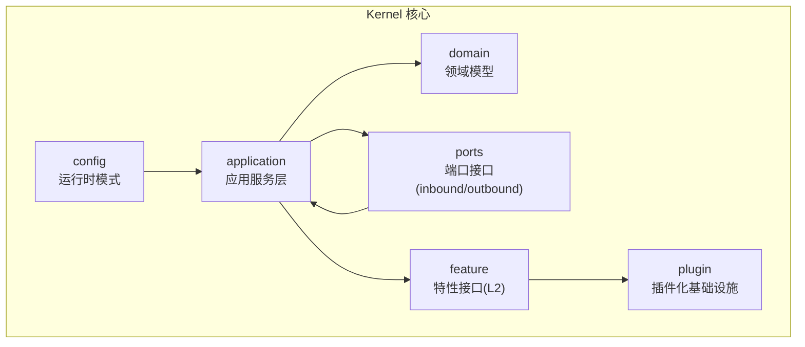
```mermaid
graph TB
subgraph "Kernel 核心"
CFG["config<br/>运行时模式"]
APP["application<br/>应用服务层"]
DOM["domain<br/>领域模型"]
FEA["feature<br/>特性接口(L2)"]
PLG["plugin<br/>插件化基础设施"]
POR["ports<br/>端口接口(inbound/outbound)"]
end
CFG --> APP
APP --> DOM
APP --> POR
APP --> FEA
FEA --> PLG
POR --> APP
```

**图表来源**
- [Kernel 核心.md:45-61](file://docs/zh/content/后端系统/核心内核/核心内核.md#L45-L61)

**章节来源**
- [Kernel 核心.md:28-61](file://docs/zh/content/后端系统/核心内核/核心内核.md#L28-L61)

## 核心组件
本节从领域建模视角，概览 Kernel 子域的关键概念与职责：
- agent 代理模型：封装代理生命周期、工具调用、访问控制与审计等能力
- chat 聊天模型：承载消息、请求、采样与流式回调等聊天相关数据结构
- conversation 会话模型：管理对话历史、附件与状态流转
- ingestion 摄取模型：描述文档摄取任务、上下文与状态机
- knowledge 知识库模型：知识文档、分片、查询与质量度量
- memory 记忆模型：实体别名、记忆项、聚合缓冲与生命周期
- metadata 元数据模型：字典、模式、提取结果与合规治理
- retrieval 检索模型：检索上下文、召回片段与重排序策略
- **billing 计费模型**：订阅计划、支付订单、账单管理与配额控制
- **auth 用户注册模型**：用户注册、验证、免费试用与租户管理
- **security 安全模型**：访问控制决策、资源ACL管理与权限审计
- **knowledge enhancement 知识库增强模型**：版本管理、权限控制、分享链接与访问日志
- **agent marketplace 代理市场模型**：发布审核、订阅管理、评分排行与热度计算
- **audit log 审计日志模型**：访问审计、操作日志与合规追踪
- **execution steps 执行步骤模型**：任务执行跟踪、步骤状态与流程监控

上述模型共同构成 Kernel 的领域模型骨架，支撑上层应用服务完成复杂业务编排。

**章节来源**
- [Kernel 核心.md:28-61](file://docs/zh/content/后端系统/核心内核/核心内核.md#L28-L61)

## 架构总览
下图展示 Kernel 领域模型在典型推理流程中的协作关系，强调上下文驱动的数据流与跨子域的依赖：

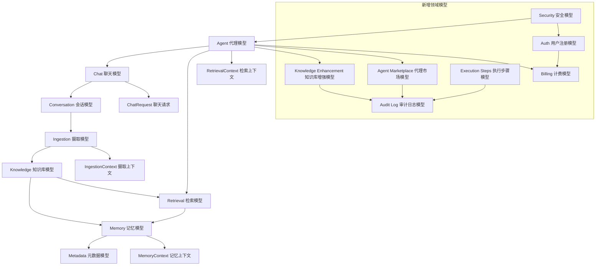
```mermaid
graph TB
A["Agent 代理模型"] --> B["Chat 聊天模型"]
B --> C["Conversation 会话模型"]
C --> D["Ingestion 摄取模型"]
D --> E["Knowledge 知识库模型"]
E --> F["Memory 记忆模型"]
F --> G["Metadata 元数据模型"]
E --> H["Retrieval 检索模型"]
A --> H
H --> F
A --> I["RetrievalContext 检索上下文"]
B --> J["ChatRequest 聊天请求"]
D --> K["IngestionContext 摄取上下文"]
F --> L["MemoryContext 记忆上下文"]
subgraph "新增领域模型"
KB_ENH["Knowledge Enhancement 知识库增强模型"]
AGENT_MKT["Agent Marketplace 代理市场模型"]
AUDIT_LOG["Audit Log 审计日志模型"]
EXEC_STEPS["Execution Steps 执行步骤模型"]
BILL["Billing 计费模型"]
AUTH["Auth 用户注册模型"]
SEC["Security 安全模型"]
end
A --> KB_ENH
A --> AGENT_MKT
KB_ENH --> AUDIT_LOG
AGENT_MKT --> AUDIT_LOG
EXEC_STEPS --> AUDIT_LOG
A --> BILL
AUTH --> BILL
SEC --> A
SEC --> AUTH
```

**图表来源**
- [领域模型.md:410-417](file://docs/zh/content/后端系统/核心内核/领域模型/领域模型.md#L410-L417)
- [RetrievalContext.java:1-51](file://seahorse-agent-kernel/src/main/java/com/miracle/ai/seahorse/agent/kernel/domain/retrieval/RetrievalContext.java#L1-L51)
- [ChatRequest.java:1-67](file://seahorse-agent-kernel/src/main/java/com/miracle/ai/seahorse/agent/kernel/domain/chat/ChatRequest.java#L1-L67)
- [MemoryContext.java:1-42](file://seahorse-agent-kernel/src/main/java/com/miracle/ai/seahorse/agent/kernel/domain/memory/MemoryContext.java#L1-L42)
- [IngestionContext.java:1-52](file://seahorse-agent-kernel/src/main/java/com/miracle/ai/seahorse/agent/kernel/domain/ingestion/IngestionContext.java#L1-L52)

## 详细组件分析

### Agent 代理模型
- 聚合根：Agent（代理主体），包含工具绑定、访问决策、运行队列与工单状态
- 值对象：AgentToolCall（工具调用）、KernelAgentLoopOptions（循环选项）
- 领域服务：KernelAgentLoop（代理主循环）、KernelAccessDecisionQueryService（访问决策查询）、KernelContextPackBuilderService（上下文包构建）
- 关系与约束：
  - 组合关系：Agent 聚合包含多个运行记录、队列与工单
  - 依赖关系：依赖 ContextPack、AccessDecision、ResourceACL 等端口
  - 不变性：通过只读上下文与不可变工具参数保障执行一致性

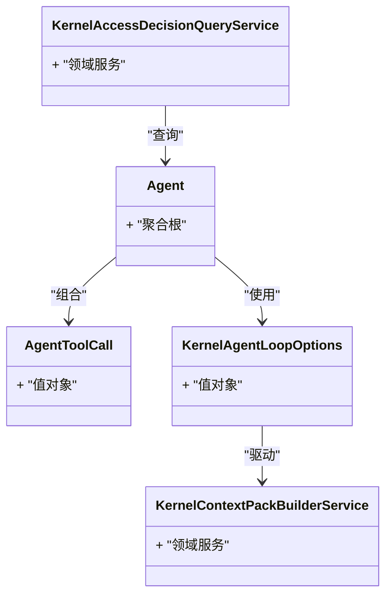
```mermaid
classDiagram
class Agent {
+ "聚合根"
}
class AgentToolCall {
+ "值对象"
}
class KernelAgentLoopOptions {
+ "值对象"
}
class KernelAccessDecisionQueryService {
+ "领域服务"
}
class KernelContextPackBuilderService {
+ "领域服务"
}
Agent --> AgentToolCall : "组合"
Agent --> KernelAgentLoopOptions : "使用"
KernelAgentLoopOptions --> KernelContextPackBuilderService : "驱动"
KernelAccessDecisionQueryService --> Agent : "查询"
```

**图表来源**
- [Kernel 核心.md:28-61](file://docs/zh/content/后端系统/核心内核/核心内核.md#L28-L61)

**章节来源**
- [Kernel 核心.md:28-61](file://docs/zh/content/后端系统/核心内核/核心内核.md#L28-L61)

### Chat 聊天模型
- 聚合根：ChatRequest（聊天请求），封装消息列表、采样策略与流式回调
- 值对象：ChatMessage（消息）、ChatSamplingOptions（采样选项）、StreamCallback（流式回调）
- 领域服务：OpenAiCompatibleModelAdapter（模型适配器）在推理中消费 ChatRequest 并产出检索上下文
- 关系与约束：
  - 组合关系：ChatRequest 包含多条 ChatMessage
  - 依赖关系：依赖向量存储与检索端口
  - 不变性：消息与采样参数在请求生命周期内保持稳定

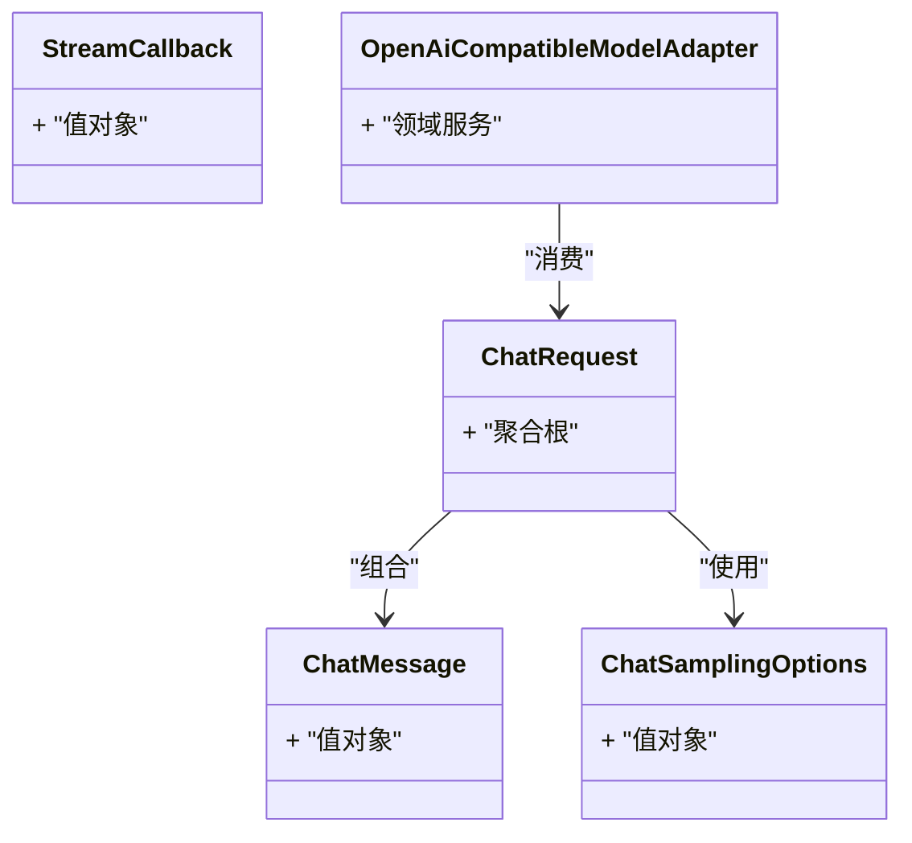
```mermaid
classDiagram
class ChatRequest {
+ "聚合根"
}
class ChatMessage {
+ "值对象"
}
class ChatSamplingOptions {
+ "值对象"
}
class StreamCallback {
+ "值对象"
}
class OpenAiCompatibleModelAdapter {
+ "领域服务"
}
ChatRequest --> ChatMessage : "组合"
ChatRequest --> ChatSamplingOptions : "使用"
OpenAiCompatibleModelAdapter --> ChatRequest : "消费"
```

**图表来源**
- [ChatRequest.java:1-67](file://seahorse-agent-kernel/src/main/java/com/miracle/ai/seahorse/agent/kernel/domain/chat/ChatRequest.java#L1-L67)
- [OpenAiCompatibleModelAdapter.java:139-143](file://seahorse-agent-adapter-ai-openai-compatible/src/main/java/com/miracle/ai/seahorse/agent/adapters/ai/openai/OpenAiCompatibleModelAdapter.java#L139-L143)

**章节来源**
- [ChatRequest.java:1-67](file://seahorse-agent-kernel/src/main/java/com/miracle/ai/seahorse/agent/kernel/domain/chat/ChatRequest.java#L1-L67)
- [OpenAiCompatibleModelAdapter.java:139-143](file://seahorse-agent-adapter-ai-openai-compatible/src/main/java/com/miracle/ai/seahorse/agent/adapters/ai/openai/OpenAiCompatibleModelAdapter.java#L139-L143)

### Conversation 会话模型
- 聚合根：Conversation（会话），管理消息历史、附件与状态
- 值对象：ConversationAttachment（附件）
- 领域服务：会话查询与更新服务
- 关系与约束：
  - 组合关系：会话聚合包含消息与附件
  - 依赖关系：依赖存储与检索端口
  - 不变性：会话 ID 与时间戳在生命周期内保持一致

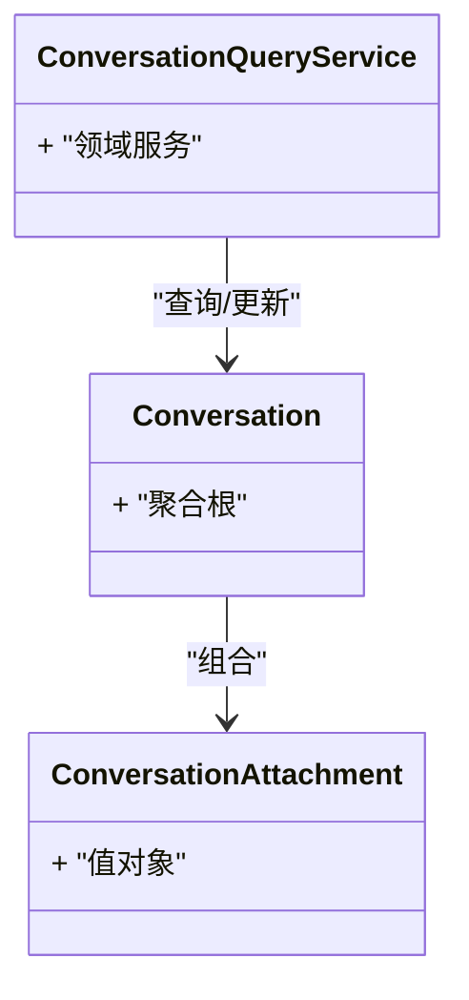
```mermaid
classDiagram
class Conversation {
+ "聚合根"
}
class ConversationAttachment {
+ "值对象"
}
class ConversationQueryService {
+ "领域服务"
}
Conversation --> ConversationAttachment : "组合"
ConversationQueryService --> Conversation : "查询/更新"
```

**图表来源**
- [Kernel 核心.md:28-61](file://docs/zh/content/后端系统/核心内核/核心内核.md#L28-L61)

**章节来源**
- [Kernel 核心.md:28-61](file://docs/zh/content/后端系统/核心内核/核心内核.md#L28-L61)

### Ingestion 摄取模型
- 聚合根：IngestionTask（摄取任务），描述文档来源、状态与进度
- 值对象：IngestionContext（摄取上下文）、DocumentSource（文档来源）
- 领域服务：摄取编排与状态推进
- 关系与约束：
  - 组合关系：任务聚合包含上下文与分片信息
  - 依赖关系：依赖存储、解析与向量端口
  - 不变性：任务 ID 与状态机推进受控

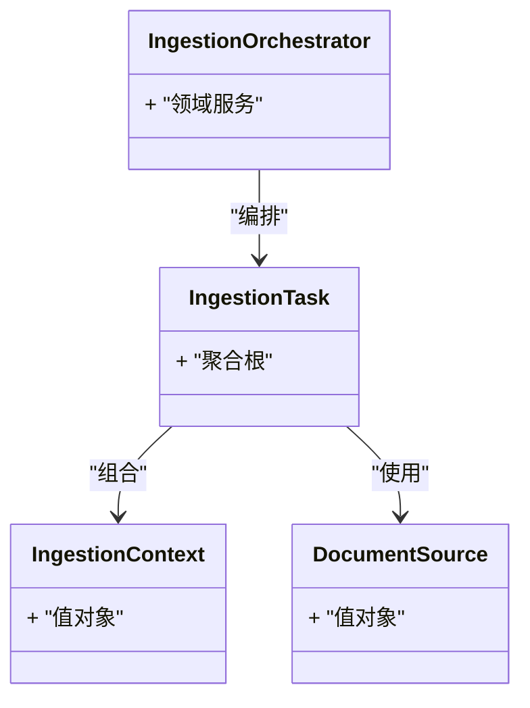
```mermaid
classDiagram
class IngestionTask {
+ "聚合根"
}
class IngestionContext {
+ "值对象"
}
class DocumentSource {
+ "值对象"
}
class IngestionOrchestrator {
+ "领域服务"
}
IngestionTask --> IngestionContext : "组合"
IngestionTask --> DocumentSource : "使用"
IngestionOrchestrator --> IngestionTask : "编排"
```

**图表来源**
- [IngestionContext.java:1-52](file://seahorse-agent-kernel/src/main/java/com/miracle/ai/seahorse/agent/kernel/domain/ingestion/IngestionContext.java#L1-L52)
- [Kernel 核心.md:28-61](file://docs/zh/content/后端系统/核心内核/核心内核.md#L28-L61)

**章节来源**
- [IngestionContext.java:1-52](file://seahorse-agent-kernel/src/main/java/com/miracle/ai/seahorse/agent/kernel/domain/ingestion/IngestionContext.java#L1-L52)
- [Kernel 核心.md:28-61](file://docs/zh/content/后端系统/核心内核/核心内核.md#L28-L61)

### Knowledge 知识库模型
- 聚合根：KnowledgeDocument（知识文档）、KnowledgeChunk（知识分片）
- 值对象：KnowledgeDocumentDetail（文档详情）、Query（查询）
- 领域服务：知识查询与质量度量
- 关系与约束：
  - 组合关系：文档聚合包含多个分片
  - 依赖关系：依赖搜索与存储端口
  - 不变性：文档 ID 与分片向量在生命周期内稳定

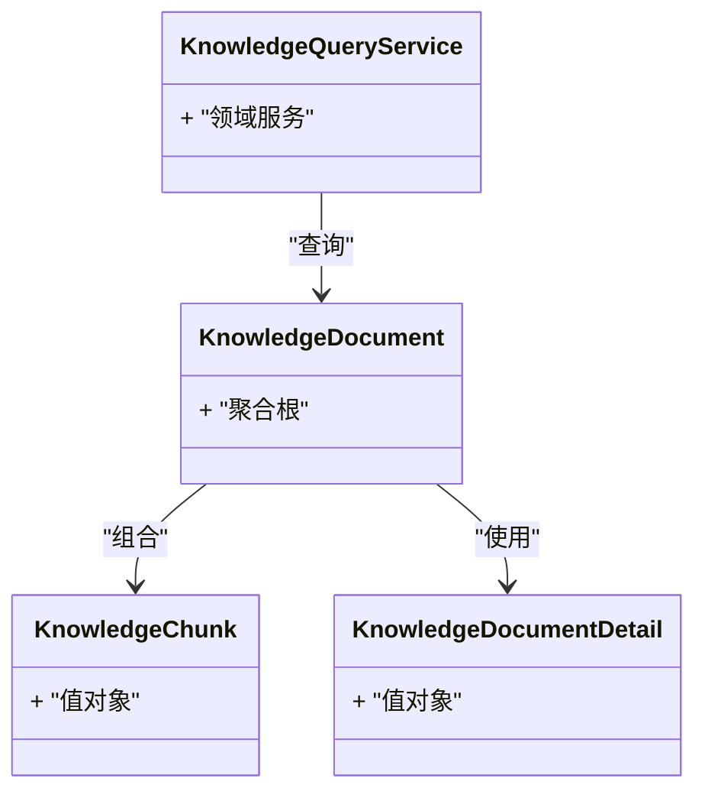
```mermaid
classDiagram
class KnowledgeDocument {
+ "聚合根"
}
class KnowledgeChunk {
+ "值对象"
}
class KnowledgeDocumentDetail {
+ "值对象"
}
class KnowledgeQueryService {
+ "领域服务"
}
KnowledgeDocument --> KnowledgeChunk : "组合"
KnowledgeDocument --> KnowledgeDocumentDetail : "使用"
KnowledgeQueryService --> KnowledgeDocument : "查询"
```

**图表来源**
- [KnowledgeDocumentDetail.java:204-243](file://seahorse-agent-ports/outbound/knowledge/KnowledgeDocumentDetail.java#L204-L243)
- [Kernel 核心.md:28-61](file://docs/zh/content/后端系统/核心内核/核心内核.md#L28-L61)

**章节来源**
- [KnowledgeDocumentDetail.java:204-243](file://seahorse-agent-ports/outbound/knowledge/KnowledgeDocumentDetail.java#L204-L243)
- [Kernel 核心.md:28-61](file://docs/zh/content/后端系统/核心内核/核心内核.md#L28-L61)

### Memory 记忆模型
- 聚合根：MemoryEntity（记忆实体）、MemoryItem（记忆项）
- 值对象：MemoryContext（记忆上下文）、MemoryAlias（实体别名）
- 领域服务：记忆聚合、别名管理与生命周期
- 关系与约束：
  - 组合关系：实体聚合包含别名与记忆项
  - 依赖关系：依赖缓存与存储端口
  - 不变性：别名状态与实体 ID 在生命周期内受控

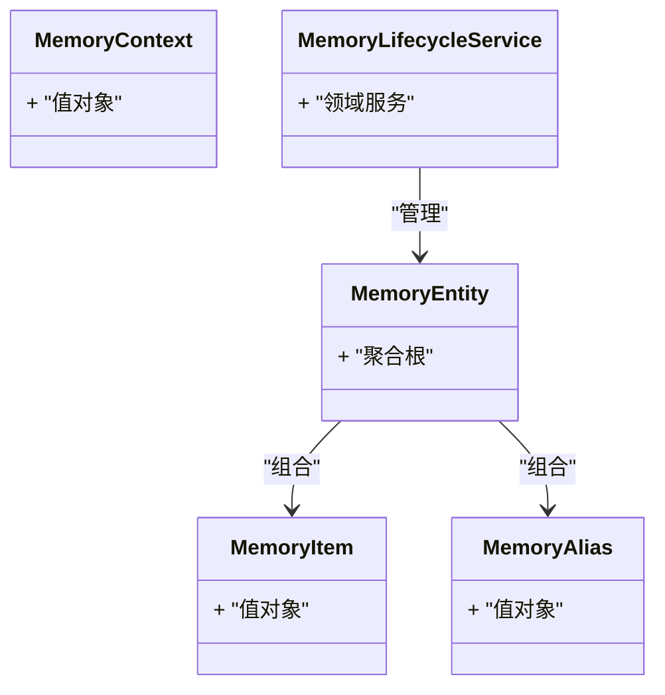
```mermaid
classDiagram
class MemoryEntity {
+ "聚合根"
}
class MemoryItem {
+ "值对象"
}
class MemoryContext {
+ "值对象"
}
class MemoryAlias {
+ "值对象"
}
class MemoryLifecycleService {
+ "领域服务"
}
MemoryEntity --> MemoryItem : "组合"
MemoryEntity --> MemoryAlias : "组合"
MemoryLifecycleService --> MemoryEntity : "管理"
```

**图表来源**
- [MemoryContext.java:1-42](file://seahorse-agent-kernel/src/main/java/com/miracle/ai/seahorse/agent/kernel/domain/memory/MemoryContext.java#L1-L42)
- [Kernel 核心.md:28-61](file://docs/zh/content/后端系统/核心内核/核心内核.md#L28-L61)

**章节来源**
- [MemoryContext.java:1-42](file://seahorse-agent-kernel/src/main/java/com/miracle/ai/seahorse/agent/kernel/domain/memory/MemoryContext.java#L1-L42)
- [Kernel 核心.md:28-61](file://docs/zh/content/后端系统/核心内核/核心内核.md#L28-L61)

### Metadata 元数据模型
- 聚合根：MetadataSchema（元数据模式）、MetadataDictionary（元数据字典）
- 值对象：MetadataExtractionResult（提取结果）、MetadataReview（审查）
- 领域服务：模式管理、字典治理与质量审查
- 关系与约束：
  - 组合关系：模式聚合包含字段与字典
  - 依赖关系：依赖搜索与存储端口
  - 不变性：模式版本与字典键在生命周期内受控

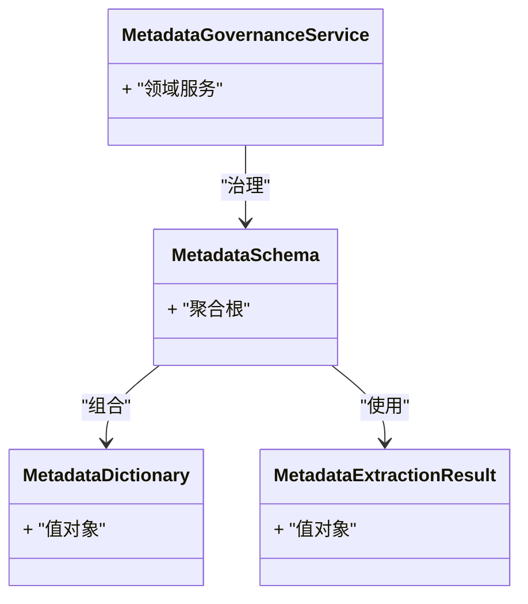
```mermaid
classDiagram
class MetadataSchema {
+ "聚合根"
}
class MetadataDictionary {
+ "值对象"
}
class MetadataExtractionResult {
+ "值对象"
}
class MetadataGovernanceService {
+ "领域服务"
}
MetadataSchema --> MetadataDictionary : "组合"
MetadataSchema --> MetadataExtractionResult : "使用"
MetadataGovernanceService --> MetadataSchema : "治理"
```

**图表来源**
- [Kernel 核心.md:28-61](file://docs/zh/content/后端系统/核心内核/核心内核.md#L28-L61)

**章节来源**
- [Kernel 核心.md:28-61](file://docs/zh/content/后端系统/核心内核/核心内核.md#L28-L61)

### Retrieval 检索模型
- 聚合根：RetrievalContext（检索上下文）、RetrievedChunk（召回片段）
- 值对象：Query（查询）、RerankScore（重排序分数）
- 领域服务：检索与重排序
- 关系与约束：
  - 组合关系：上下文聚合包含召回片段
  - 依赖关系：依赖向量与关键字搜索端口
  - 不变性：查询与上下文在检索生命周期内稳定

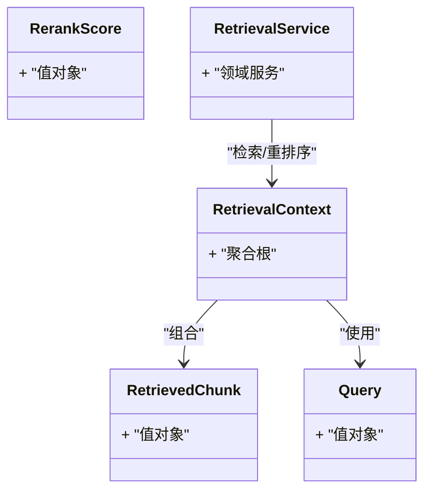
```mermaid
classDiagram
class RetrievalContext {
+ "聚合根"
}
class RetrievedChunk {
+ "值对象"
}
class Query {
+ "值对象"
}
class RerankScore {
+ "值对象"
}
class RetrievalService {
+ "领域服务"
}
RetrievalContext --> RetrievedChunk : "组合"
RetrievalContext --> Query : "使用"
RetrievalService --> RetrievalContext : "检索/重排序"
```

**图表来源**
- [RetrievalContext.java:1-51](file://seahorse-agent-kernel/src/main/java/com/miracle/ai/seahorse/agent/kernel/domain/retrieval/RetrievalContext.java#L1-L51)
- [Kernel 核心.md:28-61](file://docs/zh/content/后端系统/核心内核/核心内核.md#L28-L61)

**章节来源**
- [RetrievalContext.java:1-51](file://seahorse-agent-kernel/src/main/java/com/miracle/ai/seahorse/agent/kernel/domain/retrieval/RetrievalContext.java#L1-L51)
- [Kernel 核心.md:28-61](file://docs/zh/content/后端系统/核心内核/核心内核.md#L28-L61)

### Billing 计费模型
- 聚合根：Subscription（订阅）、PaymentOrder（支付订单）、Bill（账单）
- 值对象：SubscriptionPlan（订阅计划）、PlanCode（套餐代码）、BillLineItem（账单项）
- 领域服务：KernelSubscriptionService（订阅服务）、KernelPaymentService（支付服务）、KernelBillingService（账单服务）
- 关系与约束：
  - 组合关系：订阅包含套餐限制，支付订单包含状态机转换，账单包含明细项
  - 依赖关系：依赖配额管理、使用统计、支付网关等端口
  - 不变性：状态机转换严格受控，金额使用分精度避免浮点误差

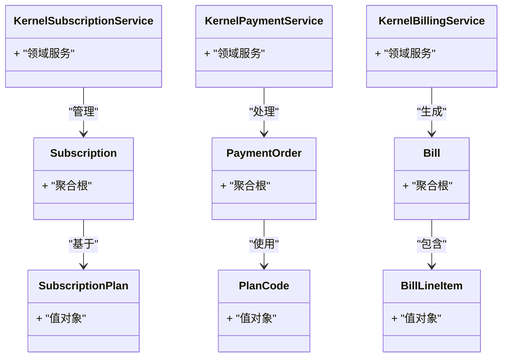
```mermaid
classDiagram
class Subscription {
+ "聚合根"
}
class PaymentOrder {
+ "聚合根"
}
class Bill {
+ "聚合根"
}
class SubscriptionPlan {
+ "值对象"
}
class PlanCode {
+ "值对象"
}
class BillLineItem {
+ "值对象"
}
class KernelSubscriptionService {
+ "领域服务"
}
class KernelPaymentService {
+ "领域服务"
}
class KernelBillingService {
+ "领域服务"
}
Subscription --> SubscriptionPlan : "基于"
PaymentOrder --> PlanCode : "使用"
Bill --> BillLineItem : "包含"
KernelSubscriptionService --> Subscription : "管理"
KernelPaymentService --> PaymentOrder : "处理"
KernelBillingService --> Bill : "生成"
```

**图表来源**
- [Subscription.java:35-48](file://seahorse-agent-kernel/src/main/java/com/miracle/ai/seahorse/agent/kernel/domain/billing/Subscription.java#L35-L48)
- [PaymentOrder.java:40-56](file://seahorse-agent-kernel/src/main/java/com/miracle/ai/seahorse/agent/kernel/domain/billing/PaymentOrder.java#L40-L56)
- [Bill.java:35-47](file://seahorse-agent-kernel/src/main/java/com/miracle/ai/seahorse/agent/kernel/domain/billing/Bill.java#L35-L47)

**章节来源**
- [Subscription.java:1-66](file://seahorse-agent-kernel/src/main/java/com/miracle/ai/seahorse/agent/kernel/domain/billing/Subscription.java#L1-L66)
- [SubscriptionPlan.java:1-47](file://seahorse-agent-kernel/src/main/java/com/miracle/ai/seahorse/agent/kernel/domain/billing/SubscriptionPlan.java#L1-L47)
- [PaymentOrder.java:1-120](file://seahorse-agent-kernel/src/main/java/com/miracle/ai/seahorse/agent/kernel/domain/billing/PaymentOrder.java#L1-L120)
- [Bill.java:1-48](file://seahorse-agent-kernel/src/main/java/com/miracle/ai/seahorse/agent/kernel/domain/billing/Bill.java#L1-L48)

### Auth 用户注册模型
- 聚合根：User（用户）、UserTrial（用户试用）
- 值对象：UserCreateValues（用户创建值对象）、RegistrationResult（注册结果）
- 领域服务：KernelRegistrationService（注册服务）、TokenServicePort（令牌服务）
- 关系与约束：
  - 组合关系：用户包含试用信息，注册服务协调多个端口操作
  - 依赖关系：依赖邮件发送、密码哈希、租户管理等端口
  - 不变性：验证码时效控制，密码安全存储，租户隔离

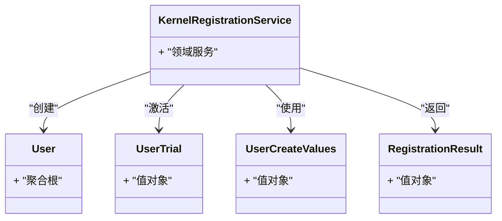
```mermaid
classDiagram
class User {
+ "聚合根"
}
class UserTrial {
+ "值对象"
}
class UserCreateValues {
+ "值对象"
}
class RegistrationResult {
+ "值对象"
}
class KernelRegistrationService {
+ "领域服务"
}
KernelRegistrationService --> User : "创建"
KernelRegistrationService --> UserTrial : "激活"
KernelRegistrationService --> UserCreateValues : "使用"
KernelRegistrationService --> RegistrationResult : "返回"
```

**图表来源**
- [KernelRegistrationService.java:47-83](file://seahorse-agent-kernel/src/main/java/com/miracle/ai/seahorse/agent/kernel/application/auth/KernelRegistrationService.java#L47-L83)

**章节来源**
- [KernelRegistrationService.java:1-184](file://seahorse-agent-kernel/src/main/java/com/miracle/ai/seahorse/agent/kernel/application/auth/KernelRegistrationService.java#L1-L184)

### Security 安全模型
- 聚合根：ResourceAclRule（资源ACL规则）、AccessDecision（访问决策）
- 值对象：AccessSubjectType（访问主体类型）、ResourceAction（资源操作）、AccessDecisionEffect（访问决策效果）
- 领域服务：KernelAccessDecisionQueryService（访问决策查询服务）、KernelResourceAclManagementService（资源ACL管理服务）
- 关系与约束：
  - 组合关系：ACL规则包含作用域、资源类型、操作类型等维度
  - 依赖关系：依赖当前用户、资源ACL仓库、审计日志等端口
  - 不变性：默认拒绝策略，最小权限原则，审计日志完整

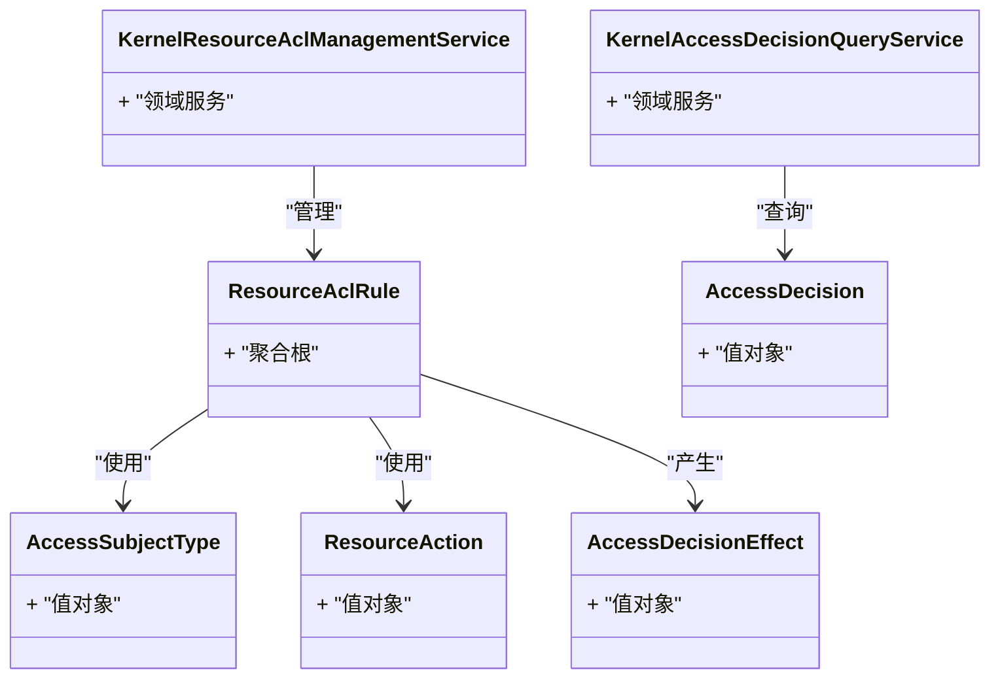
```mermaid
classDiagram
class ResourceAclRule {
+ "聚合根"
}
class AccessDecision {
+ "值对象"
}
class AccessSubjectType {
+ "值对象"
}
class ResourceAction {
+ "值对象"
}
class AccessDecisionEffect {
+ "值对象"
}
class KernelAccessDecisionQueryService {
+ "领域服务"
}
class KernelResourceAclManagementService {
+ "领域服务"
}
ResourceAclRule --> AccessSubjectType : "使用"
ResourceAclRule --> ResourceAction : "使用"
ResourceAclRule --> AccessDecisionEffect : "产生"
KernelAccessDecisionQueryService --> AccessDecision : "查询"
KernelResourceAclManagementService --> ResourceAclRule : "管理"
```

**图表来源**
- [SeahorseAccessDecisionController.java:35-49](file://seahorse-agent-adapter-web/src/main/java/com/miracle/ai/seahorse/agent/adapters/web/SeahorseAccessDecisionController.java#L35-L49)

**章节来源**
- [SeahorseAccessDecisionController.java:1-49](file://seahorse-agent-adapter-web/src/main/java/com/miracle/ai/seahorse/agent/adapters/web/SeahorseAccessDecisionController.java#L1-L49)

### Knowledge Enhancement 知识库增强模型
- 聚合根：KnowledgeBaseVersion（知识库版本）、KnowledgeBasePermission（知识库权限）、KnowledgeBaseShare（知识库分享）
- 值对象：KnowledgeBaseSnapshot（知识库快照）、PermissionLevel（权限级别）、ShareSettings（分享设置）
- 领域服务：KernelKnowledgeBaseVersionService（知识库版本服务）、KnowledgeBasePermissionService（权限管理服务）、KnowledgeBaseShareService（分享服务）
- 关系与约束：
  - 组合关系：版本聚合包含快照信息，权限聚合包含用户权限，分享聚合包含访问日志
  - 依赖关系：依赖知识库仓库、权限仓库、分享仓库等端口
  - 不变性：版本号递增，权限级别受控，分享令牌唯一

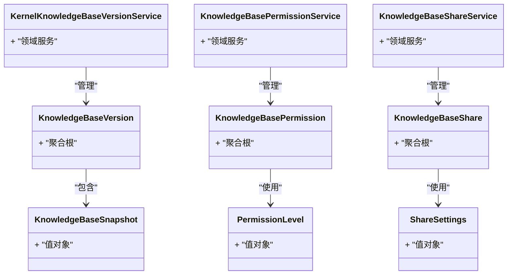
```mermaid
classDiagram
class KnowledgeBaseVersion {
+ "聚合根"
}
class KnowledgeBasePermission {
+ "聚合根"
}
class KnowledgeBaseShare {
+ "聚合根"
}
class KnowledgeBaseSnapshot {
+ "值对象"
}
class PermissionLevel {
+ "值对象"
}
class ShareSettings {
+ "值对象"
}
class KernelKnowledgeBaseVersionService {
+ "领域服务"
}
class KnowledgeBasePermissionService {
+ "领域服务"
}
class KnowledgeBaseShareService {
+ "领域服务"
}
KnowledgeBaseVersion --> KnowledgeBaseSnapshot : "包含"
KnowledgeBasePermission --> PermissionLevel : "使用"
KnowledgeBaseShare --> ShareSettings : "使用"
KernelKnowledgeBaseVersionService --> KnowledgeBaseVersion : "管理"
KnowledgeBasePermissionService --> KnowledgeBasePermission : "管理"
KnowledgeBaseShareService --> KnowledgeBaseShare : "管理"
```

**图表来源**
- [V8__knowledge_base_enhancement.sql:1-68](file://resources/database/migrations/V8__knowledge_base_enhancement.sql#L1-L68)

**章节来源**
- [V8__knowledge_base_enhancement.sql:1-68](file://resources/database/migrations/V8__knowledge_base_enhancement.sql#L1-L68)

### Agent Marketplace 代理市场模型
- 聚合根：AgentPublishReview（代理发布审核）、AgentSubscription（代理订阅）、AgentRating（代理评分）
- 值对象：ReviewStatus（审核状态）、SubscriptionStatus（订阅状态）、RatingScore（评分分数）
- 领域服务：KernelAgentMarketplaceService（代理市场服务）、KernelAgentSubscriptionService（代理订阅服务）、KernelAgentRatingService（代理评分服务）
- 关系与约束：
  - 组合关系：审核包含状态流转，订阅包含用户关联，评分包含统计信息
  - 依赖关系：依赖代理定义仓库、订阅仓库、评分仓库等端口
  - 不变性：审核状态机受控，订阅状态同步，评分去重计算

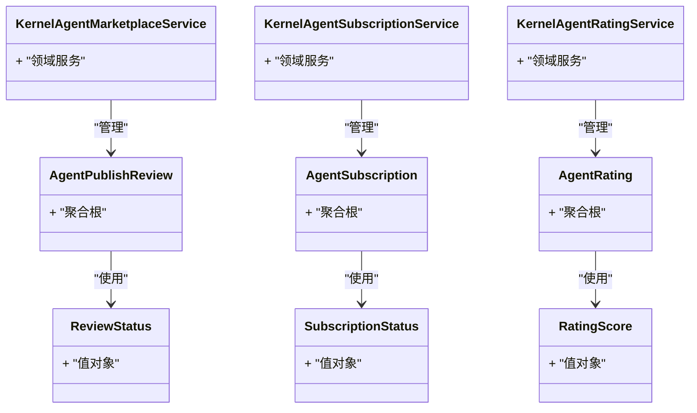
```mermaid
classDiagram
class AgentPublishReview {
+ "聚合根"
}
class AgentSubscription {
+ "聚合根"
}
class AgentRating {
+ "聚合根"
}
class ReviewStatus {
+ "值对象"
}
class SubscriptionStatus {
+ "值对象"
}
class RatingScore {
+ "值对象"
}
class KernelAgentMarketplaceService {
+ "领域服务"
}
class KernelAgentSubscriptionService {
+ "领域服务"
}
class KernelAgentRatingService {
+ "领域服务"
}
AgentPublishReview --> ReviewStatus : "使用"
AgentSubscription --> SubscriptionStatus : "使用"
AgentRating --> RatingScore : "使用"
KernelAgentMarketplaceService --> AgentPublishReview : "管理"
KernelAgentSubscriptionService --> AgentSubscription : "管理"
KernelAgentRatingService --> AgentRating : "管理"
```

**图表来源**
- [V9__agent_marketplace.sql:1-100](file://resources/database/migrations/V9__agent_marketplace.sql#L1-L100)

**章节来源**
- [V9__agent_marketplace.sql:1-100](file://resources/database/migrations/V9__agent_marketplace.sql#L1-L100)

### Audit Log 审计日志模型
- 聚合根：AuditEvent（审计事件）、AccessLog（访问日志）、OperationLog（操作日志）
- 值对象：AuditEventType（审计事件类型）、AccessResult（访问结果）、LogLevel（日志级别）
- 领域服务：KernelAuditEventRepository（审计事件仓库）、AuditLogService（审计日志服务）
- 关系与约束：
  - 组合关系：审计事件包含事件类型与结果，访问日志包含用户信息，操作日志包含详细信息
  - 依赖关系：依赖审计仓库、日志存储等端口
  - 不变性：事件时间戳精确，日志完整性，审计不可抵赖

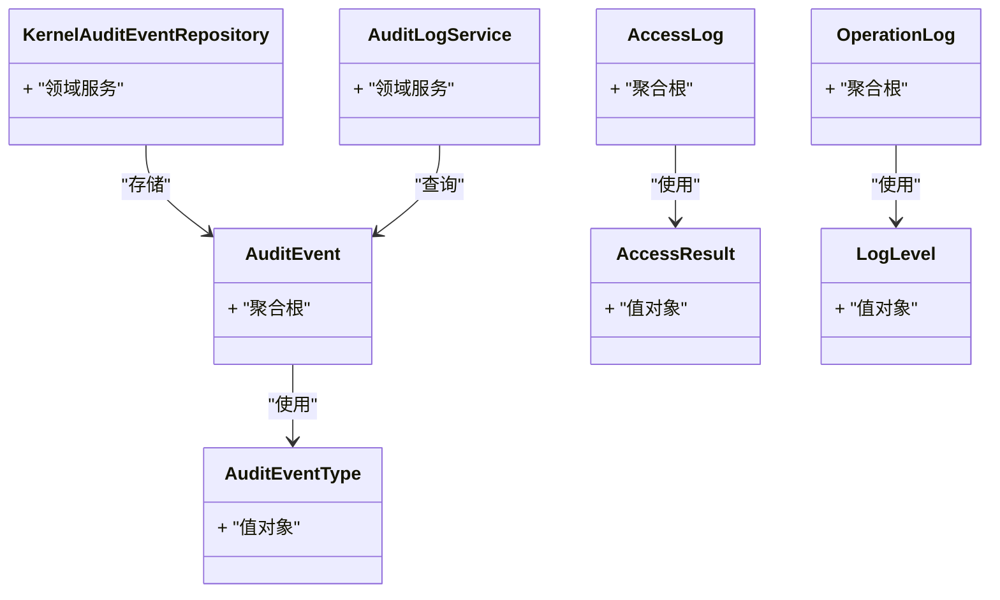
```mermaid
classDiagram
class AuditEvent {
+ "聚合根"
}
class AccessLog {
+ "聚合根"
}
class OperationLog {
+ "聚合根"
}
class AuditEventType {
+ "值对象"
}
class AccessResult {
+ "值对象"
}
class LogLevel {
+ "值对象"
}
class KernelAuditEventRepository {
+ "领域服务"
}
class AuditLogService {
+ "领域服务"
}
AuditEvent --> AuditEventType : "使用"
AccessLog --> AccessResult : "使用"
OperationLog --> LogLevel : "使用"
KernelAuditEventRepository --> AuditEvent : "存储"
AuditLogService --> AuditEvent : "查询"
```

**图表来源**
- [V10__audit_log_and_admin.sql:1-150](file://resources/database/migrations/V10__audit_log_and_admin.sql#L1-L150)

**章节来源**
- [V10__audit_log_and_admin.sql:1-150](file://resources/database/migrations/V10__audit_log_and_admin.sql#L1-L150)

### Execution Steps 执行步骤模型
- 聚合根：ExecutionStep（执行步骤）、WorkflowExecution（工作流执行）
- 值对象：StepStatus（步骤状态）、StepResult（步骤结果）、ExecutionMetrics（执行指标）
- 领域服务：ExecutionStepService（执行步骤服务）、WorkflowExecutionService（工作流执行服务）
- 关系与约束：
  - 组合关系：执行步骤包含状态与结果，工作流执行包含步骤序列
  - 依赖关系：依赖执行仓库、指标收集等端口
  - 不变性：步骤状态机受控，执行指标准确，错误可追溯

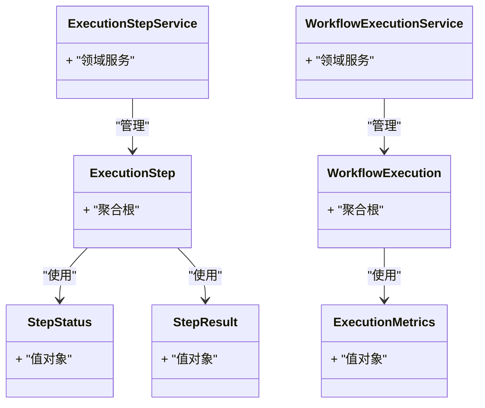
```mermaid
classDiagram
class ExecutionStep {
+ "聚合根"
}
class WorkflowExecution {
+ "聚合根"
}
class StepStatus {
+ "值对象"
}
class StepResult {
+ "值对象"
}
class ExecutionMetrics {
+ "值对象"
}
class ExecutionStepService {
+ "领域服务"
}
class WorkflowExecutionService {
+ "领域服务"
}
ExecutionStep --> StepStatus : "使用"
ExecutionStep --> StepResult : "使用"
WorkflowExecution --> ExecutionMetrics : "使用"
ExecutionStepService --> ExecutionStep : "管理"
WorkflowExecutionService --> WorkflowExecution : "管理"
```

**图表来源**
- [V7__execution_steps.sql:1-80](file://resources/database/migrations/V7__execution_steps.sql#L1-L80)

**章节来源**
- [V7__execution_steps.sql:1-80](file://resources/database/migrations/V7__execution_steps.sql#L1-L80)

### 业务流程序列图：聊天到检索
该序列图展示从聊天请求到检索上下文生成的关键交互，体现领域模型在流程中的协作与不变性保障。

```mermaid
sequenceDiagram
participant Client as "客户端"
participant Agent as "Agent 代理模型"
participant Chat as "ChatRequest 聊天请求"
participant Model as "OpenAiCompatibleModelAdapter"
participant Ret as "RetrievalContext 检索上下文"
Client->>Agent : "提交聊天请求"
Agent->>Chat : "构建聊天请求"
Agent->>Model : "调用模型推理"
Model->>Chat : "消费聊天请求"
Model->>Ret as "生成检索上下文"
Agent-->>Client : "返回响应/检索结果"
```

**图表来源**
- [ChatRequest.java:1-67](file://seahorse-agent-kernel/src/main/java/com/miracle/ai/seahorse/agent/kernel/domain/chat/ChatRequest.java#L1-L67)
- [OpenAiCompatibleModelAdapter.java:139-143](file://seahorse-agent-adapter-ai-openai-compatible/src/main/java/com/miracle/ai/seahorse/agent/adapters/ai/openai/OpenAiCompatibleModelAdapter.java#L139-L143)
- [RetrievalContext.java:1-51](file://seahorse-agent-kernel/src/main/java/com/miracle/ai/seahorse/agent/kernel/domain/retrieval/RetrievalContext.java#L1-L51)

### 业务流程序列图：用户注册流程
该序列图展示完整的用户注册流程，包括验证码发送、用户创建、租户 provision、免费试用激活和登录令牌生成。

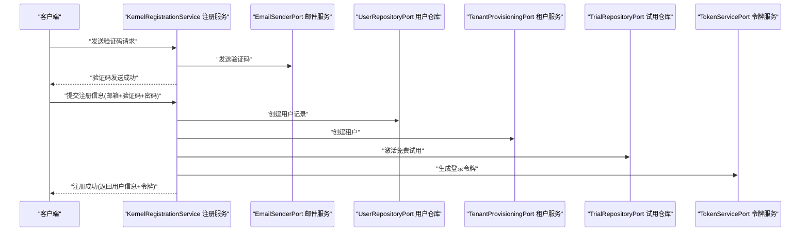
```mermaid
sequenceDiagram
participant Client as "客户端"
participant RegService as "KernelRegistrationService 注册服务"
participant Email as "EmailSenderPort 邮件服务"
participant UserRepo as "UserRepositoryPort 用户仓库"
participant TenantProv as "TenantProvisioningPort 租户服务"
participant TrialRepo as "TrialRepositoryPort 试用仓库"
participant TokenSvc as "TokenServicePort 令牌服务"
Client->>RegService : "发送验证码请求"
RegService->>Email : "发送验证码"
RegService-->>Client : "验证码发送成功"
Client->>RegService : "提交注册信息(邮箱+验证码+密码)"
RegService->>UserRepo : "创建用户记录"
RegService->>TenantProv : "创建租户"
RegService->>TrialRepo : "激活免费试用"
RegService->>TokenSvc : "生成登录令牌"
RegService-->>Client : "注册成功(返回用户信息+令牌)"
```

**图表来源**
- [KernelRegistrationService.java:85-136](file://seahorse-agent-kernel/src/main/java/com/miracle/ai/seahorse/agent/kernel/application/auth/KernelRegistrationService.java#L85-L136)

### 业务流程序列图：支付流程
该序列图展示订阅购买的完整支付流程，包括订单创建、支付处理、回调验证和订阅激活。

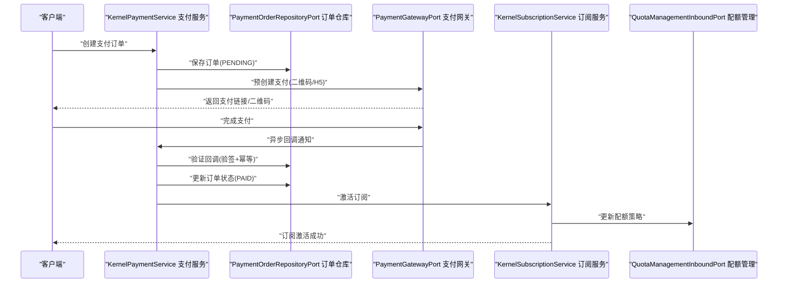
```mermaid
sequenceDiagram
participant Client as "客户端"
participant PaymentSvc as "KernelPaymentService 支付服务"
participant OrderRepo as "PaymentOrderRepositoryPort 订单仓库"
participant Gateway as "PaymentGatewayPort 支付网关"
participant SubSvc as "KernelSubscriptionService 订阅服务"
participant QuotaMgr as "QuotaManagementInboundPort 配额管理"
Client->>PaymentSvc : "创建支付订单"
PaymentSvc->>OrderRepo : "保存订单(PENDING)"
PaymentSvc->>Gateway : "预创建支付(二维码/H5)"
Gateway-->>Client : "返回支付链接/二维码"
Client->>Gateway : "完成支付"
Gateway->>PaymentSvc : "异步回调通知"
PaymentSvc->>OrderRepo : "验证回调(验签+幂等)"
PaymentSvc->>OrderRepo : "更新订单状态(PAID)"
PaymentSvc->>SubSvc : "激活订阅"
SubSvc->>QuotaMgr : "更新配额策略"
SubSvc-->>Client : "订阅激活成功"
```

**图表来源**
- [04-billing.md:244-249](file://docs/aegis/plans/saas-mvp-impl/04-billing.md#L244-L249)

### 业务流程序列图：知识库版本管理流程
该序列图展示知识库版本管理的完整流程，包括快照创建、版本对比和回滚操作。

```mermaid
sequenceDiagram
participant Admin as "管理员"
participant VersionSvc as "KernelKnowledgeBaseVersionService 版本服务"
participant VersionRepo as "KnowledgeBaseVersionRepositoryPort 版本仓库"
participant Snapshot as "KnowledgeBaseSnapshot 快照"
Admin->>VersionSvc : "创建快照请求"
VersionSvc->>VersionRepo : "保存快照(SNAPSHOT_CREATING)"
VersionSvc->>Snapshot : "生成快照数据"
VersionSvc->>VersionRepo : "更新快照状态(SNAPSHOT_CREATED)"
VersionSvc-->>Admin : "快照创建成功"
Admin->>VersionSvc : "版本对比请求"
VersionSvc->>VersionRepo : "获取版本差异"
VersionSvc-->>Admin : "返回版本对比结果"
Admin->>VersionSvc : "回滚到指定版本"
VersionSvc->>VersionRepo : "执行回滚操作"
VersionSvc-->>Admin : "回滚完成"
```

**图表来源**
- [06-knowledge-base-enhancement.md:621-680](file://docs/aegis/plans/saas-mvp-impl/06-knowledge-base-enhancement.md#L621-L680)

### 业务流程序列图：代理发布审核流程
该序列图展示代理发布审核的完整流程，包括申请提交、审核处理和状态更新。

```mermaid
sequenceDiagram
participant User as "用户"
participant MarketSvc as "KernelAgentMarketplaceService 市场服务"
participant ReviewRepo as "AgentPublishReviewRepository 审核仓库"
participant Review as "AgentPublishReview 审核"
participant Admin as "管理员"
User->>MarketSvc : "提交发布申请"
MarketSvc->>ReviewRepo : "创建审核记录(PENDING_REVIEW)"
MarketSvc->>Review : "初始化审核信息"
MarketSvc-->>User : "申请提交成功"
Admin->>MarketSvc : "审核处理请求"
MarketSvc->>ReviewRepo : "更新审核状态(APPROVED/REJECTED)"
MarketSvc-->>Admin : "审核处理完成"
MarketSvc-->>User : "审核结果通知"
```

**图表来源**
- [07-agent-marketplace.md:596-651](file://docs/aegis/plans/saas-mvp-impl/07-agent-marketplace.md#L596-L651)

## 依赖分析
- 内聚性：每个子域的实体与值对象围绕单一职责边界组织，降低跨域耦合
- 耦合性：应用服务通过端口接口与外部系统解耦；领域模型内部通过组合与依赖表达业务关系
- 外部依赖：向量存储、关键字搜索、对象存储、消息队列、支付网关、邮件服务等通过适配器注入
- 循环依赖：通过端口接口与分层结构避免直接循环依赖

```mermaid
graph TB
DOM["领域模型(domain)"] --> APP["应用服务(application)"]
APP --> POR["端口接口(ports)"]
POR --> EXT["外部系统(适配器)"]
```

**图表来源**
- [Kernel 核心.md:28-61](file://docs/zh/content/后端系统/核心内核/核心内核.md#L28-L61)

**章节来源**
- [Kernel 核心.md:28-61](file://docs/zh/content/后端系统/核心内核/核心内核.md#L28-L61)

## 性能考虑
- 上下文压缩：通过 MemoryContext 与检索上下文的组合，减少无效信息传输
- 异步编排：摄取与检索通过消息队列与流式回调提升吞吐
- 缓存策略：利用本地/Redis 缓存与分布式锁优化热点访问
- 搜索优化：结合关键字与向量检索，配合重排序策略提升命中质量
- **计费优化**：使用分精度金额避免浮点误差，批量生成账单减少数据库压力
- **安全优化**：默认拒绝策略减少不必要的权限检查开销
- **注册优化**：验证码内存缓存减少数据库查询，异步邮件发送提升用户体验
- **知识库增强优化**：版本快照增量存储，权限缓存预热，分享令牌短时有效
- **代理市场优化**：审核状态机异步处理，评分缓存定期更新，热度计算批处理
- **审计日志优化**：异步写入队列，日志轮转策略，审计事件压缩存储
- **执行步骤优化**：步骤状态持久化，执行指标采样，错误重试指数退避

## 故障排查指南
- 记忆别名状态异常：检查别名状态与实体生命周期是否一致，参考测试用例对状态变更的验证
- 摄取任务卡滞：核对 IngestionContext 与任务状态机推进逻辑
- 检索结果偏差：校验检索上下文与重排序策略的一致性
- **支付订单状态异常**：检查支付回调验签逻辑、幂等性处理和状态机转换条件
- **用户注册失败**：验证验证码有效期、用户名唯一性检查和租户 provision 成功性
- **访问控制异常**：检查 ACL 规则优先级、作用域匹配和审计日志完整性
- **知识库版本回滚失败**：检查快照完整性、版本依赖关系和数据一致性
- **代理发布审核超时**：验证审核状态机、管理员权限和通知机制
- **审计日志丢失**：检查异步写入队列、磁盘空间和日志轮转配置
- **执行步骤中断**：核对步骤状态持久化、重试机制和错误处理策略

**章节来源**
- [JdbcMemoryAliasRepositoryAdapterTests.java:137-158](file://seahorse-agent-adapter-repository-jdbc/src/test/java/com/miracle/ai/seahorse/agent/adapters/repository/jdbc/JdbcMemoryAliasRepositoryAdapterTests.java#L137-L158)
- [JdbcResourceAclRepositoryAdapterTests.java:176-211](file://seahorse-agent-adapter-repository-jdbc/src/test/java/com/miracle/ai/seahorse/agent/adapters/repository/jdbc/JdbcResourceAclRepositoryAdapterTests.java#L176-L211)

## 结论
本文系统梳理了 Kernel 的核心领域模型，明确了各模型的职责边界、属性语义与使用场景，并通过关系图与流程图展示了它们在典型推理流程中的协作方式。**新增的知识库增强、代理市场、审计日志和执行步骤领域模型**进一步完善了系统的商业化能力、安全管控和可观测性保障。这些模型通过严格的不变性约束和清晰的职责分离，为系统的可维护性、可扩展性和合规性提供了坚实基础。

**章节来源**
- [领域模型.md:410-417](file://docs/zh/content/后端系统/核心内核/领域模型/领域模型.md#L410-L417)

## 附录
- 运行时模式：KernelRuntimeMode 提供配置与切换机制，影响领域模型的行为与端口绑定
- 端口契约：inbound/outbound 端口作为与外部交互的契约，确保领域模型与基础设施解耦
- **计费数据库**：V5__billing_tables.sql 定义了订阅计划、支付订单、账单等核心表结构
- **知识库增强数据库**：V8__knowledge_base_enhancement.sql 定义了版本管理、权限控制、分享链接等表结构
- **代理市场数据库**：V9__agent_marketplace.sql 定义了发布审核、订阅管理、评分排行等表结构
- **审计日志数据库**：V10__audit_log_and_admin.sql 定义了审计事件、访问日志、操作日志等表结构
- **执行步骤数据库**：V7__execution_steps.sql 定义了执行步骤、工作流执行等表结构
- **安全配置**：前端安全策略配置，包括 CSP、HSTS 等安全头设置

**章节来源**
- [KernelRuntimeMode.java](file://seahorse-agent-kernel/src/main/java/com/miracle/ai/seahorse/agent/kernel/config/KernelRuntimeMode.java)
- [V5__billing_tables.sql](file://resources/database/migrations/V5__billing_tables.sql)
- [V7__execution_steps.sql](file://resources/database/migrations/V7__execution_steps.sql)
- [V8__knowledge_base_enhancement.sql](file://resources/database/migrations/V8__knowledge_base_enhancement.sql)
- [V9__agent_marketplace.sql](file://resources/database/migrations/V9__agent_marketplace.sql)
- [V10__audit_log_and_admin.sql](file://resources/database/migrations/V10__audit_log_and_admin.sql)
- [安全配置.md](file://docs/zh/content/数据库设计/安全配置.md)