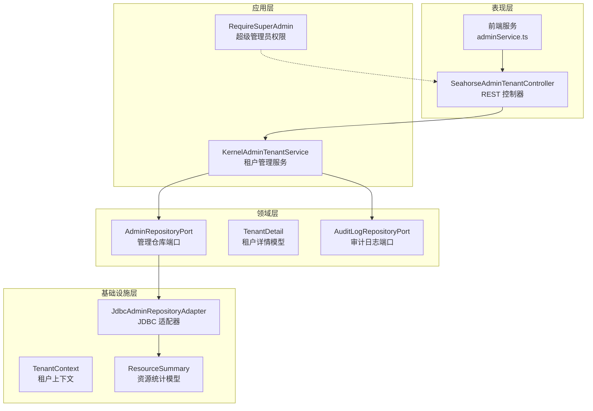
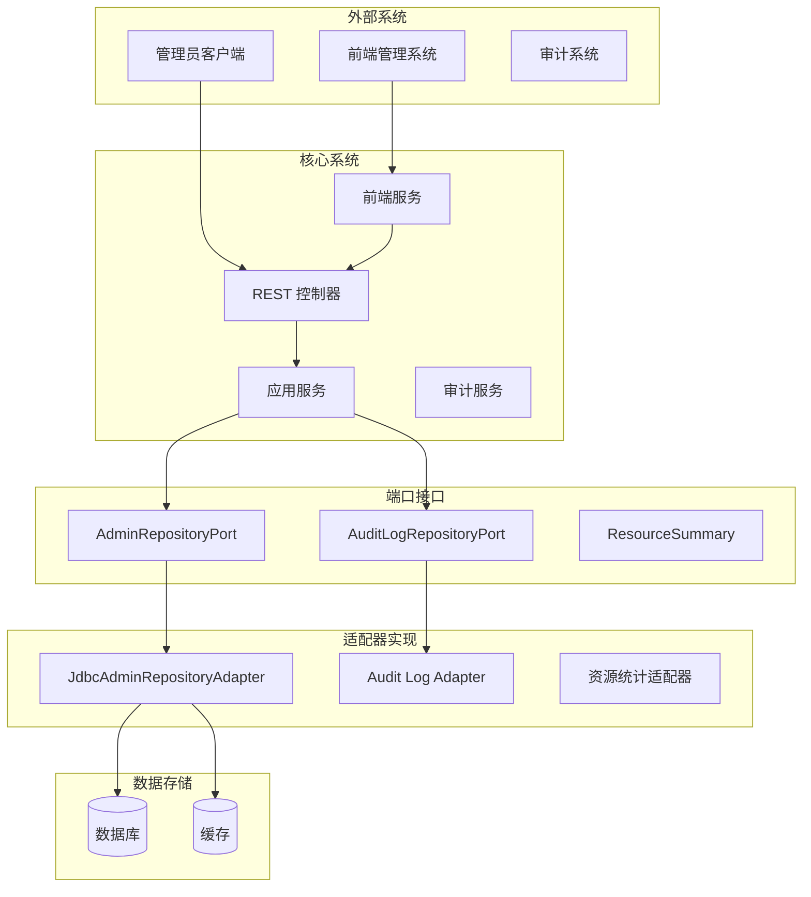
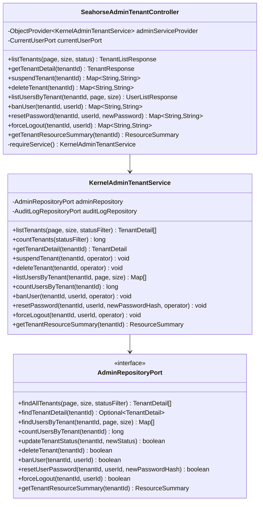
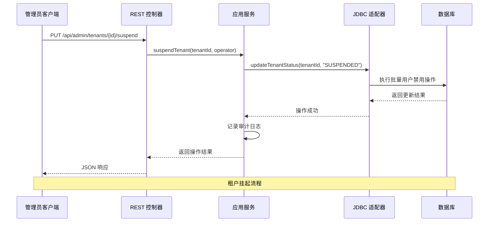
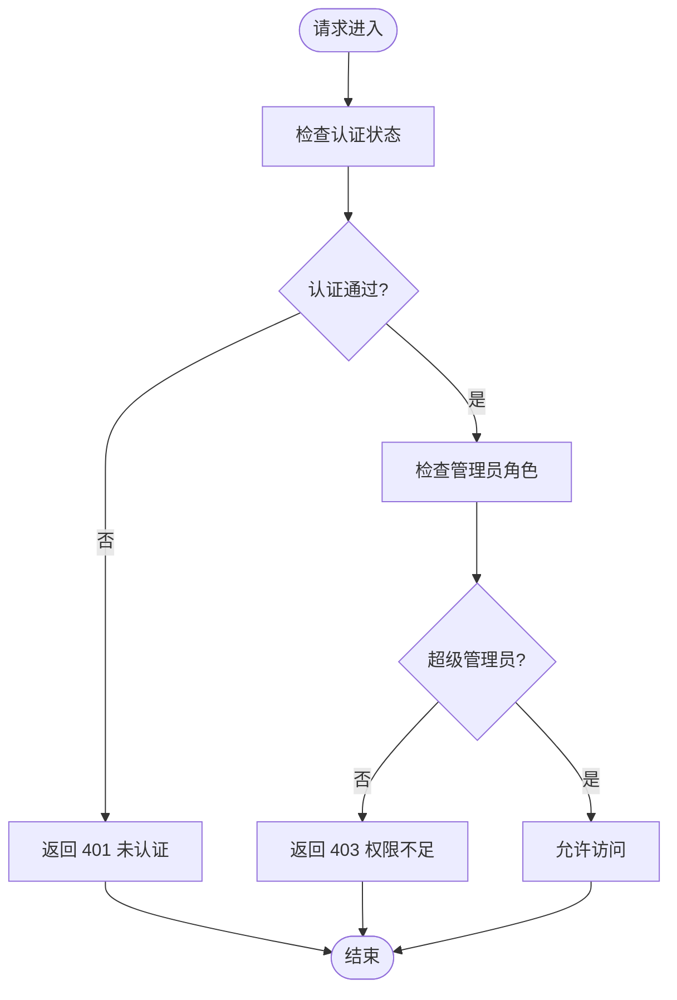
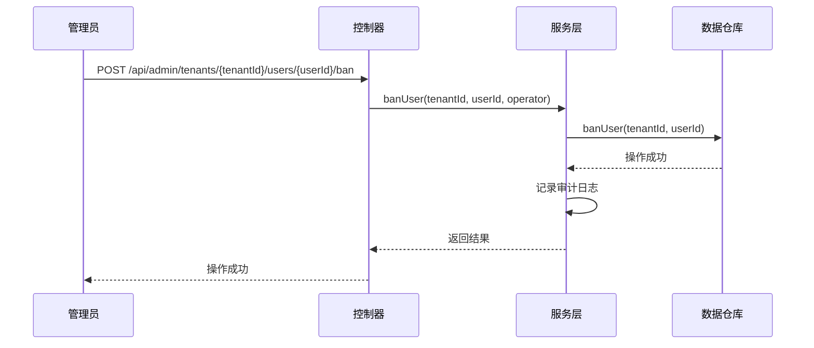
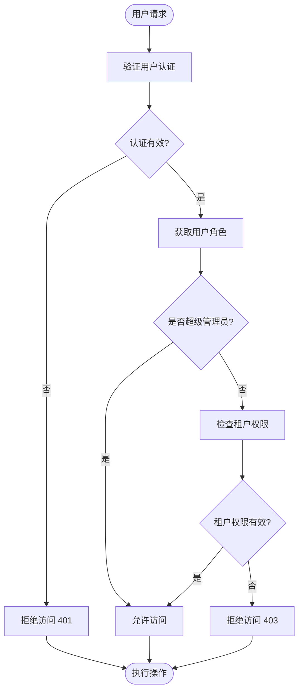
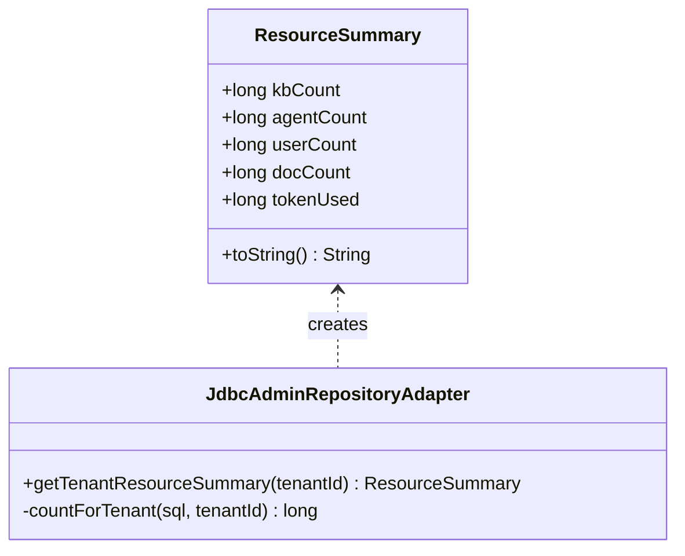
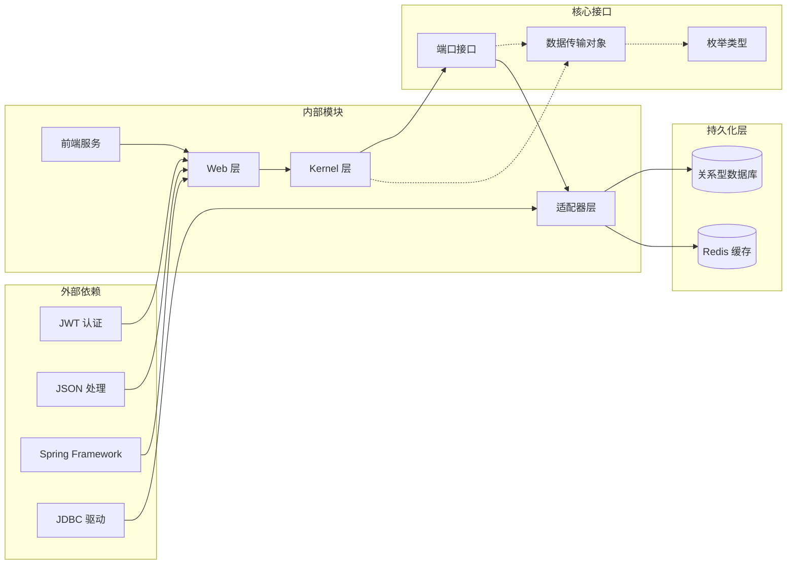
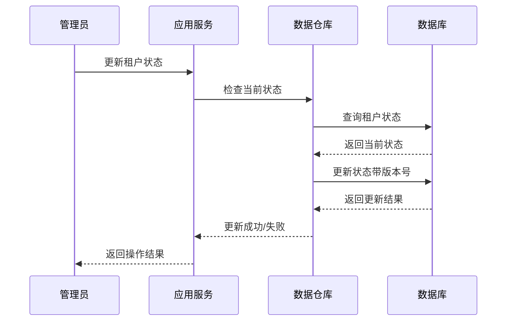

# 管理员租户管理

<cite>
**本文档引用的文件**
- [SeahorseAdminTenantController.java](file://seahorse-agent-adapter-web/src/main/java/com/miracle/ai/seahorse/agent/adapters/web/SeahorseAdminTenantController.java)
- [KernelAdminTenantService.java](file://seahorse-agent-kernel/src/main/java/com/miracle/ai/seahorse/agent/kernel/application/admin/KernelAdminTenantService.java)
- [AdminRepositoryPort.java](file://seahorse-agent-kernel/src/main/java/com/miracle/ai/seahorse/agent/ports/outbound/admin/AdminRepositoryPort.java)
- [JdbcAdminRepositoryAdapter.java](file://seahorse-agent-adapter-repository-jdbc/src/main/java/com/miracle/ai/seahorse/agent/adapters/repository/jdbc/JdbcAdminRepositoryAdapter.java)
- [TenantDetail.java](file://seahorse-agent-kernel/src/main/java/com/miracle/ai/seahorse/agent/ports/outbound/admin/TenantDetail.java)
- [RequireSuperAdmin.java](file://seahorse-agent-kernel/src/main/java/com/miracle/ai/seahorse/agent/kernel/application/admin/RequireSuperAdmin.java)
- [TenantContext.java](file://seahorse-agent-kernel/src/main/java/com/miracle/ai/seahorse/agent/kernel/tenant/TenantContext.java)
- [adminService.ts](file://frontend/src/services/adminService.ts)
</cite>

## 更新摘要
**所做更改**
- 新增了完整的用户管理功能章节，包括用户禁用、密码重置、强制登出等操作
- 增强了租户资源统计功能的描述，新增了资源汇总统计接口
- 完善了权限控制机制的说明，增加了超级管理员权限验证
- 更新了API接口文档，包含了所有新增的管理操作
- 增加了前端服务集成示例，展示了完整的管理功能调用

## 目录
1. [简介](#简介)
2. [项目结构](#项目结构)
3. [核心组件](#核心组件)
4. [架构概览](#架构概览)
5. [详细组件分析](#详细组件分析)
6. [API接口文档](#api接口文档)
7. [用户管理功能](#用户管理功能)
8. [权限控制机制](#权限控制机制)
9. [租户资源统计](#租户资源统计)
10. [依赖关系分析](#依赖关系分析)
11. [性能考虑](#性能考虑)
12. [故障排除指南](#故障排除指南)
13. [结论](#结论)

## 简介

管理员租户管理系统是 Seahorse Agent 企业级 AI 基础设施中的核心管理模块，负责为平台管理员提供全面的租户管理能力。该系统支持多租户架构下的租户生命周期管理、用户管理、状态控制以及资源监控等功能。

系统采用分层架构设计，通过控制器层、应用服务层、端口接口层和适配器层的清晰分离，实现了高内聚、低耦合的系统结构。管理员可以通过 RESTful API 对租户进行创建、查询、更新、删除等操作，同时系统提供了完善的审计日志和安全控制机制。

**更新** 系统现已完善了租户生命周期管理、用户管理、状态控制等功能，并提供了完整的RESTful API接口和权限控制机制。

## 项目结构

管理员租户管理系统的项目结构遵循 Clean Architecture 设计原则，主要分为以下几个层次：

**图表来源**
- [SeahorseAdminTenantController.java:44-143](file://seahorse-agent-adapter-web/src/main/java/com/miracle/ai/seahorse/agent/adapters/web/SeahorseAdminTenantController.java#L44-L143)
- [KernelAdminTenantService.java:33-228](file://seahorse-agent-kernel/src/main/java/com/miracle/ai/seahorse/agent/kernel/application/admin/KernelAdminTenantService.java#L33-L228)

**章节来源**
- [SeahorseAdminTenantController.java:44-143](file://seahorse-agent-adapter-web/src/main/java/com/miracle/ai/seahorse/agent/adapters/web/SeahorseAdminTenantController.java#L44-L143)
- [KernelAdminTenantService.java:33-228](file://seahorse-agent-kernel/src/main/java/com/miracle/ai/seahorse/agent/kernel/application/admin/KernelAdminTenantService.java#L33-L228)

## 核心组件

### REST 控制器层

SeahorseAdminTenantController 是管理员租户管理的入口点，提供完整的 REST API 接口：

- **租户列表查询**：支持分页查询、状态过滤
- **租户详情获取**：获取单个租户的完整信息
- **租户状态管理**：支持挂起和删除操作
- **用户管理**：查询租户下的用户列表和统计
- **用户操作管理**：禁用用户、重置密码、强制登出

### 应用服务层

KernelAdminTenantService 作为核心业务逻辑处理单元，负责：

- 租户数据的业务规则验证
- 多租户场景下的权限控制
- 审计日志的生成和管理
- 用户操作的事务性保证
- 租户资源统计信息的聚合

### 端口接口层

定义了系统对外部世界的抽象接口：

- **AdminRepositoryPort**：管理功能的数据访问接口
- **TenantDetail**：租户信息的数据传输对象
- **ResourceSummary**：租户资源统计的数据传输对象

**更新** 新增了ResourceSummary接口，用于提供租户资源的综合统计信息。

**章节来源**
- [SeahorseAdminTenantController.java:57-100](file://seahorse-agent-adapter-web/src/main/java/com/miracle/ai/seahorse/agent/adapters/web/SeahorseAdminTenantController.java#L57-L100)
- [KernelAdminTenantService.java:30-141](file://seahorse-agent-kernel/src/main/java/com/miracle/ai/seahorse/agent/kernel/application/admin/KernelAdminTenantService.java#L30-L141)

## 架构概览

管理员租户管理系统采用六边形架构（Hexagonal Architecture），通过端口和适配器模式实现关注点分离：

**图表来源**
- [KernelAdminTenantService.java:35-42](file://seahorse-agent-kernel/src/main/java/com/miracle/ai/seahorse/agent/kernel/application/admin/KernelAdminTenantService.java#L35-L42)
- [AdminRepositoryPort.java:27-83](file://seahorse-agent-kernel/src/main/java/com/miracle/ai/seahorse/agent/ports/outbound/admin/AdminRepositoryPort.java#L27-L83)

系统的核心特点包括：

1. **可测试性**：通过端口接口实现，便于单元测试和模拟
2. **可扩展性**：新的存储后端或外部系统可通过适配器实现
3. **可维护性**：关注点分离，职责明确划分
4. **安全性**：内置权限控制和审计机制
5. **完整性**：提供从租户到用户的全链路管理能力

## 详细组件分析

### REST 控制器组件

SeahorseAdminTenantController 提供了完整的租户管理 API：

**图表来源**
- [SeahorseAdminTenantController.java:44-143](file://seahorse-agent-adapter-web/src/main/java/com/miracle/ai/seahorse/agent/adapters/web/SeahorseAdminTenantController.java#L44-L143)
- [KernelAdminTenantService.java:33-228](file://seahorse-agent-kernel/src/main/java/com/miracle/ai/seahorse/agent/kernel/application/admin/KernelAdminTenantService.java#L33-L228)
- [AdminRepositoryPort.java:27-83](file://seahorse-agent-kernel/src/main/java/com/miracle/ai/seahorse/agent/ports/outbound/admin/AdminRepositoryPort.java#L27-L83)

**更新** 新增了用户管理相关的方法，包括banUser、resetPassword、forceLogout等操作。

### 数据访问层组件

JdbcAdminRepositoryAdapter 实现了管理员功能的数据访问：

**图表来源**
- [JdbcAdminRepositoryAdapter.java:172-186](file://seahorse-agent-adapter-repository-jdbc/src/main/java/com/miracle/ai/seahorse/agent/adapters/repository/jdbc/JdbcAdminRepositoryAdapter.java#L172-L186)

**更新** 租户状态管理现在通过批量用户禁用操作实现，模拟租户挂起功能。

**章节来源**
- [SeahorseAdminTenantController.java:75-89](file://seahorse-agent-adapter-web/src/main/java/com/miracle/ai/seahorse/agent/adapters/web/SeahorseAdminTenantController.java#L75-L89)
- [KernelAdminTenantService.java:78-115](file://seahorse-agent-kernel/src/main/java/com/miracle/ai/seahorse/agent/kernel/application/admin/KernelAdminTenantService.java#L78-L115)

### 权限控制组件

RequireSuperAdmin 注解确保只有超级管理员才能执行敏感操作：

**图表来源**
- [RequireSuperAdmin.java:1-100](file://seahorse-agent-kernel/src/main/java/com/miracle/ai/seahorse/agent/kernel/application/admin/RequireSuperAdmin.java#L1-L100)

**章节来源**
- [RequireSuperAdmin.java:1-100](file://seahorse-agent-kernel/src/main/java/com/miracle/ai/seahorse/agent/kernel/application/admin/RequireSuperAdmin.java#L1-L100)

## API接口文档

管理员租户管理系统提供完整的RESTful API接口：

### 租户管理接口

| 方法 | 路径 | 功能 | 权限要求 |
|------|------|------|----------|
| GET | `/api/admin/tenants` | 获取租户列表 | 超级管理员 |
| GET | `/api/admin/tenants/{tenantId}` | 获取租户详情 | 超级管理员 |
| PUT | `/api/admin/tenants/{tenantId}/suspend` | 挂起租户 | 超级管理员 |
| DELETE | `/api/admin/tenants/{tenantId}` | 删除租户 | 超级管理员 |
| GET | `/api/admin/tenants/{tenantId}/users` | 获取租户用户列表 | 超级管理员 |

### 用户管理接口

| 方法 | 路径 | 功能 | 权限要求 |
|------|------|------|----------|
| PUT | `/api/admin/tenants/{tenantId}/users/{userId}/ban` | 禁用用户 | 超级管理员 |
| PUT | `/api/admin/tenants/{tenantId}/users/{userId}/password` | 重置用户密码 | 超级管理员 |
| PUT | `/api/admin/tenants/{tenantId}/users/{userId}/logout` | 强制用户登出 | 超级管理员 |

### 资源统计接口

| 方法 | 路径 | 功能 | 权限要求 |
|------|------|------|----------|
| GET | `/api/admin/tenants/{tenantId}/resource-summary` | 获取租户资源统计 | 超级管理员 |

**更新** 新增了完整的用户管理接口和资源统计接口。

**章节来源**
- [SeahorseAdminTenantController.java:57-100](file://seahorse-agent-adapter-web/src/main/java/com/miracle/ai/seahorse/agent/adapters/web/SeahorseAdminTenantController.java#L57-L100)
- [adminService.ts:41-52](file://frontend/src/services/adminService.ts#L41-L52)

## 用户管理功能

系统提供了完整的用户管理功能，支持对租户内用户的各种操作：

### 用户操作类型

1. **用户禁用（Ban User）**
   - 将用户标记为禁用状态
   - 禁用后用户无法登录系统
   - 支持批量禁用操作

2. **密码重置（Reset Password）**
   - 重置用户登录密码
   - 生成新的密码哈希值
   - 立即生效，原密码失效

3. **强制登出（Force Logout）**
   - 清除用户会话信息
   - 配合JWT令牌过期机制
   - 确保用户立即退出系统

### 用户管理流程

**图表来源**
- [KernelAdminTenantService.java:146-165](file://seahorse-agent-kernel/src/main/java/com/miracle/ai/seahorse/agent/kernel/application/admin/KernelAdminTenantService.java#L146-L165)

**更新** 新增了完整的用户管理功能，包括禁用、密码重置、强制登出等操作。

**章节来源**
- [KernelAdminTenantService.java:146-216](file://seahorse-agent-kernel/src/main/java/com/miracle/ai/seahorse/agent/kernel/application/admin/KernelAdminTenantService.java#L146-L216)
- [JdbcAdminRepositoryAdapter.java:196-213](file://seahorse-agent-adapter-repository-jdbc/src/main/java/com/miracle/ai/seahorse/agent/adapters/repository/jdbc/JdbcAdminRepositoryAdapter.java#L196-L213)

## 权限控制机制

系统采用严格的权限控制机制，确保只有授权用户才能执行管理操作：

### 权限层级

1. **超级管理员（Super Admin）**
   - 拥有最高权限
   - 可以管理所有租户
   - 可以执行所有管理操作
   - 不受租户限制

2. **普通管理员（Admin）**
   - 只能管理指定租户
   - 权限范围受限
   - 不能执行跨租户操作

### 权限验证流程

**图表来源**
- [RequireSuperAdmin.java:1-100](file://seahorse-agent-kernel/src/main/java/com/miracle/ai/seahorse/agent/kernel/application/admin/RequireSuperAdmin.java#L1-L100)

**更新** 增强了权限控制机制，明确了超级管理员和普通管理员的权限差异。

**章节来源**
- [RequireSuperAdmin.java:1-100](file://seahorse-agent-kernel/src/main/java/com/miracle/ai/seahorse/agent/kernel/application/admin/RequireSuperAdmin.java#L1-L100)

## 租户资源统计

系统提供了全面的租户资源统计功能，帮助管理员了解租户的使用情况：

### 统计指标

1. **用户统计**
   - 总用户数
   - 活跃用户数
   - 新增用户趋势

2. **知识库统计**
   - 知识库数量
   - 文档数量
   - 存储使用量

3. **智能体统计**
   - 智能体数量
   - 使用频率
   - 执行次数

4. **用量统计**
   - Token使用量
   - API调用次数
   - 存储空间使用

### 资源统计接口

**图表来源**
- [JdbcAdminRepositoryAdapter.java:162-170](file://seahorse-agent-adapter-repository-jdbc/src/main/java/com/miracle/ai/seahorse/agent/adapters/repository/jdbc/JdbcAdminRepositoryAdapter.java#L162-L170)

**更新** 新增了ResourceSummary接口，提供租户资源的综合统计信息。

**章节来源**
- [JdbcAdminRepositoryAdapter.java:162-170](file://seahorse-agent-adapter-repository-jdbc/src/main/java/com/miracle/ai/seahorse/agent/adapters/repository/jdbc/JdbcAdminRepositoryAdapter.java#L162-L170)
- [KernelAdminTenantService.java:221-226](file://seahorse-agent-kernel/src/main/java/com/miracle/ai/seahorse/agent/kernel/application/admin/KernelAdminTenantService.java#L221-L226)

## 依赖关系分析

管理员租户管理系统的依赖关系体现了清晰的分层架构：

**图表来源**
- [SeahorseAdminTenantController.java:20-38](file://seahorse-agent-adapter-web/src/main/java/com/miracle/ai/seahorse/agent/adapters/web/SeahorseAdminTenantController.java#L20-L38)
- [KernelAdminTenantService.java:35-42](file://seahorse-agent-kernel/src/main/java/com/miracle/ai/seahorse/agent/kernel/application/admin/KernelAdminTenantService.java#L35-L42)

系统的关键依赖特性：

1. **松耦合设计**：通过接口隔离具体实现
2. **单一职责**：每个模块专注于特定领域的功能
3. **可替换性**：适配器模式支持不同技术栈的切换
4. **可测试性**：依赖注入支持单元测试和集成测试
5. **前后端分离**：前端服务独立于后端控制器

**更新** 新增了前端服务集成，展示了完整的管理功能调用方式。

**章节来源**
- [AdminRepositoryPort.java:27-83](file://seahorse-agent-kernel/src/main/java/com/miracle/ai/seahorse/agent/ports/outbound/admin/AdminRepositoryPort.java#L27-L83)
- [adminService.ts:1-52](file://frontend/src/services/adminService.ts#L1-L52)

## 性能考虑

管理员租户管理系统在设计时充分考虑了性能优化：

### 查询优化策略

1. **分页查询**：默认每页 20 条记录，支持自定义大小
2. **索引优化**：对常用查询字段建立数据库索引
3. **缓存策略**：热点数据使用 Redis 缓存
4. **批量操作**：支持批量用户管理和状态更新
5. **延迟加载**：资源统计信息按需加载

### 并发控制

系统采用乐观锁机制防止并发更新冲突：

**图表来源**
- [JdbcAdminRepositoryAdapter.java:172-186](file://seahorse-agent-adapter-repository-jdbc/src/main/java/com/miracle/ai/seahorse/agent/adapters/repository/jdbc/JdbcAdminRepositoryAdapter.java#L172-L186)

### 监控指标

系统内置性能监控和审计日志：

- **响应时间**：记录关键操作的执行时间
- **错误率**：监控 API 调用成功率
- **资源使用**：跟踪数据库连接池使用情况
- **用户行为**：记录管理员操作轨迹
- **系统负载**：监控数据库查询性能

**更新** 增强了监控指标，包括系统负载和资源使用情况的跟踪。

## 故障排除指南

### 常见问题及解决方案

#### 1. 租户查询异常

**症状**：租户列表查询返回空结果或超时

**排查步骤**：
1. 检查数据库连接是否正常
2. 验证分页参数是否合理
3. 确认查询条件是否正确
4. 查看数据库慢查询日志

**解决方案**：
- 优化数据库索引
- 调整分页大小
- 添加适当的 WHERE 条件
- 实施查询缓存

#### 2. 权限访问失败

**症状**：返回 403 权限不足错误

**排查步骤**：
1. 验证管理员令牌有效性
2. 检查用户角色配置
3. 确认租户权限范围
4. 查看审计日志

**解决方案**：
- 重新登录获取有效令牌
- 联系系统管理员提升权限
- 检查用户角色绑定
- 清除浏览器缓存

#### 3. 用户管理操作失败

**症状**：用户禁用、密码重置、强制登出等操作失败

**排查步骤**：
1. 验证用户是否存在且未被删除
2. 检查操作权限是否足够
3. 确认租户ID和用户ID正确
4. 查看数据库事务状态

**解决方案**：
- 确认用户状态正常
- 验证管理员权限
- 检查参数格式
- 查看系统日志

#### 4. 资源统计不准确

**症状**：租户资源统计数字与实际不符

**排查步骤**：
1. 检查统计查询SQL是否正确
2. 验证数据一致性
3. 确认缓存同步机制
4. 查看数据更新延迟

**解决方案**：
- 重新计算统计数据
- 清理缓存数据
- 检查数据同步任务
- 增加数据校验机制

**更新** 新增了用户管理和资源统计相关的故障排除指南。

**章节来源**
- [SeahorseAdminTenantController.java:102-109](file://seahorse-agent-adapter-web/src/main/java/com/miracle/ai/seahorse/agent/adapters/web/SeahorseAdminTenantController.java#L102-L109)
- [KernelAdminTenantService.java:78-115](file://seahorse-agent-kernel/src/main/java/com/miracle/ai/seahorse/agent/kernel/application/admin/KernelAdminTenantService.java#L78-L115)

### 调试工具和技巧

1. **启用详细日志**：设置日志级别为 DEBUG 观察请求处理流程
2. **使用调试断点**：在关键业务逻辑处设置断点
3. **监控指标分析**：通过 Prometheus/Grafana 查看系统指标
4. **数据库查询分析**：使用 EXPLAIN 分析 SQL 执行计划
5. **前端调试**：使用浏览器开发者工具查看API调用
6. **权限测试**：模拟不同角色用户进行权限验证

**更新** 新增了前端调试和权限测试相关的调试技巧。

## 结论

管理员租户管理系统展现了现代企业级应用的设计理念和技术实践。通过清晰的分层架构、完善的权限控制、可扩展的适配器模式以及全面的监控审计机制，系统为多租户环境下的管理员提供了强大而易用的管理工具。

**更新** 系统现已完善了租户生命周期管理、用户管理、状态控制等功能，提供了RESTful API接口和完整的权限控制机制，形成了一个功能完备的企业级管理平台。

系统的主要优势包括：

1. **架构清晰**：六边形架构确保了良好的关注点分离
2. **扩展性强**：端口接口设计支持多种技术栈的灵活替换
3. **安全性高**：内置权限控制和审计日志保障系统安全
4. **性能优异**：通过缓存、索引和异步处理优化系统性能
5. **易于维护**：模块化设计便于功能扩展和问题排查
6. **功能完整**：提供从租户到用户的全链路管理能力
7. **前后端分离**：前端服务独立，便于用户体验优化

未来可以考虑的改进方向：

1. **增强监控能力**：添加更详细的性能指标和告警机制
2. **优化用户体验**：提供更直观的管理界面和操作向导
3. **扩展功能**：支持更多租户管理场景和自动化操作
4. **提升可靠性**：增强系统的容错能力和灾难恢复机制
5. **增强AI能力**：集成智能分析和预测功能
6. **国际化支持**：支持多语言界面和本地化需求

**更新** 系统现已具备企业级应用的完整功能，为未来的扩展和优化奠定了坚实基础。