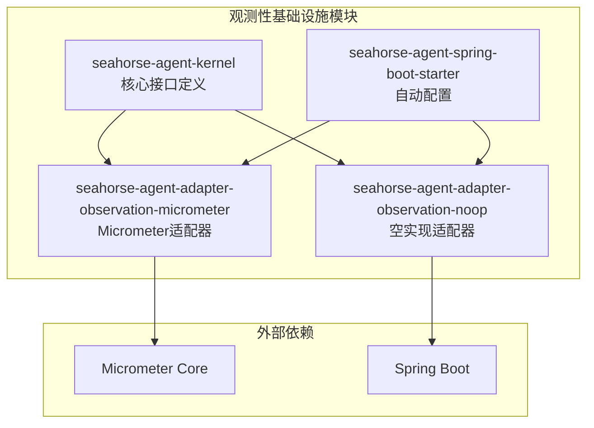
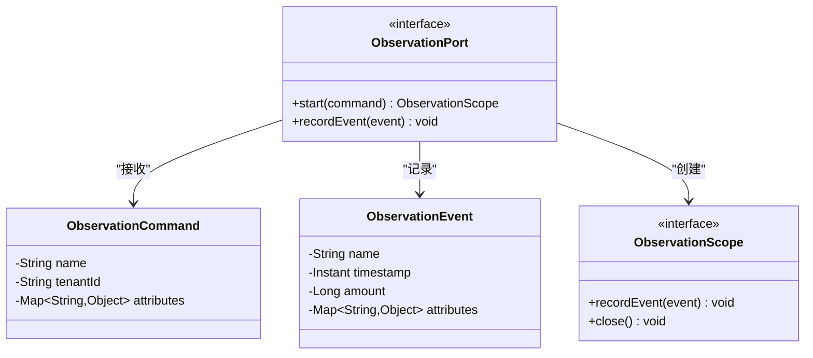
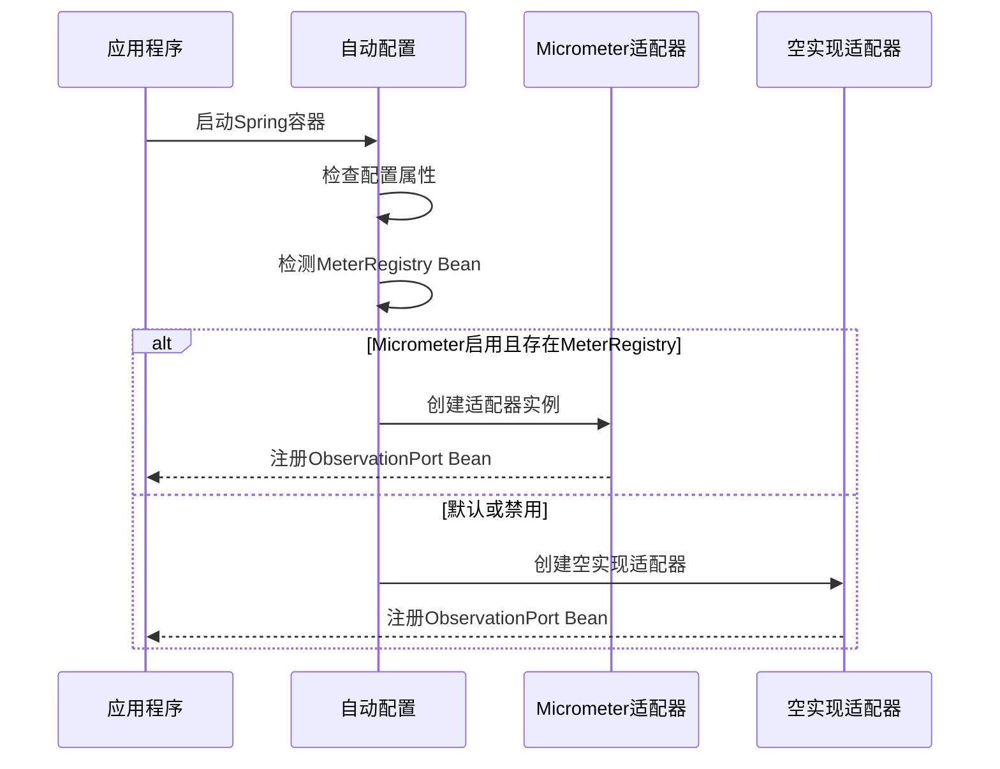
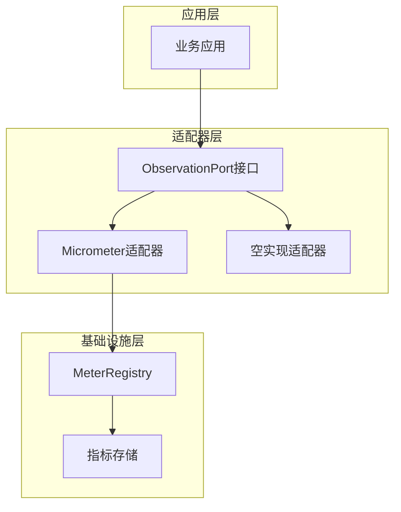
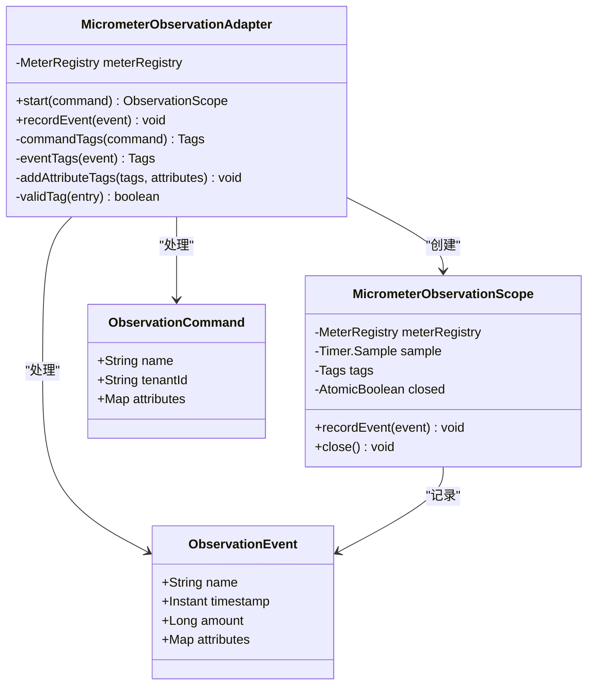
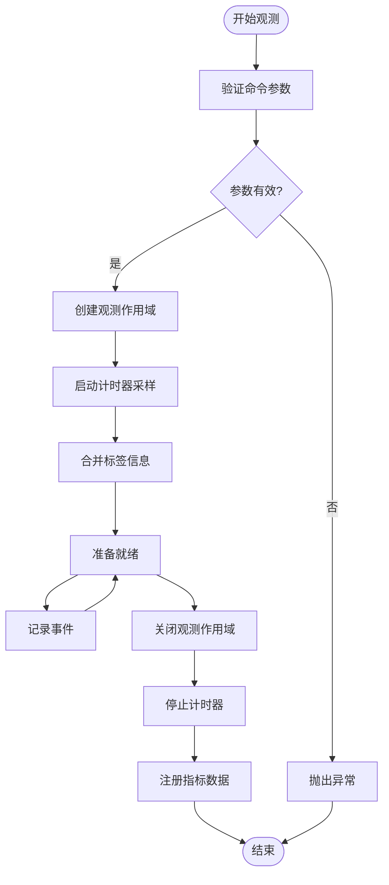
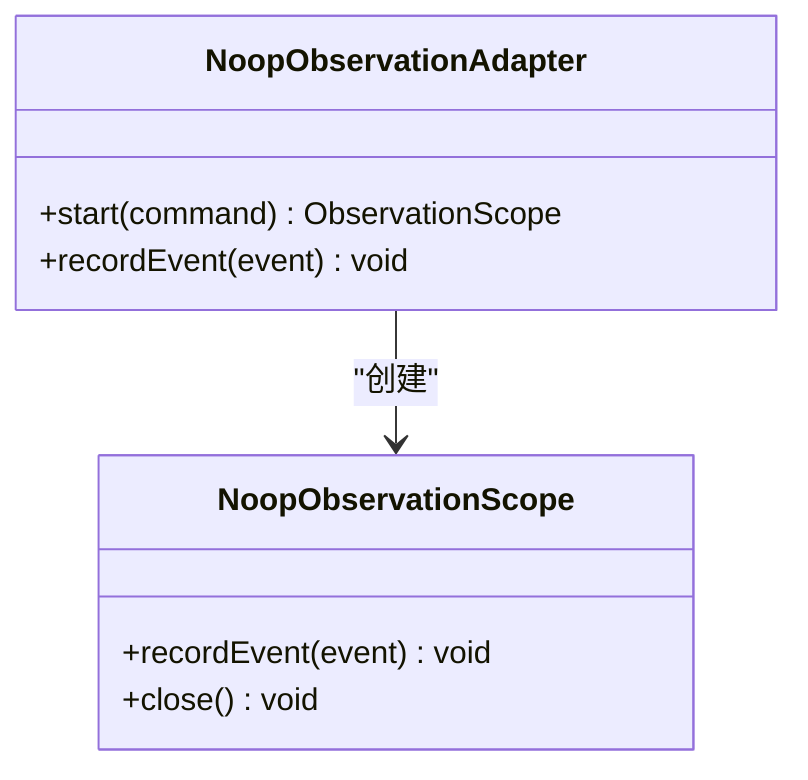
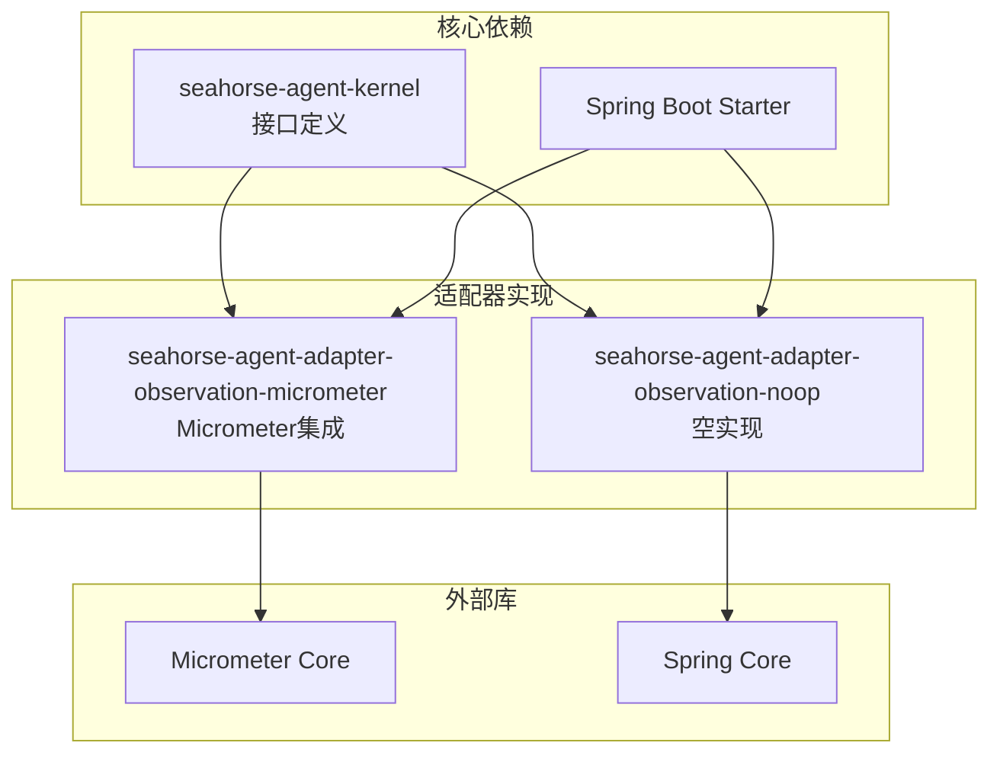

# 观测性基础设施

<cite>
**本文档引用的文件**
- [SeahorseAgentObservationAdapterAutoConfiguration.java](file://seahorse-agent-spring-boot-starter/src/main/java/com/miracle/ai/seahorse/agent/adapters/spring/SeahorseAgentObservationAdapterAutoConfiguration.java)
- [com.miracle.ai.seahorse.agent.ports.outbound.observation.ObservationPort](file://seahorse-agent-adapter-observation-micrometer/src/main/resources/META-INF/seahorse-agent/com.miracle.ai.seahorse.agent.ports.outbound.observation.ObservationPort)
- [MicrometerObservationAdapter.java](file://seahorse-agent-adapter-observation-micrometer/src/main/java/com/miracle/ai/seahorse/agent/adapters/observation/micrometer/MicrometerObservationAdapter.java)
- [NoopObservationAdapter.java](file://seahorse-agent-adapter-observation-noop/src/main/java/com/miracle/ai/seahorse/agent/adapters/observation/noop/NoopObservationAdapter.java)
- [MicrometerObservationAdapterTests.java](file://seahorse-agent-adapter-observation-micrometer/src/test/java/com/miracle/ai/seahorse/agent/adapters/observation/micrometer/MicrometerObservationAdapterTests.java)
- [ObservationPort.java](file://seahorse-agent-kernel/src/main/java/com/miracle/ai/seahorse/agent/ports/outbound/observation/ObservationPort.java)
- [应用监控.md](file://docs/zh/content/监控运维/应用监控.md)
</cite>

## 目录
1. [简介](#简介)
2. [项目结构](#项目结构)
3. [核心组件](#核心组件)
4. [架构概览](#架构概览)
5. [详细组件分析](#详细组件分析)
6. [依赖关系分析](#依赖关系分析)
7. [性能考虑](#性能考虑)
8. [故障排除指南](#故障排除指南)
9. [结论](#结论)

## 简介

观测性基础设施是 SeaHorse Agent 项目中的一个关键模块，负责提供统一的指标收集、事件记录和性能监控能力。该基础设施采用 Micrometer 作为底层指标收集框架，通过适配器模式实现了可插拔的观测性解决方案，支持多种监控后端和无操作模式。

观测性基础设施的核心目标是为整个 AI Agent 系统提供全面的运行时监控，包括但不限于：
- 性能指标收集（响应时间、吞吐量、错误率）
- 业务事件追踪（用户交互、工具调用、内存检索等）
- 租户级别的多租户监控
- 统一的观测数据格式和标签体系

## 项目结构

观测性基础设施主要分布在以下几个模块中：

**图表来源**
- [SeahorseAgentObservationAdapterAutoConfiguration.java:53-65](file://seahorse-agent-spring-boot-starter/src/main/java/com/miracle/ai/seahorse/agent/adapters/spring/SeahorseAgentObservationAdapterAutoConfiguration.java#L53-L65)
- [com.miracle.ai.seahorse.agent.ports.outbound.observation.ObservationPort:1-4](file://seahorse-agent-adapter-observation-micrometer/src/main/resources/META-INF/seahorse-agent/com.miracle.ai.seahorse.agent.ports.outbound.observation.ObservationPort#L1-L4)

**章节来源**
- [SeahorseAgentObservationAdapterAutoConfiguration.java:53-65](file://seahorse-agent-spring-boot-starter/src/main/java/com/miracle/ai/seahorse/agent/adapters/spring/SeahorseAgentObservationAdapterAutoConfiguration.java#L53-L65)
- [com.miracle.ai.seahorse.agent.ports.outbound.observation.ObservationPort:1-4](file://seahorse-agent-adapter-observation-micrometer/src/main/resources/META-INF/seahorse-agent/com.miracle.ai.seahorse.agent.ports.outbound.observation.ObservationPort#L1-L4)

## 核心组件

### 观测端口接口

ObservationPort 是观测性基础设施的核心接口，定义了统一的观测能力抽象：

**图表来源**
- [ObservationPort.java](file://seahorse-agent-kernel/src/main/java/com/miracle/ai/seahorse/agent/ports/outbound/observation/ObservationPort.java)
- [ObservationCommand.java](file://seahorse-agent-kernel/src/main/java/com/miracle/ai/seahorse/agent/ports/outbound/observation/ObservationCommand.java)
- [ObservationEvent.java](file://seahorse-agent-kernel/src/main/java/com/miracle/ai/seahorse/agent/ports/outbound/observation/ObservationEvent.java)
- [ObservationScope.java](file://seahorse-agent-kernel/src/main/java/com/miracle/ai/seahorse/agent/ports/outbound/observation/ObservationScope.java)

### 自动配置机制

Spring Boot 自动配置提供了灵活的适配器选择机制：

**图表来源**
- [SeahorseAgentObservationAdapterAutoConfiguration.java:53-65](file://seahorse-agent-spring-boot-starter/src/main/java/com/miracle/ai/seahorse/agent/adapters/spring/SeahorseAgentObservationAdapterAutoConfiguration.java#L53-L65)

**章节来源**
- [ObservationPort.java](file://seahorse-agent-kernel/src/main/java/com/miracle/ai/seahorse/agent/ports/outbound/observation/ObservationPort.java)
- [SeahorseAgentObservationAdapterAutoConfiguration.java:53-65](file://seahorse-agent-spring-boot-starter/src/main/java/com/miracle/ai/seahorse/agent/adapters/spring/SeahorseAgentObservationAdapterAutoConfiguration.java#L53-L65)

## 架构概览

观测性基础设施采用分层架构设计，实现了清晰的关注点分离：

**图表来源**
- [MicrometerObservationAdapter.java](file://seahorse-agent-adapter-observation-micrometer/src/main/java/com/miracle/ai/seahorse/agent/adapters/observation/micrometer/MicrometerObservationAdapter.java)
- [NoopObservationAdapter.java](file://seahorse-agent-adapter-observation-noop/src/main/java/com/miracle/ai/seahorse/agent/adapters/observation/noop/NoopObservationAdapter.java)

### 标签体系设计

观测性基础设施实现了统一的标签体系，支持多维度过滤和聚合：

| 标签类别 | 标签名 | 来源 | 描述 |
|---------|--------|------|------|
| 观测维度 | observation | 命令名称 | 标识观测的业务场景 |
| 观测维度 | tenant | 命令租户ID | 支持多租户隔离 |
| 事件维度 | event | 事件名称 | 标识具体的业务事件 |
| 属性维度 | 自定义属性 | 命令/事件属性 | 动态扩展的业务标签 |

**章节来源**
- [应用监控.md:134-177](file://docs/zh/content/监控运维/应用监控.md#L134-L177)

## 详细组件分析

### Micrometer 观测适配器

Micrometer 观测适配器是核心实现组件，提供了完整的指标收集功能：

**图表来源**
- [MicrometerObservationAdapter.java](file://seahorse-agent-adapter-observation-micrometer/src/main/java/com/miracle/ai/seahorse/agent/adapters/observation/micrometer/MicrometerObservationAdapter.java)
- [ObservationCommand.java](file://seahorse-agent-kernel/src/main/java/com/miracle/ai/seahorse/agent/ports/outbound/observation/ObservationCommand.java)
- [ObservationEvent.java](file://seahorse-agent-kernel/src/main/java/com/miracle/ai/seahorse/agent/ports/outbound/observation/ObservationEvent.java)

#### 指标类型与命名规范

| 指标类型 | 名称规范 | 使用场景 |
|---------|----------|----------|
| 持续时间指标 | 固定常量名称 | 记录观测生命周期内的耗时 |
| 事件计数指标 | 固定常量名称 | 记录独立事件的发生次数 |

#### 生命周期管理流程

**图表来源**
- [MicrometerObservationAdapter.java](file://seahorse-agent-adapter-observation-micrometer/src/main/java/com/miracle/ai/seahorse/agent/adapters/observation/micrometer/MicrometerObservationAdapter.java)

**章节来源**
- [应用监控.md:134-177](file://docs/zh/content/监控运维/应用监控.md#L134-L177)
- [MicrometerObservationAdapterTests.java:1-113](file://seahorse-agent-adapter-observation-micrometer/src/test/java/com/miracle/ai/seahorse/agent/adapters/observation/micrometer/MicrometerObservationAdapterTests.java#L1-L113)

### 空实现适配器

Noop 观测适配器提供了默认的降级实现，适用于测试环境或不需要实际监控的场景：

**图表来源**
- [NoopObservationAdapter.java](file://seahorse-agent-adapter-observation-noop/src/main/java/com/miracle/ai/seahorse/agent/adapters/observation/noop/NoopObservationAdapter.java)

**章节来源**
- [NoopObservationAdapter.java](file://seahorse-agent-adapter-observation-noop/src/main/java/com/miracle/ai/seahorse/agent/adapters/observation/noop/NoopObservationAdapter.java)

## 依赖关系分析

观测性基础设施的依赖关系体现了清晰的分层设计：

**图表来源**
- [SeahorseAgentObservationAdapterAutoConfiguration.java:53-65](file://seahorse-agent-spring-boot-starter/src/main/java/com/miracle/ai/seahorse/agent/adapters/spring/SeahorseAgentObservationAdapterAutoConfiguration.java#L53-L65)
- [com.miracle.ai.seahorse.agent.ports.outbound.observation.ObservationPort:1-4](file://seahorse-agent-adapter-observation-micrometer/src/main/resources/META-INF/seahorse-agent/com.miracle.ai.seahorse.agent.ports.outbound.observation.ObservationPort#L1-L4)

### 配置元数据

适配器通过 META-INF 配置文件声明了实现细节：

| 配置项 | 值 | 说明 |
|-------|-----|------|
| default | micrometer | 默认适配器实现 |
| micrometer.class | MicrometerObservationAdapter | 具体实现类名 |
| micrometer.managed | true | 是否由容器管理 |
| micrometer.order | 100 | 加载优先级 |

**章节来源**
- [com.miracle.ai.seahorse.agent.ports.outbound.observation.ObservationPort:1-4](file://seahorse-agent-adapter-observation-micrometer/src/main/resources/META-INF/seahorse-agent/com.miracle.ai.seahorse.agent.ports.outbound.observation.ObservationPort#L1-L4)

## 性能考虑

观测性基础设施在设计时充分考虑了性能影响：

### 指标收集开销

- **零成本抽象**：在禁用观测的情况下，空实现适配器提供近零开销
- **延迟初始化**：指标仅在实际使用时才创建
- **批量更新**：支持批量指标更新以减少系统调用

### 内存管理

- **弱引用**：避免长期持有对象引用导致的内存泄漏
- **自动清理**：过期指标的自动清理机制
- **内存池**：复用内部对象以减少 GC 压力

### 并发安全

- **无锁数据结构**：使用原子操作保证并发安全性
- **不可变对象**：标签和配置使用不可变对象
- **线程本地存储**：减少线程间同步开销

## 故障排除指南

### 常见问题诊断

| 问题类型 | 症状 | 可能原因 | 解决方案 |
|---------|------|----------|----------|
| 指标缺失 | Prometheus 无法抓取指标 | Micrometer 未正确配置 | 检查 MeterRegistry Bean 注册 |
| 标签不完整 | 指标缺少必要标签 | 属性映射失败 | 验证命令和事件的 attributes |
| 性能下降 | 应用响应时间增加 | 观测开销过大 | 调整采样频率或禁用非关键指标 |
| 内存泄漏 | JVM 内存持续增长 | 作用域未正确关闭 | 确保所有观测作用域都有对应的 close 调用 |

### 调试技巧

1. **启用调试日志**：查看观测适配器的详细执行过程
2. **指标验证**：通过直接查询指标确认数据完整性
3. **性能基准测试**：对比启用和禁用观测时的性能差异
4. **内存分析**：使用分析工具检查观测相关对象的生命周期

**章节来源**
- [MicrometerObservationAdapterTests.java:91-113](file://seahorse-agent-adapter-observation-micrometer/src/test/java/com/miracle/ai/seahorse/agent/adapters/observation/micrometer/MicrometerObservationAdapterTests.java#L91-L113)

## 结论

SeaHorse Agent 的观测性基础设施通过模块化设计和适配器模式，成功实现了高度可插拔的监控解决方案。该系统的主要优势包括：

1. **灵活性**：支持多种观测后端和运行模式
2. **一致性**：统一的接口和标签体系
3. **性能**：最小化的运行时开销
4. **可维护性**：清晰的架构分层和职责分离

通过合理的配置和使用，观测性基础设施能够为 SeaHorse Agent 提供全面的运行时洞察，帮助开发者和运维人员更好地理解和优化系统性能。