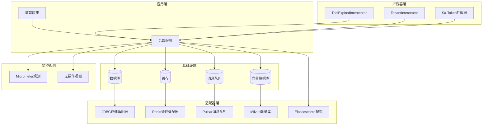
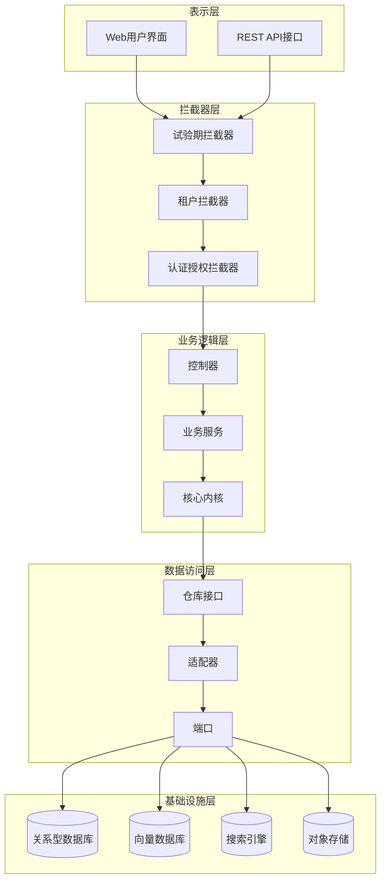
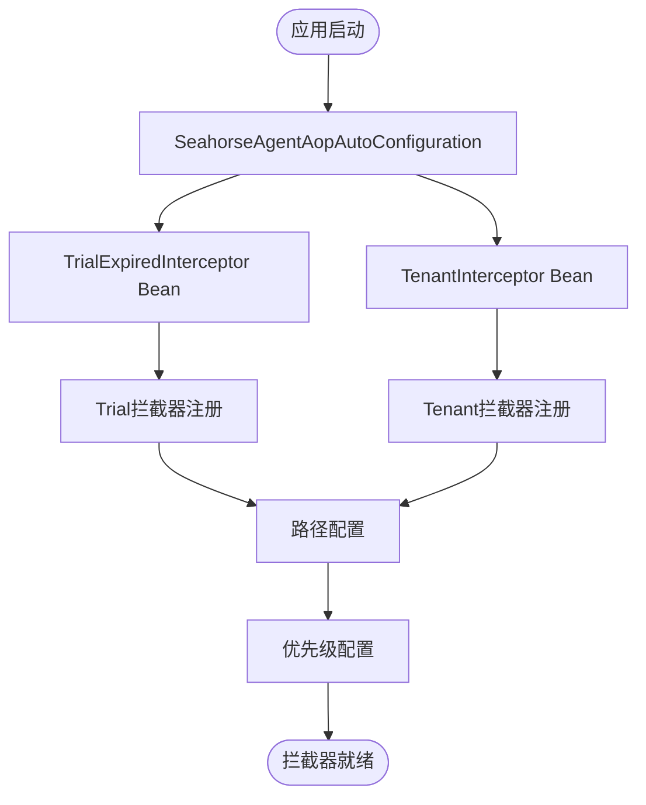
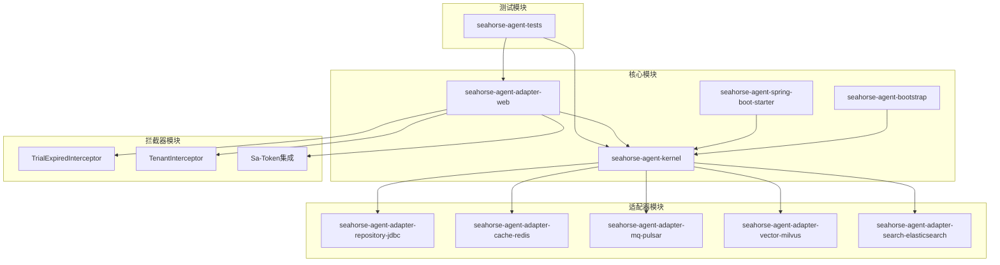
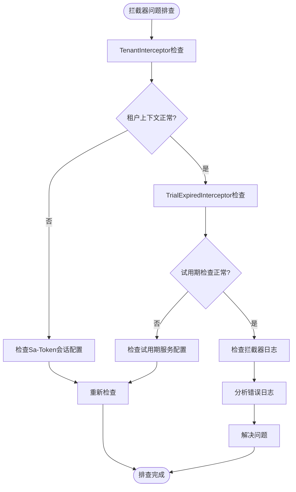
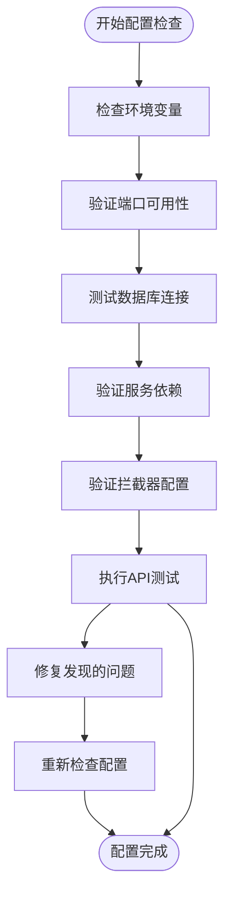

# 运维维护

<cite>
**本文档引用的文件**
- [DEPLOY.md](file://DEPLOY.md)
- [docker-compose.yml](file://docker-compose.yml)
- [docker-compose.full.yml](file://docker-compose.full.yml)
- [Dockerfile.backend](file://Dockerfile.backend)
- [Dockerfile.backend.simplified](file://Dockerfile.backend.simplified)
- [deploy.sh](file://deploy.sh)
- [deploy.ps1](file://deploy.ps1)
- [redeploy.sh](file://redeploy.sh)
- [redeploy.ps1](file://redeploy.ps1)
- [resources/docker/milvus-stack-2.6.6.compose.yaml](file://resources/docker/milvus-stack-2.6.6.compose.yaml)
- [resources/docker/pulsar-stack-3.1.3.compose.yaml](file://resources/docker/pulsar-stack-3.1.3.compose.yaml)
- [.mvn/wrapper/maven-wrapper.properties](file://.mvn/wrapper/maven-wrapper.properties)
- [pom.xml](file://pom.xml)
- [seahorse-agent-bootstrap/src/main/resources/application.properties](file://seahorse-agent-bootstrap/src/main/resources/application.properties)
- [seahorse-agent-spring-boot-starter/src/main/resources/skills/public/vercel-deploy-claimable/scripts/deploy.sh](file://seahorse-agent-spring-boot-starter/src/main/resources/skills/public/vercel-deploy-claimable/scripts/deploy.sh)
- [scripts/verify-backend-apis.ps1](file://scripts/verify-backend-apis.ps1)
- [SeahorseAgentAopAutoConfiguration.java](file://seahorse-agent-spring-boot-starter/src/main/java/com/miracle/ai/seahorse/agent/adapters/spring/SeahorseAgentAopAutoConfiguration.java)
- [TrialExpiredInterceptor.java](file://seahorse-agent-adapter-web/src/main/java/com/miracle/ai/seahorse/agent/adapters/web/TrialExpiredInterceptor.java)
- [TenantInterceptor.java](file://seahorse-agent-adapter-web/src/main/java/com/miracle/ai/seahorse/agent/adapters/web/TenantInterceptor.java)
- [SeahorseSecurityWebMvcConfiguration.java](file://seahorse-agent-adapter-web/src/main/java/com/miracle/ai/seahorse/agent/adapters/web/SeahorseSecurityWebMvcConfiguration.java)
- [TenantContext.java](file://seahorse-agent-kernel/src/main/java/com/miracle/ai/seahorse/agent/kernel/tenant/TenantContext.java)
</cite>

## 更新摘要
**所做更改**
- 新增操作中间件拦截器章节，详细介绍TrialExpiredInterceptor和TenantInterceptor的实现和配置
- 更新架构概览图，添加拦截器层说明
- 新增拦截器配置和注册流程说明
- 更新故障排除指南，增加拦截器相关问题排查

## 目录
1. [简介](#简介)
2. [项目结构](#项目结构)
3. [核心组件](#核心组件)
4. [架构概览](#架构概览)
5. [详细组件分析](#详细组件分析)
6. [拦截器系统](#拦截器系统)
7. [依赖分析](#依赖分析)
8. [性能考虑](#性能考虑)
9. [故障排除指南](#故障排除指南)
10. [结论](#结论)

## 简介

Seahorse Agent 是一个基于Spring Boot的企业级AI智能体平台，专注于多租户、安全加固和可观测性。该项目采用微服务架构，包含后端服务、前端界面以及丰富的适配器生态系统。

该平台提供了完整的运维维护能力，包括容器化部署、自动化脚本、监控观测和故障恢复机制。项目支持多种部署模式，从单机开发环境到生产级集群部署。

**更新** 新增操作中间件拦截器系统，包括试验期过期拦截器和租户请求处理拦截器，提供更细粒度的请求控制和多租户支持。

## 项目结构

项目采用模块化架构，主要包含以下核心部分：

**图表来源**
- [pom.xml](file://pom.xml)
- [docker-compose.yml](file://docker-compose.yml)
- [SeahorseAgentAopAutoConfiguration.java](file://seahorse-agent-spring-boot-starter/src/main/java/com/miracle/ai/seahorse/agent/adapters/spring/SeahorseAgentAopAutoConfiguration.java)
- [TenantInterceptor.java](file://seahorse-agent-adapter-web/src/main/java/com/miracle/ai/seahorse/agent/adapters/web/TenantInterceptor.java)

**章节来源**
- [pom.xml](file://pom.xml)
- [docker-compose.yml](file://docker-compose.yml)

## 核心组件

### 容器编排系统

项目提供了完整的容器化部署解决方案，包括基础版本和完整版本的docker-compose配置。

**章节来源**
- [docker-compose.yml](file://docker-compose.yml)
- [docker-compose.full.yml](file://docker-compose.full.yml)

### 构建系统

采用Maven作为构建工具，支持多模块管理。项目包含20+个子模块，涵盖核心内核、适配器、Web接口等。

**章节来源**
- [pom.xml](file://pom.xml)
- [.mvn/wrapper/maven-wrapper.properties](file://.mvn/wrapper/maven-wrapper.properties)

### 部署脚本

提供跨平台的部署脚本，支持Linux和Windows环境：

- `deploy.sh` / `deploy.ps1`: 完整部署脚本
- `redeploy.sh` / `redeploy.ps1`: 重新部署脚本
- 自动化API验证脚本

**章节来源**
- [deploy.sh](file://deploy.sh)
- [deploy.ps1](file://deploy.ps1)
- [redeploy.sh](file://redeploy.sh)
- [redeploy.ps1](file://redeploy.ps1)
- [scripts/verify-backend-apis.ps1](file://scripts/verify-backend-apis.ps1)

## 架构概览

系统采用分层架构设计，确保高可用性和可扩展性。新增拦截器层提供请求级别的安全控制和多租户支持：

**图表来源**
- [SeahorseAgentAopAutoConfiguration.java](file://seahorse-agent-spring-boot-starter/src/main/java/com/miracle/ai/seahorse/agent/adapters/spring/SeahorseAgentAopAutoConfiguration.java)
- [TenantInterceptor.java](file://seahorse-agent-adapter-web/src/main/java/com/miracle/ai/seahorse/agent/adapters/web/TenantInterceptor.java)
- [SeahorseSecurityWebMvcConfiguration.java](file://seahorse-agent-adapter-web/src/main/java/com/miracle/ai/seahorse/agent/adapters/web/SeahorseSecurityWebMvcConfiguration.java)

## 详细组件分析

### 容器化部署组件

#### 基础部署配置

项目提供了两种docker-compose配置文件，满足不同部署需求：

**章节来源**
- [docker-compose.yml](file://docker-compose.yml)
- [docker-compose.full.yml](file://docker-compose.full.yml)

#### 向量数据库栈

专门的Milvus向量数据库部署配置，支持高维向量检索：

**章节来源**
- [resources/docker/milvus-stack-2.6.6.compose.yaml](file://resources/docker/milvus-stack-2.6.6.compose.yaml)

#### 消息队列栈

Apache Pulsar消息队列部署配置，提供高吞吐量的消息传递：

**章节来源**
- [resources/docker/pulsar-stack-3.1.3.compose.yaml](file://resources/docker/pulsar-stack-3.1.3.compose.yaml)

### 构建和打包组件

#### Maven构建配置

多模块Maven项目结构，支持增量构建和并行编译：

**章节来源**
- [pom.xml](file://pom.xml)
- [.mvn/wrapper/maven-wrapper.properties](file://.mvn/wrapper/maven-wrapper.properties)

#### Docker镜像构建

提供两种Dockerfile变体，适应不同的部署场景：

**章节来源**
- [Dockerfile.backend](file://Dockerfile.backend)
- [Dockerfile.backend.simplified](file://Dockerfile.backend.simplified)

### 监控观测组件

#### Micrometer集成

提供完整的指标收集和监控能力：

**章节来源**
- [seahorse-agent-adapter-observation-micrometer/pom.xml](file://seahorse-agent-adapter-observation-micrometer/pom.xml)

#### 无操作观测适配器

在开发环境中提供轻量级观测替代方案：

**章节来源**
- [seahorse-agent-adapter-observation-noop/pom.xml](file://seahorse-agent-adapter-observation-noop/pom.xml)

### 数据存储适配器

#### 关系型数据库适配器

JDBC适配器支持多种关系型数据库：

**章节来源**
- [seahorse-agent-adapter-repository-jdbc/pom.xml](file://seahorse-agent-adapter-repository-jdbc/pom.xml)

#### 缓存适配器

本地和Redis缓存适配器，支持分布式锁和信号量：

**章节来源**
- [seahorse-agent-adapter-cache-local/pom.xml](file://seahorse-agent-adapter-cache-local/pom.xml)
- [seahorse-agent-adapter-cache-redis/pom.xml](file://seahorse-agent-adapter-cache-redis/pom.xml)

### 搜索和向量存储

#### Elasticsearch集成

关键词索引和搜索功能：

**章节来源**
- [seahorse-agent-adapter-search-elasticsearch/pom.xml](file://seahorse-agent-adapter-search-elasticsearch/pom.xml)

#### 向量存储适配器

支持Milvus和PgVector等多种向量存储：

**章节来源**
- [seahorse-agent-adapter-vector-milvus/pom.xml](file://seahorse-agent-adapter-vector-milvus/pom.xml)
- [seahorse-agent-adapter-vector-pgvector/pom.xml](file://seahorse-agent-adapter/vector-pgvector/pom.xml)

## 拦截器系统

### 操作中间件拦截器

项目新增了两个关键的操作中间件拦截器，提供请求级别的安全控制和多租户支持。

#### TrialExpiredInterceptor（试验期过期拦截器）

试验期过期拦截器负责在试用期结束后限制写操作，确保系统的稳定性和商业模型的完整性。

**实现特性：**
- 仅允许GET请求（只读模式）在试用期过期后继续访问
- 对POST/PUT/DELETE等写操作返回403状态码
- 基于租户维度进行试用期检查
- 返回标准化的JSON错误响应

**注册配置：**
- 路径模式：`/api/**`
- 排除路径：`/api/auth/**`, `/api/billing/plans`
- 优先级：在认证拦截器之前执行

**章节来源**
- [TrialExpiredInterceptor.java](file://seahorse-agent-adapter-web/src/main/java/com/miracle/ai/seahorse/agent/adapters/web/TrialExpiredInterceptor.java)
- [SeahorseAgentAopAutoConfiguration.java](file://seahorse-agent-spring-boot-starter/src/main/java/com/miracle/ai/seahorse/agent/adapters/spring/SeahorseAgentAopAutoConfiguration.java)

#### TenantInterceptor（租户请求处理拦截器）

租户拦截器负责在请求级别设置和清理多租户上下文，确保每个请求都在正确的租户环境中执行。

**实现特性：**
- 从Sa-Token会话中解析租户ID
- 在请求开始时设置ThreadLocal租户上下文
- 在请求完成后清理租户上下文，防止线程池复用导致的数据泄漏
- 支持未登录用户的默认租户处理

**注册配置：**
- 路径模式：`/**`
- 排除路径：`/`, `/index.html`, `/login`, `/features`, `/api/features`, `/auth/**`, `/error`, `/assets/**`, `/prototype/**`
- 优先级：在认证拦截器之前执行（order=0）

**章节来源**
- [TenantInterceptor.java](file://seahorse-agent-adapter-web/src/main/java/com/miracle/ai/seahorse/agent/adapters/web/TenantInterceptor.java)
- [SeahorseSecurityWebMvcConfiguration.java](file://seahorse-agent-adapter-web/src/main/java/com/miracle/ai/seahorse/agent/adapters/web/SeahorseSecurityWebMvcConfiguration.java)
- [TenantContext.java](file://seahorse-agent-kernel/src/main/java/com/miracle/ai/seahorse/agent/kernel/tenant/TenantContext.java)

### 拦截器注册流程

拦截器通过自动配置类进行统一管理，确保正确的加载顺序和配置：

**图表来源**
- [SeahorseAgentAopAutoConfiguration.java](file://seahorse-agent-spring-boot-starter/src/main/java/com/miracle/ai/seahorse/agent/adapters/spring/SeahorseAgentAopAutoConfiguration.java)
- [SeahorseSecurityWebMvcConfiguration.java](file://seahorse-agent-adapter-web/src/main/java/com/miracle/ai/seahorse/agent/adapters/web/SeahorseSecurityWebMvcConfiguration.java)

**章节来源**
- [SeahorseAgentAopAutoConfiguration.java](file://seahorse-agent-spring-boot-starter/src/main/java/com/miracle/ai/seahorse/agent/adapters/spring/SeahorseAgentAopAutoConfiguration.java)
- [SeahorseSecurityWebMvcConfiguration.java](file://seahorse-agent-adapter-web/src/main/java/com/miracle/ai/seahorse/agent/adapters/web/SeahorseSecurityWebMvcConfiguration.java)

## 依赖分析

项目采用模块化依赖管理，通过Maven的dependencyManagement统一管理版本。新增拦截器系统涉及以下关键依赖：

**图表来源**
- [pom.xml](file://pom.xml)
- [SeahorseAgentAopAutoConfiguration.java](file://seahorse-agent-spring-boot-starter/src/main/java/com/miracle/ai/seahorse/agent/adapters/spring/SeahorseAgentAopAutoConfiguration.java)

**章节来源**
- [pom.xml](file://pom.xml)

## 性能考虑

### 构建性能优化

- 使用Maven并行构建
- 模块化依赖减少编译时间
- 支持增量构建和缓存

### 运行时性能

- 多种缓存策略支持
- 异步消息处理
- 向量化查询优化
- 监控指标收集
- **新增** 拦截器性能优化：使用ThreadLocal存储租户上下文，避免重复查询

### 拦截器性能优化

- **TenantInterceptor**：使用ThreadLocal存储租户上下文，避免每次请求都查询会话
- **TrialExpiredInterceptor**：快速判断方法类型，避免不必要的租户查询
- **注册优化**：精确的路径匹配，减少不必要的拦截器调用

## 故障排除指南

### 部署问题

**常见问题及解决方案：**

1. **容器启动失败**
   - 检查端口占用情况
   - 验证环境变量配置
   - 查看容器日志输出

2. **数据库连接问题**
   - 确认数据库服务状态
   - 验证连接参数配置
   - 检查网络连通性

3. **向量数据库异常**
   - 检查Milvus服务健康状态
   - 验证向量维度配置
   - 确认存储空间充足

**章节来源**
- [deploy.sh](file://deploy.sh)
- [deploy.ps1](file://deploy.ps1)
- [scripts/verify-backend-apis.ps1](file://scripts/verify-backend-apis.ps1)

### 拦截器相关问题

**拦截器故障排除流程：**

**新增拦截器问题解决方案：**

1. **TenantInterceptor问题**
   - 检查Sa-Token会话是否正确设置tenantId
   - 验证TenantContext的ThreadLocal清理机制
   - 确认拦截器注册顺序正确

2. **TrialExpiredInterceptor问题**
   - 验证试用期服务的租户查询功能
   - 检查路径匹配配置是否正确
   - 确认排除路径配置符合预期

3. **拦截器性能问题**
   - 监控拦截器执行时间
   - 检查ThreadLocal内存泄漏
   - 验证租户上下文缓存效果

**章节来源**
- [TenantInterceptor.java](file://seahorse-agent-adapter-web/src/main/java/com/miracle/ai/seahorse/agent/adapters/web/TenantInterceptor.java)
- [TrialExpiredInterceptor.java](file://seahorse-agent-adapter-web/src/main/java/com/miracle/ai/seahorse/agent/adapters/web/TrialExpiredInterceptor.java)
- [TenantContext.java](file://seahorse-agent-kernel/src/main/java/com/miracle/ai/seahorse/agent/kernel/tenant/TenantContext.java)

### 性能问题

**监控和诊断：**

1. **使用内置监控脚本**
   - 执行API验证脚本检查服务健康
   - 监控关键指标变化趋势
   - 分析慢查询和错误日志

2. **容器资源监控**
   - 检查CPU和内存使用率
   - 监控磁盘空间和I/O
   - 观察网络连接状态

3. **拦截器性能监控**
   - 监控拦截器执行时间
   - 检查ThreadLocal使用情况
   - 分析租户上下文切换开销

**章节来源**
- [scripts/verify-backend-apis.ps1](file://scripts/verify-backend-apis.ps1)

### 配置问题

**配置验证流程：**

**新增拦截器配置验证：**

1. **拦截器注册检查**
   - 验证拦截器Bean是否正确创建
   - 检查拦截器注册顺序
   - 确认路径匹配规则

2. **租户上下文检查**
   - 验证ThreadLocal清理机制
   - 检查租户ID解析逻辑
   - 确认默认租户处理

3. **试用期检查验证**
   - 测试试用期过期逻辑
   - 验证只读请求放行
   - 检查写操作拦截效果

**章节来源**
- [SeahorseAgentAopAutoConfiguration.java](file://seahorse-agent-spring-boot-starter/src/main/java/com/miracle/ai/seahorse/agent/adapters/spring/SeahorseAgentAopAutoConfiguration.java)
- [SeahorseSecurityWebMvcConfiguration.java](file://seahorse-agent-adapter-web/src/main/java/com/miracle/ai/seahorse/agent/adapters/web/SeahorseSecurityWebMvcConfiguration.java)
- [scripts/verify-backend-apis.ps1](file://scripts/verify-backend-apis.ps1)

## 结论

Seahorse Agent项目提供了完整的运维维护体系，包括：

- **容器化部署**：支持多种部署模式和环境配置
- **自动化脚本**：跨平台部署和监控工具
- **模块化架构**：清晰的组件分离和依赖管理
- **监控观测**：完整的指标收集和故障诊断能力
- **扩展性设计**：支持水平扩展和性能优化
- **新增** **拦截器系统**：提供细粒度的请求控制和多租户支持

**更新总结：**
新增的操作中间件拦截器系统显著增强了平台的安全性和可维护性：
- **TrialExpiredInterceptor**确保试用期过后的系统稳定性
- **TenantInterceptor**提供可靠的多租户上下文管理
- 统一的拦截器注册和配置机制简化了维护工作
- 性能优化措施确保拦截器不会成为系统瓶颈

该平台适合企业级部署，提供了从开发到生产的全生命周期运维支持。通过合理的配置和监控，可以确保系统的稳定运行和高效维护。新增的拦截器系统进一步提升了平台的安全性和可靠性，为多租户场景下的企业级应用提供了坚实的基础。