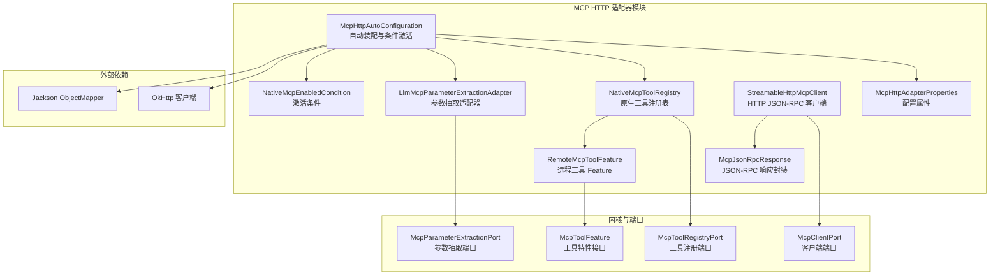
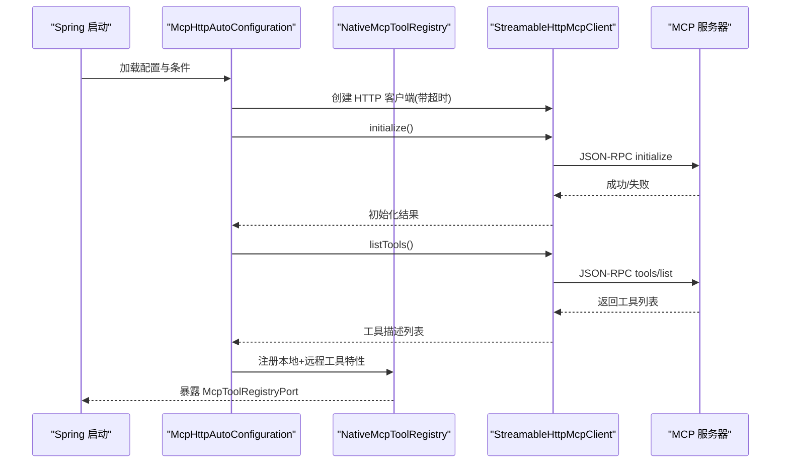
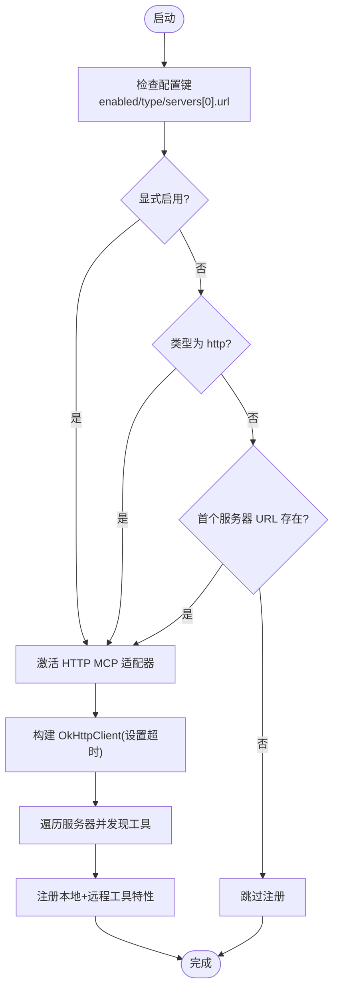
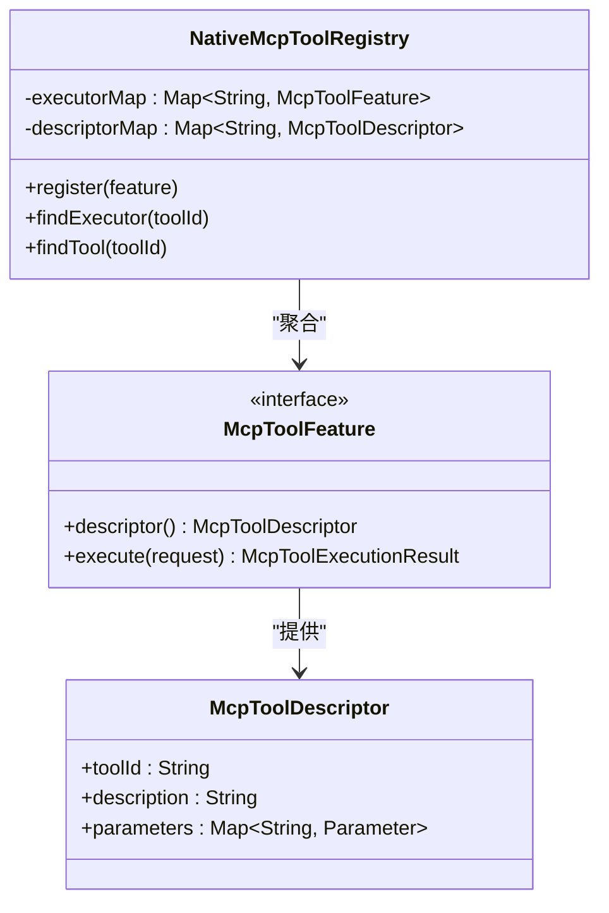
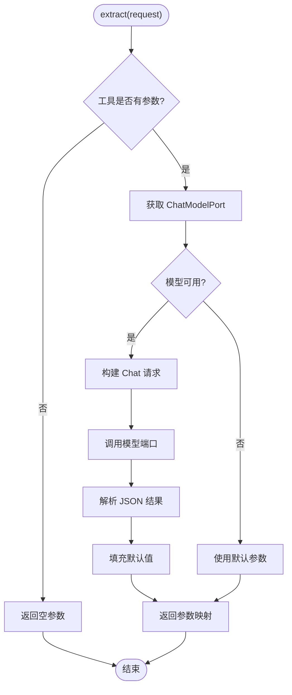
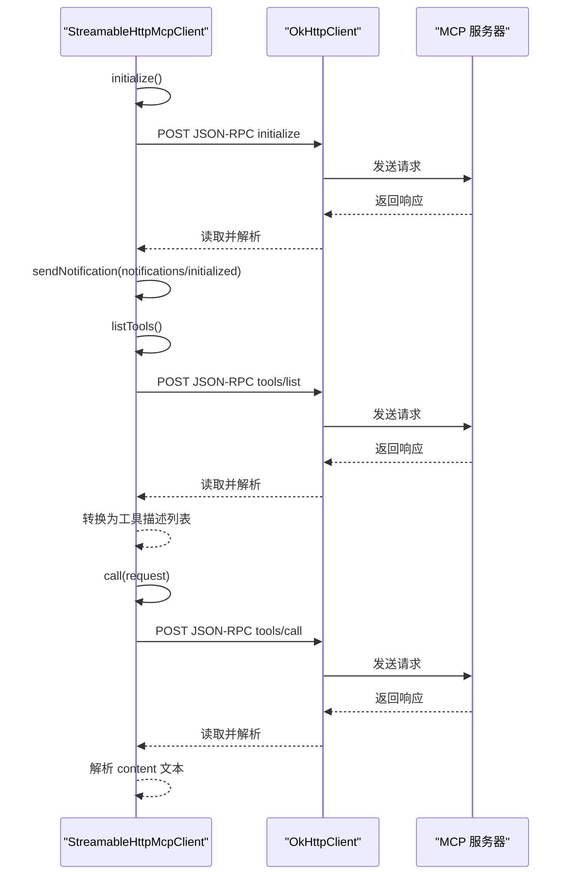
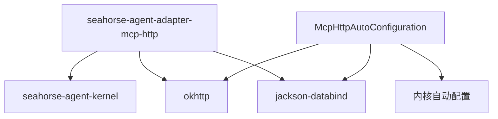

# MCP 适配器

<cite>
**本文档引用的文件**
- [McpHttpAutoConfiguration.java](file://seahorse-agent-adapter-mcp-http/src/main/java/com/miracle/ai/seahorse/agent/adapters/mcp/http/McpHttpAutoConfiguration.java)
- [McpHttpAdapterProperties.java](file://seahorse-agent-adapter-mcp-http/src/main/java/com/miracle/ai/seahorse/agent/adapters/mcp/http/McpHttpAdapterProperties.java)
- [LlmMcpParameterExtractionAdapter.java](file://seahorse-agent-adapter-mcp-http/src/main/java/com/miracle/ai/seahorse/agent/adapters/mcp/http/LlmMcpParameterExtractionAdapter.java)
- [NativeMcpToolRegistry.java](file://seahorse-agent-adapter-mcp-http/src/main/java/com/miracle/ai/seahorse/agent/adapters/mcp/http/NativeMcpToolRegistry.java)
- [StreamableHttpMcpClient.java](file://seahorse-agent-adapter-mcp-http/src/main/java/com/miracle/ai/seahorse/agent/adapters/mcp/http/StreamableHttpMcpClient.java)
- [RemoteMcpToolFeature.java](file://seahorse-agent-adapter-mcp-http/src/main/java/com/miracle/ai/seahorse/agent/adapters/mcp/http/RemoteMcpToolFeature.java)
- [McpJsonRpcResponse.java](file://seahorse-agent-adapter-mcp-http/src/main/java/com/miracle/ai/seahorse/agent/adapters/mcp/http/McpJsonRpcResponse.java)
- [NativeMcpEnabledCondition.java](file://seahorse-agent-adapter-mcp-http/src/main/java/com/miracle/ai/seahorse/agent/adapters/mcp/http/NativeMcpEnabledCondition.java)
- [pom.xml](file://seahorse-agent-adapter-mcp-http/pom.xml)
- [application.yml](file://seahorse-agent-mcp-server/src/main/resources/application.yml)
- [LlmMcpParameterExtractionAdapterTests.java](file://seahorse-agent-adapter-mcp-http/src/test/java/com/miracle/ai/seahorse/agent/adapters/mcp/http/LlmMcpParameterExtractionAdapterTests.java)
- [NativeMcpToolRegistryTests.java](file://seahorse-agent-adapter-mcp-http/src/test/java/com/miracle/ai/seahorse/agent/adapters/mcp/http/NativeMcpToolRegistryTests.java)
- [NativeMcpEnabledConditionTests.java](file://seahorse-agent-adapter-mcp-http/src/test/java/com/miracle/ai/seahorse/agent/adapters/mcp/http/NativeMcpEnabledConditionTests.java)
</cite>

## 目录
1. [简介](#简介)
2. [项目结构](#项目结构)
3. [核心组件](#核心组件)
4. [架构总览](#架构总览)
5. [详细组件分析](#详细组件分析)
6. [依赖分析](#依赖分析)
7. [性能考虑](#性能考虑)
8. [故障排查指南](#故障排查指南)
9. [结论](#结论)
10. [附录](#附录)

## 简介
本文件面向 MCP（Model Context Protocol）适配器的实现与使用，聚焦 HTTP MCP 适配器在 Seahorse Agent 中的工作原理与配置方法。内容涵盖：
- MCP 协议客户端实现、参数提取与工具注册机制
- HTTP 客户端配置、JSON-RPC 封包、流式通信与错误处理策略
- MCP 工具开发、参数验证与执行结果处理方法
- MCP 服务器集成、远程工具调用与本地工具注册
- 如何扩展 MCP 协议支持与自定义 MCP 工具开发

## 项目结构
MCP 适配器位于独立模块中，通过 Spring Boot 自动装配机制与内核集成，并依赖 OkHttp 与 Jackson 实现 HTTP 与 JSON 处理。

图表来源
- [McpHttpAutoConfiguration.java:47-112](file://seahorse-agent-adapter-mcp-http/src/main/java/com/miracle/ai/seahorse/agent/adapters/mcp/http/McpHttpAutoConfiguration.java#L47-L112)
- [McpHttpAdapterProperties.java:33-101](file://seahorse-agent-adapter-mcp-http/src/main/java/com/miracle/ai/seahorse/agent/adapters/mcp/http/McpHttpAdapterProperties.java#L33-L101)
- [NativeMcpToolRegistry.java:37-76](file://seahorse-agent-adapter-mcp-http/src/main/java/com/miracle/ai/seahorse/agent/adapters/mcp/http/NativeMcpToolRegistry.java#L37-L76)
- [LlmMcpParameterExtractionAdapter.java:43-184](file://seahorse-agent-adapter-mcp-http/src/main/java/com/miracle/ai/seahorse/agent/adapters/mcp/http/LlmMcpParameterExtractionAdapter.java#L43-L184)
- [StreamableHttpMcpClient.java:49-303](file://seahorse-agent-adapter-mcp-http/src/main/java/com/miracle/ai/seahorse/agent/adapters/mcp/http/StreamableHttpMcpClient.java#L49-L303)
- [RemoteMcpToolFeature.java:33-52](file://seahorse-agent-adapter-mcp-http/src/main/java/com/miracle/ai/seahorse/agent/adapters/mcp/http/RemoteMcpToolFeature.java#L33-L52)
- [McpJsonRpcResponse.java:28-33](file://seahorse-agent-adapter-mcp-http/src/main/java/com/miracle/ai/seahorse/agent/adapters/mcp/http/McpJsonRpcResponse.java#L28-L33)

章节来源
- [McpHttpAutoConfiguration.java:41-112](file://seahorse-agent-adapter-mcp-http/src/main/java/com/miracle/ai/seahorse/agent/adapters/mcp/http/McpHttpAutoConfiguration.java#L41-L112)
- [pom.xml:18-32](file://seahorse-agent-adapter-mcp-http/pom.xml#L18-L32)

## 核心组件
- 自动装配与条件激活：根据配置决定是否启用 HTTP MCP 适配器，整合本地与远程工具特性。
- 配置属性：集中管理适配器开关、调用超时与远程服务器列表。
- 原生工具注册表：聚合本地与远程工具特性，向内核暴露统一注册端口。
- 参数抽取适配器：基于模型端口进行参数抽取，失败时回退默认参数。
- HTTP JSON-RPC 客户端：封装 initialize、tools/list、tools/call 等方法，处理响应与错误。
- 远程工具 Feature：持有工具描述与远程客户端引用，执行时委托客户端调用。
- 激活条件：控制适配器是否参与 Bean 注册。

章节来源
- [McpHttpAutoConfiguration.java:41-112](file://seahorse-agent-adapter-mcp-http/src/main/java/com/miracle/ai/seahorse/agent/adapters/mcp/http/McpHttpAutoConfiguration.java#L41-L112)
- [McpHttpAdapterProperties.java:27-101](file://seahorse-agent-adapter-mcp-http/src/main/java/com/miracle/ai/seahorse/agent/adapters/mcp/http/McpHttpAdapterProperties.java#L27-L101)
- [NativeMcpToolRegistry.java:31-76](file://seahorse-agent-adapter-mcp-http/src/main/java/com/miracle/ai/seahorse/agent/adapters/mcp/http/NativeMcpToolRegistry.java#L31-L76)
- [LlmMcpParameterExtractionAdapter.java:37-184](file://seahorse-agent-adapter-mcp-http/src/main/java/com/miracle/ai/seahorse/agent/adapters/mcp/http/LlmMcpParameterExtractionAdapter.java#L37-L184)
- [StreamableHttpMcpClient.java:44-303](file://seahorse-agent-adapter-mcp-http/src/main/java/com/miracle/ai/seahorse/agent/adapters/mcp/http/StreamableHttpMcpClient.java#L44-L303)
- [RemoteMcpToolFeature.java:28-52](file://seahorse-agent-adapter-mcp-http/src/main/java/com/miracle/ai/seahorse/agent/adapters/mcp/http/RemoteMcpToolFeature.java#L28-L52)
- [NativeMcpEnabledCondition.java:27-55](file://seahorse-agent-adapter-mcp-http/src/main/java/com/miracle/ai/seahorse/agent/adapters/mcp/http/NativeMcpEnabledCondition.java#L27-L55)

## 架构总览
MCP 适配器通过自动装配在启动阶段发现远程工具并注册为工具特性，同时提供参数抽取能力。内核通过统一的注册端口与客户端端口与适配器交互。

图表来源
- [McpHttpAutoConfiguration.java:79-111](file://seahorse-agent-adapter-mcp-http/src/main/java/com/miracle/ai/seahorse/agent/adapters/mcp/http/McpHttpAutoConfiguration.java#L79-L111)
- [StreamableHttpMcpClient.java:84-124](file://seahorse-agent-adapter-mcp-http/src/main/java/com/miracle/ai/seahorse/agent/adapters/mcp/http/StreamableHttpMcpClient.java#L84-L124)
- [NativeMcpToolRegistry.java:42-48](file://seahorse-agent-adapter-mcp-http/src/main/java/com/miracle/ai/seahorse/agent/adapters/mcp/http/NativeMcpToolRegistry.java#L42-L48)

## 详细组件分析

### 自动装配与条件激活
- 条件注解确保仅在满足以下任一条件时启用：显式开启、类型为 http、或存在远程服务器配置。
- 在存在 OkHttpClient 的前提下创建原生工具注册表；若未配置远程服务器，则仅注册本地工具特性。
- 提供参数抽取适配器 Bean，用于从用户问题中抽取工具参数。

图表来源
- [NativeMcpEnabledCondition.java:40-50](file://seahorse-agent-adapter-mcp-http/src/main/java/com/miracle/ai/seahorse/agent/adapters/mcp/http/NativeMcpEnabledCondition.java#L40-L50)
- [McpHttpAutoConfiguration.java:55-77](file://seahorse-agent-adapter-mcp-http/src/main/java/com/miracle/ai/seahorse/agent/adapters/mcp/http/McpHttpAutoConfiguration.java#L55-L77)

章节来源
- [McpHttpAutoConfiguration.java:47-112](file://seahorse-agent-adapter-mcp-http/src/main/java/com/miracle/ai/seahorse/agent/adapters/mcp/http/McpHttpAutoConfiguration.java#L47-L112)
- [NativeMcpEnabledCondition.java:33-55](file://seahorse-agent-adapter-mcp-http/src/main/java/com/miracle/ai/seahorse/agent/adapters/mcp/http/NativeMcpEnabledCondition.java#L33-L55)

### 配置属性
- 支持开关、调用超时与多服务器配置。
- 服务器项包含名称、URL 与启用标志。
- 默认超时为 30 秒，服务器列表为空时不会触发远程发现。

章节来源
- [McpHttpAdapterProperties.java:27-101](file://seahorse-agent-adapter-mcp-http/src/main/java/com/miracle/ai/seahorse/agent/adapters/mcp/http/McpHttpAdapterProperties.java#L27-L101)

### 原生工具注册表
- 聚合本地与远程工具特性，按 toolId 建立执行器与描述映射。
- 重复 toolId 以“后注册覆盖”策略处理，便于配置级替换远程工具。
- 提供查找执行器与工具描述的能力。

图表来源
- [NativeMcpToolRegistry.java:37-76](file://seahorse-agent-adapter-mcp-http/src/main/java/com/miracle/ai/seahorse/agent/adapters/mcp/http/NativeMcpToolRegistry.java#L37-L76)

章节来源
- [NativeMcpToolRegistry.java:31-76](file://seahorse-agent-adapter-mcp-http/src/main/java/com/miracle/ai/seahorse/agent/adapters/mcp/http/NativeMcpToolRegistry.java#L31-L76)

### 参数抽取适配器
- 当工具声明参数时，构造系统与用户消息，调用模型端口进行参数抽取。
- 解析模型输出中的 JSON 对象，仅保留声明的参数，未提供的可选参数填充默认值。
- 若模型不可用或输出不可解析，回退到默认参数，保证主链路不中断。

图表来源
- [LlmMcpParameterExtractionAdapter.java:67-170](file://seahorse-agent-adapter-mcp-http/src/main/java/com/miracle/ai/seahorse/agent/adapters/mcp/http/LlmMcpParameterExtractionAdapter.java#L67-L170)

章节来源
- [LlmMcpParameterExtractionAdapter.java:37-184](file://seahorse-agent-adapter-mcp-http/src/main/java/com/miracle/ai/seahorse/agent/adapters/mcp/http/LlmMcpParameterExtractionAdapter.java#L37-L184)
- [LlmMcpParameterExtractionAdapterTests.java:34-59](file://seahorse-agent-adapter-mcp-http/src/test/java/com/miracle/ai/seahorse/agent/adapters/mcp/http/LlmMcpParameterExtractionAdapterTests.java#L34-L59)

### HTTP JSON-RPC 客户端
- 实现 initialize、tools/list、tools/call 三个核心方法，封装 JSON-RPC 请求与响应。
- 自动为 URL 附加 /mcp 路径，确保与 MCP 服务器约定端点一致。
- 统一封装错误：序列化失败、HTTP 异常、HTTP 非成功状态、RPC error 字段等。
- 执行结果解析：从 content 数组中拼接文本作为工具输出。

图表来源
- [StreamableHttpMcpClient.java:84-146](file://seahorse-agent-adapter-mcp-http/src/main/java/com/miracle/ai/seahorse/agent/adapters/mcp/http/StreamableHttpMcpClient.java#L84-L146)
- [McpJsonRpcResponse.java:28-33](file://seahorse-agent-adapter-mcp-http/src/main/java/com/miracle/ai/seahorse/agent/adapters/mcp/http/McpJsonRpcResponse.java#L28-L33)

章节来源
- [StreamableHttpMcpClient.java:44-303](file://seahorse-agent-adapter-mcp-http/src/main/java/com/miracle/ai/seahorse/agent/adapters/mcp/http/StreamableHttpMcpClient.java#L44-L303)
- [McpJsonRpcResponse.java:22-33](file://seahorse-agent-adapter-mcp-http/src/main/java/com/miracle/ai/seahorse/agent/adapters/mcp/http/McpJsonRpcResponse.java#L22-L33)

### 远程工具 Feature
- 持有工具描述与远程客户端引用，执行时直接委托客户端调用。
- 保持与内核编排的一致性，不改变上层调用流程。

章节来源
- [RemoteMcpToolFeature.java:28-52](file://seahorse-agent-adapter-mcp-http/src/main/java/com/miracle/ai/seahorse/agent/adapters/mcp/http/RemoteMcpToolFeature.java#L28-L52)

## 依赖分析
- 适配器模块依赖内核模块、OkHttp 与 Jackson。
- 自动装配在内核自动配置之前执行，确保优先注册原生工具注册表。
- 测试覆盖参数抽取、注册表行为与激活条件。

图表来源
- [pom.xml:18-32](file://seahorse-agent-adapter-mcp-http/pom.xml#L18-L32)
- [McpHttpAutoConfiguration.java:48-48](file://seahorse-agent-adapter-mcp-http/src/main/java/com/miracle/ai/seahorse/agent/adapters/mcp/http/McpHttpAutoConfiguration.java#L48-L48)

章节来源
- [pom.xml:18-32](file://seahorse-agent-adapter-mcp-http/pom.xml#L18-L32)
- [McpHttpAutoConfiguration.java:48-48](file://seahorse-agent-adapter-mcp-http/src/main/java/com/miracle/ai/seahorse/agent/adapters/mcp/http/McpHttpAutoConfiguration.java#L48-L48)

## 性能考虑
- 调用超时：通过配置设置 OkHttpClient 的 callTimeout，避免阻塞影响主链路。
- 远程工具发现：仅在启用或存在服务器配置时进行，减少不必要的网络开销。
- 参数抽取：模型不可用时快速回退默认参数，降低延迟风险。
- 错误降级：HTTP 异常与 RPC 错误均返回失败结果，便于上层快速失败与重试策略。

## 故障排查指南
- 无法连接 MCP 服务器
  - 检查服务器 URL 是否正确且附加 /mcp 路径。
  - 查看初始化与工具列表请求的日志输出，确认 HTTP 状态码与错误信息。
- 工具执行失败
  - 确认工具 ID 正确且已在注册表中。
  - 检查服务器返回的 isError 字段与 content 文本，定位具体错误。
- 参数抽取异常
  - 若模型不可用，将回退默认参数；可检查模型端口可用性与提示词模板。
  - 确保工具参数定义完整，避免遗漏必需参数。
- 激活条件不生效
  - 确认配置键 seahorse-agent.adapters.mcp.enabled、type 或 servers[0].url 至少满足其一。

章节来源
- [StreamableHttpMcpClient.java:185-206](file://seahorse-agent-adapter-mcp-http/src/main/java/com/miracle/ai/seahorse/agent/adapters/mcp/http/StreamableHttpMcpClient.java#L185-L206)
- [LlmMcpParameterExtractionAdapter.java:131-144](file://seahorse-agent-adapter-mcp-http/src/main/java/com/miracle/ai/seahorse/agent/adapters/mcp/http/LlmMcpParameterExtractionAdapter.java#L131-L144)
- [NativeMcpEnabledCondition.java:40-50](file://seahorse-agent-adapter-mcp-http/src/main/java/com/miracle/ai/seahorse/agent/adapters/mcp/http/NativeMcpEnabledCondition.java#L40-L50)

## 结论
MCP HTTP 适配器通过清晰的职责划分与稳健的错误处理，实现了对远程 MCP 服务器的无缝集成。其自动装配机制与条件激活策略确保在不同部署环境下灵活启用，参数抽取与工具注册能力则为上层 RAG 主链路提供了可靠的工具扩展能力。

## 附录

### 配置示例与最佳实践
- 启用适配器并配置服务器
  - 设置开关、调用超时与服务器列表，确保首个服务器 URL 存在即可激活。
- 本地工具与远程工具共存
  - 本地工具特性将与远程工具特性共同注册，重复 toolId 以后注册覆盖。
- 参数抽取提示词
  - 可通过自定义提示词模板提升参数抽取准确性；模型不可用时自动回退默认参数。

章节来源
- [McpHttpAdapterProperties.java:33-101](file://seahorse-agent-adapter-mcp-http/src/main/java/com/miracle/ai/seahorse/agent/adapters/mcp/http/McpHttpAdapterProperties.java#L33-L101)
- [LlmMcpParameterExtractionAdapter.java:101-106](file://seahorse-agent-adapter-mcp-http/src/main/java/com/miracle/ai/seahorse/agent/adapters/mcp/http/LlmMcpParameterExtractionAdapter.java#L101-L106)

### MCP 服务器集成参考
- 服务器端口与应用名可在示例配置中查看，便于本地联调与部署。

章节来源
- [application.yml:1-7](file://seahorse-agent-mcp-server/src/main/resources/application.yml#L1-L7)