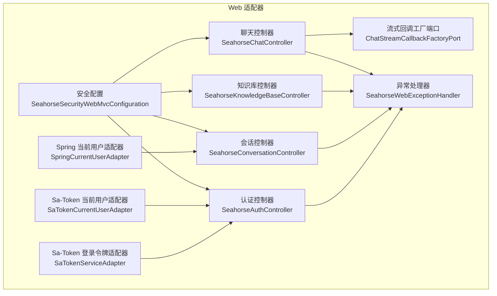
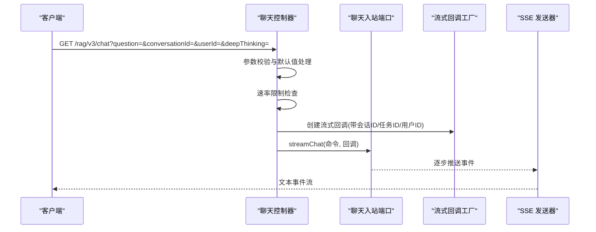
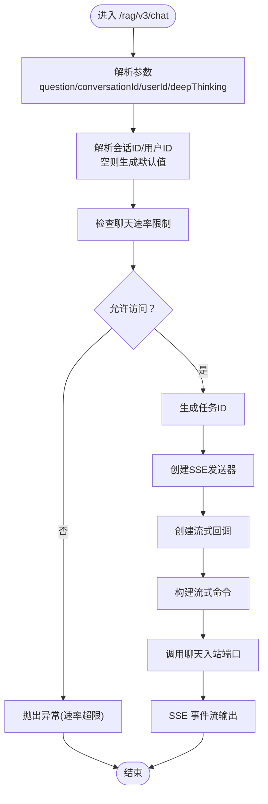
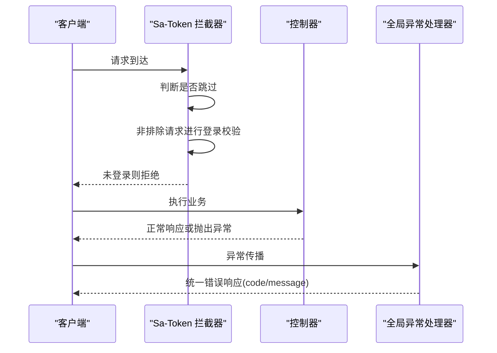
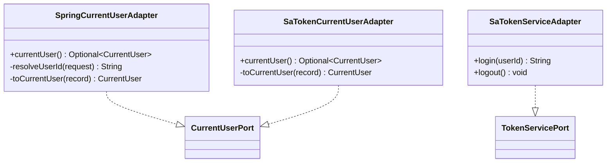
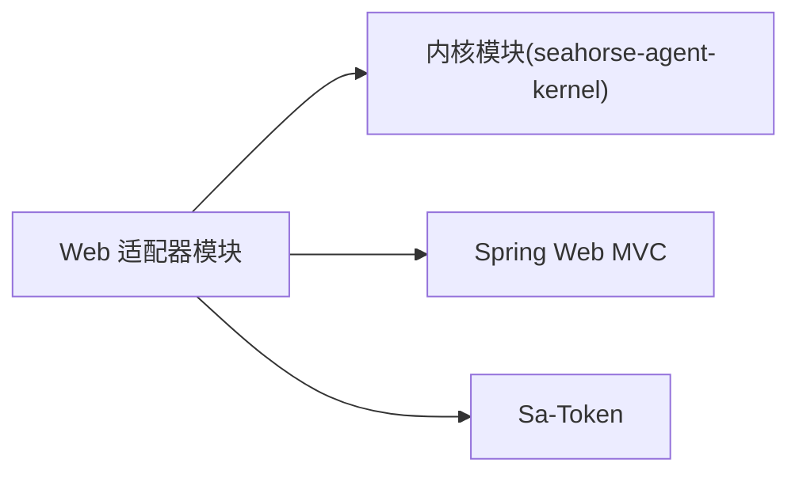

# Web 适配器

<cite>
**本文引用的文件**
- [SeahorseChatController.java](file://seahorse-agent-adapter-web/src/main/java/com/miracle/ai/seahorse/agent/adapters/web/SeahorseChatController.java)
- [SeahorseKnowledgeBaseController.java](file://seahorse-agent-adapter-web/src/main/java/com/miracle/ai/seahorse/agent/adapters/web/SeahorseKnowledgeBaseController.java)
- [SeahorseConversationController.java](file://seahorse-agent-adapter-web/src/main/java/com/miracle/ai/seahorse/agent/adapters/web/SeahorseConversationController.java)
- [SeahorseAuthController.java](file://seahorse-agent-adapter-web/src/main/java/com/miracle/ai/seahorse/agent/adapters/web/SeahorseAuthController.java)
- [SeahorseSecurityWebMvcConfiguration.java](file://seahorse-agent-adapter-web/src/main/java/com/miracle/ai/seahorse/agent/adapters/web/SeahorseSecurityWebMvcConfiguration.java)
- [SeahorseWebExceptionHandler.java](file://seahorse-agent-adapter-web/src/main/java/com/miracle/ai/seahorse/agent/adapters/web/SeahorseWebExceptionHandler.java)
- [ChatStreamCallbackFactoryPort.java](file://seahorse-agent-adapter-web/src/main/java/com/miracle/ai/seahorse/agent/adapters/web/ChatStreamCallbackFactoryPort.java)
- [SpringCurrentUserAdapter.java](file://seahorse-agent-adapter-web/src/main/java/com/miracle/ai/seahorse/agent/adapters/web/SpringCurrentUserAdapter.java)
- [SaTokenCurrentUserAdapter.java](file://seahorse-agent-adapter-web/src/main/java/com/miracle/ai/seahorse/agent/adapters/web/SaTokenCurrentUserAdapter.java)
- [SaTokenServiceAdapter.java](file://seahorse-agent-adapter-web/src/main/java/com/miracle/ai/seahorse/agent/adapters/web/SaTokenServiceAdapter.java)
- [AuthLoginRequest.java](file://seahorse-agent-adapter-web/src/main/java/com/miracle/ai/seahorse/agent/adapters/web/AuthLoginRequest.java)
- [KnowledgeBaseCreateRequest.java](file://seahorse-agent-adapter-web/src/main/java/com/miracle/ai/seahorse/agent/adapters/web/KnowledgeBaseCreateRequest.java)
- [ConversationUpdateRequest.java](file://seahorse-agent-adapter-web/src/main/java/com/miracle/ai/seahorse/agent/adapters/web/ConversationUpdateRequest.java)
- [pom.xml](file://seahorse-agent-adapter-web/pom.xml)
</cite>

## 目录
1. [简介](#简介)
2. [项目结构](#项目结构)
3. [核心组件](#核心组件)
4. [架构总览](#架构总览)
5. [详细组件分析](#详细组件分析)
6. [依赖分析](#依赖分析)
7. [性能考虑](#性能考虑)
8. [故障排查指南](#故障排查指南)
9. [结论](#结论)
10. [附录](#附录)

## 简介
本文件为 SeaHorse Agent 的 Web 适配器技术文档，聚焦于 HTTP API 控制器的设计与实现，覆盖聊天控制器、知识库控制器、会话控制器、认证控制器等核心控制器的功能与接口定义；阐述请求响应封装机制、参数校验、异常处理与安全控制；解释控制器与核心内核服务（通过入站端口）的交互方式及通过端口接口实现业务逻辑的过程；提供 API 使用示例、错误码说明与最佳实践；介绍认证授权机制、跨域配置与性能优化策略。

## 项目结构
Web 适配器模块位于 seahorse-agent-adapter-web，主要包含以下内容：
- 控制器层：聊天、知识库、会话、认证等 REST 控制器
- 安全与异常处理：基于 Sa-Token 的拦截器与全局异常处理器
- 用户上下文适配：Spring 与 Sa-Token 两种 CurrentUser 适配器
- 流式回调工厂：用于基于 SSE 的流式输出
- 请求对象：登录、知识库创建、会话更新等 DTO

图表来源
- [SeahorseChatController.java:1-133](file://seahorse-agent-adapter-web/src/main/java/com/miracle/ai/seahorse/agent/adapters/web/SeahorseChatController.java#L1-L133)
- [SeahorseKnowledgeBaseController.java:1-108](file://seahorse-agent-adapter-web/src/main/java/com/miracle/ai/seahorse/agent/adapters/web/SeahorseKnowledgeBaseController.java#L1-L108)
- [SeahorseConversationController.java:1-105](file://seahorse-agent-adapter-web/src/main/java/com/miracle/ai/seahorse/agent/adapters/web/SeahorseConversationController.java#L1-L105)
- [SeahorseAuthController.java:1-57](file://seahorse-agent-adapter-web/src/main/java/com/miracle/ai/seahorse/agent/adapters/web/SeahorseAuthController.java#L1-L57)
- [SeahorseWebExceptionHandler.java:1-60](file://seahorse-agent-adapter-web/src/main/java/com/miracle/ai/seahorse/agent/adapters/web/SeahorseWebExceptionHandler.java#L1-L60)
- [SeahorseSecurityWebMvcConfiguration.java:1-51](file://seahorse-agent-adapter-web/src/main/java/com/miracle/ai/seahorse/agent/adapters/web/SeahorseSecurityWebMvcConfiguration.java#L1-L51)
- [SpringCurrentUserAdapter.java:1-78](file://seahorse-agent-adapter-web/src/main/java/com/miracle/ai/seahorse/agent/adapters/web/SpringCurrentUserAdapter.java#L1-L78)
- [SaTokenCurrentUserAdapter.java:1-56](file://seahorse-agent-adapter-web/src/main/java/com/miracle/ai/seahorse/agent/adapters/web/SaTokenCurrentUserAdapter.java#L1-L56)
- [SaTokenServiceAdapter.java:1-36](file://seahorse-agent-adapter-web/src/main/java/com/miracle/ai/seahorse/agent/adapters/web/SaTokenServiceAdapter.java#L1-L36)
- [ChatStreamCallbackFactoryPort.java:1-34](file://seahorse-agent-adapter-web/src/main/java/com/miracle/ai/seahorse/agent/adapters/web/ChatStreamCallbackFactoryPort.java#L1-L34)

章节来源
- [pom.xml:1-64](file://seahorse-agent-adapter-web/pom.xml#L1-L64)

## 核心组件
- 聊天控制器：提供流式问答接口与任务停止接口，内置速率限制与 SSE 超时配置
- 知识库控制器：提供知识库的增删改查与分页查询、切片策略查询
- 会话控制器：提供会话列表、重命名、删除、消息列表查询
- 认证控制器：提供登录、登出接口，依赖入站认证端口
- 安全配置：基于 Sa-Token 的全局拦截器，排除鉴权与错误路径
- 异常处理：统一返回 code/message 结构，按异常类型映射 HTTP 状态码
- 用户上下文适配：支持 Spring 与 Sa-Token 两种当前用户解析方式
- 流式回调工厂：抽象出基于 SSE 的流式回调创建

章节来源
- [SeahorseChatController.java:1-133](file://seahorse-agent-adapter-web/src/main/java/com/miracle/ai/seahorse/agent/adapters/web/SeahorseChatController.java#L1-L133)
- [SeahorseKnowledgeBaseController.java:1-108](file://seahorse-agent-adapter-web/src/main/java/com/miracle/ai/seahorse/agent/adapters/web/SeahorseKnowledgeBaseController.java#L1-L108)
- [SeahorseConversationController.java:1-105](file://seahorse-agent-adapter-web/src/main/java/com/miracle/ai/seahorse/agent/adapters/web/SeahorseConversationController.java#L1-L105)
- [SeahorseAuthController.java:1-57](file://seahorse-agent-adapter-web/src/main/java/com/miracle/ai/seahorse/agent/adapters/web/SeahorseAuthController.java#L1-L57)
- [SeahorseSecurityWebMvcConfiguration.java:1-51](file://seahorse-agent-adapter-web/src/main/java/com/miracle/ai/seahorse/agent/adapters/web/SeahorseSecurityWebMvcConfiguration.java#L1-L51)
- [SeahorseWebExceptionHandler.java:1-60](file://seahorse-agent-adapter-web/src/main/java/com/miracle/ai/seahorse/agent/adapters/web/SeahorseWebExceptionHandler.java#L1-L60)
- [SpringCurrentUserAdapter.java:1-78](file://seahorse-agent-adapter-web/src/main/java/com/miracle/ai/seahorse/agent/adapters/web/SpringCurrentUserAdapter.java#L1-L78)
- [SaTokenCurrentUserAdapter.java:1-56](file://seahorse-agent-adapter-web/src/main/java/com/miracle/ai/seahorse/agent/adapters/web/SaTokenCurrentUserAdapter.java#L1-L56)
- [SaTokenServiceAdapter.java:1-36](file://seahorse-agent-adapter-web/src/main/java/com/miracle/ai/seahorse/agent/adapters/web/SaTokenServiceAdapter.java#L1-L36)
- [ChatStreamCallbackFactoryPort.java:1-34](file://seahorse-agent-adapter-web/src/main/java/com/miracle/ai/seahorse/agent/adapters/web/ChatStreamCallbackFactoryPort.java#L1-L34)

## 架构总览
Web 适配器通过 REST 控制器接收 HTTP 请求，经由参数校验与安全拦截后，调用内核提供的入站端口执行业务逻辑；对于流式问答场景，控制器通过流式回调工厂创建回调以推送 SSE 事件；异常统一由全局异常处理器包装为标准响应格式。

图表来源
- [SeahorseChatController.java:83-102](file://seahorse-agent-adapter-web/src/main/java/com/miracle/ai/seahorse/agent/adapters/web/SeahorseChatController.java#L83-L102)
- [ChatStreamCallbackFactoryPort.java:26-33](file://seahorse-agent-adapter-web/src/main/java/com/miracle/ai/seahorse/agent/adapters/web/ChatStreamCallbackFactoryPort.java#L26-L33)

## 详细组件分析

### 聊天控制器（SeahorseChatController）
- 功能要点
  - 流式问答接口：接收问题、会话ID、用户ID、是否深度思考，返回 SSE 文本事件流
  - 任务停止接口：根据任务ID停止任务并注销流式任务
  - 速率限制：基于 RateLimiterPort 进行用户级限流
  - 默认值与空值处理：会话ID为空自动生成UUID，用户ID为空使用默认值
  - SSE 超时：可配置超时时间
- 关键流程
  - 参数解析与校验
  - 速率限制决策
  - 创建任务ID与 SSE 发送器
  - 创建流式回调并构造流式命令
  - 调用入站端口执行流式对话
- 错误处理
  - 速率超限抛出非法状态异常，由全局异常处理器映射为冲突状态码
  - 其他异常映射为服务器错误

图表来源
- [SeahorseChatController.java:83-131](file://seahorse-agent-adapter-web/src/main/java/com/miracle/ai/seahorse/agent/adapters/web/SeahorseChatController.java#L83-L131)

章节来源
- [SeahorseChatController.java:1-133](file://seahorse-agent-adapter-web/src/main/java/com/miracle/ai/seahorse/agent/adapters/web/SeahorseChatController.java#L1-L133)
- [ChatStreamCallbackFactoryPort.java:1-34](file://seahorse-agent-adapter-web/src/main/java/com/miracle/ai/seahorse/agent/adapters/web/ChatStreamCallbackFactoryPort.java#L1-L34)

### 知识库控制器（SeahorseKnowledgeBaseController）
- 功能要点
  - 创建知识库：接收名称、嵌入模型、集合名，返回新建知识库ID
  - 更新知识库：支持名称与嵌入模型变更
  - 删除知识库：按ID删除
  - 查询详情：按ID查询
  - 分页查询：支持页码、大小与名称过滤
  - 切片策略查询：返回可用切片策略列表
  - 操作者标识：从请求头 X-User-Id 获取操作人
- 参数与返回
  - 统一返回结构：code/data 字段
  - 成功时 code=0，失败时由异常处理器转换为错误结构

章节来源
- [SeahorseKnowledgeBaseController.java:1-108](file://seahorse-agent-adapter-web/src/main/java/com/miracle/ai/seahorse/agent/adapters/web/SeahorseKnowledgeBaseController.java#L1-L108)
- [KnowledgeBaseCreateRequest.java:1-25](file://seahorse-agent-adapter-web/src/main/java/com/miracle/ai/seahorse/agent/adapters/web/KnowledgeBaseCreateRequest.java#L1-L25)

### 会话控制器（SeahorseConversationController）
- 功能要点
  - 列出会话：支持按用户ID过滤
  - 重命名会话：支持从参数或请求头注入用户ID
  - 删除会话：支持从参数或请求头注入用户ID
  - 查询消息列表：支持从参数或请求头注入用户ID
- 用户ID解析优先级
  - 参数 > 请求头 X-User-Id > 默认值

章节来源
- [SeahorseConversationController.java:1-105](file://seahorse-agent-adapter-web/src/main/java/com/miracle/ai/seahorse/agent/adapters/web/SeahorseConversationController.java#L1-L105)
- [ConversationUpdateRequest.java:1-25](file://seahorse-agent-adapter-web/src/main/java/com/miracle/ai/seahorse/agent/adapters/web/ConversationUpdateRequest.java#L1-L25)

### 认证控制器（SeahorseAuthController）
- 功能要点
  - 登录：接收用户名/密码，调用入站认证端口返回令牌
  - 登出：调用入站认证端口执行登出
- 返回结构
  - 统一返回 code/data，成功时 code=0

章节来源
- [SeahorseAuthController.java:1-57](file://seahorse-agent-adapter-web/src/main/java/com/miracle/ai/seahorse/agent/adapters/web/SeahorseAuthController.java#L1-L57)
- [AuthLoginRequest.java:1-41](file://seahorse-agent-adapter-web/src/main/java/com/miracle/ai/seahorse/agent/adapters/web/AuthLoginRequest.java#L1-L41)

### 安全与异常处理
- 安全拦截
  - 基于 Sa-Token 的拦截器，全局生效
  - 排除路径：/auth/** 与 /error
  - 跳过条件：异步分发类型与 OPTIONS 方法
  - 登录校验：非排除请求均需登录
- 异常处理
  - IllegalArgumentException → 400 BAD REQUEST
  - IllegalStateException → 409 CONFLICT
  - 其他异常 → 500 INTERNAL SERVER ERROR
  - 统一返回结构：code=message

图表来源
- [SeahorseSecurityWebMvcConfiguration.java:34-49](file://seahorse-agent-adapter-web/src/main/java/com/miracle/ai/seahorse/agent/adapters/web/SeahorseSecurityWebMvcConfiguration.java#L34-L49)
- [SeahorseWebExceptionHandler.java:36-52](file://seahorse-agent-adapter-web/src/main/java/com/miracle/ai/seahorse/agent/adapters/web/SeahorseWebExceptionHandler.java#L36-L52)

章节来源
- [SeahorseSecurityWebMvcConfiguration.java:1-51](file://seahorse-agent-adapter-web/src/main/java/com/miracle/ai/seahorse/agent/adapters/web/SeahorseSecurityWebMvcConfiguration.java#L1-L51)
- [SeahorseWebExceptionHandler.java:1-60](file://seahorse-agent-adapter-web/src/main/java/com/miracle/ai/seahorse/agent/adapters/web/SeahorseWebExceptionHandler.java#L1-L60)

### 用户上下文与认证服务适配
- Spring 当前用户适配器
  - 从请求参数或请求头 X-User-Id 解析用户ID
  - 通过用户仓库端口加载用户记录并映射为 CurrentUser
- Sa-Token 当前用户适配器
  - 通过 Sa-Token 登录态判断是否已登录
  - 已登录则从用户仓库加载用户记录并映射
- Sa-Token 登录令牌适配器
  - 提供登录/登出能力，返回令牌值

图表来源
- [SpringCurrentUserAdapter.java:31-77](file://seahorse-agent-adapter-web/src/main/java/com/miracle/ai/seahorse/agent/adapters/web/SpringCurrentUserAdapter.java#L31-L77)
- [SaTokenCurrentUserAdapter.java:29-55](file://seahorse-agent-adapter-web/src/main/java/com/miracle/ai/seahorse/agent/adapters/web/SaTokenCurrentUserAdapter.java#L29-L55)
- [SaTokenServiceAdapter.java:23-35](file://seahorse-agent-adapter-web/src/main/java/com/miracle/ai/seahorse/agent/adapters/web/SaTokenServiceAdapter.java#L23-L35)

章节来源
- [SpringCurrentUserAdapter.java:1-78](file://seahorse-agent-adapter-web/src/main/java/com/miracle/ai/seahorse/agent/adapters/web/SpringCurrentUserAdapter.java#L1-L78)
- [SaTokenCurrentUserAdapter.java:1-56](file://seahorse-agent-adapter-web/src/main/java/com/miracle/ai/seahorse/agent/adapters/web/SaTokenCurrentUserAdapter.java#L1-L56)
- [SaTokenServiceAdapter.java:1-36](file://seahorse-agent-adapter-web/src/main/java/com/miracle/ai/seahorse/agent/adapters/web/SaTokenServiceAdapter.java#L1-L36)

## 依赖分析
- 模块依赖
  - 依赖内核模块 seahorse-agent-kernel，以获取入站端口与领域模型
  - 依赖 Spring Web MVC 提供 Web 层能力
  - 依赖 Sa-Token Starter 提供认证与拦截能力
- 组件耦合
  - 控制器仅依赖入站端口与回调工厂，保持与内核服务的解耦
  - 安全与异常处理作为横切关注点，不侵入业务控制器

图表来源
- [pom.xml:18-32](file://seahorse-agent-adapter-web/pom.xml#L18-L32)

章节来源
- [pom.xml:1-64](file://seahorse-agent-adapter-web/pom.xml#L1-L64)

## 性能考虑
- SSE 超时配置：聊天控制器支持通过配置项设置 SSE 超时时间，避免连接长期占用
- 速率限制：聊天接口内置用户级速率限制，防止滥用
- 流式输出：采用 SSE 逐步推送，降低单次响应体积，提升用户体验
- 异步与跨域：拦截器中对异步分发类型进行跳过，减少不必要的拦截开销

[本节为通用性能建议，无需特定文件引用]

## 故障排查指南
- 400 错误
  - 触发条件：参数非法导致 IllegalArgumentException
  - 处理方式：检查请求参数与请求体格式
- 409 冲突
  - 触发条件：速率超限或其他状态冲突导致 IllegalStateException
  - 处理方式：降低请求频率或调整速率限制配置
- 500 错误
  - 触发条件：未捕获异常
  - 处理方式：查看服务端日志定位异常堆栈
- 登录校验失败
  - 触发条件：未登录或令牌无效
  - 处理方式：先执行登录接口，确保携带有效令牌

章节来源
- [SeahorseWebExceptionHandler.java:36-52](file://seahorse-agent-adapter-web/src/main/java/com/miracle/ai/seahorse/agent/adapters/web/SeahorseWebExceptionHandler.java#L36-L52)
- [SeahorseSecurityWebMvcConfiguration.java:34-49](file://seahorse-agent-adapter-web/src/main/java/com/miracle/ai/seahorse/agent/adapters/web/SeahorseSecurityWebMvcConfiguration.java#L34-L49)

## 结论
Web 适配器通过清晰的控制器职责划分、统一的响应与异常处理、可插拔的安全拦截与用户上下文适配，实现了与内核服务的松耦合交互。聊天控制器的流式问答、知识库与会话管理的 CRUD 能力、认证控制器的登录登出流程，共同构成了完整的 Web API 生态。结合速率限制与 SSE 超时配置，可在保证安全性的同时提供良好的用户体验。

## 附录

### API 接口清单与使用示例
- 聊天
  - GET /rag/v3/chat
    - 参数：question（必填）、conversationId（选填）、userId（选填，默认 default）、deepThinking（选填，默认 false）
    - 返回：SSE 文本事件流
    - 示例：curl -N "http://host/rag/v3/chat?question=你好&userId=admin"
  - POST /rag/v3/stop
    - 参数：taskId（必填）
    - 返回：{"code":"0"}
    - 示例：curl -X POST "http://host/rag/v3/stop?taskId=xxx"
- 知识库
  - POST /knowledge-base
    - 请求头：X-User-Id（选填）
    - 请求体：name、embeddingModel、collectionName
    - 返回：{"code":"0","data":"kb-uuid"}
  - PUT /knowledge-base/{kb-id}
  - DELETE /knowledge-base/{kb-id}
  - GET /knowledge-base/{kb-id}
  - GET /knowledge-base
    - 参数：current（选填，默认1）、size（选填，默认10）、name（选填）
  - GET /knowledge-base/chunk-strategies
- 会话
  - GET /conversations
    - 参数：userId（选填），或请求头 X-User-Id（选填）
  - PUT /conversations/{conversationId}
    - 请求体：title
  - DELETE /conversations/{conversationId}
  - GET /conversations/{conversationId}/messages
- 认证
  - POST /auth/login
    - 请求体：username、password
    - 返回：{"code":"0","data": "token"}
  - POST /auth/logout
    - 返回：{"code":"0"}

章节来源
- [SeahorseChatController.java:83-109](file://seahorse-agent-adapter-web/src/main/java/com/miracle/ai/seahorse/agent/adapters/web/SeahorseChatController.java#L83-L109)
- [SeahorseKnowledgeBaseController.java:60-102](file://seahorse-agent-adapter-web/src/main/java/com/miracle/ai/seahorse/agent/adapters/web/SeahorseKnowledgeBaseController.java#L60-L102)
- [SeahorseConversationController.java:54-89](file://seahorse-agent-adapter-web/src/main/java/com/miracle/ai/seahorse/agent/adapters/web/SeahorseConversationController.java#L54-L89)
- [SeahorseAuthController.java:44-55](file://seahorse-agent-adapter-web/src/main/java/com/miracle/ai/seahorse/agent/adapters/web/SeahorseAuthController.java#L44-L55)

### 错误码说明
- 成功：code="0"
- 失败：code="1"，message 为错误描述
- 典型错误映射
  - 400：参数非法
  - 409：速率超限或状态冲突
  - 500：未知异常

章节来源
- [SeahorseWebExceptionHandler.java:34-58](file://seahorse-agent-adapter-web/src/main/java/com/miracle/ai/seahorse/agent/adapters/web/SeahorseWebExceptionHandler.java#L34-L58)

### 最佳实践
- 参数校验：在控制器层进行基础参数校验，必要时结合入站端口的业务校验
- 统一响应：所有控制器返回统一结构，便于前端一致处理
- 安全拦截：确保非排除路径均受登录校验保护
- 速率限制：合理配置 permits 与窗口，避免突发流量冲击
- SSE 超时：根据业务场景调整超时时间，平衡资源占用与体验
- 用户上下文：优先使用 Sa-Token 适配器，简化登录态管理

[本节为通用最佳实践，无需特定文件引用]