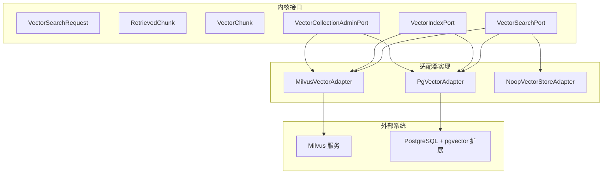
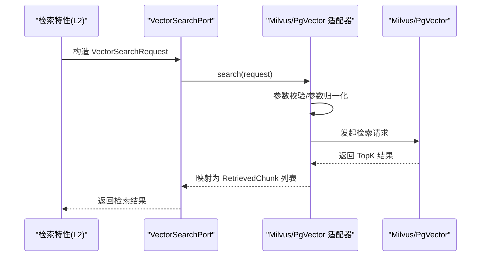
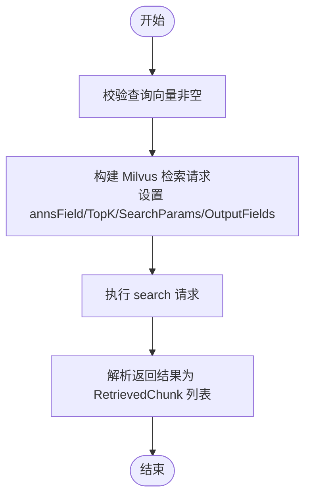
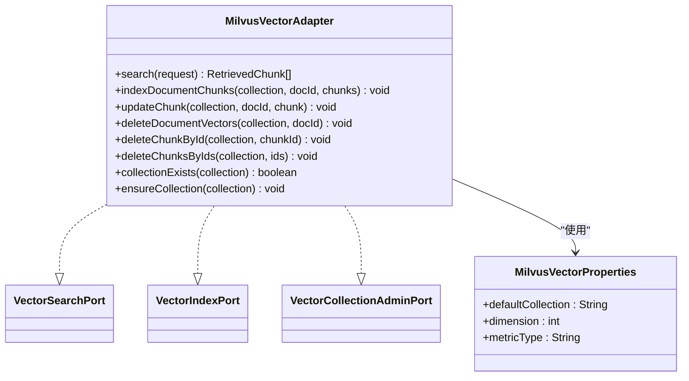
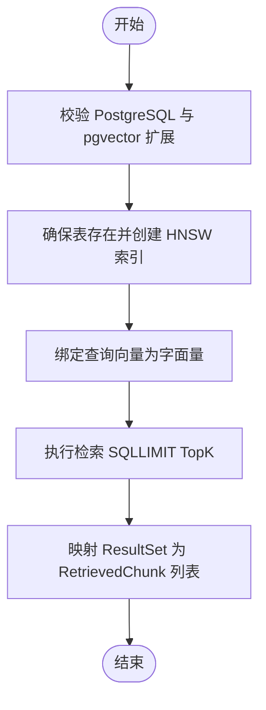
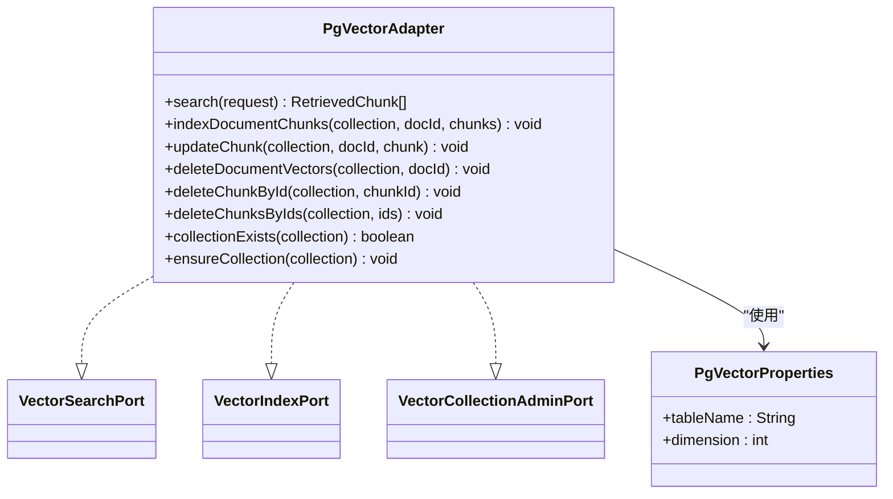
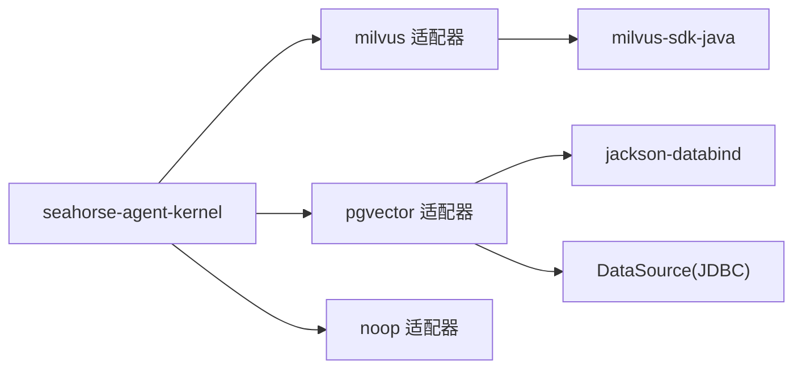

# 向量数据库适配器

<cite>
**本文引用的文件**
- [MilvusVectorAdapter.java](file://seahorse-agent-adapter-vector-milvus/src/main/java/com/miracle/ai/seahorse/agent/adapters/vector/milvus/MilvusVectorAdapter.java)
- [MilvusVectorProperties.java](file://seahorse-agent-adapter-vector-milvus/src/main/java/com/miracle/ai/seahorse/agent/adapters/vector/milvus/MilvusVectorProperties.java)
- [PgVectorAdapter.java](file://seahorse-agent-adapter-vector-pgvector/src/main/java/com/miracle/ai/seahorse/agent/adapters/vector/pgvector/PgVectorAdapter.java)
- [PgVectorProperties.java](file://seahorse-agent-adapter-vector-pgvector/src/main/java/com/miracle/ai/seahorse/agent/adapters/vector/pgvector/PgVectorProperties.java)
- [NoopVectorStoreAdapter.java](file://seahorse-agent-adapter-vector-noop/src/main/java/com/miracle/ai/seahorse/agent/adapters/vector/noop/NoopVectorStoreAdapter.java)
- [VectorSearchPort.java](file://seahorse-agent-kernel/src/main/java/com/miracle/ai/seahorse/agent/ports/outbound/vector/VectorSearchPort.java)
- [VectorIndexPort.java](file://seahorse-agent-kernel/src/main/java/com/miracle/ai/seahorse/agent/ports/outbound/vector/VectorIndexPort.java)
- [VectorCollectionAdminPort.java](file://seahorse-agent-kernel/src/main/java/com/miracle/ai/seahorse/agent/ports/outbound/vector/VectorCollectionAdminPort.java)
- [VectorSearchRequest.java](file://seahorse-agent-kernel/src/main/java/com/miracle/ai/seahorse/agent/ports/outbound/vector/VectorSearchRequest.java)
- [RetrievedChunk.java](file://seahorse-agent-kernel/src/main/java/com/miracle/ai/seahorse/agent/kernel/domain/retrieval/RetrievedChunk.java)
- [VectorChunk.java](file://seahorse-agent-kernel/src/main/java/com/miracle/ai/seahorse/agent/kernel/domain/vector/VectorChunk.java)
- [milvus-stack-2.6.6.compose.yaml](file://resources/docker/milvus-stack-2.6.6.compose.yaml)
- [application.properties](file://seahorse-agent-spring-boot-starter/src/main/resources/application.properties)
- [milvus 适配器 pom.xml](file://seahorse-agent-adapter-vector-milvus/pom.xml)
- [pgvector 适配器 pom.xml](file://seahorse-agent-adapter-vector-pgvector/pom.xml)
</cite>

## 目录
1. [简介](#简介)
2. [项目结构](#项目结构)
3. [核心组件](#核心组件)
4. [架构总览](#架构总览)
5. [详细组件分析](#详细组件分析)
6. [依赖分析](#依赖分析)
7. [性能考虑](#性能考虑)
8. [故障排查指南](#故障排查指南)
9. [结论](#结论)
10. [附录](#附录)

## 简介
本文件面向向量数据库适配器的技术文档，聚焦于 Milvus 向量数据库适配器与 PgVector 向量扩展适配器的实现机制。内容涵盖：
- 向量索引创建、相似度搜索与批量操作的实现原理
- 向量维度配置、距离计算算法与索引优化策略
- 向量检索性能调优、内存管理与查询缓存机制
- 向量数据的版本控制、增量更新与批量导入
- 方案选型建议与性能监控方法

## 项目结构
本项目采用“内核接口 + 多适配器”的分层设计：上层仅依赖统一的向量端口接口，下层通过适配器对接不同后端（Milvus、PgVector、空实现）。

图示来源
- [MilvusVectorAdapter.java:56-319](file://seahorse-agent-adapter-vector-milvus/src/main/java/com/miracle/ai/seahorse/agent/adapters/vector/milvus/MilvusVectorAdapter.java#L56-L319)
- [PgVectorAdapter.java:48-331](file://seahorse-agent-adapter-vector-pgvector/src/main/java/com/miracle/ai/seahorse/agent/adapters/vector/pgvector/PgVectorAdapter.java#L48-L331)
- [VectorSearchPort.java:30-39](file://seahorse-agent-kernel/src/main/java/com/miracle/ai/seahorse/agent/ports/outbound/vector/VectorSearchPort.java#L30-L39)
- [VectorIndexPort.java:30-73](file://seahorse-agent-kernel/src/main/java/com/miracle/ai/seahorse/agent/ports/outbound/vector/VectorIndexPort.java#L30-L73)
- [VectorCollectionAdminPort.java:25-41](file://seahorse-agent-kernel/src/main/java/com/miracle/ai/seahorse/agent/ports/outbound/vector/VectorCollectionAdminPort.java#L25-L41)

章节来源
- [VectorSearchRequest.java:35-52](file://seahorse-agent-kernel/src/main/java/com/miracle/ai/seahorse/agent/ports/outbound/vector/VectorSearchRequest.java#L35-L52)
- [RetrievedChunk.java:34-50](file://seahorse-agent-kernel/src/main/java/com/miracle/ai/seahorse/agent/kernel/domain/retrieval/RetrievedChunk.java#L34-L50)
- [VectorChunk.java:35-62](file://seahorse-agent-kernel/src/main/java/com/miracle/ai/seahorse/agent/kernel/domain/vector/VectorChunk.java#L35-L62)

## 核心组件
- 统一检索请求与结果模型
  - 检索请求：包含集合名、查询文本、查询向量、返回条数与过滤条件
  - 检索结果：包含分片 ID、文本内容与得分
  - 写入单元：包含分片 ID、索引序号、文本内容、业务元数据与向量
- 适配器职责
  - VectorSearchPort：执行相似度搜索
  - VectorIndexPort：写入/更新/删除向量索引（支持批量）
  - VectorCollectionAdminPort：集合存在性检查与确保创建

章节来源
- [VectorSearchRequest.java:35-52](file://seahorse-agent-kernel/src/main/java/com/miracle/ai/seahorse/agent/ports/outbound/vector/VectorSearchRequest.java#L35-L52)
- [RetrievedChunk.java:34-50](file://seahorse-agent-kernel/src/main/java/com/miracle/ai/seahorse/agent/kernel/domain/retrieval/RetrievedChunk.java#L34-L50)
- [VectorChunk.java:35-62](file://seahorse-agent-kernel/src/main/java/com/miracle/ai/seahorse/agent/kernel/domain/vector/VectorChunk.java#L35-L62)
- [VectorSearchPort.java:30-39](file://seahorse-agent-kernel/src/main/java/com/miracle/ai/seahorse/agent/ports/outbound/vector/VectorSearchPort.java#L30-L39)
- [VectorIndexPort.java:30-73](file://seahorse-agent-kernel/src/main/java/com/miracle/ai/seahorse/agent/ports/outbound/vector/VectorIndexPort.java#L30-L73)
- [VectorCollectionAdminPort.java:25-41](file://seahorse-agent-kernel/src/main/java/com/miracle/ai/seahorse/agent/ports/outbound/vector/VectorCollectionAdminPort.java#L25-L41)

## 架构总览
适配器通过统一端口屏蔽底层差异，Milvus 适配器使用官方 Java SDK；PgVector 适配器基于 JDBC 与原生命令实现。

图示来源
- [MilvusVectorAdapter.java:76-90](file://seahorse-agent-adapter-vector-milvus/src/main/java/com/miracle/ai/seahorse/agent/adapters/vector/milvus/MilvusVectorAdapter.java#L76-L90)
- [PgVectorAdapter.java:67-80](file://seahorse-agent-adapter-vector-pgvector/src/main/java/com/miracle/ai/seahorse/agent/adapters/vector/pgvector/PgVectorAdapter.java#L67-L80)
- [VectorSearchRequest.java:35-52](file://seahorse-agent-kernel/src/main/java/com/miracle/ai/seahorse/agent/ports/outbound/vector/VectorSearchRequest.java#L35-L52)

## 详细组件分析

### Milvus 向量适配器
- 实现要点
  - 固定集合字段：id、content、metadata、embedding，满足默认 RAG 行为一致性
  - 集合 Schema：主键 id、文本 content、JSON 元数据、FloatVector 向量
  - 索引策略：HNSW，MetricType 来自配置，索引参数包含 M、efConstruction 等
  - 检索参数：设置 metric_type 与 ef（如 128），输出 id、content、metadata
  - 写入/更新/删除：insert/upsert/delete，支持按 doc_id 或 chunk_id 删除
  - 集合管理：存在性检查、按需创建集合并配置索引
- 关键流程

图示来源
- [MilvusVectorAdapter.java:76-90](file://seahorse-agent-adapter-vector-milvus/src/main/java/com/miracle/ai/seahorse/agent/adapters/vector/milvus/MilvusVectorAdapter.java#L76-L90)
- [MilvusVectorAdapter.java:172-181](file://seahorse-agent-adapter-vector-milvus/src/main/java/com/miracle/ai/seahorse/agent/adapters/vector/milvus/MilvusVectorAdapter.java#L172-L181)

- 类关系与职责

图示来源
- [MilvusVectorAdapter.java:56-319](file://seahorse-agent-adapter-vector-milvus/src/main/java/com/miracle/ai/seahorse/agent/adapters/vector/milvus/MilvusVectorAdapter.java#L56-L319)
- [MilvusVectorProperties.java:29-38](file://seahorse-agent-adapter-vector-milvus/src/main/java/com/miracle/ai/seahorse/agent/adapters/vector/milvus/MilvusVectorProperties.java#L29-L38)
- [VectorSearchPort.java:30-39](file://seahorse-agent-kernel/src/main/java/com/miracle/ai/seahorse/agent/ports/outbound/vector/VectorSearchPort.java#L30-L39)
- [VectorIndexPort.java:30-73](file://seahorse-agent-kernel/src/main/java/com/miracle/ai/seahorse/agent/ports/outbound/vector/VectorIndexPort.java#L30-L73)
- [VectorCollectionAdminPort.java:25-41](file://seahorse-agent-kernel/src/main/java/com/miracle/ai/seahorse/agent/ports/outbound/vector/VectorCollectionAdminPort.java#L25-L41)

- 索引创建与优化
  - 集合 Schema：VarChar 主键 id、VarChar content、JSON metadata、FloatVector embedding（维度来自配置）
  - 索引类型：HNSW，MetricType 由配置决定，索引参数包含 M、efConstruction、mmap.enabled
  - 一致性级别：BOUNDED
  - 检索参数：metric_type 与 ef（例如 128）

- 相似度搜索
  - 输入：VectorSearchRequest.vector
  - 输出：RetrievedChunk 列表（含 id、text、score）

- 批量操作
  - indexDocumentChunks：批量插入（insert）
  - updateChunk：单条 upsert
  - deleteDocumentVectors / deleteChunkById / deleteChunksByIds：按 doc_id 或 id 删除

- 维度与距离
  - 维度：由 MilvusVectorProperties.dimension 提供
  - 距离：由 MilvusVectorProperties.metricType 控制（如 COSINE）

- 集成与部署
  - Docker Compose 提供 Milvus 单机版与可视化工具 Attu

章节来源
- [MilvusVectorAdapter.java:56-319](file://seahorse-agent-adapter-vector-milvus/src/main/java/com/miracle/ai/seahorse/agent/adapters/vector/milvus/MilvusVectorAdapter.java#L56-L319)
- [MilvusVectorProperties.java:29-38](file://seahorse-agent-adapter-vector-milvus/src/main/java/com/miracle/ai/seahorse/agent/adapters/vector/milvus/MilvusVectorProperties.java#L29-L38)
- [milvus-stack-2.6.6.compose.yaml:52-89](file://resources/docker/milvus-stack-2.6.6.compose.yaml#L52-L89)

### PgVector 向量适配器
- 实现要点
  - 表结构：id、content、metadata(jsonb)、embedding(vector)
  - 索引：HNSW，向量运算符为 cosine_ops
  - 检索：使用 1 - (embedding <=> ?::vector) 计算余弦相似度
  - 写入：upsert（ON CONFLICT），支持批量
  - 删除：按 doc_id 或 id 删除
  - 集合管理：检查 PostgreSQL 与 pgvector 扩展，自动建表与建索引
- 关键流程

图示来源
- [PgVectorAdapter.java:140-161](file://seahorse-agent-adapter-vector-pgvector/src/main/java/com/miracle/ai/seahorse/agent/adapters/vector/pgvector/PgVectorAdapter.java#L140-L161)
- [PgVectorAdapter.java:163-178](file://seahorse-agent-adapter-vector-pgvector/src/main/java/com/miracle/ai/seahorse/agent/adapters/vector/pgvector/PgVectorAdapter.java#L163-L178)
- [PgVectorAdapter.java:263-266](file://seahorse-agent-adapter-vector-pgvector/src/main/java/com/miracle/ai/seahorse/agent/adapters/vector/pgvector/PgVectorAdapter.java#L263-L266)

- 类关系与职责

图示来源
- [PgVectorAdapter.java:48-331](file://seahorse-agent-adapter-vector-pgvector/src/main/java/com/miracle/ai/seahorse/agent/adapters/vector/pgvector/PgVectorAdapter.java#L48-L331)
- [PgVectorProperties.java:28-38](file://seahorse-agent-adapter-vector-pgvector/src/main/java/com/miracle/ai/seahorse/agent/adapters/vector/pgvector/PgVectorProperties.java#L28-L38)
- [VectorSearchPort.java:30-39](file://seahorse-agent-kernel/src/main/java/com/miracle/ai/seahorse/agent/ports/outbound/vector/VectorSearchPort.java#L30-L39)
- [VectorIndexPort.java:30-73](file://seahorse-agent-kernel/src/main/java/com/miracle/ai/seahorse/agent/ports/outbound/vector/VectorIndexPort.java#L30-L73)
- [VectorCollectionAdminPort.java:25-41](file://seahorse-agent-kernel/src/main/java/com/miracle/ai/seahorse/agent/ports/outbound/vector/VectorCollectionAdminPort.java#L25-L41)

- 索引创建与优化
  - 表：id 主键、content 文本、metadata JSONB、embedding 向量（维度来自配置）
  - 索引：HNSW，cosine_ops，索引名固定
  - 检索：hnsw.ef_search 设置为 200（通过 SQL SET）

- 相似度搜索
  - 使用内置向量运算符 <=> 计算余弦距离，再映射为相似度

- 批量操作
  - indexDocumentChunks：批量 upsert（addBatch + executeBatch）
  - updateChunk：单条 upsert
  - deleteDocumentVectors / deleteChunkById / deleteChunksByIds：按条件删除

- 维度与距离
  - 维度：由 PgVectorProperties.dimension 提供
  - 距离：cosine_ops（余弦相似度）

章节来源
- [PgVectorAdapter.java:48-331](file://seahorse-agent-adapter-vector-pgvector/src/main/java/com/miracle/ai/seahorse/agent/adapters/vector/pgvector/PgVectorAdapter.java#L48-L331)
- [PgVectorProperties.java:28-38](file://seahorse-agent-adapter-vector-pgvector/src/main/java/com/miracle/ai/seahorse/agent/adapters/vector/pgvector/PgVectorProperties.java#L28-L38)

### 空适配器（Noop）
- 场景：禁用向量检索时使用，写入仅记录集合存在性，检索始终返回空列表
- 适用：开发调试、降级回退

章节来源
- [NoopVectorStoreAdapter.java:36-81](file://seahorse-agent-adapter-vector-noop/src/main/java/com/miracle/ai/seahorse/agent/adapters/vector/noop/NoopVectorStoreAdapter.java#L36-L81)

## 依赖分析
- 适配器对内核的依赖
  - 适配器均实现统一端口，隔离具体实现差异
- 外部依赖
  - Milvus 适配器依赖官方 Java SDK
  - PgVector 适配器依赖 Jackson 与 JDBC 数据源
- 运行模式
  - 应用启动模式为 kernel

图示来源
- [milvus 适配器 pom.xml:18-28](file://seahorse-agent-adapter-vector-milvus/pom.xml#L18-L28)
- [pgvector 适配器 pom.xml:18-28](file://seahorse-agent-adapter-vector-pgvector/pom.xml#L18-L28)
- [application.properties:1-2](file://seahorse-agent-spring-boot-starter/src/main/resources/application.properties#L1-L2)

章节来源
- [milvus 适配器 pom.xml:18-28](file://seahorse-agent-adapter-vector-milvus/pom.xml#L18-L28)
- [pgvector 适配器 pom.xml:18-28](file://seahorse-agent-adapter-vector-pgvector/pom.xml#L18-L28)
- [application.properties:1-2](file://seahorse-agent-spring-boot-starter/src/main/resources/application.properties#L1-L2)

## 性能考虑
- 索引与参数
  - Milvus：HNSW 索引，M、efConstruction、ef（检索时的 ef）等参数影响吞吐与精度
  - PgVector：HNSW + cosine_ops，hnsw.ef_search 影响检索速度与召回
- 维度与数据类型
  - 严格校验维度一致性，避免运行期错误
  - Milvus 使用 FloatVector，PgVector 使用 vector 类型
- 批量写入
  - PgVector 支持 addBatch + executeBatch，显著提升导入效率
  - Milvus insert 支持批量
- 缓存与连接
  - PgVector 适配器复用连接与预编译语句，减少开销
  - Milvus 客户端应合理复用连接与批处理
- 查询优化
  - TopK 合理设置，避免过大导致 IO 压力
  - 过滤条件尽量走索引字段，减少全表扫描

## 故障排查指南
- 常见问题定位
  - 维度不匹配：抛出非法参数异常，检查 embedding 维度与配置一致
  - 集合/表不存在：collectionExists/ensureCollection 失败，确认后端可用与权限
  - PgVector 扩展缺失：requirePgVectorExtension 抛出异常，需安装 pgvector 扩展
  - PostgreSQL 校验失败：requirePostgreSql 抛出异常，确认连接目标为 PostgreSQL
- 错误包装
  - 适配器内部捕获底层异常并包装为运行时异常，便于上层感知
- 排查步骤
  - 检查配置项（Milvus metricType、PgVector tableName/dimension）
  - 检查后端健康状态（Milvus 服务、Pg 数据库）
  - 查看日志与异常栈，定位具体 SQL 或 RPC 调用

章节来源
- [MilvusVectorAdapter.java:266-274](file://seahorse-agent-adapter-vector-milvus/src/main/java/com/miracle/ai/seahorse/agent/adapters/vector/milvus/MilvusVectorAdapter.java#L266-L274)
- [PgVectorAdapter.java:230-244](file://seahorse-agent-adapter-vector-pgvector/src/main/java/com/miracle/ai/seahorse/agent/adapters/vector/pgvector/PgVectorAdapter.java#L230-L244)
- [PgVectorAdapter.java:212-222](file://seahorse-agent-adapter-vector-pgvector/src/main/java/com/miracle/ai/seahorse/agent/adapters/vector/pgvector/PgVectorAdapter.java#L212-L222)

## 结论
- 通过统一端口与适配器模式，系统实现了对 Milvus 与 PgVector 的无缝替换
- Milvus 适合高吞吐、分布式场景；PgVector 适合与现有 PostgreSQL 生态深度集成
- 合理配置维度、索引参数与 TopK，结合批量导入与连接池，可获得稳定性能
- 建议在生产中启用监控与日志追踪，持续评估检索延迟与吞吐指标

## 附录
- 部署参考
  - Milvus 单机与可视化：参见 Compose 文件
- 配置要点
  - Milvus：defaultCollection、dimension、metricType
  - PgVector：tableName、dimension

章节来源
- [milvus-stack-2.6.6.compose.yaml:52-89](file://resources/docker/milvus-stack-2.6.6.compose.yaml#L52-L89)
- [MilvusVectorProperties.java:29-38](file://seahorse-agent-adapter-vector-milvus/src/main/java/com/miracle/ai/seahorse/agent/adapters/vector/milvus/MilvusVectorProperties.java#L29-L38)
- [PgVectorProperties.java:28-38](file://seahorse-agent-adapter-vector-pgvector/src/main/java/com/miracle/ai/seahorse/agent/adapters/vector/pgvector/PgVectorProperties.java#L28-L38)