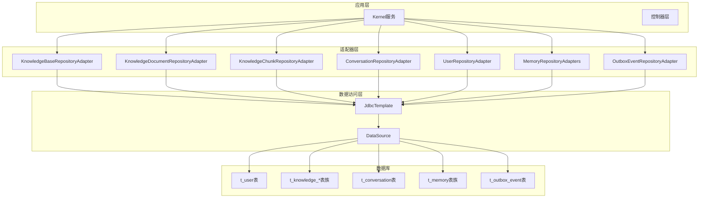
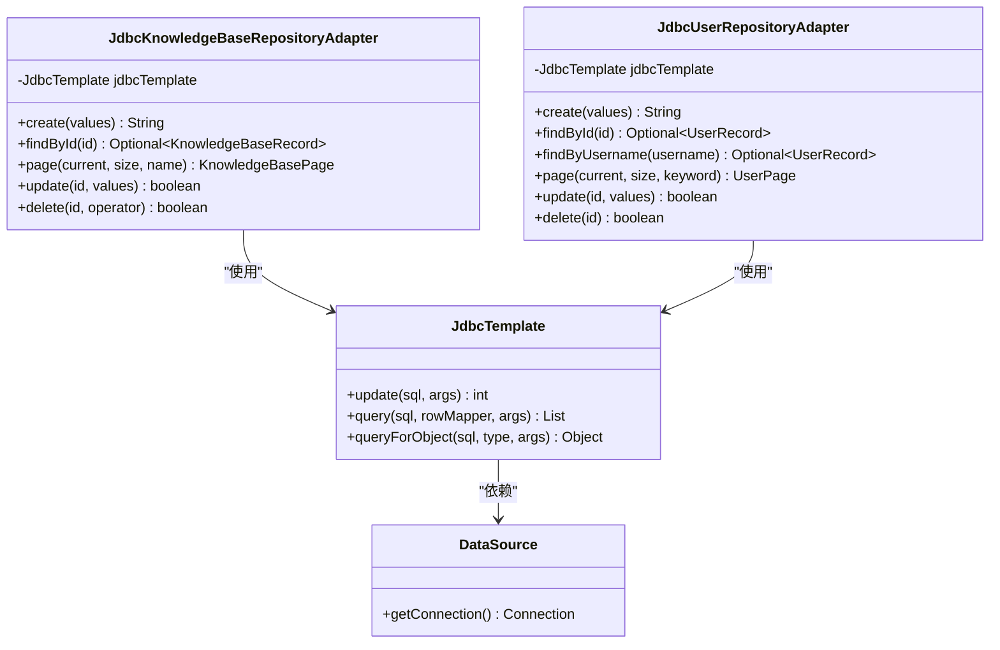
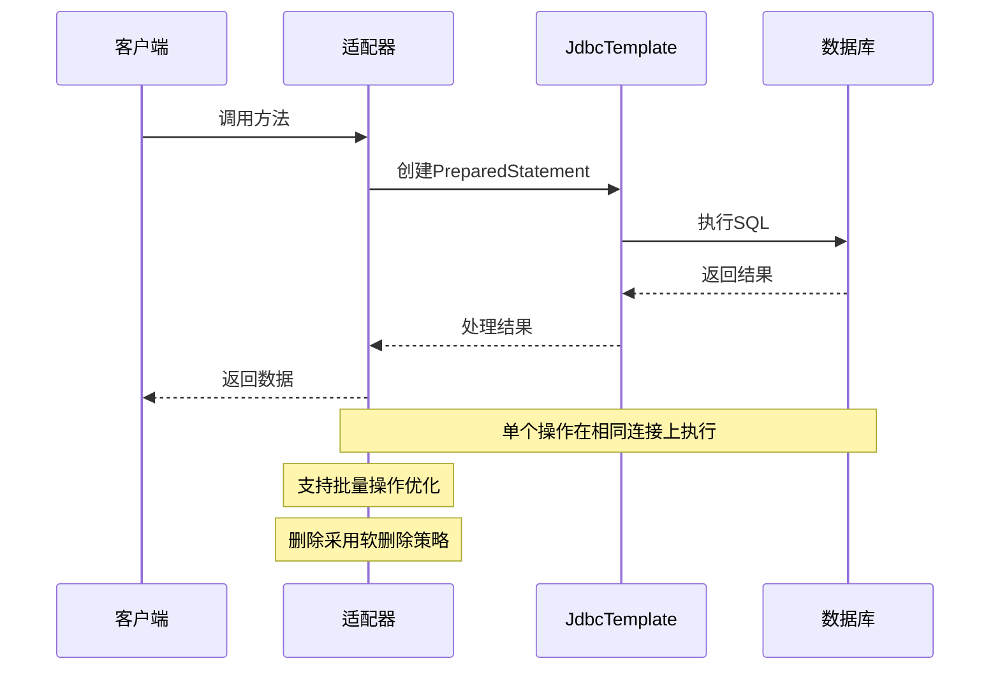
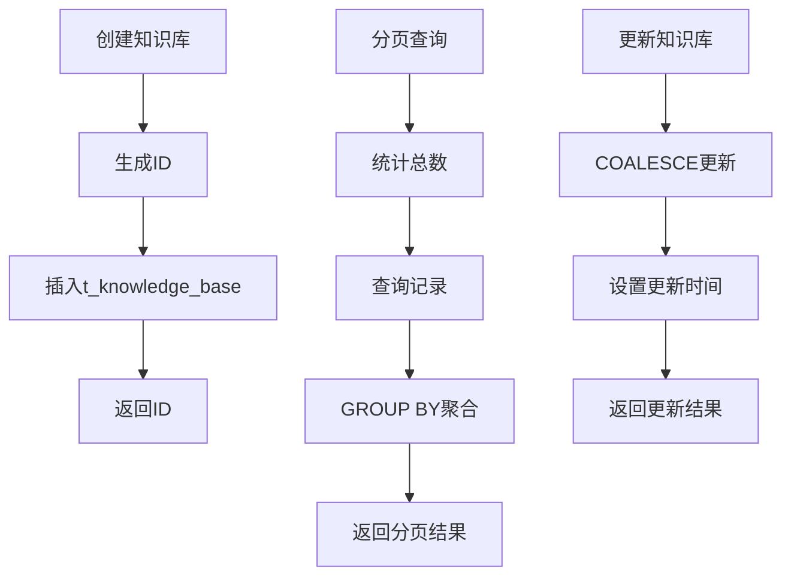
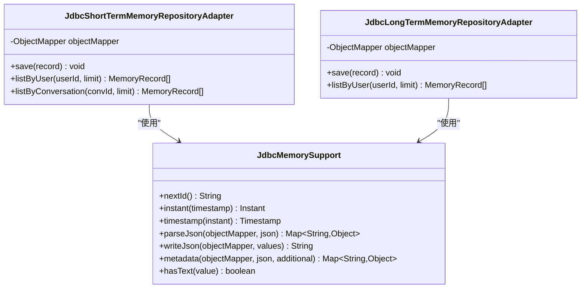
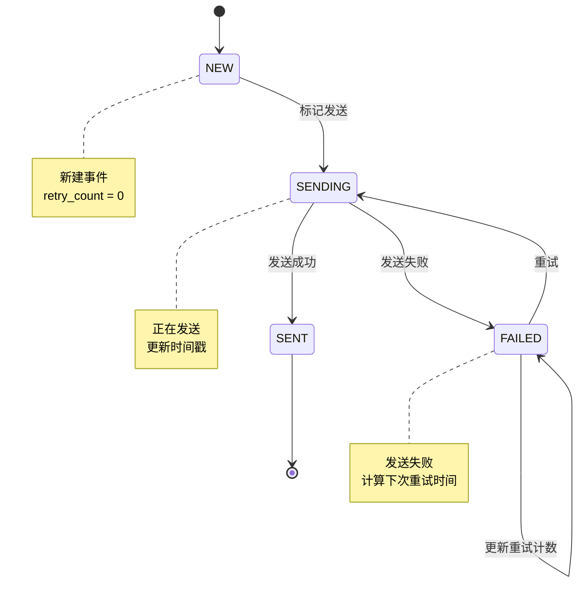
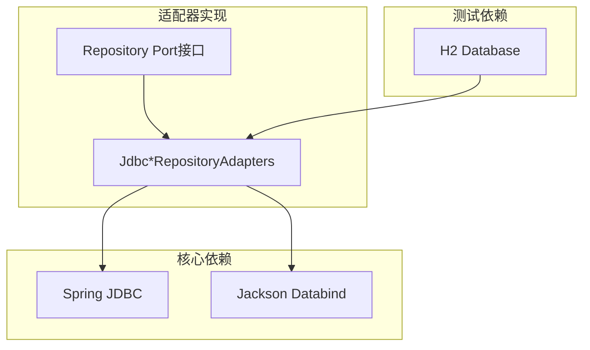

# 数据库适配器

<cite>
**本文档引用的文件**
- [pom.xml](file://seahorse-agent-adapter-repository-jdbc/pom.xml)
- [JdbcMemorySupport.java](file://seahorse-agent-adapter-repository-jdbc/src/main/java/com/miracle/ai/seahorse/agent/adapters/repository/jdbc/JdbcMemorySupport.java)
- [schema_pg.sql](file://resources/database/schema_pg.sql)
- [init_data_pg.sql](file://resources/database/init_data_pg.sql)
- [JdbcKnowledgeBaseRepositoryAdapter.java](file://seahorse-agent-adapter-repository-jdbc/src/main/java/com/miracle/ai/seahorse/agent/adapters/repository/jdbc/JdbcKnowledgeBaseRepositoryAdapter.java)
- [JdbcConversationRepositoryAdapter.java](file://seahorse-agent-adapter-repository-jdbc/src/main/java/com/miracle/ai/seahorse/agent/adapters/repository/jdbc/JdbcConversationRepositoryAdapter.java)
- [JdbcUserRepositoryAdapter.java](file://seahorse-agent-adapter-repository-jdbc/src/main/java/com/miracle/ai/seahorse/agent/adapters/repository/jdbc/JdbcUserRepositoryAdapter.java)
- [JdbcKnowledgeChunkRepositoryAdapter.java](file://seahorse-agent-adapter-repository-jdbc/src/main/java/com/miracle/ai/seahorse/agent/adapters/repository/jdbc/JdbcKnowledgeChunkRepositoryAdapter.java)
- [JdbcKnowledgeDocumentRepositoryAdapter.java](file://seahorse-agent-adapter-repository-jdbc/src/main/java/com/miracle/ai/seahorse/agent/adapters/repository/jdbc/JdbcKnowledgeDocumentRepositoryAdapter.java)
- [JdbcShortTermMemoryRepositoryAdapter.java](file://seahorse-agent-adapter-repository-jdbc/src/main/java/com/miracle/ai/seahorse/agent/adapters/repository/jdbc/JdbcShortTermMemoryRepositoryAdapter.java)
- [JdbcLongTermMemoryRepositoryAdapter.java](file://seahorse-agent-adapter-repository-jdbc/src/main/java/com/miracle/ai/seahorse/agent/adapters/repository/jdbc/JdbcLongTermMemoryRepositoryAdapter.java)
- [JdbcOutboxEventRepositoryAdapter.java](file://seahorse-agent-adapter-repository-jdbc/src/main/java/com/miracle/ai/seahorse/agent/adapters/repository/jdbc/JdbcOutboxEventRepositoryAdapter.java)
- [JdbcKnowledgeBaseRepositoryAdapterTests.java](file://seahorse-agent-adapter-repository-jdbc/src/test/java/com/miracle/ai/seahorse/agent/adapters/repository/jdbc/JdbcKnowledgeBaseRepositoryAdapterTests.java)
</cite>

## 目录
1. [简介](#简介)
2. [项目结构](#项目结构)
3. [核心组件](#核心组件)
4. [架构概览](#架构概览)
5. [详细组件分析](#详细组件分析)
6. [依赖关系分析](#依赖关系分析)
7. [性能考虑](#性能考虑)
8. [故障排除指南](#故障排除指南)
9. [结论](#结论)
10. [附录](#附录)

## 简介
本文件为数据库适配器的详细技术文档，重点介绍基于JDBC的仓库适配器实现原理及各类Repository接口的具体实现。文档涵盖数据库连接管理、事务处理和SQL映射机制，解释知识库、会话、用户以及内存管理等实体的仓储模式实现，并提供数据库性能优化策略、连接池配置和查询优化技巧。同时，文档还介绍了数据库迁移管理、版本升级和数据备份恢复机制，说明如何通过Repository模式实现数据访问层的统一抽象。

## 项目结构
JDBC仓库适配器模块位于 `seahorse-agent-adapter-repository-jdbc` 目录下，采用标准的Maven多模块结构。该模块依赖Spring JDBC进行数据库操作，并使用Jackson进行JSON序列化/反序列化。测试模块使用H2内存数据库进行单元测试验证。

```mermaid
graph TB
subgraph "JDBC适配器模块"
A[pom.xml] --> B[Jdbc*RepositoryAdapters]
B --> C[JdbcMemorySupport]
B --> D[测试用例]
end
subgraph "数据库脚本"
E[schema_pg.sql]
F[init_data_pg.sql]
end
subgraph "外部依赖"
G[Spring JDBC]
H[Jackson]
I[H2(测试)]
end
B --> G
B --> H
D --> I
A --> G
A --> H
A --> I
```

**图表来源**
- [pom.xml:18-36](file://seahorse-agent-adapter-repository-jdbc/pom.xml#L18-L36)
- [JdbcKnowledgeBaseRepositoryAdapter.java:25-35](file://seahorse-agent-adapter-repository-jdbc/src/main/java/com/miracle/ai/seahorse/agent/adapters/repository/jdbc/JdbcKnowledgeBaseRepositoryAdapter.java#L25-L35)

**章节来源**
- [pom.xml:1-39](file://seahorse-agent-adapter-repository-jdbc/pom.xml#L1-L39)

## 核心组件
JDBC仓库适配器模块包含以下核心组件：

### 数据库支持类
- **JdbcMemorySupport**: 提供内存管理相关的辅助功能，包括ID生成、时间戳转换、JSON解析和元数据处理

### 知识库相关适配器
- **JdbcKnowledgeBaseRepositoryAdapter**: 知识库基础信息管理
- **JdbcKnowledgeDocumentRepositoryAdapter**: 知识库文档管理
- **JdbcKnowledgeChunkRepositoryAdapter**: 文档分块管理

### 会话与用户适配器
- **JdbcConversationRepositoryAdapter**: 会话管理
- **JdbcUserRepositoryAdapter**: 用户管理

### 内存管理适配器
- **JdbcShortTermMemoryRepositoryAdapter**: 短期记忆管理
- **JdbcLongTermMemoryRepositoryAdapter**: 长期记忆管理

### 消息队列适配器
- **JdbcOutboxEventRepositoryAdapter**: 事件出站消息管理

**章节来源**
- [JdbcMemorySupport.java:30-80](file://seahorse-agent-adapter-repository-jdbc/src/main/java/com/miracle/ai/seahorse/agent/adapters/repository/jdbc/JdbcMemorySupport.java#L30-L80)
- [JdbcKnowledgeBaseRepositoryAdapter.java:40-100](file://seahorse-agent-adapter-repository-jdbc/src/main/java/com/miracle/ai/seahorse/agent/adapters/repository/jdbc/JdbcKnowledgeBaseRepositoryAdapter.java#L40-L100)
- [JdbcKnowledgeDocumentRepositoryAdapter.java:49-164](file://seahorse-agent-adapter-repository-jdbc/src/main/java/com/miracle/ai/seahorse/agent/adapters/repository/jdbc/JdbcKnowledgeDocumentRepositoryAdapter.java#L49-L164)
- [JdbcKnowledgeChunkRepositoryAdapter.java:46-130](file://seahorse-agent-adapter-repository-jdbc/src/main/java/com/miracle/ai/seahorse/agent/adapters/repository/jdbc/JdbcKnowledgeChunkRepositoryAdapter.java#L46-L130)
- [JdbcConversationRepositoryAdapter.java:36-78](file://seahorse-agent-adapter-repository-jdbc/src/main/java/com/miracle/ai/seahorse/agent/adapters/repository/jdbc/JdbcConversationRepositoryAdapter.java#L36-L78)
- [JdbcUserRepositoryAdapter.java:39-47](file://seahorse-agent-adapter-repository-jdbc/src/main/java/com/miracle/ai/seahorse/agent/adapters/repository/jdbc/JdbcUserRepositoryAdapter.java#L39-L47)
- [JdbcShortTermMemoryRepositoryAdapter.java:34-42](file://seahorse-agent-adapter-repository-jdbc/src/main/java/com/miracle/ai/seahorse/agent/adapters/repository/jdbc/JdbcShortTermMemoryRepositoryAdapter.java#L34-L42)
- [JdbcLongTermMemoryRepositoryAdapter.java:34-42](file://seahorse-agent-adapter-repository-jdbc/src/main/java/com/miracle/ai/seahorse/agent/adapters/repository/jdbc/JdbcLongTermMemoryRepositoryAdapter.java#L34-L42)
- [JdbcOutboxEventRepositoryAdapter.java:40-79](file://seahorse-agent-adapter-repository-jdbc/src/main/java/com/miracle/ai/seahorse/agent/adapters/repository/jdbc/JdbcOutboxEventRepositoryAdapter.java#L40-L79)

## 架构概览
JDBC仓库适配器采用Repository模式实现数据访问层的统一抽象，所有适配器都实现相应的端口接口，通过Spring JDBC的JdbcTemplate进行数据库操作。



**图表来源**
- [JdbcKnowledgeBaseRepositoryAdapter.java:96-100](file://seahorse-agent-adapter-repository-jdbc/src/main/java/com/miracle/ai/seahorse/agent/adapters/repository/jdbc/JdbcKnowledgeBaseRepositoryAdapter.java#L96-L100)
- [JdbcUserRepositoryAdapter.java:43-47](file://seahorse-agent-adapter-repository-jdbc/src/main/java/com/miracle/ai/seahorse/agent/adapters/repository/jdbc/JdbcUserRepositoryAdapter.java#L43-L47)
- [JdbcKnowledgeDocumentRepositoryAdapter.java:160-164](file://seahorse-agent-adapter-repository-jdbc/src/main/java/com/miracle/ai/seahorse/agent/adapters/repository/jdbc/JdbcKnowledgeDocumentRepositoryAdapter.java#L160-L164)

## 详细组件分析

### 数据库连接管理
JDBC适配器通过Spring JDBC的JdbcTemplate实现数据库连接管理，所有适配器都依赖DataSource进行连接获取和释放。



**图表来源**
- [JdbcKnowledgeBaseRepositoryAdapter.java:96-100](file://seahorse-agent-adapter-repository-jdbc/src/main/java/com/miracle/ai/seahorse/agent/adapters/repository/jdbc/JdbcKnowledgeBaseRepositoryAdapter.java#L96-L100)
- [JdbcUserRepositoryAdapter.java:43-47](file://seahorse-agent-adapter-repository-jdbc/src/main/java/com/miracle/ai/seahorse/agent/adapters/repository/jdbc/JdbcUserRepositoryAdapter.java#L43-L47)

### 事务处理机制
JDBC适配器中的事务处理遵循以下原则：
- 单个操作在同一个JDBC连接上执行，保证原子性
- 批量操作使用JdbcTemplate.batchUpdate进行优化
- 删除操作采用软删除策略（设置deleted标志而非物理删除）



**图表来源**
- [JdbcKnowledgeChunkRepositoryAdapter.java:137-142](file://seahorse-agent-adapter-repository-jdbc/src/main/java/com/miracle/ai/seahorse/agent/adapters/repository/jdbc/JdbcKnowledgeChunkRepositoryAdapter.java#L137-L142)
- [JdbcKnowledgeDocumentRepositoryAdapter.java:313-317](file://seahorse-agent-adapter-repository-jdbc/src/main/java/com/miracle/ai/seahorse/agent/adapters/repository/jdbc/JdbcKnowledgeDocumentRepositoryAdapter.java#L313-L317)

### SQL映射机制
每个适配器都实现了特定的SQL映射机制：

#### 知识库管理


**图表来源**
- [JdbcKnowledgeBaseRepositoryAdapter.java:102-117](file://seahorse-agent-adapter-repository-jdbc/src/main/java/com/miracle/ai/seahorse/agent/adapters/repository/jdbc/JdbcKnowledgeBaseRepositoryAdapter.java#L102-L117)
- [JdbcKnowledgeBaseRepositoryAdapter.java:135-143](file://seahorse-agent-adapter-repository-jdbc/src/main/java/com/miracle/ai/seahorse/agent/adapters/repository/jdbc/JdbcKnowledgeBaseRepositoryAdapter.java#L135-L143)
- [JdbcKnowledgeBaseRepositoryAdapter.java:159-168](file://seahorse-agent-adapter-repository-jdbc/src/main/java/com/miracle/ai/seahorse/agent/adapters/repository/jdbc/JdbcKnowledgeBaseRepositoryAdapter.java#L159-L168)

#### 文档管理
文档管理包含完整的生命周期管理：
- 待处理状态：pending
- 处理中状态：running  
- 成功状态：success
- 失败状态：failed

**章节来源**
- [JdbcKnowledgeDocumentRepositoryAdapter.java:51-55](file://seahorse-agent-adapter-repository-jdbc/src/main/java/com/miracle/ai/seahorse/agent/adapters/repository/jdbc/JdbcKnowledgeDocumentRepositoryAdapter.java#L51-L55)
- [JdbcKnowledgeDocumentRepositoryAdapter.java:109-123](file://seahorse-agent-adapter-repository-jdbc/src/main/java/com/miracle/ai/seahorse/agent/adapters/repository/jdbc/JdbcKnowledgeDocumentRepositoryAdapter.java#L109-L123)

### 内存管理实现
内存管理适配器通过JdbcMemorySupport类提供统一的内存数据处理能力：



**图表来源**
- [JdbcMemorySupport.java:38-80](file://seahorse-agent-adapter-repository-jdbc/src/main/java/com/miracle/ai/seahorse/agent/adapters/repository/jdbc/JdbcMemorySupport.java#L38-L80)
- [JdbcShortTermMemoryRepositoryAdapter.java:39-42](file://seahorse-agent-adapter-repository-jdbc/src/main/java/com/miracle/ai/seahorse/agent/adapters/repository/jdbc/JdbcShortTermMemoryRepositoryAdapter.java#L39-L42)
- [JdbcLongTermMemoryRepositoryAdapter.java:39-42](file://seahorse-agent-adapter-repository-jdbc/src/main/java/com/miracle/ai/seahorse/agent/adapters/repository/jdbc/JdbcLongTermMemoryRepositoryAdapter.java#L39-L42)

**章节来源**
- [JdbcMemorySupport.java:52-75](file://seahorse-agent-adapter-repository-jdbc/src/main/java/com/miracle/ai/seahorse/agent/adapters/repository/jdbc/JdbcMemorySupport.java#L52-L75)
- [JdbcShortTermMemoryRepositoryAdapter.java:72-94](file://seahorse-agent-adapter-repository-jdbc/src/main/java/com/miracle/ai/seahorse/agent/adapters/repository/jdbc/JdbcShortTermMemoryRepositoryAdapter.java#L72-L94)
- [JdbcLongTermMemoryRepositoryAdapter.java:67-89](file://seahorse-agent-adapter-repository-jdbc/src/main/java/com/miracle/ai/seahorse/agent/adapters/repository/jdbc/JdbcLongTermMemoryRepositoryAdapter.java#L67-L89)

### 出站事件管理
JdbcOutboxEventRepositoryAdapter实现可靠的消息传递机制：



**图表来源**
- [JdbcOutboxEventRepositoryAdapter.java:49-73](file://seahorse-agent-adapter-repository-jdbc/src/main/java/com/miracle/ai/seahorse/agent/adapters/repository/jdbc/JdbcOutboxEventRepositoryAdapter.java#L49-L73)

**章节来源**
- [JdbcOutboxEventRepositoryAdapter.java:100-143](file://seahorse-agent-adapter-repository-jdbc/src/main/java/com/miracle/ai/seahorse/agent/adapters/repository/jdbc/JdbcOutboxEventRepositoryAdapter.java#L100-L143)

## 依赖关系分析



**图表来源**
- [pom.xml:18-36](file://seahorse-agent-adapter-repository-jdbc/pom.xml#L18-L36)

**章节来源**
- [pom.xml:1-39](file://seahorse-agent-adapter-repository-jdbc/pom.xml#L1-L39)

## 性能考虑

### 连接池配置建议
- **最大连接数**: 根据并发需求设置，建议为CPU核心数的2-4倍
- **最小空闲连接**: 保持10-20%的空闲连接
- **连接超时**: 设置合理的连接超时时间（30-60秒）
- **查询超时**: 为复杂查询设置超时限制

### 查询优化策略
1. **索引优化**
   - 为常用查询条件建立合适的索引
   - 使用复合索引优化多条件查询
   - 对JSON字段使用GIN索引

2. **分页优化**
   - 使用LIMIT和OFFSET进行分页
   - 避免使用SELECT *
   - 使用覆盖索引减少回表

3. **批量操作**
   - 使用batchUpdate进行批量插入
   - 合理控制批次大小（50-100条）

### 缓存策略
- **短期缓存**: 对频繁读取的配置信息进行缓存
- **查询结果缓存**: 对稳定不变的数据进行缓存
- **分布式缓存**: 使用Redis缓存热点数据

## 故障排除指南

### 常见问题诊断
1. **连接超时问题**
   - 检查数据库连接池配置
   - 监控数据库负载情况
   - 优化慢查询语句

2. **内存溢出问题**
   - 检查大对象的序列化处理
   - 优化批量操作的内存使用
   - 设置合理的分页大小

3. **事务冲突问题**
   - 检查长事务的执行时间
   - 优化锁竞争的SQL语句
   - 调整隔离级别

**章节来源**
- [JdbcKnowledgeBaseRepositoryAdapterTests.java:48-82](file://seahorse-agent-adapter-repository-jdbc/src/test/java/com/miracle/ai/seahorse/agent/adapters/repository/jdbc/JdbcKnowledgeBaseRepositoryAdapterTests.java#L48-L82)

## 结论
JDBC仓库适配器通过Repository模式实现了数据访问层的统一抽象，提供了完整的企业级数据库操作能力。该实现具有以下特点：

1. **标准化接口**: 所有适配器实现统一的端口接口，便于替换和扩展
2. **事务一致性**: 通过JDBC连接保证单个操作的原子性
3. **性能优化**: 采用批量操作、合理索引和缓存策略
4. **可维护性**: 清晰的代码结构和完善的测试覆盖

该适配器为SeaHorse Agent提供了稳定可靠的数据持久化能力，支持知识库、会话、用户和内存管理等核心业务场景。

## 附录

### 数据库迁移管理
- **版本升级**: 通过增量SQL脚本实现数据库版本升级
- **数据备份**: 定期备份关键业务数据
- **回滚策略**: 提供完整的回滚方案和数据恢复机制

### 配置参考
- **DataSource配置**: 包含连接URL、用户名、密码和连接池参数
- **JdbcTemplate配置**: 超时设置和异常处理配置
- **事务管理**: 基于注解的声明式事务配置