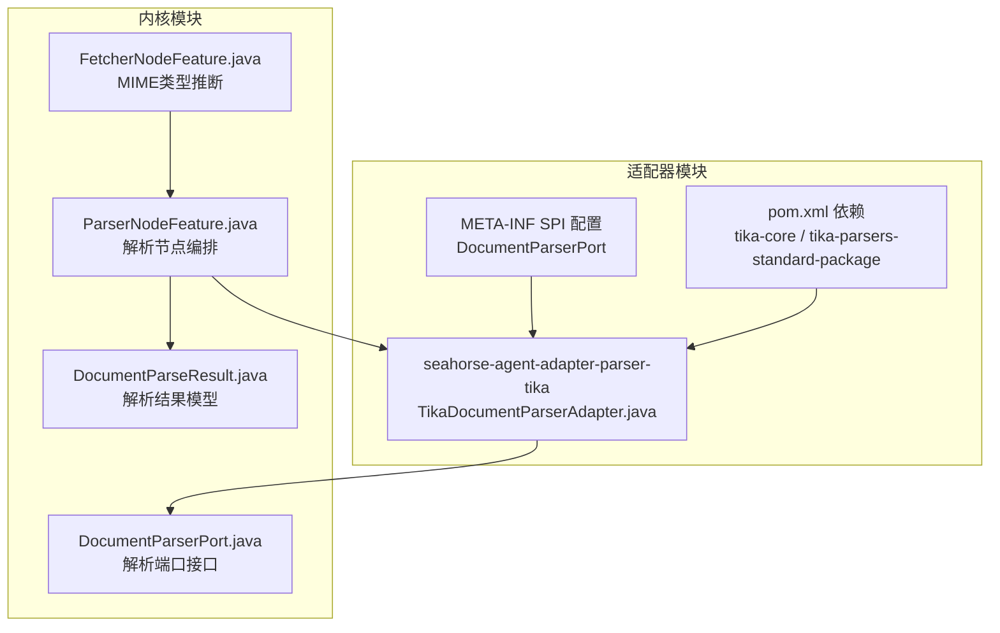
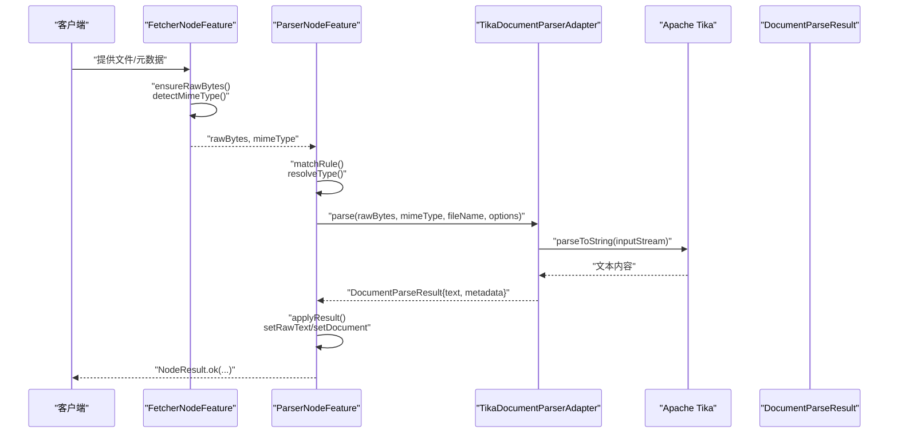
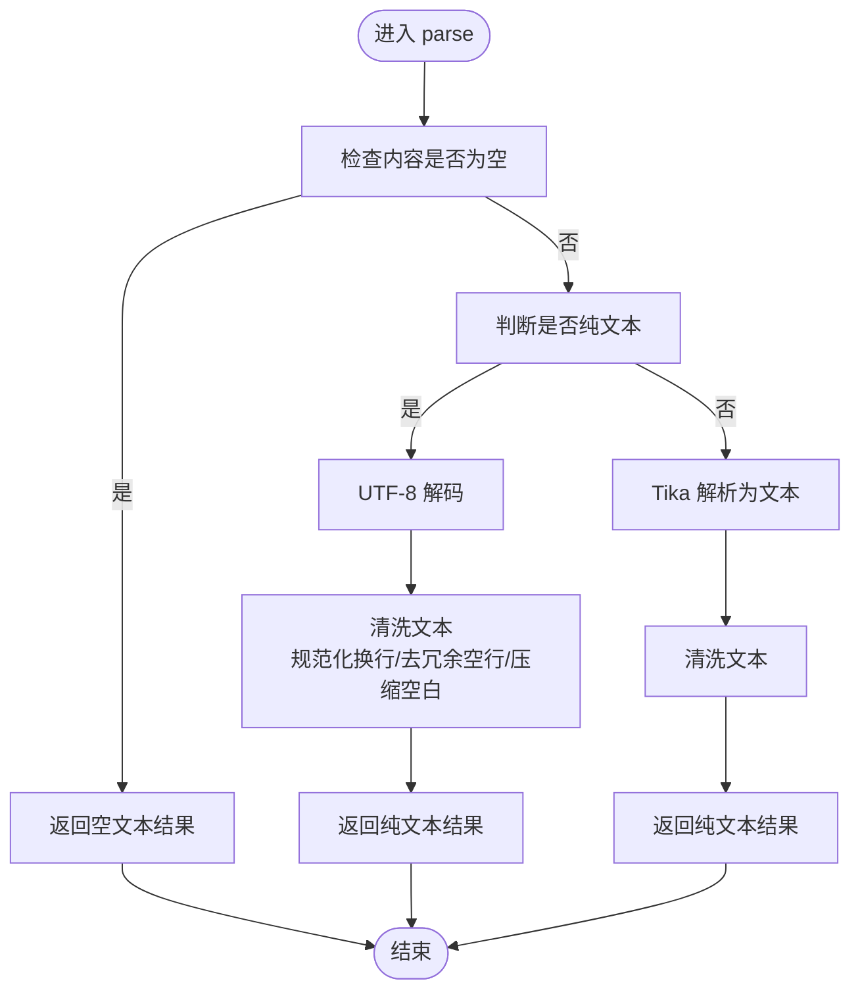
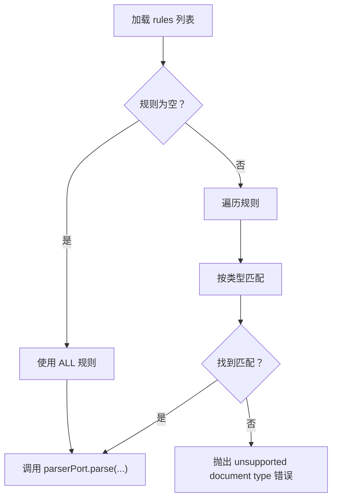
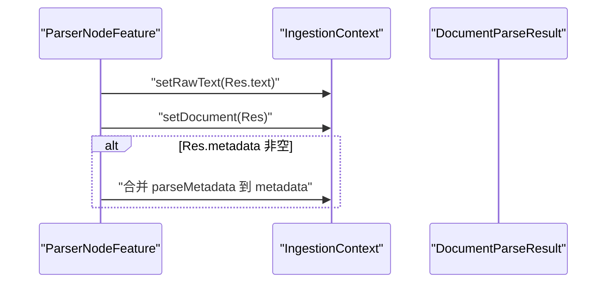
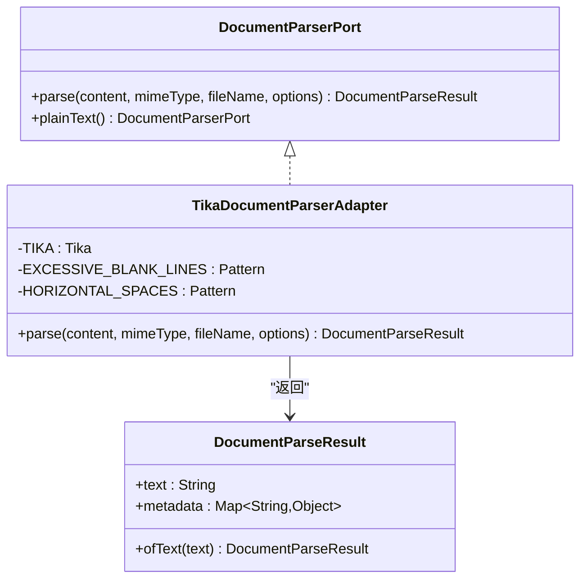

# 文档解析适配器

<cite>
**本文档引用的文件**
- [TikaDocumentParserAdapter.java](file://seahorse-agent-adapter-parser-tika/src/main/java/com/miracle/ai/seahorse/agent/adapters/parser/tika/TikaDocumentParserAdapter.java)
- [pom.xml](file://seahorse-agent-adapter-parser-tika/pom.xml)
- [DocumentParserPort.java](file://seahorse-agent-kernel/src/main/java/com/miracle/ai/seahorse/agent/ports/outbound/ingestion/DocumentParserPort.java)
- [DocumentParseResult.java](file://seahorse-agent-kernel/src/main/java/com/miracle/ai/seahorse/agent/ports/outbound/ingestion/DocumentParseResult.java)
- [ParserNodeFeature.java](file://seahorse-agent-kernel/src/main/java/com/miracle/ai/seahorse/agent/kernel/feature/ingestion/ParserNodeFeature.java)
- [FetcherNodeFeature.java](file://seahorse-agent-kernel/src/main/java/com/miracle/ai/seahorse/agent/kernel/feature/ingestion/FetcherNodeFeature.java)
- [DocumentParserPort SPI 配置](file://seahorse-agent-adapter-parser-tika/src/main/resources/META-INF/seahorse-agent/com.miracle.ai.seahorse.agent.ports.outbound.ingestion.DocumentParserPort)
- [pdf-ingestion-example.md](file://docs/examples/pdf-ingestion-example.md)
- [ParserNodeFeatureTests.java](file://seahorse-agent-tests/src/test/java/com/miracle/ai/seahorse/agent/kernel/feature/ingestion/ParserNodeFeatureTests.java)
</cite>

## 目录
1. [简介](#简介)
2. [项目结构](#项目结构)
3. [核心组件](#核心组件)
4. [架构总览](#架构总览)
5. [详细组件分析](#详细组件分析)
6. [依赖分析](#依赖分析)
7. [性能考虑](#性能考虑)
8. [故障排查指南](#故障排查指南)
9. [结论](#结论)
10. [附录](#附录)

## 简介
本技术文档围绕 Apache Tika 文档解析适配器展开，系统阐述其在 SeaHorse Agent 摄取流水线中的实现原理、使用方式与最佳实践。重点包括：
- 多格式文档的自动识别与内容提取
- 结构化处理与元数据传递机制
- 解析配置参数、字符编码处理与错误处理策略
- 性能优化建议、批量处理与质量控制方法
- 支持的文档格式范围与扩展新格式的路径

## 项目结构
Tika 解析适配器位于独立模块中，通过 SPI 向内核注册，配合内核的解析节点实现统一的摄取流程。



**图表来源**
- [TikaDocumentParserAdapter.java:35-80](file://seahorse-agent-adapter-parser-tika/src/main/java/com/miracle/ai/seahorse/agent/adapters/parser/tika/TikaDocumentParserAdapter.java#L35-L80)
- [DocumentParserPort.java:29-53](file://seahorse-agent-kernel/src/main/java/com/miracle/ai/seahorse/agent/ports/outbound/ingestion/DocumentParserPort.java#L29-L53)
- [DocumentParseResult.java:29-39](file://seahorse-agent-kernel/src/main/java/com/miracle/ai/seahorse/agent/ports/outbound/ingestion/DocumentParseResult.java#L29-L39)
- [ParserNodeFeature.java:41-85](file://seahorse-agent-kernel/src/main/java/com/miracle/ai/seahorse/agent/kernel/feature/ingestion/ParserNodeFeature.java#L41-L85)
- [FetcherNodeFeature.java:56-89](file://seahorse-agent-kernel/src/main/java/com/miracle/ai/seahorse/agent/kernel/feature/ingestion/FetcherNodeFeature.java#L56-L89)
- [DocumentParserPort SPI 配置:1-1](file://seahorse-agent-adapter-parser-tika/src/main/resources/META-INF/seahorse-agent/com.miracle.ai.seahorse.agent.ports.outbound.ingestion.DocumentParserPort#L1-L1)
- [pom.xml:18-32](file://seahorse-agent-adapter-parser-tika/pom.xml#L18-L32)

**章节来源**
- [TikaDocumentParserAdapter.java:1-80](file://seahorse-agent-adapter-parser-tika/src/main/java/com/miracle/ai/seahorse/agent/adapters/parser/tika/TikaDocumentParserAdapter.java#L1-L80)
- [pom.xml:1-34](file://seahorse-agent-adapter-parser-tika/pom.xml#L1-L34)
- [DocumentParserPort.java:1-54](file://seahorse-agent-kernel/src/main/java/com/miracle/ai/seahorse/agent/ports/outbound/ingestion/DocumentParserPort.java#L1-L54)
- [DocumentParseResult.java:1-40](file://seahorse-agent-kernel/src/main/java/com/miracle/ai/seahorse/agent/ports/outbound/ingestion/DocumentParseResult.java#L1-L40)
- [ParserNodeFeature.java:1-200](file://seahorse-agent-kernel/src/main/java/com/miracle/ai/seahorse/agent/kernel/feature/ingestion/ParserNodeFeature.java#L1-L200)
- [FetcherNodeFeature.java:52-89](file://seahorse-agent-kernel/src/main/java/com/miracle/ai/seahorse/agent/kernel/feature/ingestion/FetcherNodeFeature.java#L52-L89)
- [DocumentParserPort SPI 配置:1-1](file://seahorse-agent-adapter-parser-tika/src/main/resources/META-INF/seahorse-agent/com.miracle.ai.seahorse.agent.ports.outbound.ingestion.DocumentParserPort#L1-L1)

## 核心组件
- TikaDocumentParserAdapter：实现 DocumentParserPort 接口，负责将原始字节流解析为纯文本，并可携带元数据。
- DocumentParserPort：解析器端口接口，定义统一的 parse 方法与纯文本兜底实现。
- DocumentParseResult：解析结果模型，包含文本与元数据。
- ParserNodeFeature：解析节点，负责根据规则匹配文档类型并调用解析器。
- FetcherNodeFeature：内容拉取节点，负责确保原始字节与 MIME 类型可用，必要时进行类型推断。
- SPI 配置：通过 META-INF 注册适配器实现。

**章节来源**
- [TikaDocumentParserAdapter.java:35-80](file://seahorse-agent-adapter-parser-tika/src/main/java/com/miracle/ai/seahorse/agent/adapters/parser/tika/TikaDocumentParserAdapter.java#L35-L80)
- [DocumentParserPort.java:29-53](file://seahorse-agent-kernel/src/main/java/com/miracle/ai/seahorse/agent/ports/outbound/ingestion/DocumentParserPort.java#L29-L53)
- [DocumentParseResult.java:29-39](file://seahorse-agent-kernel/src/main/java/com/miracle/ai/seahorse/agent/ports/outbound/ingestion/DocumentParseResult.java#L29-L39)
- [ParserNodeFeature.java:41-85](file://seahorse-agent-kernel/src/main/java/com/miracle/ai/seahorse/agent/kernel/feature/ingestion/ParserNodeFeature.java#L41-L85)
- [FetcherNodeFeature.java:56-89](file://seahorse-agent-kernel/src/main/java/com/miracle/ai/seahorse/agent/kernel/feature/ingestion/FetcherNodeFeature.java#L56-L89)
- [DocumentParserPort SPI 配置:1-1](file://seahorse-agent-adapter-parser-tika/src/main/resources/META-INF/seahorse-agent/com.miracle.ai.seahorse.agent.ports.outbound.ingestion.DocumentParserPort#L1-L1)

## 架构总览
解析流程从 fetcher 获取原始字节与 MIME 类型，进入 parser 节点，依据规则选择对应解析器，最终产出纯文本与可选元数据，供后续增强、分块与索引阶段使用。



**图表来源**
- [FetcherNodeFeature.java:77-89](file://seahorse-agent-kernel/src/main/java/com/miracle/ai/seahorse/agent/kernel/feature/ingestion/FetcherNodeFeature.java#L77-L89)
- [ParserNodeFeature.java:70-85](file://seahorse-agent-kernel/src/main/java/com/miracle/ai/seahorse/agent/kernel/feature/ingestion/ParserNodeFeature.java#L70-L85)
- [TikaDocumentParserAdapter.java:41-51](file://seahorse-agent-adapter-parser-tika/src/main/java/com/miracle/ai/seahorse/agent/adapters/parser/tika/TikaDocumentParserAdapter.java#L41-L51)
- [DocumentParseResult.java:29-39](file://seahorse-agent-kernel/src/main/java/com/miracle/ai/seahorse/agent/ports/outbound/ingestion/DocumentParseResult.java#L29-L39)

## 详细组件分析

### TikaDocumentParserAdapter 实现原理
- 输入预处理：空内容返回空文本；非空内容进入类型判断。
- 纯文本分支：直接按 UTF-8 解码并进行空白清理。
- 非纯文本分支：委托 Apache Tika 进行解析，随后进行文本清洗。
- 文本清洗：规范化换行符、去除多余空行、压缩水平空白。
- 异常处理：解析异常包装为不可恢复错误，便于上层节点失败回滚。



**图表来源**
- [TikaDocumentParserAdapter.java:41-78](file://seahorse-agent-adapter-parser-tika/src/main/java/com/miracle/ai/seahorse/agent/adapters/parser/tika/TikaDocumentParserAdapter.java#L41-L78)

**章节来源**
- [TikaDocumentParserAdapter.java:35-80](file://seahorse-agent-adapter-parser-tika/src/main/java/com/miracle/ai/seahorse/agent/adapters/parser/tika/TikaDocumentParserAdapter.java#L35-L80)

### 解析节点与规则匹配
- 规则来源：节点配置 settings.rules 数组，每条规则包含 mimeType 与 options。
- 类型解析：优先基于文件名后缀，其次基于 MIME 类型字符串匹配。
- 类型归一化：支持多种别名（如 DOC/DOCX/WORD），统一映射到内部枚举。
- 匹配策略：未配置规则时视为“全部”匹配；否则必须显式匹配，不匹配则报错。



**图表来源**
- [ParserNodeFeature.java:87-124](file://seahorse-agent-kernel/src/main/java/com/miracle/ai/seahorse/agent/kernel/feature/ingestion/ParserNodeFeature.java#L87-L124)
- [ParserNodeFeature.java:126-191](file://seahorse-agent-kernel/src/main/java/com/miracle/ai/seahorse/agent/kernel/feature/ingestion/ParserNodeFeature.java#L126-L191)

**章节来源**
- [ParserNodeFeature.java:87-191](file://seahorse-agent-kernel/src/main/java/com/miracle/ai/seahorse/agent/kernel/feature/ingestion/ParserNodeFeature.java#L87-L191)
- [ParserNodeFeatureTests.java:53-73](file://seahorse-agent-tests/src/test/java/com/miracle/ai/seahorse/agent/kernel/feature/ingestion/ParserNodeFeatureTests.java#L53-L73)

### 结果应用与元数据传递
- 将解析文本写入上下文 rawText。
- 将完整 DocumentParseResult 写入上下文 document。
- 若存在元数据，合并到上下文 metadata 的 parseMetadata 键下，便于下游使用。



**图表来源**
- [ParserNodeFeature.java:193-201](file://seahorse-agent-kernel/src/main/java/com/miracle/ai/seahorse/agent/kernel/feature/ingestion/ParserNodeFeature.java#L193-L201)

**章节来源**
- [ParserNodeFeature.java:193-201](file://seahorse-agent-kernel/src/main/java/com/miracle/ai/seahorse/agent/kernel/feature/ingestion/ParserNodeFeature.java#L193-L201)

### 接口契约与扩展点
- DocumentParserPort：统一的解析入口，支持纯文本兜底实现。
- DocumentParseResult：承载文本与元数据，保证非空约束。
- SPI 注册：通过 META-INF 配置文件声明实现类，便于运行时发现。



**图表来源**
- [DocumentParserPort.java:29-53](file://seahorse-agent-kernel/src/main/java/com/miracle/ai/seahorse/agent/ports/outbound/ingestion/DocumentParserPort.java#L29-L53)
- [TikaDocumentParserAdapter.java:35-80](file://seahorse-agent-adapter-parser-tika/src/main/java/com/miracle/ai/seahorse/agent/adapters/parser/tika/TikaDocumentParserAdapter.java#L35-L80)
- [DocumentParseResult.java:29-39](file://seahorse-agent-kernel/src/main/java/com/miracle/ai/seahorse/agent/ports/outbound/ingestion/DocumentParseResult.java#L29-L39)

**章节来源**
- [DocumentParserPort.java:29-53](file://seahorse-agent-kernel/src/main/java/com/miracle/ai/seahorse/agent/ports/outbound/ingestion/DocumentParserPort.java#L29-L53)
- [DocumentParseResult.java:29-39](file://seahorse-agent-kernel/src/main/java/com/miracle/ai/seahorse/agent/ports/outbound/ingestion/DocumentParseResult.java#L29-L39)
- [DocumentParserPort SPI 配置:1-1](file://seahorse-agent-adapter-parser-tika/src/main/resources/META-INF/seahorse-agent/com.miracle.ai.seahorse.agent.ports.outbound.ingestion.DocumentParserPort#L1-L1)

## 依赖分析
- 适配器模块依赖内核接口与 Apache Tika 核心与标准解析包。
- 内核解析节点依赖 DocumentParserPort 接口，实现解耦。
- SPI 机制使解析器可插拔替换。

```mermaid
graph LR
Kernel["seahorse-agent-kernel"] <- --> Port["DocumentParserPort"]
Adapter["seahorse-agent-adapter-parser-tika"] --> Port
Adapter --> TikaCore["tika-core"]
Adapter --> TikaStd["tika-parsers-standard-package"]
```

**图表来源**
- [pom.xml:18-32](file://seahorse-agent-adapter-parser-tika/pom.xml#L18-L32)
- [DocumentParserPort.java:29-53](file://seahorse-agent-kernel/src/main/java/com/miracle/ai/seahorse/agent/ports/outbound/ingestion/DocumentParserPort.java#L29-L53)

**章节来源**
- [pom.xml:18-32](file://seahorse-agent-adapter-parser-tika/pom.xml#L18-L32)

## 性能考虑
- 流式输入：解析过程以 ByteArrayInputStream 方式读取，避免额外拷贝。
- 文本清洗：采用正则预处理，减少后续处理负担；注意对超长文档的内存占用。
- 并发与批处理：建议在上游 fetcher 节点或外部调度层进行并发控制，避免单机资源瓶颈。
- 缓存与复用：Tika 实例为静态共享，降低对象创建成本。
- 失败快速返回：空内容与纯文本路径短路，提升吞吐。

[本节为通用性能建议，无需特定文件引用]

## 故障排查指南
- unsupported document type：当规则列表存在但无匹配项时触发，需检查规则的 mimeType 是否与实际类型一致。
- Tika 解析失败：解析异常会被包装为不可恢复错误，建议检查文件完整性与格式支持范围。
- MIME 类型缺失：Fetcher 节点会在必要时进行类型推断，若仍为空，需确认文件名后缀或上游传参。
- 元数据丢失：确认解析器是否返回了 metadata，以及 Parser 节点是否正确合并到上下文。

**章节来源**
- [ParserNodeFeatureTests.java:53-73](file://seahorse-agent-tests/src/test/java/com/miracle/ai/seahorse/agent/kernel/feature/ingestion/ParserNodeFeatureTests.java#L53-L73)
- [ParserNodeFeature.java:115-124](file://seahorse-agent-kernel/src/main/java/com/miracle/ai/seahorse/agent/kernel/feature/ingestion/ParserNodeFeature.java#L115-L124)
- [TikaDocumentParserAdapter.java:53-58](file://seahorse-agent-adapter-parser-tika/src/main/java/com/miracle/ai/seahorse/agent/adapters/parser/tika/TikaDocumentParserAdapter.java#L53-L58)
- [FetcherNodeFeature.java:77-89](file://seahorse-agent-kernel/src/main/java/com/miracle/ai/seahorse/agent/kernel/feature/ingestion/FetcherNodeFeature.java#L77-L89)

## 结论
Tika 文档解析适配器通过简洁的接口与规则驱动的类型匹配，实现了对多格式文档的自动识别与内容提取。结合内核解析节点的结构化处理与元数据传递机制，能够稳定支撑从 PDF、Word、Excel、PPT 到 Markdown、纯文本等常见格式的摄取流水线。通过合理配置规则、优化批处理与错误处理策略，可在保证解析精度的同时获得良好的吞吐表现。

[本节为总结性内容，无需特定文件引用]

## 附录

### 支持的文档格式与识别逻辑
- 文件名后缀识别：.pdf/.md/.markdown/.doc/.docx/.xls/.xlsx/.ppt/.pptx/.txt。
- MIME 类型识别：包含 pdf/markdown/word/excel/powerpoint/text/* 等关键词。
- 类型归一化：支持多种别名映射到统一枚举（如 DOC/DOCX/WORD → WORD）。

**章节来源**
- [ParserNodeFeature.java:134-178](file://seahorse-agent-kernel/src/main/java/com/miracle/ai/seahorse/agent/kernel/feature/ingestion/ParserNodeFeature.java#L134-L178)
- [ParserNodeFeature.java:180-191](file://seahorse-agent-kernel/src/main/java/com/miracle/ai/seahorse/agent/kernel/feature/ingestion/ParserNodeFeature.java#L180-L191)

### 使用示例与最佳实践
- 在解析节点配置 rules，明确指定 mimeType 与 options。
- 对于未知类型，可留空规则或使用 ALL 以启用兜底行为。
- 通过元数据键 parseMetadata 访问解析器返回的元数据。

**章节来源**
- [pdf-ingestion-example.md:267-273](file://docs/examples/pdf-ingestion-example.md#L267-L273)
- [ParserNodeFeature.java:193-201](file://seahorse-agent-kernel/src/main/java/com/miracle/ai/seahorse/agent/kernel/feature/ingestion/ParserNodeFeature.java#L193-L201)

### 扩展与自定义
- 新增解析器：实现 DocumentParserPort 接口并在 SPI 配置文件中注册。
- 自定义清洗策略：可在适配器中扩展 cleanup 逻辑以满足业务需求。
- 配置参数：通过规则 options 传递给解析器，用于控制解析行为（如页码、语言等，视具体解析器而定）。

**章节来源**
- [DocumentParserPort.java:47-52](file://seahorse-agent-kernel/src/main/java/com/miracle/ai/seahorse/agent/ports/outbound/ingestion/DocumentParserPort.java#L47-L52)
- [DocumentParserPort SPI 配置:1-1](file://seahorse-agent-adapter-parser-tika/src/main/resources/META-INF/seahorse-agent/com.miracle.ai.seahorse.agent.ports.outbound.ingestion.DocumentParserPort#L1-L1)