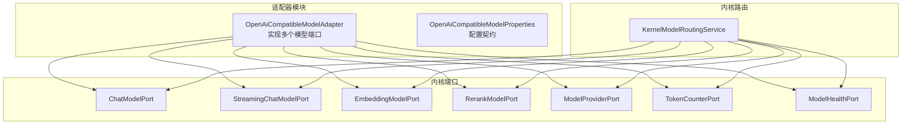
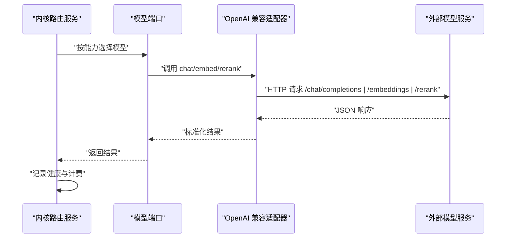
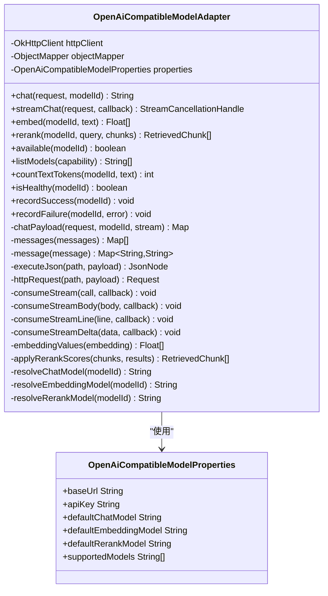
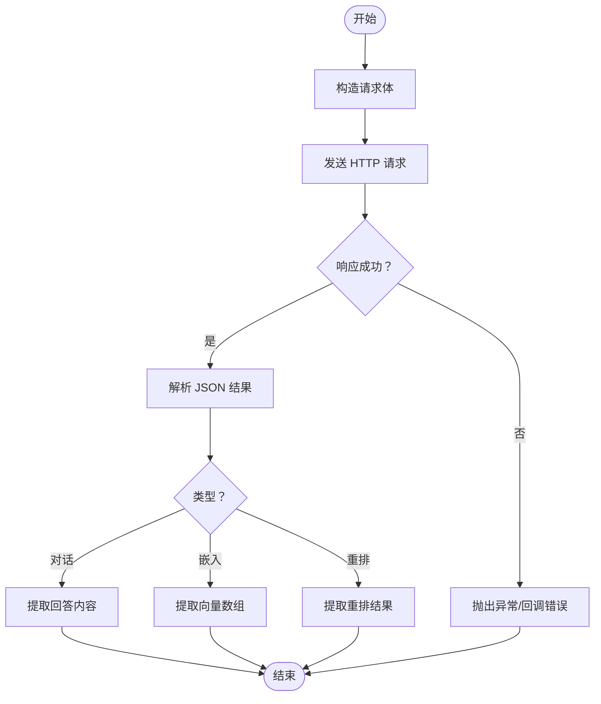
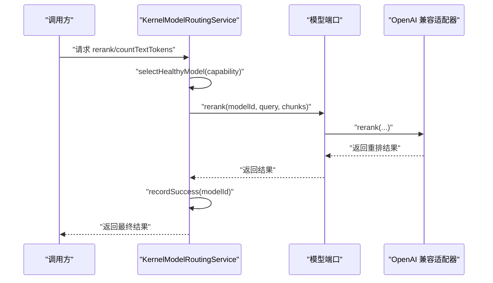
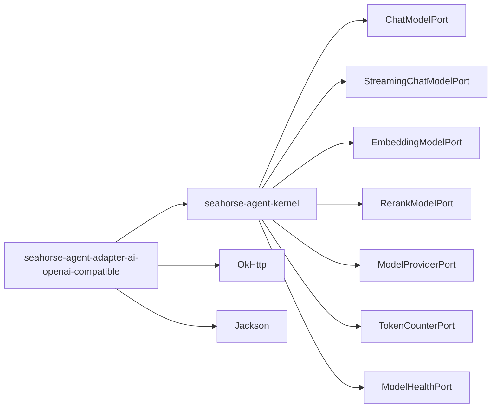

# 模型适配器

<cite>
**本文引用的文件**
- [OpenAiCompatibleModelAdapter.java](file://seahorse-agent-adapter-ai-openai-compatible/src/main/java/com/miracle/ai/seahorse/agent/adapters/ai/openai/OpenAiCompatibleModelAdapter.java)
- [OpenAiCompatibleModelProperties.java](file://seahorse-agent-adapter-ai-openai-compatible/src/main/java/com/miracle/ai/seahorse/agent/adapters/ai/openai/OpenAiCompatibleModelProperties.java)
- [pom.xml（OpenAI 兼容适配器模块）](file://seahorse-agent-adapter-ai-openai-compatible/pom.xml)
- [ChatModelPort.java](file://seahorse-agent-kernel/src/main/java/com/miracle/ai/seahorse/agent/ports/outbound/model/ChatModelPort.java)
- [StreamingChatModelPort.java](file://seahorse-agent-kernel/src/main/java/com/miracle/ai/seahorse/agent/ports/outbound/model/StreamingChatModelPort.java)
- [EmbeddingModelPort.java](file://seahorse-agent-kernel/src/main/java/com/miracle/ai/seahorse/agent/ports/outbound/model/EmbeddingModelPort.java)
- [RerankModelPort.java](file://seahorse-agent-kernel/src/main/java/com/miracle/ai/seahorse/agent/ports/outbound/model/RerankModelPort.java)
- [ModelProviderPort.java](file://seahorse-agent-kernel/src/main/java/com/miracle/ai/seahorse/agent/ports/outbound/model/ModelProviderPort.java)
- [TokenCounterPort.java](file://seahorse-agent-kernel/src/main/java/com/miracle/ai/seahorse/agent/ports/outbound/model/TokenCounterPort.java)
- [ModelHealthPort.java](file://seahorse-agent-kernel/src/main/java/com/miracle/ai/seahorse/agent/ports/outbound/model/ModelHealthPort.java)
- [KernelModelRoutingService.java](file://seahorse-agent-kernel/src/main/java/com/miracle/ai/seahorse/agent/kernel/application/model/KernelModelRoutingService.java)
- [AgentAdapterProperties.java](file://seahorse-agent-spring-boot-starter/src/main/java/com/miracle/ai/seahorse/agent/adapters/spring/config/AgentAdapterProperties.java)
- [application.properties（Spring Boot 启动器）](file://seahorse-agent-spring-boot-starter/src/main/resources/application.properties)
</cite>

## 目录
1. [简介](#简介)
2. [项目结构](#项目结构)
3. [核心组件](#核心组件)
4. [架构总览](#架构总览)
5. [详细组件分析](#详细组件分析)
6. [依赖分析](#依赖分析)
7. [性能考虑](#性能考虑)
8. [故障排查指南](#故障排查指南)
9. [结论](#结论)
10. [附录](#附录)

## 简介
本技术文档聚焦于“OpenAI 兼容模型适配器”的实现原理与配置方法，系统性阐述大语言模型（LLM）、嵌入模型（Embedding）与重排序模型（Rerank）的统一接口设计，以及在内核中的路由与健康监控机制。文档还提供参数配置、API 调用与响应处理流程图解，并给出性能优化、并发控制、错误重试策略、健康检查与监控指标、成本控制方法，以及如何集成不同 AI 服务提供商与自定义模型适配器的开发指南。

## 项目结构
OpenAI 兼容适配器位于独立模块中，通过 OkHttp 发起 HTTP 请求，使用 Jackson 解析 JSON 响应；内核提供统一的模型端口抽象，路由服务负责选择可用模型并记录健康状态。

图表来源
- [OpenAiCompatibleModelAdapter.java:60-82](file://seahorse-agent-adapter-ai-openai-compatible/src/main/java/com/miracle/ai/seahorse/agent/adapters/ai/openai/OpenAiCompatibleModelAdapter.java#L60-L82)
- [OpenAiCompatibleModelProperties.java:33-51](file://seahorse-agent-adapter-ai-openai-compatible/src/main/java/com/miracle/ai/seahorse/agent/adapters/ai/openai/OpenAiCompatibleModelProperties.java#L33-L51)
- [ChatModelPort.java:30-58](file://seahorse-agent-kernel/src/main/java/com/miracle/ai/seahorse/agent/ports/outbound/model/ChatModelPort.java#L30-L58)
- [StreamingChatModelPort.java:29-49](file://seahorse-agent-kernel/src/main/java/com/miracle/ai/seahorse/agent/ports/outbound/model/StreamingChatModelPort.java#L29-L49)
- [EmbeddingModelPort.java:27-46](file://seahorse-agent-kernel/src/main/java/com/miracle/ai/seahorse/agent/ports/outbound/model/EmbeddingModelPort.java#L27-L46)
- [RerankModelPort.java:29-49](file://seahorse-agent-kernel/src/main/java/com/miracle/ai/seahorse/agent/ports/outbound/model/RerankModelPort.java#L29-L49)
- [ModelProviderPort.java:27-63](file://seahorse-agent-kernel/src/main/java/com/miracle/ai/seahorse/agent/ports/outbound/model/ModelProviderPort.java#L27-L63)
- [TokenCounterPort.java:28-51](file://seahorse-agent-kernel/src/main/java/com/miracle/ai/seahorse/agent/ports/outbound/model/TokenCounterPort.java#L28-L51)
- [ModelHealthPort.java:23-47](file://seahorse-agent-kernel/src/main/java/com/miracle/ai/seahorse/agent/ports/outbound/model/ModelHealthPort.java#L23-L47)
- [KernelModelRoutingService.java:57-153](file://seahorse-agent-kernel/src/main/java/com/miracle/ai/seahorse/agent/kernel/application/model/KernelModelRoutingService.java#L57-L153)

章节来源
- [OpenAiCompatibleModelAdapter.java:1-383](file://seahorse-agent-adapter-ai-openai-compatible/src/main/java/com/miracle/ai/seahorse/agent/adapters/ai/openai/OpenAiCompatibleModelAdapter.java#L1-L383)
- [OpenAiCompatibleModelProperties.java:1-69](file://seahorse-agent-adapter-ai-openai-compatible/src/main/java/com/miracle/ai/seahorse/agent/adapters/ai/openai/OpenAiCompatibleModelProperties.java#L1-L69)
- [pom.xml（OpenAI 兼容适配器模块）:1-34](file://seahorse-agent-adapter-ai-openai-compatible/pom.xml#L1-L34)
- [KernelModelRoutingService.java:57-153](file://seahorse-agent-kernel/src/main/java/com/miracle/ai/seahorse/agent/kernel/application/model/KernelModelRoutingService.java#L57-L153)

## 核心组件
- 统一接口设计：内核定义了对话、流式对话、嵌入、重排、模型提供方、Token 计数与健康状态等端口，屏蔽具体供应商差异。
- OpenAI 兼容适配器：实现上述端口，封装 HTTP 请求、SSE 流式解析、响应字段提取与错误处理。
- 路由与健康：内核路由服务根据能力与健康状态选择模型，记录成功/失败事件，便于后续优化与告警。

章节来源
- [ChatModelPort.java:30-58](file://seahorse-agent-kernel/src/main/java/com/miracle/ai/seahorse/agent/ports/outbound/model/ChatModelPort.java#L30-L58)
- [StreamingChatModelPort.java:29-49](file://seahorse-agent-kernel/src/main/java/com/miracle/ai/seahorse/agent/ports/outbound/model/StreamingChatModelPort.java#L29-L49)
- [EmbeddingModelPort.java:27-46](file://seahorse-agent-kernel/src/main/java/com/miracle/ai/seahorse/agent/ports/outbound/model/EmbeddingModelPort.java#L27-L46)
- [RerankModelPort.java:29-49](file://seahorse-agent-kernel/src/main/java/com/miracle/ai/seahorse/agent/ports/outbound/model/RerankModelPort.java#L29-L49)
- [ModelProviderPort.java:27-63](file://seahorse-agent-kernel/src/main/java/com/miracle/ai/seahorse/agent/ports/outbound/model/ModelProviderPort.java#L27-L63)
- [TokenCounterPort.java:28-51](file://seahorse-agent-kernel/src/main/java/com/miracle/ai/seahorse/agent/ports/outbound/model/TokenCounterPort.java#L28-L51)
- [ModelHealthPort.java:23-47](file://seahorse-agent-kernel/src/main/java/com/miracle/ai/seahorse/agent/ports/outbound/model/ModelHealthPort.java#L23-L47)
- [OpenAiCompatibleModelAdapter.java:60-82](file://seahorse-agent-adapter-ai-openai-compatible/src/main/java/com/miracle/ai/seahorse/agent/adapters/ai/openai/OpenAiCompatibleModelAdapter.java#L60-L82)
- [KernelModelRoutingService.java:57-153](file://seahorse-agent-kernel/src/main/java/com/miracle/ai/seahorse/agent/kernel/application/model/KernelModelRoutingService.java#L57-L153)

## 架构总览
下图展示从内核到适配器再到外部模型服务的调用路径，以及健康与计费记录点。

图表来源
- [KernelModelRoutingService.java:134-144](file://seahorse-agent-kernel/src/main/java/com/miracle/ai/seahorse/agent/kernel/application/model/KernelModelRoutingService.java#L134-L144)
- [OpenAiCompatibleModelAdapter.java:84-127](file://seahorse-agent-adapter-ai-openai-compatible/src/main/java/com/miracle/ai/seahorse/agent/adapters/ai/openai/OpenAiCompatibleModelAdapter.java#L84-L127)
- [ChatModelPort.java:30-58](file://seahorse-agent-kernel/src/main/java/com/miracle/ai/seahorse/agent/ports/outbound/model/ChatModelPort.java#L30-L58)
- [EmbeddingModelPort.java:27-46](file://seahorse-agent-kernel/src/main/java/com/miracle/ai/seahorse/agent/ports/outbound/model/EmbeddingModelPort.java#L27-L46)
- [RerankModelPort.java:29-49](file://seahorse-agent-kernel/src/main/java/com/miracle/ai/seahorse/agent/ports/outbound/model/RerankModelPort.java#L29-L49)

## 详细组件分析

### OpenAI 兼容适配器类图

图表来源
- [OpenAiCompatibleModelAdapter.java:60-82](file://seahorse-agent-adapter-ai-openai-compatible/src/main/java/com/miracle/ai/seahorse/agent/adapters/ai/openai/OpenAiCompatibleModelAdapter.java#L60-L82)
- [OpenAiCompatibleModelAdapter.java:175-185](file://seahorse-agent-adapter-ai-openai-compatible/src/main/java/com/miracle/ai/seahorse/agent/adapters/ai/openai/OpenAiCompatibleModelAdapter.java#L175-L185)
- [OpenAiCompatibleModelAdapter.java:207-217](file://seahorse-agent-adapter-ai-openai-compatible/src/main/java/com/miracle/ai/seahorse/agent/adapters/ai/openai/OpenAiCompatibleModelAdapter.java#L207-L217)
- [OpenAiCompatibleModelAdapter.java:231-286](file://seahorse-agent-adapter-ai-openai-compatible/src/main/java/com/miracle/ai/seahorse/agent/adapters/ai/openai/OpenAiCompatibleModelAdapter.java#L231-L286)
- [OpenAiCompatibleModelAdapter.java:299-320](file://seahorse-agent-adapter-ai-openai-compatible/src/main/java/com/miracle/ai/seahorse/agent/adapters/ai/openai/OpenAiCompatibleModelAdapter.java#L299-L320)
- [OpenAiCompatibleModelAdapter.java:346-368](file://seahorse-agent-adapter-ai-openai-compatible/src/main/java/com/miracle/ai/seahorse/agent/adapters/ai/openai/OpenAiCompatibleModelAdapter.java#L346-L368)
- [OpenAiCompatibleModelProperties.java:33-51](file://seahorse-agent-adapter-ai-openai-compatible/src/main/java/com/miracle/ai/seahorse/agent/adapters/ai/openai/OpenAiCompatibleModelProperties.java#L33-L51)

章节来源
- [OpenAiCompatibleModelAdapter.java:60-383](file://seahorse-agent-adapter-ai-openai-compatible/src/main/java/com/miracle/ai/seahorse/agent/adapters/ai/openai/OpenAiCompatibleModelAdapter.java#L60-L383)
- [OpenAiCompatibleModelProperties.java:23-69](file://seahorse-agent-adapter-ai-openai-compatible/src/main/java/com/miracle/ai/seahorse/agent/adapters/ai/openai/OpenAiCompatibleModelProperties.java#L23-L69)

### 统一接口设计与职责
- 对话与流式对话：分别通过同步与 SSE 流式方式获取回答，支持取消。
- 嵌入与重排：提供向量生成与检索后重排能力，统一返回格式。
- 模型提供方与健康：暴露可用性判断与模型清单查询，便于路由与降级。
- Token 计数：提供文本与消息级别的近似计数，辅助预算与长度控制。
- 健康记录：为上层路由与观测提供成功/失败记录。

章节来源
- [ChatModelPort.java:30-58](file://seahorse-agent-kernel/src/main/java/com/miracle/ai/seahorse/agent/ports/outbound/model/ChatModelPort.java#L30-L58)
- [StreamingChatModelPort.java:29-49](file://seahorse-agent-kernel/src/main/java/com/miracle/ai/seahorse/agent/ports/outbound/model/StreamingChatModelPort.java#L29-L49)
- [EmbeddingModelPort.java:27-46](file://seahorse-agent-kernel/src/main/java/com/miracle/ai/seahorse/agent/ports/outbound/model/EmbeddingModelPort.java#L27-L46)
- [RerankModelPort.java:29-49](file://seahorse-agent-kernel/src/main/java/com/miracle/ai/seahorse/agent/ports/outbound/model/RerankModelPort.java#L29-L49)
- [ModelProviderPort.java:27-63](file://seahorse-agent-kernel/src/main/java/com/miracle/ai/seahorse/agent/ports/outbound/model/ModelProviderPort.java#L27-L63)
- [TokenCounterPort.java:28-51](file://seahorse-agent-kernel/src/main/java/com/miracle/ai/seahorse/agent/ports/outbound/model/TokenCounterPort.java#L28-L51)
- [ModelHealthPort.java:23-47](file://seahorse-agent-kernel/src/main/java/com/miracle/ai/seahorse/agent/ports/outbound/model/ModelHealthPort.java#L23-L47)

### API 调用与响应处理流程
- 非流式对话：构造请求体，发送 HTTP POST，读取 JSON 并提取内容。
- 流式对话：建立 SSE 连接，逐行解析 data 行，提取增量内容与思考内容，结束时触发完成回调。
- 嵌入与重排：分别调用对应端点，解析数组或结果集，映射回原始块并设置分数。

图表来源
- [OpenAiCompatibleModelAdapter.java:207-217](file://seahorse-agent-adapter-ai-openai-compatible/src/main/java/com/miracle/ai/seahorse/agent/adapters/ai/openai/OpenAiCompatibleModelAdapter.java#L207-L217)
- [OpenAiCompatibleModelAdapter.java:231-286](file://seahorse-agent-adapter-ai-openai-compatible/src/main/java/com/miracle/ai/seahorse/agent/adapters/ai/openai/OpenAiCompatibleModelAdapter.java#L231-L286)
- [OpenAiCompatibleModelAdapter.java:288-320](file://seahorse-agent-adapter-ai-openai-compatible/src/main/java/com/miracle/ai/seahorse/agent/adapters/ai/openai/OpenAiCompatibleModelAdapter.java#L288-L320)

章节来源
- [OpenAiCompatibleModelAdapter.java:84-127](file://seahorse-agent-adapter-ai-openai-compatible/src/main/java/com/miracle/ai/seahorse/agent/adapters/ai/openai/OpenAiCompatibleModelAdapter.java#L84-L127)
- [OpenAiCompatibleModelAdapter.java:231-286](file://seahorse-agent-adapter-ai-openai-compatible/src/main/java/com/miracle/ai/seahorse/agent/adapters/ai/openai/OpenAiCompatibleModelAdapter.java#L231-L286)

### 路由与健康记录序列

图表来源
- [KernelModelRoutingService.java:134-144](file://seahorse-agent-kernel/src/main/java/com/miracle/ai/seahorse/agent/kernel/application/model/KernelModelRoutingService.java#L134-L144)
- [RerankModelPort.java:29-49](file://seahorse-agent-kernel/src/main/java/com/miracle/ai/seahorse/agent/ports/outbound/model/RerankModelPort.java#L29-L49)
- [ModelHealthPort.java:23-47](file://seahorse-agent-kernel/src/main/java/com/miracle/ai/seahorse/agent/ports/outbound/model/ModelHealthPort.java#L23-L47)

章节来源
- [KernelModelRoutingService.java:134-144](file://seahorse-agent-kernel/src/main/java/com/miracle/ai/seahorse/agent/kernel/application/model/KernelModelRoutingService.java#L134-L144)

## 依赖分析
- 适配器模块依赖内核端口与 OkHttp/Jackson，实现 HTTP 与 JSON 处理。
- 内核路由服务组合多个端口，形成统一的模型选择与健康记录机制。

图表来源
- [pom.xml（OpenAI 兼容适配器模块）:18-32](file://seahorse-agent-adapter-ai-openai-compatible/pom.xml#L18-L32)
- [OpenAiCompatibleModelAdapter.java:60-82](file://seahorse-agent-adapter-ai-openai-compatible/src/main/java/com/miracle/ai/seahorse/agent/adapters/ai/openai/OpenAiCompatibleModelAdapter.java#L60-L82)

章节来源
- [pom.xml（OpenAI 兼容适配器模块）:18-32](file://seahorse-agent-adapter-ai-openai-compatible/pom.xml#L18-L32)

## 性能考虑
- 近似 Token 计数：使用字符码点估算，减少额外依赖与开销。
- 流式处理：SSE 增量推送，降低首字延迟，提升用户体验。
- 模型缓存与白名单：通过支持模型列表限制无效调用，减少网络往返。
- 并发与取消：流式调用返回取消句柄，便于快速释放资源。
- 建议
  - 在高并发场景下，结合连接池与超时配置，合理设置最大并发与队列长度。
  - 对长文本分段计数与分批嵌入，避免单次请求过大。
  - 使用健康检查与失败熔断，避免对不可用模型反复重试。

## 故障排查指南
- 常见错误
  - HTTP 失败：检查基础 URL、API Key、网络连通性与服务端状态码。
  - JSON 解析异常：确认响应结构与字段路径一致性。
  - SSE 流中断：关注取消与异常回调，确保客户端正确处理 DONE 标记。
- 健康与记录
  - 路由层会记录成功/失败，可用于定位模型可用性与错误趋势。
  - 若健康检查始终为否，优先检查模型白名单与默认模型配置。

章节来源
- [OpenAiCompatibleModelAdapter.java:207-217](file://seahorse-agent-adapter-ai-openai-compatible/src/main/java/com/miracle/ai/seahorse/agent/adapters/ai/openai/OpenAiCompatibleModelAdapter.java#L207-L217)
- [OpenAiCompatibleModelAdapter.java:231-243](file://seahorse-agent-adapter-ai-openai-compatible/src/main/java/com/miracle/ai/seahorse/agent/adapters/ai/openai/OpenAiCompatibleModelAdapter.java#L231-L243)
- [KernelModelRoutingService.java:134-144](file://seahorse-agent-kernel/src/main/java/com/miracle/ai/seahorse/agent/kernel/application/model/KernelModelRoutingService.java#L134-L144)

## 结论
OpenAI 兼容适配器通过统一端口抽象与清晰的调用流程，实现了对多种模型服务的一致接入。配合内核路由与健康记录机制，可在多供应商环境下实现稳定、可观测且可扩展的模型能力。建议在生产环境中结合并发控制、错误重试与成本监控，持续优化性能与稳定性。

## 附录

### 配置方法与最佳实践
- 基础配置
  - 设置基础 URL、API Key、默认模型与支持模型列表。
  - 通过 Spring Boot 属性绑定，集中管理适配器选择与参数。
- 参数映射
  - 对话参数（温度、采样、最大 token）按需传入，避免冗余字段。
  - 嵌入与重排请求体严格遵循供应商字段命名。
- 并发与重试
  - 为流式调用提供取消句柄，及时中断无用请求。
  - 对瞬时错误进行指数退避重试，避免雪崩效应。
- 健康检查与监控
  - 定期探测模型可用性，记录成功率与错误类型。
  - 将调用耗时、错误率与吞吐纳入观测体系，设定阈值告警。
- 成本控制
  - 基于 Token 近似计数与实际用量统计，设置预算上限与预警。
  - 优先使用高效模型与合理的上下文长度，减少无效调用。

章节来源
- [OpenAiCompatibleModelProperties.java:23-69](file://seahorse-agent-adapter-ai-openai-compatible/src/main/java/com/miracle/ai/seahorse/agent/adapters/ai/openai/OpenAiCompatibleModelProperties.java#L23-L69)
- [AgentAdapterProperties.java:29-57](file://seahorse-agent-spring-boot-starter/src/main/java/com/miracle/ai/seahorse/agent/adapters/spring/config/AgentAdapterProperties.java#L29-L57)
- [application.properties（Spring Boot 启动器）:1-2](file://seahorse-agent-spring-boot-starter/src/main/resources/application.properties#L1-L2)

### 自定义适配器开发指南
- 接口实现
  - 实现统一端口：对话、流式对话、嵌入、重排、提供方、Token 计数、健康。
  - 映射请求与响应：将供应商特定字段映射到标准结构。
- 集成步骤
  - 定义配置契约，注册为 Spring Bean。
  - 在路由服务中启用该适配器，配置默认模型与能力。
  - 编写健康检查与观测埋点，纳入统一监控。
- 适配器清单
  - 参考现有适配器的类图与流程图，保持一致的错误处理与日志风格。

章节来源
- [OpenAiCompatibleModelAdapter.java:60-82](file://seahorse-agent-adapter-ai-openai-compatible/src/main/java/com/miracle/ai/seahorse/agent/adapters/ai/openai/OpenAiCompatibleModelAdapter.java#L60-L82)
- [ChatModelPort.java:30-58](file://seahorse-agent-kernel/src/main/java/com/miracle/ai/seahorse/agent/ports/outbound/model/ChatModelPort.java#L30-L58)
- [StreamingChatModelPort.java:29-49](file://seahorse-agent-kernel/src/main/java/com/miracle/ai/seahorse/agent/ports/outbound/model/StreamingChatModelPort.java#L29-L49)
- [EmbeddingModelPort.java:27-46](file://seahorse-agent-kernel/src/main/java/com/miracle/ai/seahorse/agent/ports/outbound/model/EmbeddingModelPort.java#L27-L46)
- [RerankModelPort.java:29-49](file://seahorse-agent-kernel/src/main/java/com/miracle/ai/seahorse/agent/ports/outbound/model/RerankModelPort.java#L29-L49)
- [ModelProviderPort.java:27-63](file://seahorse-agent-kernel/src/main/java/com/miracle/ai/seahorse/agent/ports/outbound/model/ModelProviderPort.java#L27-L63)
- [TokenCounterPort.java:28-51](file://seahorse-agent-kernel/src/main/java/com/miracle/ai/seahorse/agent/ports/outbound/model/TokenCounterPort.java#L28-L51)
- [ModelHealthPort.java:23-47](file://seahorse-agent-kernel/src/main/java/com/miracle/ai/seahorse/agent/ports/outbound/model/ModelHealthPort.java#L23-L47)